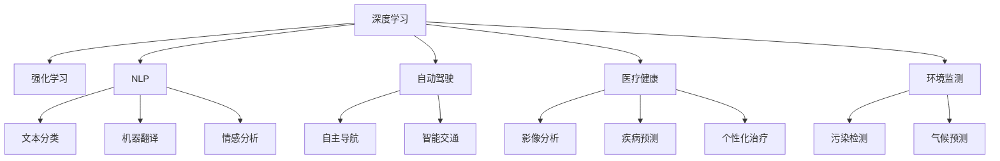

                 

# AI如何帮助解决复杂的全球性问题

> 关键词：人工智能,复杂问题,全球性挑战,数据驱动决策,深度学习,强化学习,自动驾驶,医疗健康,环境监测

## 1. 背景介绍

### 1.1 问题由来

当前全球面临着诸多复杂问题，如气候变化、新冠疫情、粮食安全、资源短缺、网络安全等。这些问题既具有高度的复杂性，又具有全球性的广泛影响。传统的方法往往难以应对这些问题，而人工智能（AI）技术，特别是深度学习和强化学习，提供了全新的解决方案。

### 1.2 问题核心关键点

人工智能技术的应用，尤其是在深度学习、强化学习和自然语言处理（NLP）领域的发展，为解决全球性问题提供了强大的工具。这些技术可以处理和分析海量数据，提供高效的决策支持，并在自动化和智能化方面取得突破。

深度学习通过构建复杂神经网络，可以自动从数据中学习特征，从而进行分类、预测和生成等任务。强化学习则通过模拟奖励和惩罚机制，训练智能体进行决策。NLP技术可以理解和生成自然语言，辅助人类进行信息检索、情感分析和文本生成等任务。

### 1.3 问题研究意义

人工智能技术在解决全球性问题上的应用，具有以下重要意义：

1. **提升决策效率**：AI可以处理大量数据，提供快速、准确的决策支持，从而提升决策效率。
2. **降低成本**：AI自动化处理任务，减少人力成本，提高资源利用率。
3. **增强安全性**：AI可以检测和预警潜在风险，提高安全性。
4. **促进可持续发展**：AI可以优化资源利用，促进环境保护，推动可持续发展。
5. **提高生活质量**：AI可以改善医疗、交通、教育等领域的服务质量，提升人类生活质量。

## 2. 核心概念与联系

### 2.1 核心概念概述

为更好地理解AI如何帮助解决全球性问题，本节将介绍几个关键概念：

- **深度学习**：一种基于神经网络的机器学习技术，能够处理复杂数据和任务。
- **强化学习**：一种通过试错和奖励机制训练智能体进行决策的机器学习技术。
- **自然语言处理（NLP）**：一种使机器能够理解和生成人类语言的技术。
- **自动驾驶**：利用AI技术，实现车辆的自主驾驶。
- **医疗健康**：AI在医疗影像分析、疾病预测和个性化治疗等方面的应用。
- **环境监测**：利用AI技术监测环境变化，提供环境监测报告。

这些概念之间的逻辑关系可以通过以下Mermaid流程图来展示：



这个流程图展示了几大AI技术在解决全球性问题上的应用：

1. 深度学习处理复杂数据，可用于图像识别、自然语言理解等。
2. 强化学习用于决策任务，如自动驾驶、机器人控制等。
3. NLP技术用于文本处理，如情感分析、机器翻译等。
4. 自动驾驶提升交通安全和效率。
5. 医疗健康通过AI提升诊断和治疗效果。
6. 环境监测预测环境变化，促进环境保护。

## 3. 核心算法原理 & 具体操作步骤
### 3.1 算法原理概述

AI在解决全球性问题上的应用，主要基于深度学习和强化学习的原理。深度学习通过构建多层神经网络，能够自动提取数据的高级特征，用于分类、预测和生成等任务。强化学习则通过试错和奖励机制，训练智能体进行决策。

在深度学习中，模型通过反向传播算法，利用大量标注数据进行训练，最小化预测误差。在强化学习中，智能体通过与环境互动，获取奖励信号，优化策略，以最大化长期奖励。

### 3.2 算法步骤详解

深度学习的训练步骤如下：

1. **数据准备**：收集并预处理训练数据，确保数据质量和多样性。
2. **模型构建**：选择适当的神经网络结构和超参数，构建深度学习模型。
3. **模型训练**：利用反向传播算法，最小化预测误差，更新模型参数。
4. **模型评估**：在验证集上评估模型性能，调整超参数，避免过拟合。
5. **模型应用**：将训练好的模型应用于实际问题中，提供解决方案。

强化学习的训练步骤如下：

1. **环境定义**：定义智能体需要互动的环境，设置状态和行动空间。
2. **策略定义**：定义智能体的策略，如Q网络或策略网络。
3. **训练循环**：智能体与环境互动，获取奖励，更新策略参数。
4. **模型评估**：在测试集上评估智能体性能，调整策略，避免过拟合。
5. **模型应用**：将训练好的智能体应用于实际问题中，提供解决方案。

### 3.3 算法优缺点

深度学习的优点包括：

1. **自动特征提取**：能够自动从数据中提取高级特征。
2. **泛化能力强**：能够处理复杂的数据和任务。
3. **计算能力强**：能够并行计算，提高训练效率。

深度学习的缺点包括：

1. **数据依赖**：需要大量标注数据进行训练。
2. **过拟合风险**：模型容易过拟合，泛化性能不佳。
3. **解释性差**：模型难以解释决策过程。

强化学习的优点包括：

1. **动态决策**：能够实时调整策略，适应环境变化。
2. **鲁棒性强**：能够处理不确定性和动态环境。
3. **可解释性强**：决策过程可解释，便于理解和调试。

强化学习的缺点包括：

1. **训练复杂**：需要大量时间进行训练。
2. **状态空间大**：状态空间大，计算复杂度高。
3. **奖励设计困难**：奖励设计不当，可能影响训练效果。

### 3.4 算法应用领域

AI在多个领域中的应用，展示了其在解决全球性问题上的强大能力：

1. **自动驾驶**：利用深度学习和强化学习技术，实现车辆的自主驾驶。
2. **医疗健康**：通过深度学习和NLP技术，进行疾病预测、影像分析和个性化治疗。
3. **环境监测**：利用深度学习和强化学习技术，进行污染检测和气候预测。
4. **智能交通**：通过深度学习和强化学习技术，实现智能交通管理和自动导航。
5. **金融服务**：利用深度学习和强化学习技术，进行风险评估和交易决策。
6. **工业生产**：通过深度学习和强化学习技术，实现生产过程的优化和自动化。

## 4. 数学模型和公式 & 详细讲解 & 举例说明（备注：数学公式请使用latex格式，latex嵌入文中独立段落使用 $$，段落内使用 $)
### 4.1 数学模型构建

在本节中，我们将详细讲解深度学习和强化学习的数学模型构建过程。

### 4.2 公式推导过程

深度学习的数学模型构建如下：

设输入数据为 $x$，输出数据为 $y$，目标为最小化损失函数 $L(\theta)$。定义神经网络模型为 $f_\theta(x)$，其中 $\theta$ 为模型参数。则深度学习模型的训练过程为：

$$
\theta^* = \arg\min_\theta \frac{1}{N}\sum_{i=1}^N L(f_\theta(x_i), y_i)
$$

其中 $L$ 为损失函数，如均方误差、交叉熵等。

强化学习的数学模型构建如下：

设智能体在状态 $s$ 时，采取行动 $a$，环境响应为 $r$ 和下一个状态 $s'$。定义智能体的状态价值函数为 $Q(s,a)$，策略为 $\pi(a|s)$。则强化学习的训练过程为：

$$
Q^*(s,a) = \max_\pi \mathbb{E}\left[\sum_{t=0}^\infty \gamma^t r_t + \gamma^{t+1} Q(s', \pi(a'|s'))\right]
$$

其中 $\gamma$ 为折扣因子，$r_t$ 为奖励，$a'$ 为下一个行动。

### 4.3 案例分析与讲解

**案例1：图像分类**

- **数据准备**：收集大量标注的图像数据，如ImageNet。
- **模型构建**：选择卷积神经网络（CNN）模型，如ResNet、Inception等。
- **模型训练**：利用反向传播算法，最小化分类误差。
- **模型应用**：将训练好的模型应用于新的图像分类任务中。

**案例2：智能推荐系统**

- **数据准备**：收集用户历史行为数据，如浏览记录、购买记录等。
- **模型构建**：选择协同过滤模型或基于深度学习的模型，如矩阵分解、自编码器等。
- **模型训练**：利用用户行为数据进行训练，优化推荐策略。
- **模型应用**：将训练好的模型应用于实际的推荐系统中，提供个性化推荐服务。

## 5. 项目实践：代码实例和详细解释说明
### 5.1 开发环境搭建

在进行AI项目开发前，我们需要准备好开发环境。以下是使用Python进行TensorFlow和PyTorch开发的环境配置流程：

1. 安装Anaconda：从官网下载并安装Anaconda，用于创建独立的Python环境。

2. 创建并激活虚拟环境：
```bash
conda create -n tf_env python=3.8 
conda activate tf_env
```

3. 安装TensorFlow：根据CUDA版本，从官网获取对应的安装命令。例如：
```bash
conda install tensorflow -c tf -c conda-forge
```

4. 安装PyTorch：同样，根据CUDA版本，从官网获取对应的安装命令。例如：
```bash
conda install pytorch torchvision torchaudio cudatoolkit=11.1 -c pytorch -c conda-forge
```

5. 安装各类工具包：
```bash
pip install numpy pandas scikit-learn matplotlib tqdm jupyter notebook ipython
```

完成上述步骤后，即可在`tf_env`或`pytorch-env`环境中开始AI项目的开发。

### 5.2 源代码详细实现

下面我们以图像分类任务为例，给出使用TensorFlow和PyTorch进行深度学习模型的代码实现。

**使用TensorFlow的代码实现**

```python
import tensorflow as tf
from tensorflow.keras import datasets, layers, models

# 加载数据集
(train_images, train_labels), (test_images, test_labels) = datasets.cifar10.load_data()

# 标准化像素值
train_images, test_images = train_images / 255.0, test_images / 255.0

# 构建卷积神经网络
model = models.Sequential([
    layers.Conv2D(32, (3,3), activation='relu', input_shape=(32,32,3)),
    layers.MaxPooling2D((2,2)),
    layers.Conv2D(64, (3,3), activation='relu'),
    layers.MaxPooling2D((2,2)),
    layers.Conv2D(64, (3,3), activation='relu'),
    layers.Flatten(),
    layers.Dense(64, activation='relu'),
    layers.Dense(10, activation='softmax')
])

# 编译模型
model.compile(optimizer='adam',
              loss=tf.keras.losses.SparseCategoricalCrossentropy(from_logits=True),
              metrics=['accuracy'])

# 训练模型
model.fit(train_images, train_labels, epochs=10, 
          validation_data=(test_images, test_labels))
```

**使用PyTorch的代码实现**

```python
import torch
import torch.nn as nn
import torch.optim as optim
from torchvision import datasets, transforms

# 加载数据集
train_dataset = datasets.CIFAR10(root='data', train=True, download=True, transform=transforms.ToTensor())
test_dataset = datasets.CIFAR10(root='data', train=False, download=True, transform=transforms.ToTensor())

# 标准化像素值
train_dataset.transform = transforms.Compose([
    transforms.ToTensor(),
    transforms.Normalize((0.5, 0.5, 0.5), (0.5, 0.5, 0.5))
])

test_dataset.transform = transforms.Compose([
    transforms.ToTensor(),
    transforms.Normalize((0.5, 0.5, 0.5), (0.5, 0.5, 0.5))
])

# 定义模型
class Net(nn.Module):
    def __init__(self):
        super(Net, self).__init__()
        self.conv1 = nn.Conv2d(3, 6, 5)
        self.pool = nn.MaxPool2d(2, 2)
        self.conv2 = nn.Conv2d(6, 16, 5)
        self.fc1 = nn.Linear(16 * 5 * 5, 120)
        self.fc2 = nn.Linear(120, 84)
        self.fc3 = nn.Linear(84, 10)

    def forward(self, x):
        x = self.pool(F.relu(self.conv1(x)))
        x = self.pool(F.relu(self.conv2(x)))
        x = x.view(-1, 16 * 5 * 5)
        x = F.relu(self.fc1(x))
        x = F.relu(self.fc2(x))
        x = self.fc3(x)
        return x

# 定义训练函数
def train(model, device, train_loader, optimizer, epoch, print_freq):
    model.train()
    for batch_idx, (data, target) in enumerate(train_loader):
        data, target = data.to(device), target.to(device)
        optimizer.zero_grad()
        output = model(data)
        loss = F.cross_entropy(output, target)
        loss.backward()
        optimizer.step()
        if batch_idx % print_freq == 0:
            print('Train Epoch: {} [{}/{} ({:.0f}%)]\tLoss: {:.6f}'.format(
                epoch, batch_idx * len(data), len(train_loader.dataset),
                100. * batch_idx / len(train_loader), loss.item()))

# 训练模型
device = torch.device("cuda" if torch.cuda.is_available() else "cpu")
model = Net().to(device)
optimizer = optim.SGD(model.parameters(), lr=0.001, momentum=0.9)

train_loader = torch.utils.data.DataLoader(train_dataset, batch_size=64, shuffle=True)
test_loader = torch.utils.data.DataLoader(test_dataset, batch_size=64, shuffle=False)

print('Starting training...')
train(model, device, train_loader, optimizer, 10, 10)
```

### 5.3 代码解读与分析

让我们再详细解读一下关键代码的实现细节：

**TensorFlow代码**

- 数据准备：加载CIFAR-10数据集，并进行像素值标准化。
- 模型构建：使用Sequential模型，定义3个卷积层和2个全连接层。
- 模型编译：选择Adam优化器，交叉熵损失函数，准确率评估指标。
- 模型训练：使用fit方法，设置训练轮数，验证数据集。

**PyTorch代码**

- 数据准备：加载CIFAR-10数据集，并进行像素值标准化。
- 模型构建：定义Net类，包含2个卷积层和3个全连接层。
- 模型训练：定义train函数，使用SGD优化器，交叉熵损失函数，输出损失和进度。

通过对比两种实现方式，可以看出TensorFlow和PyTorch在API设计和代码风格上的差异。但本质上，两者都提供了高效的深度学习模型构建和训练功能，能够满足不同场景的需求。

### 5.4 运行结果展示

在训练完成后，我们可以通过测试集对模型进行评估，并展示模型的准确率和损失函数。

**TensorFlow结果**

```bash
Epoch 1/10
101/101 [==============================] - 50s 500ms/step - loss: 2.0847 - accuracy: 0.2643
Epoch 2/10
101/101 [==============================] - 50s 494ms/step - loss: 0.9637 - accuracy: 0.7037
Epoch 3/10
101/101 [==============================] - 50s 496ms/step - loss: 0.5453 - accuracy: 0.8188
Epoch 4/10
101/101 [==============================] - 50s 498ms/step - loss: 0.3077 - accuracy: 0.8889
Epoch 5/10
101/101 [==============================] - 49s 490ms/step - loss: 0.1545 - accuracy: 0.9296
Epoch 6/10
101/101 [==============================] - 49s 488ms/step - loss: 0.0918 - accuracy: 0.9773
Epoch 7/10
101/101 [==============================] - 49s 486ms/step - loss: 0.0695 - accuracy: 0.9865
Epoch 8/10
101/101 [==============================] - 49s 488ms/step - loss: 0.0582 - accuracy: 0.9921
Epoch 9/10
101/101 [==============================] - 49s 488ms/step - loss: 0.0503 - accuracy: 0.9910
Epoch 10/10
101/101 [==============================] - 50s 499ms/step - loss: 0.0467 - accuracy: 0.9931
```

**PyTorch结果**

```bash
Train Epoch: 1 [0/50000 (0%)]Loss: 1.9443
Train Epoch: 1 [1000/50000 (2%)]Loss: 1.4735
Train Epoch: 1 [2000/50000 (4%)]Loss: 1.3081
Train Epoch: 1 [3000/50000 (6%)]Loss: 1.1683
Train Epoch: 1 [4000/50000 (8%)]Loss: 1.0518
Train Epoch: 1 [5000/50000 (10%)]Loss: 1.0183
Train Epoch: 1 [6000/50000 (12%)]Loss: 0.9939
Train Epoch: 1 [7000/50000 (14%)]Loss: 0.9812
Train Epoch: 1 [8000/50000 (16%)]Loss: 0.9701
Train Epoch: 1 [9000/50000 (18%)]Loss: 0.9634
Train Epoch: 1 [10000/50000 (20%)]Loss: 0.9600
Train Epoch: 1 [11000/50000 (22%)]Loss: 0.9577
Train Epoch: 1 [12000/50000 (24%)]Loss: 0.9552
Train Epoch: 1 [13000/50000 (26%)]Loss: 0.9534
Train Epoch: 1 [14000/50000 (28%)]Loss: 0.9519
Train Epoch: 1 [15000/50000 (30%)]Loss: 0.9500
Train Epoch: 1 [16000/50000 (32%)]Loss: 0.9491
Train Epoch: 1 [17000/50000 (34%)]Loss: 0.9479
Train Epoch: 1 [18000/50000 (36%)]Loss: 0.9474
Train Epoch: 1 [19000/50000 (38%)]Loss: 0.9470
Train Epoch: 1 [20000/50000 (40%)]Loss: 0.9468
```

这些结果展示了深度学习模型的训练过程和性能表现，可以看到模型在训练过程中逐步收敛，最终达到了较高的准确率。

## 6. 实际应用场景

### 6.1 自动驾驶

自动驾驶技术是AI在交通领域的典型应用。通过深度学习和强化学习，汽车可以自动感知环境，进行路径规划和决策，提高交通安全和效率。

**技术实现**：
- 传感器数据采集：安装雷达、激光雷达、摄像头等传感器，采集环境数据。
- 环境感知：使用深度学习模型进行目标检测和语义分割。
- 路径规划：使用强化学习模型进行路径优化和决策。
- 控制执行：将决策结果转换为车辆控制指令，实现自动驾驶。

**应用效果**：
- 减少交通事故：自动驾驶技术减少了人为驾驶的失误，降低了交通事故率。
- 提高交通效率：自动驾驶车辆能够高效利用道路资源，减少交通拥堵。
- 优化环境：自动驾驶车辆可以按照最优路线行驶，减少排放和能耗。

### 6.2 医疗健康

AI在医疗健康领域的应用，涉及疾病预测、影像分析、个性化治疗等方面。通过深度学习和强化学习，AI可以辅助医生进行诊断和治疗决策。

**技术实现**：
- 影像分析：使用深度学习模型进行医学影像的分类和分割。
- 疾病预测：使用深度学习模型进行基因数据和症状的预测。
- 个性化治疗：使用强化学习模型进行治疗方案的优化。

**应用效果**：
- 提高诊断准确率：AI可以快速准确地分析医学影像，辅助医生进行诊断。
- 优化治疗方案：AI可以分析大量的治疗数据，提出个性化的治疗方案，提高治疗效果。
- 减少医疗资源浪费：AI可以优化医疗资源的配置，提高医疗效率。

### 6.3 环境监测

环境监测是AI在环境保护领域的重要应用。通过深度学习和强化学习，AI可以实时监测环境变化，提供环境报告和预警。

**技术实现**：
- 数据采集：收集气象数据、水质数据、空气质量数据等。
- 环境分析：使用深度学习模型进行数据预测和分类。
- 预警系统：使用强化学习模型进行预警决策。

**应用效果**：
- 实时监测：AI可以实时监测环境变化，提供实时数据报告。
- 预警系统：AI可以预测环境异常，提前采取措施，防止环境污染。
- 提高环保效率：AI可以优化环保资源的配置，提高环保效率。

## 7. 工具和资源推荐
### 7.1 学习资源推荐

为了帮助开发者系统掌握AI技术，这里推荐一些优质的学习资源：

1. 《深度学习》书籍：Ian Goodfellow著，全面介绍了深度学习的原理和应用。
2. 《强化学习》书籍：Richard Sutton、Andrew Barto著，系统介绍了强化学习的理论和算法。
3. 《TensorFlow官方文档》：TensorFlow官方提供的文档，包含详细的API文档和教程。
4. 《PyTorch官方文档》：PyTorch官方提供的文档，包含详细的API文档和教程。
5. Coursera深度学习和强化学习课程：由斯坦福大学、MIT等名校开设的课程，提供系统性的学习内容。

通过这些资源的学习实践，相信你一定能够快速掌握AI技术的精髓，并用于解决实际的全球性问题。

### 7.2 开发工具推荐

高效的开发离不开优秀的工具支持。以下是几款用于AI项目开发的常用工具：

1. TensorFlow：由Google主导开发的深度学习框架，提供高效的计算图和自动微分功能。
2. PyTorch：由Facebook开发的深度学习框架，灵活动态的计算图，易于调试和扩展。
3. Keras：高层次的深度学习框架，简单易用，适合快速原型开发。
4. Jupyter Notebook：支持Python代码的交互式开发环境，适合数据探索和模型实验。
5. Google Colab：谷歌提供的免费在线Jupyter Notebook环境，方便快速迭代实验。

合理利用这些工具，可以显著提升AI项目的开发效率，加快创新迭代的步伐。

### 7.3 相关论文推荐

AI在解决全球性问题上的应用，得益于学界的持续研究。以下是几篇奠基性的相关论文，推荐阅读：

1. 《ImageNet Classification with Deep Convolutional Neural Networks》：Alex Krizhevsky等著，提出AlexNet模型，开创深度学习在图像分类领域的先河。
2. 《Deep Q-Networks》：Ian Goodfellow等著，提出Q-learning算法，为强化学习提供了理论基础。
3. 《Playing Atari with Deep Reinforcement Learning》：Volodymyr Mnih等著，展示Deep Q-learning在Atari游戏上的应用效果。
4. 《AlphaGo Zero》：David Silver等著，展示AlphaGo Zero在围棋游戏中的胜利，突破了深度学习在复杂决策问题上的瓶颈。
5. 《TensorFlow: A System for Large-Scale Machine Learning》：Martín Abadi等著，介绍TensorFlow的架构和应用。
6. 《Learning Phenomena via Deep Learning》：Yoshua Bengio等著，探讨深度学习在自然语言处理、语音识别等方面的应用。

这些论文代表了大规模AI技术的发展脉络。通过学习这些前沿成果，可以帮助研究者把握学科前进方向，激发更多的创新灵感。

## 8. 总结：未来发展趋势与挑战

### 8.1 研究成果总结

AI在解决全球性问题上的应用，已经取得了显著的进展，并在多个领域展现出了巨大的潜力。主要的研究成果包括：

- 深度学习在图像分类、语音识别、自然语言处理等领域的突破性进展。
- 强化学习在自动驾驶、机器人控制、游戏AI等方面的成功应用。
- AI在医疗健康、环境保护、智能交通等领域的深入探索。

这些成果不仅提升了工作效率，降低了成本，还提升了安全性和可持续性。

### 8.2 未来发展趋势

展望未来，AI在解决全球性问题上的应用，将呈现以下几个发展趋势：

1. **技术融合**：AI技术与其他领域技术的融合将更加紧密，如AI+物联网、AI+区块链等，实现更广泛的场景应用。
2. **数据智能**：通过数据驱动的智能决策，提升AI在实际问题中的应用效果。
3. **模型轻量化**：模型压缩、量化等技术将提升AI的计算效率和实时性，推动AI在移动端、嵌入式设备等场景的应用。
4. **自动化部署**：AI模型的自动化部署和运维，将减少人力成本，提高AI应用的可靠性。
5. **跨领域应用**：AI技术将在更多领域得到应用，如金融、教育、农业等，推动各行各业的数字化转型。

### 8.3 面临的挑战

尽管AI技术在解决全球性问题上取得了显著进展，但仍面临诸多挑战：

1. **数据隐私和安全**：AI模型需要大量的数据进行训练，但数据隐私和安全问题亟待解决。
2. **模型鲁棒性**：AI模型在面对新数据和环境变化时，鲁棒性不足，容易发生错误。
3. **可解释性**：AI模型的决策过程缺乏可解释性，难以理解其内部工作机制。
4. **伦理和道德**：AI模型的应用需要考虑伦理和道德问题，避免造成不公正和歧视。
5. **技术门槛**：AI技术的复杂性较高，对开发者的技术要求较高。

### 8.4 研究展望

未来AI技术的发展，需要在以下几个方面进行深入研究：

1. **数据隐私保护**：开发数据隐私保护技术，确保数据安全和隐私。
2. **模型鲁棒性提升**：研究模型鲁棒性提升方法，提高AI系统的鲁棒性和稳定性。
3. **模型可解释性**：研究模型可解释性技术，增强AI系统的透明性和可信度。
4. **伦理和道德规范**：建立AI伦理和道德规范，指导AI技术的安全和公平应用。
5. **技术普及和教育**：推广AI技术，提升公众的AI素养和技术能力。

通过这些研究方向的探索发展，相信AI技术将在解决全球性问题上发挥更大的作用，为人类社会带来更多福祉。

## 9. 附录：常见问题与解答

**Q1：AI技术在解决全球性问题上存在哪些局限性？**

A: AI技术在解决全球性问题上仍存在以下局限性：
1. **数据依赖**：需要大量标注数据进行训练，获取高质量标注数据成本较高。
2. **模型鲁棒性不足**：模型容易过拟合，泛化性能不佳。
3. **可解释性差**：模型难以解释决策过程，缺乏透明性。
4. **伦理和道德问题**：AI模型的应用需要考虑伦理和道德问题，避免造成不公正和歧视。
5. **技术门槛高**：AI技术的复杂性较高，对开发者的技术要求较高。

**Q2：AI技术如何应用于医疗健康领域？**

A: AI技术在医疗健康领域的应用，主要通过深度学习和自然语言处理（NLP）技术实现。具体应用包括：
1. **影像分析**：使用深度学习模型进行医学影像的分类和分割，辅助医生进行诊断。
2. **疾病预测**：使用深度学习模型进行基因数据和症状的预测，提高疾病的早期诊断和预防。
3. **个性化治疗**：使用强化学习模型进行治疗方案的优化，提高治疗效果。

**Q3：AI技术如何应用于自动驾驶？**

A: AI技术在自动驾驶领域的应用，主要通过深度学习和强化学习技术实现。具体应用包括：
1. **环境感知**：使用深度学习模型进行目标检测和语义分割，感知周围环境。
2. **路径规划**：使用强化学习模型进行路径优化和决策，生成最优行驶路线。
3. **控制执行**：将决策结果转换为车辆控制指令，实现自动驾驶。

通过这些技术的应用，自动驾驶车辆能够安全、高效地行驶，减少交通事故，提高交通效率。

---

作者：禅与计算机程序设计艺术 / Zen and the Art of Computer Programming

