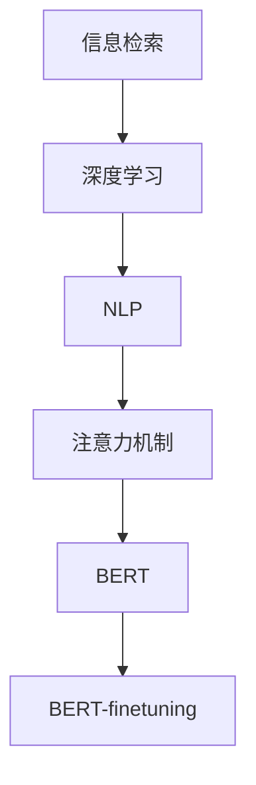

                 

## 1. 背景介绍

随着信息时代的到来，海量数据的涌现给信息的检索、组织和应用带来了巨大的挑战。传统的基于关键词的文本检索方法已难以满足用户的检索需求。特别是在自然语言处理(NLP)领域，如何构建高效、准确、智能化的信息检索系统，成为科技公司竞相攻关的热点。AI技术，尤其是深度学习和自然语言处理技术，为信息检索效率的提升提供了新的方向。本文将详细介绍AI技术如何通过深度学习、自然语言理解和信息检索算法，提升信息检索的效率。

## 2. 核心概念与联系

### 2.1 核心概念概述

在讨论AI如何提高信息检索效率之前，首先需要了解几个关键概念：

- **信息检索（Information Retrieval, IR）**：是帮助用户从大量信息源中查找相关信息的技术。它的目标是通过用户输入的查询，返回最相关的信息。
- **深度学习（Deep Learning, DL）**：一种基于神经网络的机器学习方法，能够自动学习输入数据的特征表示，进行复杂的模式识别和决策。
- **自然语言处理（Natural Language Processing, NLP）**：涉及计算机对人类语言理解和生成，旨在构建更智能化的信息检索系统。
- **注意力机制（Attention Mechanism）**：在深度学习模型中，用于选择和加权输入特征，从而提高模型的预测准确性。
- **BERT（Bidirectional Encoder Representations from Transformers）**：Google开发的预训练语言模型，在NLP领域取得了巨大的成功。
- **BERT-finetuning**：在大规模预训练基础上，针对特定任务进行微调，以适应信息检索的特定需求。

这些概念之间有着紧密的联系，共同构成了AI在信息检索中发挥作用的基础。

### 2.2 核心概念原理和架构的 Mermaid 流程图



这个流程图展示了从信息检索到深度学习、自然语言处理、注意力机制，再到预训练BERT模型及其微调的主要流程。

## 3. 核心算法原理 & 具体操作步骤

### 3.1 算法原理概述

深度学习模型，特别是Transformer架构，通过自适应地学习输入数据的特征表示，能够自动从数据中提取和聚合信息，从而提高信息检索的效率和准确性。基于BERT的信息检索模型，通过在大规模语料上进行预训练，学习到了丰富的语言知识和语义表示，通过微调（fine-tuning），能够适应特定任务，提升检索效果。

### 3.2 算法步骤详解

#### 3.2.1 预训练模型选择与加载

首先，需要选择适合的预训练模型。对于信息检索任务，BERT是一个非常好的选择。它不仅能够捕捉单词的上下文语义，还能学习到句子间的语义关系。

```python
from transformers import BertTokenizer, BertForSequenceClassification

tokenizer = BertTokenizer.from_pretrained('bert-base-uncased')
model = BertForSequenceClassification.from_pretrained('bert-base-uncased', num_labels=2)
```

#### 3.2.2 数据预处理

将查询和文档数据转化为模型所需的格式。这包括分词、编码、padding等。

```python
def encode(query, doc):
    query_tokens = tokenizer.encode(query, add_special_tokens=True, max_length=512)
    doc_tokens = tokenizer.encode(doc, add_special_tokens=True, max_length=512)
    return query_tokens, doc_tokens
```

#### 3.2.3 模型微调

在微调阶段，我们通常使用交叉熵损失函数。这可以通过在模型顶部添加一个全连接层，并将softmax输出连接到损失函数来实现。

```python
from torch.utils.data import DataLoader
from torch import nn

class TextRetrievalDataset(Dataset):
    def __init__(self, queries, docs, labels):
        self.queries = queries
        self.docs = docs
        self.labels = labels
        
    def __len__(self):
        return len(self.queries)
        
    def __getitem__(self, idx):
        query_tokens, doc_tokens = encode(self.queries[idx], self.docs[idx])
        label = self.labels[idx]
        return {'query_tokens': query_tokens, 'doc_tokens': doc_tokens, 'label': label}

    def collate_fn(self, batch):
        query_tokens = [item['query_tokens'] for item in batch]
        doc_tokens = [item['doc_tokens'] for item in batch]
        labels = [item['label'] for item in batch]
        return {'query_tokens': torch.stack(query_tokens),
                'doc_tokens': torch.stack(doc_tokens),
                'label': torch.tensor(labels)}
```

```python
model.train()
optimizer = AdamW(model.parameters(), lr=2e-5)
```

在训练过程中，我们使用AdamW优化器进行参数更新。

```python
for epoch in range(epochs):
    for batch in DataLoader(train_dataset, batch_size, collate_fn=collate_fn):
        query_tokens = batch['query_tokens'].to(device)
        doc_tokens = batch['doc_tokens'].to(device)
        labels = batch['label'].to(device)
        optimizer.zero_grad()
        outputs = model(query_tokens, doc_tokens)
        loss = outputs.loss
        loss.backward()
        optimizer.step()
```

#### 3.2.4 模型评估与部署

在训练完成后，我们进行模型评估，并部署到生产环境中进行实时查询。

```python
from sklearn.metrics import accuracy_score

model.eval()
with torch.no_grad():
    test_dataset = ...
    predictions, labels = [], []
    for batch in DataLoader(test_dataset, batch_size, collate_fn=collate_fn):
        query_tokens = batch['query_tokens'].to(device)
        doc_tokens = batch['doc_tokens'].to(device)
        outputs = model(query_tokens, doc_tokens)
        predictions.append(outputs.predictions)
        labels.append(batch['label'])
    test_preds = torch.cat(predictions).tolist()
    test_labels = torch.cat(labels).tolist()
    print('Accuracy:', accuracy_score(test_labels, test_preds))
```

### 3.3 算法优缺点

**优点**：
- **高效性**：深度学习模型能够自动提取特征，不需要手动设计特征工程。
- **鲁棒性**：由于BERT等预训练模型的强大表示能力，模型对噪声和变化具有一定的鲁棒性。
- **可扩展性**：深度学习模型可以通过堆叠和并行化提高计算效率。

**缺点**：
- **计算资源需求高**：深度学习模型通常需要大量的计算资源进行训练。
- **模型复杂性**：模型参数量大，结构复杂，难以解释。
- **数据依赖性强**：模型性能依赖于预训练数据的质量和数量。

### 3.4 算法应用领域

基于AI的信息检索模型已经在多个领域得到了广泛应用，例如：

- **搜索引擎**：如Google、百度等，使用深度学习技术提升搜索结果的相关性和排序。
- **文档检索**：图书馆、档案室等场所，通过文档自动分类和匹配，提升检索效率。
- **问答系统**：如智能客服、智能助手等，通过理解用户问题并提供相关答案。
- **情感分析**：对社交媒体、评论等文本数据进行情感分类，进行舆情分析。

## 4. 数学模型和公式 & 详细讲解 & 举例说明

### 4.1 数学模型构建

基于BERT的信息检索模型主要包括以下几个部分：

- **输入表示**：将查询和文档转化为BERT模型所需的格式。
- **注意力机制**：对查询和文档之间的关系进行建模，选择最相关的文档。
- **输出表示**：通过全连接层输出文档的相关性分数。

### 4.2 公式推导过程

假设我们有$n$个查询$q_i$和$m$个文档$d_j$，模型通过注意力机制计算每个查询和每个文档之间的相关性分数$s_{ij}$，然后通过softmax函数将$s_{ij}$转化为概率分布。最后，通过全连接层输出每个文档的相关性得分$r_j$。

- 注意力机制公式：
  $$
  s_{ij} = \frac{\exp(\text{dot}(Q_i, K_j) / \sqrt{d_k})}{\sum_{j'} \exp(\text{dot}(Q_i, K_{j'}))}
  $$
  其中$Q_i$和$K_j$为查询和文档的表示向量，$d_k$为注意力头数。

- 输出表示公式：
  $$
  r_j = \sum_i \alpha_{ij} \cdot s_{ij}
  $$
  其中$\alpha_{ij}$为softmax输出的概率分布。

### 4.3 案例分析与讲解

以Google的BERT-finetuning模型为例，通过在处理网页时，加入点击率（click-through rate, CTR）作为标签，对模型进行微调。微调后的模型能够根据用户的行为数据，生成更符合用户需求的检索结果。

## 5. 项目实践：代码实例和详细解释说明

### 5.1 开发环境搭建

- **Python环境**：使用Anaconda或Miniconda创建Python虚拟环境，安装必要的依赖。
- **深度学习框架**：安装TensorFlow或PyTorch。
- **BERT预训练模型**：从HuggingFace或Google Cloud下载BERT模型。

### 5.2 源代码详细实现

**代码示例**：

```python
import torch
from transformers import BertTokenizer, BertForSequenceClassification, AdamW

# 加载预训练模型和分词器
tokenizer = BertTokenizer.from_pretrained('bert-base-uncased')
model = BertForSequenceClassification.from_pretrained('bert-base-uncased', num_labels=2)

# 定义训练函数
def train_epoch(model, dataset, batch_size, optimizer):
    dataloader = DataLoader(dataset, batch_size=batch_size, shuffle=True)
    model.train()
    epoch_loss = 0
    for batch in dataloader:
        query_tokens = batch['query_tokens'].to(device)
        doc_tokens = batch['doc_tokens'].to(device)
        labels = batch['label'].to(device)
        optimizer.zero_grad()
        outputs = model(query_tokens, doc_tokens)
        loss = outputs.loss
        epoch_loss += loss.item()
        loss.backward()
        optimizer.step()
    return epoch_loss / len(dataloader)

# 训练模型
epochs = 5
batch_size = 16

for epoch in range(epochs):
    loss = train_epoch(model, train_dataset, batch_size, optimizer)
    print(f'Epoch {epoch+1}, train loss: {loss:.3f}')
```

### 5.3 代码解读与分析

**训练函数实现**：
- **数据加载**：通过DataLoader加载训练数据，并进行批处理。
- **模型前向传播**：将查询和文档的表示向量输入BERT模型，输出相关性分数。
- **计算损失**：根据预测结果和真实标签计算损失。
- **反向传播**：根据损失梯度更新模型参数。

## 6. 实际应用场景

### 6.1 搜索引擎

在搜索引擎中，基于深度学习的信息检索模型能够自动从网页库中筛选出与查询最相关的网页，提高搜索结果的相关性。Google的BERT-finetuning模型就是一个典型的应用实例。

### 6.2 问答系统

问答系统通过理解用户的问题，自动匹配相关信息，并提供答案。基于深度学习的信息检索模型，能够有效处理自然语言查询，提高问答系统的响应速度和准确性。

### 6.3 文档检索

文档检索系统通过预训练模型，对文档进行分类和排序，帮助用户快速找到所需信息。BERT等预训练模型，能够学习到文档的主题和语义关系，提升检索效率。

## 7. 工具和资源推荐

### 7.1 学习资源推荐

- **《深度学习》（Ian Goodfellow）**：介绍深度学习的基础理论和方法。
- **《自然语言处理综论》（Daniel Jurafsky, James H. Martin）**：涵盖NLP的各个方面，包括文本分类、信息检索等。
- **Google Cloud BERT文档**：提供BERT模型的详细介绍和使用指南。

### 7.2 开发工具推荐

- **TensorFlow**：Google开发的深度学习框架，支持分布式训练和模型部署。
- **PyTorch**：Facebook开发的深度学习框架，灵活高效，易于调试。
- **DataLoader**：PyTorch的批处理工具，简化数据加载和处理过程。

### 7.3 相关论文推荐

- **《Attention Is All You Need》**：介绍Transformer架构，开创深度学习在NLP中的应用。
- **《BERT: Pre-training of Deep Bidirectional Transformers for Language Understanding》**：提出BERT模型，并通过微调应用于NLP任务的实践。

## 8. 总结：未来发展趋势与挑战

### 8.1 研究成果总结

基于AI的信息检索技术已经取得了显著的进展，特别是在深度学习和大规模预训练模型的推动下，信息检索的效率和准确性有了质的提升。

### 8.2 未来发展趋势

- **模型规模增大**：未来预训练模型的规模将进一步扩大，能够学习到更丰富的语言知识和语义关系。
- **技术融合深化**：深度学习与自然语言处理、注意力机制等技术将进一步融合，提升信息检索的效果。
- **应用领域扩展**：信息检索技术将应用于更多领域，如社交媒体、金融、医疗等。

### 8.3 面临的挑战

- **计算资源需求高**：大规模预训练和深度学习模型的训练需要大量的计算资源。
- **模型复杂性高**：模型的复杂性增加，难以解释和调试。
- **数据依赖性强**：模型性能依赖于预训练数据的质量和数量。

### 8.4 研究展望

未来的研究将更多地关注如何优化模型的训练过程，提高模型效率，降低计算成本。同时，探索如何将深度学习技术与更多领域知识结合，提升信息检索的全面性和准确性。

## 9. 附录：常见问题与解答

**Q1: 如何提高信息检索的效率？**

A: 使用深度学习模型，特别是BERT等预训练模型，通过微调学习特定任务的相关性表示，可以提高信息检索的效率。

**Q2: 深度学习在信息检索中的优势是什么？**

A: 深度学习模型能够自动提取特征，无需手动设计特征工程；鲁棒性好，对噪声和变化具有较强的适应性；能够学习到复杂的语义关系，提高检索的相关性。

**Q3: 如何优化基于深度学习的检索模型？**

A: 优化模型架构，提高模型效率；使用正则化等技术防止过拟合；在预训练和微调阶段使用更多的数据。

**Q4: 在实际应用中，如何处理大规模数据集？**

A: 使用分布式训练，提高模型训练效率；使用GPU等高性能硬件，加速计算过程。

**Q5: 深度学习模型在信息检索中的局限性是什么？**

A: 计算资源需求高；模型复杂，难以解释；数据依赖性强，需要高质量的预训练数据和标注数据。

通过本文的介绍和分析，我们能够更深入地理解AI在信息检索中的应用，掌握基于深度学习的检索模型，从而在实际应用中更好地提升信息检索的效率和效果。

