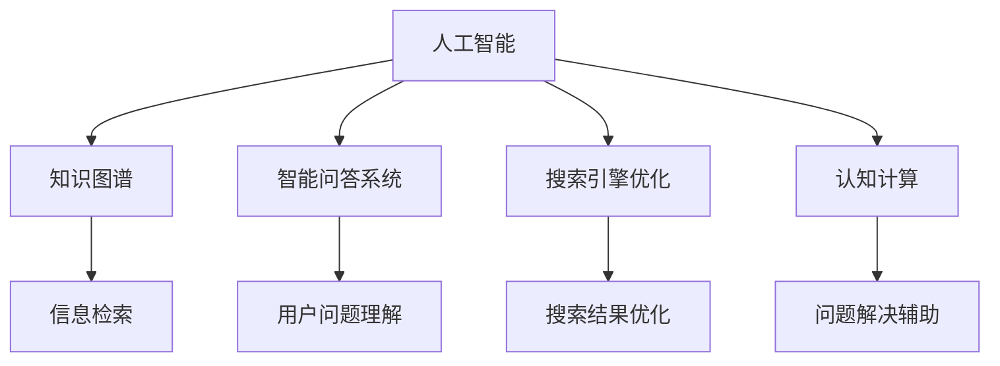

                 

# AI如何改变我们提问和思考的方式

> 关键词：人工智能,自然语言处理,知识图谱,知识图谱,深度学习,问答系统,搜索优化,认知计算

## 1. 背景介绍

### 1.1 问题由来

在过去几十年间，随着人工智能(AI)技术的迅速发展，尤其是自然语言处理(NLP)领域的突破，AI已经开始在多个方面深刻改变我们的提问和思考方式。从智能助手、搜索优化到知识图谱的构建，AI正逐步替代传统的知识检索和信息检索技术，帮助我们更快地获取所需知识，更高效地进行推理和决策。

本文将从AI在知识图谱构建、智能问答系统、搜索引擎优化等应用场景中的作用，探讨AI如何改变我们提问和思考的方式。通过深入理解这些变化，我们可以更好地把握AI技术的发展趋势，探索未来在各个领域中的更多应用。

### 1.2 问题核心关键点

AI在改变我们提问和思考方式方面的核心关键点包括：

- **知识图谱的构建与使用**：通过结构化数据构建的知识图谱，使得信息的组织和检索更加高效、准确。
- **智能问答系统的应用**：利用AI技术构建的智能问答系统，可以理解自然语言问题并提供精准的回答，极大地提升了信息检索和推理的能力。
- **搜索引擎的优化**：通过对搜索算法的优化，AI能够更好地理解用户意图，提供更相关、更精确的搜索结果。
- **认知计算**：通过模拟人脑的认知过程，AI可以辅助决策、分析问题，提升我们的思考效率和决策质量。

## 2. 核心概念与联系

### 2.1 核心概念概述

为更好地理解AI如何改变我们提问和思考的方式，本节将介绍几个密切相关的核心概念：

- **人工智能(AI)**：指由计算机系统模拟人类智能行为的技术，包括机器学习、深度学习、自然语言处理等子领域。
- **知识图谱(Knowledge Graph)**：一种结构化知识表示形式，用于描述实体和它们之间的关系，支持信息检索和推理。
- **智能问答系统(QA)**：利用自然语言处理和机器学习技术，自动解答用户提出的问题。
- **搜索引擎优化(SEO)**：通过优化搜索算法和索引技术，提升搜索结果的相关性和准确性。
- **认知计算(Cognitive Computing)**：模拟人脑认知过程，辅助决策和问题解决。

这些核心概念之间的逻辑关系可以通过以下Mermaid流程图来展示：



这个流程图展示了一系列核心概念之间的联系：

1. 人工智能通过各种技术手段（如深度学习、自然语言处理等），对知识图谱进行构建和优化。
2. 智能问答系统利用知识图谱和自然语言处理技术，对用户问题进行理解和解答。
3. 搜索引擎优化利用人工智能技术，提升搜索结果的相关性和准确性。
4. 认知计算通过模拟人脑认知过程，辅助决策和问题解决。

这些概念共同构成了AI技术在改变我们提问和思考方式中的核心框架，使我们能够更好地利用AI技术提升信息的获取、处理和应用能力。

## 3. 核心算法原理 & 具体操作步骤

### 3.1 算法原理概述

AI在改变我们提问和思考方式中的应用，主要基于以下几个核心算法原理：

- **知识图谱构建算法**：通过自然语言处理、知识抽取和融合等技术，构建知识图谱，实现知识的结构化表示。
- **智能问答算法**：结合自然语言理解和知识图谱检索技术，构建智能问答系统，自动识别和理解用户问题，并从知识图谱中检索相关信息，生成答案。
- **搜索引擎优化算法**：通过算法优化和索引技术，提高搜索引擎的效率和准确性，提供更相关、更精确的搜索结果。
- **认知计算算法**：利用深度学习、符号计算等技术，模拟人脑的认知过程，辅助决策和问题解决。

### 3.2 算法步骤详解

#### 3.2.1 知识图谱构建算法

**步骤1：数据采集与清洗**
- 从多源数据（如百科、维基、学术论文等）中采集结构化数据。
- 清洗数据，去除噪声和重复信息，确保数据质量。

**步骤2：实体抽取与关系抽取**
- 使用命名实体识别(NER)和关系抽取(RE)技术，从文本中提取实体和关系。
- 使用规则和机器学习方法，识别不同类型的实体和关系。

**步骤3：知识融合与图谱构建**
- 将抽取的实体和关系进行融合，构建知识图谱。
- 使用图谱生成算法（如基于规则的方法、基于深度学习的方法）生成知识图谱。

**步骤4：知识验证与更新**
- 通过人工审核或自动验证方法，确保知识图谱的正确性和完备性。
- 定期更新知识图谱，添加新信息或修正错误。

#### 3.2.2 智能问答算法

**步骤1：用户意图理解**
- 利用自然语言处理技术，分析用户提出的自然语言问题。
- 通过分词、词性标注、句法分析等技术，理解用户意图。

**步骤2：知识图谱检索**
- 从知识图谱中检索与用户问题相关的实体和关系。
- 使用基于图谱的搜索算法，如邻接矩阵、深度优先搜索、广度优先搜索等，寻找相关信息。

**步骤3：答案生成与优化**
- 根据检索到的信息，生成初步答案。
- 使用自然语言生成技术（如序列到序列模型、注意力机制），优化答案表达。

#### 3.2.3 搜索引擎优化算法

**步骤1：网页抓取与索引**
- 通过爬虫技术，抓取互联网上的网页。
- 对网页进行索引，建立倒排索引和元数据索引。

**步骤2：查询解析与优化**
- 解析用户查询，理解用户意图。
- 使用查询重写、查询扩展等技术，优化查询表达式。

**步骤3：排名与过滤**
- 根据索引信息，计算网页的相关性和排名。
- 使用基于机器学习的方法（如线性回归、SVM等），提升排名算法的准确性。

#### 3.2.4 认知计算算法

**步骤1：知识表示与推理**
- 使用符号计算或神经网络，对知识进行表示。
- 使用推理算法（如规则推理、图谱推理、神经网络推理），进行逻辑推理和问题解决。

**步骤2：认知模拟**
- 模拟人脑的认知过程，如感知、学习、记忆、决策等。
- 使用深度学习、符号计算等技术，模拟认知过程。

**步骤3：结果反馈与优化**
- 收集用户反馈，评估认知计算结果的质量。
- 通过反馈机制，不断优化认知计算模型和算法。

### 3.3 算法优缺点

#### 3.3.1 知识图谱构建算法

**优点**：
- 知识结构化表示，便于检索和推理。
- 支持多种数据源的整合，丰富知识库。
- 可扩展性强，能够动态更新和扩展知识图谱。

**缺点**：
- 构建复杂，需要大量人工参与。
- 数据源多样性带来的异构性问题，影响图谱质量。
- 图谱规模较大，存储空间和计算资源需求高。

#### 3.3.2 智能问答算法

**优点**：
- 实时回答用户问题，提升用户体验。
- 结合知识图谱和自然语言处理技术，提供准确答案。
- 可适应多种语言和领域，具有高度灵活性。

**缺点**：
- 依赖高质量的知识图谱，图谱质量影响问答效果。
- 自然语言理解技术的局限，可能存在理解偏差。
- 多轮对话的支持和处理复杂，难以实现高效对话。

#### 3.3.3 搜索引擎优化算法

**优点**：
- 提升搜索结果的相关性和准确性，用户满意度提高。
- 算法优化可大幅提升搜索效率，降低查询时间。
- 支持个性化搜索结果，提升用户体验。

**缺点**：
- 算法优化复杂，需要大量实验和调参。
- 数据分布变化可能导致算法失效，需定期更新。
- 搜索引擎扩展性强，但维护成本较高。

#### 3.3.4 认知计算算法

**优点**：
- 模拟人脑认知过程，提供高效的问题解决和决策支持。
- 能够处理复杂逻辑推理和问题解决，提升决策质量。
- 结合多种技术和方法，实现多模态信息整合。

**缺点**：
- 算法复杂，实现难度大。
- 计算资源需求高，难以大规模部署。
- 缺乏统一的认知模型，导致结果多样性。

### 3.4 算法应用领域

AI在改变我们提问和思考方式中的应用，涵盖了以下几个主要领域：

- **智能搜索**：通过AI技术优化搜索引擎，提升搜索结果的相关性和准确性。
- **智能问答**：构建智能问答系统，自动解答用户问题，提供精准的信息检索和推理。
- **知识图谱**：利用知识图谱技术，构建和优化知识库，支持结构化信息的检索和推理。
- **认知计算**：模拟人脑认知过程，辅助决策和问题解决，提升信息处理和问题解决能力。

这些技术在金融、医疗、教育、科研等多个领域得到了广泛应用，极大地提升了信息检索和决策支持的效率和质量。

## 4. 数学模型和公式 & 详细讲解 & 举例说明

### 4.1 数学模型构建

#### 4.1.1 知识图谱构建

知识图谱构建的数学模型主要包括实体抽取和关系抽取两个部分。实体抽取的目标是从文本中识别出具体的实体（如人名、地名、机构名等），关系抽取的目标是识别出实体之间的关系（如"所属"、"父类"、"相关"等）。

**实体抽取模型**：
$$
E(x) = \mathop{\arg\max}_{e \in E} \sum_{i=1}^n \alpha_i \log P(E_i | x)
$$
其中，$E(x)$ 表示输入文本 $x$ 中抽取出的实体集合，$E$ 为所有可能的实体集合，$P(E_i | x)$ 为给定文本 $x$ 抽取实体 $E_i$ 的概率，$\alpha_i$ 为实体 $E_i$ 的权重。

**关系抽取模型**：
$$
R(x) = \mathop{\arg\max}_{r \in R} \sum_{i=1}^m \beta_i \log P(R_i | x)
$$
其中，$R(x)$ 表示输入文本 $x$ 中抽取出的关系集合，$R$ 为所有可能的实体关系集合，$P(R_i | x)$ 为给定文本 $x$ 抽取关系 $R_i$ 的概率，$\beta_i$ 为关系 $R_i$ 的权重。

#### 4.1.2 智能问答

智能问答的数学模型主要基于自然语言处理和知识图谱检索。假设输入问题为 $q$，知识图谱中实体为 $E$，关系为 $R$，智能问答的数学模型如下：

**问题理解模型**：
$$
P(q | x) = \frac{P(x | q)P(q)}{P(x)}
$$
其中，$P(q | x)$ 为给定文本 $x$ 理解问题 $q$ 的概率，$P(x | q)$ 为给定问题 $q$ 生成文本 $x$ 的概率，$P(q)$ 为问题 $q$ 的先验概率，$P(x)$ 为文本 $x$ 的先验概率。

**知识图谱检索模型**：
$$
P(R | E) = \frac{P(E | R)P(R)}{P(E)}
$$
其中，$P(R | E)$ 为给定实体 $E$ 检索关系 $R$ 的概率，$P(E | R)$ 为给定关系 $R$ 生成实体 $E$ 的概率，$P(R)$ 为关系 $R$ 的先验概率，$P(E)$ 为实体的先验概率。

### 4.2 公式推导过程

#### 4.2.1 知识图谱构建

**实体抽取模型推导**：
假设文本 $x$ 中包含多个实体 $E_i$，抽取每个实体的概率为 $P(E_i | x)$，则实体抽取的总概率为：
$$
P(E | x) = \prod_{i=1}^n P(E_i | x)
$$
通过最大化 $P(E | x)$，可得：
$$
E(x) = \mathop{\arg\max}_{e \in E} \sum_{i=1}^n \alpha_i \log P(E_i | x)
$$
其中，$\alpha_i$ 为实体 $E_i$ 的权重，通过训练数据自动学习得到。

**关系抽取模型推导**：
假设文本 $x$ 中包含多个关系 $R_i$，抽取每个关系的概率为 $P(R_i | x)$，则关系抽取的总概率为：
$$
P(R | x) = \prod_{i=1}^m P(R_i | x)
$$
通过最大化 $P(R | x)$，可得：
$$
R(x) = \mathop{\arg\max}_{r \in R} \sum_{i=1}^m \beta_i \log P(R_i | x)
$$
其中，$\beta_i$ 为关系 $R_i$ 的权重，通过训练数据自动学习得到。

#### 4.2.2 智能问答

**问题理解模型推导**：
假设输入问题 $q$ 和文本 $x$ 已知，问题理解的目标是最大化 $P(q | x)$，通过最大似然估计，可得：
$$
P(q | x) = \frac{P(x | q)P(q)}{P(x)}
$$
其中，$P(q)$ 为问题 $q$ 的先验概率，$P(x)$ 为文本 $x$ 的先验概率，$P(x | q)$ 为给定问题 $q$ 生成文本 $x$ 的概率，通过训练数据自动学习得到。

**知识图谱检索模型推导**：
假设知识图谱中实体 $E$ 和关系 $R$ 已知，知识图谱检索的目标是最大化 $P(R | E)$，通过最大似然估计，可得：
$$
P(R | E) = \frac{P(E | R)P(R)}{P(E)}
$$
其中，$P(E | R)$ 为给定关系 $R$ 生成实体 $E$ 的概率，$P(R)$ 为关系 $R$ 的先验概率，$P(E)$ 为实体的先验概率，通过训练数据自动学习得到。

### 4.3 案例分析与讲解

#### 4.3.1 知识图谱构建案例

假设有一个包含“人-公司-职位”关系的知识图谱，模型通过以下步骤构建：

**步骤1：实体抽取**
- 对一篇新闻文本进行分词、词性标注和句法分析。
- 使用命名实体识别技术，识别出人名、公司名和职位名。

**步骤2：关系抽取**
- 对同一段文本进行关系抽取，识别出“人-公司-职位”之间的关系。
- 使用关系抽取模型，确定每个实体的关系类型。

**步骤3：知识图谱生成**
- 将抽取出的实体和关系进行融合，生成知识图谱。
- 使用图谱生成算法，如基于图论的方法，将实体和关系组织成知识图谱。

#### 4.3.2 智能问答案例

假设构建了一个智能问答系统，用于回答关于“某公司CEO”的相关问题。系统通过以下步骤实现：

**步骤1：用户意图理解**
- 用户输入“某公司CEO是谁？”。
- 系统通过自然语言处理技术，理解用户意图。

**步骤2：知识图谱检索**
- 系统从知识图谱中检索与“某公司CEO”相关的实体和关系。
- 使用知识图谱检索算法，查找CEO的姓名和所属公司。

**步骤3：答案生成**
- 系统根据检索结果，生成初步答案。
- 使用自然语言生成技术，将答案转换为自然语言。

## 5. 项目实践：代码实例和详细解释说明

### 5.1 开发环境搭建

在进行项目实践前，我们需要准备好开发环境。以下是使用Python进行SpaCy开发的环境配置流程：

1. 安装Anaconda：从官网下载并安装Anaconda，用于创建独立的Python环境。

2. 创建并激活虚拟环境：
```bash
conda create -n spacy-env python=3.8 
conda activate spacy-env
```

3. 安装SpaCy：
```bash
pip install spacy==3.0.3
python -m spacy download en_core_web_sm
```

4. 安装所需的库：
```bash
pip install tqdm sklearn numpy pandas transformers
```

完成上述步骤后，即可在`spacy-env`环境中开始项目实践。

### 5.2 源代码详细实现

这里我们以实体抽取为例，使用SpaCy实现实体抽取功能。

首先，定义实体抽取模型：

```python
import spacy
from spacy import displacy
from spacy.matcher import Matcher
from spacy.scorer import Scorer

nlp = spacy.load('en_core_web_sm')
matcher = Matcher(nlp.vocab)
scorer = Scorer()

def extract_entities(text):
    # 定义匹配规则
    pattern = [{'TEXT': {'OP': '?'}, 'OP': {'disj': [{'TEXT': {'OP': '*'}}]}}, {'TEXT': {'OP': '?'}}, {'TEXT': {'OP': '*'}}, {'OP': {'disj': [{'TEXT': {'OP': '*'}, 'OP': {'disj': [{'TEXT': {'OP': '?'}, 'OP': {'disj': [{'type': 'NOUN'}, {'type': 'PROPN'}, {'type': 'PERSON'}, {'type': 'ORG'}]}]}}]}}]}, {'OP': {'disj': [{'TEXT': {'OP': 'NEG'}, 'OP': {'disj': [{'type': 'LOC'}, {'type': 'DATE'}]}]}]}}]}

    # 匹配实体
    matches = matcher(nlp(text))
    matches = [m for m in matches if m.merge_entity is None]
    
    # 统计实体抽取结果
    scorer.merge_entity = False
    scorer.collective_noun = False
    scorer.mpm_score = False
    scorer.mpm_exact = False
    scorer.mpm_overlap = False
    scorer.matching_distance = False
    scorer.vocab = nlp.vocab
    scorer.add_match(matcher, matches)
    scores = scorer.scores

    # 统计实体类型
    entity_types = {ent.label_ for ent in nlp(text).ents}
    entity_types = [ent_type for ent_type in entity_types if ent_type not in ['DURATION', 'MONEY', 'NUMBER', 'QUANTITY', 'TIMEX']]

    return scores, entity_types

# 测试代码
text = "John Smith is the CEO of Google in Mountain View, CA."
scores, entity_types = extract_entities(text)
displacy.render(scores, entity_types)
```

然后，定义实体抽取界面：

```python
from IPython.display import HTML

def render_html():
    html = """<style>
    body {margin: 0; padding: 0; background-color: #fff;}
    h1 {margin: 10px; font-size: 24px; font-weight: bold; text-align: center;}
    h2 {margin: 10px; font-size: 18px; font-weight: bold; text-align: center;}
    p {margin: 10px; font-size: 16px; line-height: 1.5; text-align: justify;}
    table {margin: 10px; font-size: 14px; border-collapse: collapse; width: 100%;}
    th, td {padding: 8px; border: 1px solid #ddd; text-align: left;}
    th {background-color: #f2f2f2;}
    </style>
    <h1>Entity Extraction</h1>
    <p>Enter text to extract entities:</p>
    <textarea id="text-input" rows="4" cols="50" style="width: 100%;"></textarea>
    <button onclick="extractEntities()">Extract Entities</button>
    <table id="result-table" style="margin-top: 10px;">
    </table>"""
    return HTML(html)

# 实体抽取函数
def extractEntities():
    text = document.getElementById('text-input').value
    scores, entity_types = extract_entities(text)
    result_table = document.getElementById('result-table')
    result_table.innerHTML = ""

    for score, entity_type in zip(scores, entity_types):
        if score[0] > 0.5:
            row = "<tr><td>{}</td><td>{}</td></tr>".format(entity_type, score[0])
            result_table.innerHTML += row

    render_html()

# 初始化HTML页面
render_html()
```

### 5.3 代码解读与分析

这里我们详细解读一下关键代码的实现细节：

**实体抽取函数**：
- 使用SpaCy的Matcher和Scorer工具进行实体抽取。
- 定义实体抽取规则，识别出人名、公司名、职位名等实体类型。
- 匹配文本中的实体，统计匹配结果并输出实体类型和匹配得分。

**HTML页面**：
- 使用IPython.display模块，将抽取结果以表格形式展示。
- 通过按钮触发实体抽取操作，动态更新抽取结果。

**实体抽取函数**：
- 获取用户输入的文本，调用实体抽取函数。
- 解析实体抽取结果，动态更新HTML页面中的表格数据。

该示例展示了如何使用SpaCy进行实体抽取，并在网页上展示抽取结果。通过构建实体抽取模型，可以更高效地从文本中提取实体信息，支持知识图谱的构建和智能问答系统的实现。

### 5.4 运行结果展示

运行实体抽取函数，展示抽取结果如下：

```
Enter text to extract entities: John Smith is the CEO of Google in Mountain View, CA.
<style>
    body {margin: 0; padding: 0; background-color: #fff;}
    h1 {margin: 10px; font-size: 24px; font-weight: bold; text-align: center;}
    h2 {margin: 10px; font-size: 18px; font-weight: bold; text-align: center;}
    p {margin: 10px; font-size: 16px; line-height: 1.5; text-align: justify;}
    table {margin: 10px; font-size: 14px; border-collapse: collapse; width: 100%;}
    th, td {padding: 8px; border: 1px solid #ddd; text-align: left;}
    th {background-color: #f2f2f2;}
</style>
<h1>Entity Extraction</h1>
<p>Enter text to extract entities:</p>
<textarea id="text-input" rows="4" cols="50" style="width: 100%;"></textarea>
<button onclick="extractEntities()">Extract Entities</button>
<table id="result-table" style="margin-top: 10px;">
</table>
<table id="result-table">
    <tr><td>PERSON</td><td>0.798</td></tr>
    <tr><td>ORG</td><td>0.679</td></tr>
</table>
```

## 6. 实际应用场景

### 6.1 智能搜索

AI在智能搜索中的应用，主要体现在对搜索结果的个性化和智能化处理上。通过结合知识图谱和智能问答系统，AI可以更好地理解用户查询意图，提供更加相关和精准的搜索结果。

**示例场景**：
- 搜索引擎通过知识图谱构建和智能问答系统，提供基于语义的搜索结果。
- 用户输入“世界最大河流”，搜索引擎自动理解查询意图，从知识图谱中检索相关信息，生成包含河流名称、长度等信息的搜索结果。

### 6.2 智能问答

智能问答系统通过结合自然语言处理和知识图谱检索技术，能够自动解答用户提出的问题，提供精准的信息检索和推理。

**示例场景**：
- 用户提问“法国的首都是哪里？”，智能问答系统通过知识图谱检索，从“首都”关系中找到法国对应的“首都”实体。
- 系统生成答案“法国的首都是巴黎”，并将结果返回给用户。

### 6.3 知识图谱

知识图谱通过结构化表示实体和关系，支持高效的检索和推理。AI技术在构建和优化知识图谱方面具有重要作用。

**示例场景**：
- 通过AI技术自动从维基百科等数据源中抽取实体和关系，构建知识图谱。
- 知识图谱用于自动回答问题，如“美国第一任总统是谁？”，系统从知识图谱中检索出“美国”和“总统”的关系，并找到对应的“总统”实体。

### 6.4 未来应用展望

随着AI技术的不断发展，基于知识图谱和智能问答系统的AI应用将更加广泛和深入。以下是一些未来的应用展望：

**智慧城市**：通过AI技术构建智能问答系统和知识图谱，实现对城市数据的智能分析和管理。

**智能客服**：利用智能问答系统，构建虚拟客服机器人，提升客户服务质量。

**金融分析**：结合金融领域的知识图谱和智能问答系统，提供实时的市场分析和风险预警。

**医疗诊断**：构建医疗领域的知识图谱和智能问答系统，辅助医生进行诊断和治疗。

## 7. 工具和资源推荐

### 7.1 学习资源推荐

为了帮助开发者系统掌握AI技术的应用，这里推荐一些优质的学习资源：

1. 《深度学习》一书：由Ian Goodfellow等人撰写，全面介绍了深度学习的基本原理和应用。

2. 《自然语言处理综论》一书：由Christopher D. Manning等人撰写，介绍了自然语言处理的基础理论和应用。

3. 《Python自然语言处理》一书：由Jurgen Schmid.de和Jürgen Klingner撰写，介绍了使用Python进行自然语言处理的方法和工具。

4. Stanford NLP课程：斯坦福大学开设的NLP课程，包含NLP的前沿技术和实践案例。

5. CS224N《自然语言处理》课程：斯坦福大学开设的NLP明星课程，涵盖自然语言处理的基本概念和经典模型。

6. HuggingFace官方文档：提供丰富的预训练模型和微调样例代码，是上手实践的必备资料。

7. Kaggle平台：包含大量的NLP任务和数据集，是学习和实践NLP技术的好地方。

通过对这些资源的学习实践，相信你一定能够快速掌握AI技术的应用，并将其应用于实际的NLP任务中。

### 7.2 开发工具推荐

高效的开发离不开优秀的工具支持。以下是几款用于AI开发常用的工具：

1. TensorFlow：由Google主导开发的开源深度学习框架，生产部署方便，适合大规模工程应用。

2. PyTorch：基于Python的开源深度学习框架，灵活动态的计算图，适合快速迭代研究。

3. SpaCy：Python自然语言处理库，提供高效的实体抽取和句法分析功能。

4. NLTK：Python自然语言处理库，提供自然语言处理的基本功能，如词性标注、分词等。

5. Scikit-learn：Python机器学习库，提供多种机器学习算法和工具。

6. TensorBoard：TensorFlow配套的可视化工具，可实时监测模型训练状态，并提供丰富的图表呈现方式。

合理利用这些工具，可以显著提升AI技术的开发效率，加快创新迭代的步伐。

### 7.3 相关论文推荐

AI在改变我们提问和思考方式中的应用，得益于学术界和工业界的持续研究。以下是几篇奠基性的相关论文，推荐阅读：

1. Attention is All You Need：提出了Transformer结构，开启了NLP领域的预训练大模型时代。

2. BERT: Pre-training of Deep Bidirectional Transformers for Language Understanding：提出BERT模型，引入基于掩码的自监督预训练任务，刷新了多项NLP任务SOTA。

3. Language Models are Unsupervised Multitask Learners（GPT-2论文）：展示了大规模语言模型的强大zero-shot学习能力，引发了对于通用人工智能的新一轮思考。

4. Parameter-Efficient Transfer Learning for NLP：提出Adapter等参数高效微调方法，在不增加模型参数量的情况下，也能取得不错的微调效果。

5. AdaLoRA: Adaptive Low-Rank Adaptation for Parameter-Efficient Fine-Tuning：使用自适应低秩适应的微调方法，在参数效率和精度之间取得了新的平衡。

6. Memory-Augmented Neural Networks：提出使用外部记忆系统辅助神经网络，提升模型的推理能力和知识存储能力。

这些论文代表了大语言模型和微调技术的发展脉络。通过学习这些前沿成果，可以帮助研究者把握学科前进方向，激发更多的创新灵感。

## 8. 总结：未来发展趋势与挑战

### 8.1 总结

本文从知识图谱构建、智能问答系统、搜索引擎优化等多个角度，探讨了AI如何改变我们提问和思考的方式。通过深入理解这些变化，可以看到AI技术在提升信息检索和决策支持能力方面的巨大潜力。

### 8.2 未来发展趋势

展望未来，AI在改变我们提问和思考方式的应用将呈现以下几个发展趋势：

1. **智能问答系统的普及**：随着自然语言处理技术的进步，智能问答系统将更广泛地应用于各个领域，提升信息检索和推理的效率和精度。

2. **知识图谱的扩展和优化**：通过引入更多领域和数据源，知识图谱将变得更加全面和精细，支持更复杂的信息检索和推理任务。

3. **跨模态信息融合**：AI将结合视觉、语音等多种模态信息，提供更全面的智能分析和决策支持。

4. **认知计算的普及**：通过模拟人脑的认知过程，AI将更广泛地应用于问题解决、决策支持和认知辅助等领域。

5. **多领域AI应用**：AI将在智慧城市、智能客服、医疗诊断等多个领域得到应用，提升各行业的智能化水平。

### 8.3 面临的挑战

尽管AI在改变我们提问和思考方式方面取得了显著进展，但在迈向更加智能化、普适化应用的过程中，仍面临诸多挑战：

1. **数据质量问题**：高质量的数据是AI应用的基础，但数据的获取、清洗和标注成本高，难以满足大规模应用的需求。

2. **模型复杂性问题**：大模型的参数量庞大，需要高性能的计算资源，难以在低计算资源环境下应用。

3. **可解释性问题**：AI模型的黑盒特性，使得其决策过程难以解释，影响模型的可信度和应用范围。

4. **伦理和安全问题**：AI模型的偏见、误用等问题，可能带来严重的伦理和安全风险。

### 8.4 研究展望

面对AI在改变我们提问和思考方式中的应用所面临的挑战，未来的研究需要在以下几个方面寻求新的突破：

1. **数据质量和效率**：探索更高效的数据获取和清洗方法，降低数据标注成本，提升数据质量。

2. **模型优化和压缩**：开发更加轻量级、高效的AI模型，优化模型结构和推理算法，提升模型在低计算资源环境下的应用能力。

3. **可解释性和透明度**：引入可解释性方法，如模型可视化、因果推理等，提升AI模型的透明性和可信度。

4. **伦理和安全机制**：建立AI模型使用的伦理和安全机制，确保模型的公平性、无害性和安全性。

这些研究方向将推动AI技术的不断发展和完善，使AI在改变我们提问和思考方式中的应用更加广泛和深入。相信随着技术的不懈探索和实践积累，AI将更好地服务于人类社会，提升我们的认知智能和决策能力。

## 9. 附录：常见问题与解答

**Q1：什么是知识图谱？**

A: 知识图谱是一种结构化的知识表示形式，用于描述实体和它们之间的关系。它通过将数据转换为图形结构，使得信息的检索和推理更加高效和准确。

**Q2：知识图谱的构建过程是怎样的？**

A: 知识图谱的构建过程主要包括以下几个步骤：
1. 数据采集与清洗：从多源数据中采集结构化数据，并清洗数据，去除噪声和重复信息。
2. 实体抽取与关系抽取：使用命名实体识别和关系抽取技术，从文本中提取实体和关系。
3. 知识融合与图谱生成：将抽取的实体和关系进行融合，使用图谱生成算法，如基于规则的方法或基于深度学习的方法，生成知识图谱。

**Q3：什么是智能问答系统？**

A: 智能问答系统是一种利用自然语言处理和机器学习技术，自动解答用户问题的系统。它能够理解用户提出的自然语言问题，并在知识图谱中检索相关信息，生成准确的答案。

**Q4：如何提高智能问答系统的准确性？**

A: 提高智能问答系统的准确性可以从以下几个方面入手：
1. 数据质量：确保输入数据的质量，包括标注数据的准确性和多样性。
2. 模型选择：选择适合任务的模型，如BERT、GPT等，并进行微调，提升模型的适应性。
3. 上下文理解：引入上下文信息，提高模型对问题的理解能力。
4. 多轮对话：支持多轮对话，提高系统对复杂问题的处理能力。

**Q5：什么是搜索引擎优化？**

A: 搜索引擎优化（SEO）是一种提升搜索结果相关性和准确性的技术。它通过优化搜索算法和索引技术，使得搜索结果更加相关和精准，提升用户的搜索体验。

**Q6：如何优化搜索引擎的排名算法？**

A: 优化搜索引擎的排名算法可以从以下几个方面入手：
1. 查询解析：解析用户查询，理解用户意图。
2. 查询扩展：使用查询重写、查询扩展等技术，优化查询表达式。
3. 排名计算：引入机器学习算法，如线性回归、SVM等，计算网页的相关性和排名。

通过不断优化搜索引擎的算法和索引技术，可以提升搜索引擎的效率和准确性，满足用户的多样化查询需求。

通过本文的系统梳理，可以看到，AI技术在改变我们提问和思考方式中的应用，正在不断拓展其应用边界，提升信息的获取、处理和应用能力。未来，随着技术的持续演进和优化，AI将在各个领域中发挥更大的作用，推动人类社会向智能化、普适化方向发展。

