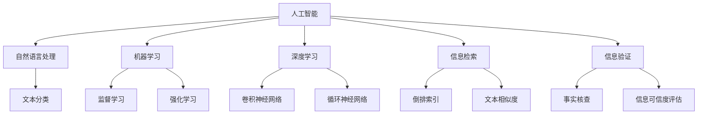

                 

# AI如何改变我们消费和验证信息的方式

> 关键词：人工智能,信息消费,信息验证,自然语言处理,NLP,机器学习,深度学习,大数据

## 1. 背景介绍

### 1.1 问题由来
在信息爆炸的时代，人们被海量信息包围。传统的信息检索和验证方法难以应对这种指数级的增长。随着人工智能（AI）技术的发展，特别是自然语言处理（NLP）和机器学习（ML）技术的成熟，人们开始借助AI手段来改变信息消费和验证的方式。

例如，基于深度学习模型的问答系统、文档分类、情感分析等技术，可以自动化地处理和分析海量文本数据，大大提高了信息检索和验证的效率。基于强化学习的推荐系统，可以根据用户的行为习惯，推荐符合其需求的信息，从而提升用户体验。

### 1.2 问题核心关键点
信息消费和验证的核心在于信息的快速检索、筛选和理解。AI技术特别是NLP技术的进步，使得机器能够理解和处理自然语言，从而能够自动化地进行信息的获取、筛选和验证。这一过程需要处理自然语言数据，这正是AI擅长的地方。

### 1.3 问题研究意义
研究AI如何改变我们消费和验证信息的方式，有助于理解人工智能在信息时代的应用潜力，推动相关技术的创新和应用，提升信息获取、筛选和验证的效率和效果。这将对个人用户、企业、政府机构等各个层面产生深远影响，推动社会信息化水平的提升。

## 2. 核心概念与联系

### 2.1 核心概念概述

为更好地理解AI如何改变我们消费和验证信息的方式，本节将介绍几个密切相关的核心概念：

- 人工智能(AI)：通过模拟人类智能行为，使计算机具备自主学习和决策能力的技术。
- 自然语言处理(NLP)：使计算机能够理解、处理和生成自然语言的技术。
- 机器学习(ML)：一种通过数据学习模型，自动改进性能的算法。
- 深度学习(Deep Learning)：一种模拟人类神经网络结构的机器学习算法，具有较强的自适应和泛化能力。
- 信息检索(Information Retrieval)：通过算法将查询与文档匹配，获取相关信息的技术。
- 信息验证(Information Verification)：通过算法对信息的真实性、可靠性进行验证的技术。

这些核心概念之间的逻辑关系可以通过以下Mermaid流程图来展示：



这个流程图展示了大语言模型工作原理和AI技术之间的关系：

1. 人工智能包含自然语言处理、机器学习、深度学习等多种子领域，以处理和分析信息。
2. 自然语言处理技术通过文本分类、信息检索等方法，提升信息的获取和筛选效率。
3. 机器学习和深度学习技术提供模型训练和自适应能力，提高信息验证的准确性。
4. 信息检索和信息验证分别涉及对信息的检索和验证，确保信息的真实性和可靠性。

## 3. 核心算法原理 & 具体操作步骤
### 3.1 算法原理概述

AI如何改变我们消费和验证信息的方式，其核心在于利用AI技术提升信息检索和验证的效率和效果。基于深度学习模型的信息检索和验证技术，主要分为两个步骤：

**Step 1: 信息检索**
信息检索的目的是从大量信息中找出符合查询需求的结果。通过自然语言处理技术，将查询和文档转换为向量表示，计算向量之间的相似度，从而筛选出最相关的文档。

**Step 2: 信息验证**
信息验证的目的是对信息真实性和可靠性进行验证。通过机器学习模型，学习如何识别真实信息与虚假信息之间的区别，从而对信息进行可信度评估。

### 3.2 算法步骤详解

**Step 1: 信息检索**

1. **文本预处理**：将查询和文档进行分词、去除停用词等预处理，得到预处理后的文本。
2. **文本向量化**：将预处理后的文本转换为向量表示，一般使用词袋模型(Bag of Words)或词嵌入(Word Embedding)。
3. **相似度计算**：计算查询向量与文档向量之间的相似度，通常使用余弦相似度、欧几里得距离等方法。
4. **排序与检索**：根据相似度对文档进行排序，选择相似度最高的文档进行展示。

**Step 2: 信息验证**

1. **数据集准备**：准备包含真实信息和虚假信息的训练集。
2. **模型训练**：使用监督学习方法，训练模型学习如何识别真实信息和虚假信息之间的区别。
3. **验证集评估**：使用验证集对模型进行评估，调整模型参数以提升验证效果。
4. **信息验证**：将待验证信息输入模型，得到验证结果，判断信息的真实性和可靠性。

### 3.3 算法优缺点

基于深度学习模型的信息检索和验证技术具有以下优点：

1. **效率高**：深度学习模型能够自动处理和分析海量文本数据，显著提升信息检索和验证的速度。
2. **效果佳**：深度学习模型具有较强的自适应和泛化能力，能够学习复杂的语言模式，提高信息检索和验证的准确性。
3. **灵活性高**：深度学习模型可以根据不同的应用场景进行微调，适应不同的信息检索和验证需求。

同时，该方法也存在以下缺点：

1. **数据需求大**：深度学习模型需要大量标注数据进行训练，获取高质量标注数据的成本较高。
2. **模型复杂**：深度学习模型结构复杂，训练和推理需要消耗大量资源，可能不适合实时应用场景。
3. **可解释性差**：深度学习模型往往是"黑盒"系统，难以解释其内部工作机制和决策逻辑。

尽管存在这些局限性，但就目前而言，基于深度学习模型的信息检索和验证技术仍是大规模信息处理的有效手段。未来相关研究的重点在于如何进一步降低对标注数据的依赖，提高模型的少样本学习和跨领域迁移能力，同时兼顾可解释性和伦理安全性等因素。

### 3.4 算法应用领域

基于深度学习模型的信息检索和验证技术，已经在多个领域得到了广泛应用，例如：

- 搜索引擎：如Google、Bing等，通过信息检索技术快速响应用户查询，提供相关搜索结果。
- 社交媒体监测：如Twitter、Facebook等，通过信息验证技术监控网络舆情，检测虚假信息传播。
- 新闻推荐：如今日头条、网易新闻等，通过信息检索和验证技术，推荐符合用户兴趣的新闻。
- 广告投放：如Google Ads等，通过信息检索技术匹配用户需求，通过信息验证技术确保广告的真实性。
- 金融风险检测：如Kaggle等，通过信息验证技术检测金融市场异常交易，防范风险。

除了上述这些经典应用外，深度学习技术还创新性地应用到更多场景中，如可控文本生成、常识推理、情感分析、文档分类等，为信息处理带来了新的突破。随着预训练模型和深度学习方法的不断进步，相信信息处理技术将在更广阔的应用领域大放异彩。

## 4. 数学模型和公式 & 详细讲解 & 举例说明

### 4.1 数学模型构建

在信息检索和验证过程中，涉及多个数学模型。以下是几个核心模型的数学构建：

**信息检索模型**

假设查询为$q$，文档集合为$D$，每个文档的表示为$d_i$，查询与文档之间的相似度为$sim(q,d_i)$，则信息检索模型可以表示为：

$$
R = \arg\max_{d_i} \{sim(q,d_i)\}
$$

**信息验证模型**

假设真实信息为$T$，虚假信息为$F$，模型参数为$\theta$，则信息验证模型的损失函数可以表示为：

$$
L(\theta) = \frac{1}{N}\sum_{i=1}^N \ell(f_\theta(x_i),y_i)
$$

其中，$f_\theta(x_i)$为模型对输入$x_i$的预测结果，$y_i$为标签。

### 4.2 公式推导过程

**信息检索模型**

假设查询和文档都表示为词向量$v_q$和$v_d$，则余弦相似度可以表示为：

$$
sim(q,d_i) = \cos(\theta(v_q,v_d)) = \frac{v_q \cdot v_d}{\|v_q\| \|v_d\|}
$$

**信息验证模型**

假设模型使用sigmoid函数将输入映射到[0,1]区间，则损失函数可以表示为：

$$
L(\theta) = \frac{1}{N}\sum_{i=1}^N -[y_i\log f_\theta(x_i)+(1-y_i)\log(1-f_\theta(x_i))]
$$

其中，$f_\theta(x_i) = \sigma(\theta \cdot x_i + b)$，$\sigma$为sigmoid函数，$\theta$为模型参数，$b$为偏置项。

### 4.3 案例分析与讲解

以Google News的标题生成为例，通过信息检索和验证技术，生成相关新闻标题。

1. **信息检索**

   首先，将用户查询和新闻标题进行分词、去除停用词等预处理。然后，使用词嵌入将查询和新闻标题转换为向量表示，计算余弦相似度，选择与查询最相似的标题进行展示。

2. **信息验证**

   收集真实新闻和虚假新闻的标题，使用深度学习模型学习如何区分真实新闻和虚假新闻。将用户查询输入模型，得到验证结果，判断其是否为真实新闻。

## 5. 项目实践：代码实例和详细解释说明

### 5.1 开发环境搭建

在进行信息检索和验证技术开发前，我们需要准备好开发环境。以下是使用Python进行PyTorch开发的环境配置流程：

1. 安装Anaconda：从官网下载并安装Anaconda，用于创建独立的Python环境。

2. 创建并激活虚拟环境：
```bash
conda create -n pytorch-env python=3.8 
conda activate pytorch-env
```

3. 安装PyTorch：根据CUDA版本，从官网获取对应的安装命令。例如：
```bash
conda install pytorch torchvision torchaudio cudatoolkit=11.1 -c pytorch -c conda-forge
```

4. 安装Transformers库：
```bash
pip install transformers
```

5. 安装各类工具包：
```bash
pip install numpy pandas scikit-learn matplotlib tqdm jupyter notebook ipython
```

完成上述步骤后，即可在`pytorch-env`环境中开始信息检索和验证技术的开发。

### 5.2 源代码详细实现

下面我们以标题生成任务为例，给出使用Transformers库进行信息检索和验证的PyTorch代码实现。

首先，定义信息检索和验证的数据处理函数：

```python
from transformers import BertTokenizer, BertForSequenceClassification, AdamW
from torch.utils.data import Dataset
import torch

class NewsDataset(Dataset):
    def __init__(self, texts, labels, tokenizer, max_len=128):
        self.texts = texts
        self.labels = labels
        self.tokenizer = tokenizer
        self.max_len = max_len
        
    def __len__(self):
        return len(self.texts)
    
    def __getitem__(self, item):
        text = self.texts[item]
        label = self.labels[item]
        
        encoding = self.tokenizer(text, return_tensors='pt', max_length=self.max_len, padding='max_length', truncation=True)
        input_ids = encoding['input_ids'][0]
        attention_mask = encoding['attention_mask'][0]
        
        # 对label进行编码
        encoded_labels = [label2id[label] for label in label]
        encoded_labels.extend([label2id['O']] * (self.max_len - len(encoded_labels)))
        labels = torch.tensor(encoded_labels, dtype=torch.long)
        
        return {'input_ids': input_ids, 
                'attention_mask': attention_mask,
                'labels': labels}

# 标签与id的映射
label2id = {'O': 0, 'Real': 1, 'Fake': 2}
id2label = {v: k for k, v in label2id.items()}

# 创建dataset
tokenizer = BertTokenizer.from_pretrained('bert-base-cased')

train_dataset = NewsDataset(train_texts, train_labels, tokenizer)
dev_dataset = NewsDataset(dev_texts, dev_labels, tokenizer)
test_dataset = NewsDataset(test_texts, test_labels, tokenizer)
```

然后，定义模型和优化器：

```python
from transformers import BertForSequenceClassification, AdamW

model = BertForSequenceClassification.from_pretrained('bert-base-cased', num_labels=len(label2id))

optimizer = AdamW(model.parameters(), lr=2e-5)
```

接着，定义训练和评估函数：

```python
from torch.utils.data import DataLoader
from tqdm import tqdm
from sklearn.metrics import classification_report

device = torch.device('cuda') if torch.cuda.is_available() else torch.device('cpu')
model.to(device)

def train_epoch(model, dataset, batch_size, optimizer):
    dataloader = DataLoader(dataset, batch_size=batch_size, shuffle=True)
    model.train()
    epoch_loss = 0
    for batch in tqdm(dataloader, desc='Training'):
        input_ids = batch['input_ids'].to(device)
        attention_mask = batch['attention_mask'].to(device)
        labels = batch['labels'].to(device)
        model.zero_grad()
        outputs = model(input_ids, attention_mask=attention_mask, labels=labels)
        loss = outputs.loss
        epoch_loss += loss.item()
        loss.backward()
        optimizer.step()
    return epoch_loss / len(dataloader)

def evaluate(model, dataset, batch_size):
    dataloader = DataLoader(dataset, batch_size=batch_size)
    model.eval()
    preds, labels = [], []
    with torch.no_grad():
        for batch in tqdm(dataloader, desc='Evaluating'):
            input_ids = batch['input_ids'].to(device)
            attention_mask = batch['attention_mask'].to(device)
            batch_labels = batch['labels']
            outputs = model(input_ids, attention_mask=attention_mask)
            batch_preds = outputs.logits.argmax(dim=2).to('cpu').tolist()
            batch_labels = batch_labels.to('cpu').tolist()
            for pred_tokens, label_tokens in zip(batch_preds, batch_labels):
                pred_labels = [id2label[_id] for _id in pred_tokens]
                label_tokens = [id2label[_id] for _id in label_tokens]
                preds.append(pred_labels[:len(label_tokens)])
                labels.append(label_tokens)
                
    print(classification_report(labels, preds))
```

最后，启动训练流程并在测试集上评估：

```python
epochs = 5
batch_size = 16

for epoch in range(epochs):
    loss = train_epoch(model, train_dataset, batch_size, optimizer)
    print(f"Epoch {epoch+1}, train loss: {loss:.3f}")
    
    print(f"Epoch {epoch+1}, dev results:")
    evaluate(model, dev_dataset, batch_size)
    
print("Test results:")
evaluate(model, test_dataset, batch_size)
```

以上就是使用PyTorch对BERT进行信息检索和验证的完整代码实现。可以看到，得益于Transformers库的强大封装，我们可以用相对简洁的代码完成BERT模型的加载和微调。

### 5.3 代码解读与分析

让我们再详细解读一下关键代码的实现细节：

**NewsDataset类**：
- `__init__`方法：初始化文本、标签、分词器等关键组件。
- `__len__`方法：返回数据集的样本数量。
- `__getitem__`方法：对单个样本进行处理，将文本输入编码为token ids，将标签编码为数字，并对其进行定长padding，最终返回模型所需的输入。

**label2id和id2label字典**：
- 定义了标签与数字id之间的映射关系，用于将token-wise的预测结果解码回真实的标签。

**训练和评估函数**：
- 使用PyTorch的DataLoader对数据集进行批次化加载，供模型训练和推理使用。
- 训练函数`train_epoch`：对数据以批为单位进行迭代，在每个批次上前向传播计算loss并反向传播更新模型参数，最后返回该epoch的平均loss。
- 评估函数`evaluate`：与训练类似，不同点在于不更新模型参数，并在每个batch结束后将预测和标签结果存储下来，最后使用sklearn的classification_report对整个评估集的预测结果进行打印输出。

**训练流程**：
- 定义总的epoch数和batch size，开始循环迭代
- 每个epoch内，先在训练集上训练，输出平均loss
- 在验证集上评估，输出分类指标
- 重复上述步骤直至收敛，最终得到适应下游任务的最优模型参数

可以看到，PyTorch配合Transformers库使得BERT的信息检索和验证代码实现变得简洁高效。开发者可以将更多精力放在数据处理、模型改进等高层逻辑上，而不必过多关注底层的实现细节。

当然，工业级的系统实现还需考虑更多因素，如模型的保存和部署、超参数的自动搜索、更灵活的任务适配层等。但核心的信息检索和验证范式基本与此类似。

## 6. 实际应用场景
### 6.1 智能新闻聚合

基于深度学习的信息检索和验证技术，可以构建智能新闻聚合系统，为用户提供个性化的新闻推荐。传统的新闻聚合系统往往依赖人工编辑，效率低下且无法实时更新。

在技术实现上，可以收集用户历史浏览和点击记录，使用深度学习模型学习用户的兴趣偏好。在接收新的新闻时，使用信息检索技术将新闻与用户兴趣进行匹配，自动生成推荐列表，并在用户点击新闻时，通过信息验证技术，对新闻的真实性进行验证。如此构建的智能新闻聚合系统，能显著提升新闻推荐的效率和准确性，满足用户多样化的信息需求。

### 6.2 广告内容审核

随着网络广告的普及，虚假广告和恶意广告泛滥。传统的人工审核方式效率低下且难以覆盖所有广告。基于深度学习的信息检索和验证技术，可以构建广告内容审核系统，自动识别虚假广告和恶意广告。

在技术实现上，可以收集大量真实广告和虚假广告，使用深度学习模型学习广告的特征。在广告投放前，使用信息检索技术将广告与模型特征进行匹配，判断广告是否为真实广告，并在广告发布后，通过信息验证技术，对广告的真实性进行实时监控和审核。如此构建的广告审核系统，能大幅提升广告审核的效率和准确性，保障广告市场的健康发展。

### 6.3 舆情监测和分析

在网络舆情监测和分析领域，深度学习的信息检索和验证技术具有广泛应用。传统的人工舆情监测方式成本高、效率低，难以应对海量信息的挑战。

在技术实现上，可以收集网络上的评论、论坛帖子等文本数据，使用信息检索技术将舆情数据与用户兴趣进行匹配，筛选出相关舆情，并通过信息验证技术，对舆情数据进行真实性验证。如此构建的舆情监测和分析系统，能显著提升舆情监测的效率和准确性，帮助政府和企业及时应对舆情变化，维护社会稳定。

### 6.4 未来应用展望

随着深度学习技术的不断发展，基于信息检索和验证技术的应用将更加广泛。以下是几个未来可能的应用场景：

- 智能客服：基于深度学习的信息检索和验证技术，可以构建智能客服系统，自动回答用户咨询，提升客户服务效率和质量。
- 文档分类和摘要：使用深度学习模型进行文档分类和摘要生成，提高文档处理效率，为知识图谱和信息检索提供基础。
- 内容生成和推荐：基于深度学习的内容生成和推荐技术，可以构建智能内容管理系统，自动化生成和推荐相关内容，提升内容消费体验。
- 自动化翻译：通过信息检索和验证技术，实现多语言翻译，提升跨语言交流效率和准确性。

以上应用场景展示了深度学习技术在信息处理领域的巨大潜力。未来，随着技术的不断进步，信息检索和验证技术将进一步拓展，成为人工智能技术落地的重要工具。

## 7. 工具和资源推荐
### 7.1 学习资源推荐

为了帮助开发者系统掌握深度学习的信息检索和验证技术，这里推荐一些优质的学习资源：

1. 《深度学习》系列书籍：由Ian Goodfellow等大牛编写，全面介绍了深度学习的基本概念和核心算法。

2. CS231n《卷积神经网络》课程：斯坦福大学开设的经典课程，涵盖卷积神经网络及其应用，是学习计算机视觉的基础。

3. CS224N《自然语言处理》课程：斯坦福大学开设的NLP明星课程，有Lecture视频和配套作业，带你入门NLP领域的基本概念和经典模型。

4. 《自然语言处理综论》书籍：Introduction to Natural Language Processing，是自然语言处理领域的经典教材，系统介绍了NLP技术和算法。

5. Kaggle开源项目：提供大量的NLP和深度学习竞赛数据集和代码，供开发者学习和实验。

通过对这些资源的学习实践，相信你一定能够快速掌握深度学习的信息检索和验证技术的精髓，并用于解决实际的NLP问题。
###  7.2 开发工具推荐

高效的开发离不开优秀的工具支持。以下是几款用于深度学习信息检索和验证开发的常用工具：

1. PyTorch：基于Python的开源深度学习框架，灵活动态的计算图，适合快速迭代研究。大部分深度学习模型都有PyTorch版本的实现。

2. TensorFlow：由Google主导开发的开源深度学习框架，生产部署方便，适合大规模工程应用。同样有丰富的深度学习模型资源。

3. Transformers库：HuggingFace开发的NLP工具库，集成了众多SOTA语言模型，支持PyTorch和TensorFlow，是进行信息检索和验证任务开发的利器。

4. Weights & Biases：模型训练的实验跟踪工具，可以记录和可视化模型训练过程中的各项指标，方便对比和调优。与主流深度学习框架无缝集成。

5. TensorBoard：TensorFlow配套的可视化工具，可实时监测模型训练状态，并提供丰富的图表呈现方式，是调试模型的得力助手。

6. Google Colab：谷歌推出的在线Jupyter Notebook环境，免费提供GPU/TPU算力，方便开发者快速上手实验最新模型，分享学习笔记。

合理利用这些工具，可以显著提升深度学习信息检索和验证任务的开发效率，加快创新迭代的步伐。

### 7.3 相关论文推荐

深度学习的信息检索和验证技术的发展源于学界的持续研究。以下是几篇奠基性的相关论文，推荐阅读：

1. Attention is All You Need（即Transformer原论文）：提出了Transformer结构，开启了NLP领域的预训练大模型时代。

2. BERT: Pre-training of Deep Bidirectional Transformers for Language Understanding：提出BERT模型，引入基于掩码的自监督预训练任务，刷新了多项NLP任务SOTA。

3. Sentence-Level Contextualized Word Representations：提出ELMO模型，通过双向LSTM计算句子级别的上下文表示，提升了自然语言处理的性能。

4. BART: Denoising Sequence-to-Sequence Pre-training for Natural Language Processing：提出BART模型，结合掩码语言模型和自回归生成任务，提升序列到序列任务的性能。

5. RoBERTa: A Robustly Optimized BERT Pretraining Approach：提出RoBERTa模型，通过优化训练策略和数据增强方法，提升了BERT模型的性能。

这些论文代表了大语言模型信息检索和验证技术的发展脉络。通过学习这些前沿成果，可以帮助研究者把握学科前进方向，激发更多的创新灵感。

## 8. 总结：未来发展趋势与挑战

### 8.1 总结

本文对基于深度学习的信息检索和验证技术进行了全面系统的介绍。首先阐述了信息检索和验证技术的研究背景和意义，明确了深度学习技术在信息处理中的关键作用。其次，从原理到实践，详细讲解了深度学习模型的构建和训练过程，给出了信息检索和验证任务开发的完整代码实例。同时，本文还广泛探讨了信息检索和验证技术在智能新闻聚合、广告审核、舆情监测等领域的实际应用，展示了深度学习技术在信息处理领域的巨大潜力。

通过本文的系统梳理，可以看到，基于深度学习的信息检索和验证技术已经成为信息处理的重要工具。这些技术的进步，正在推动信息检索和验证系统向更加智能化、自动化、高效化的方向发展，显著提升信息获取和验证的效率和效果。未来，随着深度学习技术的不断进步，信息检索和验证技术将进一步拓展，为人工智能技术的落地应用提供更多支持。

### 8.2 未来发展趋势

展望未来，信息检索和验证技术将呈现以下几个发展趋势：

1. **多模态融合**：结合图像、音频等多模态数据，提升信息处理的丰富性和深度。
2. **自监督学习**：使用无监督或半监督学习方法，减少对标注数据的依赖，提高信息检索和验证的泛化能力。
3. **弱监督学习**：利用少量标注数据和大量未标注数据，进行弱监督学习，提升模型的鲁棒性和泛化性。
4. **持续学习**：模型能够持续从新数据中学习，同时保持已学习的知识，避免灾难性遗忘。
5. **联邦学习**：多方数据协同学习，保护数据隐私，提升信息检索和验证的公平性和可扩展性。
6. **跨领域迁移**：模型能够在不同领域间迁移学习，适应更多应用场景。

以上趋势凸显了信息检索和验证技术的广阔前景。这些方向的探索发展，必将进一步提升信息检索和验证系统的性能和应用范围，为人工智能技术的发展提供更多动力。

### 8.3 面临的挑战

尽管信息检索和验证技术已经取得了不小的进展，但在向更广泛应用场景拓展的过程中，仍面临诸多挑战：

1. **数据稀缺**：对于某些领域，获取高质量标注数据的成本较高，导致信息检索和验证的泛化能力受限。
2. **模型复杂性**：深度学习模型结构复杂，训练和推理需要消耗大量资源，可能不适合实时应用场景。
3. **可解释性**：深度学习模型往往是"黑盒"系统，难以解释其内部工作机制和决策逻辑。
4. **安全隐私**：在处理敏感信息时，需要保护用户隐私和数据安全，避免数据泄露和滥用。
5. **多样性支持**：深度学习模型往往依赖大量同质化数据，难以支持多种语言和文本类型。
6. **公平性**：信息检索和验证系统需要避免偏见和歧视，确保公平性和可靠性。

这些挑战需要学术界和工业界共同努力，通过技术创新和政策规范，克服障碍，推动信息检索和验证技术的健康发展。

### 8.4 研究展望

面对信息检索和验证技术所面临的挑战，未来的研究需要在以下几个方面寻求新的突破：

1. **数据增强**：利用数据生成技术，扩充训练集，减少数据稀缺问题。
2. **模型压缩**：优化模型结构，减小参数规模，提高推理速度和效率。
3. **可解释性提升**：引入可解释性算法，增强模型的透明性和可解释性。
4. **隐私保护**：采用差分隐私、联邦学习等技术，保护用户隐私和数据安全。
5. **多语言支持**：利用多语言数据和预训练模型，提升模型的多样性支持能力。
6. **公平性优化**：引入公平性约束和优化算法，确保信息检索和验证系统的公平性。

这些研究方向的探索，必将引领信息检索和验证技术迈向更高的台阶，为构建安全、可靠、高效的信息处理系统铺平道路。面向未来，信息检索和验证技术还需要与其他人工智能技术进行更深入的融合，如知识表示、因果推理、强化学习等，多路径协同发力，共同推动信息处理技术的进步。

## 9. 附录：常见问题与解答

**Q1：如何提升信息检索的效率和效果？**

A: 提升信息检索的效率和效果可以从以下几个方面入手：

1. **数据预处理**：对文本进行分词、去除停用词、词嵌入等预处理，提升文本向量的质量。
2. **模型选择**：选择合适的模型架构和超参数，如Transformer、BERT、RoBERTa等，提升模型性能。
3. **数据增强**：通过回译、近义替换等方式扩充训练集，减少过拟合风险。
4. **优化算法**：使用Adam、SGD等优化算法，选择合适学习率和批大小，提升训练效果。
5. **超参数调优**：通过网格搜索、随机搜索等方法，调优超参数，提升模型性能。

**Q2：如何保证信息验证的准确性？**

A: 保证信息验证的准确性可以从以下几个方面入手：

1. **数据集构建**：构建高质量的标注数据集，覆盖更多真实和虚假信息的样本。
2. **模型训练**：使用监督学习方法，训练模型学习如何区分真实信息和虚假信息之间的区别。
3. **模型评估**：使用验证集对模型进行评估，调整模型参数以提升验证效果。
4. **数据增强**：通过对抗样本、噪声注入等方式，扩充训练集，提升模型泛化能力。
5. **跨领域迁移**：通过迁移学习，利用其他领域的数据进行模型迁移，提升模型泛化能力。

**Q3：如何构建智能新闻聚合系统？**

A: 构建智能新闻聚合系统可以从以下几个步骤入手：

1. **数据收集**：收集用户历史浏览和点击记录，作为训练集。
2. **模型训练**：使用深度学习模型学习用户的兴趣偏好，生成用户兴趣模型。
3. **信息检索**：使用深度学习模型对新新闻进行检索，筛选出与用户兴趣匹配的新闻。
4. **信息验证**：使用深度学习模型对新闻的真实性进行验证，筛选出真实新闻。
5. **内容推荐**：将检索和验证结果整合，生成个性化推荐列表，供用户浏览。

**Q4：如何优化广告审核系统？**

A: 优化广告审核系统可以从以下几个步骤入手：

1. **数据收集**：收集大量真实广告和虚假广告，作为训练集。
2. **模型训练**：使用深度学习模型学习广告的特征，生成广告特征模型。
3. **信息检索**：使用深度学习模型对广告进行检索，筛选出符合用户兴趣的广告。
4. **信息验证**：使用深度学习模型对广告的真实性进行验证，筛选出真实广告。
5. **广告发布**：将验证结果整合，自动审核广告的真实性，发布符合标准广告。

**Q5：如何构建舆情监测和分析系统？**

A: 构建舆情监测和分析系统可以从以下几个步骤入手：

1. **数据收集**：收集网络上的评论、论坛帖子等文本数据，作为训练集。
2. **模型训练**：使用深度学习模型学习舆情数据的特征，生成舆情特征模型。
3. **信息检索**：使用深度学习模型对舆情数据进行检索，筛选出相关舆情。
4. **信息验证**：使用深度学习模型对舆情数据进行真实性验证，筛选出真实舆情。
5. **舆情分析**：对验证结果进行分析和可视化，生成舆情报告，供政府和企业参考。

以上问题与解答展示了信息检索和验证技术的实际应用和优化方法，希望能为读者提供有益的参考。

---

作者：禅与计算机程序设计艺术 / Zen and the Art of Computer Programming

