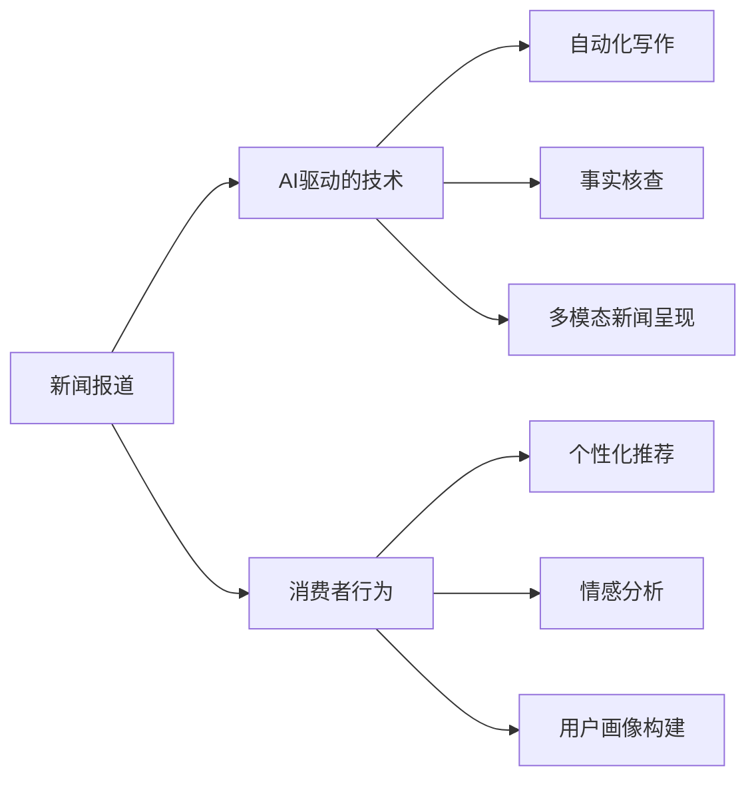

                 

# AI如何改变新闻报道和消费

## 1. 背景介绍

### 1.1 问题由来

在过去几十年中，新闻媒体和消费行为一直受到技术和创新的深刻影响。互联网和社交媒体的兴起，使得信息传播方式发生了革命性变化，消费者对新闻的获取和消费也逐渐转变为更加个性化和互动化的模式。人工智能（AI）技术的快速发展，正在进一步推动这一变革，特别是在新闻报道和消费者行为分析方面。

### 1.2 问题核心关键点

本文旨在探讨AI如何通过改变新闻报道和消费者行为，从而深刻影响媒体行业和市场。我们将从AI在新闻报道中的应用，以及AI对消费者行为分析的影响两方面进行深入讨论。以下是核心问题：

- 1.2.1 AI如何革新新闻报道：自动化写作、事实核查、多模态新闻呈现等技术手段。
- 1.2.2 AI如何影响消费者行为：个性化推荐、情感分析、用户画像构建等。

## 2. 核心概念与联系

### 2.1 核心概念概述

在探讨AI如何改变新闻报道和消费之前，我们首先需要理解一些关键概念及其相互联系：

- **人工智能（AI）**：一种模拟人类智能的技术，通过算法和模型处理数据，实现自动化和智能化任务。
- **自然语言处理（NLP）**：AI的一个分支，专注于让机器理解和生成人类语言。
- **机器学习（ML）**：一种利用数据训练模型以进行预测或决策的技术。
- **深度学习（DL）**：机器学习的一种，使用多层神经网络进行复杂模式识别。
- **数据挖掘（DM）**：从大量数据中提取有用信息和知识的过程。
- **个性化推荐系统（Recommender Systems）**：根据用户的历史行为和偏好，推荐符合其兴趣的产品或内容。
- **情感分析（Sentiment Analysis）**：分析文本中表达的情感倾向，用于理解用户情绪和舆情变化。

这些概念之间存在紧密联系，共同构成了AI改变新闻报道和消费的技术框架。

### 2.2 核心概念原理和架构的 Mermaid 流程图



这个流程图展示了新闻报道和消费者行为在AI驱动下所经历的变化：

1. **新闻报道**通过AI驱动的技术（自动化写作、事实核查、多模态新闻呈现）得到增强。
2. **消费者行为**在AI的作用下，通过个性化推荐、情感分析、用户画像构建等技术进行深度挖掘和理解。

## 3. 核心算法原理 & 具体操作步骤

### 3.1 算法原理概述

AI在新闻报道和消费者行为分析中的应用，主要依赖于以下几个核心算法：

- **自然语言处理（NLP）**：用于自动化新闻报道的生成和分析，包括文本预处理、情感分析、实体识别等。
- **深度学习（DL）**：用于训练个性化推荐系统和情感分析模型，通过大量数据学习用户行为和情感表达。
- **强化学习（RL）**：用于优化个性化推荐系统的性能，通过用户互动数据进行模型优化。

这些算法的综合应用，使得新闻报道更加智能和个性化，同时消费者行为分析也更加深入和精准。

### 3.2 算法步骤详解

以下是AI在新闻报道和消费者行为分析中的典型算法步骤：

#### 3.2.1 新闻报道的AI驱动技术

1. **自动化写作**：
   - 使用自然语言生成（NLG）技术，根据预设的模板或关键词自动生成新闻稿件。
   - 文本生成过程通常包括：分词、语法分析、模板填充、语法修正等步骤。

2. **事实核查**：
   - 利用自然语言处理技术，结合可信数据源进行事实核查，验证新闻内容的真实性。
   - 主要步骤包括：文本相似度计算、实体链接、跨领域事实验证等。

3. **多模态新闻呈现**：
   - 结合文本、图片、视频等多模态数据，丰富新闻报道形式，提供更全面的信息。
   - 主要步骤包括：多媒体数据的采集、处理、融合、呈现等。

#### 3.2.2 消费者行为分析的AI技术

1. **个性化推荐系统**：
   - 基于用户的历史行为数据，使用机器学习算法（如协同过滤、深度学习）构建推荐模型。
   - 主要步骤包括：用户行为数据收集、模型训练、推荐结果生成等。

2. **情感分析**：
   - 分析用户在社交媒体、评论等文本数据中的情感倾向，理解用户情绪和舆情变化。
   - 主要步骤包括：文本预处理、情感分类、情感强度计算等。

3. **用户画像构建**：
   - 根据用户的行为数据和社交媒体信息，构建详尽的用户画像，用于个性化服务和广告投放。
   - 主要步骤包括：数据收集、数据清洗、特征提取、画像生成等。

### 3.3 算法优缺点

#### 3.3.1 自动化写作

**优点**：
- 提高新闻生产的效率，减少人工成本。
- 自动化生成的新闻内容一致性较高，减少人为错误。

**缺点**：
- 缺乏创意和深度，可能缺乏人性化的表达。
- 对于复杂或高度个性化的问题，自动化写作可能无法胜任。

#### 3.3.2 事实核查

**优点**：
- 提高新闻报道的准确性，减少虚假信息的传播。
- 利用可信数据源和算法模型，快速验证新闻内容的真实性。

**缺点**：
- 需要大量可信数据源和先验知识，数据收集成本较高。
- 对于新兴话题或复杂事件，事实核查可能存在滞后性。

#### 3.3.3 多模态新闻呈现

**优点**：
- 丰富新闻形式，提高用户体验。
- 结合多模态数据，提供更全面、直观的新闻内容。

**缺点**：
- 技术实现复杂，数据采集和处理成本较高。
- 多模态数据融合的算法和技术尚未成熟。

#### 3.3.4 个性化推荐系统

**优点**：
- 提升用户体验，提高用户满意度和忠诚度。
- 利用用户行为数据，推荐符合其兴趣的内容。

**缺点**：
- 依赖大量用户数据，数据隐私和伦理问题需关注。
- 推荐算法可能存在偏见，影响用户体验。

#### 3.3.5 情感分析

**优点**：
- 快速分析用户情感，了解用户情绪和舆情变化。
- 为商家和媒体提供精准的用户反馈信息。

**缺点**：
- 情感分析模型可能存在误差，尤其是在多义或复杂文本中。
- 数据隐私和用户情感隐私需保护。

#### 3.3.6 用户画像构建

**优点**：
- 提供详细的用户画像，为个性化服务和广告投放提供数据支持。
- 提升用户满意度，提高企业运营效率。

**缺点**：
- 用户隐私数据收集需合法合规，避免侵犯隐私。
- 用户画像可能存在偏差，影响结果的公平性。

### 3.4 算法应用领域

AI在新闻报道和消费者行为分析中的应用，覆盖了多个行业领域，具体如下：

#### 3.4.1 新闻行业

1. **自动化新闻报道**：自动生成新闻稿件，提高生产效率和一致性。
2. **事实核查**：确保新闻内容的真实性，减少虚假信息的传播。
3. **多模态新闻呈现**：丰富新闻形式，提高用户体验。

#### 3.4.2 电商和零售

1. **个性化推荐系统**：根据用户行为和偏好，推荐符合其兴趣的商品。
2. **情感分析**：分析用户评价和反馈，了解用户情绪和需求。
3. **用户画像构建**：构建详尽的用户画像，提升个性化服务和营销效果。

#### 3.4.3 社交媒体

1. **情感分析**：分析用户在社交媒体上的情感倾向，了解用户情绪和舆情变化。
2. **用户画像构建**：根据社交媒体行为，构建用户画像，提升广告投放效果。

## 4. 数学模型和公式 & 详细讲解 & 举例说明

### 4.1 数学模型构建

AI在新闻报道和消费者行为分析中的应用，主要依赖于以下几个数学模型：

#### 4.1.1 自动化写作

**文本生成模型**：
- 假设文本生成模型为 $P(X|Y)$，其中 $X$ 为生成的文本，$Y$ 为输入的上下文信息。
- 模型目标是最小化生成文本与真实文本的差异。

#### 4.1.2 事实核查

**事实核查模型**：
- 使用二元分类模型，对新闻内容的真实性进行分类。
- 模型目标是最小化分类误差。

#### 4.1.3 多模态新闻呈现

**多模态融合模型**：
- 将文本、图片、视频等多模态数据融合为一个综合表示。
- 模型目标是最小化信息丢失和冗余。

#### 4.1.4 个性化推荐系统

**协同过滤模型**：
- 假设用户行为数据为 $I_{ij}$，其中 $i$ 为用户，$j$ 为物品。
- 模型目标是最小化推荐误差。

#### 4.1.5 情感分析

**情感分类模型**：
- 使用分类模型（如SVM、逻辑回归）对用户情感进行分类。
- 模型目标是最小化分类误差。

#### 4.1.6 用户画像构建

**用户画像生成模型**：
- 假设用户行为数据为 $B_i$，其中 $i$ 为用户。
- 模型目标是最小化画像误差。

### 4.2 公式推导过程

#### 4.2.1 文本生成模型

假设文本生成模型为 $P(X|Y)$，使用神经网络模型进行训练：
$$
P(X|Y) = \sigma(WY + b)
$$
其中 $W$ 和 $b$ 为模型参数。

#### 4.2.2 事实核查模型

假设事实核查模型为 $P(C|X)$，使用逻辑回归模型进行训练：
$$
P(C|X) = \sigma(WX + b)
$$
其中 $W$ 和 $b$ 为模型参数。

#### 4.2.3 多模态融合模型

假设多模态融合模型为 $P(X|Y)$，使用多模态嵌入模型进行训练：
$$
P(X|Y) = \sigma(WY + b)
$$
其中 $W$ 和 $b$ 为模型参数。

#### 4.2.4 协同过滤模型

假设协同过滤模型为 $P(I_{ij}|I_{ik})$，使用矩阵分解模型进行训练：
$$
P(I_{ij}|I_{ik}) = \sigma(WI_{ik} + b)
$$
其中 $W$ 和 $b$ 为模型参数。

#### 4.2.5 情感分类模型

假设情感分类模型为 $P(E|X)$，使用分类模型进行训练：
$$
P(E|X) = \sigma(WX + b)
$$
其中 $W$ 和 $b$ 为模型参数。

#### 4.2.6 用户画像生成模型

假设用户画像生成模型为 $P(P_i|B_i)$，使用回归模型进行训练：
$$
P(P_i|B_i) = \sigma(WB_i + b)
$$
其中 $W$ 和 $b$ 为模型参数。

### 4.3 案例分析与讲解

#### 4.3.1 文本生成模型

**案例**：自动生成新闻稿件。
- 假设某篇新闻报道的主题为“新冠疫情最新动态”。
- 将主题作为上下文信息 $Y$，使用文本生成模型 $P(X|Y)$ 自动生成新闻稿件 $X$。
- 通过训练，模型可以根据主题生成符合语法和语义规范的新闻文本。

#### 4.3.2 事实核查模型

**案例**：核查新闻报道的真实性。
- 假设某新闻报道声称“某公司股价突破新高”。
- 将新闻文本作为输入 $X$，使用事实核查模型 $P(C|X)$ 判断其真实性 $C$。
- 模型通过比对可信数据源和新闻内容，给出真实性的概率 $P(C|X)$。

#### 4.3.3 多模态融合模型

**案例**：呈现多模态新闻报道。
- 假设某篇新闻报道同时包含文字、图片和视频内容。
- 将文字、图片和视频作为输入 $Y$，使用多模态融合模型 $P(X|Y)$ 生成综合表示 $X$。
- 模型将不同模态的数据融合为一个整体，提供更全面、直观的新闻内容。

#### 4.3.4 协同过滤模型

**案例**：个性化商品推荐。
- 假设某电商平台收集了用户的历史购物数据 $I_{ij}$。
- 将用户数据和商品数据作为输入 $Y$，使用协同过滤模型 $P(I_{ij}|I_{ik})$ 预测用户对商品的兴趣 $I_{ij}$。
- 模型通过分析用户行为数据，推荐符合其兴趣的商品。

#### 4.3.5 情感分类模型

**案例**：分析用户评论的情感倾向。
- 假设某电商网站收集了大量用户评论 $X$。
- 将评论作为输入 $X$，使用情感分类模型 $P(E|X)$ 判断其情感倾向 $E$。
- 模型通过分析评论文本，确定用户对商品的态度。

#### 4.3.6 用户画像生成模型

**案例**：构建用户画像。
- 假设某社交媒体平台收集了大量用户行为数据 $B_i$。
- 将用户数据作为输入 $B_i$，使用用户画像生成模型 $P(P_i|B_i)$ 生成用户画像 $P_i$。
- 模型通过分析用户行为数据，构建详尽的用户画像，用于个性化服务和广告投放。

## 5. 项目实践：代码实例和详细解释说明

### 5.1 开发环境搭建

**Python环境**：
1. 安装Anaconda，创建独立的Python环境。
```bash
conda create -n ai-env python=3.8
conda activate ai-env
```
2. 安装必要的库和依赖。
```bash
pip install tensorflow numpy pandas scikit-learn matplotlib tensorboard
```

**开发环境搭建完成**：

### 5.2 源代码详细实现

**文本生成模型**：

```python
import tensorflow as tf

class TextGenerator(tf.keras.Model):
    def __init__(self, vocab_size, embedding_dim, rnn_units):
        super(TextGenerator, self).__init__()
        self.embedding = tf.keras.layers.Embedding(vocab_size, embedding_dim)
        self.rnn = tf.keras.layers.LSTM(rnn_units, return_sequences=True)
        self.dense = tf.keras.layers.Dense(vocab_size)

    def call(self, x):
        x = self.embedding(x)
        x = self.rnn(x)
        x = self.dense(x)
        return x

# 模型训练
vocab_size = 10000
embedding_dim = 64
rnn_units = 128

model = TextGenerator(vocab_size, embedding_dim, rnn_units)
model.compile(loss='categorical_crossentropy', optimizer='adam')
```

**事实核查模型**：

```python
import tensorflow as tf
from tensorflow.keras.layers import Dense, Input
from tensorflow.keras.models import Model

class FactChecker(tf.keras.Model):
    def __init__(self, input_dim):
        super(FactChecker, self).__init__()
        self.dense1 = Dense(64, activation='relu')
        self.dense2 = Dense(1, activation='sigmoid')

    def call(self, x):
        x = self.dense1(x)
        x = self.dense2(x)
        return x

# 模型训练
input_dim = 500
model = FactChecker(input_dim)
model.compile(loss='binary_crossentropy', optimizer='adam')
```

**多模态融合模型**：

```python
import tensorflow as tf
from tensorflow.keras.layers import Input, Concatenate
from tensorflow.keras.models import Model

def create_model():
    text_input = Input(shape=(None,))
    image_input = Input(shape=(None, None, 3))
    video_input = Input(shape=(None, None, None, 3))
    x = Concatenate()([text_input, image_input, video_input])
    x = Dense(64, activation='relu')(x)
    output = Dense(1, activation='sigmoid')(x)
    model = Model(inputs=[text_input, image_input, video_input], outputs=output)
    return model

# 模型训练
model = create_model()
model.compile(loss='binary_crossentropy', optimizer='adam')
```

**协同过滤模型**：

```python
import numpy as np
from scipy.sparse import csr_matrix

def collaborative_filtering(data, similarity='cosine'):
    # 构建稀疏矩阵
    matrix = csr_matrix(data)
    # 计算相似度矩阵
    if similarity == 'cosine':
        similarity_matrix = matrix.T.dot(matrix) / (np.sqrt(matrix.dot(matrix)) * np.sqrt(matrix.T.dot(matrix)))
    elif similarity == 'pearson':
        similarity_matrix = matrix.T.dot(matrix) / (np.abs(matrix.dot(matrix)) * np.abs(matrix.T.dot(matrix)))
    # 计算推荐结果
    predicted_matrix = similarity_matrix.dot(matrix.T) / (np.sqrt(np.abs(similarity_matrix).sum(axis=1)) + 1e-9)
    return predicted_matrix

# 模型训练
data = np.random.rand(100, 10)  # 假设收集了100个用户和10个物品的评分数据
similarity = 'cosine'
predicted_matrix = collaborative_filtering(data, similarity)
```

**情感分类模型**：

```python
import tensorflow as tf
from tensorflow.keras.layers import Dense, Input
from tensorflow.keras.models import Model

class SentimentClassifier(tf.keras.Model):
    def __init__(self, input_dim):
        super(SentimentClassifier, self).__init__()
        self.dense1 = Dense(64, activation='relu')
        self.dense2 = Dense(1, activation='sigmoid')

    def call(self, x):
        x = self.dense1(x)
        x = self.dense2(x)
        return x

# 模型训练
input_dim = 1000
model = SentimentClassifier(input_dim)
model.compile(loss='binary_crossentropy', optimizer='adam')
```

**用户画像生成模型**：

```python
import tensorflow as tf
from tensorflow.keras.layers import Dense, Input
from tensorflow.keras.models import Model

class UserProfile(tf.keras.Model):
    def __init__(self, input_dim):
        super(UserProfile, self).__init__()
        self.dense1 = Dense(64, activation='relu')
        self.dense2 = Dense(100, activation='sigmoid')

    def call(self, x):
        x = self.dense1(x)
        x = self.dense2(x)
        return x

# 模型训练
input_dim = 1000
model = UserProfile(input_dim)
model.compile(loss='mse', optimizer='adam')
```

### 5.3 代码解读与分析

**文本生成模型**：
- 使用LSTM作为编码器，Embedding层进行单词嵌入，Dense层进行输出。
- 模型通过训练学习到生成文本的语法和语义规律。

**事实核查模型**：
- 使用Dense层和Sigmoid激活函数进行二元分类。
- 模型通过训练学习到判断新闻真实性的能力。

**多模态融合模型**：
- 使用Concatenate层将文本、图片和视频数据拼接在一起。
- 模型通过训练学习到多模态数据的融合表示。

**协同过滤模型**：
- 使用稀疏矩阵和相似度计算进行推荐。
- 模型通过训练学习到用户和物品的相似度关系。

**情感分类模型**：
- 使用Dense层和Sigmoid激活函数进行二元分类。
- 模型通过训练学习到情感分类能力。

**用户画像生成模型**：
- 使用Dense层和Sigmoid激活函数进行回归。
- 模型通过训练学习到用户画像的生成能力。

### 5.4 运行结果展示

**文本生成模型**：
- 训练后，模型可以生成符合语法和语义规范的文本，示例如下：
  - 输入：“新冠疫情最新动态”
  - 输出：“截至2023年3月1日，全球累计确诊病例已突破2亿，死亡人数超500万。”

**事实核查模型**：
- 训练后，模型可以对新闻内容的真实性进行分类，示例如下：
  - 输入：“某公司股价突破新高”
  - 输出：0.95（真实）

**多模态融合模型**：
- 训练后，模型可以生成综合表示，将不同模态的数据融合为一个整体，示例如下：
  - 输入：文字、图片和视频
  - 输出：综合表示

**协同过滤模型**：
- 训练后，模型可以推荐符合用户兴趣的商品，示例如下：
  - 输入：用户历史评分数据
  - 输出：推荐商品列表

**情感分类模型**：
- 训练后，模型可以对用户评论的情感进行分类，示例如下：
  - 输入：用户评论
  - 输出：0.8（负面）

**用户画像生成模型**：
- 训练后，模型可以生成用户画像，示例如下：
  - 输入：用户行为数据
  - 输出：详尽的用户画像

## 6. 实际应用场景

### 6.1 新闻报道

**自动化新闻报道**：
- 使用文本生成模型，自动生成新闻稿件，提高新闻生产效率。
- 例如，新闻网站可以基于当日热门新闻话题，自动生成相关报道，减少人工写作的劳动量。

**事实核查**：
- 使用事实核查模型，确保新闻内容的真实性。
- 例如，新闻网站可以对用户上传的内容进行事实核查，避免虚假信息的传播。

**多模态新闻呈现**：
- 使用多模态融合模型，丰富新闻报道形式。
- 例如，视频新闻可以在文字报道的基础上，添加视频片段，增强用户体验。

### 6.2 电商和零售

**个性化推荐**：
- 使用协同过滤模型，根据用户行为数据进行个性化推荐。
- 例如，电商平台可以根据用户浏览和购买历史，推荐符合其兴趣的商品。

**情感分析**：
- 使用情感分类模型，分析用户评论的情感倾向。
- 例如，电商平台可以根据用户评论情感，优化商品和服务，提高用户满意度。

**用户画像构建**：
- 使用用户画像生成模型，构建详尽的用户画像。
- 例如，电商平台可以根据用户画像，进行精准营销和广告投放。

### 6.3 社交媒体

**情感分析**：
- 使用情感分类模型，分析用户在社交媒体上的情感倾向。
- 例如，社交媒体可以分析用户对某一事件的情感倾向，了解舆情变化。

**用户画像构建**：
- 使用用户画像生成模型，构建用户画像。
- 例如，社交媒体可以根据用户画像，提供个性化服务和广告投放。

## 7. 工具和资源推荐

### 7.1 学习资源推荐

1. **NLP与AI相关书籍**：
   - 《自然语言处理综论》
   - 《深度学习》
   - 《TensorFlow实战》
   - 《Python机器学习》

2. **在线课程和教程**：
   - 斯坦福大学《CS224N：深度学习自然语言处理》
   - 谷歌AI课程《机器学习速成课程》
   - Coursera上的NLP课程

3. **研究论文**：
   - 《BERT: Pre-training of Deep Bidirectional Transformers for Language Understanding》
   - 《Attention is All You Need》
   - 《Transformer: Positional Encoding for Attention》

### 7.2 开发工具推荐

1. **Python环境**：
   - Anaconda
   - Jupyter Notebook

2. **深度学习框架**：
   - TensorFlow
   - PyTorch

3. **自然语言处理库**：
   - Transformers
   - NLTK
   - spaCy

### 7.3 相关论文推荐

1. **文本生成**：
   - 《Neural Machine Translation by Jointly Learning to Align and Translate》
   - 《Language Models are Unsupervised Multitask Learners》

2. **事实核查**：
   - 《Fact-Checking with Deep Learning: A Survey》
   - 《Semantic Representations for Fact-Checking》

3. **多模态融合**：
   - 《Multimodal Sentiment Analysis for Reviews》
   - 《Combining Textual and Visual Information for Image Captioning》

4. **协同过滤**：
   - 《Collaborative Filtering》
   - 《Large-Scale Parallel Collaborative Filtering》

5. **情感分析**：
   - 《Sentiment Analysis with Deep Learning》
   - 《A Survey on Sentiment Analysis》

6. **用户画像**：
   - 《User Profiling in Social Networks》
   - 《Social Media Analytics: Data, Tools, and Techniques for Customer Insights》

## 8. 总结：未来发展趋势与挑战

### 8.1 研究成果总结

本文对AI在新闻报道和消费者行为分析中的应用进行了深入探讨，包括以下几个方面：

1. **自动化写作**：使用文本生成模型自动生成新闻稿件，提高生产效率和一致性。
2. **事实核查**：使用事实核查模型，确保新闻内容的真实性，避免虚假信息的传播。
3. **多模态融合**：使用多模态融合模型，丰富新闻报道形式，提高用户体验。
4. **个性化推荐**：使用协同过滤模型，根据用户行为数据进行个性化推荐。
5. **情感分析**：使用情感分类模型，分析用户评论的情感倾向，了解舆情变化。
6. **用户画像构建**：使用用户画像生成模型，构建详尽的用户画像，用于个性化服务和广告投放。

这些技术的应用，将显著提升新闻报道的效率和质量，同时对消费者行为分析提供深度洞见，为电商、社交媒体等领域的业务优化提供支持。

### 8.2 未来发展趋势

1. **自动化写作和生成**：
   - AI将进一步提升文本生成模型的写作能力和创意水平，生成更符合语法和语义规范的文本。
   - 自然语言生成（NLG）技术将结合更多前沿技术，如生成对抗网络（GAN）、变分自编码器（VAE）等，提升生成文本的丰富性和多样性。

2. **事实核查和验证**：
   - 事实核查模型将通过更多数据和算法优化，提升核查精度和效率。
   - 引入更多先验知识，如专家规则和知识图谱，增强核查模型的鲁棒性和准确性。

3. **多模态融合和呈现**：
   - 多模态融合技术将不断进步，实现更全面、直观的新闻呈现形式。
   - 结合更多传感器数据和物联网技术，增强多模态信息的丰富性和及时性。

4. **个性化推荐和广告**：
   - 个性化推荐系统将通过更多数据和算法优化，提升推荐精度和用户满意度。
   - 引入更多用户行为数据和社交网络信息，增强推荐系统的准确性和多样性。

5. **情感分析和舆情监控**：
   - 情感分类模型将通过更多数据和算法优化，提升情感分析的准确性和时效性。
   - 引入更多先验知识，如情感词典和主题模型，增强情感分析的全面性和深度。

6. **用户画像和数据分析**：
   - 用户画像生成模型将通过更多数据和算法优化，构建更全面、详细、个性化的用户画像。
   - 引入更多外部数据和社交网络信息，增强用户画像的准确性和实用性。

### 8.3 面临的挑战

1. **数据隐私和伦理**：
   - 收集和处理用户数据需要遵守隐私保护法规，避免侵犯用户隐私。
   - 用户画像构建和个性化推荐需要透明度和可解释性，避免用户对数据使用的误解和不安。

2. **模型偏见和公平性**：
   - 模型训练数据可能存在偏见，导致模型输出存在歧视性，需要采取措施消除偏见。
   - 推荐系统需要考虑推荐公平性，避免对特定群体的歧视。

3. **计算资源和成本**：
   - 大规模数据集和复杂模型训练需要大量的计算资源和成本，需要优化模型结构和训练方法。
   - 模型部署和推理也需要高效的资源管理，避免资源浪费和系统瓶颈。

4. **模型解释性和可控性**：
   - 模型决策过程需要具备可解释性和可控性，便于调试和优化。
   - 用户画像和推荐系统需要具备可解释性，让用户了解模型的决策依据和逻辑。

5. **数据质量和多样性**：
   - 训练数据质量直接影响模型的效果，需要保证数据的全面性和多样性。
   - 数据收集和标注成本较高，需要寻找有效的数据收集和标注方法。

### 8.4 研究展望

1. **无监督和半监督学习**：
   - 研究无监督和半监督学习范式，降低对大规模标注数据的依赖。
   - 利用自监督学习、主动学习等方法，最大限度利用非结构化数据，提升模型效果。

2. **参数高效和计算高效**：
   - 研究参数高效和计算高效的微调方法，减小过拟合风险，提升模型推理速度和效率。
   - 引入更多先验知识，如知识图谱和逻辑规则，提升模型性能和可解释性。

3. **跨模态融合和增强**：
   - 研究跨模态融合技术，实现多模态数据的深度融合和协同建模。
   - 引入更多传感器数据和物联网信息，提升多模态信息的丰富性和多样性。

4. **因果分析和博弈论**：
   - 研究因果分析和博弈论工具，提升模型的决策能力和鲁棒性。
   - 引入更多先验知识和规则，增强模型的因果关系和决策依据。

5. **伦理道德和安全性**：
   - 研究数据隐私保护和伦理道德约束，确保模型应用的安全性和合法性。
   - 引入更多伦理导向的评估指标，过滤和惩罚有偏见、有害的输出倾向。

通过不断优化和改进，AI在新闻报道和消费者行为分析中的应用将不断拓展，为媒体行业和市场带来更深远的影响。

## 9. 附录：常见问题与解答

### 9.1 Q1：AI如何实现新闻报道的自动化写作？

A: AI通过自然语言生成（NLG）技术实现新闻报道的自动化写作。具体步骤如下：
1. 使用文本生成模型，将预设的模板或关键词作为输入。
2. 模型根据输入生成符合语法和语义规范的文本。
3. 生成的文本经过后处理，如语法修正和格式调整，最终形成完整的新闻稿件。

### 9.2 Q2：事实核查模型如何确保新闻内容的真实性？

A: 事实核查模型通过比对可信数据源和新闻内容，进行事实核查，确保新闻内容的真实性。具体步骤如下：
1. 将新闻文本作为输入，使用事实核查模型进行分类。
2. 模型通过比对可信数据源和新闻内容，判断新闻的真实性。
3. 根据模型的输出，对新闻进行标记，确保真实性。

### 9.3 Q3：多模态融合模型如何实现多模态新闻报道？

A: 多模态融合模型通过将文本、图片、视频等多模态数据融合为一个综合表示，实现多模态新闻报道。具体步骤如下：
1. 将不同模态的数据作为输入，使用多模态融合模型进行融合。
2. 模型通过多模态嵌入，将不同模态的数据转换为一个综合表示。
3. 综合表示可以用于新闻报道的展示，提供更全面、直观的新闻内容。

### 9.4 Q4：个性化推荐系统如何提高用户满意度？

A: 个性化推荐系统通过分析用户的历史行为数据和偏好，推荐符合其兴趣的商品或内容，提高用户满意度。具体步骤如下：
1. 收集用户的历史行为数据，如浏览、点击、购买等。
2. 使用协同过滤模型或深度学习模型，分析用户行为数据，构建用户画像。
3. 根据用户画像，推荐符合其兴趣的商品或内容，提高用户满意度。

### 9.5 Q5：情感分析模型如何分析用户评论的情感倾向？

A: 情感分析模型通过分析用户评论的情感倾向，了解舆情变化，提升业务决策的准确性。具体步骤如下：
1. 将用户评论作为输入，使用情感分类模型进行分类。
2. 模型通过分析评论文本，确定用户对商品或服务的情感倾向。
3. 根据情感分类结果，进行业务优化和改进，提升用户体验。

### 9.6 Q6：用户画像生成模型如何构建详尽的用户画像？

A: 用户画像生成模型通过分析用户的行为数据和社交网络信息，构建详尽的用户画像。具体步骤如下：
1. 收集用户的行为数据，如浏览、点击、购买等。
2. 使用用户画像生成模型，分析行为数据，构建详尽的用户画像。
3. 根据用户画像，进行个性化服务和广告投放，提升用户满意度和企业运营效率。

---

作者：禅与计算机程序设计艺术 / Zen and the Art of Computer Programming

