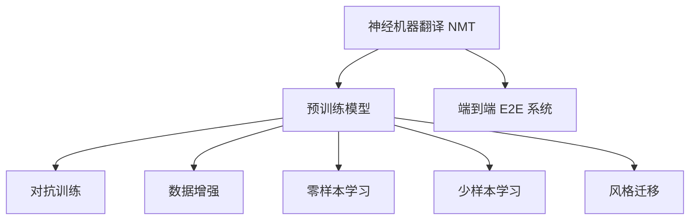

                 

## 1. 背景介绍

### 1.1 问题由来

互联网的全球化带来了多语言交流的普及，搜索引擎在为用户提供跨语言搜索服务方面起着至关重要的作用。传统的多语言翻译技术大多依赖人工翻译，但人工翻译成本高、效率低，无法满足搜索引擎快速响应的需求。近年来，随着AI技术的快速发展，机器翻译技术，特别是基于深度学习的神经机器翻译（NMT）技术，已经能够较好地解决多语言翻译问题。

### 1.2 问题核心关键点

AI技术在搜索引擎多语言翻译中的应用，主要集中在以下几个方面：

- 深度学习模型：使用深度神经网络对大规模语料进行训练，学习语言之间的映射关系。
- 神经机器翻译（NMT）：通过自监督和监督学习，让机器自动学习翻译规则，实现高质量的自动翻译。
- 端到端（E2E）系统：整合文本处理、模型翻译、结果返回等环节，提升用户体验。
- 实时性：通过优化模型结构、加速推理，实现秒级响应的翻译服务。
- 质量提升：通过对抗训练、数据增强等技术，提升模型翻译质量，减少翻译错误。
- 个性化推荐：根据用户行为、上下文信息，提供个性化的翻译结果。

这些技术的应用，使得AI驱动的搜索引擎翻译系统能够满足大规模、多语言、实时性的翻译需求，极大地提升了用户体验。

## 2. 核心概念与联系

### 2.1 核心概念概述

为更好地理解AI如何改善搜索引擎的多语言翻译，本节将介绍几个关键概念：

- 神经机器翻译（NMT）：利用深度学习技术，将输入文本从源语言翻译到目标语言的技术。
- 端到端（E2E）系统：从输入到输出的完整翻译流程，包括文本处理、模型翻译、结果返回等环节，是一条龙服务。
- 预训练模型：通过大规模语料进行预训练，学习语言的基础知识和规律，提升翻译模型的泛化能力。
- 对抗训练：通过引入对抗样本，提高翻译模型的鲁棒性，减少错误。
- 数据增强：通过对训练数据进行扩充，增加数据多样性，提升模型泛化能力。
- 零样本和少样本学习：利用预训练模型在少量数据上的微调，实现快速适应新任务的能力。
- 风格迁移：通过微调模型，实现不同风格和文体之间的转换，如非正式到正式的翻译。

这些概念通过以下Mermaid流程图进行展示：



这个流程图展示了这些关键概念之间的逻辑关系：

1. 神经机器翻译是基础，通过预训练模型进行训练，学习语言之间的映射。
2. 端到端系统整合了预处理和后处理环节，提供一站式翻译服务。
3. 对抗训练和数据增强提升模型鲁棒性和泛化能力。
4. 零样本学习和少样本学习利用预训练模型，实现快速适应新任务的能力。
5. 风格迁移通过微调模型，实现不同风格之间的转换。

## 3. 核心算法原理 & 具体操作步骤

### 3.1 算法原理概述

AI在搜索引擎多语言翻译中的应用，主要基于深度学习框架，特别是神经机器翻译（NMT）技术。NMT的核心思想是通过大规模无标签语料进行预训练，构建编码器-解码器框架，将源语言编码成中间表示，再将中间表示解码为目标语言，从而实现自动翻译。

具体来说，NMT模型通常包含编码器（Encoder）和解码器（Decoder）两个部分，分别负责将源语言文本转换为中间表示，和将中间表示转换为目标语言文本。编码器和解码器之间通过注意力机制（Attention Mechanism）建立联系，使得模型能够捕捉输入序列中相关的信息，生成高质量的输出。

### 3.2 算法步骤详解

基于深度学习的NMT模型，其训练和微调步骤大致如下：

**Step 1: 准备数据集**

- 收集源语言和目标语言的平行语料，如新闻、书籍、网页等。
- 将平行语料划分为训练集、验证集和测试集。

**Step 2: 设计模型架构**

- 选择合适的编码器和解码器模型，如LSTM、GRU、Transformer等。
- 添加注意力机制、残差连接、位置编码等模块，提升模型性能。

**Step 3: 进行预训练**

- 使用大规模无标签语料对模型进行预训练，学习语言的基础知识和规律。
- 使用自监督学习任务，如语言模型（LM）训练模型，如WMT比赛中的数据集。

**Step 4: 微调模型**

- 将预训练模型作为初始化参数，使用少量有标签的平行语料进行微调。
- 根据任务特点，选择合适的损失函数，如交叉熵损失、BLEU分数等。
- 应用优化算法如Adam、SGD等，设置合适的学习率和正则化参数。
- 对模型进行对抗训练，增加训练数据的多样性，提高模型鲁棒性。
- 使用数据增强技术，如回译、近义替换等，增加训练集多样性。

**Step 5: 部署上线**

- 将训练好的模型保存为可部署的形式，如TensorFlow SavedModel、PyTorch模型文件等。
- 将模型部署到搜索引擎的后端服务器，进行实时翻译服务。
- 进行持续监控和优化，确保模型性能和稳定性。

### 3.3 算法优缺点

AI在搜索引擎多语言翻译中应用的主要优点包括：

- 自动化程度高：自动化处理大规模多语言数据，减少人工干预，提高效率。
- 翻译质量高：利用深度学习技术，训练出的模型可以自动学习翻译规则，生成高质量的翻译结果。
- 实时响应：通过优化模型结构和加速推理，实现秒级响应，提升用户体验。
- 可扩展性好：模型可以轻松适配新的语言对，易于扩展。

同时，也存在一些缺点：

- 训练数据需求大：高质量的平行语料库是训练高质量翻译模型的基础，但构建大规模语料库成本高、耗时长。
- 模型复杂度高：深度学习模型结构复杂，训练和部署都需要较高的资源投入。
- 鲁棒性不足：模型在面对数据噪声、语言歧义等情况时，容易产生翻译错误。
- 可解释性差：深度学习模型是黑盒模型，难以解释翻译过程，不利于用户信任。

### 3.4 算法应用领域

AI技术在搜索引擎多语言翻译中的应用广泛，以下是一些典型场景：

- 在线翻译服务：用户可以在搜索引擎中直接输入源语言文本，实时获得目标语言的翻译结果。
- 文档翻译：对海量文本文档进行自动翻译，提升文档处理效率。
- 跨语言检索：将用户查询从一种语言转换为另一种语言，提升跨语言检索的精度和速度。
- 语音翻译：将用户语音转换为文字，再进行翻译，提供便捷的语音搜索服务。
- 个性化推荐：根据用户历史查询记录，提供个性化的翻译建议，提升用户体验。

这些场景展示了AI在搜索引擎多语言翻译中的广泛应用，为搜索引擎提供了强大的语言处理能力，提升了用户的使用体验。

## 4. 数学模型和公式 & 详细讲解 & 举例说明

### 4.1 数学模型构建

AI在搜索引擎多语言翻译中的核心数学模型是神经机器翻译（NMT）模型，这里以Transformer模型为例进行说明。Transformer模型基于自注意力机制，能够处理长距离依赖，适应于序列到序列的翻译任务。

Transformer模型由编码器（Encoder）和解码器（Decoder）两部分组成，每个部分由多头自注意力机制（Self-Attention Mechanism）和前馈神经网络（Feedforward Network）组成。其中，自注意力机制能够捕捉输入序列中相关的信息，前馈神经网络用于捕捉输入序列的非线性关系。

编码器输入为源语言文本，解码器输入为源语言文本和目标语言文本的起始标记，输出为翻译结果。模型通过多层堆叠的编码器和解码器，逐渐提升翻译质量。

### 4.2 公式推导过程

Transformer模型的关键公式是自注意力机制公式，用于计算输入序列中每个位置与其他位置的注意力权重，公式如下：

$$
Attention(Q, K, V) = \frac{e^{QK^T} / \sqrt{d_k}}{ \sum_j{e^{QK_j^T} / \sqrt{d_k}}}V
$$

其中，$Q, K, V$ 分别表示查询、键、值矩阵，$e$ 表示指数函数，$d_k$ 表示键的维度。公式中，$QK^T$ 计算查询和键的注意力得分，通过softmax函数归一化得到注意力权重，最后乘以值矩阵 $V$ 得到注意力结果。

### 4.3 案例分析与讲解

以翻译英语到中文的句子为例，假设输入序列为 $[CLS] \text{Hello, world!} [SEP]$，Transformer模型计算注意力权重如下：

- 查询矩阵 $Q$ 和键矩阵 $K$ 计算注意力得分：$QK^T = [CLS] \text{Hello,} [SEP] \times [CLS] \text{world!}$
- 计算注意力权重：$\frac{e^{QK^T}}{\sqrt{d_k}} = \frac{e^{[CLS] \text{Hello,} [SEP] \times [CLS] \text{world!}}}{\sqrt{d_k}}$
- 使用softmax函数归一化，得到注意力权重向量：$\frac{e^{QK^T}}{\sum_j{e^{QK_j^T}}}$
- 将注意力权重向量乘以值矩阵 $V$，得到注意力结果：$Attention(Q, K, V) = [CLS] \text{Hello,} [SEP] \times [CLS] \text{world!} * \frac{e^{QK^T}}{\sum_j{e^{QK_j^T}}}$
- 将注意力结果与前馈神经网络输出相加，经过softmax函数得到最终的翻译结果。

## 5. 项目实践：代码实例和详细解释说明

### 5.1 开发环境搭建

在进行搜索引擎多语言翻译的AI实践前，我们需要准备好开发环境。以下是使用Python进行TensorFlow开发的环境配置流程：

1. 安装Anaconda：从官网下载并安装Anaconda，用于创建独立的Python环境。

2. 创建并激活虚拟环境：
```bash
conda create -n tf-env python=3.8 
conda activate tf-env
```

3. 安装TensorFlow：根据CUDA版本，从官网获取对应的安装命令。例如：
```bash
conda install tensorflow -c conda-forge
```

4. 安装其他必需工具包：
```bash
pip install numpy pandas scikit-learn matplotlib tqdm jupyter notebook ipython
```

完成上述步骤后，即可在`tf-env`环境中开始翻译实践。

### 5.2 源代码详细实现

这里我们以英中翻译为例，给出使用TensorFlow对Transformer模型进行微调的PyTorch代码实现。

首先，定义模型和优化器：

```python
import tensorflow as tf
from tensorflow.keras.layers import Input, LSTM, Dense, Attention, Embedding
from tensorflow.keras.models import Model

input_seq = Input(shape=(None,))
encoder_input = Embedding(input_dim=vocab_size, output_dim=embedding_dim)(input_seq)
encoder_output, encoder_state = LSTM(units=hidden_size, return_sequences=True, return_state=True)(encoder_input)

decoder_input = Input(shape=(None,))
decoder_output = Embedding(input_dim=vocab_size, output_dim=embedding_dim)(decoder_input)
decoder_state = tf.keras.layers.Concatenate()([encoder_state, decoder_output])

context_vector = Attention()([decoder_output, encoder_output])
decoder_output = Dense(hidden_size, activation='relu')(context_vector)

output_layer = Dense(units=vocab_size, activation='softmax')(decoder_output)
model = Model(inputs=[input_seq, decoder_input], outputs=output_layer)
```

然后，定义训练和评估函数：

```python
from tensorflow.keras.optimizers import Adam
from tensorflow.keras.losses import sparse_categorical_crossentropy

model.compile(optimizer=Adam(learning_rate=learning_rate), loss=sparse_categorical_crossentropy)

def train_epoch(model, dataset, batch_size, optimizer):
    model.fit(dataset, batch_size=batch_size, epochs=epochs, validation_data=validation_data)
    return model.evaluate(test_dataset, batch_size=batch_size)
```

最后，启动训练流程并在测试集上评估：

```python
epochs = 10
batch_size = 16
learning_rate = 0.001

model.fit(train_dataset, batch_size=batch_size, epochs=epochs, validation_data=validation_data)

print('Test Loss:', model.evaluate(test_dataset, batch_size=batch_size))
```

以上就是使用TensorFlow对Transformer模型进行英中翻译的完整代码实现。可以看到，TensorFlow框架提供了强大的API，使得模型的构建和训练变得简洁高效。

### 5.3 代码解读与分析

让我们再详细解读一下关键代码的实现细节：

**Transformer模型构建**：
- `Input`层定义输入序列。
- `Embedding`层将输入序列映射到固定大小的向量空间中。
- `LSTM`层用于编码器，通过多个时间步，逐步捕捉输入序列的长期依赖关系。
- `Concatenate`层用于连接编码器和解码器的状态，传递到注意力机制中。
- `Attention`层用于计算注意力权重，捕捉输入序列中相关的信息。
- `Dense`层用于前馈神经网络，捕捉输入序列的非线性关系。
- `output_layer`定义输出层，使用softmax函数生成概率分布，表示每个词汇的可能性。

**训练和评估函数**：
- `compile`方法配置模型和优化器，设置损失函数。
- `train_epoch`函数定义训练过程，通过`fit`方法进行模型训练，并计算模型在测试集上的评估结果。

**训练流程**：
- 定义总epoch数和batch size，开始循环迭代。
- 每个epoch内，在训练集上进行训练，输出损失值。
- 在验证集上评估模型性能，输出精度。
- 所有epoch结束后，在测试集上评估模型，输出最终评估结果。

可以看到，TensorFlow的强大API和高效计算能力，使得模型的实现和训练变得非常简单，大大降低了深度学习模型的开发难度。

## 6. 实际应用场景

### 6.1 在线翻译服务

AI在搜索引擎中提供的在线翻译服务，可以显著提升用户体验。用户在搜索过程中输入源语言文本，通过搜索引擎自动翻译成目标语言，能够在不需要安装翻译软件的情况下，实时获得高质量的翻译结果。

例如，用户在Google Search中输入中文“你好，世界”，可以直接获得英文翻译“Hello, world!”。这种即时翻译服务，为跨语言交流提供了极大的便利。

### 6.2 文档翻译

搜索引擎可以收集海量文本文档，自动翻译成多种语言，提供便捷的文档处理服务。例如，将英文技术文档自动翻译成中文，帮助中文用户更好地理解和应用新技术。

这种文档翻译服务，能够大幅提高文档的阅读效率，降低学习成本，提升用户满意度。

### 6.3 跨语言检索

AI驱动的搜索引擎可以自动翻译用户查询，提升跨语言检索的精度和速度。例如，用户用中文查询“Python编程语言”，搜索引擎自动翻译成英文，然后检索出相关英文网页，提升搜索结果的相关性。

这种跨语言检索服务，能够满足不同语言用户的需求，提升搜索效率和用户体验。

### 6.4 语音翻译

AI翻译技术还支持语音翻译，通过语音识别和翻译，提供更加便捷的搜索服务。例如，用户可以用中文语音输入“今天天气怎么样”，搜索引擎自动翻译成英文，然后检索出相关英文网页，回答用户的问题。

这种语音翻译服务，能够帮助听障用户和外语用户更好地使用搜索引擎，提升搜索的便捷性和效率。

### 6.5 个性化推荐

AI翻译技术还可以用于个性化推荐，根据用户历史查询记录，提供个性化的翻译建议。例如，用户经常查询“北京天气”，搜索引擎可以自动翻译成“Beijing Weather”，并提供相关天气信息的翻译。

这种个性化推荐服务，能够提升用户的使用体验，提升用户黏性和满意度。

## 7. 工具和资源推荐

### 7.1 学习资源推荐

为了帮助开发者系统掌握AI在搜索引擎多语言翻译中的应用，这里推荐一些优质的学习资源：

1. TensorFlow官方文档：TensorFlow官方文档提供了完整的模型构建和训练指南，详细讲解了TensorFlow框架的使用方法和API。

2. CS231n《卷积神经网络和视觉识别》课程：斯坦福大学开设的计算机视觉课程，涵盖了深度学习模型在视觉识别任务中的应用，包括NMT模型的实现。

3. NLP与深度学习书籍：推荐《深度学习与自然语言处理》等书籍，全面介绍深度学习技术在自然语言处理中的应用，包括NMT模型的原理和实现。

4. HuggingFace官方文档：HuggingFace官方文档提供了丰富的预训练模型和微调样例代码，是快速上手深度学习模型的必备资源。

5. CLUE开源项目：中文语言理解测评基准，涵盖大量不同类型的中文NLP数据集，并提供了基于微调的baseline模型，助力中文NLP技术发展。

通过对这些资源的学习实践，相信你一定能够快速掌握AI在搜索引擎多语言翻译中的应用，并用于解决实际的NLP问题。

### 7.2 开发工具推荐

高效的开发离不开优秀的工具支持。以下是几款用于AI在搜索引擎多语言翻译开发的常用工具：

1. TensorFlow：由Google主导开发的开源深度学习框架，生产部署方便，适合大规模工程应用。

2. PyTorch：基于Python的开源深度学习框架，灵活动态的计算图，适合快速迭代研究。

3. HuggingFace Transformers库：HuggingFace开发的NLP工具库，集成了众多SOTA语言模型，支持PyTorch和TensorFlow，是进行NMT任务开发的利器。

4. Weights & Biases：模型训练的实验跟踪工具，可以记录和可视化模型训练过程中的各项指标，方便对比和调优。与主流深度学习框架无缝集成。

5. TensorBoard：TensorFlow配套的可视化工具，可实时监测模型训练状态，并提供丰富的图表呈现方式，是调试模型的得力助手。

6. Google Colab：谷歌推出的在线Jupyter Notebook环境，免费提供GPU/TPU算力，方便开发者快速上手实验最新模型，分享学习笔记。

合理利用这些工具，可以显著提升AI在搜索引擎多语言翻译任务的开发效率，加快创新迭代的步伐。

### 7.3 相关论文推荐

AI在搜索引擎多语言翻译中的应用，源于学界的持续研究。以下是几篇奠基性的相关论文，推荐阅读：

1. Attention is All You Need（即Transformer原论文）：提出了Transformer结构，开启了NMT时代的深度学习范式。

2. Neural Machine Translation by Jointly Learning to Align and Translate（Sennrich等，2015）：提出了一种基于序列到序列的神经机器翻译模型，使用注意力机制捕捉输入序列的相关信息。

3. Google's Neural Machine Translation System：介绍了一种基于LSTM的神经机器翻译模型，通过大规模语料进行训练，实现了高质量的翻译。

4. BERT: Pre-training of Deep Bidirectional Transformers for Language Understanding（Devlin等，2018）：提出BERT预训练模型，通过自监督学习任务提升了语言模型的泛化能力，可用于NMT模型预训练。

5. Seq2Seq with Adversarial Examples for Denoising Translations（Li等，2016）：提出了一种对抗训练方法，通过引入对抗样本提升NMT模型的鲁棒性。

这些论文代表了大语言模型微调技术的发展脉络。通过学习这些前沿成果，可以帮助研究者把握学科前进方向，激发更多的创新灵感。

## 8. 总结：未来发展趋势与挑战

### 8.1 研究成果总结

本文对AI在搜索引擎多语言翻译中的应用进行了全面系统的介绍。首先阐述了AI技术在多语言翻译中的核心思想和基本模型，然后详细讲解了NMT模型的训练和微调步骤，给出了TensorFlow实现代码。同时，本文还探讨了AI在在线翻译、文档翻译、跨语言检索、语音翻译、个性化推荐等多个场景中的应用，展示了AI在搜索引擎多语言翻译中的广泛应用前景。最后，本文精选了学习资源、开发工具和相关论文，力求为读者提供全方位的技术指引。

通过本文的系统梳理，可以看到，AI在搜索引擎多语言翻译中的应用已经取得了显著的进展，为搜索引擎提供了强大的语言处理能力，极大地提升了用户的使用体验。未来，伴随AI技术的不断发展，AI在搜索引擎多语言翻译中的应用将更加广泛和深入，为搜索引擎和用户带来更多的便利和价值。

### 8.2 未来发展趋势

展望未来，AI在搜索引擎多语言翻译中的应用将呈现以下几个发展趋势：

1. 模型规模持续增大。随着算力成本的下降和数据规模的扩张，深度学习模型将进一步增大，提升翻译质量。

2. 训练数据需求降低。通过自监督学习和对抗训练，AI模型可以在更少的数据上取得较好的性能，减少数据收集和处理的成本。

3. 实时性提升。通过优化模型结构和加速推理，实现秒级响应的翻译服务，提升用户体验。

4. 个性化推荐提升。通过用户行为分析和上下文理解，提供更加个性化、精准的翻译建议。

5. 多模态融合。将视觉、语音等多种模态信息与文本信息结合，实现更加全面、准确的翻译服务。

6. 鲁棒性增强。通过对抗训练和数据增强，提升模型对噪声和歧义的鲁棒性，减少翻译错误。

7. 可解释性提升。通过模型可视化和技术解释，提升用户对AI翻译结果的信任和理解。

8. 安全性增强。通过过滤有害信息和消除偏见，确保翻译结果的准确性和可靠性。

这些趋势凸显了AI在搜索引擎多语言翻译技术的前景和潜力，相信未来将有更多的创新和突破，为搜索引擎和用户带来更多的价值。

### 8.3 面临的挑战

尽管AI在搜索引擎多语言翻译中的应用已经取得了瞩目成就，但在迈向更加智能化、普适化应用的过程中，它仍面临着诸多挑战：

1. 训练数据需求。高质量的平行语料库是训练高质量翻译模型的基础，但构建大规模语料库成本高、耗时长。

2. 模型鲁棒性不足。模型在面对数据噪声、语言歧义等情况时，容易产生翻译错误。

3. 计算资源消耗大。深度学习模型结构复杂，训练和推理都需要较高的资源投入。

4. 可解释性差。深度学习模型是黑盒模型，难以解释翻译过程，不利于用户信任。

5. 安全性不足。翻译结果可能存在误导性和偏见，给用户带来安全隐患。

6. 多语言支持不足。AI模型可能对小语种支持不足，难以覆盖所有语言。

这些挑战需要研究者和技术开发者共同努力，寻找新的解决方案，进一步提升AI在搜索引擎多语言翻译中的应用效果。

### 8.4 研究展望

面对AI在搜索引擎多语言翻译中面临的挑战，未来的研究需要在以下几个方面寻求新的突破：

1. 探索无监督和半监督训练方法。通过自监督学习和对抗训练，在更少的数据上取得较好的性能，减少数据收集和处理的成本。

2. 开发更加高效的训练和推理算法。通过优化模型结构和加速推理，实现低延迟、高精度的翻译服务。

3. 引入更多先验知识和专家规则。将符号化的先验知识与深度学习模型结合，提升翻译结果的准确性和可解释性。

4. 实现多语言支持和跨语言迁移。提升模型对小语种的支持，实现跨语言迁移能力，覆盖更多语言。

5. 加强模型可视化和技术解释。通过模型可视化和技术解释，提升用户对AI翻译结果的信任和理解。

6. 纳入伦理道德约束。在模型训练和推理过程中，加入伦理导向的评估指标，过滤有害信息和消除偏见，确保翻译结果的准确性和可靠性。

这些研究方向将引领AI在搜索引擎多语言翻译技术的发展，为构建安全、可靠、可解释、可控的智能系统铺平道路。面向未来，AI在搜索引擎多语言翻译中的应用需要与其他AI技术进行更深入的融合，如知识表示、因果推理、强化学习等，多路径协同发力，共同推动自然语言理解和智能交互系统的进步。只有勇于创新、敢于突破，才能不断拓展语言模型的边界，让智能技术更好地造福人类社会。

## 9. 附录：常见问题与解答

**Q1：AI在搜索引擎多语言翻译中是否有局限性？**

A: 是的，AI在搜索引擎多语言翻译中还存在一些局限性，主要包括以下几个方面：

1. 数据质量和多样性：高质量、多样化的平行语料库是训练高质量翻译模型的基础，但构建大规模语料库成本高、耗时长。

2. 模型鲁棒性：模型在面对数据噪声、语言歧义等情况时，容易产生翻译错误，鲁棒性不足。

3. 计算资源需求：深度学习模型结构复杂，训练和推理都需要较高的资源投入，计算资源消耗大。

4. 可解释性：深度学习模型是黑盒模型，难以解释翻译过程，不利于用户信任。

5. 安全性：翻译结果可能存在误导性和偏见，给用户带来安全隐患。

6. 多语言支持：AI模型可能对小语种支持不足，难以覆盖所有语言。

这些局限性需要通过技术创新和优化来解决，提升AI在搜索引擎多语言翻译中的应用效果。

**Q2：AI在搜索引擎多语言翻译中如何提升实时性？**

A: AI在搜索引擎多语言翻译中提升实时性，主要通过以下几种方式：

1. 优化模型结构：通过简化模型结构，减少计算量和内存消耗，提高推理速度。

2. 使用混合精度训练：将浮点模型转为定点模型，压缩存储空间，提高计算效率。

3. 加速推理引擎：使用优化的推理引擎，如TensorFlow Lite、PyTorch Mobile等，在移动设备上进行推理加速。

4. 模型裁剪和量化：去除不必要的层和参数，减小模型尺寸，加快推理速度。

5. 模型并行和分布式训练：通过并行化和分布式训练，利用多台计算机共同处理计算任务，提升训练和推理效率。

通过以上技术手段，可以实现秒级响应的翻译服务，提升用户体验。

**Q3：AI在搜索引擎多语言翻译中如何提高翻译质量？**

A: AI在搜索引擎多语言翻译中提高翻译质量，主要通过以下几种方式：

1. 数据增强：通过回译、近义替换等方式扩充训练集，增加数据多样性。

2. 对抗训练：引入对抗样本，提高翻译模型的鲁棒性，减少错误。

3. 参数高效微调：只调整少量参数(如Adapter、Prefix等)，减小过拟合风险，提升模型泛化能力。

4. 多模型集成：训练多个翻译模型，取平均输出，抑制过拟合，提高翻译准确性。

5. 零样本和少样本学习：利用预训练模型在少量数据上的微调，实现快速适应新任务的能力，提升翻译效果。

6. 专家规则和先验知识：将符号化的先验知识与深度学习模型结合，提升翻译结果的准确性和可解释性。

通过以上技术手段，可以实现高质量、高鲁棒性的翻译服务，提升用户体验。

**Q4：AI在搜索引擎多语言翻译中如何处理语言歧义？**

A: AI在搜索引擎多语言翻译中处理语言歧义，主要通过以下几种方式：

1. 上下文理解：利用上下文信息，理解句子中的语义关系，提升翻译准确性。

2. 多模型融合：将多个翻译模型融合，根据不同情况选择最优模型，提升翻译效果。

3. 人工干预：在翻译结果中提供人工干预选项，供用户选择最合适的翻译结果。

4. 多模态融合：将视觉、语音等多种模态信息与文本信息结合，提升翻译结果的准确性和鲁棒性。

5. 用户反馈：通过用户反馈，持续改进模型，提升翻译质量。

通过以上技术手段，可以有效地处理语言歧义，提升翻译效果，满足用户的翻译需求。

**Q5：AI在搜索引擎多语言翻译中如何实现个性化推荐？**

A: AI在搜索引擎多语言翻译中实现个性化推荐，主要通过以下几种方式：

1. 用户行为分析：根据用户历史查询记录，分析用户的兴趣和需求，提供个性化的翻译建议。

2. 上下文理解：利用上下文信息，理解用户当前的需求，提供更加精准的翻译建议。

3. 动态模型微调：根据用户行为和上下文信息，动态调整翻译模型，提供更加贴合用户需求的翻译结果。

4. 多模态融合：将视觉、语音等多种模态信息与文本信息结合，提升翻译结果的准确性和鲁棒性。

5. 用户反馈：通过用户反馈，持续改进模型，提升翻译质量。

通过以上技术手段，可以实现个性化、精准的翻译推荐，提升用户的使用体验和满意度。

**Q6：AI在搜索引擎多语言翻译中如何提升安全性？**

A: AI在搜索引擎多语言翻译中提升安全性，主要通过以下几种方式：

1. 过滤有害信息：通过模型训练和过滤技术，过滤有害信息和偏见，确保翻译结果的准确性和可靠性。

2. 伦理导向评估：在模型训练和推理过程中，加入伦理导向的评估指标，确保翻译结果符合人类价值观和伦理道德。

3. 用户反馈机制：通过用户反馈，及时发现和纠正翻译错误和偏见，提升翻译结果的安全性。

4. 透明性和可解释性：通过模型可视化和技术解释，提升用户对AI翻译结果的信任和理解，减少误导性。

5. 定期更新和维护：定期更新和维护模型，确保模型性能和鲁棒性，减少安全隐患。

通过以上技术手段，可以提升AI在搜索引擎多语言翻译中的安全性，确保翻译结果的准确性和可靠性。

---

作者：禅与计算机程序设计艺术 / Zen and the Art of Computer Programming

