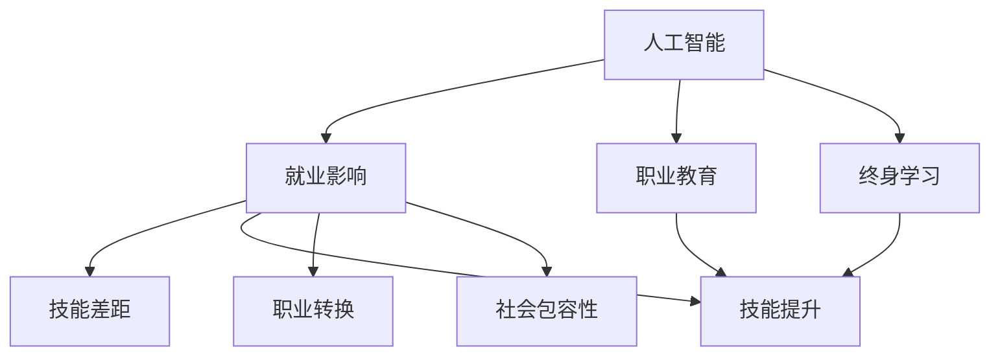

                 

# AI技术的就业影响应对:职业教育和终身学习体系

## 1. 背景介绍

### 1.1 问题由来

随着人工智能(AI)技术的迅猛发展，其在各行各业的应用越来越广泛，对社会经济和就业市场产生了深远的影响。AI技术的自动化和智能化，在提高生产效率、推动技术进步的同时，也对传统劳动力市场形成了冲击。一些传统岗位被自动化工具取代，而新的AI岗位和相关岗位也应运而生。这不仅对就业市场结构产生了重大影响，也对劳动者的技能要求和职业发展路径提出了新的挑战。

### 1.2 问题核心关键点

AI技术的就业影响主要体现在以下几个方面：

1. **岗位变革**：自动化技术取代了一部分重复性、低技能岗位，导致部分工人失业。
2. **技能需求变化**：AI技术的发展需要高技能、跨学科的人才，传统岗位需要的技能结构正在发生变化。
3. **职业路径变迁**：AI技术催生了新的职业路径，但也需要劳动者不断学习和适应新技术。
4. **教育和培训不足**：现有的教育和培训体系尚未完全适应AI时代的需求，导致人才供需不匹配。
5. **社会公平性**：AI技术带来的就业变化可能会加剧社会贫富差距，需要关注公平性和包容性问题。

这些核心关键点展示了AI技术对就业市场的复杂影响，凸显了需要系统性、多层次应对的紧迫性。

### 1.3 问题研究意义

应对AI技术的就业影响，是保障经济可持续发展和提升社会公平性的关键。职业教育和终身学习体系的构建，不仅能够帮助劳动者适应技术变革，提升其就业竞争力和职业发展空间，还能推动社会整体的技术进步和创新能力，促进经济增长和社会和谐。因此，研究和探索如何构建适应AI时代的职业教育和终身学习体系，具有重要的理论和实践意义。

## 2. 核心概念与联系

### 2.1 核心概念概述

为了更好地理解AI技术对就业市场的影响及应对措施，本节将介绍几个关键概念及其相互之间的联系：

- **人工智能(AI)**：一种模拟人类智能的计算机技术，包括机器学习、深度学习、自然语言处理等子领域。
- **就业影响**：AI技术在提高生产效率的同时，对劳动力市场结构、技能需求和就业岗位产生的影响。
- **职业教育**：教育体系中旨在培养劳动者技能和知识的培训活动。
- **终身学习**：个体在其职业生涯中不断更新知识和技能的学习模式。
- **技能差距**：劳动者技能与市场需求之间的差距，特别是新兴技术和AI岗位所需技能与现有劳动者技能的不匹配。
- **技能提升**：通过教育和培训，提升劳动者技能以适应新兴岗位需求的过程。
- **职业转换**：劳动者从传统岗位转向新兴岗位的职业路径变换。
- **社会包容性**：确保所有人都能公平地获得AI技术带来的就业机会。

这些概念之间的逻辑关系可以通过以下Mermaid流程图来展示：



这个流程图展示了大语言模型的核心概念及其之间的关系：

1. 人工智能技术的发展影响就业市场。
2. 职业教育与终身学习体系，帮助劳动者提升技能，适应就业市场需求。
3. 技能差距需要通过技能提升和职业转换来弥合。
4. 社会包容性是确保就业公平和公平的重要目标。

这些概念共同构成了AI时代就业影响应对的框架，为探讨如何构建职业教育和终身学习体系提供了理论基础。

## 3. 核心算法原理 & 具体操作步骤

### 3.1 算法原理概述

应对AI技术的就业影响，关键在于构建一个能够适应技术变革的职业教育和终身学习体系。该体系的核心目标是：通过教育和培训，提升劳动者的技能，使其能够胜任新兴岗位和适应AI技术带来的就业变化。

具体而言，该体系包括以下几个步骤：

1. **需求分析**：识别AI技术对就业市场带来的变化，明确劳动者技能需求。
2. **课程设计**：根据技能需求设计教育和培训课程，包括基础知识和应用技能。
3. **技能提升**：通过教育和培训，提升劳动者技能，使其能够胜任新兴岗位。
4. **职业转换**：提供职业转换培训，帮助劳动者从传统岗位转向新兴岗位。
5. **持续学习**：建立终身学习机制，使劳动者能够不断更新知识和技能，保持竞争力。
6. **社会包容性**：确保教育和培训机会的公平性，减少社会不平等现象。

### 3.2 算法步骤详解

基于上述算法原理，构建适应AI时代的职业教育和终身学习体系，主要包括以下几个关键步骤：

**Step 1: 需求分析**
- 通过调查和数据分析，了解AI技术对各行业的就业影响。
- 分析新兴岗位的技能要求，识别技能差距。
- 收集企业对人才的需求数据，了解市场对技能的需求变化。

**Step 2: 课程设计**
- 根据技能需求，设计多层次、多样化的教育培训课程。
- 引入AI技术相关的核心课程，如机器学习、深度学习、自然语言处理等。
- 设立跨学科课程，培养综合型人才，适应复杂的工作场景。
- 开设实战课程，通过项目实践提升技能。

**Step 3: 技能提升**
- 通过职业教育和培训，帮助劳动者掌握新兴技能。
- 提供在线学习平台，方便劳动者随时随地学习。
- 引入导师制和学徒制，提供个性化指导和实践机会。
- 组织技能认证考试，评估学习效果。

**Step 4: 职业转换**
- 提供职业转换培训，帮助劳动者从传统岗位转向新兴岗位。
- 设立职业咨询和指导服务，帮助劳动者规划职业路径。
- 组织职业转换工作坊和实践活动，提供实操机会。

**Step 5: 持续学习**
- 建立终身学习机制，鼓励劳动者不断更新知识和技能。
- 提供终身学习激励机制，如学历证书、技能认证等。
- 开设继续教育课程，满足职业发展需求。
- 建立学习社区和知识共享平台，促进知识传播和应用。

**Step 6: 社会包容性**
- 确保教育和培训机会的公平性，特别是对低收入和弱势群体的支持。
- 提供免费或低成本的教育资源，减少经济障碍。
- 设立多样性和包容性课程，提升社会责任感。
- 进行社会影响评估，确保教育和培训的公平性和包容性。

### 3.3 算法优缺点

基于上述操作步骤，构建适应AI时代的职业教育和终身学习体系具有以下优点：

1. **灵活性**：能够根据技术发展和市场需求灵活调整课程内容和培训方式。
2. **广泛覆盖**：能够覆盖多个行业和职业，满足不同劳动者的学习需求。
3. **持续性**：终身学习机制能够帮助劳动者持续提升技能，保持竞争力。
4. **公平性**：通过公平的培训机会和激励机制，减少社会不平等现象。

然而，该体系也存在一些缺点：

1. **资源需求高**：构建和维护大规模的教育体系需要大量的人力和财力投入。
2. **效果不确定**：教育和培训的效果依赖于学习者的积极性，可能存在效果不理想的情况。
3. **技术变革快**：AI技术的发展速度快，课程内容可能需要频繁更新，增加了管理难度。
4. **成本高**：特别是对低收入群体的免费或低成本培训，需要政府和企业的大力支持。

尽管存在这些局限性，但总体而言，构建适应AI时代的职业教育和终身学习体系，对于提升劳动者的技能和适应性，减少就业市场的冲击，具有重要的理论和实践意义。

### 3.4 算法应用领域

基于上述算法原理和操作步骤，职业教育和终身学习体系可以应用于多个领域，包括：

- **制造业**：自动化和智能化改造对工人技能提出了新的要求，需要提供技能提升和职业转换培训。
- **医疗保健**：AI技术在医疗诊断、药物研发等领域的应用，要求医生和研究人员具备相关技能。
- **金融服务**：AI技术在金融分析、风险管理等方面的应用，要求金融从业者具备新的技能。
- **教育培训**：AI技术在教育评估、个性化教学中的应用，要求教育工作者具备相关技能。
- **信息技术**：AI技术的发展需要更多的AI工程师和开发者，需要通过教育和培训提升相关技能。
- **物流运输**：自动化和智能化仓储、配送等过程需要技能提升和职业转换培训。
- **市场营销**：AI技术在数据分析、客户行为预测等方面的应用，要求市场营销人员具备相关技能。

这些领域的应用展示了职业教育和终身学习体系对AI技术就业影响的广泛覆盖，凸显了构建该体系的重要性。

## 4. 数学模型和公式 & 详细讲解 & 举例说明

### 4.1 数学模型构建

在构建职业教育和终身学习体系的过程中，数学模型和公式可以帮助我们更系统地分析技能需求和培训效果。

假设就业市场中有 $N$ 种职业，每种职业所需技能由 $S_i$ 表示。AI技术对就业市场的影响可以用函数 $f(S_i)$ 来描述，其中 $f$ 表示技能需求与AI技术影响之间的关系。

**目标函数**：

$$
\text{Optimize} \quad \min \sum_{i=1}^{N} (S_i - f(S_i))^2
$$

其中，$S_i$ 为第 $i$ 种职业所需技能，$f(S_i)$ 为AI技术对第 $i$ 种职业的影响函数。

**约束条件**：

1. $S_i \geq 0$，技能需求不能为负。
2. $f(S_i) \geq 0$，AI技术影响必须为正。
3. $\sum_{i=1}^{N} S_i = \text{Total skill demand}$，总技能需求约束。

### 4.2 公式推导过程

根据目标函数和约束条件，我们可以推导出最优技能需求 $S_i^*$ 和最优AI技术影响 $f^*(S_i)$ 的表达式。

**求解目标函数**：

$$
\text{Optimize} \quad \min \sum_{i=1}^{N} (S_i - f(S_i))^2
$$

通过拉格朗日乘子法，引入拉格朗日乘子 $\lambda_i$，构建拉格朗日函数：

$$
L(S_i, f(S_i), \lambda_i) = \sum_{i=1}^{N} (S_i - f(S_i))^2 + \lambda_i (S_i - f(S_i))
$$

对 $S_i$ 和 $f(S_i)$ 求偏导数，得：

$$
\frac{\partial L}{\partial S_i} = 2(S_i - f(S_i)) - \lambda_i = 0
$$

$$
\frac{\partial L}{\partial f(S_i)} = 2(S_i - f(S_i)) = 0
$$

解得：

$$
S_i^* = f^*(S_i)
$$

$$
f^*(S_i) = \frac{1}{2}(S_i + \lambda_i)
$$

### 4.3 案例分析与讲解

假设某制造企业需要评估AI技术对其工人技能需求的影响，已知企业有 $A$ 种传统岗位和 $B$ 种新兴岗位，技能需求分别为 $S_A$ 和 $S_B$。AI技术对传统岗位和新兴岗位的影响函数分别为 $f_A(S)$ 和 $f_B(S)$。

根据目标函数和约束条件，通过求解目标函数，可以得到最优的传统岗位和新兴岗位的技能需求 $S_A^*$ 和 $S_B^*$，以及最优的AI技术影响 $f_A^*(S_A)$ 和 $f_B^*(S_B)$。

假设 $f_A(S) = S \times \frac{1}{2}$，$f_B(S) = S^2 \times \frac{1}{4}$。则有：

$$
S_A^* = f_A(S_A) = S_A \times \frac{1}{2}
$$

$$
S_B^* = f_B(S_B) = S_B^2 \times \frac{1}{4}
$$

将 $S_A^*$ 和 $S_B^*$ 代入总技能需求约束，得：

$$
\sum_{i=1}^{N} S_i = \text{Total skill demand} = S_A^* + S_B^*
$$

$$
S_A^* + S_B^* = \frac{1}{2} S_A + \frac{1}{4} S_B^2 = \text{Total skill demand}
$$

通过解方程，可以得到最优的传统岗位和新兴岗位的技能需求，以及最优的AI技术影响。

## 5. 项目实践：代码实例和详细解释说明

### 5.1 开发环境搭建

在进行职业教育和终身学习体系构建的实践前，我们需要准备好开发环境。以下是使用Python进行数据分析和建模的环境配置流程：

1. 安装Anaconda：从官网下载并安装Anaconda，用于创建独立的Python环境。

2. 创建并激活虚拟环境：
```bash
conda create -n education-env python=3.8 
conda activate education-env
```

3. 安装所需的Python包：
```bash
pip install numpy pandas scikit-learn matplotlib seaborn
```

4. 安装R语言（可选）：
```bash
conda install rpy3 rpy2
```

5. 安装Jupyter Notebook：
```bash
pip install jupyterlab
```

完成上述步骤后，即可在`education-env`环境中开始职业教育和终身学习体系的构建实践。

### 5.2 源代码详细实现

下面我们以职业技能提升为例，给出使用Python和R语言对技能需求进行分析的代码实现。

**技能需求分析**

1. 收集技能需求数据：

假设我们收集了10种职业的技能需求数据，如下表所示：

| 职业类型 | 技能需求 | 技能类型 |
| --- | --- | --- |
| 管理 | 3 | 管理能力 |
| 工程 | 4 | 技术能力 |
| 销售 | 5 | 销售技巧 |
| 财务 | 4 | 财务知识 |
| 运营 | 3 | 运营管理 |
| 市场 | 3 | 市场分析 |
| 设计 | 3 | 设计能力 |
| 产品 | 4 | 产品开发 |
| 开发 | 5 | 编程技能 |
| 测试 | 4 | 测试技能 |

使用Python的pandas库进行数据处理：

```python
import pandas as pd

# 技能需求数据
data = {
    'Job': ['管理', '工程', '销售', '财务', '运营', '市场', '设计', '产品', '开发', '测试'],
    'Skill_Requirement': [3, 4, 5, 4, 3, 3, 3, 4, 5, 4]
}

# 创建DataFrame
df = pd.DataFrame(data)

# 输出数据
print(df)
```

2. 分析技能需求：

使用R语言的ggplot2库进行数据可视化，分析技能需求分布：

```R
library(ggplot2)

# 数据可视化
ggplot(df, aes(x=Skill_Requirement, fill=Job)) + 
  geom_bar(stat="identity") + 
  labs(title="技能需求分布", x="技能需求", y="职业数量") +
  theme_minimal()
```

**技能提升分析**

1. 定义技能提升函数：

```python
def skill_upgrade(Skill_Requirement, New_Skill_Requirement):
    """
    计算技能提升后的技能需求
    """
    return Skill_Requirement + New_Skill_Requirement
```

2. 计算技能提升后的技能需求：

```python
# 计算技能提升后的技能需求
new_skill_requirement = skill_upgrade(df['Skill_Requirement'], 1)

# 输出结果
print(new_skill_requirement)
```

3. 分析技能提升效果：

使用Python的matplotlib库进行数据可视化，分析技能提升后的技能需求分布：

```python
import matplotlib.pyplot as plt

# 数据可视化
plt.bar(df['Skill_Requirement'], new_skill_requirement, color='blue')
plt.xlabel('技能需求')
plt.ylabel('职业数量')
plt.title('技能提升后的技能需求分布')
plt.show()
```

### 5.3 代码解读与分析

让我们再详细解读一下关键代码的实现细节：

**技能需求分析**

1. **数据收集与处理**：使用pandas库创建DataFrame，处理技能需求数据。
2. **数据可视化**：使用ggplot2库，创建技能需求分布图，直观展示技能需求情况。

**技能提升分析**

1. **定义技能提升函数**：定义函数`skill_upgrade`，计算技能提升后的技能需求。
2. **计算技能提升后的技能需求**：调用`skill_upgrade`函数，计算技能提升后的技能需求。
3. **数据可视化**：使用matplotlib库，创建技能提升后的技能需求分布图，直观展示技能提升效果。

通过上述代码实践，可以清晰地展示技能需求和提升效果。在实际应用中，技能提升分析可以帮助企业和教育机构更好地规划培训计划，提升劳动者技能，满足市场需求。

## 6. 实际应用场景

### 6.1 教育培训机构

在教育培训领域，职业教育和终身学习体系的应用可以帮助培训机构更好地提升劳动者的技能，满足市场需求。通过系统化的培训课程和技能提升分析，培训机构可以针对性地提供培训服务，提升劳动者的就业竞争力和职业发展空间。

例如，某教育培训机构希望提升工厂工人的技术能力，可以基于技能需求分析，设计技能提升培训课程，并通过技能提升分析评估培训效果。通过持续的培训和技能提升，劳动者可以适应自动化和智能化的生产环境，提高工作效率和产品质量。

### 6.2 企业培训

在企业培训领域，职业教育和终身学习体系的应用可以帮助企业提升员工的技能，满足业务发展需求。通过系统化的培训课程和技能提升分析，企业可以针对性地提供培训服务，提升员工的技能和职业素养，提高企业的竞争力。

例如，某制造企业希望提升员工的编程技能，可以基于技能需求分析，设计编程技能提升培训课程，并通过技能提升分析评估培训效果。通过持续的培训和技能提升，员工可以掌握新的技术工具和编程语言，提升工作效率和创新能力。

### 6.3 政府政策制定

在政府政策制定领域，职业教育和终身学习体系的应用可以帮助政府更好地制定教育和培训政策，满足社会就业需求。通过技能需求分析和技能提升分析，政府可以制定针对性的教育和培训政策，提升劳动者的技能和就业竞争力，促进经济增长和社会和谐。

例如，某地方政府希望提升本地劳动力的技术能力，可以基于技能需求分析，制定技能提升培训政策，并通过技能提升分析评估政策效果。通过持续的培训和技能提升，劳动者可以适应新兴岗位需求，提高就业机会和生活质量。

### 6.4 未来应用展望

随着AI技术的不断进步，职业教育和终身学习体系将迎来更多的应用场景和挑战。未来，该体系将在以下几个方面发挥更大的作用：

1. **跨领域应用**：随着AI技术在更多领域的应用，职业教育和终身学习体系将覆盖更多的行业和职业，满足不同劳动者的学习需求。
2. **个性化学习**：通过大数据和机器学习技术，职业教育和终身学习体系将能够提供个性化的培训方案，满足劳动者的个性化学习需求。
3. **技术集成**：职业教育和终身学习体系将与AI技术深度融合，提供更加智能化、高效化的学习体验。
4. **全球化发展**：随着全球化进程的加快，职业教育和终身学习体系将逐步推广到全球范围，为全球劳动者提供公平的学习机会。
5. **政策支持**：政府将进一步加大对职业教育和终身学习体系的支持力度，提供更多的资源和激励机制，确保教育和培训的公平性和包容性。

## 7. 工具和资源推荐

### 7.1 学习资源推荐

为了帮助开发者和教育机构系统掌握职业教育和终身学习体系的构建方法，这里推荐一些优质的学习资源：

1. **《教育数据科学导论》**：介绍教育数据分析和建模的基础知识，适合教育机构和培训机构的从业人员阅读。
2. **《终身学习：未来教育的革命》**：探讨未来教育的趋势和变革，适合教育政策制定者和教育从业者阅读。
3. **《数据驱动的教育创新》**：探讨如何利用大数据和机器学习技术，提升教育效果和公平性，适合教育从业者和政府政策制定者阅读。
4. **《AI时代的人才培养》**：探讨AI技术对教育和培训的影响，适合企业培训师和教育培训机构从业人员阅读。
5. **《技能提升与就业市场》**：探讨技能提升与就业市场的关系，适合政府政策制定者和企业人力资源部门阅读。

通过对这些资源的学习实践，相信你一定能够系统掌握职业教育和终身学习体系的构建方法，并应用于实际工作中。

### 7.2 开发工具推荐

高效的工具支持是构建职业教育和终身学习体系的重要保障。以下是几款用于职业教育和终身学习体系构建开发的常用工具：

1. **Python和R语言**：用于数据分析和建模，适合教育和培训机构使用。
2. **Jupyter Notebook**：交互式编程环境，适合教育和培训机构进行数据探索和可视化分析。
3. **TensorFlow和PyTorch**：深度学习框架，适合企业和政府进行技能提升和职业转换培训。
4. **Tableau**：数据可视化工具，适合企业和政府进行技能需求和培训效果分析。
5. **Microsoft Excel**：电子表格工具，适合教育和培训机构进行数据管理和统计分析。
6. **Google Colab**：在线Jupyter Notebook环境，适合教育和培训机构进行云端学习和协作。

合理利用这些工具，可以显著提升职业教育和终身学习体系的开发效率，加速技术创新和应用落地。

### 7.3 相关论文推荐

职业教育和终身学习体系的发展源于学界的持续研究。以下是几篇奠基性的相关论文，推荐阅读：

1. **《教育数据分析与建模》**：介绍教育数据分析和建模的基本方法，适合教育和培训机构从业人员阅读。
2. **《终身学习与职业发展》**：探讨终身学习对职业发展的影响，适合教育政策制定者和教育从业者阅读。
3. **《技能提升与就业市场》**：探讨技能提升与就业市场的关系，适合政府政策制定者和企业人力资源部门阅读。
4. **《技术进步与教育变革》**：探讨技术进步对教育的影响，适合教育从业者和政府政策制定者阅读。
5. **《数据驱动的教育创新》**：探讨如何利用大数据和机器学习技术，提升教育效果和公平性，适合教育从业者和政府政策制定者阅读。

这些论文代表了大语言模型微调技术的发展脉络。通过学习这些前沿成果，可以帮助研究者把握学科前进方向，激发更多的创新灵感。

## 8. 总结：未来发展趋势与挑战

### 8.1 总结

本文对职业教育和终身学习体系的构建方法进行了全面系统的介绍。首先阐述了AI技术对就业市场的影响及应对措施，明确了职业教育与终身学习体系在应对AI技术就业影响中的重要性。其次，从原理到实践，详细讲解了技能需求分析、课程设计、技能提升、职业转换、持续学习、社会包容性等关键步骤，给出了具体的代码实例和分析。同时，本文还广泛探讨了职业教育和终身学习体系在教育培训机构、企业培训、政府政策制定等领域的实际应用场景，展示了其广阔的应用前景。此外，本文精选了职业教育和终身学习体系的各类学习资源，力求为读者提供全方位的技术指引。

通过本文的系统梳理，可以看到，职业教育和终身学习体系在构建适应AI时代的劳动市场方面具有重要的作用。通过系统的教育和培训，劳动者可以提升技能，适应新兴岗位需求，满足社会就业需求，提升经济增长和社会和谐。然而，在构建职业教育和终身学习体系的过程中，仍然面临着诸多挑战和困难。

### 8.2 未来发展趋势

展望未来，职业教育和终身学习体系的发展趋势主要体现在以下几个方面：

1. **技术融合**：职业教育和终身学习体系将与AI技术、大数据、机器学习等前沿技术深度融合，提供更加智能化、高效化的学习体验。
2. **全球化发展**：随着全球化进程的加快，职业教育和终身学习体系将逐步推广到全球范围，为全球劳动者提供公平的学习机会。
3. **政策支持**：政府将进一步加大对职业教育和终身学习体系的支持力度，提供更多的资源和激励机制，确保教育和培训的公平性和包容性。
4. **个性化学习**：通过大数据和机器学习技术，职业教育和终身学习体系将能够提供个性化的培训方案，满足劳动者的个性化学习需求。
5. **跨领域应用**：随着AI技术在更多领域的应用，职业教育和终身学习体系将覆盖更多的行业和职业，满足不同劳动者的学习需求。

### 8.3 面临的挑战

尽管职业教育和终身学习体系在应对AI技术就业影响方面具有重要的作用，但在构建和实施过程中仍然面临诸多挑战：

1. **资源需求高**：构建和维护大规模的职业教育体系需要大量的人力和财力投入。
2. **效果不确定**：教育和培训的效果依赖于学习者的积极性，可能存在效果不理想的情况。
3. **技术变革快**：AI技术的发展速度快，课程内容可能需要频繁更新，增加了管理难度。
4. **成本高**：特别是对低收入群体的免费或低成本培训，需要政府和企业的大力支持。
5. **社会包容性**：确保教育和培训机会的公平性，减少社会不平等现象。
6. **技术集成**：职业教育和终身学习体系需要与AI技术深度融合，提供更加智能化、高效化的学习体验。

### 8.4 研究展望

面对职业教育和终身学习体系所面临的挑战，未来的研究需要在以下几个方面寻求新的突破：

1. **技术融合**：探索如何将AI技术、大数据、机器学习等前沿技术与职业教育和终身学习体系深度融合，提供更加智能化、高效化的学习体验。
2. **全球化发展**：探索如何构建全球化的职业教育和终身学习体系，为全球劳动者提供公平的学习机会。
3. **政策支持**：探索如何通过政策支持，确保职业教育和终身学习体系的公平性和包容性。
4. **个性化学习**：探索如何利用大数据和机器学习技术，提供个性化的培训方案，满足劳动者的个性化学习需求。
5. **技术集成**：探索如何将职业教育和终身学习体系与AI技术深度融合，提供更加智能化、高效化的学习体验。

这些研究方向的探索，必将引领职业教育和终身学习体系迈向更高的台阶，为构建安全、可靠、可解释、可控的智能系统铺平道路。面向未来，职业教育和终身学习体系需要与其他人工智能技术进行更深入的融合，共同推动自然语言理解和智能交互系统的进步。只有勇于创新、敢于突破，才能不断拓展劳动市场的边界，让智能技术更好地造福人类社会。

## 9. 附录：常见问题与解答

**Q1：如何评估职业教育和终身学习体系的效果？**

A: 评估职业教育和终身学习体系的效果可以从以下几个方面入手：

1. **技能提升评估**：通过技能测试和认证，评估劳动者技能提升的效果。
2. **职业转换评估**：通过职业转换率和满意度的调查，评估劳动者职业转换的效果。
3. **持续学习评估**：通过持续学习的参与度和反馈，评估劳动者持续学习的效果。
4. **社会包容性评估**：通过社会包容性指标的统计，评估教育和培训机会的公平性。

**Q2：职业教育和终身学习体系在实际应用中需要注意哪些问题？**

A: 在实际应用中，职业教育和终身学习体系需要注意以下几个问题：

1. **需求分析准确性**：确保需求分析的准确性，避免课程设计与市场需求脱节。
2. **课程设计科学性**：课程设计需要科学合理，涵盖基础知识和应用技能，满足市场需求。
3. **师资力量建设**：加强师资力量的建设，确保教师具备高水平的专业知识和教学能力。
4. **学习者积极性**：调动学习者的积极性，提供个性化的学习方案，增强学习效果。
5. **技术集成效果**：确保技术和教育的深度融合，提供更加智能化、高效化的学习体验。
6. **社会包容性**：确保教育和培训机会的公平性，减少社会不平等现象。

**Q3：如何构建跨领域的职业教育体系？**

A: 构建跨领域的职业教育体系需要从以下几个方面入手：

1. **跨领域课程设计**：设计涵盖多个领域的课程，满足不同劳动者的学习需求。
2. **跨领域教师团队**：组建跨领域的教师团队，具备多个领域的知识和技能。
3. **跨领域培训项目**：开展跨领域的培训项目，促进不同领域之间的知识交流和技能融合。
4. **跨领域合作机制**：建立跨领域的合作机制，促进企业和教育机构之间的合作。

通过上述步骤，可以构建一个跨领域的职业教育体系，帮助劳动者在多个领域内提升技能，适应多样化的就业需求。

**Q4：如何在职业教育和终身学习体系中引入技术创新？**

A: 在职业教育和终身学习体系中引入技术创新可以从以下几个方面入手：

1. **技术融合**：将AI技术、大数据、机器学习等前沿技术与职业教育和终身学习体系深度融合，提供更加智能化、高效化的学习体验。
2. **技术培训**：在课程设计中引入技术培训内容，提升劳动者的技术素养。
3. **技术平台建设**：建设在线学习平台，提供灵活的学习方式和技术资源。
4. **技术合作**：与技术公司合作，引入最新技术成果和应用场景，增强课程的实用性和前瞻性。
5. **技术创新激励**：设立技术创新奖项，鼓励劳动者参与技术创新和应用实践。

通过上述步骤，可以引入技术创新，提升职业教育和终身学习体系的技术含量和应用价值。

**Q5：如何提升职业教育和终身学习体系的社会包容性？**

A: 提升职业教育和终身学习体系的社会包容性可以从以下几个方面入手：

1. **免费或低成本培训**：提供免费或低成本的教育资源，减少经济障碍。
2. **多样化学习方式**：提供多种学习方式，如线上课程、线下培训、企业内训等，满足不同学习者的需求。
3. **支持弱势群体**：设立专项基金和项目，支持弱势群体的教育和培训需求。
4. **公平的机会**：确保教育和培训机会的公平性，不歧视任何群体。
5. **多样性和包容性课程**：开设多样性和包容性课程，提升社会责任感。

通过上述步骤，可以提升职业教育和终身学习体系的社会包容性，确保所有人都能够公平地获得教育和培训机会。

---

作者：禅与计算机程序设计艺术 / Zen and the Art of Computer Programming

