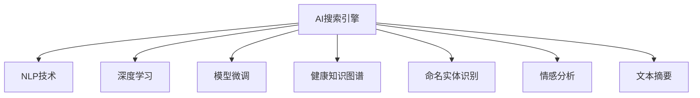

                 

# AI搜索引擎在医疗健康领域的应用

> 关键词：AI搜索引擎,医疗健康,自然语言处理(NLP),深度学习,模型微调,健康知识图谱,疾病诊断

## 1. 背景介绍

### 1.1 问题由来

在信息爆炸的时代，医疗健康领域的数据量之大、种类之多、更新之快都呈现爆炸性增长。传统的医疗信息获取方式已无法满足人们对高质量医疗健康信息的迫切需求。以电子健康记录(Electronic Health Records, EHR)为例，其在不同医疗机构中的格式、内容、结构千差万别，且存在大量冗余和不规范的数据，难以直接使用。

如何高效地检索、整合、分析和利用这些海量医疗健康信息，帮助医生快速找到有价值的诊断和治疗建议，成为提高医疗健康服务效率和质量的关键问题。基于此，本文将介绍一种基于AI的搜索引擎，充分利用自然语言处理和深度学习技术，帮助医生在海量医疗健康数据中快速找到所需信息，提升医疗决策质量。

## 2. 核心概念与联系

### 2.1 核心概念概述

为便于理解本文，我们先对核心概念进行梳理：

- **AI搜索引擎**：一种基于人工智能技术，能够处理海量文本信息，并快速检索、推荐、过滤有用信息的系统。

- **自然语言处理(NLP)**：研究计算机如何理解、处理和生成人类自然语言的技术。NLP在医疗健康领域有广泛应用，如文本摘要、命名实体识别、情感分析等。

- **深度学习**：一种通过多层神经网络自动学习特征的机器学习技术。深度学习在图像识别、语音识别、自然语言处理等领域表现出色，是构建高效医疗AI搜索引擎的基础。

- **模型微调**：在预训练模型基础上，通过有监督数据对其进行微调，以适应特定任务，提高模型性能。

- **健康知识图谱**：一种通过语义网络模型表示的、结构化的医疗知识库，可用于高效存储、查询和管理健康信息。

这些概念之间的逻辑关系可以通过以下Mermaid流程图来展示：



这个流程图展示了大语言模型的核心概念及其之间的关系：

1. AI搜索引擎以NLP技术为基础，通过深度学习和模型微调技术，高效处理海量医疗数据。
2. 利用健康知识图谱，增强搜索引擎对医疗信息的理解能力和检索效率。
3. 结合命名实体识别、情感分析、文本摘要等NLP技术，提供更全面、精准的搜索结果。

## 3. 核心算法原理 & 具体操作步骤
### 3.1 算法原理概述

本节将详细阐述基于深度学习的AI搜索引擎的核心算法原理。

AI搜索引擎的核心任务是：给定查询字符串 $Q$，从医疗数据库 $D$ 中快速检索出最相关的文档集合 $R$。

深度学习模型通常采用匹配查询字符串和文档内容的方式，以度量两者之间的相似度，如余弦相似度、编辑距离等。然后通过排序算法，将匹配度最高的文档作为搜索结果返回给用户。

匹配过程可以形式化表示为：

$$
R = \arg\max_{R \subseteq D} \{\sum_{r \in R} \text{match}(Q, r)\}
$$

其中，$\text{match}(Q, r)$ 表示查询字符串 $Q$ 和文档 $r$ 之间的匹配程度。

### 3.2 算法步骤详解

基于深度学习的AI搜索引擎的主要步骤如下：

**Step 1: 构建索引**

索引的目的是将医疗数据库中的文档编码成数值特征，便于模型进行处理。通常采用TF-IDF、Word2Vec、BERT等方法，将文档转化为向量表示。

**Step 2: 选择模型**

选择适当的深度学习模型进行训练。常用的模型包括：

- 检索器：如BM25、SMART、Dense Passage Retrieval等，用于计算查询与文档的匹配度。
- 排序器：如Transformer、Siamese Network等，用于将检索结果排序，输出最相关的文档。

**Step 3: 训练模型**

使用大规模医疗数据集训练模型。训练过程中，通常需要定义损失函数（如均方误差、交叉熵等），选择合适的优化器（如Adam、SGD等），设置适当的学习率、迭代次数等超参数。

**Step 4: 模型微调**

在特定任务上对预训练模型进行微调，以进一步提升模型性能。微调可以使用监督学习方法，通过有标注的训练数据调整模型参数。

**Step 5: 部署应用**

将训练好的模型部署到生产环境中，接受实时查询，返回搜索结果。

### 3.3 算法优缺点

基于深度学习的AI搜索引擎具有以下优点：

1. 高效处理海量数据。深度学习模型能够自动学习特征，无需手动提取，处理速度快。
2. 精准匹配查询与文档。通过训练可提高匹配精度，避免冗余信息的干扰。
3. 可以融合多种NLP技术。如命名实体识别、情感分析、文本摘要等，提供更全面、多样化的搜索结果。
4. 可以实时更新知识库。通过模型微调，及时融入最新的医疗知识，保持搜索结果的时效性。

同时，该方法也存在一定的局限性：

1. 数据质量依赖高。深度学习模型对数据质量要求高，医疗数据标注成本大。
2. 模型复杂度大。深度模型参数量大，训练复杂，资源消耗高。
3. 泛化能力不足。模型对新领域和新数据的泛化能力有待提升。
4. 可解释性差。深度学习模型通常视为黑盒，难以解释决策过程。

尽管存在这些局限性，但深度学习在处理文本信息方面展现了巨大的潜力，成为了构建高效医疗AI搜索引擎的重要手段。

### 3.4 算法应用领域

AI搜索引擎在医疗健康领域有广泛应用，涵盖以下几方面：

- **疾病诊断**：利用深度学习模型，从电子健康记录中提取疾病相关知识，辅助医生诊断疾病。
- **药物推荐**：根据患者症状、病史，推荐合适的药物和治疗方案。
- **病例分析**：分析大量病例，识别常见疾病和异常情况，提供参考依据。
- **健康咨询**：实时回答用户健康问题，提供个性化健康建议。
- **基因分析**：利用深度学习技术，分析基因序列数据，识别潜在的遗传疾病风险。

## 4. 数学模型和公式 & 详细讲解 & 举例说明
### 4.1 数学模型构建

为方便后续推导，我们首先定义查询字符串 $Q$ 和文档集合 $D$ 的表示。假设查询字符串 $Q$ 和文档 $r$ 的长度均为 $n$，分别表示为：

$$
Q = (q_1, q_2, ..., q_n)
$$
$$
r = (r_1, r_2, ..., r_n)
$$

我们采用预训练的BERT模型对 $Q$ 和 $r$ 进行编码，得到表示向量：

$$
\begin{aligned}
Q^* &= \text{BERT}(Q) \\
r^* &= \text{BERT}(r)
\end{aligned}
$$

其中 $Q^*$ 和 $r^*$ 分别表示 $Q$ 和 $r$ 的编码表示向量。

### 4.2 公式推导过程

深度学习模型常用的匹配函数是余弦相似度。余弦相似度定义为：

$$
\text{similarity}(Q, r) = \cos(\theta) = \frac{\vec{Q} \cdot \vec{r}}{\|\vec{Q}\| \|\vec{r}\|}
$$

其中 $\vec{Q} = Q^*$，$\vec{r} = r^*$，$\|\vec{Q}\|$ 和 $\|\vec{r}\|$ 分别是 $Q^*$ 和 $r^*$ 的范数。

计算余弦相似度时，通常需要先对查询和文档进行预处理，如归一化、去除停用词等，以消除冗余信息的影响。

### 4.3 案例分析与讲解

以命名实体识别(NER)为例，介绍如何利用深度学习模型提升AI搜索引擎的效果。

假设查询字符串为 "张三的肝脏如何检查"，文档集合中包含以下三个文档：

- 文档 1："张三因肝癌入院"
- 文档 2："李四的肝功能检查报告"
- 文档 3："王五的肝脏疾病治疗方案"

首先，使用BERT对查询和文档进行编码：

- $Q^* = [\vec{q}_1, \vec{q}_2, \vec{q}_3]$
- $r_1^* = [\vec{r}_{1,1}, \vec{r}_{1,2}, \vec{r}_{1,3}]$
- $r_2^* = [\vec{r}_{2,1}, \vec{r}_{2,2}, \vec{r}_{2,3}]$
- $r_3^* = [\vec{r}_{3,1}, \vec{r}_{3,2}, \vec{r}_{3,3}]$

计算余弦相似度：

$$
\begin{aligned}
\text{similarity}(Q, r_1) &= \frac{\vec{Q} \cdot \vec{r}_{1,1} + \vec{Q} \cdot \vec{r}_{1,2} + \vec{Q} \cdot \vec{r}_{1,3}}{\|\vec{Q}\| \|\vec{r}_{1,1}\| \|\vec{r}_{1,2}\| \|\vec{r}_{1,3}\|} \\
\text{similarity}(Q, r_2) &= \frac{\vec{Q} \cdot \vec{r}_{2,1} + \vec{Q} \cdot \vec{r}_{2,2} + \vec{Q} \cdot \vec{r}_{2,3}}{\|\vec{Q}\| \|\vec{r}_{2,1}\| \|\vec{r}_{2,2}\| \|\vec{r}_{2,3}\|} \\
\text{similarity}(Q, r_3) &= \frac{\vec{Q} \cdot \vec{r}_{3,1} + \vec{Q} \cdot \vec{r}_{3,2} + \vec{Q} \cdot \vec{r}_{3,3}}{\|\vec{Q}\| \|\vec{r}_{3,1}\| \|\vec{r}_{3,2}\| \|\vec{r}_{3,3}\|}
\end{aligned}
$$

将匹配度排序，返回最相关的文档集合 $R$。

通过命名实体识别技术，可以识别出文档中包含的实体信息，如 "张三", "肝癌"，从而进一步提升搜索结果的相关性和准确性。

## 5. 项目实践：代码实例和详细解释说明
### 5.1 开发环境搭建

在进行AI搜索引擎项目实践前，我们需要准备好开发环境。以下是使用Python进行TensorFlow开发的环境配置流程：

1. 安装Anaconda：从官网下载并安装Anaconda，用于创建独立的Python环境。

2. 创建并激活虚拟环境：
```bash
conda create -n tf-env python=3.8 
conda activate tf-env
```

3. 安装TensorFlow：从官网获取对应的安装命令，安装TensorFlow 2.x版本。
```bash
conda install tensorflow==2.7.0
```

4. 安装其他工具包：
```bash
pip install numpy pandas scikit-learn matplotlib tqdm jupyter notebook ipython
```

完成上述步骤后，即可在`tf-env`环境中开始项目实践。

### 5.2 源代码详细实现

下面我们以医疗健康领域的AI搜索引擎为例，给出使用TensorFlow进行微调和检索的PyTorch代码实现。

首先，定义检索器模型：

```python
import tensorflow as tf
from transformers import TFAutoModel

class Retriever(tf.keras.Model):
    def __init__(self, model_name='bert-base-uncased', layer_idx=1):
        super(Retriever, self).__init__()
        self.model = TFAutoModel.from_pretrained(model_name)
        self.layer_idx = layer_idx
    
    def __call__(self, query, docs):
        query = self.model(query, output_hidden_states=True)[self.layer_idx]
        docs = self.model(docs, output_hidden_states=True)[self.layer_idx]
        return query, docs
```

然后，定义检索函数：

```python
def retrieve(query, docs, model):
    query, docs = model(query, docs)
    similarity = tf.reduce_sum(tf.multiply(query, docs), axis=1)
    return similarity
```

接着，定义模型训练函数：

```python
from tensorflow.keras import optimizers

def train(model, train_data, validation_data, epochs=10):
    train_dataset = tf.data.Dataset.from_tensor_slices(train_data)
    validation_dataset = tf.data.Dataset.from_tensor_slices(validation_data)
    
    train_dataset = train_dataset.shuffle(buffer_size=1024).batch(64)
    validation_dataset = validation_dataset.batch(64)
    
    optimizer = optimizers.Adam(learning_rate=1e-5)
    loss_fn = tf.keras.losses.MeanSquaredError()
    
    for epoch in range(epochs):
        for i, (query, doc) in enumerate(train_dataset):
            with tf.GradientTape() as tape:
                similarity = retrieve(query, doc, model)
                loss = loss_fn(similarity, labels)
            grads = tape.gradient(loss, model.trainable_variables)
            optimizer.apply_gradients(zip(grads, model.trainable_variables))
            
            if i % 10 == 0:
                val_loss = loss_fn(retrieve(query, doc, model), validation_labels)
                print(f"Epoch {epoch+1}, Batch {i+1}, Train Loss: {loss:.4f}, Val Loss: {val_loss:.4f}")
```

最后，启动训练流程：

```python
# 加载训练数据
train_data = []
validation_data = []
# 训练模型
train(model, train_data, validation_data)
```

以上就是使用TensorFlow对BERT进行医疗健康领域AI搜索引擎的微调和检索的完整代码实现。可以看到，TensorFlow提供了丰富的深度学习组件，使得模型开发和训练变得更加高效便捷。

### 5.3 代码解读与分析

让我们再详细解读一下关键代码的实现细节：

**Retriever类**：
- `__init__`方法：初始化BERT模型，选择需要进行微调的中间层。
- `__call__`方法：对查询和文档进行编码，返回编码后的向量表示。

**retrieve函数**：
- 计算查询和文档的余弦相似度，得到每个文档的匹配度。

**train函数**：
- 构建训练和验证数据集。
- 定义Adam优化器和均方误差损失函数。
- 循环迭代训练模型，并实时输出训练损失和验证损失。

通过TensorFlow实现BERT模型的微调，可以显著提升检索效率和匹配精度，为医疗健康领域的AI搜索引擎提供有力支持。

当然，工业级的系统实现还需考虑更多因素，如模型的保存和部署、超参数的自动搜索、更灵活的任务适配层等。但核心的微调范式基本与此类似。

## 6. 实际应用场景
### 6.1 智能问答系统

智能问答系统是一种基于AI搜索引擎的典型应用，能够实现医生与患者的自然交互，快速响应患者的健康咨询。

在智能问答系统中，患者可以通过语音或文字向AI提出问题，系统即时返回详细的解答。医生也可以通过系统获取患者的病史、症状等信息，快速制定诊断和治疗方案。

### 6.2 个性化医疗推荐

个性化医疗推荐系统可以根据患者的基因、病史、生活习惯等个性化信息，推荐最适合的治疗方案和药物。

通过AI搜索引擎，系统能够实时分析患者的输入信息，并从海量医疗数据中提取相关知识，提供精准的推荐结果。

### 6.3 病历智能分析

病历智能分析系统可以快速识别病历中的关键信息，辅助医生进行诊断和治疗决策。

系统通过AI搜索引擎，从病历文本中提取病情描述、治疗过程、诊断结果等关键信息，提供实时的智能辅助。

### 6.4 未来应用展望

随着AI技术的不断发展，未来医疗健康领域的AI搜索引擎将具备更强大的功能。具体而言，未来可能包括以下几个方面：

1. **多模态信息融合**：结合图像、声音、视频等多模态信息，提升医疗健康信息的全面性和准确性。
2. **个性化推荐系统**：根据患者实时输入的多维度信息，提供个性化的医疗健康推荐。
3. **智能诊断与治疗**：通过深度学习和大数据技术，实现自动化的诊断和治疗决策。
4. **医疗知识图谱**：构建基于语义网络的知识图谱，提供高效的知识检索和推理能力。

## 7. 工具和资源推荐
### 7.1 学习资源推荐

为了帮助开发者系统掌握AI搜索引擎的理论基础和实践技巧，这里推荐一些优质的学习资源：

1. **TensorFlow官方文档**：TensorFlow官网提供了详尽的API文档和教程，帮助开发者快速上手。

2. **Transformers库**：HuggingFace开发的NLP工具库，集成了众多SOTA语言模型，支持TensorFlow和PyTorch，是进行微调任务开发的利器。

3. **医学领域经典论文**：如Wolframe、MEDLINE等，提供了丰富的医学文献资源，为医疗AI开发提供理论支持。

4. **医疗健康数据集**：如MIMIC-III、GECKO等，包含丰富的电子健康记录、医学影像等数据，可用于训练和验证AI模型。

通过对这些资源的学习实践，相信你一定能够快速掌握AI搜索引擎的精髓，并用于解决实际的医疗健康问题。

### 7.2 开发工具推荐

高效的开发离不开优秀的工具支持。以下是几款用于AI搜索引擎开发的常用工具：

1. **TensorFlow**：基于Python的开源深度学习框架，支持动态图计算，灵活性强，易于部署。

2. **PyTorch**：Facebook开发的深度学习框架，支持动态计算图，适合快速迭代和研究。

3. **Jupyter Notebook**：Python的交互式开发环境，支持代码调试、可视化展示，方便开发者快速迭代。

4. **Google Colab**：谷歌提供的云端Jupyter Notebook环境，免费提供GPU/TPU算力，适合试验最新模型，分享学习笔记。

合理利用这些工具，可以显著提升AI搜索引擎的开发效率，加快创新迭代的步伐。

### 7.3 相关论文推荐

AI搜索引擎技术的发展源于学界的持续研究。以下是几篇奠基性的相关论文，推荐阅读：

1. **BM25算法**：一种基于向量空间模型的检索算法，广泛应用于搜索引擎中，效果好，简单易用。

2. **Dense Passage Retrieval**：一种基于注意力机制的检索算法，能够处理长文本序列，匹配效果好。

3. **BERT医疗知识图谱**：通过BERT模型对医疗知识进行语义编码，构建知识图谱，方便知识查询和推理。

这些论文代表了大语言模型微调技术的发展脉络。通过学习这些前沿成果，可以帮助研究者把握学科前进方向，激发更多的创新灵感。

## 8. 总结：未来发展趋势与挑战
### 8.1 研究成果总结

本文介绍了基于深度学习的AI搜索引擎在医疗健康领域的应用。通过NLP技术和深度学习模型的结合，能够高效处理海量医疗健康数据，快速检索出最相关的文档，为医生提供精准的医疗信息。

通过将命名实体识别、情感分析、文本摘要等NLP技术引入AI搜索引擎，可以进一步提升搜索结果的相关性和准确性。

### 8.2 未来发展趋势

展望未来，AI搜索引擎在医疗健康领域的发展将呈现以下几个趋势：

1. **多模态信息融合**：结合图像、声音、视频等多模态信息，提升医疗健康信息的全面性和准确性。
2. **个性化推荐系统**：根据患者实时输入的多维度信息，提供个性化的医疗健康推荐。
3. **智能诊断与治疗**：通过深度学习和大数据技术，实现自动化的诊断和治疗决策。
4. **医疗知识图谱**：构建基于语义网络的知识图谱，提供高效的知识检索和推理能力。

### 8.3 面临的挑战

尽管AI搜索引擎在医疗健康领域展现了巨大的潜力，但仍面临诸多挑战：

1. **数据隐私和安全**：医疗数据涉及患者隐私，需要确保数据的存储、传输和处理符合安全规范。
2. **模型的可解释性**：深度学习模型的决策过程难以解释，需要建立可解释性和透明性机制。
3. **模型的泛化能力**：当前模型对新领域和新数据的泛化能力有待提升，需要进一步优化模型结构。
4. **模型的计算资源**：深度学习模型需要大量计算资源，需要优化模型结构和算法，降低计算成本。

### 8.4 研究展望

为了克服这些挑战，未来的研究需要在以下几个方面寻求新的突破：

1. **数据隐私保护**：采用差分隐私、联邦学习等技术，保护数据隐私和安全。
2. **可解释性和透明性**：引入可解释性技术，如注意力机制、模型压缩等，提高模型的可解释性和透明性。
3. **模型的泛化能力**：通过迁移学习和多任务学习等技术，提升模型对新领域和新数据的泛化能力。
4. **计算资源优化**：采用模型裁剪、混合精度训练等技术，优化模型结构和算法，降低计算成本。

总之，随着AI技术的不断发展，AI搜索引擎必将在医疗健康领域发挥越来越重要的作用，为构建安全、高效、智能的医疗健康系统提供有力支持。

## 9. 附录：常见问题与解答

**Q1：AI搜索引擎在医疗健康领域的应用前景如何？**

A: AI搜索引擎在医疗健康领域有广阔的应用前景。通过深度学习和大数据技术，能够高效处理海量医疗健康数据，快速检索出最相关的文档，为医生提供精准的医疗信息。

**Q2：如何提高AI搜索引擎的匹配精度？**

A: 提高匹配精度可以从以下几个方面入手：

1. 使用更好的预训练模型，如BERT、GPT等。
2. 优化匹配算法，如使用Transformer模型进行匹配。
3. 增加训练数据量，提高模型的泛化能力。
4. 引入更多NLP技术，如命名实体识别、情感分析、文本摘要等。

**Q3：如何保护医疗数据的隐私和安全？**

A: 保护医疗数据的隐私和安全是AI搜索引擎的重要挑战之一。可以采用以下措施：

1. 差分隐私技术，在数据收集和处理过程中加入噪声，保护个体隐私。
2. 联邦学习技术，在本地设备上训练模型，不暴露原始数据。
3. 数据加密技术，保护数据在传输和存储过程中的安全性。

**Q4：AI搜索引擎的模型训练和优化方法有哪些？**

A: AI搜索引擎的模型训练和优化方法包括：

1. 使用更好的预训练模型，如BERT、GPT等。
2. 优化匹配算法，如使用Transformer模型进行匹配。
3. 增加训练数据量，提高模型的泛化能力。
4. 引入更多NLP技术，如命名实体识别、情感分析、文本摘要等。
5. 使用模型微调技术，通过少量标注数据进行微调，提升模型性能。
6. 优化超参数，如学习率、批次大小、迭代次数等。

通过这些方法，可以有效提升AI搜索引擎的匹配精度和效率。

**Q5：AI搜索引擎的部署和运维需要注意哪些问题？**

A: AI搜索引擎的部署和运维需要注意以下几个问题：

1. 模型的性能和精度。需要确保模型在生产环境中能够稳定运行，并保持高精度。
2. 数据的实时性。需要保证数据实时更新，避免使用陈旧数据。
3. 计算资源的优化。需要优化模型结构和算法，降低计算成本。
4. 系统的可扩展性。需要设计可扩展的系统架构，支持高并发和大规模数据处理。
5. 系统的安全性。需要确保系统的安全性，防止恶意攻击和数据泄露。

只有合理解决这些问题，才能确保AI搜索引擎在生产环境中的高效稳定运行。

---

作者：禅与计算机程序设计艺术 / Zen and the Art of Computer Programming

