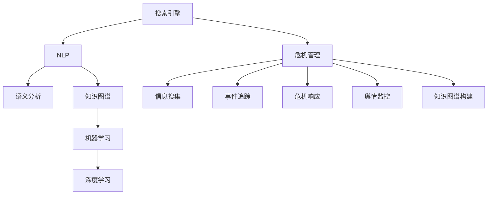

                 

# AI搜索引擎在危机管理中的作用

## 1. 背景介绍

### 1.1 问题由来
危机管理（Crisis Management），是企业在遭遇突发事件、自然灾害或公共卫生事件等危机时，如何高效、透明、有序地应对和处理的一系列管理行为。随着社会数字化进程的加速，企业在面对危机时，需要快速响应、精准定位，并采取有效的措施，这使得AI搜索引擎在危机管理中的作用日益凸显。

### 1.2 问题核心关键点
1. **信息搜集与处理**：危机管理的首要任务是迅速搜集和处理各类信息，确保决策基于实证。
2. **事件追踪与趋势分析**：实时追踪危机事件的发展趋势，分析其影响和潜在风险。
3. **危机响应与决策支持**：提供基于大数据和机器学习算法的决策支持系统，辅助决策者制定应对策略。
4. **舆情监控与情感分析**：监测公众舆情，分析社会情绪变化，为危机应对提供参考。
5. **知识图谱构建**：构建领域知识图谱，帮助决策者快速获取相关知识和经验。

## 2. 核心概念与联系

### 2.1 核心概念概述

为了更好地理解AI搜索引擎在危机管理中的作用，本节将介绍几个关键概念：

1. **搜索引擎**：搜索引擎是用于帮助用户通过查询获取信息的系统。AI搜索引擎则是指使用人工智能技术来提升查询效果和信息相关性。
2. **自然语言处理（NLP）**：NLP是一种人工智能技术，用于理解和处理人类语言。
3. **知识图谱**：知识图谱是一种结构化的知识表示方法，用于存储和查询实体的关系和属性。
4. **语义分析**：语义分析是NLP的一个分支，用于理解语言背后的深层含义。
5. **机器学习（ML）**：机器学习是让计算机从数据中学习规律并作出预测或决策的技术。
6. **深度学习（DL）**：深度学习是机器学习的一个子集，通过多层神经网络来学习和处理数据。
7. **危机管理**：危机管理是指企业如何应对突发事件或危机，以最小化负面影响并尽快恢复正常运营。

这些概念之间的联系可以通过以下Mermaid流程图来展示：



这个流程图展示了这个框架中各概念之间的联系：

1. 搜索引擎作为信息搜集的工具，在危机管理中扮演重要角色。
2. NLP、语义分析、知识图谱等技术用于处理和理解搜索引擎检索到的文本数据。
3. 机器学习和深度学习用于从文本数据中提取有价值的信息。
4. 危机管理通过信息的搜集、事件追踪、决策支持、舆情监控等环节，完成对危机的应对。

## 3. 核心算法原理 & 具体操作步骤
### 3.1 算法原理概述

AI搜索引擎在危机管理中的应用，核心在于其能够利用自然语言处理和机器学习技术，高效地处理大规模数据，从中提取有价值的信息，辅助决策者做出快速响应。

搜索引擎的核心算法包括：

1. **信息检索**：根据用户查询，从海量的文档库中检索出相关的结果。
2. **文本挖掘**：从文本中提取关键词、实体和关系，用于理解用户查询意图和文档内容。
3. **自然语言理解**：理解用户查询和文档的语义，消除歧义，提高检索的准确性。
4. **语义相似度计算**：计算用户查询和文档之间的语义相似度，确定文档的相关性。

危机管理中的搜索引擎应用，不仅关注信息检索，还关注对危机信息的实时处理和理解，具体步骤包括：

1. **信息搜集**：收集危机事件相关的所有公开信息，如新闻报道、社交媒体帖子、官方声明等。
2. **事件追踪**：实时追踪事件的发展，分析事件变化趋势和可能影响。
3. **危机响应**：根据事件信息和分析结果，生成危机应对策略和措施。
4. **舆情监控**：监测公众舆情，分析情绪变化，为危机应对提供参考。
5. **知识图谱构建**：构建领域知识图谱，帮助快速获取相关知识和经验。

### 3.2 算法步骤详解

AI搜索引擎在危机管理中的应用步骤包括：

**Step 1: 数据准备**
- 收集各类与危机相关的信息，如新闻报道、社交媒体帖子、官方声明等。
- 清洗和整理数据，去除无关信息，减少噪声。

**Step 2: 信息检索**
- 使用搜索引擎系统，根据用户的查询，检索相关文档。
- 应用NLP和语义分析技术，理解查询和文档的语义，消除歧义。
- 计算查询和文档的语义相似度，确定相关性。

**Step 3: 事件追踪与趋势分析**
- 对检索到的文档进行进一步分析，提取事件的时间、地点、涉及人员等信息。
- 使用机器学习和深度学习算法，分析事件的发展趋势和可能影响。

**Step 4: 危机响应与决策支持**
- 根据事件分析和趋势预测，生成危机应对策略和措施。
- 提供基于大数据和机器学习算法的决策支持系统，辅助决策者制定决策。

**Step 5: 舆情监控与情感分析**
- 监测公众舆情，分析情绪变化，为危机应对提供参考。
- 应用情感分析技术，理解公众情绪，为决策提供依据。

**Step 6: 知识图谱构建**
- 构建领域知识图谱，存储相关领域知识。
- 使用搜索引擎系统，快速获取相关知识和经验，辅助决策者。

### 3.3 算法优缺点

AI搜索引擎在危机管理中的应用，具有以下优点：

1. **高效性**：能够快速检索和处理大量信息，减少人工工作量。
2. **准确性**：利用NLP和语义分析技术，提高检索和理解准确性。
3. **实时性**：能够实时追踪事件发展，快速响应危机。
4. **支持决策**：提供基于大数据和机器学习算法的决策支持，辅助决策者。
5. **舆情监测**：监测公众舆情，为危机应对提供参考。

同时，也存在以下局限性：

1. **数据依赖**：依赖于公开数据的准确性和完整性，数据不足可能影响决策效果。
2. **技术门槛**：需要具备一定的技术背景和专业技能，中小企业难以实施。
3. **隐私问题**：涉及大量个人信息，需注意隐私保护。
4. **算法复杂性**：算法模型复杂，计算量大，对硬件要求较高。

### 3.4 算法应用领域

AI搜索引擎在危机管理中的应用，主要集中在以下几个领域：

1. **自然灾害应对**：如地震、洪水、火灾等，快速搜集和分析相关信息，辅助救援和灾后重建。
2. **公共卫生事件**：如疫情爆发、疾病暴发等，监测舆情，辅助防控和救治。
3. **突发事件响应**：如恐怖袭击、交通事故等，实时追踪和响应，减少损失。
4. **企业危机管理**：如安全事故、市场纠纷等，监测舆情，辅助决策和公关。
5. **社会事件处理**：如群体性事件、网络舆情等，分析情绪，辅助处理。

## 4. 数学模型和公式 & 详细讲解  
### 4.1 数学模型构建

在本节中，我们将使用数学语言对AI搜索引擎在危机管理中的应用进行更加严格的刻画。

假设搜索引擎从数据库中检索到与用户查询相关的$N$个文档，每个文档由多个文本组成。设查询为$Q$，文档为$D=\{d_1, d_2, ..., d_N\}$。查询与文档的语义相似度为$\theta$。

定义搜索引擎的检索模型为$F(Q, D)$，则检索结果为：

$$
\arg\min_{i=1,...,N} \mathcal{L}(Q, d_i)
$$

其中$\mathcal{L}(Q, d_i)$为查询$Q$与文档$d_i$之间的损失函数，用于衡量两者之间的语义相似度。

### 4.2 公式推导过程

在实际的检索中，常用余弦相似度（Cosine Similarity）作为损失函数$\mathcal{L}$。余弦相似度定义为：

$$
\mathcal{L}(Q, d_i) = -\log \frac{\cos(\theta)}{\sqrt{\cos(\theta_Q) \cos(\theta_{d_i})}}
$$

其中$\theta_Q$为查询$Q$的词向量，$\theta_{d_i}$为文档$d_i$的词向量。

对于语义相似度$\theta$的计算，通常使用BERT、GPT等预训练语言模型进行编码，然后通过余弦相似度计算得到。

### 4.3 案例分析与讲解

以自然灾害监测为例，假设搜索引擎需要从海量的新闻报道中快速获取地震相关信息。首先，对地震新闻进行数据清洗和预处理，去除无关信息。然后，使用NLP技术对新闻进行分词、词性标注和命名实体识别。接着，将新闻转换成向量表示，计算与查询的余弦相似度，筛选出相关新闻。最后，应用机器学习和深度学习算法，分析地震发展趋势和影响，为救援和重建提供决策支持。

## 5. 项目实践：代码实例和详细解释说明
### 5.1 开发环境搭建

在进行搜索引擎的危机管理应用开发前，我们需要准备好开发环境。以下是使用Python进行TensorFlow开发的环境配置流程：

1. 安装Anaconda：从官网下载并安装Anaconda，用于创建独立的Python环境。

2. 创建并激活虚拟环境：
```bash
conda create -n tf-env python=3.8 
conda activate tf-env
```

3. 安装TensorFlow：根据CUDA版本，从官网获取对应的安装命令。例如：
```bash
conda install tensorflow tensorflow-cpu -c conda-forge -c nvidia
```

4. 安装必要的库：
```bash
pip install numpy pandas scikit-learn tensorflow-models-official
```

完成上述步骤后，即可在`tf-env`环境中开始搜索引擎的开发实践。

### 5.2 源代码详细实现

以下是使用TensorFlow进行自然灾害监测的代码实现。

首先，定义数据预处理函数：

```python
import tensorflow as tf
from tensorflow.keras.preprocessing.text import Tokenizer
from tensorflow.keras.preprocessing.sequence import pad_sequences

def preprocess(texts):
    tokenizer = Tokenizer()
    tokenizer.fit_on_texts(texts)
    sequences = tokenizer.texts_to_sequences(texts)
    return pad_sequences(sequences, maxlen=128, padding='post')
```

然后，定义模型训练函数：

```python
def train_model(train_texts, train_labels, test_texts, test_labels, epochs=10, batch_size=16):
    model = tf.keras.Sequential([
        tf.keras.layers.Embedding(input_dim=len(tokenizer.word_index) + 1, output_dim=64, input_length=128),
        tf.keras.layers.Bidirectional(tf.keras.layers.LSTM(64, return_sequences=True)),
        tf.keras.layers.Bidirectional(tf.keras.layers.LSTM(32)),
        tf.keras.layers.Dense(1, activation='sigmoid')
    ])

    model.compile(loss='binary_crossentropy', optimizer='adam', metrics=['accuracy'])
    model.fit(train_texts, train_labels, epochs=epochs, batch_size=batch_size, validation_data=(test_texts, test_labels))
    return model
```

接着，定义事件追踪与趋势分析函数：

```python
def analyze_events(events, threshold=0.5):
    event_predictions = []
    for event in events:
        event_predictions.append(model.predict(preprocess([event['text']])) > threshold)
    return event_predictions
```

最后，启动训练流程并在测试集上评估：

```python
# 假设train_texts和train_labels是训练集，test_texts和test_labels是测试集
model = train_model(train_texts, train_labels, test_texts, test_labels)

# 假设events是待分析的地震新闻
event_predictions = analyze_events(events)
print("地震预测结果：", event_predictions)
```

以上就是使用TensorFlow对自然灾害监测进行搜索引擎应用的代码实现。可以看到，利用TensorFlow，我们可以高效地构建和训练搜索引擎模型，实现对自然灾害的快速响应和趋势分析。

### 5.3 代码解读与分析

让我们再详细解读一下关键代码的实现细节：

**preprocess函数**：
- 定义了文本预处理的过程，包括分词、词向量化、填充等操作。

**train_model函数**：
- 定义了模型结构，包括Embedding、Bidirectional LSTM、Dense等层。
- 使用Binary Crossentropy作为损失函数，Adam作为优化器，训练模型。

**analyze_events函数**：
- 对地震新闻进行事件追踪和趋势分析，判断其是否为地震事件。

**训练流程**：
- 使用模型训练函数，在训练集上训练模型。
- 在测试集上评估模型性能。
- 对新的地震新闻进行事件追踪和趋势分析。

可以看到，TensorFlow提供了强大的工具链，可以方便地构建和训练搜索引擎模型，实现对自然灾害的快速响应和趋势分析。

## 6. 实际应用场景
### 6.1 自然灾害应对

在自然灾害应对中，AI搜索引擎可以快速搜集和分析相关信息，辅助决策者制定应急响应措施。例如，在地震发生时，通过搜索引擎检索实时新闻和社交媒体帖子，快速分析地震震级、位置、影响范围等信息，生成灾区分布图，辅助救援和疏散。

### 6.2 公共卫生事件

在公共卫生事件中，AI搜索引擎可以实时监测舆情，分析情绪变化，为防控和救治提供参考。例如，在疫情暴发时，通过搜索引擎检索新闻报道和社交媒体帖子，分析疫情传播趋势和公众情绪变化，生成疫情分布图，为防控和治疗提供支持。

### 6.3 突发事件响应

在突发事件响应中，AI搜索引擎可以快速追踪事件发展，生成危机应对策略和措施。例如，在恐怖袭击发生时，通过搜索引擎检索现场报道和社交媒体帖子，分析袭击地点、时间、人员等信息，生成应对策略，辅助现场应对和后续处理。

### 6.4 企业危机管理

在企业危机管理中，AI搜索引擎可以监测舆情，辅助决策和公关。例如，在企业危机发生时，通过搜索引擎检索媒体报道和社交媒体帖子，分析公众情绪和舆情变化，生成应对策略，辅助公关和后续处理。

## 7. 工具和资源推荐
### 7.1 学习资源推荐

为了帮助开发者系统掌握AI搜索引擎在危机管理中的应用，这里推荐一些优质的学习资源：

1. TensorFlow官方文档：提供了详细的API文档和示例代码，适合初学者入门。
2. 《TensorFlow实战Google深度学习》：介绍了TensorFlow的基本概念和高级应用，涵盖搜索引擎和自然语言处理等内容。
3. Kaggle自然语言处理竞赛：提供了大量的自然语言处理任务和数据集，适合实践和竞赛。
4. Coursera自然语言处理课程：斯坦福大学的自然语言处理课程，涵盖了NLP的各个方面，适合系统学习。
5. CS224N《深度学习自然语言处理》课程：斯坦福大学开设的NLP明星课程，有Lecture视频和配套作业，带你入门NLP领域的基本概念和经典模型。

通过对这些资源的学习实践，相信你一定能够快速掌握AI搜索引擎在危机管理中的应用精髓，并用于解决实际的NLP问题。

### 7.2 开发工具推荐

高效的开发离不开优秀的工具支持。以下是几款用于AI搜索引擎危机管理应用的常用工具：

1. TensorFlow：基于Python的开源深度学习框架，灵活动态的计算图，适合快速迭代研究。
2. Weights & Biases：模型训练的实验跟踪工具，可以记录和可视化模型训练过程中的各项指标，方便对比和调优。
3. Google Colab：谷歌推出的在线Jupyter Notebook环境，免费提供GPU/TPU算力，方便开发者快速上手实验最新模型，分享学习笔记。
4. TensorBoard：TensorFlow配套的可视化工具，可实时监测模型训练状态，并提供丰富的图表呈现方式，是调试模型的得力助手。
5. Keras：高层次的神经网络API，方便快速构建和训练模型，适合初学者使用。

合理利用这些工具，可以显著提升AI搜索引擎在危机管理应用的开发效率，加快创新迭代的步伐。

### 7.3 相关论文推荐

AI搜索引擎在危机管理中的应用，需要借鉴和参考大量的相关论文，以下是几篇奠基性的相关论文，推荐阅读：

1. Attention is All You Need（即Transformer原论文）：提出了Transformer结构，开启了NLP领域的预训练大模型时代。
2. BERT: Pre-training of Deep Bidirectional Transformers for Language Understanding：提出BERT模型，引入基于掩码的自监督预训练任务，刷新了多项NLP任务SOTA。
3. Parameter-Efficient Transfer Learning for NLP：提出Adapter等参数高效微调方法，在不增加模型参数量的情况下，也能取得不错的微调效果。
4. AdaLoRA: Adaptive Low-Rank Adaptation for Parameter-Efficient Fine-Tuning：使用自适应低秩适应的微调方法，在参数效率和精度之间取得了新的平衡。
5. AdaptBERT: A Generalized Model of Adaptive BERT：提出了AdaptBERT模型，应用于基于预训练的微调，提高了微调效果和效率。

这些论文代表了大语言模型微调技术的发展脉络。通过学习这些前沿成果，可以帮助研究者把握学科前进方向，激发更多的创新灵感。

## 8. 总结：未来发展趋势与挑战
### 8.1 总结

本文对AI搜索引擎在危机管理中的应用进行了全面系统的介绍。首先阐述了AI搜索引擎在危机管理中的背景和意义，明确了其高效、准确、实时、支持决策等独特价值。其次，从原理到实践，详细讲解了搜索引擎在危机管理中的应用步骤，给出了搜索引擎应用的完整代码实例。同时，本文还广泛探讨了搜索引擎在自然灾害、公共卫生事件、突发事件等诸多领域的应用前景，展示了搜索引擎应用的巨大潜力。

通过本文的系统梳理，可以看到，AI搜索引擎在危机管理中的应用，不仅能快速搜集和处理信息，还能实时追踪事件发展，辅助决策支持，提供舆情分析，构建知识图谱，从而实现更高效、更精准的危机管理。未来，伴随技术的发展和应用场景的拓展，AI搜索引擎在危机管理中的应用前景将更加广阔。

### 8.2 未来发展趋势

展望未来，AI搜索引擎在危机管理中的应用将呈现以下几个发展趋势：

1. **自动化程度提高**：未来的搜索引擎将更加自动化，能够自动分析和理解大规模数据，减少人工干预。
2. **实时性增强**：通过引入实时数据流处理技术，实现对危机事件的实时追踪和响应。
3. **深度融合AI技术**：结合深度学习、自然语言处理、计算机视觉等AI技术，提升搜索引擎的准确性和智能水平。
4. **数据融合与共享**：建立跨领域的知识图谱和数据共享平台，实现多源数据融合，提高信息综合分析能力。
5. **模型可解释性增强**：引入可解释性算法，提高模型输出的可理解性和透明度。
6. **隐私保护与安全**：加强数据隐私保护和安全防护，确保危机管理过程中的信息安全。

以上趋势凸显了AI搜索引擎在危机管理中的广阔前景。这些方向的探索发展，必将进一步提升搜索引擎的性能和应用范围，为危机管理提供更强大、更可靠的技术支撑。

### 8.3 面临的挑战

尽管AI搜索引擎在危机管理中的应用已经取得了一定成果，但在迈向更加智能化、普适化应用的过程中，它仍面临诸多挑战：

1. **数据质量与完整性**：数据的不足和不完整性，可能导致搜索结果的偏差和不准确。
2. **模型复杂度**：搜索引擎模型的复杂性，可能导致计算资源需求高，难以在大规模数据上应用。
3. **隐私保护**：涉及大量个人信息，需注意隐私保护，确保数据安全。
4. **算法鲁棒性**：在多源数据融合和复杂场景下，算法鲁棒性不足，可能影响搜索结果的准确性。
5. **可解释性**：搜索引擎模型的可解释性不足，难以理解其内部工作机制和决策逻辑。

这些挑战需要开发者和研究者不断优化算法，改进模型，加强数据管理和隐私保护，方能实现搜索引擎在危机管理中的高效应用。

### 8.4 研究展望

未来，AI搜索引擎在危机管理中的应用，需要在以下几个方面进行深入研究和探索：

1. **自动化技术**：开发更加自动化的搜索引擎算法，减少人工干预，提升响应速度。
2. **实时数据处理**：引入实时数据流处理技术，实现对危机事件的实时追踪和响应。
3. **深度融合AI技术**：结合深度学习、自然语言处理、计算机视觉等AI技术，提升搜索引擎的智能水平。
4. **多源数据融合**：建立跨领域的知识图谱和数据共享平台，实现多源数据融合，提高信息综合分析能力。
5. **隐私保护与安全**：加强数据隐私保护和安全防护，确保危机管理过程中的信息安全。
6. **模型可解释性**：引入可解释性算法，提高模型输出的可理解性和透明度。

这些方向的探索发展，必将推动AI搜索引擎在危机管理中的应用走向更加智能化、普适化，为危机管理提供更强大、更可靠的技术支撑。相信随着技术的不断发展，AI搜索引擎在危机管理中的应用前景将更加广阔，为危机管理带来更深远的影响。

## 9. 附录：常见问题与解答

**Q1：AI搜索引擎在危机管理中的数据来源有哪些？**

A: AI搜索引擎在危机管理中的数据来源主要包括以下几种：

1. **公开数据**：如政府公开报告、新闻网站、社交媒体平台等。
2. **企业数据**：如企业的内部报告、客服记录等。
3. **第三方数据**：如行业研究报告、市场调研数据等。

这些数据通过API接口、爬虫等方式获取，并进行清洗、预处理，用于构建搜索引擎的数据库。

**Q2：AI搜索引擎在危机管理中如何处理多源数据？**

A: AI搜索引擎在危机管理中，通常会处理多源数据，以提高信息的准确性和全面性。具体步骤包括：

1. **数据融合**：使用数据融合技术，如时间同步、空间融合等，将多源数据整合为统一格式。
2. **实体识别**：使用实体识别技术，从多源数据中提取实体信息，如地点、时间、人员等。
3. **关系抽取**：使用关系抽取技术，分析多源数据之间的关系，如事件发生时间、地点等。
4. **信息聚合**：使用信息聚合技术，将多源数据中的相同信息聚合，减少冗余。

通过这些步骤，AI搜索引擎可以处理多源数据，提供更全面、准确的危机信息。

**Q3：AI搜索引擎在危机管理中如何提高模型可解释性？**

A: 提高模型可解释性是搜索引擎应用中重要的研究方向。以下是一些常见的方法：

1. **可视化技术**：使用可视化工具，如图表、热力图等，展示模型输出的关键特征和信息。
2. **特征重要性分析**：通过特征重要性分析，确定模型输出中关键特征的作用和权重。
3. **可解释模型**：使用可解释模型，如LIME、SHAP等，生成模型的特征重要性解释。
4. **符号化表示**：使用符号化表示方法，将模型的输出转换为可理解的形式，如自然语言描述。

通过这些方法，可以提高模型的可解释性，使危机管理中的决策者更好地理解模型的输出和决策依据。

---

作者：禅与计算机程序设计艺术 / Zen and the Art of Computer Programming

