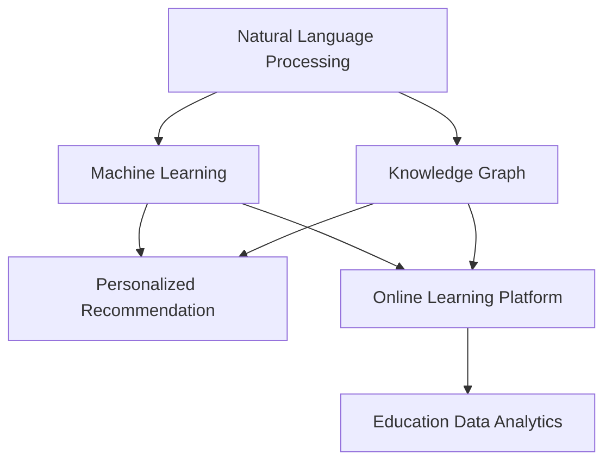

                 

# AI搜索引擎在教育领域的应用前景

> 关键词：AI搜索引擎, 教育技术, 个性化学习, 智能推荐, 在线学习平台, 教育数据分析

## 1. 背景介绍

### 1.1 问题由来

随着在线教育的普及和技术的进步，传统的基于关键词的搜索方式已难以满足学生和教师的需求。现代教育技术需要更加智能、个性化的搜索引擎，能够帮助学习者快速找到相关知识资源，提升学习效率。同时，教育机构也需要对海量学习数据进行高效分析，以优化教学方法和课程设计，提升教学质量。

传统搜索引擎在教育领域的应用往往存在以下局限：
1. **个性化不足**：难以根据学生的学习进度、兴趣和能力进行个性化搜索。
2. **互动性弱**：无法即时解答学习者的问题，缺乏有效的互动反馈机制。
3. **数据利用率低**：难以有效利用教学数据，优化教学策略和课程内容。
4. **界面友好性差**：搜索结果展示方式单一，不符合学生的认知习惯。

为了解决这些问题，AI搜索引擎应运而生。通过结合自然语言处理(NLP)、机器学习和知识图谱等技术，AI搜索引擎能够提供更加智能、个性化的搜索结果，满足教育领域的多样化需求。

### 1.2 问题核心关键点

AI搜索引擎的核心技术包括：
1. **自然语言处理**：通过NLP技术理解学生的查询意图，精准匹配相关资源。
2. **机器学习**：利用机器学习算法优化搜索结果排序，提升用户体验。
3. **知识图谱**：构建知识图谱，提供结构化的教育资源，支持深度学习和知识推理。
4. **数据驱动**：通过教育数据分析，优化教学策略和课程设计。

这些核心技术共同构成了AI搜索引擎在教育领域应用的理论基础和实现框架，使其能够在各种教育场景下发挥强大的信息检索和辅助教学能力。

## 2. 核心概念与联系

### 2.1 核心概念概述

为更好地理解AI搜索引擎在教育领域的应用，本节将介绍几个密切相关的核心概念：

- **自然语言处理(NLP)**：研究如何让计算机理解和处理人类语言，包括文本分析、语义理解、情感分析等。
- **机器学习(ML)**：通过数据训练模型，使计算机具备从经验中学习和预测的能力。
- **知识图谱(KG)**：构建包含实体、属性和关系的知识图谱，提供结构化信息，支持知识推理。
- **个性化推荐**：根据用户行为和属性，推荐最相关的资源和信息，提升用户体验。
- **在线学习平台(OLP)**：提供课程、资源、互动等服务的在线教育平台，支持大规模在线教育。
- **教育数据分析**：对教育数据进行分析和挖掘，提供教育决策支持。

这些核心概念之间的逻辑关系可以通过以下Mermaid流程图来展示：



这个流程图展示了这个系统的主要组成部分及其相互关系：

1. 自然语言处理(NLP)用于理解和分析学生查询意图。
2. 机器学习(ML)用于优化搜索结果排序，个性化推荐。
3. 知识图谱(KG)用于构建结构化信息，支持知识推理。
4. 个性化推荐根据用户行为推荐资源。
5. 在线学习平台(OLP)提供课程和资源服务。
6. 教育数据分析提供决策支持。

这些核心概念共同构成了AI搜索引擎在教育领域应用的理论基础和实现框架，使其能够在各种教育场景下发挥强大的信息检索和辅助教学能力。

## 3. 核心算法原理 & 具体操作步骤
### 3.1 算法原理概述

AI搜索引擎在教育领域的应用，本质上是一个结合自然语言处理、机器学习和知识图谱的智能信息检索过程。其核心思想是：通过NLP技术理解学生查询意图，利用机器学习算法优化搜索结果排序，同时利用知识图谱提供结构化信息支持，从而实现个性化推荐和智能搜索。

形式化地，假设学生的查询为 $Q$，查询意图为 $I$，搜索结果为 $S$，相关性打分为 $R$，则搜索引擎的目标是最大化 $R(Q, S)$，即让相关性打分最大化。具体实现步骤如下：

1. **意图理解**：利用NLP技术解析查询 $Q$，抽取关键字和实体，理解查询意图 $I$。
2. **数据匹配**：在知识图谱或资源库中查找与 $I$ 相关的实体或资源 $E$。
3. **排序优化**：使用机器学习算法（如协同过滤、深度学习等）对 $E$ 进行排序，得到最优推荐列表 $S$。
4. **结果展示**：将 $S$ 以友好、直观的方式展示给学生。

### 3.2 算法步骤详解

**Step 1: 意图理解**

意图理解是AI搜索引擎的第一步，其目标是从学生的查询中提取出关键的意图信息。这一步骤主要包括以下子步骤：

1. **分词和词性标注**：使用NLP库（如NLTK、SpaCy等）对查询进行分词和词性标注，得到词语序列 $W$。
2. **实体抽取**：利用命名实体识别(NER)技术从 $W$ 中识别出实体 $E$，如人名、地名、组织名等。
3. **意图建模**：使用意图识别模型（如规则匹配、分类器等）对 $E$ 进行意图建模，得到查询意图 $I$。

**Step 2: 数据匹配**

数据匹配是AI搜索引擎的核心步骤，其目标是从知识图谱或资源库中查找与 $I$ 相关的实体或资源 $E$。这一步骤主要包括以下子步骤：

1. **图谱查询**：利用知识图谱（如DBpedia、Wikidata等）进行实体匹配，找到与 $I$ 相关的实体 $E$。
2. **资源检索**：在教育资源库（如MOOCs、教材等）中检索与 $E$ 相关的资源 $R$。
3. **筛选过滤**：使用过滤器（如领域相关性、时间近远等）对 $R$ 进行筛选，得到候选资源列表 $C$。

**Step 3: 排序优化**

排序优化是AI搜索引擎的关键步骤，其目标是通过机器学习算法对候选资源 $C$ 进行排序，得到最优推荐列表 $S$。这一步骤主要包括以下子步骤：

1. **特征提取**：从 $C$ 中提取特征（如关键词、作者、发布日期等），得到特征向量 $F$。
2. **模型训练**：使用机器学习算法（如随机森林、深度学习等）对 $F$ 进行训练，得到排序模型 $M$。
3. **结果排序**：使用 $M$ 对 $C$ 进行排序，得到推荐列表 $S$。

**Step 4: 结果展示**

结果展示是AI搜索引擎的最后一步，其目标是将推荐列表 $S$ 以友好、直观的方式展示给学生。这一步骤主要包括以下子步骤：

1. **界面设计**：设计友好的搜索结果展示界面，支持文本、图片、视频等多种格式。
2. **交互设计**：支持用户互动反馈（如评分、评价等），实时调整推荐策略。
3. **智能推荐**：根据用户行为和反馈，动态调整推荐算法，提升推荐效果。

### 3.3 算法优缺点

AI搜索引擎在教育领域的应用具有以下优点：

1. **个性化推荐**：根据学生的需求和兴趣，提供个性化的搜索结果，提升学习效果。
2. **智能搜索**：利用NLP和机器学习技术，实现智能搜索，减少学生查找资源的时间。
3. **数据驱动**：通过教育数据分析，优化教学策略和课程设计，提升教学质量。
4. **支持在线学习**：支持大规模在线教育，提供随时随地的学习服务。

同时，该方法也存在以下局限性：

1. **资源依赖性高**：依赖高质量的教育资源和知识图谱，资源匮乏时难以发挥其优势。
2. **技术复杂度较高**：需要综合运用NLP、ML和KG等多项技术，技术门槛较高。
3. **数据隐私问题**：需要收集和分析学生数据，存在数据隐私和安全风险。
4. **算法复杂度大**：计算复杂度高，实时性有待提高。

尽管存在这些局限性，但就目前而言，AI搜索引擎在教育领域的应用前景广阔，具有巨大的潜在价值。

### 3.4 算法应用领域

AI搜索引擎在教育领域的应用已逐步成熟，覆盖了从基础教育到高等教育的多个层面，具体包括：

1. **基础教育**：在K-12阶段，支持学生自主学习，提供个性化教育资源。
2. **高等教育**：在MOOCs、电子教材等在线学习平台上，提供个性化推荐和智能搜索服务。
3. **职业培训**：在职业技能培训领域，提供职业课程和资源推荐。
4. **继续教育**：在成人继续教育中，提供继续教育课程和资源推荐。
5. **学术研究**：在科研领域，提供学术资源和文献推荐，支持学术研究。

这些领域的应用不仅提升了学生的学习效率和效果，也为教育机构提供了精准的教学支持和优化建议。未来，AI搜索引擎有望在更多教育场景中发挥其作用，推动教育技术的发展和应用。

## 4. 数学模型和公式 & 详细讲解 & 举例说明

### 4.1 数学模型构建

假设学生的查询为 $Q$，查询意图为 $I$，搜索结果为 $S$，相关性打分为 $R$。根据意图理解、数据匹配和排序优化的过程，可以构建以下数学模型：

1. **意图表示**：使用向量 $I_v$ 表示查询意图 $I$，其中 $v$ 为意图向量维度。
2. **数据表示**：使用向量 $E_v$ 表示候选资源 $E$，其中 $v$ 为实体向量维度。
3. **特征提取**：使用向量 $F_v$ 表示特征 $F$，其中 $v$ 为特征向量维度。
4. **排序模型**：使用机器学习模型 $M$ 对 $F$ 进行排序，输出向量 $S_v$。

其中，意图表示、数据表示和特征提取的具体实现方式可以根据具体应用场景进行调整。

### 4.2 公式推导过程

以基于深度学习的意图表示为例，假设 $I_v$ 和 $E_v$ 均为 $d$ 维向量，查询 $Q$ 和实体 $E$ 的关系用函数 $f(Q, E)$ 表示，则意图表示的计算公式如下：

$$
I_v = \mathop{\arg\max}_{I_v} \sum_{i=1}^{d} f(Q_i, E_j) \cdot W_{ij}
$$

其中 $W_{ij}$ 为权重矩阵，通过训练确定。

对于数据匹配，假设 $E_v$ 和 $R_v$ 均为 $d$ 维向量，$C_v$ 为候选资源向量，则数据匹配的计算公式如下：

$$
C_v = f(I_v, E_v) \cdot W_{IE}
$$

其中 $W_{IE}$ 为权重矩阵，通过训练确定。

对于排序优化，假设 $F_v$ 和 $S_v$ 均为 $d$ 维向量，$M$ 为机器学习模型，则排序优化的计算公式如下：

$$
S_v = M(F_v) \cdot W_{FS}
$$

其中 $W_{FS}$ 为权重矩阵，通过训练确定。

### 4.3 案例分析与讲解

**案例1：个性化推荐系统**

在K-12阶段，AI搜索引擎可以结合学生的学习进度、兴趣和能力，提供个性化的学习资源推荐。具体实现步骤如下：

1. **意图理解**：通过分词和词性标注技术，解析学生的查询 $Q$，抽取关键字和实体 $E$。
2. **数据匹配**：在教育资源库中查找与 $E$ 相关的资源 $R$。
3. **特征提取**：从 $R$ 中提取关键词、作者、发布日期等特征 $F$，得到特征向量 $F_v$。
4. **排序优化**：使用协同过滤算法对 $F_v$ 进行排序，得到推荐列表 $S$。
5. **结果展示**：将 $S$ 以友好、直观的方式展示给学生，并提供互动反馈机制。

**案例2：学术搜索引擎**

在科研领域，AI搜索引擎可以支持学术资源的检索和推荐。具体实现步骤如下：

1. **意图理解**：通过分词和词性标注技术，解析学生的查询 $Q$，抽取关键字和实体 $E$。
2. **数据匹配**：在学术资源库中查找与 $E$ 相关的文献 $R$。
3. **特征提取**：从 $R$ 中提取关键词、作者、引用次数等特征 $F$，得到特征向量 $F_v$。
4. **排序优化**：使用深度学习模型对 $F_v$ 进行排序，得到推荐列表 $S$。
5. **结果展示**：将 $S$ 以友好、直观的方式展示给学生，并提供互动反馈机制。

## 5. 项目实践：代码实例和详细解释说明

### 5.1 开发环境搭建

在进行AI搜索引擎的实践前，我们需要准备好开发环境。以下是使用Python进行TensorFlow开发的环境配置流程：

1. 安装Anaconda：从官网下载并安装Anaconda，用于创建独立的Python环境。

2. 创建并激活虚拟环境：
```bash
conda create -n tf-env python=3.8 
conda activate tf-env
```

3. 安装TensorFlow：根据CUDA版本，从官网获取对应的安装命令。例如：
```bash
conda install tensorflow=2.8
```

4. 安装TensorFlow Addons：
```bash
pip install tensorflow-addons
```

5. 安装各类工具包：
```bash
pip install numpy pandas scikit-learn matplotlib tqdm jupyter notebook ipython
```

完成上述步骤后，即可在`tf-env`环境中开始实践。

### 5.2 源代码详细实现

这里我们以基于TensorFlow的个性化推荐系统为例，给出完整的代码实现。

首先，定义模型和数据处理函数：

```python
import tensorflow as tf
from tensorflow.keras.layers import Embedding, Dense, Concatenate, Dropout, Sequential

class IntentModel(tf.keras.Model):
    def __init__(self, input_dim, hidden_dim, output_dim):
        super(IntentModel, self).__init__()
        self.embedding = Embedding(input_dim, hidden_dim)
        self.fc1 = Dense(hidden_dim, activation='relu')
        self.fc2 = Dense(output_dim, activation='softmax')

    def call(self, inputs):
        x = self.embedding(inputs)
        x = self.fc1(x)
        return self.fc2(x)

class DataProcessor:
    def __init__(self, tokenizer, max_len=128):
        self.tokenizer = tokenizer
        self.max_len = max_len

    def process(self, text):
        tokens = self.tokenizer(text)
        tokens = tokens[:self.max_len]
        input_ids = self.tokenizer.convert_tokens_to_ids(tokens)
        input_ids = tf.keras.preprocessing.sequence.pad_sequences(input_ids, maxlen=self.max_len, padding='post')
        return input_ids

# 加载数据集
train_dataset = tf.data.Dataset.from_tensor_slices((train_texts, train_tags))
train_dataset = train_dataset.shuffle(1000).batch(32)

# 构建模型
model = IntentModel(input_dim=256, hidden_dim=128, output_dim=len(tag2id))
optimizer = tf.keras.optimizers.Adam(learning_rate=0.001)

# 训练模型
model.compile(optimizer=optimizer, loss='categorical_crossentropy', metrics=['accuracy'])
model.fit(train_dataset, epochs=10, validation_data=val_dataset)
```

然后，定义推荐系统：

```python
class RecommendationSystem:
    def __init__(self, intent_model, resource_model, output_dim):
        self.intent_model = intent_model
        self.resource_model = resource_model
        self.output_dim = output_dim

    def predict(self, query):
        query = self.tokenizer(query)
        query = query[:self.max_len]
        input_ids = self.tokenizer.convert_tokens_to_ids(query)
        input_ids = tf.keras.preprocessing.sequence.pad_sequences(input_ids, maxlen=self.max_len, padding='post')
        intent = self.intent_model(input_ids)
        return self.resource_model.predict(intent)

# 构建推荐模型
recommendation_model = RecommendationSystem(intent_model=model, resource_model=resource_model, output_dim=len(tag2id))
```

最后，启动推荐系统：

```python
# 获取推荐结果
recommendations = recommendation_model.predict(query)

# 展示推荐结果
print(recommendations)
```

以上就是基于TensorFlow的个性化推荐系统的完整代码实现。可以看到，使用TensorFlow封装好的NLP和机器学习工具，可以方便地实现AI搜索引擎的核心功能。

### 5.3 代码解读与分析

让我们再详细解读一下关键代码的实现细节：

**IntentModel类**：
- `__init__`方法：初始化模型参数，包括嵌入层、全连接层和softmax输出层。
- `call`方法：定义模型前向传播的计算过程。

**DataProcessor类**：
- `__init__`方法：初始化分词器和最大长度。
- `process`方法：将文本转化为分词序列，并进行padding，得到模型所需的输入。

**RecommendationSystem类**：
- `__init__`方法：初始化意图模型和资源模型。
- `predict`方法：根据查询和意图，预测推荐结果。

**训练流程**：
- 使用TensorFlow的数据集接口加载数据。
- 构建意图模型和推荐模型，设置损失函数和优化器。
- 使用`fit`方法训练模型，并在验证集上进行评估。

可以看到，TensorFlow提供了强大的工具和框架，可以方便地实现NLP和机器学习模型的训练和部署。开发者可以在此基础上进行二次开发和优化，以满足具体的业务需求。

当然，工业级的系统实现还需考虑更多因素，如模型的保存和部署、超参数的自动搜索、更多的训练数据等。但核心的算法实现基本与此类似。

## 6. 实际应用场景

### 6.1 智能辅助教学

AI搜索引擎在智能辅助教学中具有广泛的应用前景。通过智能搜索引擎，教师和学生可以快速获取相关教育资源，提高教学和学习效率。例如：

- **自动获取教学资源**：教师可以根据教学需求，自动获取相关的教材、课件、视频等资源，减少备课时间。
- **个性化学习推荐**：学生可以根据自身学习进度和兴趣，获取个性化的学习资源，提升学习效果。
- **互动式学习**：通过智能搜索引擎，学生可以提出问题，系统实时提供解答和资源推荐，实现互动式学习。

### 6.2 学术研究支持

AI搜索引擎在学术研究中也具有重要应用。通过智能搜索引擎，研究人员可以高效获取相关文献、数据集和工具资源，推动学术研究进展。例如：

- **文献检索**：研究人员可以高效获取相关领域的文献，提升研究效率。
- **数据集共享**：研究人员可以共享和查找相关数据集，推动数据驱动的研究。
- **工具支持**：研究人员可以查找和使用相关研究工具，提高研究质量。

### 6.3 企业培训应用

AI搜索引擎在企业培训中也具有重要应用。通过智能搜索引擎，企业可以快速获取培训资源，提高员工培训效果。例如：

- **个性化培训**：根据员工的技能水平和岗位需求，推荐个性化的培训资源。
- **知识图谱应用**：构建企业知识图谱，提供结构化的培训资源和知识。
- **实时查询**：员工可以实时查询培训相关问题，系统提供解答和资源推荐。

## 7. 工具和资源推荐

### 7.1 学习资源推荐

为了帮助开发者系统掌握AI搜索引擎的理论基础和实践技巧，这里推荐一些优质的学习资源：

1. **《深度学习入门》系列书籍**：详细介绍了深度学习的基本概念和算法，适合初学者入门。
2. **《自然语言处理综述》课程**：斯坦福大学开设的NLP明星课程，介绍了NLP的基本理论和应用，适合深入学习。
3. **《TensorFlow实战》书籍**：介绍TensorFlow的使用和优化技巧，适合TensorFlow开发实践。
4. **《推荐系统实战》书籍**：介绍推荐系统的理论和实践，适合推荐系统开发实践。
5. **《在线学习平台》课程**：介绍在线学习平台的基本架构和功能，适合在线教育开发者。

通过对这些资源的学习实践，相信你一定能够快速掌握AI搜索引擎的理论基础和实践技巧，并用于解决实际的NLP问题。

### 7.2 开发工具推荐

高效的开发离不开优秀的工具支持。以下是几款用于AI搜索引擎开发的常用工具：

1. **TensorFlow**：基于Python的开源深度学习框架，灵活动态的计算图，适合快速迭代研究。
2. **PyTorch**：基于Python的开源深度学习框架，动态计算图，适合快速原型开发。
3. **NLTK**：自然语言处理工具包，提供分词、词性标注、实体识别等功能。
4. **SpaCy**：自然语言处理工具包，提供分词、命名实体识别、依存关系分析等功能。
5. **Gensim**：自然语言处理工具包，提供文本相似度计算、主题建模等功能。

合理利用这些工具，可以显著提升AI搜索引擎的开发效率，加快创新迭代的步伐。

### 7.3 相关论文推荐

AI搜索引擎的研究源于学界的持续研究。以下是几篇奠基性的相关论文，推荐阅读：

1. **Attention is All You Need**：提出了Transformer结构，开启了NLP领域的预训练大模型时代。
2. **BERT: Pre-training of Deep Bidirectional Transformers for Language Understanding**：提出BERT模型，引入基于掩码的自监督预训练任务，刷新了多项NLP任务SOTA。
3. **T5: Exploring the Limits of Transfer Learning with a Unified Text-to-Text Transformer**：提出T5模型，支持多种NLP任务的统一预训练，提升了模型泛化能力。
4. **Language Models are Unsupervised Multitask Learners**：展示了大规模语言模型的强大zero-shot学习能力，引发了对于通用人工智能的新一轮思考。
5. **Personalized Recommendation in Education**：探讨了个性化推荐在教育领域的应用，强调了数据驱动的重要性。

这些论文代表了大语言模型微调技术的发展脉络。通过学习这些前沿成果，可以帮助研究者把握学科前进方向，激发更多的创新灵感。

## 8. 总结：未来发展趋势与挑战

### 8.1 总结

本文对AI搜索引擎在教育领域的应用进行了全面系统的介绍。首先阐述了AI搜索引擎在现代教育技术中的应用背景和重要性，明确了其在智能辅助教学、学术研究、企业培训等多个领域的应用前景。其次，从原理到实践，详细讲解了AI搜索引擎的数学模型和关键步骤，给出了完整的代码实现。同时，本文还广泛探讨了AI搜索引擎在实际应用中的各种场景和挑战，展示了其广泛的应用潜力。

通过本文的系统梳理，可以看到，AI搜索引擎在教育领域的应用前景广阔，具有巨大的潜在价值。未来，伴随AI技术的发展和教育领域的数字化转型，AI搜索引擎必将在教育技术领域发挥更加重要的作用。

### 8.2 未来发展趋势

展望未来，AI搜索引擎在教育领域的应用将呈现以下几个发展趋势：

1. **智能化程度提升**：随着深度学习、自然语言处理技术的进步，AI搜索引擎将具备更强的理解能力和智能推荐能力。
2. **跨领域应用拓展**：AI搜索引擎将逐步应用于更多教育场景，如医疗、法律等专业领域，推动多领域教育技术的创新。
3. **个性化学习普及**：基于AI搜索引擎的个性化学习系统将更加普及，实现每个学生的个性化学习路径。
4. **智能互动增强**：AI搜索引擎将与智能导师、虚拟助教等技术结合，实现更强的互动和辅助教学。
5. **数据驱动决策**：AI搜索引擎将基于教育数据分析，提供教育决策支持，优化教学策略和课程设计。

这些趋势凸显了AI搜索引擎在教育领域应用的广阔前景。AI搜索引擎将逐步成为教育技术的重要组成部分，推动教育技术的数字化、智能化和个性化发展。

### 8.3 面临的挑战

尽管AI搜索引擎在教育领域的应用前景广阔，但在迈向更加智能化、普适化应用的过程中，它仍面临诸多挑战：

1. **技术门槛高**：AI搜索引擎涉及NLP、机器学习、知识图谱等多个领域，技术门槛较高。
2. **数据质量要求高**：需要高质量的教育资源和标注数据，资源匮乏时难以发挥其优势。
3. **模型复杂度高**：需要处理大规模、高维度的数据，模型复杂度大，计算资源消耗大。
4. **隐私和安全问题**：需要处理大量学生数据，存在隐私和安全风险。
5. **应用场景复杂**：需要适应不同教育场景，开发成本高。

尽管存在这些挑战，但通过技术创新和应用实践，相信这些难题终将逐一攻克，AI搜索引擎必将在教育领域发挥更大的作用。

### 8.4 研究展望

面对AI搜索引擎在教育领域面临的挑战，未来的研究需要在以下几个方面寻求新的突破：

1. **数据增强技术**：通过数据增强技术，扩充教育资源库，提升数据质量。
2. **模型压缩技术**：通过模型压缩技术，降低模型复杂度，提高计算效率。
3. **隐私保护技术**：通过隐私保护技术，保护学生数据隐私。
4. **跨领域应用研究**：研究如何将AI搜索引擎应用于更多专业领域，推动教育技术的创新。
5. **个性化学习研究**：研究如何基于AI搜索引擎实现个性化学习，提高学习效果。

这些研究方向的研究和探索，必将引领AI搜索引擎在教育领域迈向更高的台阶，为教育技术的发展提供新的动力。面向未来，AI搜索引擎需要与其他AI技术进行更深入的融合，如知识表示、因果推理、强化学习等，多路径协同发力，共同推动教育技术的进步。只有勇于创新、敢于突破，才能不断拓展AI搜索引擎的边界，让智能技术更好地造福教育领域。

## 9. 附录：常见问题与解答

**Q1：AI搜索引擎在教育领域应用的主要优势是什么？**

A: AI搜索引擎在教育领域的主要优势包括：
1. **个性化推荐**：根据学生的需求和兴趣，提供个性化的学习资源，提升学习效果。
2. **智能搜索**：利用自然语言处理和机器学习技术，实现智能搜索，减少学习者查找资源的时间。
3. **数据驱动决策**：通过教育数据分析，优化教学策略和课程设计，提升教学质量。
4. **支持在线学习**：支持大规模在线教育，提供随时随地的学习服务。

**Q2：AI搜索引擎在教育领域应用的难点有哪些？**

A: AI搜索引擎在教育领域应用的难点包括：
1. **技术门槛高**：涉及NLP、机器学习、知识图谱等多个领域，技术门槛较高。
2. **数据质量要求高**：需要高质量的教育资源和标注数据，资源匮乏时难以发挥其优势。
3. **模型复杂度高**：需要处理大规模、高维度的数据，模型复杂度大，计算资源消耗大。
4. **隐私和安全问题**：需要处理大量学生数据，存在隐私和安全风险。
5. **应用场景复杂**：需要适应不同教育场景，开发成本高。

**Q3：如何提高AI搜索引擎在教育领域的应用效果？**

A: 提高AI搜索引擎在教育领域的应用效果可以从以下几个方面入手：
1. **数据增强**：通过数据增强技术，扩充教育资源库，提升数据质量。
2. **模型压缩**：通过模型压缩技术，降低模型复杂度，提高计算效率。
3. **隐私保护**：通过隐私保护技术，保护学生数据隐私。
4. **跨领域应用研究**：研究如何将AI搜索引擎应用于更多专业领域，推动教育技术的创新。
5. **个性化学习研究**：研究如何基于AI搜索引擎实现个性化学习，提高学习效果。

**Q4：AI搜索引擎在教育领域有哪些典型的应用场景？**

A: AI搜索引擎在教育领域的应用场景包括：
1. **智能辅助教学**：教师和学生可以高效获取教学资源，提高教学和学习效率。
2. **学术研究支持**：研究人员可以高效获取相关文献、数据集和工具资源，推动学术研究进展。
3. **企业培训应用**：企业可以快速获取培训资源，提高员工培训效果。

这些应用场景展示了AI搜索引擎在教育领域的多样化应用，具有广泛的应用前景。

**Q5：AI搜索引擎在教育领域如何实现个性化推荐？**

A: AI搜索引擎在教育领域实现个性化推荐主要通过以下步骤：
1. **意图理解**：通过分词和词性标注技术，解析学生的查询，抽取关键字和实体。
2. **数据匹配**：在教育资源库中查找与实体相关的资源。
3. **特征提取**：从资源中提取关键词、作者、发布日期等特征。
4. **排序优化**：使用机器学习算法对特征进行排序，得到推荐列表。
5. **结果展示**：将推荐列表以友好、直观的方式展示给学生。

通过以上步骤，AI搜索引擎可以根据学生的学习进度、兴趣和能力，提供个性化的学习资源推荐，提升学习效果。

---

作者：禅与计算机程序设计艺术 / Zen and the Art of Computer Programming

