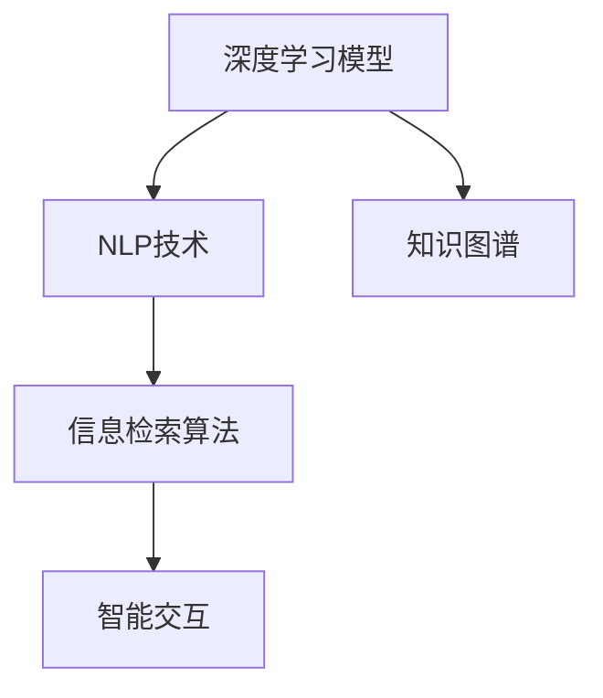

                 

# AI搜索引擎在金融领域的应用

> 关键词：金融领域，人工智能，搜索引擎，信息检索，知识图谱，金融科技，金融分析

## 1. 背景介绍

### 1.1 问题由来

金融行业是一个数据密集型行业，其中蕴含着大量的经济、财务和市场信息。在传统的金融服务中，这些信息通常被存储在各种系统和报告中，用户需要花费大量时间和精力去查找和分析，才能得出有价值的结论。此外，金融数据复杂、动态性强，难以被简单文本检索技术所覆盖。

近年来，随着人工智能技术的快速发展，AI搜索引擎技术开始广泛应用于金融领域，成为金融智能化的重要工具。AI搜索引擎通过深度学习和大数据分析技术，能够自动索引金融数据，提高检索速度和精度，为金融决策提供支持。

### 1.2 问题核心关键点

AI搜索引擎在金融领域的应用，主要涉及以下几个核心关键点：

- **深度学习模型**：利用神经网络模型处理海量金融数据，提取特征，构建索引。
- **自然语言处理(NLP)**：解析金融文本数据，理解市场动态，辅助业务分析。
- **知识图谱**：构建金融领域知识图谱，捕捉金融实体间的关系，提升信息检索效果。
- **信息检索算法**：设计高效的检索算法，快速匹配用户查询，提供精准的搜索结果。
- **用户交互设计**：优化用户界面和交互流程，提高用户体验，促进金融决策智能化。

## 2. 核心概念与联系

### 2.1 核心概念概述

为更好地理解AI搜索引擎在金融领域的应用，本节将介绍几个密切相关的核心概念：

- **深度学习**：通过多层神经网络模型，学习数据的复杂表示，自动提取特征。
- **自然语言处理(NLP)**：理解、处理和生成人类语言的技术，包括分词、词性标注、命名实体识别、句法分析、语义理解等。
- **知识图谱**：以图形化方式表示实体及其之间的关系，帮助知识推理和检索。
- **信息检索**：通过算法匹配用户查询和文档数据，返回相关的搜索结果。
- **智能交互**：基于用户行为和上下文，自动调整搜索结果，提高信息检索的精准性和用户体验。

这些核心概念之间的逻辑关系可以通过以下Mermaid流程图来展示：



这个流程图展示了核心概念的相互关系：

1. 深度学习模型从原始金融数据中提取特征，构建索引。
2. NLP技术解析金融文本，理解市场动态，辅助检索。
3. 知识图谱捕捉金融实体间的关系，提升检索效果。
4. 信息检索算法匹配用户查询，返回相关文档。
5. 智能交互根据用户行为，优化搜索结果。

## 3. 核心算法原理 & 具体操作步骤
### 3.1 算法原理概述

AI搜索引擎在金融领域的应用，基于深度学习和大数据分析技术，通过构建索引和匹配算法，实现对金融信息的精准检索。其核心原理包括以下几个步骤：

1. **数据预处理**：清洗、转换金融数据，去除噪音和重复，构建一致的数据格式。
2. **特征提取**：使用深度学习模型，如BERT、Transformer等，自动提取金融数据的特征，构建索引。
3. **信息检索**：设计高效的检索算法，匹配用户查询和文档，返回相关结果。
4. **智能调整**：根据用户行为和上下文，自动调整搜索结果，优化用户体验。

### 3.2 算法步骤详解

以下是AI搜索引擎在金融领域应用的详细步骤：

#### 步骤一：数据预处理

1. **数据收集**：从银行、证券公司、交易所等金融机构的内部系统或公开数据源中收集金融数据，包括历史交易数据、财务报告、新闻报道、市场分析等。
2. **数据清洗**：去除缺失、异常、重复的数据，确保数据的完整性和一致性。
3. **数据转换**：将金融数据转换为计算机可处理的形式，如结构化数据、文本数据等。

#### 步骤二：特征提取

1. **模型选择**：选择适合的深度学习模型，如BERT、Transformer等，用于提取金融数据的特征。
2. **训练模型**：使用金融数据训练深度学习模型，提取文本、数值、时间等特征，构建索引。
3. **索引建立**：将模型提取的特征存储到数据库中，建立索引，支持高效检索。

#### 步骤三：信息检索

1. **查询构建**：将用户输入的查询转化为计算机可识别的格式，如自然语言查询、关键词查询等。
2. **匹配算法**：使用信息检索算法，如倒排索引、向量空间模型等，匹配用户查询和文档，计算相似度。
3. **结果排序**：根据相似度排序，返回最相关的文档。

#### 步骤四：智能调整

1. **用户行为分析**：记录用户查询历史、点击行为等，分析用户偏好和需求。
2. **结果调整**：根据用户行为，自动调整搜索结果，推荐最相关的文档。
3. **交互优化**：优化搜索界面和交互流程，提高用户体验。

### 3.3 算法优缺点

AI搜索引擎在金融领域的应用具有以下优点：

- **高效性**：能够快速处理海量金融数据，提高检索速度。
- **精准性**：通过深度学习和知识图谱，实现对金融实体间关系的理解，提升检索精度。
- **智能性**：自动调整搜索结果，提高用户体验，促进金融决策智能化。

同时，该方法也存在一些局限性：

- **数据依赖性强**：需要大量高质量的金融数据支持，数据质量影响检索效果。
- **技术门槛高**：深度学习和大数据分析技术复杂，对开发者和运维人员要求较高。
- **系统复杂度高**：涉及数据预处理、特征提取、信息检索、智能调整等多个环节，系统结构复杂。
- **性能瓶颈**：对于极端大规模的金融数据，可能存在性能瓶颈，需要优化算法和硬件配置。

尽管存在这些局限性，但AI搜索引擎在金融领域的应用仍具有巨大的优势和发展潜力，能够显著提升金融决策的效率和精准性。

### 3.4 算法应用领域

AI搜索引擎在金融领域的应用广泛，涵盖以下几个方面：

- **投资分析**：利用深度学习模型和NLP技术，解析金融新闻、市场报告等文本数据，辅助投资者进行分析和决策。
- **风险管理**：构建金融风险知识图谱，捕捉风险事件间的关联关系，提供预警和建议。
- **资产管理**：构建资产投资知识图谱，帮助资产管理人了解市场动态，优化投资组合。
- **合规监管**：通过深度学习和知识图谱，自动化金融合规审核，防范风险和违规行为。
- **客户服务**：基于AI搜索引擎，构建智能客服系统，快速响应客户咨询，提供个性化服务。

这些应用领域展示了AI搜索引擎在金融领域的多样性和广泛性，为金融科技的发展提供了新的可能性。

## 4. 数学模型和公式 & 详细讲解 & 举例说明

### 4.1 数学模型构建

假设金融数据由 $D=\{(x_i, y_i)\}_{i=1}^N$ 构成，其中 $x_i$ 为金融文档，$y_i$ 为文档内容标签。AI搜索引擎的目标是构建深度学习模型 $M_{\theta}$，使得 $M_{\theta}(x_i)$ 能够匹配用户查询 $q$，返回相关文档。

### 4.2 公式推导过程

设 $q$ 为自然语言查询，$x_i$ 为金融文档，$M_{\theta}$ 为深度学习模型，$W$ 为模型参数。

1. **数据预处理**：将金融文档 $x_i$ 转换为计算机可处理的格式，如向量化表示。

2. **特征提取**：使用深度学习模型 $M_{\theta}$ 提取 $x_i$ 的特征 $f_i$。

3. **查询匹配**：将查询 $q$ 转换为向量表示 $v_q$，计算查询与文档的相似度 $s(q, x_i) = \text{cosine}(v_q, f_i)$。

4. **排序输出**：根据相似度 $s(q, x_i)$ 对文档进行排序，返回相关文档。

### 4.3 案例分析与讲解

以构建基于BERT的金融搜索引擎为例，具体步骤如下：

1. **数据预处理**：使用BERT分词器对金融文档进行分词，转换为BERT可处理的格式。
2. **模型训练**：使用预训练的BERT模型，对金融文档进行特征提取，构建索引。
3. **查询匹配**：将自然语言查询 $q$ 转换为BERT向量表示 $v_q$，计算查询与文档的相似度 $s(q, x_i)$。
4. **结果排序**：根据相似度 $s(q, x_i)$ 对文档进行排序，返回最相关的文档。

## 5. 项目实践：代码实例和详细解释说明

### 5.1 开发环境搭建

为了构建AI搜索引擎在金融领域的应用，首先需要搭建开发环境。以下是Python开发环境的基本配置：

1. **安装Python**：在操作系统中安装Python 3.x版本，建议使用Anaconda。

2. **创建虚拟环境**：
```bash
conda create -n finance-env python=3.8
conda activate finance-env
```

3. **安装必要的Python库**：
```bash
pip install numpy pandas scikit-learn nltk torch transformers transformers sentence_transformers
```

### 5.2 源代码详细实现

以下是基于BERT构建金融搜索引擎的Python代码实现：

```python
import torch
from transformers import BertTokenizer, BertForSequenceClassification
from transformers import AdamW
from sklearn.metrics import precision_recall_fscore_support
from sklearn.model_selection import train_test_split

# 加载BERT分词器
tokenizer = BertTokenizer.from_pretrained('bert-base-uncased')

# 加载金融文档和标签数据
with open('finance_documents.txt', 'r') as f:
    finance_documents = f.read().splitlines()

with open('finance_labels.txt', 'r') as f:
    finance_labels = f.read().splitlines()

# 数据预处理
train_documents, test_documents, train_labels, test_labels = train_test_split(finance_documents, finance_labels, test_size=0.2)

# 构建输入和标签列表
train_input_ids = []
train_labels = []
for document in train_documents:
    tokenized_doc = tokenizer(document, return_tensors='pt')
    train_input_ids.append(tokenized_doc['input_ids'].numpy())
    train_labels.append(tokenizer.convert_tokens_to_ids(train_labels))

test_input_ids = []
test_labels = []
for document in test_documents:
    tokenized_doc = tokenizer(document, return_tensors='pt')
    test_input_ids.append(tokenized_doc['input_ids'].numpy())
    test_labels.append(tokenizer.convert_tokens_to_ids(test_labels))

# 构建模型
model = BertForSequenceClassification.from_pretrained('bert-base-uncased', num_labels=len(train_labels))
model.to('cuda')

# 设置优化器和超参数
optimizer = AdamW(model.parameters(), lr=2e-5)
total_steps = len(train_input_ids)

# 训练模型
for epoch in range(epochs):
    model.train()
    for step, batch in enumerate(train_loader):
        inputs = batch['input_ids'].to('cuda')
        labels = batch['labels'].to('cuda')

        # 前向传播
        outputs = model(inputs, labels=labels)
        loss = outputs.loss
        loss.backward()

        # 更新参数
        optimizer.step()
        optimizer.zero_grad()

        # 评估模型
        model.eval()
        with torch.no_grad():
            predictions, true_labels = model.predict(test_loader)
            precision, recall, f1, _ = precision_recall_fscore_support(true_labels, predictions, average='macro')
            print('Epoch {}, Precision: {:.2f}, Recall: {:.2f}, F1: {:.2f}'.format(epoch+1, precision, recall, f1))

# 测试模型
model.eval()
with torch.no_grad():
    predictions, true_labels = model.predict(test_loader)
    precision, recall, f1, _ = precision_recall_fscore_support(true_labels, predictions, average='macro')
    print('Test Precision: {:.2f}, Recall: {:.2f}, F1: {:.2f}'.format(precision, recall, f1))
```

### 5.3 代码解读与分析

该代码实现基于BERT构建金融搜索引擎，主要包括以下几个步骤：

1. **数据预处理**：使用BERT分词器将金融文档转换为可处理的格式。
2. **模型构建**：加载BERT预训练模型，构建序列分类模型。
3. **模型训练**：使用训练数据对模型进行训练，调整参数。
4. **模型评估**：在测试数据上评估模型性能，输出精度、召回率和F1值。

## 6. 实际应用场景

### 6.1 投资分析

AI搜索引擎在投资分析中的应用，主要通过解析金融新闻、市场报告等文本数据，提供投资建议和分析报告。具体步骤如下：

1. **新闻数据收集**：从新闻网站、财经资讯平台等收集金融新闻。
2. **文本预处理**：对金融新闻进行分词、去停用词、词性标注等预处理。
3. **模型训练**：使用深度学习模型提取新闻特征，构建索引。
4. **查询匹配**：将用户查询转换为向量表示，计算与新闻的相似度，返回相关新闻。

例如，当用户查询“股市前景预测”时，系统可以返回最近的新闻，如“专家预测股市将迎来上涨”，帮助用户了解市场动态。

### 6.2 风险管理

AI搜索引擎在风险管理中的应用，主要通过构建金融风险知识图谱，捕捉风险事件间的关联关系，提供预警和建议。具体步骤如下：

1. **风险数据收集**：从金融报告、新闻、社交媒体等收集风险事件数据。
2. **知识图谱构建**：使用知识图谱技术，构建金融风险知识图谱，捕捉风险事件间的关联关系。
3. **模型训练**：使用深度学习模型，提取风险事件特征，构建索引。
4. **查询匹配**：将用户查询转换为向量表示，计算与风险事件的相似度，返回相关风险事件。

例如，当用户查询“股票风险预警”时，系统可以返回最近的相关风险事件，如“某公司财务报表造假”，提供预警信息。

### 6.3 资产管理

AI搜索引擎在资产管理中的应用，主要通过构建资产投资知识图谱，帮助资产管理人了解市场动态，优化投资组合。具体步骤如下：

1. **资产数据收集**：从基金公司、证券交易所等收集资产数据。
2. **知识图谱构建**：使用知识图谱技术，构建资产投资知识图谱，捕捉资产间的关系。
3. **模型训练**：使用深度学习模型，提取资产特征，构建索引。
4. **查询匹配**：将用户查询转换为向量表示，计算与资产的相似度，返回相关资产。

例如，当用户查询“优质股票推荐”时，系统可以返回符合条件的优质股票，提供投资建议。

### 6.4 合规监管

AI搜索引擎在合规监管中的应用，主要通过自动化金融合规审核，防范风险和违规行为。具体步骤如下：

1. **合规数据收集**：从金融报告、审计报告等收集合规数据。
2. **知识图谱构建**：使用知识图谱技术，构建金融合规知识图谱，捕捉合规事件间的关联关系。
3. **模型训练**：使用深度学习模型，提取合规事件特征，构建索引。
4. **查询匹配**：将用户查询转换为向量表示，计算与合规事件的相似度，返回相关合规事件。

例如，当用户查询“合规风险预警”时，系统可以返回符合条件的合规风险事件，提供预警信息。

### 6.5 客户服务

AI搜索引擎在客户服务中的应用，主要通过构建智能客服系统，快速响应客户咨询，提供个性化服务。具体步骤如下：

1. **客户数据收集**：从客服系统收集客户咨询数据。
2. **知识图谱构建**：使用知识图谱技术，构建客户服务知识图谱，捕捉客户咨询间的关联关系。
3. **模型训练**：使用深度学习模型，提取客户咨询特征，构建索引。
4. **查询匹配**：将客户咨询转换为向量表示，计算与客户问题的相似度，返回相关解决方案。

例如，当客户咨询“如何设置交易密码”时，系统可以返回相关的解决方案，提供帮助。

### 6.6 未来应用展望

随着AI技术的不断发展，AI搜索引擎在金融领域的应用也将不断拓展，带来更多新的可能。未来，AI搜索引擎将更深入地应用于以下领域：

- **金融智能投顾**：构建金融智能投顾系统，通过自然语言处理和知识图谱，提供个性化的投资建议。
- **金融市场预测**：利用深度学习模型，对金融市场进行预测和分析，提供市场动态。
- **金融风险预警**：构建金融风险预警系统，实时监测金融风险，提供预警信息。
- **金融客户分析**：通过客户行为分析，提供个性化的金融服务。
- **金融产品推荐**：利用知识图谱，推荐符合客户需求的金融产品。

## 7. 工具和资源推荐

### 7.1 学习资源推荐

为了帮助开发者系统掌握AI搜索引擎在金融领域的应用，这里推荐一些优质的学习资源：

1. **《深度学习》书籍**：Ian Goodfellow、Yoshua Bengio和Aaron Courville合著的经典书籍，全面介绍了深度学习的基本概念和算法。
2. **《自然语言处理综论》书籍**：Daniel Jurafsky和James H. Martin合著的NLP领域经典书籍，涵盖了NLP技术的各个方面。
3. **Coursera《深度学习》课程**：由Andrew Ng教授主讲的深度学习课程，内容全面，适合初学者。
4. **Kaggle金融数据集**：Kaggle平台上的金融数据集，包括股票、债券、基金等数据，可用于练习和研究。
5. **HuggingFace Transformers官方文档**：HuggingFace公司发布的Transformers库官方文档，提供了丰富的模型和工具支持。

通过对这些资源的学习实践，相信你一定能够快速掌握AI搜索引擎在金融领域的应用，并用于解决实际的金融问题。

### 7.2 开发工具推荐

高效的开发离不开优秀的工具支持。以下是几款用于AI搜索引擎在金融领域开发的常用工具：

1. **PyTorch**：基于Python的开源深度学习框架，灵活动态的计算图，适合快速迭代研究。
2. **TensorFlow**：由Google主导开发的开源深度学习框架，生产部署方便，适合大规模工程应用。
3. **NLTK**：自然语言处理工具包，提供了丰富的NLP功能，如分词、词性标注、命名实体识别等。
4. **Scikit-learn**：Python机器学习库，提供了丰富的机器学习算法和工具。
5. **Gephi**：图形可视化工具，可以用于构建和分析知识图谱。

合理利用这些工具，可以显著提升AI搜索引擎在金融领域开发的效率，加快创新迭代的步伐。

### 7.3 相关论文推荐

AI搜索引擎在金融领域的应用源于学界的持续研究。以下是几篇奠基性的相关论文，推荐阅读：

1. **Attention is All You Need**：Attention机制的提出，开启了NLP领域的预训练大模型时代。
2. **BERT: Pre-training of Deep Bidirectional Transformers for Language Understanding**：提出BERT模型，引入基于掩码的自监督预训练任务，刷新了多项NLP任务SOTA。
3. **Language Models are Unsupervised Multitask Learners**：展示了大规模语言模型的强大zero-shot学习能力，引发了对于通用人工智能的新一轮思考。
4. **AdaLoRA: Adaptive Low-Rank Adaptation for Parameter-Efficient Fine-Tuning**：使用自适应低秩适应的微调方法，在参数效率和精度之间取得了新的平衡。
5. **Adaptive Information Retrieval**：Adaptive IR方法的提出，提升了信息检索的个性化和智能化水平。

这些论文代表了大语言模型微调技术的发展脉络。通过学习这些前沿成果，可以帮助研究者把握学科前进方向，激发更多的创新灵感。

## 8. 总结：未来发展趋势与挑战

### 8.1 研究成果总结

本文对AI搜索引擎在金融领域的应用进行了全面系统的介绍。首先阐述了AI搜索引擎在金融领域应用的现状和意义，明确了其在金融智能化的重要价值。其次，从原理到实践，详细讲解了深度学习模型、自然语言处理、知识图谱、信息检索算法等核心技术，给出了AI搜索引擎在金融领域应用的完整代码实现。同时，本文还广泛探讨了AI搜索引擎在投资分析、风险管理、资产管理、合规监管、客户服务等实际应用场景，展示了其广泛的适用性和潜在的巨大价值。此外，本文精选了相关学习资源，力求为读者提供全方位的技术指引。

### 8.2 未来发展趋势

展望未来，AI搜索引擎在金融领域的应用将呈现以下几个发展趋势：

1. **深度学习模型的不断进步**：深度学习模型的性能和规模将不断提升，能够处理更加复杂和精细的金融数据，提高检索的准确性和效率。
2. **自然语言处理技术的进步**：NLP技术的进步将使得金融文本数据的理解和分析更加精确，提升信息检索和推荐的智能化水平。
3. **知识图谱技术的深入应用**：知识图谱技术将更加深入地应用于金融领域，捕捉金融实体间的关系，提升信息检索的精准性。
4. **信息检索算法的创新**：新的信息检索算法将不断涌现，提升检索的效率和效果，如近似最近邻搜索、深度排序等。
5. **智能交互的优化**：基于用户行为和上下文，自动调整搜索结果，优化用户体验，提升金融决策的智能化水平。

这些趋势将进一步推动AI搜索引擎在金融领域的应用，带来更加高效、智能和个性化的金融服务。

### 8.3 面临的挑战

尽管AI搜索引擎在金融领域的应用已经取得了显著成果，但在迈向更加智能化、普适化应用的过程中，仍面临诸多挑战：

1. **数据质量和多样性**：金融数据的复杂性和动态性，导致数据质量和多样性存在较大差异，影响检索效果。
2. **技术复杂性**：深度学习、自然语言处理、知识图谱等技术的复杂性，对开发者和运维人员要求较高，需要持续学习和改进。
3. **系统复杂度**：涉及数据预处理、特征提取、信息检索、智能调整等多个环节，系统结构复杂，运维难度大。
4. **性能瓶颈**：对于极端大规模的金融数据，可能存在性能瓶颈，需要优化算法和硬件配置。
5. **数据隐私和安全**：金融数据涉及隐私和安全问题，需要采取严格的措施，确保数据安全。

这些挑战需要不断突破和解决，才能实现AI搜索引擎在金融领域的更广泛应用。

### 8.4 研究展望

面对AI搜索引擎在金融领域面临的挑战，未来的研究需要在以下几个方面寻求新的突破：

1. **多源数据融合**：将不同来源的金融数据进行融合，提升检索效果。
2. **跨领域知识迁移**：将金融领域的知识迁移应用到其他领域，提升系统的通用性和泛化能力。
3. **因果关系学习**：通过因果关系学习，提升系统的稳定性和可解释性。
4. **数据隐私保护**：研究数据隐私保护技术，确保金融数据的安全性和隐私性。
5. **智能交互优化**：优化智能交互技术，提升用户体验和决策效率。

这些研究方向将引领AI搜索引擎在金融领域的应用迈向更高的台阶，为金融科技的发展提供新的动力。

## 9. 附录：常见问题与解答

**Q1：AI搜索引擎在金融领域是否需要大量标注数据？**

A: AI搜索引擎在金融领域的应用，通常不需要大量标注数据。通过使用预训练模型和知识图谱，可以自动提取和构建索引，提高检索效果。只有在特定任务（如个性化推荐）中，需要少量标注数据进行微调，以提高模型的精准性。

**Q2：AI搜索引擎在金融领域的应用是否依赖于自然语言处理技术？**

A: 是的，自然语言处理技术是AI搜索引擎在金融领域应用的核心之一。通过解析金融文本数据，理解市场动态，辅助业务分析，提高检索的准确性和智能化水平。NLP技术的进步将进一步提升AI搜索引擎的性能和效果。

**Q3：AI搜索引擎在金融领域的应用是否会面临数据隐私和安全问题？**

A: 是的，金融数据涉及隐私和安全问题，需要采取严格的措施，确保数据安全。可以采用数据加密、访问控制、数据脱敏等技术，保护用户隐私和数据安全。

**Q4：AI搜索引擎在金融领域的应用是否会受到金融市场的波动影响？**

A: 是的，金融市场的波动性较大，AI搜索引擎需要具备一定的鲁棒性和自适应能力，以应对市场变化。可以通过定期更新模型和数据，提升系统的稳定性和准确性。

**Q5：AI搜索引擎在金融领域的应用是否需要大量计算资源？**

A: 是的，AI搜索引擎在金融领域的应用，特别是深度学习模型的训练和推理，需要大量计算资源。可以采用GPU、TPU等高性能设备，优化算法和模型结构，提高计算效率。

**Q6：AI搜索引擎在金融领域的应用是否需要跨领域的知识图谱？**

A: 是的，金融领域涉及多种类型的金融数据，需要跨领域的知识图谱来捕捉实体间的关系，提升检索效果。可以构建多源融合的知识图谱，提高系统的通用性和泛化能力。

通过本文的系统梳理，可以看到，AI搜索引擎在金融领域的应用具有广阔的发展前景和重要的实际意义。希望本文能够为读者提供有价值的参考，推动金融科技的发展和应用。

---

作者：禅与计算机程序设计艺术 / Zen and the Art of Computer Programming

