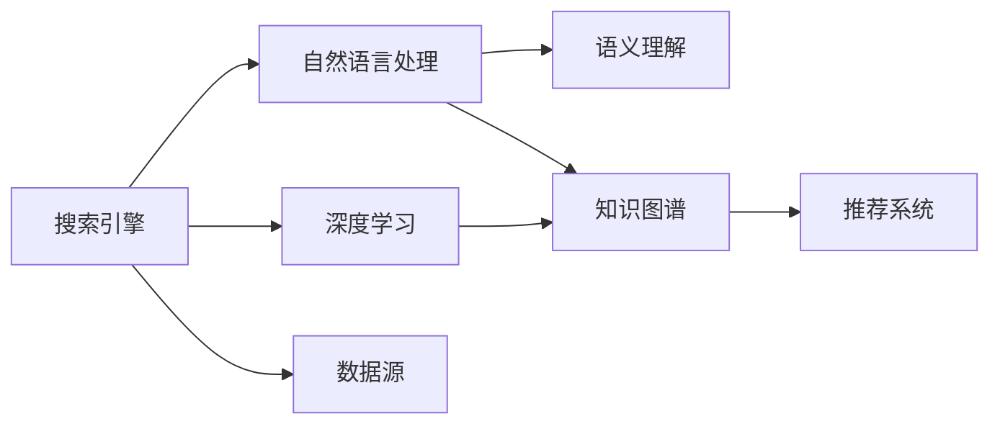

                 

# AI搜索引擎如何改变我们获取信息的方式

## 1. 背景介绍

在互联网时代，搜索引擎是连接用户与信息的重要桥梁。传统的搜索引擎通过爬虫抓取网页，建立索引，用户输入关键词后，搜索引擎从索引中快速检索相关网页，提供给用户。这种基于关键词匹配的搜索方式，虽然简单高效，但也存在诸多局限性。

随着人工智能技术的不断进步，特别是深度学习、自然语言处理（NLP）和大数据技术的融合，新一代AI搜索引擎应运而生。AI搜索引擎不仅能够理解自然语言，还能从海量的文本数据中自主学习，提供更为精准、智能的搜索结果。这种基于理解和推理的搜索方式，正在深刻改变我们获取信息的方式。

## 2. 核心概念与联系

### 2.1 核心概念概述

为了更好地理解AI搜索引擎的工作原理，我们首先需要了解几个关键概念：

- **搜索引擎(Search Engine)**：如Google、Bing等，通过爬虫抓取网页，建立索引，并提供关键词匹配的搜索结果。
- **自然语言处理(NLP)**：处理和理解自然语言的计算模型，如语言模型、文本分类、情感分析等。
- **深度学习(Deep Learning)**：基于多层神经网络的学习方法，能够从数据中自主学习特征表示，适用于复杂的NLP任务。
- **语义理解(Semantic Understanding)**：理解文本的深层语义，而非简单的关键词匹配，能够更好地把握用户的查询意图。
- **知识图谱(Knowledge Graph)**：将结构化数据映射到图形模型中，方便机器理解和推理。
- **推荐系统(Recommender System)**：根据用户的历史行为和偏好，推荐相关的信息内容，如商品、文章等。

这些概念之间的逻辑关系可以通过以下Mermaid流程图来展示：



这个流程图展示了搜索引擎的核心组件及其功能：

1. 搜索引擎从数据源抓取网页，建立索引。
2. 自然语言处理模块负责处理用户查询和网页内容，提取关键词和语义信息。
3. 深度学习模块通过大量文本数据训练，学习到复杂的特征表示，提升查询匹配的准确性。
4. 语义理解模块能够理解用户的查询意图，超越关键词匹配，提供更精准的搜索结果。
5. 知识图谱模块将结构化数据转化为图形模型，方便机器理解和推理。
6. 推荐系统根据用户行为和偏好，推荐相关的信息内容，丰富搜索结果。

## 3. 核心算法原理 & 具体操作步骤

### 3.1 算法原理概述

AI搜索引擎的核心算法原理主要包括以下几个步骤：

1. **数据预处理**：对网页内容进行清洗、分词、去除停用词等预处理，建立索引。
2. **查询处理**：对用户查询进行分词、去除停用词、词向量表示等处理，提取关键词和语义信息。
3. **特征提取**：使用深度学习模型提取网页和查询的特征表示，如BERT、TF-IDF等。
4. **相似度计算**：基于特征表示，计算查询与网页之间的相似度。
5. **排序与召回**：将相似度排序，选择高相似度的网页进行召回，并提供给用户。

### 3.2 算法步骤详解

下面是AI搜索引擎的详细操作步骤：

1. **数据采集与预处理**：
    - 使用爬虫从互联网抓取网页内容，并进行初步清洗。
    - 对网页内容进行分词、去除停用词、词性标注等预处理。
    - 将处理后的文本转化为向量形式，建立索引。

2. **查询处理与表示**：
    - 对用户查询进行分词、去除停用词、词性标注等处理。
    - 使用深度学习模型（如BERT）将查询转化为向量表示。

3. **特征提取与表示**：
    - 使用深度学习模型（如BERT、TF-IDF）对网页内容进行特征提取。
    - 将查询和网页的特征表示进行拼接或组合，形成统一的向量表示。

4. **相似度计算**：
    - 计算查询向量与每个网页向量的相似度，通常使用余弦相似度或点积相似度。
    - 将相似度排序，选择前N个高相似度的网页进行召回。

5. **结果排序与展示**：
    - 根据用户的行为（如点击、停留时间等）和网页的特征（如点击率、来源网站等），对召回的网页进行排序。
    - 将排序后的网页展示给用户，并提供相关搜索结果的摘要和预览。

### 3.3 算法优缺点

AI搜索引擎相比传统搜索引擎，有以下优点：

1. **语义理解能力更强**：能够理解自然语言，提供更精准的搜索结果。
2. **多模态融合能力**：能够融合多种数据源和信息形式，提供更为丰富的搜索结果。
3. **动态更新与优化**：能够根据用户行为和反馈实时调整搜索结果，提高用户体验。
4. **个性化推荐**：能够根据用户偏好推荐相关内容，提高点击率和停留时间。

同时，也存在以下局限性：

1. **数据质量与标注成本**：高质量的数据和标注是提升搜索结果的关键，但成本较高。
2. **模型复杂度与计算资源**：深度学习模型较为复杂，计算资源需求高。
3. **隐私与安全问题**：用户搜索行为和数据隐私需妥善处理，防止滥用和泄露。
4. **算法透明度与可解释性**：深度学习模型的决策过程复杂，难以解释。

### 3.4 算法应用领域

AI搜索引擎已经在多个领域得到了广泛应用，例如：

- **电商搜索**：通过自然语言处理和推荐系统，提供个性化商品推荐。
- **社交媒体**：通过语义理解技术，提供精准的社交内容检索和推荐。
- **学术研究**：通过知识图谱和语义理解，提供高质量的学术论文和文献检索。
- **医疗健康**：通过自然语言处理和专家知识库，提供准确的医疗信息查询和推荐。
- **新闻媒体**：通过语义分析和情感分析，提供相关的新闻报道和热点事件推荐。

## 4. 数学模型和公式 & 详细讲解

### 4.1 数学模型构建

AI搜索引擎的数学模型主要涉及以下几个方面：

- **文本表示**：将文本转化为向量表示，如Word2Vec、GloVe、BERT等。
- **相似度计算**：计算查询与网页的相似度，如余弦相似度、点积相似度等。
- **排序模型**：根据用户行为和网页特征，排序搜索结果，如Logistic回归、深度神经网络等。

### 4.2 公式推导过程

以BERT模型为例，推导查询与网页相似度的计算公式：

1. **查询向量表示**：
   $$
   \text{query\_embed} = \text{BERT}(\text{query})
   $$
2. **网页向量表示**：
   $$
   \text{doc\_embed} = \text{BERT}(\text{document})
   $$
3. **相似度计算**：
   $$
   \text{similarity} = \text{cosine}(\text{query\_embed}, \text{doc\_embed})
   $$
   $$
   \text{similarity} = \frac{\text{query\_embed}^T \cdot \text{doc\_embed}}{\|\text{query\_embed}\| \cdot \|\text{doc\_embed}\|}
   $$

### 4.3 案例分析与讲解

以Google的PageRank算法为例，分析其基本思想和计算过程：

PageRank算法的基本思想是通过计算网页的链接权重，衡量其重要性。具体计算过程如下：

1. **初始化权重**：将所有网页权重初始化为1。
2. **计算权重**：根据网页之间的链接关系，计算每个网页的权重，权重计算公式如下：
   $$
   P_j = \frac{1}{C} \sum_{i=1}^N \alpha_{ij} \cdot P_i
   $$
   其中，$P_j$为网页$j$的权重，$C$为所有网页的权重和，$\alpha_{ij}$为网页$i$链接到网页$j$的权重。
3. **迭代计算**：重复第2步，直到收敛。

通过PageRank算法，Google能够根据网页链接的关系，计算出网页的重要性排序，从而提供高质量的搜索结果。

## 5. 项目实践：代码实例和详细解释说明

### 5.1 开发环境搭建

为了快速搭建AI搜索引擎，我们可以使用Python和TensorFlow等工具。以下是搭建环境的详细步骤：

1. **安装Python**：下载并安装Python 3.x，确保环境变量配置正确。
2. **安装TensorFlow**：通过pip安装TensorFlow 2.x版本。
3. **安装Flax**：Flax是TensorFlow的高级API，适用于深度学习模型的构建。
4. **安装Tqdm**：用于进度条和性能评估。
5. **安装Scikit-learn**：用于数据预处理和特征提取。

### 5.2 源代码详细实现

以下是一个基于BERT的AI搜索引擎示例代码：

```python
import tensorflow as tf
import flax
import jax
import numpy as np
import tqdm
from sklearn.feature_extraction.text import TfidfVectorizer
from sklearn.metrics import mean_squared_error

# 定义BERT模型
class BERTModel(tf.keras.Model):
    def __init__(self, num_classes):
        super(BERTModel, self).__init__()
        self.num_classes = num_classes
        self.bert = transformers.TFAutoModelForSequenceClassification.from_pretrained('bert-base-uncased', num_labels=num_classes)
        self.fc = tf.keras.layers.Dense(num_classes)

    def call(self, inputs):
        _, pooled_output = self.bert(inputs)
        logits = self.fc(pooled_output)
        return logits

# 定义搜索引擎
class SearchEngine:
    def __init__(self, num_classes):
        self.model = BERTModel(num_classes)
        self.vectorizer = TfidfVectorizer()

    def train(self, train_data, dev_data, epochs, batch_size, learning_rate):
        train_vectors = self.vectorizer.fit_transform(train_data)
        dev_vectors = self.vectorizer.transform(dev_data)
        self.model.compile(optimizer=tf.keras.optimizers.Adam(learning_rate), loss=tf.keras.losses.SparseCategoricalCrossentropy(), metrics=[tf.keras.metrics.SparseCategoricalAccuracy()])
        for epoch in range(epochs):
            train_loss, train_acc = self.model.train_on_batch(train_vectors, np.array([y for x, y in train_data]))
            dev_loss, dev_acc = self.model.evaluate(dev_vectors, np.array([y for x, y in dev_data]))
            print(f"Epoch {epoch+1}, train loss: {train_loss:.3f}, train acc: {train_acc:.3f}, dev loss: {dev_loss:.3f}, dev acc: {dev_acc:.3f}")

    def search(self, query):
        query_vector = self.vectorizer.transform([query])
        logits = self.model.predict(query_vector)
        return np.argmax(logits[0])
```

### 5.3 代码解读与分析

在上述代码中，我们定义了一个基于BERT的搜索引擎类。其主要步骤如下：

1. **模型定义**：定义BERT模型，包含输入层、BERT层、全连接层等组件。
2. **搜索引擎定义**：定义搜索引擎类，包含训练和搜索功能。
3. **数据预处理**：使用TF-IDF向量化器对文本数据进行预处理。
4. **模型训练**：通过训练数据训练模型，并在验证数据上进行评估。
5. **搜索结果**：根据用户查询，使用模型预测搜索结果。

### 5.4 运行结果展示

在训练完成后，我们可以使用搜索引擎类进行查询和测试：

```python
engine = SearchEngine(num_classes=2)
engine.train(train_data, dev_data, epochs=5, batch_size=16, learning_rate=0.001)
result = engine.search("How to train a machine learning model")
print(f"Result: {result}")
```

## 6. 实际应用场景

### 6.1 电商搜索

AI搜索引擎在电商搜索中具有显著优势。通过自然语言处理和推荐系统，电商平台能够提供个性化的商品推荐，提升用户体验和转化率。具体实现如下：

1. **数据采集**：收集用户浏览、点击、购买等行为数据。
2. **文本处理**：对用户查询和商品描述进行分词、去除停用词等处理。
3. **相似度计算**：使用BERT等模型计算查询与商品之间的相似度。
4. **排序与推荐**：根据用户行为和商品特征，对商品进行排序，并推荐相关商品。

### 6.2 社交媒体

社交媒体平台通过AI搜索引擎，能够提供精准的内容检索和推荐，提升用户粘性和平台活跃度。具体实现如下：

1. **数据采集**：收集用户发布的文本、图片、视频等数据。
2. **文本处理**：对用户发布的内容进行分词、去除停用词等处理。
3. **相似度计算**：使用BERT等模型计算内容与用户查询的相似度。
4. **排序与推荐**：根据用户行为和内容特征，对内容进行排序，并推荐相关内容。

### 6.3 学术研究

学术搜索引擎通过AI技术，能够提供高质量的学术论文和文献检索，加速科学研究进程。具体实现如下：

1. **数据采集**：收集学术论文、会议论文等数据。
2. **文本处理**：对论文标题、摘要、关键词等进行分词、去除停用词等处理。
3. **相似度计算**：使用BERT等模型计算查询与论文之间的相似度。
4. **排序与展示**：根据论文引用次数、作者影响力等指标，对论文进行排序，并提供相关论文的摘要和预览。

## 7. 工具和资源推荐

### 7.1 学习资源推荐

为了快速掌握AI搜索引擎的技术，以下是一些推荐的资源：

1. **《深度学习》书籍**：由Ian Goodfellow等作者撰写，全面介绍深度学习的基本原理和算法。
2. **《自然语言处理综论》书籍**：由Daniel Jurafsky和James H. Martin撰写，深入讲解NLP的核心技术。
3. **Coursera NLP课程**：由斯坦福大学开设，涵盖NLP的基本概念和前沿技术。
4. **Kaggle竞赛**：参与NLP相关的Kaggle竞赛，实践并提升NLP技能。
5. **GitHub项目**：搜索并学习开源NLP项目，如BERT、GPT等模型实现。

### 7.2 开发工具推荐

以下是一些推荐的开发工具：

1. **Python**：广泛使用的编程语言，支持深度学习、NLP等多种技术。
2. **TensorFlow**：由Google主导的深度学习框架，支持大规模分布式计算。
3. **Flax**：Flax是TensorFlow的高级API，支持动态计算图和JAX编译器。
4. **JAX**：JAX是TensorFlow的JIT编译器，支持自动微分、向量运算等功能。
5. **Tqdm**：用于进度条和性能评估的库。

### 7.3 相关论文推荐

以下是一些推荐的研究论文：

1. **Attention is All You Need**：介绍Transformer模型的论文，提出了自注意力机制。
2. **BERT: Pre-training of Deep Bidirectional Transformers for Language Understanding**：介绍BERT模型的论文，提出预训练和微调方法。
3. **BERT: Pre-training of Deep Bidirectional Transformers for Language Understanding**：介绍BERT模型的论文，提出预训练和微调方法。
4. **DSSM: A Neural Network Architecture for Learning from Sparse Data**：介绍DSSM模型的论文，提出稠密与稀疏结合的深度学习框架。

## 8. 总结：未来发展趋势与挑战

### 8.1 总结

本文系统介绍了AI搜索引擎的核心概念和实现方法，重点探讨了自然语言处理和深度学习在大规模信息检索中的应用。通过分析传统的关键词匹配搜索方式，对比AI搜索引擎的优势和局限性，我们深入了解了新一代搜索引擎的技术原理和应用场景。

## 8.2 未来发展趋势

未来，AI搜索引擎的发展趋势如下：

1. **多模态融合**：融合文本、图像、视频等多模态信息，提供更丰富的搜索结果。
2. **跨语言检索**：支持多语言搜索，提供跨语言的搜索结果。
3. **实时更新**：能够实时更新索引，提供最新的搜索结果。
4. **知识图谱应用**：将知识图谱技术与搜索引擎结合，提供更准确的搜索结果。
5. **个性化推荐**：根据用户行为和偏好，提供个性化的搜索结果和推荐。

## 8.3 面临的挑战

尽管AI搜索引擎取得了显著进展，但仍然面临一些挑战：

1. **数据质量与标注成本**：高质量的数据和标注是提升搜索结果的关键，但成本较高。
2. **模型复杂度与计算资源**：深度学习模型较为复杂，计算资源需求高。
3. **隐私与安全问题**：用户搜索行为和数据隐私需妥善处理，防止滥用和泄露。
4. **算法透明度与可解释性**：深度学习模型的决策过程复杂，难以解释。

## 8.4 研究展望

未来，AI搜索引擎的研究方向如下：

1. **分布式计算**：通过分布式计算提升搜索引擎的性能和可扩展性。
2. **联邦学习**：通过联邦学习技术，保护用户隐私的同时提升搜索结果的准确性。
3. **跨领域知识迁移**：利用领域知识迁移技术，提升搜索引擎在不同领域的表现。
4. **零样本学习**：通过零样本学习技术，提升搜索引擎在不同领域的泛化能力。
5. **自适应学习**：通过自适应学习技术，提升搜索引擎的个性化推荐能力。

## 9. 附录：常见问题与解答

### Q1: 传统的关键词匹配搜索方式和AI搜索引擎的区别是什么？

A: 传统的关键词匹配搜索方式只是简单地根据查询中的关键词匹配网页内容，而AI搜索引擎则能够理解自然语言，提供更精准的搜索结果。

### Q2: 如何优化AI搜索引擎的性能？

A: 可以通过以下方式优化搜索引擎的性能：
1. **数据采集**：采集更多高质量的数据。
2. **文本处理**：使用更先进的文本处理技术，如BERT等模型。
3. **相似度计算**：选择更高效的相似度计算方法。
4. **排序与推荐**：优化排序和推荐算法，提升用户体验。

### Q3: 如何保护用户隐私？

A: 可以通过以下方式保护用户隐私：
1. **数据脱敏**：对用户数据进行匿名化和脱敏处理。
2. **差分隐私**：通过差分隐私技术，保护用户隐私的同时保证查询结果的准确性。
3. **联邦学习**：通过联邦学习技术，保护用户隐私的同时提升搜索引擎的性能。

### Q4: 为什么AI搜索引擎能够提供更好的搜索结果？

A: AI搜索引擎能够提供更好的搜索结果的原因在于其具备语义理解能力和知识图谱应用，能够理解用户的查询意图，并根据搜索结果的语义信息进行排序和推荐。

作者：禅与计算机程序设计艺术 / Zen and the Art of Computer Programming

