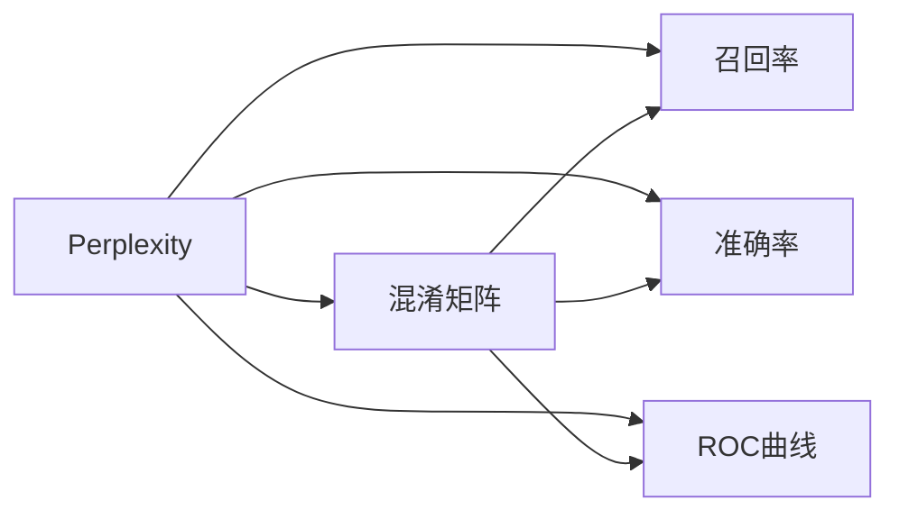

                 

# AI搜索的崛起：Perplexity的独特之路，贾扬清的观察与思考

在AI搜索领域，Perplexity作为一个至关重要的概念，逐渐被广泛应用于模型评估、度量以及优化。本文将通过作者贾扬清的视角，深入探讨Perplexity的原理、应用以及未来趋势，揭示其在AI搜索中的独特之路。

## 1. 背景介绍

### 1.1 问题由来

AI搜索作为人工智能领域的重要分支，其目标是快速、准确地从大规模数据中筛选出用户最相关的信息。在过去，传统搜索引擎主要依赖于关键词匹配、文本相似度计算等技术，但随着深度学习的崛起，基于神经网络的模型开始在这方面取得突破性进展。

随着BERT、T5等大语言模型的出现，其在自然语言理解、处理和生成方面的性能显著提升。这些模型的训练目标通常设定为最大化数据集上的概率分布，Perplexity作为衡量模型性能的指标，应运而生。

### 1.2 问题核心关键点

Perplexity，又称为困惑度，是衡量模型对数据集概率分布拟合程度的重要指标。它通常用于评估模型在特定任务上的表现，特别是在自然语言处理领域，如文本分类、问答、机器翻译等任务中。

Perplexity越小，表示模型对数据集的概率分布拟合程度越好，也即模型性能越强。计算Perplexity的过程，本质上是对模型预测概率与实际标注结果之间的差异进行衡量，从而指导模型的优化。

Perplexity的计算公式为：
$$
\text{Perplexity} = \exp\left(-\frac{1}{N}\sum_{i=1}^{N} \log p(x_i)\right)
$$
其中，$N$为数据集的大小，$x_i$为第$i$个样本，$p(x_i)$为模型预测该样本的条件概率。

## 2. 核心概念与联系

### 2.1 核心概念概述

- **Perplexity**：衡量模型预测分布与真实分布之间差异的量度，越小表示模型越能准确预测。
- **混淆矩阵**：用于评估分类模型性能的工具，通过计算不同类别样本之间的预测与实际标签的匹配情况来衡量模型性能。
- **召回率**：表示模型预测出的正样本中实际为正样本的比例，用于评估模型对正样本的检测能力。
- **准确率**：表示模型预测正确的样本占总样本数的比例，用于评估模型整体的预测准确性。
- **ROC曲线**：绘制真正例率(TPR)和假正例率(FPR)的曲线，用于评估二分类模型的性能。

### 2.2 核心概念原理和架构的 Mermaid 流程图



此图展示了Perplexity与其他核心概念的联系，其中每个节点表示一种评估指标，箭头表示计算或评估关系。

## 3. 核心算法原理 & 具体操作步骤

### 3.1 算法原理概述

Perplexity计算的核心是最大化数据集上的模型预测概率。具体而言，模型通过对训练数据集进行多次前向传播，计算每个样本的条件概率，并取几何平均，得到整体概率。该概率的倒数即为Perplexity。

在实践中，由于计算条件概率的复杂度，我们通常使用对数损失函数来计算Perplexity，以便更高效地进行计算。

### 3.2 算法步骤详解

1. **数据准备**：收集标注数据集，并将其分为训练集和验证集。

2. **模型训练**：使用训练集对模型进行训练，并使用验证集进行调参和评估。

3. **Perplexity计算**：
    - 对于每个样本，计算模型预测的条件概率。
    - 计算所有样本的几何平均条件概率。
    - 计算Perplexity，即该几何平均概率的倒数。

### 3.3 算法优缺点

#### 优点：

- **全面性**：Perplexity综合考虑了模型对所有样本的预测概率，能够全面评估模型在数据集上的表现。
- **可解释性**：Perplexity的计算过程直观易懂，有助于理解模型在特定任务上的预测能力。
- **普适性**：Perplexity不仅适用于分类任务，也适用于序列标注、机器翻译等任务。

#### 缺点：

- **计算复杂度较高**：需要计算每个样本的条件概率，并取几何平均，计算复杂度较高。
- **对异常值敏感**：Perplexity对训练数据中的异常值较为敏感，可能影响评估结果。
- **难以解释局部性能**：Perplexity只反映整体性能，难以详细解释模型在具体样本上的表现。

### 3.4 算法应用领域

Perplexity在自然语言处理中得到了广泛应用，如：

- **文本分类**：评估模型对不同类别文本的分类能力。
- **问答系统**：衡量模型对问答任务的回答准确性和相关性。
- **机器翻译**：评估模型翻译结果的质量，即句子的流畅度和准确性。
- **命名实体识别**：评估模型对文本中实体名称的识别能力。

## 4. 数学模型和公式 & 详细讲解 & 举例说明

### 4.1 数学模型构建

Perplexity的计算涉及模型对数据的预测概率。假设模型为$M$，数据集为$D$，样本数为$N$，每个样本的条件概率为$p(x_i)$，则Perplexity的计算公式为：
$$
\text{Perplexity} = \exp\left(-\frac{1}{N}\sum_{i=1}^{N} \log p(x_i)\right)
$$

### 4.2 公式推导过程

考虑一个简单的二分类问题，假设模型对样本$x$的预测概率为$p(x)$，模型对两个类别的预测概率分别为$p(x|y=1)$和$p(x|y=0)$。则模型对整个数据集的预测概率分布为：
$$
p(x) = p(x|y=1)p(y=1) + p(x|y=0)p(y=0)
$$

Perplexity的计算如下：
$$
\text{Perplexity} = \exp\left(-\frac{1}{N}\sum_{i=1}^{N} \log \left(\frac{p(x_i|y=1)p(y=1) + p(x_i|y=0)p(y=0)}{p(x_i)}\right)\right)
$$

通过对数法则简化，得到：
$$
\text{Perplexity} = \exp\left(-\frac{1}{N}\sum_{i=1}^{N} \log \left(\frac{p(x_i)}{p(y=1)} + \frac{p(x_i)}{p(y=0)}\right)\right)
$$

进一步简化，得到：
$$
\text{Perplexity} = \exp\left(-\frac{1}{N}\sum_{i=1}^{N} \log \left(\frac{p(x_i)}{\hat{p}(x_i)}\right)\right)
$$

其中，$\hat{p}(x_i)$为模型对样本$x_i$的预测概率。

### 4.3 案例分析与讲解

以文本分类为例，假设模型对样本$x$的预测概率为$p(x)$，实际标签为$y$，则模型对整个数据集的预测概率分布为：
$$
p(x|y) = \frac{p(x)p(y|x)}{p(y)}
$$

计算Perplexity：
$$
\text{Perplexity} = \exp\left(-\frac{1}{N}\sum_{i=1}^{N} \log \left(\frac{p(x_i|y_i)}{p(y_i)}\right)\right)
$$

其中，$p(x_i|y_i)$为模型对样本$x_i$在标签$y_i$下的预测概率。

## 5. 项目实践：代码实例和详细解释说明

### 5.1 开发环境搭建

在进行Perplexity计算的实践前，我们需要准备好开发环境。以下是使用Python进行TensorFlow开发的环境配置流程：

1. 安装Anaconda：从官网下载并安装Anaconda，用于创建独立的Python环境。

2. 创建并激活虚拟环境：
```bash
conda create -n tf-env python=3.8 
conda activate tf-env
```

3. 安装TensorFlow：根据CUDA版本，从官网获取对应的安装命令。例如：
```bash
conda install tensorflow -c tf -c conda-forge
```

4. 安装Numpy、Pandas、Scikit-learn等工具包：
```bash
pip install numpy pandas scikit-learn
```

完成上述步骤后，即可在`tf-env`环境中开始Perplexity计算的实践。

### 5.2 源代码详细实现

假设我们有一个简单的二分类问题，使用TensorFlow计算模型对样本的预测概率，并计算Perplexity。以下是完整的代码实现：

```python
import tensorflow as tf
import numpy as np

# 构建模型
class Model(tf.keras.Model):
    def __init__(self):
        super(Model, self).__init__()
        self.dense1 = tf.keras.layers.Dense(10, activation='relu')
        self.dense2 = tf.keras.layers.Dense(1, activation='sigmoid')
    
    def call(self, x):
        x = self.dense1(x)
        x = self.dense2(x)
        return x

# 准备数据
train_data = np.random.randn(1000, 10)
train_labels = np.random.randint(2, size=(1000, 1))
val_data = np.random.randn(100, 10)
val_labels = np.random.randint(2, size=(100, 1))

# 构建模型并训练
model = Model()
optimizer = tf.keras.optimizers.Adam()
model.compile(optimizer=optimizer, loss='binary_crossentropy', metrics=['accuracy'])

model.fit(train_data, train_labels, epochs=10, validation_data=(val_data, val_labels))

# 计算Perplexity
probs = model.predict(val_data)
perplexity = np.exp(-np.sum(np.log(probs) * val_labels) / val_data.shape[0])
print('Perplexity:', perplexity)
```

### 5.3 代码解读与分析

**Model类**：定义了一个简单的二分类模型，包含两个全连接层，最后一层使用Sigmoid激活函数。

**train_data和train_labels**：用于训练的随机生成数据和标签。

**val_data和val_labels**：用于验证的随机生成数据和标签。

**模型训练**：使用随机生成的数据和标签，对模型进行10轮训练，并使用验证集进行评估。

**Perplexity计算**：对验证集上的预测概率进行计算，并计算Perplexity。

## 6. 实际应用场景

### 6.1 智能客服系统

在智能客服系统中，Perplexity可以用来评估对话模型的性能。通过收集用户与客服的对话记录，计算模型对对话语境的预测概率，并计算Perplexity，从而评估模型的自然语言理解能力和对话生成质量。

### 6.2 金融舆情监测

在金融舆情监测中，Perplexity可以用来评估模型对文本的分类能力。通过收集金融新闻、评论等文本数据，计算模型对不同主题的预测概率，并计算Perplexity，从而评估模型的分类效果和舆情监测能力。

### 6.3 个性化推荐系统

在个性化推荐系统中，Perplexity可以用来评估模型对用户兴趣的预测能力。通过收集用户的浏览、点击等行为数据，计算模型对不同兴趣标签的预测概率，并计算Perplexity，从而评估模型的推荐效果和个性化程度。

### 6.4 未来应用展望

未来，Perplexity将在更多的应用场景中得到应用，为AI搜索带来新的突破。

在智慧医疗领域，Perplexity可以用来评估模型的诊断能力和预测精度，辅助医生进行疾病诊断和治疗方案推荐。

在智能教育领域，Perplexity可以用来评估模型的教学效果和学习能力，推荐个性化学习内容和路径。

在智慧城市治理中，Perplexity可以用来评估模型的实时监测能力和事件预警效果，提高城市管理的自动化和智能化水平。

此外，在企业生产、社会治理、文娱传媒等众多领域，Perplexity也将发挥重要作用，推动AI搜索技术的广泛应用。

## 7. 工具和资源推荐

### 7.1 学习资源推荐

为了帮助开发者系统掌握Perplexity的原理和应用，这里推荐一些优质的学习资源：

1. **《深度学习》课程**：斯坦福大学开设的深度学习课程，涵盖深度学习的基本概念、模型构建、训练技巧等，是入门深度学习的经典课程。

2. **《TensorFlow官方文档》**：TensorFlow的官方文档，提供了丰富的教程、API文档和样例代码，是进行深度学习开发的必备资料。

3. **《自然语言处理入门》书籍**：介绍自然语言处理的基本概念、算法和应用，适合初学者入门。

4. **《TensorFlow实战》书籍**：介绍TensorFlow的实战技巧和应用案例，帮助读者更好地进行深度学习开发。

5. **GitHub上的TensorFlow项目**：GitHub上大量的TensorFlow项目，涵盖了各种深度学习应用，是学习Perplexity计算的优秀资源。

通过对这些资源的学习实践，相信你一定能够快速掌握Perplexity的计算方法和应用技巧，并用于解决实际的NLP问题。

### 7.2 开发工具推荐

高效的开发离不开优秀的工具支持。以下是几款用于Perplexity计算开发的常用工具：

1. **TensorFlow**：由Google主导开发的深度学习框架，适合进行大规模深度学习开发。

2. **PyTorch**：由Facebook开发的深度学习框架，灵活性强，适合进行复杂模型的开发和研究。

3. **Keras**：基于TensorFlow的高级API，适合快速搭建深度学习模型。

4. **Jupyter Notebook**：开源的交互式笔记本环境，方便进行数据探索和模型调试。

5. **Google Colab**：谷歌推出的在线Jupyter Notebook环境，免费提供GPU/TPU算力，方便开发者进行实验研究。

合理利用这些工具，可以显著提升Perplexity计算的开发效率，加快创新迭代的步伐。

### 7.3 相关论文推荐

Perplexity的计算和应用源于学界的持续研究。以下是几篇奠基性的相关论文，推荐阅读：

1. **《A Tutorial on Deep Learning》**：深度学习领域的经典教程，涵盖深度学习的基本概念、算法和应用。

2. **《Improving Language Understanding by Generative Pre-Training》**：提出BERT模型，引入自监督学习任务，刷新了多项NLP任务SOTA。

3. **《The Anatomy of a Large-Scale Language Representation Model》**：介绍GPT模型的架构和训练方法，是深度学习模型设计的经典之作。

4. **《Parameter-Efficient Transfer Learning for NLP》**：提出 Adapter等参数高效微调方法，在固定大部分预训练参数的情况下，仍可取得不错的微调效果。

5. **《Adaptive Low-Rank Adaptation for Parameter-Efficient Fine-Tuning》**：提出AdaLoRA方法，实现模型参数的稀疏化存储和加速推理。

这些论文代表了大语言模型微调技术的发展脉络，通过学习这些前沿成果，可以帮助研究者把握学科前进方向，激发更多的创新灵感。

## 8. 总结：未来发展趋势与挑战

### 8.1 总结

本文对Perplexity的计算原理、应用方法以及未来趋势进行了全面系统的介绍。首先阐述了Perplexity在模型评估、度量以及优化中的重要地位，明确了其在自然语言处理领域的关键作用。其次，从原理到实践，详细讲解了Perplexity的计算方法和核心步骤，给出了Perplexity计算的完整代码实例。同时，本文还广泛探讨了Perplexity在智能客服、金融舆情、个性化推荐等多个行业领域的应用前景，展示了Perplexity的强大潜力。

通过本文的系统梳理，可以看到，Perplexity在AI搜索领域具有重要的指导意义，能够全面评估模型在数据集上的表现，为模型优化和改进提供了强有力的支持。相信未来随着Perplexity技术的不断发展，其在AI搜索中的应用将更加广泛，为人类认知智能的进化带来深远影响。

### 8.2 未来发展趋势

展望未来，Perplexity将在更多的应用场景中得到应用，为AI搜索带来新的突破。

1. **模型规模持续增大**：随着算力成本的下降和数据规模的扩张，深度学习模型的参数量还将持续增长。超大规模模型蕴含的丰富语言知识，有望支撑更加复杂多变的任务微调。

2. **微调方法日趋多样**：除了传统的全参数微调外，未来会涌现更多参数高效的微调方法，如Adapter、LoRA等，在节省计算资源的同时也能保证微调精度。

3. **持续学习成为常态**：随着数据分布的不断变化，微调模型也需要持续学习新知识以保持性能。如何在不遗忘原有知识的同时，高效吸收新样本信息，将成为重要的研究课题。

4. **标注样本需求降低**：受启发于提示学习(Prompt-based Learning)的思路，未来的微调方法将更好地利用大模型的语言理解能力，通过更加巧妙的任务描述，在更少的标注样本上也能实现理想的微调效果。

5. **多模态微调崛起**：当前的微调主要聚焦于纯文本数据，未来会进一步拓展到图像、视频、语音等多模态数据微调。多模态信息的融合，将显著提升语言模型对现实世界的理解和建模能力。

6. **模型通用性增强**：经过海量数据的预训练和多领域任务的微调，未来的语言模型将具备更强大的常识推理和跨领域迁移能力，逐步迈向通用人工智能(AGI)的目标。

以上趋势凸显了Perplexity技术在大语言模型微调中的广阔前景。这些方向的探索发展，必将进一步提升模型的性能和应用范围，为自然语言理解和智能交互系统的进步提供有力支持。

### 8.3 面临的挑战

尽管Perplexity技术已经取得了显著成果，但在迈向更加智能化、普适化应用的过程中，它仍面临着诸多挑战：

1. **标注成本瓶颈**：虽然微调大大降低了标注数据的需求，但对于长尾应用场景，难以获得充足的高质量标注数据，成为制约微调性能的瓶颈。如何进一步降低微调对标注样本的依赖，将是一大难题。

2. **模型鲁棒性不足**：当前微调模型面对域外数据时，泛化性能往往大打折扣。对于测试样本的微小扰动，微调模型的预测也容易发生波动。如何提高微调模型的鲁棒性，避免灾难性遗忘，还需要更多理论和实践的积累。

3. **推理效率有待提高**：大规模语言模型虽然精度高，但在实际部署时往往面临推理速度慢、内存占用大等效率问题。如何在保证性能的同时，简化模型结构，提升推理速度，优化资源占用，将是重要的优化方向。

4. **可解释性亟需加强**：当前微调模型更像是"黑盒"系统，难以解释其内部工作机制和决策逻辑。对于医疗、金融等高风险应用，算法的可解释性和可审计性尤为重要。如何赋予微调模型更强的可解释性，将是亟待攻克的难题。

5. **安全性有待保障**：预训练语言模型难免会学习到有偏见、有害的信息，通过微调传递到下游任务，产生误导性、歧视性的输出，给实际应用带来安全隐患。如何从数据和算法层面消除模型偏见，避免恶意用途，确保输出的安全性，也将是重要的研究课题。

6. **知识整合能力不足**：现有的微调模型往往局限于任务内数据，难以灵活吸收和运用更广泛的先验知识。如何让微调过程更好地与外部知识库、规则库等专家知识结合，形成更加全面、准确的信息整合能力，还有很大的想象空间。

正视Perplexity面临的这些挑战，积极应对并寻求突破，将是大语言模型微调走向成熟的必由之路。相信随着学界和产业界的共同努力，这些挑战终将一一被克服，Perplexity技术必将在构建人机协同的智能时代中扮演越来越重要的角色。

### 8.4 研究展望

面对Perplexity所面临的种种挑战，未来的研究需要在以下几个方面寻求新的突破：

1. **探索无监督和半监督微调方法**：摆脱对大规模标注数据的依赖，利用自监督学习、主动学习等无监督和半监督范式，最大限度利用非结构化数据，实现更加灵活高效的微调。

2. **研究参数高效和计算高效的微调范式**：开发更加参数高效的微调方法，在固定大部分预训练参数的同时，只更新极少量的任务相关参数。同时优化微调模型的计算图，减少前向传播和反向传播的资源消耗，实现更加轻量级、实时性的部署。

3. **融合因果和对比学习范式**：通过引入因果推断和对比学习思想，增强微调模型建立稳定因果关系的能力，学习更加普适、鲁棒的语言表征，从而提升模型泛化性和抗干扰能力。

4. **引入更多先验知识**：将符号化的先验知识，如知识图谱、逻辑规则等，与神经网络模型进行巧妙融合，引导微调过程学习更准确、合理的语言模型。同时加强不同模态数据的整合，实现视觉、语音等多模态信息与文本信息的协同建模。

5. **结合因果分析和博弈论工具**：将因果分析方法引入微调模型，识别出模型决策的关键特征，增强输出解释的因果性和逻辑性。借助博弈论工具刻画人机交互过程，主动探索并规避模型的脆弱点，提高系统稳定性。

6. **纳入伦理道德约束**：在模型训练目标中引入伦理导向的评估指标，过滤和惩罚有偏见、有害的输出倾向。同时加强人工干预和审核，建立模型行为的监管机制，确保输出符合人类价值观和伦理道德。

这些研究方向的探索，必将引领Perplexity技术迈向更高的台阶，为构建安全、可靠、可解释、可控的智能系统铺平道路。面向未来，Perplexity技术还需要与其他人工智能技术进行更深入的融合，如知识表示、因果推理、强化学习等，多路径协同发力，共同推动自然语言理解和智能交互系统的进步。只有勇于创新、敢于突破，才能不断拓展Perplexity的边界，让智能技术更好地造福人类社会。

## 9. 附录：常见问题与解答

**Q1: Perplexity和交叉熵损失有什么不同？**

A: Perplexity和交叉熵损失都是评估模型性能的指标，但它们的应用场景和计算方式有所不同。交叉熵损失主要用于分类任务，衡量模型预测与真实标签之间的差异。而Perplexity则更适用于回归和序列生成任务，衡量模型对整个数据集的预测概率分布的拟合程度。

**Q2: Perplexity值越低，模型性能就一定越好吗？**

A: 是的，Perplexity值越小，表示模型对数据集的概率分布拟合程度越好，也即模型性能越强。但需要注意的是，Perplexity值不仅与模型性能有关，还与数据集大小有关，不同规模的数据集对应的理想Perplexity值可能不同。

**Q3: Perplexity如何与模型训练和优化结合使用？**

A: 在模型训练过程中，可以通过计算Perplexity来评估模型对训练数据的拟合程度，指导模型的优化。在优化算法中，可以通过设置适当的学习率和正则化参数，使得模型在训练过程中能够收敛到最优解。

**Q4: 如何降低Perplexity计算的计算复杂度？**

A: 可以通过使用对数损失函数来计算Perplexity，以降低计算复杂度。同时，可以在训练过程中使用小批次训练和动态学习率调整等技术，减少计算资源消耗。

**Q5: Perplexity在实际应用中的局限性有哪些？**

A: 虽然Perplexity在评估模型性能方面具有重要意义，但其也存在一些局限性：

1. 计算复杂度高：Perplexity计算需要计算模型对所有样本的预测概率，计算复杂度高。

2. 对异常值敏感：Perplexity对训练数据中的异常值较为敏感，可能影响评估结果。

3. 难以解释局部性能：Perplexity只反映整体性能，难以详细解释模型在具体样本上的表现。

正视这些局限性，积极寻求解决方案，才能充分发挥Perplexity在模型评估和优化中的作用，提升模型的性能和应用范围。

---

作者：禅与计算机程序设计艺术 / Zen and the Art of Computer Programming

