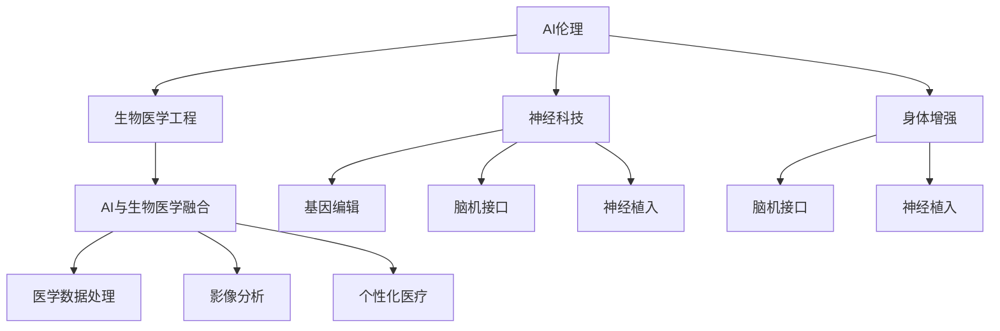

                 

# AI时代的人类增强：道德考虑与身体增强的未来发展机遇分析机遇

> 关键词：人类增强, AI伦理, 身体增强, 神经科技, 生物医学工程, 生命延长

## 1. 背景介绍

### 1.1 问题由来
随着人工智能(AI)技术的迅猛发展，AI与生物医学工程的交叉领域，即“AI+生物医学”逐渐成为一种新型的医疗手段。在这个过程中，一个关键议题就是**人类增强(Human Enhancement)**，特别是通过神经科技(Neurotechnologies)进行的身体增强。人类增强旨在通过科技手段提升人类身体和智力的能力，改善人类生活质量。然而，这一领域也引发了广泛的伦理和法律争议。

### 1.2 问题核心关键点
人类增强主要关注以下几个关键点：
- **安全性**：增强技术的实施是否安全无害？
- **公平性**：增强技术是否会产生不公平的社会阶层分化？
- **自主性**：增强技术是否会侵犯个人的自主选择权？
- **伦理问题**：增强技术的开发和应用是否符合基本的伦理原则？

### 1.3 问题研究意义
研究人类增强的道德和伦理问题，对于保障科技进步的同时不损害人的尊严和公平具有重要意义：
- **维护社会公平**：防止增强技术导致社会不平等加剧，保障每一个人都能公平享受科技进步。
- **促进伦理共识**：探讨和制定一套合理的伦理规范，指导科技伦理委员会和监管机构的工作。
- **保护个人权益**：确保个体在参与增强技术试验和应用过程中，能知情同意并保护自身权益。
- **推动法律建设**：为相关法律法规的制定提供科学依据，指导政府和法律机构的决策。

## 2. 核心概念与联系

### 2.1 核心概念概述

人类增强涉及多个关键概念：

- **AI伦理**：研究AI技术对人类社会道德、法律、经济、文化等各方面的影响。
- **生物医学工程**：应用工程技术手段进行人体功能强化、病变治疗等。
- **神经科技**：利用神经科学原理和工程技术，改善人的认知、行为和情感。
- **身体增强**：通过基因编辑、脑机接口、神经植入等技术，提升人的物理和认知能力。
- **AI与生物医学融合**：将AI技术应用于医学数据处理、影像分析、个性化医疗等领域。

### 2.2 核心概念联系

以下通过一个Mermaid流程图来展示这些概念的联系：



此图展示了AI伦理与生物医学工程、神经科技、身体增强、AI与生物医学融合等概念的相互关系和融合路径。

## 3. 核心算法原理 & 具体操作步骤
### 3.1 算法原理概述

基于神经科技的身体增强技术，主要包括基因编辑、脑机接口、神经植入等方法。这些技术在实施前，通常需要进行严格的科学验证和伦理审查，以确保安全性和有效性。

### 3.2 算法步骤详解

**Step 1: 前期准备**
- **科学研究**：进行基础研究，确定增强技术的科学原理和可行性。
- **伦理审查**：组建多学科伦理委员会，对技术进行伦理审查。
- **法律合规**：确保技术符合现行法律法规。

**Step 2: 技术研发**
- **基因编辑**：采用CRISPR等技术对基因进行精确修改，提升特定能力。
- **脑机接口**：通过植入芯片或装置，建立人脑与计算机的直接通信。
- **神经植入**：将微芯片植入大脑，实现对人脑功能的直接调控。

**Step 3: 临床试验**
- **小样本试验**：在少数受试者中进行初期试验，验证技术的安全性和效果。
- **大规模试验**：扩大样本量，进行更严格的科学验证。

**Step 4: 监管审批**
- **提交申请**：向监管机构提交技术评估申请，包括安全性、伦理审查和法律合规。
- **专家评估**：监管机构组织专家对技术进行全面评估。
- **批准发布**：技术通过审查后，正式投入使用。

### 3.3 算法优缺点

**优点**：
- **改善生活质量**：通过增强技术提升人的认知、体力和反应速度，改善日常工作和生活质量。
- **治疗疾病**：基因编辑和神经植入技术，可用于治疗多种神经系统疾病，如阿尔茨海默病、帕金森病等。
- **推动医学进步**：神经科技的发展，有望推动医学和神经科学的发展，带来更多的创新。

**缺点**：
- **伦理争议**：增强技术的实施可能引发广泛伦理争议，如对人类本质的质疑。
- **社会不平等**：技术可能加剧社会不平等，只有少数人能享受，引发新的社会分化。
- **安全性未知**：许多增强技术的安全性尚未得到充分验证，长期使用可能产生不可预测的风险。
- **隐私问题**：脑机接口等技术可能侵犯个人隐私，引发数据安全和隐私保护问题。

### 3.4 算法应用领域

人类增强技术的应用领域非常广泛，涵盖以下几个主要方面：

- **医疗健康**：用于神经疾病治疗、功能恢复、疾病预防等。
- **体育运动**：提升运动员的体力、协调性和反应速度，增强竞技表现。
- **教育培训**：通过脑机接口等技术，提升学习效率和记忆力。
- **娱乐休闲**：通过虚拟现实(VR)和增强现实(AR)技术，提供沉浸式娱乐体验。
- **国防军事**：提升士兵的体力、反应和决策能力，增强实战能力。

## 4. 数学模型和公式 & 详细讲解 & 举例说明
### 4.1 数学模型构建

我们可以用数学模型来描述基于神经科技的身体增强技术的基本工作原理。

**Step 1: 定义输入输出**
- **输入**：原始数据（如基因组信息、神经信号）
- **输出**：增强后的能力（如认知、体力）

**Step 2: 数学模型构建**
- **基因编辑模型**：通过数学模型描述CRISPR等基因编辑技术，实现基因序列的修改。
- **脑机接口模型**：使用数学模型描述脑机接口的信号采集和处理流程。
- **神经植入模型**：通过数学模型描述神经植入芯片与神经系统的相互作用。

### 4.2 公式推导过程

以基因编辑技术为例，其数学模型可以表示为：

$$
\text{编辑后的基因序列} = f(\text{原始基因序列}, \text{编辑指令})
$$

其中，$f$ 是一个函数，表示基因编辑的操作过程，如剪切、替换、插入等。

### 4.3 案例分析与讲解

以CRISPR技术为例，其基本工作原理如下：
1. 设计特定序列的RNA，与目标基因进行精确配对。
2. 利用Cas9蛋白对目标基因进行切割。
3. 引入新的DNA序列，替换原序列。
4. 细胞自身修复切割位点，实现基因编辑。

## 5. 项目实践：代码实例和详细解释说明
### 5.1 开发环境搭建

要进行基因编辑技术的研究，需要以下开发环境：

1. **编程语言**：Python
2. **开发工具**：Jupyter Notebook、Visual Studio Code
3. **科学计算库**：NumPy、Pandas、SciPy
4. **基因编辑软件**：CRISPR-Cas9 Toolkit、Cas9 DNA消化

### 5.2 源代码详细实现

以下是一个简化的基因编辑代码示例，使用CRISPR-Cas9 Toolkit进行基因编辑：

```python
from crispr import Cas9, RNA

# 定义CRISPR序列
RNA_sequence = RNA('GACCGTAACCAATGCGGCCCG')

# 定义Cas9蛋白
cas9 = Cas9()

# 切割目标基因
target_sequence = 'ACCGCGGCCATGCGGCCG'
cut_result = cas9.cut(RNA_sequence, target_sequence)

# 输出切割结果
print(cut_result)
```

### 5.3 代码解读与分析

该代码使用了CRISPR-Cas9 Toolkit进行基因编辑。首先定义了CRISPR序列和Cas9蛋白，然后使用RNA序列定位目标基因，切割目标基因。最后输出切割结果。

## 6. 实际应用场景
### 6.1 医疗健康

脑机接口技术在医疗健康领域有广泛应用，主要用于神经系统疾病的治疗和康复。例如，通过脑机接口，可以实时监测患者的脑电信号，诊断脑部疾病，提供个性化的治疗方案。

### 6.2 体育运动

运动员通过植入神经刺激芯片，可以提升肌肉力量和耐力，减少运动损伤，提高竞技水平。例如，植入脑电信号监测芯片，实时分析运动员在比赛中的脑电活动，优化训练和比赛策略。

### 6.3 教育培训

脑机接口技术可以用于增强学习效果，提升学生的注意力和记忆力。例如，通过脑机接口，实时监测学生的注意力状态，调整教学内容和节奏，提高学习效率。

### 6.4 娱乐休闲

虚拟现实(VR)和增强现实(AR)技术，可以提供沉浸式娱乐体验。例如，通过脑机接口，玩家可以直接通过大脑控制虚拟角色的行为，提升游戏体验。

### 6.5 国防军事

士兵通过植入神经刺激芯片，可以提升反应速度和决策能力，增强战场上的生存和战斗能力。例如，通过脑机接口，实时监测士兵的生理状态，提供即时支持和治疗。

## 7. 工具和资源推荐
### 7.1 学习资源推荐

为了帮助开发者系统掌握AI时代的人类增强技术，以下是一些推荐的学习资源：

1. **《AI与生物医学工程》**：详细介绍了AI与生物医学工程的交叉领域，包括伦理、法律和技术问题。
2. **《人类增强的伦理困境》**：探讨了人类增强技术的伦理争议和解决方案。
3. **《脑机接口技术》**：介绍了脑机接口的基本原理和应用场景。
4. **《基因编辑技术》**：介绍了CRISPR等基因编辑技术的工作原理和应用案例。
5. **《神经科技前沿》**：介绍了最新的神经科技研究和应用进展。

### 7.2 开发工具推荐

以下是几款用于人类增强技术开发的常用工具：

1. **Python**：灵活的编程语言，支持科学计算和数据分析。
2. **Jupyter Notebook**：交互式编程环境，支持代码调试和数据可视化。
3. **Visual Studio Code**：轻量级代码编辑器，支持多种编程语言和扩展。
4. **CRISPR-Cas9 Toolkit**：开源基因编辑工具包，支持多种基因编辑操作。
5. **Neural Explorer**：脑机接口技术平台，支持脑电信号采集和分析。

### 7.3 相关论文推荐

以下是几篇奠基性的相关论文，推荐阅读：

1. **《AI伦理的基本原则》**：探讨了AI伦理的基本原则和应用场景。
2. **《脑机接口技术的发展与应用》**：介绍了脑机接口技术的发展历程和应用案例。
3. **《基因编辑技术的突破与应用》**：介绍了基因编辑技术的突破和发展方向。
4. **《神经科技在医学中的应用》**：介绍了神经科技在医学中的应用和前景。
5. **《人类增强技术的伦理审查》**：探讨了人类增强技术的伦理审查和监管框架。

## 8. 总结：未来发展趋势与挑战
### 8.1 总结

本文对AI时代的人类增强技术进行了全面系统的介绍。首先阐述了人类增强技术的研究背景和意义，明确了AI与生物医学工程、神经科技在人类增强技术中的关键作用。其次，从原理到实践，详细讲解了人类增强技术的科学原理、伦理问题和技术挑战，给出了具体的技术实现步骤。最后，探讨了人类增强技术在医疗健康、体育运动、教育培训、娱乐休闲、国防军事等领域的广泛应用。

通过本文的系统梳理，可以看到，人类增强技术正在成为AI与生物医学工程的重要方向，为提升人类生活质量和健康水平提供了新的途径。然而，这一领域也面临着诸多伦理和法律问题，需要学界、产业界和政府共同努力，确保技术的安全、公正和可持续应用。

### 8.2 未来发展趋势

展望未来，人类增强技术将呈现以下几个发展趋势：

1. **技术进步**：随着AI和生物医学工程的发展，人类增强技术将不断进步，提升到更高的水平。
2. **伦理规范**：逐步建立健全的伦理规范和法律框架，确保技术应用的安全性和公正性。
3. **公众参与**：加强公众对人类增强技术的了解和参与，形成广泛的社会共识。
4. **国际合作**：加强国际合作，共享技术成果，推动全球技术标准的制定。
5. **跨学科研究**：推动AI、生物医学工程、神经科学等多学科的交叉研究，推动技术创新。

### 8.3 面临的挑战

尽管人类增强技术取得了显著进展，但在推广应用过程中，仍面临诸多挑战：

1. **伦理问题**：人类增强技术引发的伦理争议，如对人类本质的质疑，需要深入研究和解决。
2. **技术风险**：增强技术的安全性和长期效果尚未充分验证，可能产生不可预测的风险。
3. **社会不平等**：增强技术的应用可能导致社会不平等加剧，引发新的社会问题。
4. **法律和监管**：缺乏完善的法律法规和监管机制，需要加强相关研究和制定。
5. **公众接受度**：增强技术需要得到公众的广泛理解和接受，避免引发社会恐慌。

### 8.4 研究展望

面对人类增强技术所面临的诸多挑战，未来的研究需要在以下几个方面寻求新的突破：

1. **伦理规范制定**：制定一套合理的伦理规范和法律框架，指导技术应用。
2. **技术安全性验证**：加强对增强技术的科学验证和安全评估，确保技术安全可靠。
3. **社会公平保障**：确保技术应用能够惠及每一个人，避免产生新的社会不平等。
4. **公众教育普及**：加强公众对人类增强技术的教育和普及，提升社会对技术的理解和接受度。
5. **跨学科研究**：推动AI、生物医学工程、神经科学等多学科的交叉研究，推动技术创新。

这些研究方向的探索，必将引领人类增强技术迈向更高的台阶，为构建更美好的未来社会提供新的技术支撑。

## 9. 附录：常见问题与解答

**Q1：人类增强技术的安全性如何保证？**

A: 人类增强技术的安全性需要从多个方面进行保障：
1. **科学验证**：在实施前，进行严格的基础研究，确保技术的科学性和可行性。
2. **伦理审查**：组建多学科伦理委员会，对技术进行伦理审查，确保技术符合伦理规范。
3. **法律合规**：确保技术符合现行法律法规，避免法律风险。
4. **安全性测试**：在临床试验前，进行多次小样本试验，确保技术的安全性。
5. **监管审批**：向监管机构提交技术评估申请，通过严格审查，确保技术的安全性和有效性。

**Q2：人类增强技术的应用是否会导致社会不平等？**

A: 人类增强技术的应用可能加剧社会不平等，需要采取措施防止这一现象：
1. **公平分配**：确保技术能够惠及每一个人，避免出现新的社会阶层分化。
2. **公共投资**：政府和企业应加大对人类增强技术的公共投资，提高技术的普及率。
3. **社会监督**：加强对技术应用的监督，确保技术应用透明公正。
4. **公众参与**：鼓励公众参与技术研究和应用，形成广泛的社会共识。

**Q3：人类增强技术是否会侵犯个人隐私？**

A: 人类增强技术的应用可能侵犯个人隐私，需要采取措施保护个人隐私：
1. **数据保护**：严格保护个人数据，避免数据泄露和滥用。
2. **隐私政策**：制定严格的隐私政策，确保技术应用的透明性和公正性。
3. **用户知情同意**：确保用户在参与技术应用前，知情同意并保护自身隐私。
4. **技术透明**：公开技术原理和应用过程，确保技术的透明性和可解释性。

**Q4：人类增强技术是否会改变人类本质？**

A: 人类增强技术可能改变人类的本质，引发广泛伦理争议，需要深入研究和讨论：
1. **伦理原则**：制定合理的伦理原则和规范，指导技术应用。
2. **公众讨论**：加强公众对人类增强技术的讨论和辩论，形成广泛的社会共识。
3. **技术平衡**：确保技术应用能够平衡人类的生物属性和技术属性。
4. **自然平衡**：尊重自然进化规律，避免过度干预和改造。

通过这些措施，可以最大限度地减少人类增强技术对人类本质的影响，确保技术应用的安全性和公正性。

---

作者：禅与计算机程序设计艺术 / Zen and the Art of Computer Programming

