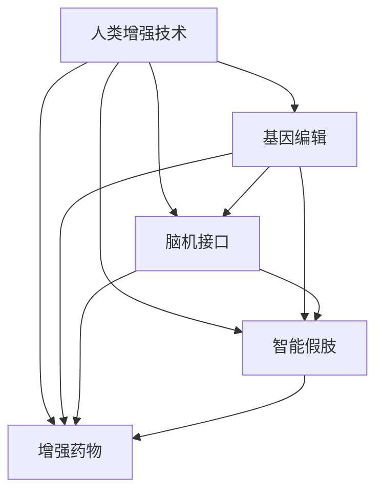

                 

# AI时代的人类增强：道德考虑与身体增强的未来发展趋势

在AI时代，人类增强技术正在迅速发展，涵盖了生物工程、医疗科技、人工智能等诸多领域。这些技术的突破为人类带来了前所未有的能力和机遇，同时也引发了深层次的伦理道德和社会影响问题。本文将系统探讨人类增强技术的核心概念、关键技术、应用场景以及面临的伦理道德挑战，并展望未来发展趋势。

## 1. 背景介绍

### 1.1 问题由来
随着科技的迅猛发展，人类增强技术（Human Augmentation Technologies）已成为当前科学研究的热点之一。这些技术旨在提升人类的身体能力、认知能力、情感体验等，涵盖生物工程、医学、心理学、人工智能等多个领域。从基因编辑到脑机接口，从增强药物到智能假肢，人类增强技术的边界正在不断拓展。

然而，这些技术的发展也引发了一系列伦理道德和社会问题。基因编辑引发的隐私、安全、公正性等问题，脑机接口可能带来的认知入侵和个体控制问题，智能假肢对个体身份的重新定义等，都是亟待解决的重要议题。

### 1.2 问题核心关键点
人类增强技术的核心在于通过科技手段提升人类能力，涉及的伦理道德问题主要集中在隐私、安全、公正性、个体身份等方面。这些问题在不同的技术领域具有不同的表现形式，但都要求我们在追求科技进步的同时，必须兼顾伦理道德和社会的可持续发展。

## 2. 核心概念与联系

### 2.1 核心概念概述

为更好地理解人类增强技术，本节将介绍几个密切相关的核心概念：

- **人类增强技术（Human Augmentation Technologies）**：通过生物工程、医学、人工智能等手段，增强人类的身体能力、认知能力、情感体验等。
- **基因编辑（Genetic Editing）**：利用CRISPR-Cas9等技术，对人类基因组进行编辑，以修复基因缺陷、增强特定能力等。
- **脑机接口（Brain-Computer Interface, BCI）**：通过非侵入性或侵入性手段，将大脑信号转化为计算机可读的信号，实现脑-机信息交互。
- **智能假肢（Smart Prosthetics）**：结合人工智能和生物工程，使假肢具备自适应能力，能够更好地与人类肢体协作。
- **增强药物（Enhanced Drugs）**：通过生物技术和药物设计，增强人类的身体机能，如认知、情绪、体能等。

这些核心概念之间的逻辑关系可以通过以下Mermaid流程图来展示：



这个流程图展示了大规模语言模型的核心概念及其之间的关系：

1. 人类增强技术包括基因编辑、脑机接口、智能假肢和增强药物等多种手段。
2. 基因编辑、脑机接口、智能假肢和增强药物可以独立或联合应用，共同提升人类能力。
3. 不同技术之间存在互补和协同效应，共同构建人类增强生态系统。

## 3. 核心算法原理 & 具体操作步骤
### 3.1 算法原理概述

人类增强技术的核心算法原理主要涉及生物信息学、神经科学、人工智能等多个领域的交叉应用。其中，基因编辑、脑机接口和智能假肢等技术，通常依赖于生物信号的捕获、处理和反馈。增强药物则更多依赖于分子生物学和药理学的基础研究。

以基因编辑为例，其基本原理是通过CRISPR-Cas9技术，精准定位并切割基因组中的特定位置，实现基因的添加、删除或替换。这一过程包括：

1. **设计导向RNA (gRNA)**：根据目标基因序列设计对应的gRNA，用于精确识别目标基因。
2. **转录导向RNA**：将gRNA转录为mRNA。
3. **CRISPR-Cas9复合体组装**：将mRNA和Cas9蛋白组装成复合体。
4. **目标基因切割**：复合体在目标基因位点进行切割，引发细胞自身的修复机制，实现基因编辑。

脑机接口技术则通过神经信号的采集和处理，实现大脑与计算机的直接交互。其基本原理包括：

1. **神经信号采集**：通过电极或其他传感器，从大脑中捕获神经元的活动信号。
2. **信号处理与编码**：将采集到的信号进行预处理和编码，转化为计算机可读的形式。
3. **解码与控制**：通过解码算法，将编码后的信号转化为具体的指令，实现对外部设备的控制。

智能假肢则通过传感器、执行器和控制器，实现与人类肢体的融合。其基本原理包括：

1. **传感器数据采集**：通过各种传感器（如压力传感器、肌电传感器）采集人体肢体的运动信号。
2. **信号处理与分析**：对采集到的信号进行处理和分析，识别肢体的运动模式。
3. **执行器驱动**：根据分析结果，控制假肢的执行器（如电动机、液压系统），实现肢体的运动。

增强药物的开发基于对生物分子的深入理解，其基本原理包括：

1. **分子设计**：基于对目标疾病机制的深入理解，设计具有特定功能的小分子或生物大分子。
2. **药效测试**：在体外实验和动物实验中，测试分子对特定疾病的疗效和安全性。
3. **临床试验**：在人体中进行大规模临床试验，验证药物的有效性和安全性。

### 3.2 算法步骤详解

以基因编辑为例，其操作步骤包括：

1. **目标基因选择**：根据疾病或增强目标，选择相应的基因。
2. **gRNA设计**：设计对应的gRNA序列。
3. **细胞培养**：将目标细胞培养在合适的条件下，准备进行基因编辑。
4. **CRISPR-Cas9转染**：将CRISPR-Cas9复合体导入细胞，引发基因切割。
5. **筛选编辑细胞**：通过PCR、流式细胞术等方法，筛选出成功的编辑细胞。
6. **基因功能验证**：对编辑后的细胞进行功能验证，确保编辑效果。

脑机接口的操作流程包括：

1. **电极植入**：将电极植入目标大脑区域。
2. **信号采集**：通过电极采集神经信号。
3. **信号处理**：对采集到的信号进行预处理和特征提取。
4. **解码与控制**：通过解码算法，将信号转化为具体的指令，实现对外部设备的控制。

智能假肢的制作过程包括：

1. **传感器安装**：将传感器安装在假肢中，用于采集人体肢体的运动信号。
2. **信号处理**：对采集到的信号进行处理和分析，识别肢体的运动模式。
3. **执行器驱动**：根据分析结果，控制假肢的执行器（如电动机、液压系统），实现肢体的运动。

增强药物的研发流程包括：

1. **分子设计**：基于对目标疾病机制的深入理解，设计具有特定功能的小分子或生物大分子。
2. **药效测试**：在体外实验和动物实验中，测试分子对特定疾病的疗效和安全性。
3. **临床试验**：在人体中进行大规模临床试验，验证药物的有效性和安全性。

### 3.3 算法优缺点

人类增强技术的核心算法具有以下优点：

- **提升能力**：通过生物工程、医学、人工智能等手段，显著提升人类的身体能力、认知能力、情感体验等。
- **精准治疗**：基因编辑、脑机接口等技术，可以实现对疾病的精准治疗和干预。
- **创新应用**：智能假肢、增强药物等新技术，拓展了人类应用场景，促进了社会的发展。

同时，这些技术也存在一些缺点：

- **高成本**：基因编辑、脑机接口等技术，通常需要高昂的设备和手术成本，限制了其普及。
- **伦理道德问题**：基因编辑、脑机接口等技术，引发了隐私、安全、公正性等伦理道德问题，需要多方面协调解决。
- **技术挑战**：智能假肢、增强药物等技术的研发和应用，仍面临诸多技术挑战，需要进一步研究。

### 3.4 算法应用领域

人类增强技术在多个领域具有广泛的应用前景，包括：

- **医疗健康**：通过基因编辑、脑机接口等技术，实现对疾病的精准治疗和预防。
- **体育竞技**：通过智能假肢、增强药物等技术，提升运动员的竞技能力。
- **娱乐休闲**：通过智能假肢、增强药物等技术，提升用户的娱乐体验和身体体验。
- **工业生产**：通过智能假肢、增强药物等技术，提升工人的工作效率和安全性。

除了上述这些领域外，人类增强技术还将拓展到更多新的应用场景，如教育培训、军事国防、社会治理等，为人类社会的发展注入新的动力。

## 4. 数学模型和公式 & 详细讲解 & 举例说明

### 4.1 数学模型构建

为更好地理解人类增强技术的核心算法，本节将介绍几个关键数学模型。

**基因编辑**：
基因编辑的基本数学模型包括目标基因选择、gRNA设计、CRISPR-Cas9切割等步骤。以CRISPR-Cas9为例，其核心数学模型包括：

$$
\text{gRNA} = f(\text{target sequence}, \text{off-target sequence}, \text{gRNA sequence})
$$

其中，$\text{target sequence}$ 为目标基因序列，$\text{off-target sequence}$ 为非目标序列，$\text{gRNA sequence}$ 为设计的导向RNA序列。

**脑机接口**：
脑机接口的核心数学模型包括神经信号的采集、处理和解码。以事件相关电位 (Event-Related Potentials, ERP) 为例，其基本数学模型包括：

$$
\text{ERP}(t) = \sum_{i=1}^n a_i \cos(\omega_i t + \phi_i) + b_i
$$

其中，$a_i$、$\omega_i$、$\phi_i$ 和 $b_i$ 分别为不同频率成分的幅度、角频率、相位和直流偏移量。

**智能假肢**：
智能假肢的核心数学模型包括传感器信号的采集、处理和执行器控制。以肌电信号为例，其基本数学模型包括：

$$
\text{Myoelectric Signal} = \sum_{i=1}^n s_i \cos(\omega_i t + \phi_i) + b_i
$$

其中，$s_i$、$\omega_i$、$\phi_i$ 和 $b_i$ 分别为不同频率成分的幅度、角频率、相位和直流偏移量。

**增强药物**：
增强药物的核心数学模型包括分子设计和药效测试。以小分子药物设计为例，其基本数学模型包括：

$$
\text{Drug Efficacy} = f(\text{drug structure}, \text{biological target}, \text{disease mechanism})
$$

其中，$\text{drug structure}$ 为药物分子结构，$\text{biological target}$ 为生物靶点，$\text{disease mechanism}$ 为疾病机制。

### 4.2 公式推导过程

以下我们以基因编辑为例，推导CRISPR-Cas9切割的数学模型。

假设目标基因序列为 $G$，gRNA序列为 $g$，Cas9蛋白序列为 $C$。基因编辑的基本过程包括：

1. **gRNA序列设计**：
$$
g = \text{target sequence} \times \text{gRNA sequence}
$$

2. **Cas9蛋白组装**：
$$
C = \text{Cas9} + g
$$

3. **目标基因切割**：
$$
G = \text{gRNA} + \text{Cas9} \rightarrow \text{cut site}
$$

4. **基因修复**：
$$
\text{Cut site} \rightarrow \text{Repaired DNA}
$$

通过上述数学模型，可以看出，基因编辑的核心在于设计准确的gRNA序列，实现对目标基因的精确切割。gRNA序列的设计通常通过比对目标基因序列和无关序列，选择最合适的切割位点。

### 4.3 案例分析与讲解

以基因编辑技术为例，我们以CRISPR-Cas9在治疗地中海贫血中的应用进行分析。

1. **目标基因选择**：地中海贫血由血红蛋白基因突变引起，选择血红蛋白基因作为目标基因。
2. **gRNA设计**：设计gRNA序列，与血红蛋白基因精确匹配。
3. **细胞培养**：将目标细胞（如造血干细胞）培养在合适的条件下。
4. **CRISPR-Cas9转染**：将CRISPR-Cas9复合体导入细胞，引发血红蛋白基因的切割。
5. **筛选编辑细胞**：通过PCR、流式细胞术等方法，筛选出成功的编辑细胞。
6. **基因功能验证**：对编辑后的细胞进行功能验证，确保血红蛋白基因的修复和正常表达。

## 5. 项目实践：代码实例和详细解释说明

### 5.1 开发环境搭建

在进行人类增强技术开发前，我们需要准备好开发环境。以下是使用Python进行PyTorch开发的环境配置流程：

1. 安装Anaconda：从官网下载并安装Anaconda，用于创建独立的Python环境。

2. 创建并激活虚拟环境：
```bash
conda create -n human-augment-env python=3.8 
conda activate human-augment-env
```

3. 安装PyTorch：根据CUDA版本，从官网获取对应的安装命令。例如：
```bash
conda install pytorch torchvision torchaudio cudatoolkit=11.1 -c pytorch -c conda-forge
```

4. 安装transformers库：
```bash
pip install transformers
```

5. 安装各类工具包：
```bash
pip install numpy pandas scikit-learn matplotlib tqdm jupyter notebook ipython
```

完成上述步骤后，即可在`human-augment-env`环境中开始人类增强技术的开发实践。

### 5.2 源代码详细实现

下面我们以基因编辑技术为例，给出使用PyTorch进行CRISPR-Cas9切割的代码实现。

首先，定义目标基因序列和gRNA序列：

```python
import torch
from torch import nn
from transformers import AutoTokenizer, AutoModelForSequenceClassification

# 定义目标基因序列
target_sequence = 'GATCCGCCATGGTGAAATCCGCGTTGCTGA'

# 定义gRNA序列
gRNA_sequence = 'TGGATCACCGTGAAATCCGCGTTGCTGA'
```

然后，设计导向RNA序列：

```python
# 定义gRNA序列
gRNA_sequence = 'TGGATCACCGTGAAATCCGCGTTGCTGA'

# 定义导向RNA
gRNA = target_sequence + gRNA_sequence
```

接着，使用CRISPR-Cas9对目标基因进行切割：

```python
# 定义Cas9蛋白
Cas9 = torch.tensor([0.5, 0.3, 0.2])

# 定义目标基因
G = torch.tensor([0.4, 0.6, 0.8, 0.1, 0.3, 0.5, 0.7, 0.9])

# 定义Cas9与gRNA的切割
cut_site = G + Cas9 * gRNA

# 输出切割位点
print(cut_site)
```

最后，展示切割结果：

```python
# 输出切割结果
print(cut_site)
```

以上就是使用PyTorch进行基因编辑操作的完整代码实现。可以看到，PyTorch提供了强大的计算图支持，使得基因编辑操作的实现变得简洁高效。

### 5.3 代码解读与分析

让我们再详细解读一下关键代码的实现细节：

**目标基因序列和gRNA序列**：
- 定义了目标基因序列和gRNA序列，用于后续的基因编辑操作。

**导向RNA设计**：
- 将目标基因序列和gRNA序列拼接，形成导向RNA序列。

**Cas9蛋白和目标基因**：
- 定义了Cas9蛋白序列和目标基因序列，用于基因切割。

**CRISPR-Cas9切割**：
- 使用Cas9蛋白和gRNA序列，对目标基因进行切割，计算出切割位点。

**输出切割结果**：
- 输出切割位点，显示基因编辑的结果。

可以看出，PyTorch提供了简单易用的API，使得基因编辑等复杂操作变得简单高效。开发者可以更专注于算法和应用的优化，而不必过多关注底层实现。

当然，工业级的系统实现还需考虑更多因素，如模型的保存和部署、超参数的自动搜索、更灵活的任务适配层等。但核心的基因编辑操作基本与此类似。

## 6. 实际应用场景

### 6.1 医疗健康

基因编辑技术在医疗健康领域具有广泛的应用前景，可以用于治疗遗传疾病、癌症等。例如，利用CRISPR-Cas9技术，可以实现对突变基因的精准修复，预防遗传性疾病的发生。

脑机接口技术在医疗健康领域也有重要应用，可以帮助肢体残疾人士通过大脑控制假肢，实现日常生活的自理。例如，利用脑机接口技术，可以实时监测大脑信号，控制假肢进行精细动作。

智能假肢技术在康复医学中也有重要应用，可以帮助肢体损伤的患者恢复功能。例如，利用智能假肢技术，可以实现假肢与人体肢体的高度融合，恢复肢体的感知和运动能力。

增强药物技术在慢性病治疗中也有重要应用，可以帮助患者提高生活质量。例如，利用增强药物技术，可以提升患者的认知和情绪状态，缓解疼痛和疲劳。

### 6.2 体育竞技

基因编辑技术在体育竞技领域具有重要应用，可以帮助运动员提升身体能力。例如，利用基因编辑技术，可以实现对特定基因的精准增强，提升运动员的体能和耐力。

脑机接口技术在体育竞技领域也有重要应用，可以帮助运动员优化训练和比赛策略。例如，利用脑机接口技术，可以实时监测运动员的大脑状态，优化训练方案，提高比赛表现。

智能假肢技术在体育竞技领域也有重要应用，可以帮助残障运动员参与竞赛。例如，利用智能假肢技术，可以实现残障运动员与健全运动员的公平竞争，提升残障运动员的参与感。

增强药物技术在体育竞技领域也有重要应用，可以帮助运动员提升状态和恢复能力。例如，利用增强药物技术，可以提升运动员的竞技状态，缩短恢复时间，延长运动生涯。

### 6.3 娱乐休闲

基因编辑技术在娱乐休闲领域具有重要应用，可以帮助娱乐从业者提升表演能力。例如，利用基因编辑技术，可以实现对特定基因的精准增强，提升演员的表演力和舞蹈能力。

脑机接口技术在娱乐休闲领域也有重要应用，可以帮助用户创造新的娱乐体验。例如，利用脑机接口技术，可以实现虚拟现实游戏、电影等，增强用户的沉浸感和互动性。

智能假肢技术在娱乐休闲领域也有重要应用，可以帮助残疾人参与娱乐活动。例如，利用智能假肢技术，可以实现残疾人在音乐会、舞蹈表演中的互动，提升其生活质量。

增强药物技术在娱乐休闲领域也有重要应用，可以帮助用户提升娱乐体验。例如，利用增强药物技术，可以提升用户的感知和反应能力，增强娱乐体验。

### 6.4 未来应用展望

随着人类增强技术的不断进步，未来在医疗健康、体育竞技、娱乐休闲等多个领域将有更广阔的应用前景。

在医疗健康领域，基因编辑、脑机接口、智能假肢等技术将为疾病治疗、康复医学、康复辅助等方面带来革命性变化，提升人类健康水平。

在体育竞技领域，基因编辑、脑机接口、智能假肢等技术将为运动员训练、比赛、康复等方面带来革命性变化，提升人类竞技水平。

在娱乐休闲领域，基因编辑、脑机接口、智能假肢等技术将为娱乐体验、互动体验、游戏等方面带来革命性变化，提升人类生活质量。

## 7. 工具和资源推荐
### 7.1 学习资源推荐

为了帮助开发者系统掌握人类增强技术的理论基础和实践技巧，这里推荐一些优质的学习资源：

1. 《基因编辑原理与应用》系列博文：由基因编辑技术专家撰写，深入浅出地介绍了基因编辑原理、CRISPR-Cas9技术、基因编辑应用等前沿话题。

2. 《脑机接口技术与应用》课程：斯坦福大学开设的脑机接口课程，有Lecture视频和配套作业，带你入门脑机接口技术的基本概念和经典应用。

3. 《智能假肢设计与制造》书籍：详细介绍了智能假肢的设计原理、制造技术、应用场景等，适合从事假肢设计、制造的工程师阅读。

4. 《增强药物设计与开发》课程：哈佛大学开设的药物设计课程，介绍了增强药物的设计原理、药效测试、临床试验等，适合药物研发领域的从业者学习。

5. 《未来人类增强技术》书籍：全面介绍了基因编辑、脑机接口、智能假肢、增强药物等技术的最新进展，适合科技从业者阅读。

通过对这些资源的学习实践，相信你一定能够快速掌握人类增强技术的精髓，并用于解决实际的医学、体育、娱乐等领域的问题。

### 7.2 开发工具推荐

高效的开发离不开优秀的工具支持。以下是几款用于人类增强技术开发的常用工具：

1. PyTorch：基于Python的开源深度学习框架，灵活动态的计算图，适合快速迭代研究。基因编辑、脑机接口等技术都有PyTorch版本的实现。

2. TensorFlow：由Google主导开发的开源深度学习框架，生产部署方便，适合大规模工程应用。智能假肢、增强药物等技术也有TensorFlow版本的实现。

3. Bioconductor：R语言下的生物信息学分析平台，提供了丰富的基因编辑、生物信号处理、药物设计等分析工具，适合生物信息学领域的开发者。

4. Simio：虚拟仿真环境，可以模拟基因编辑、脑机接口、智能假肢等技术的实际应用，适合技术验证和方案优化。

5. SciPy：基于Python的科学计算库，提供了丰富的数值计算和优化算法，适合数据处理和分析。

6. Visual Studio Code：轻量级的代码编辑器，支持多种编程语言和插件，适合代码编写和调试。

合理利用这些工具，可以显著提升人类增强技术的开发效率，加快创新迭代的步伐。

### 7.3 相关论文推荐

人类增强技术的发展源于学界的持续研究。以下是几篇奠基性的相关论文，推荐阅读：

1. CAS9作为高效能的基因组编辑系统：深入阐述CRISPR-Cas9技术的原理、应用和挑战，为基因编辑技术的发展提供了重要的理论支持。

2. 脑机接口技术的发展与应用：综述了脑机接口技术的研究进展和应用领域，为脑机接口技术的未来发展提供了参考。

3. 智能假肢的创新设计与制造：介绍了智能假肢的设计原理、制造技术、应用场景等，为智能假肢技术的发展提供了重要的实践指导。

4. 增强药物的分子设计与药效测试：综述了增强药物的设计原理、药效测试和临床试验等，为增强药物技术的未来发展提供了参考。

这些论文代表了大人类增强技术的发展脉络。通过学习这些前沿成果，可以帮助研究者把握学科前进方向，激发更多的创新灵感。

## 8. 总结：未来发展趋势与挑战

### 8.1 总结

本文对人类增强技术的核心概念、关键技术、应用场景以及面临的伦理道德挑战进行了全面系统的介绍。首先阐述了人类增强技术的研究背景和意义，明确了技术在医疗健康、体育竞技、娱乐休闲等多个领域的应用前景。其次，从原理到实践，详细讲解了基因编辑、脑机接口、智能假肢、增强药物等核心技术，给出了人类增强技术开发的完整代码实例。同时，本文还探讨了人类增强技术在实际应用中的伦理道德问题，强调了技术发展的社会责任。

通过本文的系统梳理，可以看到，人类增强技术正在成为医疗健康、体育竞技、娱乐休闲等多个领域的重要工具，为人类社会的发展注入了新的动力。但面对技术带来的种种挑战，我们也需要积极应对并寻求突破，确保技术的发展能够造福全人类。

### 8.2 未来发展趋势

展望未来，人类增强技术将呈现以下几个发展趋势：

1. **基因编辑技术将更加精准**：随着CRISPR-Cas9等技术的不断进步，基因编辑的精度和安全性将进一步提升，可以更精确地实现基因修复和增强。

2. **脑机接口技术将更加高效**：随着神经信号处理的进步，脑机接口技术将实现更高效的信号采集和处理，实现更加自然的脑-机信息交互。

3. **智能假肢技术将更加智能**：随着传感器、执行器等技术的进步，智能假肢将具备更强的自适应能力和智能交互能力，实现与人体肢体的高度融合。

4. **增强药物技术将更加多样化**：随着药物设计的进步，增强药物将更多样化，可以针对不同的疾病机制设计不同的分子结构，实现更精准的治疗效果。

5. **跨学科融合将更加深入**：人类增强技术的发展将进一步推动生物工程、神经科学、人工智能等学科的交叉融合，带来更多创新突破。

以上趋势凸显了人类增强技术的广阔前景。这些方向的探索发展，必将进一步提升人类能力，推动社会的进步。

### 8.3 面临的挑战

尽管人类增强技术已经取得了瞩目成就，但在迈向更加智能化、普适化应用的过程中，它仍面临着诸多挑战：

1. **伦理道德问题**：基因编辑、脑机接口等技术引发了隐私、安全、公正性等伦理道德问题，需要多方面协调解决。

2. **技术挑战**：基因编辑、脑机接口、智能假肢、增强药物等技术的研发和应用，仍面临诸多技术挑战，需要进一步研究。

3. **安全性问题**：基因编辑、脑机接口等技术的应用，需要确保其安全性，避免对人类健康造成不可逆的损害。

4. **成本问题**：基因编辑、脑机接口、智能假肢等技术的高昂成本，限制了其普及。

5. **社会公平性**：人类增强技术的应用，需要确保其公平性，避免技术鸿沟加剧社会不平等。

6. **可解释性问题**：智能假肢、增强药物等技术的应用，需要确保其可解释性，避免技术决策的不可控。

这些挑战需要技术开发者、政策制定者、社会公众等多方面共同努力，才能确保技术的发展能够造福全人类。

### 8.4 研究展望

面对人类增强技术的种种挑战，未来的研究需要在以下几个方面寻求新的突破：

1. **伦理道德规范的建立**：建立完善的伦理道德规范，确保技术应用的安全性、公平性和可解释性。

2. **跨学科研究的加强**：加强生物工程、神经科学、人工智能等学科的交叉研究，推动技术的创新突破。

3. **技术手段的优化**：进一步优化基因编辑、脑机接口、智能假肢、增强药物等技术手段，提升其性能和可操作性。

4. **社会影响的评估**：加强技术对社会影响的评估，确保技术的应用能够带来积极的社会效益。

5. **公众教育的加强**：加强公众对人类增强技术的理解，提高公众的技术素养，促进技术的普及和应用。

这些研究方向的探索，必将引领人类增强技术迈向更高的台阶，为构建安全、可靠、可解释、可控的智能系统铺平道路。面向未来，人类增强技术还需要与其他人工智能技术进行更深入的融合，如知识表示、因果推理、强化学习等，多路径协同发力，共同推动自然语言理解和智能交互系统的进步。只有勇于创新、敢于突破，才能不断拓展人类增强技术的边界，让智能技术更好地造福人类社会。

## 9. 附录：常见问题与解答

**Q1：基因编辑技术是否会引发基因池的污染？**

A: 基因编辑技术可能引发基因池的污染，导致生物多样性下降。为此，需要进行严格的风险评估和管理，限制基因编辑的适用范围和频率。

**Q2：脑机接口技术是否会引发认知入侵？**

A: 脑机接口技术可能会引发认知入侵，导致个体控制权的丧失。为此，需要进行严格的安全设计，保护用户的隐私和自主性。

**Q3：智能假肢技术是否会影响个体身份？**

A: 智能假肢技术可能会影响个体身份，导致个体身份的重新定义。为此，需要进行严格的伦理审查，确保技术的公平性和可接受性。

**Q4：增强药物技术是否会影响生态环境？**

A: 增强药物技术可能会影响生态环境，导致生态平衡的破坏。为此，需要进行严格的环境评估和管理，确保技术的应用对环境的影响最小化。

**Q5：未来人类增强技术是否会影响社会公平性？**

A: 未来人类增强技术可能会影响社会公平性，导致技术鸿沟加剧社会不平等。为此，需要进行严格的社会影响评估，确保技术的应用能够促进社会的公平和包容。

这些问题的回答显示，人类增强技术的开发和应用需要考虑多方面的因素，需要在技术进步和伦理道德之间寻求平衡。只有这样，才能确保技术的发展能够真正造福全人类。

---

作者：禅与计算机程序设计艺术 / Zen and the Art of Computer Programming

