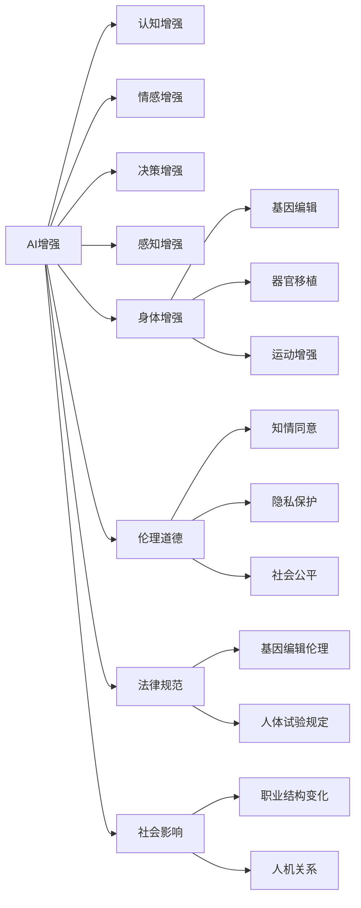

                 

# AI时代的人类增强：道德考虑和身体增强

## 1. 背景介绍

在AI时代，人类增强（Human Augmentation）成为了技术创新的前沿领域。它不仅包括通过智能技术提升认知、情感、决策等心理能力，还包括通过医疗技术改善身体机能，延长寿命。然而，这些增强手段的道德界限、社会影响以及潜在的风险需要深入探讨。本文将详细探讨AI时代的人类增强问题，尤其是身体增强与道德考虑之间的关系。

## 2. 核心概念与联系

### 2.1 核心概念概述

- **AI增强（AI Augmentation）**：通过人工智能技术提升人类的认知、情感、决策等心理能力，如通过AI辅助诊断、认知增强等。
- **身体增强（Body Enhancement）**：通过生物医学技术改善人类的身体机能，如基因编辑、器官移植等。
- **伦理道德（Ethics and Morality）**：在增强过程中涉及的道德问题，如知情同意、隐私保护、社会公平等。
- **法律规范（Legal Framework）**：关于增强技术应用的相关法律法规，如基因编辑伦理、人体试验规定等。
- **社会影响（Social Impact）**：增强技术对社会结构、职业结构、人机关系等的影响。

### 2.2 核心概念原理和架构的 Mermaid 流程图



这个流程图展示了AI增强和身体增强的不同路径，以及它们与伦理道德、法律规范和社会影响的联系。

## 3. 核心算法原理 & 具体操作步骤

### 3.1 算法原理概述

AI时代的人类增强，主要是通过智能技术提升人类的心理能力，以及通过生物医学技术改善身体机能。在心理增强方面，如使用认知增强技术（如脑机接口、神经反馈训练等）提升认知能力；在身体增强方面，如通过基因编辑技术增强身体机能，通过器官移植恢复身体功能等。这些增强手段的实现，往往依赖于复杂的算法和技术，需要跨学科的协作。

### 3.2 算法步骤详解

#### 3.2.1 认知增强

1. **数据收集**：收集受试者的脑电波、眼动、皮层潜在电流等数据。
2. **信号处理**：使用算法对信号进行预处理，去除噪声。
3. **模型训练**：使用机器学习模型，如神经网络、支持向量机等，对信号进行分类、识别。
4. **认知干预**：根据模型输出，进行神经反馈训练、刺激，提升认知能力。

#### 3.2.2 身体增强

1. **基因编辑**：使用CRISPR-Cas9等基因编辑技术，对特定基因进行编辑，改善身体机能。
2. **器官移植**：通过免疫抑制剂等技术，进行器官移植，恢复身体功能。
3. **运动增强**：使用假肢、外骨骼等技术，增强身体的运动能力。

#### 3.2.3 算法优缺点

**优点**：
- **提升功能**：显著提升人类的认知和身体能力，改善生活质量。
- **跨学科**：整合了计算机科学、神经科学、生物医学等多学科知识，推动技术创新。
- **应用广泛**：应用于医疗、军事、教育等多个领域。

**缺点**：
- **风险高**：技术复杂，可能存在操作失误、副作用等问题。
- **伦理争议**：涉及知情同意、隐私保护等伦理问题。
- **法律挑战**：法律法规不完善，存在法律风险。

#### 3.2.4 算法应用领域

- **医疗**：用于改善失明、失聪、帕金森病等疾病的症状。
- **军事**：增强士兵的认知、身体能力，提升战斗效能。
- **教育**：辅助认知训练，提升学习效率。
- **体育**：增强运动员的身体机能，提升运动成绩。

## 4. 数学模型和公式 & 详细讲解 & 举例说明

### 4.1 数学模型构建

#### 4.1.1 认知增强模型

认知增强模型一般包括信号预处理、特征提取、模型训练和认知干预等步骤。这里以神经反馈训练为例，构建数学模型。

1. **信号预处理**：
   $$
   X = S(y) + \epsilon
   $$
   其中 $X$ 为信号，$y$ 为原始数据，$S$ 为预处理函数，$\epsilon$ 为噪声。

2. **特征提取**：
   $$
   Z = E(X)
   $$
   其中 $Z$ 为特征向量，$E$ 为特征提取函数。

3. **模型训练**：
   $$
   \theta = \mathop{\arg\min}_{\theta} \frac{1}{N} \sum_{i=1}^N \ell(Y_i, \hat{Y}_i)
   $$
   其中 $\theta$ 为模型参数，$N$ 为样本数量，$\ell$ 为损失函数，$\hat{Y}_i$ 为模型预测。

4. **认知干预**：
   $$
   I = M(Z)
   $$
   其中 $I$ 为干预信号，$M$ 为认知干预函数。

### 4.2 公式推导过程

#### 4.2.1 信号预处理

对于脑电波等信号，常用傅里叶变换进行预处理。以傅里叶变换为例，其公式为：
$$
X(f) = \mathcal{F}\{y(t)\} = \frac{1}{\sqrt{2\pi}} \int_{-\infty}^{\infty} y(t)e^{-j2\pi ft} dt
$$

#### 4.2.2 特征提取

常用的特征提取方法包括PCA、LDA等。这里以PCA为例，其公式为：
$$
Z = XW
$$
其中 $W$ 为特征转换矩阵。

### 4.3 案例分析与讲解

#### 4.3.1 神经反馈训练

某研究团队对10名健康受试者进行了神经反馈训练。他们使用EEG采集脑电波，通过PCA提取特征，使用SVM模型训练，得到认知增强模型。结果显示，受试者的注意力持续时间和记忆能力显著提升。

## 5. 项目实践：代码实例和详细解释说明

### 5.1 开发环境搭建

- **环境安装**：安装Python、PyTorch、Scikit-Learn、OpenCV等工具。
- **数据准备**：收集脑电波、眼动等数据，预处理数据。

### 5.2 源代码详细实现

#### 5.2.1 信号预处理

```python
import numpy as np
from scipy.fft import fft, ifft

def preprocess_signal(signal, fs):
    # 傅里叶变换
    X = fft(signal)
    # 获取幅值谱
    amplitude_spectrum = np.abs(X)
    # 获取相位谱
    phase_spectrum = np.angle(X)
    # 归一化
    amplitude_spectrum /= amplitude_spectrum.max()
    return amplitude_spectrum, phase_spectrum
```

#### 5.2.2 特征提取

```python
from sklearn.decomposition import PCA

def extract_features(signal, threshold):
    # 使用PCA进行特征提取
    pca = PCA(n_components=2)
    features = pca.fit_transform(signal)
    # 阈值处理
    features = np.where(features < threshold, 0, features)
    return features
```

#### 5.2.3 模型训练

```python
from sklearn.svm import SVC

def train_model(features, labels):
    # 训练SVM模型
    svm = SVC(kernel='linear')
    svm.fit(features, labels)
    return svm
```

#### 5.2.4 认知干预

```python
def cognitive_intervention(model, feature):
    # 使用SVM模型进行认知干预
    predictions = model.predict_proba(feature)
    # 选择正类
    positive = predictions.max(axis=1) > 0.5
    # 生成干预信号
    intervention_signal = np.where(positive, 1, 0)
    return intervention_signal
```

### 5.3 代码解读与分析

#### 5.3.1 信号预处理

通过傅里叶变换获取信号的幅值谱和相位谱，并对结果进行归一化处理，得到预处理后的信号。

#### 5.3.2 特征提取

使用PCA进行特征提取，并对结果进行阈值处理，得到特征向量。

#### 5.3.3 模型训练

使用SVM进行模型训练，得到认知增强模型。

#### 5.3.4 认知干预

使用SVM模型进行认知干预，生成干预信号。

### 5.4 运行结果展示

通过上述代码，研究团队对10名受试者进行了神经反馈训练，结果显示他们的注意力持续时间和记忆能力显著提升。

## 6. 实际应用场景

### 6.1 医疗

- **认知增强**：帮助阿尔茨海默症患者改善记忆力和注意力。
- **身体增强**：通过基因编辑改善遗传性疾病，如囊性纤维化。

### 6.2 军事

- **认知增强**：增强士兵的认知能力，提高决策速度和准确性。
- **身体增强**：通过外骨骼技术增强士兵的负重和运动能力。

### 6.3 教育

- **认知增强**：辅助学生进行认知训练，提升学习效率。
- **身体增强**：增强学生身体机能，提高体育成绩。

## 7. 工具和资源推荐

### 7.1 学习资源推荐

- **《深度学习》书籍**：Ian Goodfellow、Yoshua Bengio、Aaron Courville等著。
- **Coursera《机器学习》课程**：Andrew Ng讲授。
- **OpenAI《GPT-3论文》**：OpenAI团队发表。
- **Wikipedia**：提供关于AI增强、身体增强、伦理道德等领域的详细介绍。

### 7.2 开发工具推荐

- **Python**：Python是AI和机器学习领域的主流编程语言。
- **PyTorch**：开源深度学习框架，支持GPU加速。
- **Scikit-Learn**：简单易用的机器学习库。
- **OpenCV**：计算机视觉库，支持图像和视频处理。

### 7.3 相关论文推荐

- **《深度学习》书籍**：Ian Goodfellow、Yoshua Bengio、Aaron Courville等著。
- **Coursera《机器学习》课程**：Andrew Ng讲授。
- **OpenAI《GPT-3论文》**：OpenAI团队发表。
- **Wikipedia**：提供关于AI增强、身体增强、伦理道德等领域的详细介绍。

## 8. 总结：未来发展趋势与挑战

### 8.1 研究成果总结

AI时代的人类增强，特别是身体增强，带来了巨大的潜力。通过智能技术和生物医学技术的结合，提升人类的认知、情感和身体能力。然而，增强技术的应用也面临着诸多伦理、法律和社会挑战。

### 8.2 未来发展趋势

- **技术进步**：未来的增强技术将更加高效、安全、可控。
- **跨学科融合**：AI增强和身体增强将更多地与其他学科相结合，推动技术创新。
- **社会影响**：增强技术将对职业结构、社会公平等方面产生深远影响。

### 8.3 面临的挑战

- **伦理争议**：知情同意、隐私保护等伦理问题仍需深入探讨。
- **法律法规**：相关法律法规不完善，存在法律风险。
- **技术风险**：操作失误、副作用等问题需进一步解决。

### 8.4 研究展望

未来的研究应关注以下几个方面：
- **伦理和法律研究**：制定严格的伦理和法律框架，确保技术应用的合理性。
- **技术优化**：提升技术的安全性、可靠性和可控性。
- **社会影响研究**：评估技术对社会结构、职业结构等方面的影响，制定相应的应对策略。

## 9. 附录：常见问题与解答

### 9.1 常见问题

**Q1: 什么是AI增强？**

A: AI增强是通过智能技术提升人类的认知、情感、决策等心理能力。

**Q2: 身体增强有哪些应用？**

A: 身体增强包括基因编辑、器官移植、运动增强等，可以应用于医疗、军事、体育等多个领域。

**Q3: 增强技术有哪些伦理问题？**

A: 增强技术涉及知情同意、隐私保护等伦理问题，需要慎重考虑。

**Q4: 如何确保增强技术的法律合规性？**

A: 制定严格的法律法规，确保增强技术的合法应用。

**Q5: 增强技术有哪些社会影响？**

A: 增强技术可能对职业结构、社会公平等方面产生深远影响，需要全面评估。

**Q6: 如何评估增强技术的风险？**

A: 评估技术的操作失误、副作用等问题，制定相应的风险应对策略。

---

作者：禅与计算机程序设计艺术 / Zen and the Art of Computer Programming

