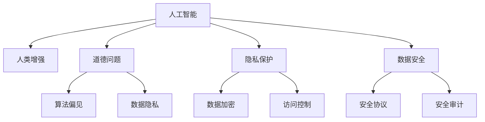

                 

# AI时代的人类增强：道德、隐私和安全挑战

> 关键词：人工智能,人类增强,道德问题,隐私保护,数据安全

## 1. 背景介绍

### 1.1 问题由来

随着人工智能(AI)技术的迅猛发展，人类在AI的辅助下，正逐步进入一个全新时代——AI时代。AI技术在医疗、教育、金融、交通等领域的应用，正在为人类社会带来前所未有的便利和效率提升，推动社会生产力的跨越式发展。然而，技术的快速迭代和普及，也带来了诸多挑战，尤其是道德、隐私和安全问题。如何平衡技术进步与伦理考量，构建和谐的AI时代，成为全球范围内热议的话题。

### 1.2 问题核心关键点

1. **道德问题**：AI的决策过程缺乏透明度和可解释性，可能导致不公正、歧视性或伦理失衡的问题。
2. **隐私保护**：在AI应用中，如何保护用户数据隐私，防止数据滥用，是至关重要的。
3. **数据安全**：AI系统依赖大量数据，数据泄露和攻击风险不容忽视。

这些问题不仅影响到技术应用本身，还直接关系到社会公平、法律监管、用户信任等方面，是AI技术发展过程中必须正视和解决的关键挑战。

### 1.3 问题研究意义

深入探讨AI时代的人类增强与道德、隐私、安全挑战，对于推动AI技术的健康发展，构建以人为本的AI伦理框架，具有重要的理论和实践意义：

1. **提升技术透明度**：研究AI决策过程的道德与可解释性，有助于提升用户对AI系统的信任，促进技术的普及和应用。
2. **保障用户隐私**：分析AI在数据处理中的隐私保护机制，有助于制定更严格的法律法规，保护用户数据安全。
3. **强化数据安全**：探索AI系统中的数据安全防护技术，有助于降低数据泄露风险，保护企业利益和用户隐私。
4. **推动伦理共识**：通过跨学科合作，构建AI伦理标准和规范，推动全球AI发展的道德共识。

## 2. 核心概念与联系

### 2.1 核心概念概述

为更好地理解AI时代人类增强面临的道德、隐私和安全挑战，本节将介绍几个密切相关的核心概念：

- **人工智能(AI)**：以机器学习、深度学习等技术为代表的自动化智能系统。AI技术能够处理海量数据，解决复杂问题，辅助人类决策。
- **人类增强(Human Augmentation)**：通过AI技术提升人类的认知、感知、决策等方面的能力，如智能助手、健康监测、心理辅导等。
- **道德问题(Ethical Issues)**：在AI应用过程中，可能出现的道德困境、偏见和歧视，如算法偏见、数据隐私等。
- **隐私保护(Privacy Protection)**：在数据采集、存储、处理和共享过程中，保护个人隐私的措施和技术手段。
- **数据安全(Data Security)**：保护数据在传输、存储和处理过程中不受未授权访问和篡改的安全技术。

这些概念之间相互联系，共同构成了AI时代人类增强的伦理、隐私和安全框架。

### 2.2 核心概念原理和架构的 Mermaid 流程图



这个流程图展示了一些核心概念之间的逻辑关系：

1. 人工智能通过技术手段辅助人类增强能力，带来了效率提升和认知改善。
2. 在增强过程中，可能会出现算法偏见、数据隐私等道德问题。
3. 隐私保护和数据安全技术能够帮助缓解这些问题。
4. 隐私保护和数据安全构成了保障人类增强安全性的重要环节。

## 3. 核心算法原理 & 具体操作步骤

### 3.1 算法原理概述

AI时代的人类增强涉及多个算法原理，这些原理共同作用，构成了增强技术的核心框架。以下是几个关键的算法原理：

- **机器学习与深度学习**：AI增强的基础技术，通过学习大量数据，训练模型进行智能决策。
- **自然语言处理(NLP)**：使AI能够理解和生成人类语言，实现人机交互。
- **计算机视觉(CV)**：使AI能够识别和处理视觉数据，辅助医疗、安全等领域。
- **强化学习**：通过与环境的交互，训练AI模型，优化决策过程。
- **智能推理**：结合知识图谱和逻辑推理，提升AI系统的判断和决策能力。

### 3.2 算法步骤详解

基于AI的人类增强通常包括以下几个关键步骤：

1. **数据采集与预处理**：收集和清洗用于训练的原始数据，如文本、图像、传感器数据等。
2. **模型训练与优化**：使用机器学习、深度学习等算法，训练模型并优化性能，使其能够处理特定任务。
3. **模型部署与应用**：将训练好的模型部署到生产环境中，进行实时应用和推理计算。
4. **结果监控与反馈**：监控模型输出，收集反馈数据，不断优化模型性能。

### 3.3 算法优缺点

AI时代的人类增强算法具有以下优点：

1. **高效性**：AI可以快速处理大量数据，辅助人类做出快速决策。
2. **准确性**：基于大数据和复杂算法的AI模型，往往能够提供更高精度的决策支持。
3. **可扩展性**：AI技术能够轻松扩展到不同的应用场景，提升整体生产力。

同时，这些算法也存在一些缺点：

1. **复杂度**：复杂的模型训练和优化过程，对计算资源和时间要求较高。
2. **不透明性**：AI决策过程的复杂性，使得结果难以解释和理解。
3. **依赖数据**：AI系统高度依赖数据质量，数据偏差可能导致模型偏见。
4. **安全性风险**：数据泄露和模型攻击风险，可能导致严重的后果。

### 3.4 算法应用领域

AI时代的人类增强技术在多个领域得到了广泛应用，包括但不限于：

1. **医疗健康**：AI辅助诊断、个性化治疗、健康监测等，提升了医疗服务质量和效率。
2. **智能交通**：自动驾驶、交通流量优化、智慧城市管理等，提高了交通系统的安全和效率。
3. **教育培训**：智能辅导、个性化推荐、学习路径优化等，提升了教育效果和学习体验。
4. **金融服务**：风险评估、交易策略、客户服务等，优化了金融产品和服务的质量。
5. **零售电商**：智能推荐、客户关系管理、库存优化等，提升了零售电商的运营效率和用户体验。

## 4. 数学模型和公式 & 详细讲解 & 举例说明

### 4.1 数学模型构建

在AI时代的人类增强中，数学模型是核心基础。以医疗领域的智能诊断为例，常用的数学模型包括：

- **支持向量机(SVM)**：用于分类和回归任务，通过最大化分类边界，提升模型准确性。
- **决策树与随机森林**：通过树形结构进行特征选择和模型训练，适用于处理复杂数据。
- **神经网络**：通过多层非线性变换，学习复杂函数映射，用于图像识别、语音识别等任务。
- **卷积神经网络(CNN)**：用于图像处理和识别，通过卷积操作提取特征。
- **循环神经网络(RNN)**：用于序列数据处理，适用于语音、文本等时间序列数据的建模。

### 4.2 公式推导过程

以神经网络为例，其基本结构如图：

```
            输入层
             |
             V
           隐藏层
             |
             V
           输出层
```

设输入数据为 $x$，隐藏层权重为 $W$，隐藏层输出为 $h$，输出层权重为 $U$，输出为 $y$。则前向传播过程如下：

$$
h = f(xW + b)
$$

$$
y = g(hU + c)
$$

其中 $f$ 和 $g$ 为激活函数，$b$ 和 $c$ 为偏置项。

### 4.3 案例分析与讲解

以医疗影像诊断为例，假设训练集为 $D = \{(x_i, y_i)\}_{i=1}^N$，其中 $x_i$ 为输入的影像数据，$y_i$ 为诊断结果。通过神经网络训练得到的模型为 $M = (W, U)$，则损失函数为：

$$
L(M) = \frac{1}{N} \sum_{i=1}^N \ell(y_i, M(x_i))
$$

其中 $\ell$ 为损失函数，如交叉熵损失。通过反向传播算法，更新模型参数 $W$ 和 $U$，最小化损失函数 $L(M)$。

## 5. 项目实践：代码实例和详细解释说明

### 5.1 开发环境搭建

为了进行AI项目实践，需要搭建相应的开发环境。以下是使用Python进行TensorFlow开发的环境配置流程：

1. 安装Anaconda：从官网下载并安装Anaconda，用于创建独立的Python环境。

2. 创建并激活虚拟环境：
```bash
conda create -n tensorflow-env python=3.8 
conda activate tensorflow-env
```

3. 安装TensorFlow：根据CUDA版本，从官网获取对应的安装命令。例如：
```bash
conda install tensorflow -c conda-forge
```

4. 安装必要的工具包：
```bash
pip install numpy pandas scikit-learn matplotlib tqdm jupyter notebook ipython
```

完成上述步骤后，即可在 `tensorflow-env` 环境中开始项目实践。

### 5.2 源代码详细实现

我们以医疗影像诊断为例，展示使用TensorFlow进行模型训练的代码实现。

首先，定义医疗影像的预处理函数：

```python
import tensorflow as tf
from tensorflow.keras.preprocessing.image import ImageDataGenerator

def preprocess_image(image_path):
    img = tf.io.read_file(image_path)
    img = tf.image.decode_jpeg(img, channels=3)
    img = tf.image.resize(img, (224, 224))
    img = img / 255.0
    return img
```

然后，定义数据增强和批处理函数：

```python
datagen = ImageDataGenerator(
    rescale=1./255,
    shear_range=0.2,
    zoom_range=0.2,
    horizontal_flip=True,
    validation_split=0.2
)

train_generator = datagen.flow_from_directory(
    'train_dir',
    target_size=(224, 224),
    batch_size=32,
    subset='training'
)

val_generator = datagen.flow_from_directory(
    'train_dir',
    target_size=(224, 224),
    batch_size=32,
    subset='validation'
)
```

接着，定义模型和优化器：

```python
from tensorflow.keras import layers, models

model = models.Sequential([
    layers.Conv2D(32, (3, 3), activation='relu', input_shape=(224, 224, 3)),
    layers.MaxPooling2D((2, 2)),
    layers.Conv2D(64, (3, 3), activation='relu'),
    layers.MaxPooling2D((2, 2)),
    layers.Conv2D(128, (3, 3), activation='relu'),
    layers.MaxPooling2D((2, 2)),
    layers.Flatten(),
    layers.Dense(128, activation='relu'),
    layers.Dense(1, activation='sigmoid')
])

model.compile(optimizer='adam', loss='binary_crossentropy', metrics=['accuracy'])
```

最后，启动训练流程并在验证集上评估：

```python
epochs = 10

history = model.fit(
    train_generator,
    validation_data=val_generator,
    epochs=epochs
)

print('Accuracy: %.2f' % history.history['val_accuracy'][-1])
```

以上就是使用TensorFlow进行医疗影像诊断的完整代码实现。可以看到，TensorFlow提供了强大的API和工具，使得模型构建和训练变得相对简洁高效。

### 5.3 代码解读与分析

让我们再详细解读一下关键代码的实现细节：

**preprocess_image函数**：
- 读取图像文件，解码为JPEG格式，转换为RGB通道。
- 调整图像尺寸为224x224，并进行归一化处理。

**数据增强和批处理函数**：
- 使用ImageDataGenerator对训练集进行数据增强，包括缩放、剪切、翻转等操作。
- 使用flow_from_directory加载图像数据，进行批处理和随机切分。

**模型定义和编译**：
- 定义卷积神经网络结构，包括卷积层、池化层、全连接层等。
- 编译模型，选择Adam优化器和二元交叉熵损失函数。

**训练流程**：
- 使用fit方法进行模型训练，指定训练轮数和验证集。
- 在训练过程中，不断监控验证集的准确率，评估模型性能。

可以看到，TensorFlow提供了丰富的API和工具，方便开发者快速实现模型训练和评估。

## 6. 实际应用场景

### 6.1 智能交通

在智能交通领域，AI技术被广泛应用于自动驾驶、交通流量优化、智能监控等场景。通过智能摄像头、雷达、GPS等设备采集数据，AI系统可以实时分析道路状况，预测交通流量，优化交通信号灯，提升交通系统的安全性和效率。

在自动驾驶中，AI系统通过感知、决策和控制模块，实现对车辆和道路环境的理解，辅助驾驶员进行安全驾驶。未来，随着技术的进一步成熟，AI系统有望完全替代人类驾驶员，实现无人驾驶。

### 6.2 金融服务

在金融服务领域，AI技术被用于风险评估、交易策略、客户服务等方面。通过分析历史交易数据和市场信息，AI模型可以预测股票价格走势，帮助投资者做出更明智的投资决策。AI系统还能实时监控市场动态，进行自动交易，提升交易效率和收益。

此外，AI还被应用于客户关系管理，通过分析客户行为和历史数据，提供个性化的产品推荐和服务。通过AI客服系统，金融公司可以24小时不间断地为客户提供咨询服务，提升客户满意度。

### 6.3 智能医疗

在医疗领域，AI技术被广泛应用于疾病诊断、治疗方案推荐、健康监测等场景。通过分析患者的医疗影像、基因数据和病历信息，AI系统可以辅助医生进行诊断，提供个性化的治疗方案，提升医疗服务的质量和效率。

AI系统还可以用于健康监测，通过分析可穿戴设备和传感器数据，实时监控患者的健康状况，及时发现异常情况。此外，AI还被应用于医疗影像处理，如肺结节检测、癌症筛查等，帮助医生快速、准确地识别疾病。

### 6.4 未来应用展望

随着AI技术的不断进步，其在人类增强中的应用前景将更加广阔。未来，AI技术有望在更多领域得到广泛应用，带来更深层次的社会变革：

1. **教育培训**：AI系统可以用于个性化教学、作业批改、学习路径优化等，提升教育效果和学习体验。
2. **智能家居**：AI系统可以用于智能控制、语音交互、安防监控等，提升家庭生活的便捷性和安全性。
3. **社会治理**：AI系统可以用于城市管理、公共安全、智慧警务等，提升社会治理的智能化水平。
4. **农业生产**：AI系统可以用于作物监测、病虫害预警、精准农业等，提升农业生产效率和质量。

## 7. 工具和资源推荐

### 7.1 学习资源推荐

为了帮助开发者系统掌握AI时代的人类增强技术，这里推荐一些优质的学习资源：

1. **《深度学习》书籍**：Ian Goodfellow等人著作的经典教材，全面介绍了深度学习的理论和实践。
2. **Coursera《深度学习专项课程》**：由Andrew Ng教授主讲的在线课程，涵盖深度学习的基础知识和应用场景。
3. **Kaggle竞赛**：参加各类数据科学竞赛，实践AI技术，提升解决问题的能力。
4. **GitHub代码库**：搜索和学习开源项目的代码实现，借鉴最佳实践，提升开发效率。

通过对这些资源的学习实践，相信你一定能够快速掌握AI时代的人类增强技术，并用于解决实际的AI问题。

### 7.2 开发工具推荐

高效的开发离不开优秀的工具支持。以下是几款用于AI项目开发的常用工具：

1. **TensorFlow**：由Google主导开发的开源深度学习框架，生产部署方便，适合大规模工程应用。
2. **PyTorch**：Facebook开发的开源深度学习框架，灵活性和动态计算图是其优势。
3. **Jupyter Notebook**：开源的交互式编程环境，方便开发者编写、运行和共享代码。
4. **Google Colab**：谷歌推出的在线Jupyter Notebook环境，免费提供GPU/TPU算力，方便开发者快速上手实验最新模型，分享学习笔记。
5. **Weights & Biases**：模型训练的实验跟踪工具，可以记录和可视化模型训练过程中的各项指标，方便对比和调优。
6. **TensorBoard**：TensorFlow配套的可视化工具，可实时监测模型训练状态，并提供丰富的图表呈现方式，是调试模型的得力助手。

合理利用这些工具，可以显著提升AI项目开发的效率，加快创新迭代的步伐。

### 7.3 相关论文推荐

AI时代的人类增强技术的发展源于学界的持续研究。以下是几篇奠基性的相关论文，推荐阅读：

1. **《深度学习》**：Ian Goodfellow等人著作的经典教材，全面介绍了深度学习的理论和实践。
2. **《人工智能：一种现代方法》**：Russell和Norvig的著作，涵盖人工智能的各个分支领域。
3. **《机器学习实战》**：Peter Harrington的实践指南，通过实例代码，介绍机器学习的基础知识和应用。
4. **《AlphaGo》**：DeepMind发表的论文，介绍深度学习和强化学习在围棋中的应用。

这些论文代表了大语言模型微调技术的发展脉络。通过学习这些前沿成果，可以帮助研究者把握学科前进方向，激发更多的创新灵感。

## 8. 总结：未来发展趋势与挑战

### 8.1 总结

本文对AI时代的人类增强与道德、隐私、安全挑战进行了全面系统的介绍。首先阐述了AI时代人类增强的背景和意义，明确了技术进步与伦理考量之间的辩证关系。其次，从原理到实践，详细讲解了AI增强的数学模型和具体操作步骤，给出了AI项目开发的完整代码实例。同时，本文还探讨了AI技术在智能交通、金融服务、智能医疗等领域的实际应用，展示了AI技术的发展潜力。

通过本文的系统梳理，可以看到，AI时代的人类增强技术正在深刻改变着社会生产力和人类生活。伴随技术的不断演进，我们必须正视并应对其带来的伦理、隐私、安全挑战，确保AI技术的应用健康、安全、可持续。

### 8.2 未来发展趋势

展望未来，AI时代的人类增强技术将呈现以下几个发展趋势：

1. **技术融合加速**：AI技术与其他领域技术的融合将更加紧密，推动跨领域创新。例如，AI与生物技术的结合，将推动精准医学的发展。
2. **人机协同增强**：通过AI技术，人类将在认知、感知、决策等方面得到全面提升，实现人机协同增强。
3. **伦理道德约束**：随着AI技术的普及，伦理道德问题将更加突出，亟需构建AI伦理标准和规范。
4. **数据治理加强**：数据安全和隐私保护将成为AI发展的重要保障，需要构建全球数据治理机制。
5. **模型透明可解释**：AI模型的不透明性将引发信任危机，需要提升模型的透明性和可解释性。
6. **安全防护升级**：AI系统的安全防护技术将不断升级，防止数据泄露和模型攻击。

以上趋势凸显了AI技术在人类增强中的深远影响。这些方向的探索发展，将推动AI技术更加全面、安全、可靠地服务于人类社会。

### 8.3 面临的挑战

尽管AI时代的人类增强技术带来了诸多便利，但在迈向更加智能化、普适化应用的过程中，也面临着诸多挑战：

1. **伦理问题**：AI系统可能存在算法偏见、歧视性决策等问题，需要构建伦理框架，保障公平性。
2. **隐私保护**：AI应用中大量数据的收集和处理，可能引发隐私泄露问题，需要制定更严格的数据保护政策。
3. **数据安全**：AI系统高度依赖数据，数据泄露和攻击风险不容忽视，需要构建安全防护体系。
4. **计算资源**：大规模AI模型的训练和推理，需要大量计算资源，可能面临成本压力。
5. **模型复杂性**：AI模型的复杂性，导致其可解释性不足，难以被理解和信任。
6. **社会影响**：AI技术的广泛应用，可能引发就业、教育、社会公平等方面的问题，需要制定相应的政策。

这些挑战需要在技术、政策、伦理等多方面协同解决，确保AI技术的健康、可持续应用。

### 8.4 研究展望

面向未来，AI时代的人类增强技术需要在以下几个方面取得新的突破：

1. **伦理和法律框架**：构建完善的AI伦理标准和法律框架，确保AI技术的应用符合伦理和法律要求。
2. **隐私保护技术**：开发更加高效的隐私保护技术，如差分隐私、联邦学习等，保障用户数据安全。
3. **数据治理机制**：建立全球数据治理机制，制定数据共享和保护的标准和政策。
4. **透明可解释模型**：开发透明可解释的AI模型，提升模型的可解释性和用户信任。
5. **安全防护体系**：构建AI系统的安全防护体系，防止数据泄露和模型攻击。
6. **跨学科合作**：推动跨学科合作，促进AI技术与各领域的深度融合，推动技术创新和应用。

这些研究方向的探索，将推动AI技术更加全面、安全、可靠地服务于人类社会，构建和谐的AI时代。

## 9. 附录：常见问题与解答

**Q1：AI增强会带来哪些伦理问题？**

A: AI增强可能带来的伦理问题包括：

1. **算法偏见**：AI系统可能存在算法偏见，导致对特定人群的不公正对待。
2. **隐私侵犯**：AI系统在数据采集和使用过程中，可能侵犯用户隐私。
3. **决策不透明**：AI系统的决策过程缺乏透明性，难以被理解和信任。
4. **伦理冲突**：AI系统在复杂场景下，可能面临伦理冲突，如医疗决策中的生命价值权衡。

解决这些问题需要构建AI伦理标准和规范，确保AI技术的应用符合伦理要求。

**Q2：如何保护AI系统中的数据隐私？**

A: 保护AI系统中的数据隐私，可以采取以下措施：

1. **数据匿名化**：对数据进行去标识处理，防止数据泄露。
2. **差分隐私**：在数据处理过程中引入噪声，防止数据被恶意使用。
3. **访问控制**：对数据进行严格的访问控制，防止未授权访问。
4. **加密技术**：使用加密技术，保护数据在传输和存储过程中的安全性。
5. **联邦学习**：在分布式环境中进行模型训练，避免数据集中存储。

这些措施可以结合使用，构建更加全面的数据隐私保护体系。

**Q3：AI系统如何实现透明可解释性？**

A: 实现AI系统的透明可解释性，可以采取以下措施：

1. **模型可视化**：通过可视化工具，展示AI模型的内部结构和决策过程。
2. **特征重要性分析**：分析模型的特征重要性，揭示模型的关键决策因素。
3. **规则引擎**：构建规则引擎，实现基于规则的决策解释。
4. **解释模型**：开发专门的解释模型，辅助理解和解释AI决策。
5. **用户反馈**：通过用户反馈，不断优化AI系统的解释性。

这些措施可以结合使用，提升AI系统的透明性和可解释性。

**Q4：如何确保AI系统的安全性？**

A: 确保AI系统的安全性，可以采取以下措施：

1. **安全协议**：制定安全协议，规范AI系统的开发和应用。
2. **漏洞检测**：通过漏洞检测工具，发现和修复AI系统的安全漏洞。
3. **安全审计**：对AI系统进行安全审计，发现潜在的安全风险。
4. **入侵检测**：实现入侵检测系统，防止恶意攻击。
5. **备份与恢复**：建立数据备份和恢复机制，确保数据和系统的安全性。

这些措施可以结合使用，构建AI系统的安全防护体系。

---

作者：禅与计算机程序设计艺术 / Zen and the Art of Computer Programming

