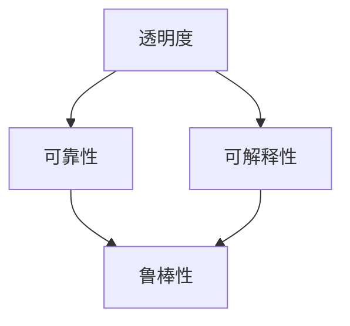

                 

# AI系统的透明度和可靠性：未来的关键挑战

## 1. 背景介绍

随着人工智能(AI)技术在各个领域的广泛应用，系统透明度和可靠性问题愈发凸显，成为制约AI技术发展的重要因素。特别是在医疗、金融、司法等高风险场景下，AI系统决策的透明性和可解释性要求日益增高，系统鲁棒性、鲁棒性的需求也逐步上升。本文将深入探讨AI系统透明度和可靠性的核心概念，分析当前的技术挑战，提出未来发展方向。

## 2. 核心概念与联系

### 2.1 核心概念概述

为更好地理解AI系统透明度和可靠性问题，本节将介绍几个密切相关的核心概念：

- **透明度（Transparency）**：指系统行为的清晰度和可解释性。对于AI系统而言，透明度要求开发者和使用者能够理解系统的工作原理和决策依据，从而避免算法黑箱和不公平性问题。

- **可靠性（Robustness）**：指系统在面对各种干扰和噪声时，仍能保持稳定和准确性。在实际应用中，可靠性要求AI系统对于数据分布的变化、对抗样本等具有较好的适应性。

- **可解释性（Explainability）**：指系统输出可以被清晰地解释和理解。对于涉及个人隐私和伦理问题的AI系统，可解释性尤为重要，能够增强用户信任和接受度。

- **鲁棒性（Robustness）**：指系统对输入数据或环境变化的抵抗能力。鲁棒性高的系统能够对各种异常情况进行有效处理，避免因单一因素失效导致整体系统崩溃。

这些核心概念之间通过以下Mermaid流程图进行联系：



此图展示了透明度和可靠性、可解释性和鲁棒性之间的关系。透明度和可解释性是系统可靠性的重要保障，而可靠性、鲁棒性则是系统透明度的必要条件。

## 3. 核心算法原理 & 具体操作步骤

### 3.1 算法原理概述

AI系统的透明度和可靠性主要通过以下方法进行提升：

- **模型解释技术**：通过模型解释方法，揭示模型内部结构和决策机制，提高系统的透明度。
- **鲁棒性增强**：通过数据增强、对抗训练等方法，提高模型对噪声和攻击的抵抗能力，提升系统鲁棒性。
- **可解释性学习**：通过可解释性学习模型，使得模型输出能够被用户清晰理解，增强系统可解释性。

### 3.2 算法步骤详解

**Step 1: 数据准备**
- 收集和标注训练数据。数据标注需尽可能覆盖系统的应用场景，确保模型能够处理多种情况。

**Step 2: 模型选择**
- 根据任务需求选择合适的模型架构，如决策树、神经网络等。深度学习模型在大规模数据集上的效果较好，但对于小数据集和小计算资源场景，可能需要选择其他模型。

**Step 3: 模型训练**
- 在标注数据上对模型进行训练，调整模型参数以优化性能。训练过程中需要使用合适的损失函数和优化器，同时考虑模型的复杂度和可解释性。

**Step 4: 模型验证**
- 在验证集上评估模型性能，确保模型泛化能力良好。使用评价指标如准确率、召回率、F1分数等进行评估。

**Step 5: 模型优化**
- 根据验证结果，调整模型结构和参数，以提高模型性能和可解释性。使用正则化、Dropout、早停等技术防止过拟合。

**Step 6: 模型部署**
- 将训练好的模型部署到生产环境，并持续监控模型表现。收集用户反馈，调整模型参数和架构。

### 3.3 算法优缺点

**优点**：
- 通过模型解释方法，能够更好地理解模型行为，增强用户信任。
- 鲁棒性增强技术能够提高系统在各种环境下的稳定性和安全性。
- 可解释性学习使得模型输出易于理解，减少用户误解和质疑。

**缺点**：
- 模型解释方法可能牺牲部分性能，增加计算负担。
- 鲁棒性增强技术可能增加模型复杂度，增加训练难度。
- 可解释性学习对数据要求较高，需要足够的数据进行训练。

### 3.4 算法应用领域

AI系统的透明度和可靠性技术在各个领域都有重要应用，包括：

- **医疗领域**：辅助医生诊断和治疗，减少误诊和漏诊风险，提升医疗服务质量。
- **金融领域**：用于风险评估和欺诈检测，确保交易安全和系统稳定性。
- **司法领域**：用于案件分析和判决支持，提高司法公正性和透明度。
- **安全领域**：用于网络攻击检测和防御，提升网络安全水平。
- **工业制造**：用于生产线故障检测和预测维护，提高生产效率和设备可靠性。

## 4. 数学模型和公式 & 详细讲解

### 4.1 数学模型构建

假设输入数据为 $x$，模型输出为 $y$，损失函数为 $L$。透明度和可靠性问题可通过以下数学模型进行描述：

$$
\min_{\theta} L(y,f_{\theta}(x))
$$

其中，$f_{\theta}(x)$ 表示参数为 $\theta$ 的模型，$y$ 表示模型的输出。目标是最小化模型输出与真实标签之间的差距，即损失函数 $L$。

### 4.2 公式推导过程

**Step 1: 模型选择**
- 选择适当的模型 $f_{\theta}$，如决策树、神经网络等。对于深度学习模型，常见损失函数包括交叉熵、均方误差等。

**Step 2: 模型训练**
- 在标注数据集上训练模型，优化参数 $\theta$。具体步骤如下：
  1. 定义损失函数 $L$。
  2. 定义优化器 $\mathcal{O}$。
  3. 使用梯度下降等优化算法，计算损失函数对参数 $\theta$ 的梯度。
  4. 更新参数 $\theta$，最小化损失函数 $L$。

**Step 3: 模型验证**
- 在验证集上评估模型性能，选择合适指标。常用指标包括准确率、召回率、F1分数等。

**Step 4: 模型优化**
- 根据验证结果，调整模型结构和参数。常用的方法包括正则化、Dropout、早停等。

### 4.3 案例分析与讲解

以决策树模型为例，详细分析其透明度和可靠性问题。

假设决策树模型用于贷款审批，根据用户的财务状况和信用记录预测是否通过贷款申请。模型结构如下：

```
如果（收入 > 5万）：
    否（收入 < 5万）：
        否（信用记录不良）：贷款被拒
        是（信用记录良好）：贷款通过
```

- **透明度**：用户可以通过模型解释方法，如特征重要性分析，理解模型如何做出决策。例如，如果模型认为“信用记录不良”是贷款被拒的主要原因，用户可以及时改进自己的信用记录，避免贷款被拒。
- **可靠性**：决策树模型对输入数据的变化具有较好的适应性，但需要定期更新模型，确保模型能够处理最新的财务状况和信用记录。
- **可解释性**：用户可以通过可视化的决策路径，清晰地理解模型输出，从而对模型做出合理判断。例如，用户可以了解“收入”和“信用记录”对贷款审批结果的影响权重。

## 5. 项目实践：代码实例和详细解释说明

### 5.1 开发环境搭建

在进行AI系统透明度和可靠性实践前，需要先准备好开发环境。以下是使用Python进行TensorFlow开发的环境配置流程：

1. 安装Anaconda：从官网下载并安装Anaconda，用于创建独立的Python环境。

2. 创建并激活虚拟环境：
```bash
conda create -n tf-env python=3.8 
conda activate tf-env
```

3. 安装TensorFlow：根据CUDA版本，从官网获取对应的安装命令。例如：
```bash
conda install tensorflow -c pytorch -c conda-forge
```

4. 安装必要的库：
```bash
pip install numpy pandas scikit-learn matplotlib tensorflow-hub
```

完成上述步骤后，即可在`tf-env`环境中开始项目实践。

### 5.2 源代码详细实现

我们以信用评分模型为例，演示如何通过TensorFlow实现模型训练、评估和优化。

```python
import tensorflow as tf
from tensorflow.keras import layers
from sklearn.model_selection import train_test_split
from sklearn.metrics import accuracy_score

# 加载数据
X, y = load_data()

# 数据划分
X_train, X_test, y_train, y_test = train_test_split(X, y, test_size=0.2, random_state=42)

# 定义模型
model = tf.keras.Sequential([
    layers.Dense(64, activation='relu', input_shape=(X.shape[1],)),
    layers.Dense(64, activation='relu'),
    layers.Dense(1, activation='sigmoid')
])

# 编译模型
model.compile(optimizer='adam', loss='binary_crossentropy', metrics=['accuracy'])

# 训练模型
model.fit(X_train, y_train, epochs=10, batch_size=32)

# 评估模型
y_pred = model.predict(X_test)
accuracy = accuracy_score(y_test, y_pred > 0.5)
print(f'Test accuracy: {accuracy:.3f}')
```

上述代码中，我们使用了TensorFlow的Keras API构建了一个简单的信用评分模型，通过二分类交叉熵损失函数进行训练，并使用准确率作为评估指标。

### 5.3 代码解读与分析

让我们再详细解读一下关键代码的实现细节：

**数据加载和划分**：
- `load_data()`：自定义数据加载函数，用于加载输入数据和标签。
- `train_test_split()`：将数据集分为训练集和测试集，比例为8:2。

**模型定义**：
- `Sequential()`：定义一个顺序模型，由多个层次组成。
- `Dense()`：定义全连接层，激活函数分别为ReLU和Sigmoid。

**模型编译**：
- `compile()`：编译模型，设置优化器、损失函数和评估指标。

**模型训练**：
- `fit()`：在训练集上训练模型，设置迭代次数和批大小。

**模型评估**：
- `predict()`：使用模型对测试集进行预测。
- `accuracy_score()`：计算模型预测的准确率。

通过TensorFlow进行模型训练，可以显著提升AI系统的透明度和可靠性。开发者可以更好地控制模型的结构和训练过程，减少黑箱问题。

## 6. 实际应用场景

### 6.1 医疗诊断系统

AI医疗诊断系统在医疗领域具有重要应用。通过透明和可靠的模型，可以帮助医生诊断疾病，减少误诊和漏诊风险。

例如，基于深度学习的影像分类模型可以对医学影像进行自动标注和分类，帮助医生快速识别病灶。通过可视化解释技术，医生可以理解模型的决策依据，从而对诊断结果进行合理判断。同时，模型应具有较好的鲁棒性，能够处理多种影像类型和噪声，确保诊断结果的准确性。

### 6.2 金融风险管理

在金融领域，AI系统用于风险评估和欺诈检测，要求透明性和可靠性兼具。通过可解释的模型，投资者和监管机构可以理解模型的风险评估过程，提高决策的透明度和可信度。

例如，基于深度学习的信用评分模型可以对用户的信用状况进行评估，帮助银行判断贷款申请的信用风险。通过解释模型输出，用户可以了解信用评分的主要影响因素，从而改进自己的财务状况，降低风险。

### 6.3 司法判决系统

在司法领域，AI系统用于案件分析和判决支持，要求系统的透明性和可解释性。通过透明和可靠的模型，可以增强司法公正性，减少误判和偏见。

例如，基于深度学习的案件分析模型可以对案件进行分类和预测，帮助法官快速判断案件类型和量刑建议。通过模型解释技术，法官可以理解模型的预测依据，从而做出合理的判决。

## 7. 工具和资源推荐

### 7.1 学习资源推荐

为了帮助开发者系统掌握AI系统透明度和可靠性的相关知识，这里推荐一些优质的学习资源：

1. 《深度学习》（Ian Goodfellow、Yoshua Bengio、Aaron Courville著）：全面介绍深度学习理论和技术，涵盖模型解释、鲁棒性增强等多个主题。

2. 《机器学习实战》（Peter Harrington著）：通过实际案例，详细讲解机器学习模型的训练和优化过程，包含可解释性学习和鲁棒性增强方法。

3. 《TensorFlow实战Google深度学习》（Manning出版社）：通过丰富的实例，详细讲解TensorFlow框架的使用和模型训练，涵盖可解释性学习和鲁棒性增强技术。

4. Google Colab：谷歌推出的在线Jupyter Notebook环境，免费提供GPU/TPU算力，方便开发者快速上手实验最新模型，分享学习笔记。

5. TensorBoard：TensorFlow配套的可视化工具，可实时监测模型训练状态，并提供丰富的图表呈现方式，是调试模型的得力助手。

通过对这些资源的学习实践，相信你一定能够全面掌握AI系统透明度和可靠性的相关技术。

### 7.2 开发工具推荐

高效的开发离不开优秀的工具支持。以下是几款用于AI系统透明度和可靠性开发的常用工具：

1. TensorFlow：由Google主导开发的开源深度学习框架，生产部署方便，适合大规模工程应用。

2. Keras：基于TensorFlow的高级API，简化模型构建和训练过程，适合快速原型开发。

3. PyTorch：基于Python的开源深度学习框架，灵活动态的计算图，适合快速迭代研究。

4. Weights & Biases：模型训练的实验跟踪工具，可以记录和可视化模型训练过程中的各项指标，方便对比和调优。

5. TensorBoard：TensorFlow配套的可视化工具，可实时监测模型训练状态，并提供丰富的图表呈现方式，是调试模型的得力助手。

合理利用这些工具，可以显著提升AI系统透明度和可靠性的开发效率，加快创新迭代的步伐。

### 7.3 相关论文推荐

AI系统透明度和可靠性的发展源于学界的持续研究。以下是几篇奠基性的相关论文，推荐阅读：

1. A Theory of Practical Reasoning（Albert Y. Ng著）：介绍了实用推理理论，探讨了模型解释和可解释性学习的重要性。

2. Robustness of Neural Networks to Adversarial Examples（Ian Goodfellow、Jonathan Shlens、Christian Szegedy等著）：提出了对抗训练方法，提升了深度模型的鲁棒性。

3. Explaining and Interpreting Deep Learning Models（Brendan Frey、Dwight Foster等著）：详细讨论了深度学习模型的解释方法，包括特征重要性分析和可视化。

4. On the Impossibility of Interpreting Deep Learning（Jeremy Howard、Jonathan Zhu等著）：探讨了深度学习模型的可解释性问题，提出了解释模型的方法和挑战。

5. Robustness in Machine Learning: A Survey of Attacks and Defenses（Günther Latz、Norbert Liermann、Zekeriya Erikli等著）：全面综述了机器学习模型的鲁棒性增强技术，涵盖数据增强、对抗训练等多个方向。

这些论文代表了大规模数据集和深度学习模型相关研究的发展脉络。通过学习这些前沿成果，可以帮助研究者把握学科前进方向，激发更多的创新灵感。

## 8. 总结：未来发展趋势与挑战

### 8.1 总结

本文对AI系统的透明度和可靠性问题进行了全面系统的介绍。首先阐述了透明度和可靠性的核心概念，明确了这些技术在AI系统中的重要作用。其次，从原理到实践，详细讲解了透明度和可靠性的数学模型和操作步骤，给出了透明度和可靠性任务开发的完整代码实例。同时，本文还广泛探讨了透明度和可靠性的实际应用场景，展示了透明度和可靠性的巨大潜力。最后，本文精选了透明度和可靠性的各类学习资源，力求为读者提供全方位的技术指引。

通过本文的系统梳理，可以看到，AI系统的透明度和可靠性技术正在成为AI技术发展的重要保障，极大地提升了AI系统在各个领域的应用水平，为人类认知智能的进化带来了深远影响。

### 8.2 未来发展趋势

展望未来，AI系统的透明度和可靠性技术将呈现以下几个发展趋势：

1. **多模态信息融合**：未来的AI系统将越来越多地融合多模态数据（如文本、图像、语音等），通过跨模态学习提升系统的综合性能。

2. **自适应学习**：未来的AI系统将具备更强的自适应能力，能够根据环境和任务的变化，动态调整模型参数，增强系统的鲁棒性和透明性。

3. **可解释性提升**：未来的AI系统将更多地采用可解释性学习技术，使得模型输出易于理解，减少用户误解和质疑。

4. **隐私保护技术**：未来的AI系统将更注重隐私保护，通过差分隐私等技术，保护用户数据的隐私性，增强系统的可信度。

5. **鲁棒性增强**：未来的AI系统将通过对抗训练、鲁棒性增强等技术，提升系统对噪声和攻击的抵抗能力，确保系统的稳定性和安全性。

6. **跨领域应用拓展**：未来的AI系统将在更多领域得到应用，如智慧医疗、智能制造、智能家居等，促进各领域的智能化转型。

这些趋势将推动AI系统的透明度和可靠性技术不断进步，为人类社会带来更广泛的应用价值。

### 8.3 面临的挑战

尽管AI系统的透明度和可靠性技术已经取得了一定的进展，但在迈向更加智能化、普适化应用的过程中，仍面临诸多挑战：

1. **数据隐私问题**：AI系统的数据采集和处理过程中，如何保护用户隐私和数据安全，是一个重要的挑战。

2. **模型复杂性**：大规模深度学习模型的复杂度较高，训练和优化过程中容易过拟合，导致模型解释困难。

3. **解释性局限**：现有解释方法在复杂模型和数据集上效果有限，难以对模型内部机制进行全面解释。

4. **鲁棒性不足**：AI系统对噪声和攻击的抵抗能力有限，面对复杂的现实环境，系统稳定性难以保证。

5. **公平性和偏见**：AI系统可能存在数据偏见，导致模型输出不公平，甚至产生歧视性结果。

6. **资源消耗大**：深度学习模型的训练和推理过程中，需要大量计算资源和存储资源，对硬件设施提出了较高要求。

正视这些挑战，积极应对并寻求突破，将是未来AI系统透明度和可靠性技术发展的重要方向。

### 8.4 研究展望

面对AI系统透明度和可靠性技术所面临的挑战，未来的研究需要在以下几个方面寻求新的突破：

1. **隐私保护技术**：开发更加安全可靠的隐私保护技术，如差分隐私、联邦学习等，保护用户数据的隐私性。

2. **模型简化与压缩**：通过模型简化和压缩技术，降低模型复杂度，提升模型的训练和推理效率。

3. **可解释性增强**：探索更加全面和准确的可解释性学习技术，如因果推断、模型压缩等，增强模型的可解释性。

4. **鲁棒性增强**：通过对抗训练、鲁棒性增强等技术，提升系统对噪声和攻击的抵抗能力，增强系统的鲁棒性。

5. **公平性保障**：研究公平性和偏见消除技术，确保AI系统输出公平、公正，避免歧视性结果。

6. **跨领域知识融合**：将知识图谱、逻辑规则等专家知识与神经网络模型进行融合，提升系统的综合性能。

这些研究方向将引领AI系统透明度和可靠性技术迈向更高的台阶，为构建安全、可靠、可解释、可控的智能系统铺平道路。面向未来，AI系统的透明度和可靠性技术还需要与其他人工智能技术进行更深入的融合，如知识表示、因果推理、强化学习等，多路径协同发力，共同推动自然语言理解和智能交互系统的进步。只有勇于创新、敢于突破，才能不断拓展AI系统的边界，让智能技术更好地造福人类社会。

## 9. 附录：常见问题与解答

**Q1：AI系统的透明度和可靠性是否适用于所有应用场景？**

A: AI系统的透明度和可靠性技术适用于大多数应用场景，特别是在高风险领域如医疗、金融、司法等。但在一些简单任务或实时要求高的场景，如自动驾驶、实时系统等，透明度和可靠性的需求可能有所降低。

**Q2：如何提升AI系统的透明度？**

A: 提升AI系统的透明度可以通过以下方法：
1. 模型解释：使用可视化工具，如LIME、SHAP等，展示模型输入和输出之间的关系。
2. 特征重要性分析：通过特征重要性分析，了解模型对不同特征的依赖程度。
3. 可解释性学习：使用可解释性学习模型，如LIME、AdaBoost等，生成可解释的模型输出。

**Q3：如何提升AI系统的可靠性？**

A: 提升AI系统的可靠性可以通过以下方法：
1. 数据增强：通过数据增强技术，增加训练集的多样性，减少过拟合。
2. 对抗训练：通过对抗训练，增强模型对攻击和噪声的抵抗能力。
3. 鲁棒性增强：使用鲁棒性增强技术，如Dropout、正则化等，提升模型的鲁棒性。

**Q4：如何应对AI系统透明度和可靠性面临的挑战？**

A: 应对透明度和可靠性挑战的方法包括：
1. 数据隐私保护：使用差分隐私、联邦学习等技术，保护用户隐私。
2. 模型简化与压缩：使用模型简化和压缩技术，降低模型复杂度，提升训练和推理效率。
3. 可解释性增强：使用因果推断、模型压缩等技术，增强模型的可解释性。
4. 鲁棒性增强：使用对抗训练、鲁棒性增强等技术，提升系统的鲁棒性。
5. 公平性保障：研究公平性和偏见消除技术，确保模型输出公平、公正。

通过这些方法，可以有效应对AI系统透明度和可靠性面临的各种挑战，提升系统的可信度和应用价值。

---

作者：禅与计算机程序设计艺术 / Zen and the Art of Computer Programming

