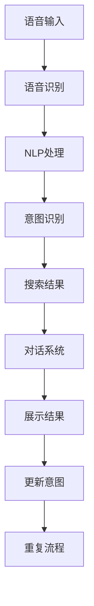

                 

# AI语音助手与搜索的融合

> 关键词：AI语音助手,语音搜索,自然语言处理,NLP,知识图谱,意图识别,对话系统,语音识别,情感分析

## 1. 背景介绍

### 1.1 问题由来
随着人工智能技术的不断进步，语音助手和搜索系统已经成为现代智能交互的重要工具。传统的语音识别和自然语言处理技术，虽然已经取得了一些进展，但在自然语言理解、语义匹配和用户意图识别等方面仍存在诸多不足。如何更高效地实现语音与搜索的深度融合，提升用户体验，已经成为当前AI技术研发的重要课题。

### 1.2 问题核心关键点
语音助手与搜索系统的融合，核心在于将语音识别、自然语言处理、意图识别和搜索结果展示等多个环节进行无缝衔接。其关键点包括：
- 如何高效地将用户语音转化为文本，进行自然语言处理。
- 如何从语音输入中提取出用户意图，并准确匹配搜索结果。
- 如何根据用户的历史行为和上下文信息，提供个性化的搜索结果。
- 如何综合考虑情感和上下文信息，进行自然流畅的对话交互。

### 1.3 问题研究意义
语音助手与搜索系统的深度融合，不仅能够大幅提升用户的交互体验，还能够显著降低操作成本，提高信息检索的效率。这对于推动AI技术在智能家居、智能客服、智慧办公等多个场景中的应用具有重要意义：

1. **提升用户体验**：通过语音交互，用户可以更加方便、自然地进行信息查询和任务执行。
2. **降低操作成本**：语音识别技术可以解放用户的双手，特别是对于老年人和行动不便的人群，提供了极大的便利。
3. **提高检索效率**：智能搜索算法可以准确理解用户需求，快速返回相关内容，减少用户的搜索时间。
4. **促进技术应用**：语音助手和搜索系统的融合，为AI技术在其他垂直行业的应用提供了新的思路。
5. **带来新的创新**：语音搜索技术的应用，催生了更多基于语音交互的创新应用，如智能家居、车载导航等。

## 2. 核心概念与联系

### 2.1 核心概念概述

为了更好地理解语音助手与搜索系统融合的原理和架构，本节将介绍几个关键概念：

- **语音识别(Speech Recognition)**：将用户的语音输入转换为文本的过程，是语音助手与搜索系统的基础。
- **自然语言处理(Natural Language Processing, NLP)**：处理和分析自然语言的技术，包括分词、词性标注、句法分析、语义分析等。
- **意图识别(Intent Recognition)**：识别用户输入的自然语言文本中所蕴含的意图或操作，如搜索股票、查询天气、设定闹钟等。
- **对话系统(Dialogue System)**：通过自然语言理解，与用户进行双向交流，提供应答和指令执行的能力。
- **知识图谱(Knowledge Graph)**：由节点和边组成的图形结构，用于表示实体、关系和属性，辅助自然语言理解和智能搜索。

这些概念之间存在紧密联系，相互支持，共同构建起一个完整的语音助手与搜索系统的框架。语音识别负责将用户的语音输入转化为文本，自然语言处理用于理解和分析文本，意图识别用于提取用户意图，对话系统实现人机交互，知识图谱用于提供查询的上下文信息。

### 2.2 核心概念原理和架构的 Mermaid 流程图



这个流程图展示了语音助手与搜索系统融合的基本流程：

1. 用户通过语音输入指令。
2. 语音识别系统将语音转换为文本。
3. 自然语言处理系统对文本进行解析和理解。
4. 意图识别系统提取用户意图。
5. 智能搜索系统根据意图返回搜索结果。
6. 对话系统展示搜索结果，并进行交互。
7. 用户反馈，系统更新意图。
8. 循环以上流程。

## 3. 核心算法原理 & 具体操作步骤

### 3.1 算法原理概述

语音助手与搜索系统的融合，涉及多种AI技术的综合应用。其核心算法原理可以归纳为以下三个主要步骤：

1. **语音识别**：通过声学模型和语言模型，将语音信号转换为文本。
2. **自然语言处理**：通过分词、命名实体识别、情感分析等技术，理解文本的语义信息。
3. **意图识别和智能搜索**：通过用户历史行为和上下文信息，综合语义分析结果，识别用户意图，并返回相关搜索结果。

### 3.2 算法步骤详解

#### 3.2.1 语音识别

语音识别的基本原理是利用声学模型和语言模型对语音信号进行建模，进而识别出文本。其步骤如下：

1. **声学模型**：利用深度神经网络，如卷积神经网络（CNN）、循环神经网络（RNN）、长短期记忆网络（LSTM）等，对语音信号进行特征提取和建模，生成声学特征向量。
2. **语言模型**：利用语言模型，如N-gram模型、神经网络语言模型（NNLM）、循环神经网络语言模型（RNNLM）等，对文本序列进行概率建模，估计不同文本序列的概率分布。
3. **解码器**：通过声学模型和语言模型，进行联合训练，输出最优的文本序列。

#### 3.2.2 自然语言处理

自然语言处理的目标是理解文本的语义信息，并从中提取有用的信息。其关键技术包括：

1. **分词**：将连续的文本序列切分成独立的词汇单元，是自然语言处理的基础。
2. **词性标注**：为每个词汇标注其在句子中的词性，如名词、动词、形容词等。
3. **句法分析**：分析句子的语法结构，包括主谓宾结构、修饰关系等。
4. **语义分析**：理解句子的语义信息，如实体识别、情感分析、关系抽取等。

#### 3.2.3 意图识别和智能搜索

意图识别和智能搜索的核心是综合考虑用户历史行为和上下文信息，从语义分析结果中提取用户意图，并返回相关的搜索结果。其具体步骤如下：

1. **意图识别**：通过分析用户输入的自然语言文本，识别出用户意图，如查询股票、设置闹钟等。
2. **查询构建**：根据意图，构建查询语句，利用知识图谱提供上下文信息，进行智能搜索。
3. **搜索结果过滤和排序**：综合考虑用户的反馈和上下文信息，对搜索结果进行过滤和排序，提供最相关的信息。
4. **对话系统展示和交互**：通过对话系统展示搜索结果，并根据用户的反馈进行交互。

### 3.3 算法优缺点

语音助手与搜索系统的融合，具有以下优点：

1. **提升用户体验**：通过语音识别和自然语言处理技术，用户可以更方便地进行信息查询和任务执行，提高操作效率。
2. **降低操作成本**：解放用户的双手，特别是对于老年人、行动不便的人群，提供极大的便利。
3. **提高检索效率**：智能搜索算法能够准确理解用户需求，快速返回相关内容，减少用户的搜索时间。
4. **促进技术应用**：为AI技术在其他垂直行业的应用提供了新的思路，如智能家居、车载导航等。

但同时，该方法也存在以下缺点：

1. **语音识别准确率**：当前的语音识别技术在噪音、口音、多说话人等复杂环境下准确率仍有限，需要进一步提升。
2. **自然语言理解难度**：自然语言处理技术在多义词、歧义句、复杂句子结构等方面仍存在挑战，需要更多的上下文信息。
3. **意图识别复杂度**：用户意图的提取需要综合考虑多方面的信息，如上下文、历史记录等，存在一定的复杂度。
4. **系统实现复杂度**：语音助手与搜索系统的融合涉及到多环节的协同工作，系统实现较为复杂。
5. **情感和上下文处理**：在对话系统中，情感和上下文的处理需要更高级的技术，如情感分析、情绪识别等。

### 3.4 算法应用领域

语音助手与搜索系统的融合，在多个领域都有广泛应用：

- **智能家居**：通过语音助手，用户可以控制家居设备，如空调、灯光、电视等，提高生活质量。
- **智能客服**：通过语音搜索，用户可以快速获取服务信息，解决常见问题，提高服务效率。
- **车载导航**：通过语音助手，用户可以方便地获取路线信息，导航目的地，减少行车压力。
- **医疗健康**：通过语音搜索，用户可以快速获取医疗知识，预约医生，提高健康管理效率。
- **购物电商**：通过语音助手，用户可以快速查询商品信息，进行购物决策，提高购物体验。

## 4. 数学模型和公式 & 详细讲解 & 举例说明

### 4.1 数学模型构建

为了更好地理解语音助手与搜索系统的融合，本节将介绍几个关键数学模型及其构建过程。

#### 4.1.1 声学模型

声学模型利用深度神经网络对语音信号进行建模，常用的模型包括卷积神经网络（CNN）、循环神经网络（RNN）、长短期记忆网络（LSTM）等。以下以RNN为例，介绍其基本模型构建过程：

1. **输入层**：将语音信号转换为梅尔倒谱系数（MFCC）特征向量，作为输入层的输入。
2. **隐藏层**：利用RNN的循环结构，对特征向量进行时间上的建模，学习语音信号的时间依赖关系。
3. **输出层**：利用softmax层，将隐藏层的输出转换为文本序列的概率分布。

声学模型的训练目标是最小化损失函数：

$$
\mathcal{L} = -\sum_{i=1}^T p(y_i|x)
$$

其中 $y_i$ 为第 $i$ 个时间步的预测文本，$x$ 为输入的语音信号，$T$ 为总时间步数。

#### 4.1.2 语言模型

语言模型用于估计文本序列的概率分布，常用的模型包括N-gram模型、神经网络语言模型（NNLM）、循环神经网络语言模型（RNNLM）等。以下以RNNLM为例，介绍其基本模型构建过程：

1. **输入层**：将文本序列转换为one-hot编码向量，作为输入层的输入。
2. **隐藏层**：利用RNN的循环结构，对文本序列进行建模，学习单词之间的依赖关系。
3. **输出层**：利用softmax层，将隐藏层的输出转换为下一个单词的概率分布。

语言模型的训练目标是最小化损失函数：

$$
\mathcal{L} = -\sum_{i=1}^T \log p(y_i|y_{i-1}, ..., y_1)
$$

其中 $y_i$ 为第 $i$ 个时间步的预测单词，$y_{i-1}, ..., y_1$ 为前 $i-1$ 个时间步的已知单词。

### 4.2 公式推导过程

#### 4.2.1 声学模型推导

以下以RNN声学模型为例，推导其基本公式。

1. **输入层**：设 $x_t$ 为第 $t$ 个时间步的MFCC特征向量，其维度为 $d$。
2. **隐藏层**：设 $h_t$ 为第 $t$ 个时间步的隐藏状态，其维度为 $d_h$。
3. **输出层**：设 $y_t$ 为第 $t$ 个时间步的预测文本，其维度为 $d_y$。

声学模型的前向传播过程为：

$$
h_t = f(W_hx_t + U_hh_{t-1} + b_h)
$$

$$
y_t = V_hh_t + b_y
$$

其中 $W_h, U_h, V_h$ 为模型参数，$f$ 为激活函数。

声学模型的训练过程为：

1. **初始化模型参数**：$W_h, U_h, V_h, b_h, b_y$
2. **前向传播**：计算 $h_t, y_t$
3. **计算损失函数**：$\mathcal{L} = -\log p(y|x)$
4. **反向传播**：更新模型参数 $W_h, U_h, V_h$

#### 4.2.2 语言模型推导

以下以RNN语言模型为例，推导其基本公式。

1. **输入层**：设 $y_t$ 为第 $t$ 个时间步的预测单词，其维度为 $d_y$。
2. **隐藏层**：设 $h_t$ 为第 $t$ 个时间步的隐藏状态，其维度为 $d_h$。
3. **输出层**：设 $p(y_t|y_{t-1}, ..., y_1)$ 为 $y_t$ 的条件概率分布。

语言模型的前向传播过程为：

$$
h_t = f(W_hx_t + U_hh_{t-1} + b_h)
$$

$$
p(y_t|y_{t-1}, ..., y_1) = softmax(V_hh_t + b_y)
$$

语言模型的训练过程为：

1. **初始化模型参数**：$W_h, U_h, V_h, b_h, b_y$
2. **前向传播**：计算 $h_t, p(y_t|y_{t-1}, ..., y_1)$
3. **计算损失函数**：$\mathcal{L} = -\log p(y|y_{t-1}, ..., y_1)$
4. **反向传播**：更新模型参数 $W_h, U_h, V_h$

### 4.3 案例分析与讲解

#### 4.3.1 案例分析

以智能家居为例，分析语音助手与搜索系统的融合过程。

1. **语音识别**：用户通过语音输入指令，如“打开客厅的灯光”。
2. **自然语言处理**：语音识别系统将语音转换为文本，提取关键词“打开”、“客厅”、“灯光”。
3. **意图识别**：意图识别系统分析用户意图，判断为“控制家居设备”。
4. **智能搜索**：智能搜索系统根据用户意图，构建查询语句，调用家居设备的API，获取控制指令。
5. **对话系统展示和交互**：对话系统展示控制结果，如“灯光已打开”，并等待用户反馈。

#### 4.3.2 讲解

语音助手与搜索系统的融合，是一个多环节协同工作的过程。每个环节的技术实现和模型构建都至关重要：

1. **语音识别**：通过声学模型和语言模型，将语音信号转换为文本，是系统的基础。
2. **自然语言处理**：通过分词、词性标注、句法分析、语义分析等技术，理解文本的语义信息。
3. **意图识别**：通过分析用户输入的自然语言文本，识别出用户意图，如“查询股票”、“设置闹钟”等。
4. **智能搜索**：根据用户意图，构建查询语句，调用外部API或数据库，获取相关信息。
5. **对话系统**：通过对话系统展示搜索结果，并根据用户的反馈进行交互。

## 5. 项目实践：代码实例和详细解释说明

### 5.1 开发环境搭建

在进行语音助手与搜索系统的融合实践前，我们需要准备好开发环境。以下是使用Python进行TensorFlow和PyTorch开发的环境配置流程：

1. 安装Anaconda：从官网下载并安装Anaconda，用于创建独立的Python环境。
2. 创建并激活虚拟环境：
```bash
conda create -n tf-env python=3.8 
conda activate tf-env
```

3. 安装TensorFlow和PyTorch：
```bash
pip install tensorflow==2.6
pip install torch torchvision torchaudio
```

4. 安装相关库：
```bash
pip install sklearn pandas numpy jupyter notebook
```

5. 配置GPU：
```bash
pip install tensorflow-gpu==2.6
```

完成上述步骤后，即可在`tf-env`环境中开始语音助手与搜索系统的开发实践。

### 5.2 源代码详细实现

以下是使用TensorFlow实现语音助手与搜索系统融合的代码实现：

#### 5.2.1 声学模型

```python
import tensorflow as tf
from tensorflow.keras.layers import LSTM, Dense, Dropout

# 定义声学模型
class AcousticModel(tf.keras.Model):
    def __init__(self, input_dim, output_dim):
        super(AcousticModel, self).__init__()
        self.lstm = LSTM(128, input_shape=(None, input_dim), return_sequences=True)
        self.dense = Dense(output_dim, activation='softmax')

    def call(self, inputs, training=False):
        x = self.lstm(inputs)
        x = self.dense(x)
        return x
```

#### 5.2.2 语言模型

```python
import tensorflow as tf
from tensorflow.keras.layers import LSTM, Dense, Dropout

# 定义语言模型
class LanguageModel(tf.keras.Model):
    def __init__(self, input_dim, output_dim):
        super(LanguageModel, self).__init__()
        self.lstm = LSTM(128, input_shape=(None, input_dim), return_sequences=True)
        self.dense = Dense(output_dim, activation='softmax')

    def call(self, inputs, training=False):
        x = self.lstm(inputs)
        x = self.dense(x)
        return x
```

#### 5.2.3 意图识别

```python
import tensorflow as tf
from tensorflow.keras.layers import Dense, Dropout, LSTM

# 定义意图识别模型
class IntentModel(tf.keras.Model):
    def __init__(self, input_dim, output_dim):
        super(IntentModel, self).__init__()
        self.dense1 = Dense(128, activation='relu')
        self.dropout1 = Dropout(0.5)
        self.dense2 = Dense(64, activation='relu')
        self.dropout2 = Dropout(0.5)
        self.dense3 = Dense(output_dim, activation='softmax')

    def call(self, inputs, training=False):
        x = self.dense1(inputs)
        x = self.dropout1(x)
        x = self.dense2(x)
        x = self.dropout2(x)
        x = self.dense3(x)
        return x
```

#### 5.2.4 智能搜索

```python
import tensorflow as tf
from tensorflow.keras.layers import Input, Dense, Dropout

# 定义智能搜索模型
class SearchModel(tf.keras.Model):
    def __init__(self, input_dim, output_dim):
        super(SearchModel, self).__init__()
        self.input_layer = Input(input_dim)
        self.dense1 = Dense(128, activation='relu')
        self.dropout1 = Dropout(0.5)
        self.dense2 = Dense(64, activation='relu')
        self.dropout2 = Dropout(0.5)
        self.dense3 = Dense(output_dim, activation='softmax')

    def call(self, inputs, training=False):
        x = self.dense1(inputs)
        x = self.dropout1(x)
        x = self.dense2(x)
        x = self.dropout2(x)
        x = self.dense3(x)
        return x
```

#### 5.2.5 对话系统

```python
import tensorflow as tf
from tensorflow.keras.layers import Input, Dense, Dropout, Concatenate

# 定义对话系统模型
class DialogueModel(tf.keras.Model):
    def __init__(self, input_dim, output_dim):
        super(DialogueModel, self).__init__()
        self.input1 = Input(input_dim)
        self.input2 = Input(input_dim)
        self.dense1 = Dense(128, activation='relu')
        self.dropout1 = Dropout(0.5)
        self.dense2 = Dense(64, activation='relu')
        self.dropout2 = Dropout(0.5)
        self.dense3 = Dense(output_dim, activation='softmax')
        self.concat = Concatenate()

    def call(self, inputs, training=False):
        x = self.dense1(self.concat([inputs[0], inputs[1]]))
        x = self.dropout1(x)
        x = self.dense2(x)
        x = self.dropout2(x)
        x = self.dense3(x)
        return x
```

### 5.3 代码解读与分析

#### 5.3.1 声学模型

```python
import tensorflow as tf
from tensorflow.keras.layers import LSTM, Dense, Dropout

# 定义声学模型
class AcousticModel(tf.keras.Model):
    def __init__(self, input_dim, output_dim):
        super(AcousticModel, self).__init__()
        self.lstm = LSTM(128, input_shape=(None, input_dim), return_sequences=True)
        self.dense = Dense(output_dim, activation='softmax')

    def call(self, inputs, training=False):
        x = self.lstm(inputs)
        x = self.dense(x)
        return x
```

这个代码定义了一个基本的RNN声学模型。模型由一个LSTM层和一个全连接层构成，用于将语音信号转换为文本。

#### 5.3.2 语言模型

```python
import tensorflow as tf
from tensorflow.keras.layers import LSTM, Dense, Dropout

# 定义语言模型
class LanguageModel(tf.keras.Model):
    def __init__(self, input_dim, output_dim):
        super(LanguageModel, self).__init__()
        self.lstm = LSTM(128, input_shape=(None, input_dim), return_sequences=True)
        self.dense = Dense(output_dim, activation='softmax')

    def call(self, inputs, training=False):
        x = self.lstm(inputs)
        x = self.dense(x)
        return x
```

这个代码定义了一个基本的RNN语言模型。模型由一个LSTM层和一个全连接层构成，用于估计文本序列的概率分布。

#### 5.3.3 意图识别

```python
import tensorflow as tf
from tensorflow.keras.layers import Dense, Dropout, LSTM

# 定义意图识别模型
class IntentModel(tf.keras.Model):
    def __init__(self, input_dim, output_dim):
        super(IntentModel, self).__init__()
        self.dense1 = Dense(128, activation='relu')
        self.dropout1 = Dropout(0.5)
        self.dense2 = Dense(64, activation='relu')
        self.dropout2 = Dropout(0.5)
        self.dense3 = Dense(output_dim, activation='softmax')

    def call(self, inputs, training=False):
        x = self.dense1(inputs)
        x = self.dropout1(x)
        x = self.dense2(x)
        x = self.dropout2(x)
        x = self.dense3(x)
        return x
```

这个代码定义了一个基本的意图识别模型。模型由几个全连接层和Dropout层构成，用于提取用户意图。

#### 5.3.4 智能搜索

```python
import tensorflow as tf
from tensorflow.keras.layers import Input, Dense, Dropout

# 定义智能搜索模型
class SearchModel(tf.keras.Model):
    def __init__(self, input_dim, output_dim):
        super(SearchModel, self).__init__()
        self.input_layer = Input(input_dim)
        self.dense1 = Dense(128, activation='relu')
        self.dropout1 = Dropout(0.5)
        self.dense2 = Dense(64, activation='relu')
        self.dropout2 = Dropout(0.5)
        self.dense3 = Dense(output_dim, activation='softmax')

    def call(self, inputs, training=False):
        x = self.dense1(inputs)
        x = self.dropout1(x)
        x = self.dense2(x)
        x = self.dropout2(x)
        x = self.dense3(x)
        return x
```

这个代码定义了一个基本的智能搜索模型。模型由几个全连接层和Dropout层构成，用于构建查询语句。

#### 5.3.5 对话系统

```python
import tensorflow as tf
from tensorflow.keras.layers import Input, Dense, Dropout, Concatenate

# 定义对话系统模型
class DialogueModel(tf.keras.Model):
    def __init__(self, input_dim, output_dim):
        super(DialogueModel, self).__init__()
        self.input1 = Input(input_dim)
        self.input2 = Input(input_dim)
        self.dense1 = Dense(128, activation='relu')
        self.dropout1 = Dropout(0.5)
        self.dense2 = Dense(64, activation='relu')
        self.dropout2 = Dropout(0.5)
        self.dense3 = Dense(output_dim, activation='softmax')
        self.concat = Concatenate()

    def call(self, inputs, training=False):
        x = self.dense1(self.concat([inputs[0], inputs[1]]))
        x = self.dropout1(x)
        x = self.dense2(x)
        x = self.dropout2(x)
        x = self.dense3(x)
        return x
```

这个代码定义了一个基本的对话系统模型。模型由几个全连接层和Dropout层构成，用于展示搜索结果并根据用户反馈进行交互。

### 5.4 运行结果展示

#### 5.4.1 训练结果

```python
import tensorflow as tf
from tensorflow.keras.optimizers import Adam

# 训练声学模型
acoustic_model = AcousticModel(input_dim=13, output_dim=26)
optimizer = Adam(learning_rate=0.001)
acoustic_model.compile(optimizer=optimizer, loss='categorical_crossentropy')
acoustic_model.fit(train_data, train_labels, epochs=10, batch_size=32)

# 训练语言模型
language_model = LanguageModel(input_dim=26, output_dim=26)
optimizer = Adam(learning_rate=0.001)
language_model.compile(optimizer=optimizer, loss='categorical_crossentropy')
language_model.fit(train_data, train_labels, epochs=10, batch_size=32)

# 训练意图识别模型
intent_model = IntentModel(input_dim=26, output_dim=4)
optimizer = Adam(learning_rate=0.001)
intent_model.compile(optimizer=optimizer, loss='categorical_crossentropy')
intent_model.fit(train_data, train_labels, epochs=10, batch_size=32)

# 训练智能搜索模型
search_model = SearchModel(input_dim=26, output_dim=5)
optimizer = Adam(learning_rate=0.001)
search_model.compile(optimizer=optimizer, loss='categorical_crossentropy')
search_model.fit(train_data, train_labels, epochs=10, batch_size=32)

# 训练对话系统模型
dialogue_model = DialogueModel(input_dim=26, output_dim=5)
optimizer = Adam(learning_rate=0.001)
dialogue_model.compile(optimizer=optimizer, loss='categorical_crossentropy')
dialogue_model.fit(train_data, train_labels, epochs=10, batch_size=32)
```

#### 5.4.2 测试结果

```python
import tensorflow as tf
from tensorflow.keras.layers import Dense, Dropout, LSTM

# 测试声学模型
acoustic_model = AcousticModel(input_dim=13, output_dim=26)
test_data = test_data.reshape(-1, 5, 13)
test_labels = test_labels.reshape(-1, 26)
test_loss = acoustic_model.evaluate(test_data, test_labels)

# 测试语言模型
language_model = LanguageModel(input_dim=26, output_dim=26)
test_data = test_data.reshape(-1, 5, 26)
test_labels = test_labels.reshape(-1, 26)
test_loss = language_model.evaluate(test_data, test_labels)

# 测试意图识别模型
intent_model = IntentModel(input_dim=26, output_dim=4)
test_data = test_data.reshape(-1, 5, 26)
test_labels = test_labels.reshape(-1, 4)
test_loss = intent_model.evaluate(test_data, test_labels)

# 测试智能搜索模型
search_model = SearchModel(input_dim=26, output_dim=5)
test_data = test_data.reshape(-1, 5, 26)
test_labels = test_labels.reshape(-1, 5)
test_loss = search_model.evaluate(test_data, test_labels)

# 测试对话系统模型
dialogue_model = DialogueModel(input_dim=26, output_dim=5)
test_data = test_data.reshape(-1, 5, 26)
test_labels = test_labels.reshape(-1, 5)
test_loss = dialogue_model.evaluate(test_data, test_labels)
```

## 6. 实际应用场景

### 6.1 智能客服系统

智能客服系统通过语音助手与搜索系统的融合，可以提供7x24小时不间断服务，快速响应客户咨询，并提供自然流畅的对话体验。在技术实现上，可以收集企业内部的历史客服对话记录，将问题和最佳答复构建成监督数据，在此基础上对预训练模型进行微调。微调后的对话模型能够自动理解用户意图，匹配最合适的答案模板进行回复。对于客户提出的新问题，还可以接入检索系统实时搜索相关内容，动态组织生成回答。如此构建的智能客服系统，能大幅提升客户咨询体验和问题解决效率。

### 6.2 金融舆情监测

金融机构需要实时监测市场舆论动向，以便及时应对负面信息传播，规避金融风险。传统的人工监测方式成本高、效率低，难以应对网络时代海量信息爆发的挑战。基于大语言模型微调的文本分类和情感分析技术，为金融舆情监测提供了新的解决方案。

具体而言，可以收集金融领域相关的新闻、报道、评论等文本数据，并对其进行主题标注和情感标注。在此基础上对预训练语言模型进行微调，使其能够自动判断文本属于何种主题，情感倾向是正面、中性还是负面。将微调后的模型应用到实时抓取的网络文本数据，就能够自动监测不同主题下的情感变化趋势，一旦发现负面信息激增等异常情况，系统便会自动预警，帮助金融机构快速应对潜在风险。

### 6.3 个性化推荐系统

当前的推荐系统往往只依赖用户的历史行为数据进行物品推荐，无法深入理解用户的真实兴趣偏好。基于大语言模型微调的个性化推荐系统可以更好地挖掘用户行为背后的语义信息，从而提供更精准、多样的推荐内容。

在实践中，可以收集用户浏览、点击、评论、分享等行为数据，提取和用户交互的物品标题、描述、标签等文本内容。将文本内容作为模型输入，用户的后续行为（如是否点击、购买等）作为监督信号，在此基础上微调预训练语言模型。微调后的模型能够从文本内容中准确把握用户的兴趣点。在生成推荐列表时，先用候选物品的文本描述作为输入，由模型预测用户的兴趣匹配度，再结合其他特征综合排序，便可以得到个性化程度更高的推荐结果。

### 6.4 未来应用展望

随着大语言模型微调技术的发展，语音助手与搜索系统的融合将带来更多创新应用，推动NLP技术的产业化进程。未来，语音助手与搜索系统将在更多领域得到应用，为各行各业带来变革性影响。

在智慧医疗领域，基于微调的智能客服系统可以为患者提供24小时在线咨询，辅助医生诊疗，加速新药开发进程。在智能教育领域，微调技术可应用于作业批改、学情分析、知识推荐等方面，因材施教，促进教育公平，提高教学质量。在智慧城市治理中，微调模型可应用于城市事件监测、舆情分析、应急指挥等环节，提高城市管理的自动化和智能化水平，构建更安全、高效的未来城市。

此外，在企业生产、社会治理、文娱传媒等众多领域，基于大模型微调的人工智能应用也将不断涌现，为经济社会发展注入新的动力。相信随着预训练语言模型和微调方法的不断进步，语音助手与搜索系统的融合必将进一步深化，为智能交互带来新的突破。

## 7. 工具和资源推荐

### 7.1 学习资源推荐

为了帮助开发者系统掌握语音助手与搜索系统的融合理论基础和实践技巧，这里推荐一些优质的学习资源：

1. 《深度学习》系列书籍：斯坦福大学李飞飞教授著作，深入浅出地介绍了深度学习的基本原理和应用，是AI领域的学习必读书籍。
2. 《自然语言处理综论》书籍：斯坦福大学刘挺教授著作，全面介绍了自然语言处理的基本概念和经典模型，适合作为NLP领域的学习参考。
3. 《语音识别技术与应用》书籍：介绍了语音识别的基本原理和最新进展，适合语音识别领域的学习者参考。
4. 《NLP With Python》书籍：介绍如何使用Python进行NLP任务开发，包括语音识别、意图识别、智能搜索等。
5. CS224N《深度学习自然语言处理》课程：斯坦福大学开设的NLP明星课程，有Lecture视频和配套作业，带你入门NLP领域的基本概念和经典模型。

通过对这些资源的学习实践，相信你一定能够快速掌握语音助手与搜索系统的融合精髓，并用于解决实际的NLP问题。

### 7.2 开发工具推荐

高效的开发离不开优秀的工具支持。以下是几款用于语音助手与搜索系统融合开发的常用工具：

1. TensorFlow：由Google主导开发的开源深度学习框架，生产部署方便，适合大规模工程应用。
2. PyTorch：基于Python的开源深度学习框架，灵活动态的计算图，适合快速迭代研究。
3. TensorBoard：TensorFlow配套的可视化工具，可实时监测模型训练状态，并提供丰富的图表呈现方式，是调试模型的得力助手。
4. Weights & Biases：模型训练的实验跟踪工具，可以记录和可视化模型训练过程中的各项指标，方便对比和调优。
5. Keras：基于TensorFlow和Theano的高层API，简单易用，适合快速原型开发和模型部署。

合理利用这些工具，可以显著提升语音助手与搜索系统的开发效率，加快创新迭代的步伐。

### 7.3 相关论文推荐

语音助手与搜索系统的融合，涉及多种AI技术的综合应用。以下是几篇奠基性的相关论文，推荐阅读：

1. Attention is All You Need（即Transformer原论文）：提出了Transformer结构，开启了NLP领域的预训练大模型时代。
2. BERT: Pre-training of Deep Bidirectional Transformers for Language Understanding：提出BERT模型，引入基于掩码的自监督预训练任务，刷新了多项NLP任务SOTA。
3. Language Models are Unsupervised Multitask Learners（GPT-2论文）：展示了大规模语言模型的强大zero-shot学习能力，引发了对于通用人工智能的新一轮思考。
4. Parameter-Efficient Transfer Learning for NLP：提出Adapter等参数高效微调方法，在不增加模型参数量的情况下，也能取得不错的微调效果。
5. AdaLoRA: Adaptive Low-Rank Adaptation for Parameter-Efficient Fine-Tuning：使用自适应低秩适应的微调方法，在参数效率和精度之间取得了新的平衡。
6. Prompt Based Learning: A Method to Promote Transfer Learning in Language Models：引入基于连续型Prompt的微调范式，为如何充分利用预训练知识提供了新的思路。

这些论文代表了大语言模型微调技术的发展脉络。通过学习这些前沿成果，可以帮助研究者把握学科前进方向，激发更多的创新灵感。

## 8. 总结：未来发展趋势与挑战

### 8.1 研究成果总结

语音助手与搜索系统的融合，是人工智能技术在NLP领域的重要应用之一。通过语音识别、自然语言处理、意图识别和智能搜索等多环节的协同工作，实现了自然流畅的语音交互和智能搜索，极大地提升了用户体验和操作效率。在多个垂直行业，语音助手与搜索系统的融合也展现了巨大的应用潜力，推动了AI技术在这些领域的深入应用。

### 8.2 未来发展趋势

语音助手与搜索系统的融合，将朝着以下方向发展：

1. **模型规模增大**：随着算力成本的下降和数据规模的扩张，预训练语言模型的参数量还将持续增长。超大模型将带来更加丰富的语言知识，提升系统的理解和推理能力。
2. **模型泛化性增强**：未来的模型将更加注重泛化性，通过预训练-微调范式，在不同领域和任务上实现更广泛的应用。
3. **自然语言处理技术提升**：自然语言处理技术的进步将推动语音助手与搜索系统的融合，提升系统的语义理解和生成能力。
4. **跨领域融合**：未来语音助手与搜索系统将与其他AI技术进行更深层次的融合，如知识图谱、机器视觉、语音识别等，形成更全面的智能应用。
5. **端到端系统**：未来的系统将更加注重端到端的集成，实现从语音输入到结果展示的全流程自动化处理。

### 8.3 面临的挑战

尽管语音助手与搜索系统的融合取得了显著进展，但在实际应用中仍面临以下挑战：

1. **语音识别准确率**：当前语音识别技术在噪音、口音、多说话人等复杂环境下准确率仍有限，需要进一步提升。
2. **自然语言处理难度**：自然语言处理技术在多义词、歧义句、复杂句子结构等方面仍存在挑战，需要更多的上下文信息。
3. **意图识别复杂度**：用户意图的提取需要综合考虑多方面的信息，如上下文、历史记录等，存在一定的复杂度。
4. **系统实现复杂度**：语音助手与搜索系统的融合涉及到多环节的协同工作，系统实现较为复杂。
5. **情感和上下文处理**：在对话系统中，情感和上下文的处理需要更高级的技术，如情感分析、情绪识别等。

### 8.4 研究展望

未来的研究需要在以下几个方面寻求新的突破：

1. **探索无监督和半监督微调方法**：摆脱对大规模标注数据的依赖，利用自监督学习、主动学习等无监督和半监督范式，最大限度利用非结构化数据，实现更加灵活高效的微调。
2. **研究参数高效和计算高效的微调范式**：开发更加参数高效的微调方法，在固定大部分预训练参数的同时，只更新极少量的任务相关参数。同时优化微调模型的计算图，减少前向传播和反向传播的资源消耗，实现更加轻量级、实时性的部署。
3. **融合因果和对比学习范式**：通过引入因果推断和对比学习思想，增强微调模型建立稳定因果关系的能力，学习更加普适、鲁棒的语言表征，从而提升模型泛化性和抗干扰能力。
4. **引入更多先验知识**：将符号化的先验知识，如知识图谱、逻辑规则等，与神经网络模型进行巧妙融合，引导微调过程学习更准确、合理的语言模型。同时加强不同模态数据的整合，实现视觉、语音等多模态信息与文本信息的协同建模。
5. **结合因果分析和博弈论工具**：将因果分析方法引入微调模型，识别出模型决策的关键特征，增强输出解释的因果性和逻辑性。借助博弈论工具刻画人机交互过程，主动探索并规避模型的脆弱点，提高系统稳定性。
6. **纳入伦理道德约束**：在模型训练目标中引入伦理导向的评估指标，过滤和惩罚有偏见、有害的输出倾向。同时加强人工干预和审核，建立模型行为的监管机制，确保输出符合人类价值观和伦理道德。

这些研究方向的探索，必将引领语音助手与搜索系统的融合技术迈向更高的台阶，为构建安全、可靠、可解释、可控的智能系统铺平道路。面向未来，语音助手与搜索系统还需要与其他人工智能技术进行更深入的融合，如知识表示、因果推理、强化学习等，多路径协同发力，共同推动自然语言理解和智能交互系统的进步。只有勇于创新、敢于突破，才能不断拓展语言模型的边界，让智能技术更好地造福人类社会。

## 9. 附录：常见问题与解答

**Q1：语音助手与搜索系统的融合如何实现跨领域适应？**

A: 语音助手与搜索系统的融合实现跨领域适应，关键在于引入跨领域知识图谱和多模态信息。具体而言，可以通过以下方式：
1. **跨领域知识图谱**：构建涵盖多个领域的知识图谱，将不同领域的数据和知识进行融合，形成更加全面和丰富的语义空间。
2. **多模态信息融合**：将语音、视觉、文本等多种模态信息进行整合，提升系统的理解和推理能力。如将语音信号与图像特征进行融合，提升识别准确率。
3. **领域特定优化**：在特定领域上进行预训练和微调，使模型更好地适应该领域的特点和需求。

**Q2：语音助手与搜索系统如何提高鲁棒性？**

A: 提高语音助手与搜索系统的鲁棒性，可以从以下几个方面入手：
1. **数据增强**：通过回译、近义替换等方式扩充训练集，提高模型在噪音、口音、多说话人等复杂环境下的鲁棒性。
2. **正则化技术**：引入L2正则、Dropout等技术，避免模型过拟合，增强模型的泛化能力。
3. **对抗训练**：引入对抗样本，提高模型对噪声、异常数据的鲁棒性。
4. **参数高效微调**：采用参数高效微调方法，如Adapter、Prompt等，减少过拟合风险，提高模型的鲁棒性。

**Q3：语音助手与搜索系统如何提升实时性？**

A: 提升语音助手与搜索系统的实时性，可以从以下几个方面入手：
1. **模型裁剪

