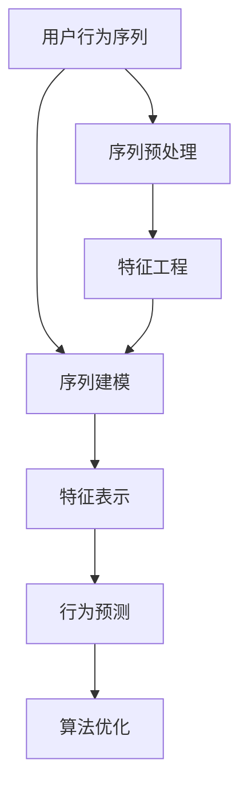

                 

# AI赋能的电商平台用户行为序列分析

## 1. 背景介绍

### 1.1 问题由来
随着电商平台的发展，用户行为数据量激增，如何高效分析用户行为序列，发现用户兴趣、偏好和潜在需求，成为电商平台提升用户体验、优化营销策略的关键。传统的数据挖掘方法如频次分析、聚类分析等在处理海量行为数据时效率较低，且难以捕捉用户行为的时序性特征。近年来，深度学习技术在序列数据分析中表现优异，特别是基于循环神经网络(RNN)、长短期记忆网络(LSTM)、门控循环单元(GRU)等模型的应用，使得电商平台能够对用户行为序列进行更加细致、深入的建模分析。

### 1.2 问题核心关键点
用户行为序列分析的本质是通过深度学习模型，自动发现并抽取用户行为序列中的重要特征，预测用户后续行为，提供个性化的推荐和营销服务。核心关键点在于：

- 序列建模：如何将用户行为序列转换为深度学习模型的输入，提取时序性特征。
- 特征表示：如何合理表示用户行为序列，捕捉用户兴趣、偏好等特征。
- 行为预测：如何利用模型预测用户未来行为，实现个性化推荐和营销。
- 算法优化：如何设计高效的算法，减少计算资源消耗，提高分析效率。

本文旨在系统阐述电商平台用户行为序列分析的核心技术和实际应用。首先介绍相关概念和架构，然后详细讲解序列建模、特征表示和行为预测的原理和步骤，最后通过代码实例展示具体的实现过程。

## 2. 核心概念与联系

### 2.1 核心概念概述

为了更好地理解电商平台用户行为序列分析的技术，本节将介绍几个关键概念：

- **用户行为序列**：用户在电商平台上的一系列操作行为，如浏览、点击、购买、评价等，构成了一个行为序列。
- **序列建模**：将用户行为序列作为时间序列，使用深度学习模型进行处理和分析。
- **特征表示**：通过编码用户行为序列，提取能够刻画用户兴趣、偏好、购买力等特征。
- **行为预测**：利用模型预测用户后续行为，实现个性化推荐和营销策略优化。
- **算法优化**：通过优化模型结构、训练策略等，提高模型性能和分析效率。

这些概念之间的逻辑关系可以通过以下Mermaid流程图来展示：



这个流程图展示了我文核心概念及其之间的联系：

1. 用户行为序列是分析的起点。
2. 通过序列建模，将用户行为序列转化为深度学习模型的输入。
3. 在特征表示阶段，抽取用户行为序列中的关键特征。
4. 行为预测是最终目标，通过模型预测用户后续行为。
5. 算法优化是过程手段，提高模型性能和分析效率。
6. 序列预处理和特征工程是关键步骤，确保数据输入的合理性。

## 3. 核心算法原理 & 具体操作步骤
### 3.1 算法原理概述

电商平台用户行为序列分析的核心算法基于序列建模，其中LSTM是最常用的深度学习模型之一。LSTM通过记忆单元和门控机制，能够较好地捕捉用户行为序列中的时序性特征，自动学习用户兴趣和行为的长期依赖关系。

具体而言，假设用户行为序列为 $\mathbf{X} = [x_1, x_2, \dots, x_n]$，其中 $x_t$ 表示第 $t$ 个时刻的行为。我们将用户行为序列输入到LSTM模型中，通过迭代计算，得到输出序列 $\mathbf{H} = [h_1, h_2, \dots, h_n]$，其中 $h_t$ 表示第 $t$ 个时刻的记忆单元输出。最后，我们将 $h_n$ 作为用户行为序列的特征表示，用于行为预测。

### 3.2 算法步骤详解

基于LSTM的用户行为序列分析包括以下关键步骤：

**Step 1: 数据预处理**
- 将用户行为序列转化为数字表示，通常采用独热编码(One-Hot Encoding)或嵌入向量化方式。
- 对行为序列进行归一化处理，以减少计算过程中的数值偏差。

**Step 2: 序列建模**
- 使用LSTM网络，将行为序列作为输入，得到记忆单元输出 $\mathbf{H}$。
- 可以选择多个LSTM层，或堆叠多个LSTM网络，以增强模型的表达能力。

**Step 3: 特征表示**
- 将LSTM的最后一层记忆单元输出 $h_n$ 作为用户行为序列的特征表示。
- 可以进一步进行降维处理，如主成分分析(PCA)、t-SNE等，增强特征的可解释性和泛化能力。

**Step 4: 行为预测**
- 使用全连接神经网络或其他分类/回归模型，对用户行为序列的特征表示进行预测。
- 可以使用交叉熵损失或均方误差损失作为预测模型的损失函数。

**Step 5: 算法优化**
- 使用优化算法如Adam、SGD等，最小化损失函数。
- 采用正则化技术如L2正则化、Dropout等，避免模型过拟合。
- 考虑使用对抗样本或数据增强技术，提高模型的鲁棒性和泛化能力。

### 3.3 算法优缺点

基于LSTM的用户行为序列分析具有以下优点：

- 能够自动捕捉用户行为序列的时序性特征，刻画用户兴趣和行为的长短期依赖关系。
- 模型表达能力较强，可以适应复杂的用户行为模式。
- 在电商推荐系统中，可以提供精准的个性化推荐和营销策略。

同时，该算法也存在一些局限性：

- 计算资源消耗较大，特别是在序列较长时，计算时间会显著增加。
- 模型较为复杂，难以解释模型内部的决策机制，难以进行模型诊断和调优。
- 对数据质量要求较高，需要高质量的行为序列数据。

### 3.4 算法应用领域

基于LSTM的电商平台用户行为序列分析，已经广泛应用于以下几个领域：

- 个性化推荐系统：通过分析用户行为序列，提供精准的商品推荐。
- 用户行为预测：预测用户未来的购买行为，优化库存管理。
- 用户细分：基于用户行为序列，进行用户兴趣和行为特征的聚类分析。
- 营销策略优化：通过分析用户行为序列，优化广告投放和营销策略。
- 实时个性化推荐：在用户进行实时行为时，实时预测并提供个性化推荐。

除了电商领域，基于LSTM的序列分析在社交媒体分析、金融交易分析、医疗诊断等领域也有广泛的应用前景。

## 4. 数学模型和公式 & 详细讲解  
### 4.1 数学模型构建

LSTM模型是一种特殊的RNN网络，其核心思想是通过门控机制，控制信息在时间步中的流动。LSTM通过三个门：输入门、遗忘门和输出门，来控制信息的输入、删除和输出。

记用户行为序列 $\mathbf{X} = [x_1, x_2, \dots, x_n]$，其中 $x_t$ 表示第 $t$ 个时刻的行为。LSTM模型的记忆单元状态为 $\mathbf{h} = [h_1, h_2, \dots, h_n]$，每个记忆单元的状态更新如下：

$$
h_t = f_{ctg}(W_{ctg} \mathbf{X}_t + U_{ctg} h_{t-1}) \circ \sigma(W_{ctg} \mathbf{X}_t + U_{ctg} h_{t-1})
$$

其中，$\mathbf{X}_t$ 表示第 $t$ 个时刻的行为输入，$h_{t-1}$ 表示第 $t-1$ 个时刻的记忆单元状态，$f_{ctg}$ 表示激活函数，$\circ$ 表示元素级乘法。

LSTM模型的输出为：

$$
\hat{y}_t = f_{out}(W_{out} h_t + b_{out})
$$

其中，$W_{out}$ 和 $b_{out}$ 分别为全连接神经网络的权重和偏置项。

### 4.2 公式推导过程

以二分类任务为例，LSTM模型的预测输出可以表示为：

$$
\hat{y}_t = \sigma(W_{out} h_t + b_{out})
$$

其中，$W_{out}$ 和 $b_{out}$ 分别为全连接神经网络的权重和偏置项，$\sigma$ 为Sigmoid激活函数。

对于预测损失函数，我们通常采用二分类交叉熵损失：

$$
L = -\frac{1}{N} \sum_{i=1}^N \ell(y_i, \hat{y}_i)
$$

其中，$y_i$ 表示第 $i$ 个时刻的真实标签，$\hat{y}_i$ 表示模型预测输出，$N$ 表示样本数量，$\ell$ 表示交叉熵损失函数。

为了优化模型，通常采用反向传播算法计算损失函数对参数的梯度，并通过优化算法（如Adam、SGD等）最小化损失函数。

### 4.3 案例分析与讲解

以电商平台的用户行为序列分析为例，假设用户的行为序列为 $\mathbf{X} = [b_1, c_2, a_3, b_4, a_5, c_6, a_7]$，其中 $b$ 表示浏览，$c$ 表示点击，$a$ 表示购买。我们希望预测用户下一步的行为。

将用户行为序列输入LSTM模型，得到记忆单元状态 $\mathbf{h} = [h_1, h_2, \dots, h_7]$。通过计算得到最后一层记忆单元的输出 $h_7$，作为用户行为序列的特征表示。

使用全连接神经网络对特征表示进行预测，得到预测输出 $\hat{y}_8$。根据预测结果，可以决定是否为用户推荐相关商品。

## 5. 项目实践：代码实例和详细解释说明
### 5.1 开发环境搭建

在进行用户行为序列分析的实践前，我们需要准备好开发环境。以下是使用Python进行PyTorch开发的环境配置流程：

1. 安装Anaconda：从官网下载并安装Anaconda，用于创建独立的Python环境。

2. 创建并激活虚拟环境：
```bash
conda create -n pytorch-env python=3.8 
conda activate pytorch-env
```

3. 安装PyTorch：根据CUDA版本，从官网获取对应的安装命令。例如：
```bash
conda install pytorch torchvision torchaudio cudatoolkit=11.1 -c pytorch -c conda-forge
```

4. 安装Tensorflow：
```bash
conda install tensorflow
```

5. 安装各类工具包：
```bash
pip install numpy pandas scikit-learn matplotlib tqdm jupyter notebook ipython
```

完成上述步骤后，即可在`pytorch-env`环境中开始实践。

### 5.2 源代码详细实现

下面我们以电商平台的用户行为序列分析为例，给出使用PyTorch的LSTM模型实现代码。

首先，定义用户行为序列的预处理函数：

```python
import torch
import torch.nn as nn
import torch.optim as optim

# 定义独热编码函数
def one_hot_encode(x):
    encoded = torch.zeros(len(x), max(x)+1)
    encoded.scatter_(1, x.unsqueeze(1), 1)
    return encoded

# 定义用户行为序列预处理函数
def preprocess_data(X):
    X_encoded = one_hot_encode(X)
    X_normalized = X_encoded / X_encoded.sum(1, keepdim=True)
    return X_normalized
```

然后，定义LSTM模型的类：

```python
class LSTM(nn.Module):
    def __init__(self, input_size, hidden_size, output_size):
        super(LSTM, self).__init__()
        self.hidden_size = hidden_size
        self.lstm = nn.LSTM(input_size, hidden_size, batch_first=True)
        self.fc = nn.Linear(hidden_size, output_size)
    
    def forward(self, X, h_0=None):
        batch_size = X.size(0)
        sequence_length = X.size(1)
        h_0 = (torch.zeros(batch_size, self.hidden_size).to(X.device), torch.zeros(batch_size, self.hidden_size).to(X.device))
        
        X, (h_n, c_n) = self.lstm(X, h_0)
        h_n = h_n[-1]
        y_hat = self.fc(h_n)
        
        return y_hat
```

接着，定义损失函数和优化器：

```python
# 定义交叉熵损失函数
def binary_cross_entropy(y_hat, y):
    return nn.BCELoss()(y_hat, y)
    
# 定义Adam优化器
optimizer = optim.Adam(model.parameters(), lr=0.001)
```

最后，定义训练和评估函数：

```python
# 定义训练函数
def train(model, X_train, y_train, num_epochs):
    for epoch in range(num_epochs):
        model.train()
        optimizer.zero_grad()
        y_hat = model(X_train, None)
        loss = binary_cross_entropy(y_hat, y_train)
        loss.backward()
        optimizer.step()
    
    return loss.item()

# 定义评估函数
def evaluate(model, X_test, y_test):
    model.eval()
    y_hat = model(X_test, None)
    loss = binary_cross_entropy(y_hat, y_test)
    return loss.item()
```

使用上述代码，即可对电商平台的用户行为序列进行分析。

### 5.3 代码解读与分析

让我们再详细解读一下关键代码的实现细节：

**LSTM模型类**：
- `__init__`方法：定义LSTM模型结构，包括输入、隐藏和输出层。
- `forward`方法：定义前向传播过程，通过LSTM计算记忆单元输出，再通过全连接层进行预测。

**独热编码函数和数据预处理函数**：
- 独热编码函数将用户行为序列转化为独热向量，方便输入LSTM模型。
- 数据预处理函数对行为序列进行归一化处理，减小数值偏差，增强模型训练效果。

**损失函数和优化器**：
- 定义交叉熵损失函数，用于计算预测输出与真实标签之间的差异。
- 定义Adam优化器，用于最小化损失函数，更新模型参数。

**训练和评估函数**：
- 训练函数将模型置于训练模式，计算损失函数并进行反向传播，更新模型参数。
- 评估函数将模型置于评估模式，计算预测输出与真实标签之间的损失，返回模型性能。

通过上述代码，可以有效地实现基于LSTM的电商平台用户行为序列分析。

## 6. 实际应用场景

### 6.1 智能推荐系统

基于LSTM的电商平台用户行为序列分析，可以应用于智能推荐系统的构建。推荐系统通过分析用户的行为序列，自动发现用户兴趣，并提供个性化的商品推荐。

在实践中，可以将用户的历史浏览、点击、购买等行为数据作为输入，使用LSTM模型进行序列建模，提取用户行为序列中的关键特征。然后，将这些特征作为输入，使用分类或回归模型进行推荐。根据推荐结果，生成推荐列表，实时展示给用户。

### 6.2 用户行为预测

用户行为预测是电商平台个性化营销的重要组成部分。通过分析用户的行为序列，可以预测用户的后续行为，如是否购买某商品、是否流失等。

在预测过程中，将用户的历史行为序列作为输入，使用LSTM模型进行序列建模。然后，通过分类或回归模型，预测用户未来的行为。根据预测结果，提前采取相应的营销策略，如促销活动、优惠券等，提升用户转化率。

### 6.3 用户行为分析

电商平台需要对用户行为进行分析，了解用户行为模式和趋势，优化产品设计和营销策略。通过LSTM模型对用户行为序列进行分析，可以发现用户的行为特征，如购买频率、偏好时间等。

具体而言，将用户的行为序列输入LSTM模型，得到记忆单元输出。然后，通过降维处理（如PCA、t-SNE等），提取用户行为序列的关键特征。最后，利用聚类算法对用户进行分类，了解不同用户群体的行为模式，为产品设计和营销策略提供数据支持。

### 6.4 未来应用展望

随着深度学习技术的发展，基于LSTM的电商平台用户行为序列分析将迎来更多应用。

- 在推荐系统中，通过引入多模态数据，如文本、图像、视频等，增强推荐系统的表现。
- 在用户行为预测中，通过引入时间序列分析、因果推断等技术，提高预测精度和稳定性。
- 在用户行为分析中，通过引入图神经网络、生成对抗网络等技术，实现更深入的行为建模和分析。

## 7. 工具和资源推荐
### 7.1 学习资源推荐

为了帮助开发者系统掌握基于LSTM的电商平台用户行为序列分析的理论基础和实践技巧，这里推荐一些优质的学习资源：

1. 《深度学习入门》系列书籍：由AI社区知名作者撰写，系统介绍了深度学习的基本概念和算法原理，适合入门学习。
2. 《TensorFlow实战Google深度学习框架》书籍：由Google官方编写，详细介绍了TensorFlow的使用方法和案例实践，适合中高级开发者。
3. 《自然语言处理实战》书籍：由自然语言处理领域的权威人士编写，介绍了NLP领域的经典算法和模型，适合从事NLP开发的人员。
4. Coursera《深度学习》课程：由斯坦福大学教授吴恩达主讲，系统介绍了深度学习的基本概念和算法原理，适合入门学习。
5. Kaggle深度学习竞赛：通过参与Kaggle竞赛，实战练习深度学习技术，提升算法能力。

通过对这些资源的学习实践，相信你一定能够快速掌握基于LSTM的电商平台用户行为序列分析的精髓，并用于解决实际的NLP问题。

### 7.2 开发工具推荐

高效的开发离不开优秀的工具支持。以下是几款用于深度学习开发的常用工具：

1. PyTorch：基于Python的开源深度学习框架，灵活动态的计算图，适合快速迭代研究。主流的深度学习模型均有PyTorch版本的实现。
2. TensorFlow：由Google主导开发的开源深度学习框架，生产部署方便，适合大规模工程应用。同样有丰富的深度学习模型资源。
3. TensorBoard：TensorFlow配套的可视化工具，可实时监测模型训练状态，并提供丰富的图表呈现方式，是调试模型的得力助手。
4. Weights & Biases：模型训练的实验跟踪工具，可以记录和可视化模型训练过程中的各项指标，方便对比和调优。与主流深度学习框架无缝集成。
5. Keras：基于TensorFlow等后端的高层深度学习框架，简单易用，适合快速构建深度学习模型。

合理利用这些工具，可以显著提升深度学习模型的开发效率，加快创新迭代的步伐。

### 7.3 相关论文推荐

深度学习技术的发展源于学界的持续研究。以下是几篇奠基性的相关论文，推荐阅读：

1. Long Short-Term Memory（LSTM论文）：提出了LSTM结构，引入了门控机制，能够有效处理序列数据。
2. Bidirectional LSTM（BiLSTM论文）：提出双向LSTM结构，进一步提升模型对序列数据的建模能力。
3. Attention Mechanism（Attention论文）：引入了注意力机制，提升模型的时序依赖关系捕捉能力。
4. Capsule Network（CapsNet论文）：提出胶囊网络，提升模型对复杂结构的建模能力。
5. Transformer（Transformer论文）：提出Transformer结构，提升模型对序列数据的建模能力，适用于大规模语言模型。

这些论文代表了大模型微调技术的发展脉络。通过学习这些前沿成果，可以帮助研究者把握学科前进方向，激发更多的创新灵感。

## 8. 总结：未来发展趋势与挑战

### 8.1 总结

本文对基于LSTM的电商平台用户行为序列分析方法进行了全面系统的介绍。首先阐述了用户行为序列分析的研究背景和意义，明确了LSTM模型在序列建模中的独特价值。其次，从原理到实践，详细讲解了LSTM模型的构建、特征表示和行为预测的原理和步骤，给出了完整的代码实现。同时，本文还广泛探讨了LSTM模型在智能推荐、用户行为预测、用户行为分析等电商领域的实际应用。

通过本文的系统梳理，可以看到，基于LSTM的电商平台用户行为序列分析方法在提升电商平台的个性化推荐和营销策略优化中发挥了重要作用。未来，伴随深度学习技术的发展，该方法将在更多领域得到应用，为人工智能技术落地提供新的解决方案。

### 8.2 未来发展趋势

展望未来，基于LSTM的电商平台用户行为序列分析将呈现以下几个发展趋势：

1. 多模态融合：将文本、图像、视频等多模态数据进行融合，提升推荐系统的表现。
2. 因果推断：通过引入因果推断思想，提升用户行为预测的精度和稳定性。
3. 自适应学习：引入自适应学习机制，根据用户行为序列自动调整模型参数，提升模型泛化能力。
4. 生成对抗网络：引入生成对抗网络，提升用户行为分析的深度和广度。
5. 知识图谱：将用户行为序列与知识图谱进行融合，提升推荐系统的表现。

以上趋势凸显了基于LSTM的用户行为序列分析技术的广阔前景。这些方向的探索发展，必将进一步提升推荐系统的性能和用户体验，带来更多的应用场景。

### 8.3 面临的挑战

尽管基于LSTM的用户行为序列分析技术已经取得了瞩目成就，但在迈向更加智能化、普适化应用的过程中，它仍面临着诸多挑战：

1. 计算资源消耗较大。LSTM模型较为复杂，需要较大的计算资源和时间。如何在计算资源有限的情况下，提高模型的训练效率，是一个重要挑战。
2. 模型可解释性不足。LSTM模型较为复杂，难以解释模型内部的决策机制，难以进行模型诊断和调优。
3. 数据质量要求较高。用户行为序列数据可能存在缺失、噪声等问题，数据质量对模型效果有重要影响。如何处理和清洗数据，是一个重要问题。
4. 模型泛化能力不足。LSTM模型可能对新数据的泛化能力较差，容易发生过拟合。如何提高模型的泛化能力，是一个重要问题。

### 8.4 研究展望

面对基于LSTM的用户行为序列分析所面临的挑战，未来的研究需要在以下几个方面寻求新的突破：

1. 模型优化：设计更高效的LSTM模型，如轻量级LSTM、门控循环单元(GRU)等，提升模型训练效率。
2. 模型压缩：通过模型压缩、量化等技术，减小模型规模，提高计算效率。
3. 自适应学习：引入自适应学习机制，根据用户行为序列自动调整模型参数，提升模型泛化能力。
4. 知识图谱：将用户行为序列与知识图谱进行融合，提升推荐系统的表现。
5. 生成对抗网络：引入生成对抗网络，提升用户行为分析的深度和广度。

这些研究方向的探索，必将引领LSTM模型在电商推荐、用户行为分析等领域的深入应用，带来更多的创新和突破。

## 9. 附录：常见问题与解答

**Q1：LSTM模型在电商推荐系统中有哪些应用？**

A: LSTM模型在电商推荐系统中主要有以下应用：

1. 个性化推荐：通过分析用户行为序列，提供个性化的商品推荐。
2. 用户行为预测：预测用户未来的购买行为，优化库存管理。
3. 用户行为分析：分析用户行为模式和趋势，优化产品设计和营销策略。

**Q2：如何提高LSTM模型的训练效率？**

A: 提高LSTM模型训练效率的方法包括：

1. 模型优化：设计更高效的LSTM模型，如轻量级LSTM、门控循环单元(GRU)等。
2. 模型压缩：通过模型压缩、量化等技术，减小模型规模，提高计算效率。
3. 并行计算：使用多GPU、分布式训练等技术，加快模型训练速度。

**Q3：LSTM模型在电商推荐系统中有哪些局限性？**

A: LSTM模型在电商推荐系统中的局限性包括：

1. 计算资源消耗较大。LSTM模型较为复杂，需要较大的计算资源和时间。
2. 模型可解释性不足。LSTM模型较为复杂，难以解释模型内部的决策机制。
3. 数据质量要求较高。用户行为序列数据可能存在缺失、噪声等问题，数据质量对模型效果有重要影响。
4. 模型泛化能力不足。LSTM模型可能对新数据的泛化能力较差，容易发生过拟合。

**Q4：LSTM模型如何处理用户行为序列缺失问题？**

A: LSTM模型处理用户行为序列缺失问题的方法包括：

1. 数据插补：使用均值、中值、众数等方法，对缺失数据进行插补。
2. 时间戳对齐：通过时间戳对齐，将缺失的数据补齐。
3. 模型预测：使用预测模型，对缺失数据进行预测，填充缺失部分。

**Q5：如何提高LSTM模型的泛化能力？**

A: 提高LSTM模型泛化能力的方法包括：

1. 数据增强：通过数据增强技术，增加训练数据的数量和多样性。
2. 正则化：使用L2正则、Dropout等技术，避免模型过拟合。
3. 多模型集成：训练多个LSTM模型，取平均输出，抑制过拟合。
4. 自适应学习：引入自适应学习机制，根据用户行为序列自动调整模型参数，提升模型泛化能力。

这些方法可以有效地提高LSTM模型的泛化能力和训练效率，提升模型的实际应用效果。

