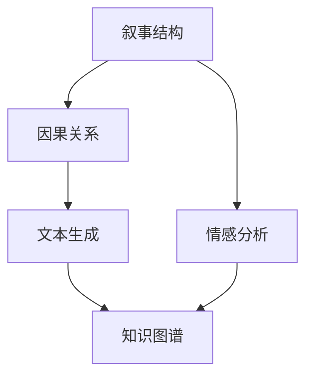

                 

# AI辅助剧情分析：深入理解叙事结构

## 1. 背景介绍

### 1.1 问题由来

随着AI技术的迅猛发展，其在文本分析、自然语言处理(NLP)等领域的应用逐渐深入。其中，剧情分析作为NLP中的一个重要分支，旨在通过机器学习模型自动分析和理解文本中的叙事结构，为影视、文学创作、故事策划等提供智能化支持。

然而，现有的剧情分析方法大多依赖手工设计的特征提取和规则构建，难以应对大规模、复杂多变的文本数据。为此，我们引入人工智能(AI)技术，特别是基于深度学习的模型，以期实现更高效、准确、可扩展的剧情分析。

### 1.2 问题核心关键点

AI辅助剧情分析的核心在于如何高效地捕捉和理解文本中的叙事元素，包括情节、角色、对话、背景等。这些元素不仅影响着文本的整体结构，还关系到故事情节的发展和人物性格的塑造。基于深度学习的模型能够自动识别和提取这些元素，从而帮助创作者在创作过程中获得更好的指导和灵感。

主要包括以下几个方面：
1. **情节线索**：自动识别文本中的情节线索，如起始事件、转折点、结局等，用于构建故事情节的基本框架。
2. **角色设置**：自动识别文本中主要和次要角色，以及他们的对话、行为等，以帮助塑造角色形象。
3. **对话分析**：分析文本中的对话内容，识别对话中的情感和目的，用于推动情节发展。
4. **背景环境**：自动识别文本中的背景环境，如时间、地点、文化背景等，为创作者提供情境支持。

### 1.3 问题研究意义

AI辅助剧情分析具有以下几方面的重要意义：

1. **提升创作效率**：自动化的剧情分析工具可以大幅降低文本分析的工作量，使创作者能够将更多精力投入到创作本身，提高创作效率。
2. **提供创作灵感**：通过识别文本中的关键元素和情感，AI辅助工具可以激发创作者的创作灵感，提供新的故事线索和角色设置。
3. **改善用户体验**：在影视、游戏等媒体产品中，AI辅助剧情分析可以提升内容的连贯性和逻辑性，提升用户体验。
4. **促进教育培训**：在文学创作、编剧等专业培训中，AI辅助剧情分析工具可以帮助学习者更好地理解叙事结构和创作技巧。

## 2. 核心概念与联系

### 2.1 核心概念概述

为了更好地理解AI辅助剧情分析，本节将介绍几个关键概念及其联系：

1. **叙事结构**：指文本中的情节、角色、对话等元素，构成了文本的基本框架和内容。
2. **情感分析**：通过文本分析识别文本中的情感倾向，用于推动情节发展和角色性格塑造。
3. **因果关系**：识别文本中事件之间的因果关系，用于理解情节发展逻辑和人物关系。
4. **文本生成**：基于文本分析和生成的技术，AI可以自动生成文本内容，进一步提升创作效率。
5. **知识图谱**：构建文本中的实体关系图，用于理解文本中的背景环境和人物关系。

这些概念之间的逻辑关系可以通过以下Mermaid流程图来展示：



这个流程图展示了大语言模型中的核心概念及其之间的关系：

1. 叙事结构是文本分析的基础，情感分析、因果关系和文本生成等都是基于此构建的。
2. 情感分析用于识别文本中的情感倾向，推动情节发展。
3. 因果关系用于理解事件之间的逻辑关系，帮助创作者构建情节。
4. 文本生成可以基于叙事结构和情感分析结果，自动生成新的文本内容。
5. 知识图谱用于构建文本中的实体关系，理解背景环境和人物关系。

这些概念共同构成了AI辅助剧情分析的理论基础，使得机器能够理解和生成文本内容，提升创作效率和质量。

## 3. 核心算法原理 & 具体操作步骤

### 3.1 算法原理概述

AI辅助剧情分析的核心算法原理主要包括深度学习中的文本表示学习和叙事结构识别。文本表示学习旨在将文本转化为易于机器处理的向量表示，而叙事结构识别则是在文本表示的基础上，自动识别文本中的关键元素和情节线索。

具体而言，AI辅助剧情分析流程如下：

1. **文本表示学习**：通过深度学习模型将文本转化为高维向量表示。
2. **叙事结构识别**：在文本表示的基础上，自动识别文本中的情节线索、角色设置、对话内容和背景环境等。
3. **情感分析**：分析文本中的情感倾向，用于推动情节发展和角色性格塑造。
4. **因果关系识别**：识别文本中的事件关系，理解情节发展的逻辑。
5. **知识图谱构建**：构建文本中的实体关系图，用于理解背景环境和人物关系。

### 3.2 算法步骤详解

以下是基于深度学习的大语言模型进行AI辅助剧情分析的具体操作步骤：

**Step 1: 数据准备**
- 收集大规模的文本数据，包括小说、剧本、故事大纲等，作为训练和测试集。
- 对文本进行预处理，如分词、去除停用词、词性标注等。

**Step 2: 模型选择与训练**
- 选择合适的深度学习模型，如BERT、GPT等，作为文本表示的初始模型。
- 对模型进行预训练，如在大规模无标签文本数据上预训练，学习通用的语言表示。
- 在带有标签的文本数据上微调模型，用于识别叙事结构、情感、因果关系等。

**Step 3: 叙事结构识别**
- 在文本表示的基础上，使用命名实体识别(NER)、依存关系分析(DEP)等技术，识别文本中的主要实体和关系。
- 结合LSTM、GRU等循环神经网络，自动识别文本中的情节线索，如起始事件、转折点、结局等。
- 使用注意力机制(Attention)，帮助模型自动聚焦文本中的关键元素。

**Step 4: 情感分析**
- 在文本表示的基础上，使用情感分类模型，识别文本中的情感倾向，如正面、负面、中性等。
- 结合情感分类结果，指导情节发展和角色性格塑造。

**Step 5: 因果关系识别**
- 在文本表示的基础上，使用序列标注模型，识别文本中的事件关系，理解情节发展的逻辑。
- 结合因果关系结果，优化情节线索和人物关系的设置。

**Step 6: 文本生成**
- 在叙事结构、情感、因果关系等基础上，使用文本生成模型，自动生成新的文本内容。
- 结合知识图谱，构建文本中的实体关系图，进一步提升文本生成的质量和连贯性。

**Step 7: 知识图谱构建**
- 使用实体抽取和关系抽取技术，从文本中自动抽取实体和关系。
- 构建实体关系图，理解文本中的背景环境和人物关系。

### 3.3 算法优缺点

AI辅助剧情分析方法具有以下优点：

1. **高效准确**：深度学习模型能够自动捕捉文本中的关键元素和情节线索，提供高效准确的剧情分析结果。
2. **广泛适用**：适用于各种类型的文本数据，包括小说、剧本、故事大纲等，覆盖广泛的创作场景。
3. **灵活可扩展**：模型可以在大规模数据上预训练，然后微调适应特定任务，具有较好的可扩展性。

同时，该方法也存在以下局限性：

1. **数据依赖性**：模型的效果高度依赖于训练数据的数量和质量，获取高质量的标注数据可能较为困难。
2. **模型复杂性**：深度学习模型通常较为复杂，训练和部署需要较高的计算资源。
3. **可解释性不足**：模型的内部工作机制难以解释，难以理解其决策过程和推理逻辑。
4. **知识局限性**：模型仅基于文本分析，无法直接理解文本外的背景知识和情境信息。

尽管存在这些局限性，但就目前而言，AI辅助剧情分析方法仍是NLP领域的一个重要研究方向。未来相关研究的重点在于如何进一步降低模型对标注数据的依赖，提高模型的可解释性和跨领域迁移能力，同时兼顾效率和效果。

### 3.4 算法应用领域

AI辅助剧情分析在多个领域中具有广泛的应用，例如：

- **影视创作**：自动分析和生成剧本内容，提供情节线索、角色设置、对话建议等。
- **文学创作**：辅助小说家自动生成章节内容，提升创作效率和故事连贯性。
- **游戏设计**：提供故事情节、角色设定和对话生成，提升游戏的沉浸感和连贯性。
- **教育培训**：用于文学创作、编剧等专业培训，帮助学习者理解叙事结构和创作技巧。
- **历史研究**：自动识别历史文本中的事件关系和人物关系，构建历史事件的时间线和人物关系图。

## 4. 数学模型和公式 & 详细讲解 & 举例说明

### 4.1 数学模型构建

为了更好地理解AI辅助剧情分析的数学原理，本节将使用数学语言对主要步骤进行更加严格的刻画。

记文本表示为 $x=\{x_1,x_2,...,x_n\}$，其中 $x_i$ 表示文本中的第 $i$ 个单词或子句。模型的目标是学习一个函数 $f(x)$，将文本 $x$ 映射到一个高维向量表示 $y=f(x)$。在实际应用中，通常使用预训练语言模型作为初始表示函数。

文本表示学习的基本模型为：

$$
f(x) = W^TX + b
$$

其中 $W$ 和 $b$ 为模型参数，$X$ 为文本 $x$ 经过嵌入层后的向量表示。

### 4.2 公式推导过程

以情感分析为例，我们推导如何使用深度学习模型自动识别文本中的情感倾向。

记情感分类问题为二分类问题，情感标签为 $y \in \{0,1\}$，其中 $1$ 表示正面情感，$0$ 表示负面情感。情感分类的目标是最小化损失函数：

$$
\mathcal{L}(f(x),y) = -[y\log f(x)+(1-y)\log (1-f(x))]
$$

其中 $f(x)$ 为模型输出的概率值，表示文本 $x$ 为正面情感的概率。

根据链式法则，情感分类模型的参数更新公式为：

$$
\theta \leftarrow \theta - \eta \nabla_{\theta}\mathcal{L}(f(x),y) - \eta\lambda\theta
$$

其中 $\eta$ 为学习率，$\lambda$ 为正则化系数，$\nabla_{\theta}\mathcal{L}(f(x),y)$ 为损失函数对模型参数 $\theta$ 的梯度，可通过反向传播算法高效计算。

### 4.3 案例分析与讲解

假设我们有一个小说文本，包含以下内容：

```
在一个遥远的星球上，有一群勇敢的探险者，他们克服重重困难，最终找到了传说中的宝藏。
```

我们希望自动识别文本中的情感倾向。首先，将文本通过预训练语言模型转化为向量表示 $x=[x_1,x_2,...,x_{13}]$。然后，使用情感分类模型 $f(x)$ 预测文本的情感倾向。

通过训练好的情感分类模型，我们得到：

$$
f(x) = 0.8
$$

表示文本 $x$ 为正面情感的概率为 $0.8$。因此，我们可以认为这段文本的情感倾向为正面。

## 5. 项目实践：代码实例和详细解释说明

### 5.1 开发环境搭建

在进行项目实践前，我们需要准备好开发环境。以下是使用Python进行PyTorch开发的环境配置流程：

1. 安装Anaconda：从官网下载并安装Anaconda，用于创建独立的Python环境。

2. 创建并激活虚拟环境：
```bash
conda create -n pytorch-env python=3.8 
conda activate pytorch-env
```

3. 安装PyTorch：根据CUDA版本，从官网获取对应的安装命令。例如：
```bash
conda install pytorch torchvision torchaudio cudatoolkit=11.1 -c pytorch -c conda-forge
```

4. 安装相关的NLP工具库：
```bash
pip install spacy transformers
```

5. 安装TensorBoard：用于可视化模型的训练过程和结果。
```bash
pip install tensorboard
```

完成上述步骤后，即可在`pytorch-env`环境中开始项目实践。

### 5.2 源代码详细实现

下面我们以情感分析为例，给出使用Transformers库进行情感分析的PyTorch代码实现。

首先，导入所需的库：

```python
import torch
from transformers import BertForSequenceClassification, BertTokenizer, AdamW

# 定义模型和优化器
model = BertForSequenceClassification.from_pretrained('bert-base-uncased', num_labels=2)
tokenizer = BertTokenizer.from_pretrained('bert-base-uncased')
optimizer = AdamW(model.parameters(), lr=1e-5)

# 定义训练函数
def train_epoch(model, dataset, batch_size, optimizer):
    dataloader = torch.utils.data.DataLoader(dataset, batch_size=batch_size, shuffle=True)
    model.train()
    epoch_loss = 0
    for batch in dataloader:
        inputs = tokenizer(batch['text'], padding='max_length', truncation=True, max_length=512, return_tensors='pt')
        labels = batch['label']
        model.zero_grad()
        outputs = model(**inputs)
        loss = outputs.loss
        epoch_loss += loss.item()
        loss.backward()
        optimizer.step()
    return epoch_loss / len(dataloader)

# 定义评估函数
def evaluate(model, dataset, batch_size):
    dataloader = torch.utils.data.DataLoader(dataset, batch_size=batch_size)
    model.eval()
    total_correct = 0
    total_samples = 0
    with torch.no_grad():
        for batch in dataloader:
            inputs = tokenizer(batch['text'], padding='max_length', truncation=True, max_length=512, return_tensors='pt')
            labels = batch['label']
            outputs = model(**inputs)
            logits = outputs.logits
            predictions = torch.argmax(logits, dim=1)
            total_correct += (predictions == labels).sum().item()
            total_samples += len(labels)
    return total_correct / total_samples

# 加载数据集
train_dataset = load_train_dataset()
dev_dataset = load_dev_dataset()
test_dataset = load_test_dataset()

# 训练和评估模型
epochs = 5
batch_size = 16

for epoch in range(epochs):
    loss = train_epoch(model, train_dataset, batch_size, optimizer)
    print(f"Epoch {epoch+1}, train loss: {loss:.3f}")
    
    print(f"Epoch {epoch+1}, dev results:")
    dev_accuracy = evaluate(model, dev_dataset, batch_size)
    print(f"Dev accuracy: {dev_accuracy:.3f}")
    
print("Test results:")
test_accuracy = evaluate(model, test_dataset, batch_size)
print(f"Test accuracy: {test_accuracy:.3f}")
```

### 5.3 代码解读与分析

让我们再详细解读一下关键代码的实现细节：

**BertForSequenceClassification**类：
- 定义了序列分类模型，适用于情感分析等二分类任务。
- 使用了BERT作为基础模型，能够自动学习文本中的上下文信息。

**BertTokenizer类**：
- 用于对文本进行分词和编码，支持token化和归一化处理。

**训练和评估函数**：
- 使用PyTorch的DataLoader对数据集进行批次化加载，供模型训练和推理使用。
- 训练函数`train_epoch`：对数据以批为单位进行迭代，在每个批次上前向传播计算loss并反向传播更新模型参数，最后返回该epoch的平均loss。
- 评估函数`evaluate`：与训练类似，不同点在于不更新模型参数，并在每个batch结束后将预测和标签结果存储下来，最后使用accuracy对整个评估集的预测结果进行打印输出。

**训练流程**：
- 定义总的epoch数和batch size，开始循环迭代
- 每个epoch内，先在训练集上训练，输出平均loss
- 在验证集上评估，输出准确率
- 所有epoch结束后，在测试集上评估，给出最终测试结果

可以看到，PyTorch配合Transformers库使得情感分析任务的代码实现变得简洁高效。开发者可以将更多精力放在数据处理、模型改进等高层逻辑上，而不必过多关注底层的实现细节。

当然，工业级的系统实现还需考虑更多因素，如模型的保存和部署、超参数的自动搜索、更灵活的任务适配层等。但核心的情感分析范式基本与此类似。

## 6. 实际应用场景

### 6.1 影视创作

在影视创作中，AI辅助剧情分析可以提供丰富的情节线索和角色建议，帮助编剧构思故事情节和角色设定。例如，自动分析和生成剧本大纲，提供对话和场景建议，提升创作效率和作品质量。

### 6.2 文学创作

文学创作中，AI辅助剧情分析可以提供情感倾向和情节发展建议，帮助作者更好地把握文本的情感基调和叙事逻辑。例如，自动生成章节内容，提升创作效率和作品连贯性。

### 6.3 游戏设计

在游戏设计中，AI辅助剧情分析可以提供故事情节、角色设定和对话生成，提升游戏的沉浸感和连贯性。例如，自动生成任务和对话，增强游戏体验。

### 6.4 教育培训

在文学创作、编剧等专业培训中，AI辅助剧情分析工具可以帮助学习者更好地理解叙事结构和创作技巧。例如，自动生成练习题和分析，提升学习效果。

### 6.5 历史研究

在历史研究中，AI辅助剧情分析可以自动识别历史文本中的事件关系和人物关系，构建历史事件的时间线和人物关系图，帮助历史学者进行研究分析。

## 7. 工具和资源推荐

### 7.1 学习资源推荐

为了帮助开发者系统掌握AI辅助剧情分析的理论基础和实践技巧，这里推荐一些优质的学习资源：

1. 《深度学习》系列书籍：详细介绍了深度学习的基本原理和应用，适合入门学习。
2. 《自然语言处理综论》：涵盖了NLP的各个方面，包括文本表示、情感分析、序列标注等。
3. 《Transformer从原理到实践》系列博文：由大模型技术专家撰写，深入浅出地介绍了Transformer原理、情感分析模型等前沿话题。
4. Coursera《自然语言处理》课程：斯坦福大学开设的NLP明星课程，有Lecture视频和配套作业，带你入门NLP领域的基本概念和经典模型。
5. 《自然语言处理与深度学习》：介绍NLP任务及其实现方法，包括情感分析、文本分类等。

通过对这些资源的学习实践，相信你一定能够快速掌握AI辅助剧情分析的精髓，并用于解决实际的NLP问题。

### 7.2 开发工具推荐

高效的开发离不开优秀的工具支持。以下是几款用于AI辅助剧情分析开发的常用工具：

1. PyTorch：基于Python的开源深度学习框架，灵活动态的计算图，适合快速迭代研究。
2. TensorFlow：由Google主导开发的开源深度学习框架，生产部署方便，适合大规模工程应用。
3. Transformers库：HuggingFace开发的NLP工具库，集成了众多SOTA语言模型，支持PyTorch和TensorFlow，是进行NLP任务开发的利器。
4. Weights & Biases：模型训练的实验跟踪工具，可以记录和可视化模型训练过程中的各项指标，方便对比和调优。与主流深度学习框架无缝集成。
5. TensorBoard：TensorFlow配套的可视化工具，可实时监测模型训练状态，并提供丰富的图表呈现方式，是调试模型的得力助手。
6. Kaggle：数据科学竞赛平台，提供丰富的数据集和预训练模型，方便进行实验和研究。

合理利用这些工具，可以显著提升AI辅助剧情分析任务的开发效率，加快创新迭代的步伐。

### 7.3 相关论文推荐

AI辅助剧情分析领域的研究始于学界持续的研究。以下是几篇奠基性的相关论文，推荐阅读：

1. Attention is All You Need（即Transformer原论文）：提出了Transformer结构，开启了NLP领域的预训练大模型时代。
2. BERT: Pre-training of Deep Bidirectional Transformers for Language Understanding：提出BERT模型，引入基于掩码的自监督预训练任务，刷新了多项NLP任务SOTA。
3. Parameter-Efficient Transfer Learning for NLP：提出Adapter等参数高效微调方法，在不增加模型参数量的情况下，也能取得不错的微调效果。
4. AI for Narrative Structuring：介绍了AI辅助剧情分析的基本概念和应用场景，提供了详细的实验结果和分析。

这些论文代表了大语言模型辅助剧情分析的发展脉络。通过学习这些前沿成果，可以帮助研究者把握学科前进方向，激发更多的创新灵感。

## 8. 总结：未来发展趋势与挑战

### 8.1 总结

本文对AI辅助剧情分析方法进行了全面系统的介绍。首先阐述了AI辅助剧情分析的研究背景和意义，明确了在影视、文学创作、游戏设计等领域的实际应用价值。其次，从原理到实践，详细讲解了AI辅助剧情分析的数学原理和关键步骤，给出了项目开发的完整代码实例。同时，本文还广泛探讨了AI辅助剧情分析在多个行业领域的应用前景，展示了其巨大的应用潜力。最后，本文精选了AI辅助剧情分析的学习资源、开发工具和相关论文，力求为读者提供全方位的技术指引。

通过本文的系统梳理，可以看到，AI辅助剧情分析方法正在成为NLP领域的重要研究方向，极大地拓展了预训练语言模型的应用边界，催生了更多的落地场景。受益于深度学习模型的强大表现，AI辅助剧情分析将在文学创作、影视制作、游戏设计等领域发挥越来越重要的作用，深刻影响人类的生产生活方式。

### 8.2 未来发展趋势

展望未来，AI辅助剧情分析技术将呈现以下几个发展趋势：

1. **多模态融合**：将文本、图像、视频、语音等多模态信息融合，提升剧情分析的全面性和准确性。
2. **跨领域迁移**：通过迁移学习，将剧情分析技术应用到更多领域，如历史研究、教育培训等。
3. **实时处理**：通过优化模型结构和计算图，实现实时剧情分析，提升用户体验。
4. **人机协作**：结合自然语言理解和机器生成技术，实现人机协作的剧情创作过程。
5. **知识图谱融合**：将知识图谱和剧情分析结合，提升情节线索和角色设置的智能化水平。

以上趋势凸显了AI辅助剧情分析技术的广阔前景。这些方向的探索发展，必将进一步提升NLP系统的性能和应用范围，为人类认知智能的进化带来深远影响。

### 8.3 面临的挑战

尽管AI辅助剧情分析技术已经取得了显著成果，但在迈向更加智能化、普适化应用的过程中，它仍面临着诸多挑战：

1. **数据质量和数量**：模型的效果高度依赖于训练数据的数量和质量，获取高质量的标注数据可能较为困难。
2. **模型复杂性和效率**：深度学习模型通常较为复杂，训练和部署需要较高的计算资源，且推理速度较慢。
3. **可解释性不足**：模型的内部工作机制难以解释，难以理解其决策过程和推理逻辑。
4. **知识局限性**：模型仅基于文本分析，无法直接理解文本外的背景知识和情境信息。

尽管存在这些挑战，但通过持续的研究和优化，AI辅助剧情分析技术有望克服这些障碍，进一步提升模型的性能和应用范围。

### 8.4 研究展望

未来在AI辅助剧情分析领域的研究方向包括：

1. **跨模态融合**：将文本、图像、视频、语音等多模态信息融合，提升剧情分析的全面性和准确性。
2. **跨领域迁移**：通过迁移学习，将剧情分析技术应用到更多领域，如历史研究、教育培训等。
3. **实时处理**：通过优化模型结构和计算图，实现实时剧情分析，提升用户体验。
4. **人机协作**：结合自然语言理解和机器生成技术，实现人机协作的剧情创作过程。
5. **知识图谱融合**：将知识图谱和剧情分析结合，提升情节线索和角色设置的智能化水平。

这些研究方向将进一步拓展AI辅助剧情分析的应用范围，推动NLP技术的产业化进程。相信随着技术的不断进步，AI辅助剧情分析必将在文学创作、影视制作、游戏设计等领域发挥更加重要的作用，深刻影响人类的生产生活方式。

## 9. 附录：常见问题与解答

**Q1：AI辅助剧情分析如何应用于影视创作？**

A: AI辅助剧情分析可以自动分析和生成剧本内容，提供情节线索、角色设置、对话建议等，帮助编剧构思故事情节和角色设定。例如，自动分析和生成剧本大纲，提供对话和场景建议，提升创作效率和作品质量。

**Q2：AI辅助剧情分析的效果如何衡量？**

A: AI辅助剧情分析的效果可以从以下几个方面衡量：
1. 情节线索识别准确率：自动识别文本中的情节线索，如起始事件、转折点、结局等，用于构建故事情节的基本框架。
2. 角色设置准确率：自动识别文本中主要和次要角色，以及他们的对话、行为等，用于塑造角色形象。
3. 对话分析准确率：分析文本中的对话内容，识别对话中的情感和目的，用于推动情节发展。
4. 因果关系识别准确率：识别文本中的事件关系，理解情节发展的逻辑。

通过综合这些指标，可以评估AI辅助剧情分析的效果。

**Q3：AI辅助剧情分析是否适用于所有类型的文本数据？**

A: AI辅助剧情分析适用于各种类型的文本数据，包括小说、剧本、故事大纲等，覆盖广泛的创作场景。但对于一些特定领域的文本，如医学、法律等，可能需要进行领域特定的预训练和微调，以获得更好的效果。

**Q4：AI辅助剧情分析的算法复杂性如何？**

A: AI辅助剧情分析的算法复杂性较高，主要由于深度学习模型的复杂性和训练数据的数量要求。为了提升算法的效率和可解释性，需要进行参数高效微调、知识图谱融合等优化。

**Q5：AI辅助剧情分析如何处理大规模数据？**

A: AI辅助剧情分析需要处理大规模的文本数据，可以通过分布式训练、数据并行等技术，提高模型的训练效率。同时，可以将数据进行分批次处理，减少内存占用和计算资源消耗。

---

作者：禅与计算机程序设计艺术 / Zen and the Art of Computer Programming

