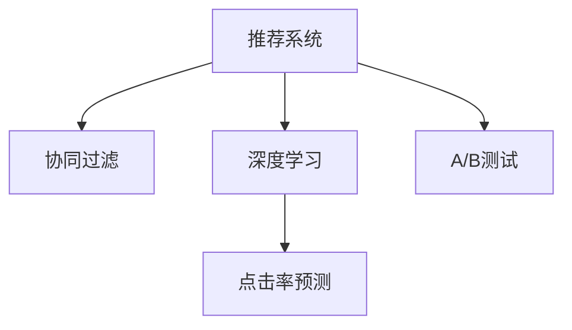

                 

# AI驱动的个性化推荐：电商平台的制胜法宝

> 关键词：个性化推荐,电商,推荐系统,深度学习,协同过滤,推荐算法,点击率预测

## 1. 背景介绍

### 1.1 问题由来

随着电商平台的蓬勃发展，用户的购买行为也日趋个性化。如何更好地理解用户需求，提供精准的商品推荐，已成为电商平台的重要挑战。传统的基于标签或类别静态推荐的策略，已经难以满足个性化需求的快速变化。近年来，基于深度学习和协同过滤的推荐系统逐渐成为主流，尤其是AI技术的应用，带来了推荐效果的质的提升。

### 1.2 问题核心关键点

个性化推荐系统旨在利用用户历史行为和商品特征，推荐用户可能感兴趣的商品。核心问题包括：

- 如何高效获取用户行为数据
- 如何建模用户兴趣和商品特征
- 如何将用户行为和商品特征进行关联
- 如何预测用户点击或购买行为
- 如何在实时性要求下进行高效推荐

### 1.3 问题研究意义

个性化推荐系统对电商平台的运营和盈利至关重要：

- 提升用户体验：通过精准推荐，满足用户个性化需求，提高用户满意度。
- 增加转化率：精准推荐能够提高用户点击率和购买转化率，直接提升销售业绩。
- 优化库存管理：通过预测销量，优化商品库存，减少缺货或库存积压情况。
- 降低营销成本：精准定位潜在客户，减少无效广告投放，提高营销效率。

## 2. 核心概念与联系

### 2.1 核心概念概述

为更好地理解个性化推荐系统，本节将介绍几个关键概念：

- 推荐系统(Recommendation System)：利用算法或模型，从海量商品中推荐给用户最有可能感兴趣的商品。
- 协同过滤(Collaborative Filtering)：基于用户或商品的相似性，利用用户历史行为或商品特征进行推荐。
- 深度学习(Deep Learning)：利用神经网络模型，通过大量标注数据学习特征表示，进行推荐。
- 点击率预测(Click-Through Rate Prediction)：预测用户点击某个商品的概率，用于评估推荐系统效果。
- A/B测试(A/B Testing)：通过对比两个推荐策略的效果，选择最优方案。

这些概念之间的关系可以通过以下Mermaid流程图来展示：



这个流程图展示了几大核心概念之间的关系：

1. 推荐系统是整个推荐过程的入口，通过算法或模型推荐商品给用户。
2. 协同过滤是推荐系统中最常用的方法，通过用户历史行为或商品特征进行推荐。
3. 深度学习可以挖掘用户行为背后的深层语义特征，提高推荐效果。
4. 点击率预测用于评估推荐系统的效果，可以通过A/B测试等手段进行优化。

## 3. 核心算法原理 & 具体操作步骤

### 3.1 算法原理概述

个性化推荐系统通常分为基于协同过滤和基于深度学习的两大类方法。本文主要介绍基于深度学习的推荐系统。

基于深度学习的推荐系统分为两种常见方式：

1. 基于内容的推荐系统(Content-Based Filtering)：根据商品的属性特征，预测用户对商品的兴趣。
2. 基于用户行为的推荐系统(Behavior-Based Filtering)：通过用户历史行为，学习用户兴趣模型。

下面以基于用户行为的推荐系统为例，详细讲解其核心原理。

### 3.2 算法步骤详解

#### 3.2.1 数据预处理

1. 收集用户行为数据，包括点击、浏览、购买、评价等行为。
2. 清洗和去重，去除无效或异常数据。
3. 将数据进行编码，转换为模型可处理的形式。

#### 3.2.2 模型训练

1. 设计推荐模型的架构，如将用户历史行为表示为向量，商品特征表示为向量，然后通过神经网络预测用户对商品的兴趣。
2. 选择合适的网络结构和损失函数，如用户-商品评分矩阵的预测损失。
3. 使用反向传播算法，根据标注数据对模型进行训练。

#### 3.2.3 预测和评估

1. 将用户新行为数据输入模型，得到商品推荐。
2. 利用点击率预测模型，计算推荐商品被用户点击的概率。
3. 根据A/B测试结果，调整模型参数，优化推荐效果。

### 3.3 算法优缺点

基于深度学习的个性化推荐系统有以下优点：

1. 自动化程度高：模型能够自动挖掘用户行为背后的语义特征，无需人工干预。
2. 高灵活性：模型结构可以灵活调整，适用于不同的推荐场景。
3. 泛化能力强：利用大量数据训练，模型能够捕捉复杂的用户兴趣和行为模式。
4. 动态更新：模型可以通过在线学习，实时更新推荐结果，适应用户兴趣的变化。

同时，该方法也存在一定的局限性：

1. 依赖大量标注数据：深度学习模型需要大量的标注数据进行训练，获取高质量数据的成本较高。
2. 计算资源需求高：深度学习模型参数量大，计算资源需求较高。
3. 模型复杂度大：模型结构复杂，难以解释其决策过程。
4. 过拟合风险：深度学习模型容易过拟合训练数据，泛化能力受限。

### 3.4 算法应用领域

基于深度学习的个性化推荐系统在电商、视频、音乐等多个领域得到了广泛应用，具体包括：

1. 电商推荐：根据用户浏览、购买历史，推荐相似或热门商品。
2. 视频推荐：根据用户观看历史，推荐相关视频内容。
3. 音乐推荐：根据用户听歌历史，推荐相似或热门歌曲。
4. 新闻推荐：根据用户阅读历史，推荐相关新闻内容。

## 4. 数学模型和公式 & 详细讲解

### 4.1 数学模型构建

假设用户集为 $U$，商品集为 $I$，用户对商品的评分矩阵为 $R_{ui}$，其中 $R_{ui}$ 为 $u$ 对 $i$ 的评分。假设评分矩阵为 $R$，用户行为表示为 $X$，商品特征表示为 $I$，推荐模型表示为 $f$，推荐过程可以表示为：

$$
f(X_i, I_j) = \hat{R}_{ui}
$$

其中，$\hat{R}_{ui}$ 为模型预测的用户对商品的评分，$X_i$ 为第 $i$ 个商品的属性特征，$I_j$ 为用户 $j$ 的历史行为。

### 4.2 公式推导过程

以协同过滤为例，假设用户集为 $U$，商品集为 $I$，用户行为表示为 $X$，商品特征表示为 $I$，推荐模型表示为 $f$，推荐过程可以表示为：

$$
f(X_i, I_j) = \sum_{u \in U} \alpha_u \sum_{v \in I} \beta_v R_{uv} R_{vi}^T
$$

其中，$\alpha_u$ 和 $\beta_v$ 为归一化系数，$R_{uv}$ 为 $u$ 对 $v$ 的评分，$R_{vi}$ 为 $v$ 对 $i$ 的评分。

通过该公式，我们可以计算出用户 $j$ 对商品 $i$ 的预测评分，进而进行推荐。

### 4.3 案例分析与讲解

以电商推荐为例，假设用户 $u$ 对商品 $i$ 的评分 $R_{ui} = 1$，表示用户对商品有购买兴趣，$R_{ui} = 0$ 表示无兴趣。利用协同过滤模型，可以计算出用户 $j$ 对商品 $i$ 的预测评分。例如，用户 $j$ 最近购买了商品 $x$ 和 $y$，可以计算出：

$$
f(X_i, I_j) = \sum_{u \in U} \alpha_u \sum_{v \in I} \beta_v R_{uv} R_{vi}^T
$$

其中，$R_{vx}$ 和 $R_{vy}$ 分别为商品 $x$ 和 $y$ 的评分。通过计算，可以得到用户 $j$ 对商品 $i$ 的预测评分，并据此进行推荐。

## 5. 项目实践：代码实例和详细解释说明

### 5.1 开发环境搭建

在进行推荐系统开发前，我们需要准备好开发环境。以下是使用Python进行TensorFlow开发的环境配置流程：

1. 安装Anaconda：从官网下载并安装Anaconda，用于创建独立的Python环境。

2. 创建并激活虚拟环境：
```bash
conda create -n tf-env python=3.8 
conda activate tf-env
```

3. 安装TensorFlow：根据CUDA版本，从官网获取对应的安装命令。例如：
```bash
conda install tensorflow -c conda-forge
```

4. 安装各类工具包：
```bash
pip install numpy pandas scikit-learn matplotlib tqdm jupyter notebook ipython
```

完成上述步骤后，即可在`tf-env`环境中开始推荐系统开发。

### 5.2 源代码详细实现

下面以电商推荐系统为例，给出使用TensorFlow进行推荐系统开发的PyTorch代码实现。

首先，定义推荐模型的架构：

```python
import tensorflow as tf

model = tf.keras.Sequential([
    tf.keras.layers.Embedding(input_dim=10000, output_dim=64, input_length=10),
    tf.keras.layers.Conv1D(64, 5, activation='relu'),
    tf.keras.layers.GlobalMaxPooling1D(),
    tf.keras.layers.Dense(64, activation='relu'),
    tf.keras.layers.Dense(1)
])
```

接着，定义损失函数和优化器：

```python
loss_fn = tf.keras.losses.MeanSquaredError()
optimizer = tf.keras.optimizers.Adam(learning_rate=0.001)
```

然后，定义训练和评估函数：

```python
def train_step(model, x_train, y_train):
    with tf.GradientTape() as tape:
        predictions = model(x_train)
        loss = loss_fn(y_train, predictions)
    grads = tape.gradient(loss, model.trainable_variables)
    optimizer.apply_gradients(zip(grads, model.trainable_variables))
    return loss

def evaluate(model, x_test, y_test):
    predictions = model(x_test)
    mse = tf.reduce_mean(tf.square(y_test - predictions))
    return mse.numpy()
```

最后，启动训练流程并在测试集上评估：

```python
epochs = 10

for epoch in range(epochs):
    train_loss = train_step(model, x_train, y_train)
    test_loss = evaluate(model, x_test, y_test)
    print(f'Epoch {epoch+1}, train loss: {train_loss:.3f}, test loss: {test_loss:.3f}')

print('Final test loss:', test_loss)
```

以上就是使用TensorFlow进行电商推荐系统开发的完整代码实现。可以看到，TensorFlow提供了强大的深度学习库，使得模型训练和推理变得简洁高效。

### 5.3 代码解读与分析

让我们再详细解读一下关键代码的实现细节：

**模型架构定义**：
- `tf.keras.Sequential`：构建模型结构。
- `tf.keras.layers.Embedding`：将用户行为和商品特征编码成向量。
- `tf.keras.layers.Conv1D`：卷积层，提取局部特征。
- `tf.keras.layers.GlobalMaxPooling1D`：池化层，提取全局特征。
- `tf.keras.layers.Dense`：全连接层，进行预测。

**损失函数和优化器**：
- `tf.keras.losses.MeanSquaredError`：均方误差损失函数，用于预测评分。
- `tf.keras.optimizers.Adam`：Adam优化器，用于更新模型参数。

**训练和评估函数**：
- `train_step`：计算损失并反向传播更新模型参数。
- `evaluate`：计算预测评分与真实评分的均方误差。

**训练流程**：
- 定义总的epoch数，开始循环迭代。
- 每个epoch内，先进行训练，输出损失。
- 在测试集上评估，输出均方误差。
- 所有epoch结束后，输出最终测试误差。

可以看到，TensorFlow提供了丰富的工具函数，使得模型训练变得非常便捷。开发者可以更多关注模型架构的设计和优化，而不必过多考虑底层细节。

当然，工业级的系统实现还需考虑更多因素，如模型的保存和部署、超参数的自动搜索、更灵活的任务适配层等。但核心的推荐范式基本与此类似。

## 6. 实际应用场景

### 6.1 电商推荐系统

电商推荐系统是推荐系统中应用最广泛的一种。传统电商推荐系统基于静态标签或分类，难以满足用户多样化的需求。基于深度学习的推荐系统可以灵活处理用户行为，适应个性化的推荐需求。

具体而言，电商推荐系统可以收集用户浏览、点击、购买等行为数据，通过深度学习模型挖掘用户兴趣和商品特征，从而生成个性化的商品推荐。例如，用户浏览了一条关于某品牌的商品信息，电商系统可以预测该用户可能对该品牌其他商品感兴趣，并生成相应推荐。

### 6.2 视频推荐系统

视频推荐系统同样广泛应用在内容分发平台中。视频推荐系统收集用户观看历史和行为数据，通过深度学习模型挖掘用户兴趣和视频内容特征，生成个性化的视频推荐。例如，用户观看了一条关于某类主题的视频，视频推荐系统可以预测该用户可能对该主题的其他视频感兴趣，并生成相应推荐。

### 6.3 音乐推荐系统

音乐推荐系统也是基于深度学习推荐系统的重要应用场景。音乐推荐系统收集用户听歌历史和行为数据，通过深度学习模型挖掘用户兴趣和音乐特征，生成个性化的音乐推荐。例如，用户连续听了某歌手的多首歌曲，音乐推荐系统可以预测该用户可能对该歌手的其他歌曲感兴趣，并生成相应推荐。

## 7. 工具和资源推荐

### 7.1 学习资源推荐

为了帮助开发者系统掌握推荐系统理论基础和实践技巧，这里推荐一些优质的学习资源：

1. 《推荐系统基础》系列博文：由深度学习专家撰写，深入浅出地介绍了推荐系统基础概念、协同过滤、深度学习等方法。

2. 《深度学习与推荐系统》课程：由斯坦福大学开设，涵盖推荐系统理论基础、协同过滤、深度学习、在线学习等，适合入门和进阶学习。

3. 《推荐系统实战》书籍：通过案例和项目，详细讲解推荐系统开发和优化技巧。

4. 《深度学习推荐系统》书籍：全面介绍推荐系统原理和深度学习方法，适合深度学习初学者。

5. 《Recommender Systems: The Textbook》书籍：由推荐系统专家撰写，系统讲解推荐系统原理、算法和应用。

通过对这些资源的学习实践，相信你一定能够快速掌握推荐系统开发的精髓，并用于解决实际的推荐问题。

### 7.2 开发工具推荐

高效的推荐系统开发离不开优秀的工具支持。以下是几款用于推荐系统开发的常用工具：

1. TensorFlow：基于Python的开源深度学习框架，灵活动态的计算图，适合快速迭代研究。

2. PyTorch：基于Python的开源深度学习框架，灵活动态的计算图，适合快速迭代研究。

3. JAX：基于Python的自动微分和分布式计算库，适合高性能计算任务。

4. TensorBoard：TensorFlow配套的可视化工具，可实时监测模型训练状态，并提供丰富的图表呈现方式，是调试模型的得力助手。

5. Weights & Biases：模型训练的实验跟踪工具，可以记录和可视化模型训练过程中的各项指标，方便对比和调优。

6. Scikit-learn：Python的机器学习库，包含多种经典算法和工具函数，适合快速原型开发。

合理利用这些工具，可以显著提升推荐系统的开发效率，加快创新迭代的步伐。

### 7.3 相关论文推荐

推荐系统研究的发展源远流长，以下是几篇奠基性的相关论文，推荐阅读：

1. Collaborative Filtering for Implicit Feedback Datasets（ICML 2008）：提出了基于用户行为和商品特征的协同过滤推荐算法。

2. Feature-Rich Collaborative Filtering for Implicit Feedback Datasets（KDD 2007）：通过多维特征挖掘，提高协同过滤模型的推荐效果。

3. Neural Collaborative Filtering（ICDM 2017）：提出了基于深度学习的协同过滤推荐算法，取得了SOTA的推荐效果。

4. Deep Matrix Factorization for Recommender Systems（SIGKDD 2014）：通过矩阵分解，深度学习神经网络模型，提升了推荐系统的准确性。

5. Wide & Deep Learning for Recommender Systems（ICDM 2016）：结合浅层和深度学习模型，提高了推荐系统的鲁棒性和泛化能力。

这些论文代表了大数据推荐系统的发展脉络。通过学习这些前沿成果，可以帮助研究者把握学科前进方向，激发更多的创新灵感。

## 8. 总结：未来发展趋势与挑战

### 8.1 总结

本文对基于深度学习的推荐系统进行了全面系统的介绍。首先阐述了推荐系统的背景和意义，明确了推荐系统在电商平台等领域的价值。其次，从原理到实践，详细讲解了推荐系统的数学模型和核心算法，给出了推荐系统开发的完整代码实现。同时，本文还广泛探讨了推荐系统在电商、视频、音乐等多个领域的应用前景，展示了推荐系统范式的巨大潜力。此外，本文精选了推荐系统的各类学习资源，力求为读者提供全方位的技术指引。

通过本文的系统梳理，可以看到，基于深度学习的推荐系统正在成为电商等领域的重要范式，极大地提升了推荐效果的准确性和个性化程度。未来，伴随深度学习、自然语言处理等技术的发展，推荐系统将在更多场景下发挥其作用，为电商、视频、音乐等行业带来更大的价值。

### 8.2 未来发展趋势

展望未来，推荐系统的发展趋势包括：

1. 强化学习与推荐系统结合：通过强化学习优化推荐策略，实时调整模型参数，提升推荐效果。
2. 多模态推荐系统：结合视觉、语音、文本等多模态数据，提升推荐系统对现实世界的理解和建模能力。
3. 联邦学习：通过分布式协同学习，在保护用户隐私的前提下，优化推荐模型。
4. 元学习：通过学习推荐任务的通用特征，快速适应新的推荐场景。
5. 对抗攻击与鲁棒性：通过对抗攻击检测和鲁棒性训练，提高推荐系统的安全性。

这些趋势将推动推荐系统在更广阔的领域中发挥作用，提升推荐效果，增强用户体验。

### 8.3 面临的挑战

尽管深度学习推荐系统已经取得了显著成效，但在迈向更加智能化、普适化应用的过程中，仍面临诸多挑战：

1. 数据隐私和安全：推荐系统需要大量用户行为数据，数据隐私和安全问题亟待解决。
2. 算法透明性和可解释性：推荐系统的决策过程复杂，难以解释其推荐依据。
3. 模型效率和资源消耗：深度学习模型参数量大，计算资源需求高。
4. 模型公平性和偏见：推荐系统容易放大数据中的偏见，导致不公平推荐。
5. 冷启动问题：新用户或新商品难以通过推荐系统获得有效推荐。

### 8.4 研究展望

未来的研究需要在以下几个方面寻求新的突破：

1. 强化推荐系统：结合强化学习理论，通过实时学习优化推荐策略。
2. 多模态推荐系统：结合视觉、语音、文本等多模态数据，提升推荐系统的语义理解能力。
3. 联邦推荐系统：利用分布式协同学习，保护用户隐私，提升推荐效果。
4. 元推荐系统：通过学习推荐任务的通用特征，快速适应新的推荐场景。
5. 对抗推荐系统：通过对抗攻击检测和鲁棒性训练，提高推荐系统的安全性。

这些方向的研究将推动推荐系统向更加智能化、普适化发展，为电商、视频、音乐等多个领域带来更大的价值。

## 9. 附录：常见问题与解答

**Q1：推荐系统如何处理冷启动问题？**

A: 推荐系统处理冷启动问题的方法主要包括：

1. 基于内容的推荐：对于新用户或新商品，利用商品属性特征进行推荐。
2. 随机推荐：随机推荐商品，让用户选择喜欢的商品。
3. 混合推荐：结合基于内容和协同过滤的推荐方法，提高推荐效果。

**Q2：推荐系统如何提高用户满意度？**

A: 推荐系统提高用户满意度的主要方法包括：

1. 个性化推荐：通过深度学习模型挖掘用户兴趣和行为特征，生成个性化推荐。
2. 多样性推荐：推荐多样化的商品，避免用户陷入兴趣孤岛。
3. 实时推荐：利用实时数据更新推荐结果，提高推荐的时效性。

**Q3：推荐系统如何保护用户隐私？**

A: 推荐系统保护用户隐私的方法主要包括：

1. 匿名化：对用户行为数据进行匿名化处理，去除可识别信息。
2. 差分隐私：通过加入随机噪声，保护用户隐私不被泄露。
3. 联邦学习：通过分布式协同学习，保护用户数据隐私。

**Q4：推荐系统如何优化模型性能？**

A: 推荐系统优化模型性能的方法主要包括：

1. 超参数调优：通过网格搜索、随机搜索等方法，优化模型超参数。
2. 模型融合：将多个模型的预测结果进行融合，提高推荐效果。
3. 在线学习：通过实时数据更新模型参数，提升推荐系统的动态性。

**Q5：推荐系统如何提高推荐效果？**

A: 推荐系统提高推荐效果的方法主要包括：

1. 数据清洗和预处理：对数据进行清洗和去重，去除异常和无效数据。
2. 特征工程：挖掘用户行为和商品特征，提高模型的泛化能力。
3. 模型选择和优化：选择合适的网络结构和优化算法，进行模型调优。

这些方法可以帮助推荐系统在实际应用中，提高推荐效果，提升用户满意度。

