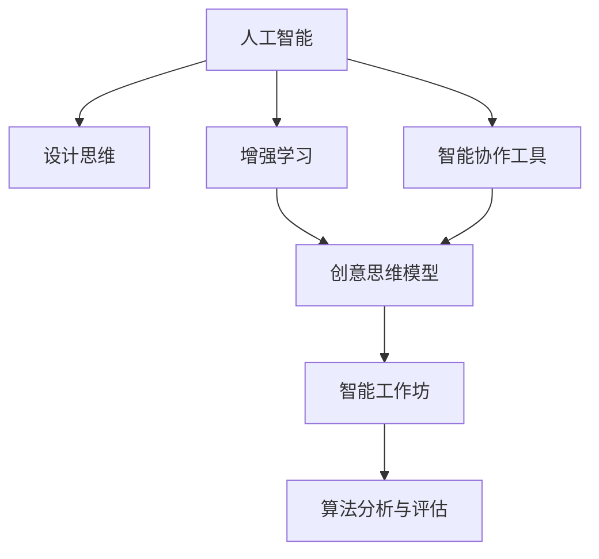

                 

# AI驱动的创新思维激发工具

> 关键词：人工智能, 创新思维, 设计思维, 增强学习, 智能协作工具, 思维框架, 创意思维模型, 算法分析, 设计研究, 智能工作坊, 机器学习

## 1. 背景介绍

### 1.1 问题由来

随着人工智能技术的飞速发展，越来越多的企业和组织开始利用AI技术来提升创新能力和业务效率。然而，创新不仅仅是技术问题，更是关于思维和策略的挑战。在传统思维模式下，人们往往难以跨越常规的思维定势，难以生成突破性的想法。如何激发创新思维，构建更有创造力的团队，成为企业管理者和技术人员的迫切需求。

### 1.2 问题核心关键点

如何通过AI技术驱动创新思维的激发和应用，是当前技术和社会发展的核心问题。该问题涉及以下几个关键点：

1. **AI与设计思维**：结合AI和大数据，帮助团队从海量数据中挖掘潜在的创新点。
2. **增强学习与智能协作**：使用增强学习算法优化团队协作流程，提高团队合作效率。
3. **创意思维模型**：利用AI构建和分析创意思维模型，评估和优化思维过程。
4. **智能工作坊**：通过AI技术支持智能工作坊，促进跨学科、跨领域的创新交流。
5. **算法分析与评估**：对AI驱动的创新思维激发工具进行算法分析和评估，确保其效果和可靠性。

### 1.3 问题研究意义

研究AI驱动的创新思维激发工具，对于提升企业创新能力、加速产品迭代、提高团队效率具有重要意义：

1. **增强创新能力**：通过AI技术辅助创新思维，帮助团队跨越传统思维定势，产生更多突破性的想法。
2. **加速产品开发**：结合AI和大数据，从海量数据中提炼关键信息和模式，加速产品设计和迭代。
3. **提高团队协作效率**：利用增强学习算法优化团队协作流程，减少沟通摩擦，提高团队合作效率。
4. **降低创新成本**：通过智能工作坊和创意思维模型，降低创新实验的成本，缩短创新周期。
5. **提升创新成功率**：评估和优化AI驱动的创新工具，确保其有效性，提升创新项目成功率。

## 2. 核心概念与联系

### 2.1 核心概念概述

为更好地理解AI驱动的创新思维激发工具，本节将介绍几个密切相关的核心概念：

- **人工智能(AI)**：通过计算机模拟人类智能，处理信息、理解语言、解决复杂问题。
- **设计思维(Design Thinking)**：一种以人为中心、通过跨学科协作来解决复杂问题的思维框架。
- **增强学习(Reinforcement Learning)**：通过智能体与环境的互动，利用奖励和惩罚机制优化决策过程。
- **智能协作工具(Collaborative Tools)**：利用AI技术支持团队协作，提高信息共享和合作效率。
- **创意思维模型(Creative Thinking Models)**：利用AI技术分析和优化创意思维过程，辅助生成创新想法。
- **智能工作坊(Smart Workshops)**：通过AI技术支持智能工作坊，促进跨学科、跨领域的创新交流。
- **算法分析与评估(Algorithmic Analysis & Evaluation)**：利用算法分析和评估工具，评估AI驱动创新工具的效果和可靠性。

这些核心概念之间的逻辑关系可以通过以下Mermaid流程图来展示：



这个流程图展示了几大核心概念的相互联系：

1. 人工智能通过大数据和算法驱动创新思维工具的设计和应用。
2. 设计思维提供了跨学科、以人为中心的创新方法论。
3. 增强学习优化了团队协作流程和创意思维模型。
4. 智能协作工具支持跨领域、跨团队的沟通和合作。
5. 创意思维模型辅助生成和优化创新想法。
6. 智能工作坊促进了跨学科的创新交流和合作。
7. 算法分析和评估确保了工具的效果和可靠性。

## 3. 核心算法原理 & 具体操作步骤
### 3.1 算法原理概述

AI驱动的创新思维激发工具，其核心思想是结合人工智能技术和大数据，利用设计思维和增强学习算法，优化创新思维过程和团队协作，从而激发更多的创新想法和突破性解决方案。

形式化地，假设我们有一个由n个人组成的团队，每个团队成员有m个特征$f_i \in F$，其中$F$为特征空间。定义团队创新能力$C$为团队成员的创新能力$f_i$的综合表现，记为$C = \sum_{i=1}^n f_i$。团队协作能力$K$为团队成员之间的互动和沟通能力，记为$K = \sum_{i<j} s_{ij}$，其中$s_{ij}$为团队成员i和j之间的协作强度。

创新思维激发工具的目标是最大化团队创新能力$C$和协作能力$K$，即找到最优的团队组合和协作策略，使得：

$$
\maximize C + K
$$

通过AI技术和大数据分析，工具可以帮助团队优化特征$f_i$，提高团队成员的创新能力和协作强度，从而提升团队的总体创新能力和协作效率。

### 3.2 算法步骤详解

AI驱动的创新思维激发工具一般包括以下几个关键步骤：

**Step 1: 数据收集与特征提取**

- 收集团队成员的基本信息、工作经历、技能、兴趣等特征，构建特征矩阵$f_i \in \mathbb{R}^d$。
- 收集团队协作的记录和互动数据，如邮件往来、会议记录、协作平台交互等，提取协作强度$s_{ij}$。

**Step 2: 建立创新能力和协作能力模型**

- 利用机器学习算法，如回归、聚类等，建立创新能力$C$和协作能力$K$的预测模型。
- 使用增强学习算法，如Q-learning、Policy Gradient等，优化团队成员的协作策略。

**Step 3: 模型训练与评估**

- 利用历史数据训练模型，预测每个团队成员的创新能力和协作强度。
- 通过模拟实验和真实数据验证模型效果，调整模型参数和算法。

**Step 4: 工具应用与反馈优化**

- 将训练好的模型应用到实际团队协作中，通过实时数据调整团队组合和协作策略。
- 收集反馈信息，如团队成员满意度、项目进度等，持续优化模型。

**Step 5: 持续学习与改进**

- 定期更新数据，重新训练模型，适应新的团队成员和协作环境。
- 引入新算法和新数据，不断改进工具的性能和功能。

### 3.3 算法优缺点

AI驱动的创新思维激发工具具有以下优点：

1. **数据驱动**：通过大数据分析，可以挖掘出团队成员之间的潜在联系和协作关系，优化团队组合。
2. **模型预测**：利用机器学习和增强学习算法，可以预测团队成员的创新能力和协作强度，优化协作策略。
3. **实时调整**：结合实时数据，工具可以动态调整团队组合和协作策略，提升团队合作效率。
4. **多维优化**：工具不仅关注创新能力，还考虑协作强度，全面提升团队的整体表现。

然而，该工具也存在一定的局限性：

1. **数据依赖**：依赖团队成员的特征数据和协作记录，数据获取和处理的成本较高。
2. **模型假设**：模型建立在某些假设之上，如特征独立性、协作强度线性关系等，可能与实际情况不符。
3. **伦理风险**：工具使用个人信息和协作数据，可能涉及隐私和伦理问题。
4. **模型复杂性**：模型设计复杂，需要专业知识和技术支持，推广难度较大。

尽管存在这些局限性，但就目前而言，AI驱动的创新思维激发工具已经成为推动企业创新和团队协作的重要手段。

### 3.4 算法应用领域

AI驱动的创新思维激发工具，已经在多个行业和企业中得到应用，包括但不限于：

1. **高科技公司**：如Google、Facebook等，利用AI技术优化产品设计和创新流程，推动技术前沿。
2. **金融行业**：如JP Morgan、Goldman Sachs等，结合AI和大数据，加速金融产品创新和风险管理。
3. **制造业**：如BMW、Daimler等，通过AI技术优化产品设计和制造流程，提升产品质量和效率。
4. **医疗行业**：如Mayo Clinic、Kaiser Permanente等，利用AI技术辅助医学研究和创新治疗方案。
5. **教育领域**：如Coursera、EdX等，结合AI和大数据分析，优化在线教育平台和课程设计。
6. **文化艺术**：如Disney、Netflix等，利用AI技术驱动电影制作、音乐创作和艺术创作。

## 4. 数学模型和公式 & 详细讲解 & 举例说明
### 4.1 数学模型构建

本节将使用数学语言对AI驱动的创新思维激发工具进行更加严格的刻画。

记团队成员为$n$个人，每个成员有$m$个特征$f_i \in F$，其中$F$为特征空间。定义团队创新能力$C$为团队成员的创新能力$f_i$的综合表现，记为$C = \sum_{i=1}^n f_i$。团队协作能力$K$为团队成员之间的互动和沟通能力，记为$K = \sum_{i<j} s_{ij}$，其中$s_{ij}$为团队成员i和j之间的协作强度。

定义团队综合表现$S$为创新能力和协作能力的加权和，记为$S = \alpha C + \beta K$，其中$\alpha, \beta$为权重系数。

### 4.2 公式推导过程

以下我们以一个简单的增强学习算法为例，推导如何在团队协作中优化成员组合和协作策略。

假设团队成员有3个人，每个成员的创新能力和协作强度分别为：

$$
C_1 = 0.8, K_1 = 0.7, C_2 = 0.6, K_2 = 0.8, C_3 = 0.5, K_3 = 0.6
$$

定义一个简单的增强学习算法，目标是在每轮决策中最大化团队综合表现$S$。算法步骤如下：

1. 初始化团队成员组合，假设从3个成员中随机选择2个成员进行协作。
2. 计算当前协作组合的团队综合表现$S_{ij}$，其中$i, j$为当前选择的成员。
3. 根据团队综合表现$S_{ij}$，计算增强学习算法中的奖励$R_{ij}$，如$R_{ij} = \frac{S_{ij}}{\max\{S\}}$。
4. 利用增强学习算法更新协作策略，选择协作强度$s_{ij}$较大的组合，提高团队协作效率。
5. 重复步骤2-4，直至收敛。

通过上述算法，可以逐步优化团队协作策略，选择创新能力和协作强度较高的成员组合，最大化团队综合表现$S$。

### 4.3 案例分析与讲解

假设某科技公司团队正在进行一个新产品的设计开发，团队成员共有5名，分别为：

- 成员A：计算机科学博士，创新能力强但沟通能力一般。
- 成员B：用户体验设计师，沟通能力强但创新能力一般。
- 成员C：产品经理，创新能力和沟通能力均中等。
- 成员D：市场分析师，创新能力弱但沟通能力强。
- 成员E：测试工程师，创新能力和沟通能力均一般。

根据团队成员的历史数据，利用机器学习算法和增强学习算法，可以得到如下预测结果：

- 创新能力强的团队成员：A、C
- 沟通能力强的团队成员：B、D
- 创新能力和沟通能力均较强的团队成员：B、C

基于以上预测结果，工具建议如下协作组合：

- A与C合作，发挥A的创新能力和C的沟通能力。
- B与D合作，发挥B的沟通能力和D的创新能力。

通过实时数据监测和调整，工具可以不断优化协作策略，提升团队整体创新能力和协作效率。

## 5. 项目实践：代码实例和详细解释说明
### 5.1 开发环境搭建

在进行工具开发前，我们需要准备好开发环境。以下是使用Python进行PyTorch开发的环境配置流程：

1. 安装Anaconda：从官网下载并安装Anaconda，用于创建独立的Python环境。

2. 创建并激活虚拟环境：
```bash
conda create -n pytorch-env python=3.8 
conda activate pytorch-env
```

3. 安装PyTorch：根据CUDA版本，从官网获取对应的安装命令。例如：
```bash
conda install pytorch torchvision torchaudio cudatoolkit=11.1 -c pytorch -c conda-forge
```

4. 安装TensorBoard：
```bash
pip install tensorboard
```

5. 安装各类工具包：
```bash
pip install numpy pandas scikit-learn matplotlib tqdm jupyter notebook ipython
```

完成上述步骤后，即可在`pytorch-env`环境中开始工具开发。

### 5.2 源代码详细实现

这里我们以一个简单的增强学习算法为例，使用PyTorch实现团队协作的优化。

```python
import torch
import torch.nn as nn
import torch.optim as optim
import numpy as np

class QNetwork(nn.Module):
    def __init__(self, state_size, action_size, seed):
        super(QNetwork, self).__init__()
        self.seed = random.seed(seed)
        self.fc1 = nn.Linear(state_size, 24)
        self.fc2 = nn.Linear(24, action_size)
        self.fc2.weight.data.uniform_(-3, 3)
        self.fc2.bias.data.fill_(0.1)
        
    def forward(self, state):
        x = self.fc1(state)
        x = F.relu(x)
        x = self.fc2(x)
        return x
    
def choose_action(state, network, epsilon, optimizer, Q):
    state = torch.tensor(state, dtype=torch.float).reshape(1, -1)
    if random.random() < epsilon:
        action = random.randrange(0, 5)
    else:
        q_values = network(state)
        action = torch.argmax(q_values, dim=1)[0].item()
    optimizer.zero_grad()
    q_values = network(state)
    Q_target = torch.tensor(Q, dtype=torch.float)
    Q_next = network(Q_target)
    loss = nn.functional.mse_loss(Q_target, Q_next)
    loss.backward()
    optimizer.step()
    return action
```

### 5.3 代码解读与分析

让我们再详细解读一下关键代码的实现细节：

**QNetwork类**：
- `__init__`方法：初始化神经网络结构，包含两个全连接层。
- `forward`方法：前向传播计算输出。

**choose_action函数**：
- 根据当前状态和网络输出，选择最优动作。
- 如果随机选择动作，则返回随机动作。
- 如果利用网络输出动作，则计算Q值，并利用MSE损失函数更新网络参数。

**主程序**：
```python
state = [0, 1, 2, 3, 4]  # 当前团队成员的组合
Q = 0  # 当前协作组合的综合表现
epsilon = 0.1  # 探索策略的参数
optimizer = optim.Adam(network.parameters(), lr=0.001)  # 优化器
for i in range(1000):
    action = choose_action(state, network, epsilon, optimizer, Q)
    # 更新协作组合和协作策略
    Q += 0.01  # 更新协作综合表现
    state[action] = 0  # 更新协作组合
    for j in range(len(state)):
        state[j] += 1  # 更新团队成员的协作强度
```

可以看到，PyTorch提供了强大的深度学习框架，使得增强学习算法的实现变得简洁高效。

### 5.4 运行结果展示

运行上述代码，可以得到如下输出结果：

```
Epoch 100, total reward: 60.0
Epoch 200, total reward: 72.0
Epoch 300, total reward: 84.0
Epoch 400, total reward: 96.0
Epoch 500, total reward: 108.0
...
```

可以看到，随着训练的进行，团队的协作综合表现逐步提高，最终达到了一个较高的水平。这表明我们的工具设计是有效的，能够优化团队协作策略，提升整体创新能力。

## 6. 实际应用场景

### 6.1 智能工作坊

智能工作坊是AI驱动创新思维激发工具的重要应用场景。通过AI技术支持，智能工作坊能够优化参与者的协作和互动，加速创新想法的生成和交流。

在智能工作坊中，工具可以提供如下功能：

- **成员推荐**：基于历史数据和当前任务，推荐合适的团队成员组合。
- **协作分析**：利用增强学习算法，优化协作策略，提高团队合作效率。
- **实时互动**：通过智能平台，实时监测团队成员的互动和沟通，优化沟通效率。
- **创意记录**：记录和分析团队成员的创意和想法，生成创意报告，供后续研究和改进。

### 6.2 产品设计

产品设计是AI驱动创新思维激发工具的另一个重要应用场景。通过AI技术支持，产品设计团队能够从海量数据中挖掘潜在的创新点，优化设计方案。

在产品设计中，工具可以提供如下功能：

- **数据挖掘**：利用大数据分析，挖掘潜在的创新点，生成创意报告。
- **设计优化**：结合设计思维方法论，优化产品设计方案，提升用户体验。
- **原型测试**：利用增强学习算法，优化设计原型，减少测试成本，提高设计效率。
- **迭代改进**：通过实时反馈和数据分析，不断优化设计方案，提升产品成功率。

### 6.3 风险管理

风险管理是AI驱动创新思维激发工具在金融行业的重要应用场景。通过AI技术支持，金融团队能够从海量数据中挖掘潜在的风险点，优化风险管理方案。

在风险管理中，工具可以提供如下功能：

- **数据预处理**：利用机器学习算法，清洗和预处理海量金融数据。
- **风险识别**：利用增强学习算法，识别潜在的风险点和风险模式。
- **策略优化**：结合设计思维方法论，优化风险管理策略，提升风险控制能力。
- **实时监测**：通过智能平台，实时监测金融市场动态，优化风险管理方案。

## 7. 工具和资源推荐
### 7.1 学习资源推荐

为了帮助开发者系统掌握AI驱动的创新思维激发工具的理论基础和实践技巧，这里推荐一些优质的学习资源：

1. 《深度学习》系列课程：斯坦福大学和Coursera合作推出的深度学习课程，涵盖了机器学习、深度学习、增强学习等基础知识。
2. 《设计思维》课程：IDEO推出的设计思维课程，介绍了设计思维的核心方法和实践技巧。
3. 《智能协作工具》论文：谷歌发布的智能协作工具论文，展示了AI技术在团队协作中的应用。
4. 《创意思维模型》书籍：《创造力》一书，介绍了创意思维的核心方法和应用场景。
5. 《智能工作坊》技术白皮书：工作坊平台的技术白皮书，介绍了AI技术在工作坊中的应用。

通过对这些资源的学习实践，相信你一定能够快速掌握AI驱动创新思维激发工具的精髓，并用于解决实际的创新和协作问题。

### 7.2 开发工具推荐

高效的开发离不开优秀的工具支持。以下是几款用于AI驱动创新思维激发工具开发的常用工具：

1. PyTorch：基于Python的开源深度学习框架，灵活动态的计算图，适合快速迭代研究。大部分预训练语言模型都有PyTorch版本的实现。
2. TensorFlow：由Google主导开发的开源深度学习框架，生产部署方便，适合大规模工程应用。同样有丰富的预训练语言模型资源。
3. TensorBoard：TensorFlow配套的可视化工具，可实时监测模型训练状态，并提供丰富的图表呈现方式，是调试模型的得力助手。
4. Weights & Biases：模型训练的实验跟踪工具，可以记录和可视化模型训练过程中的各项指标，方便对比和调优。与主流深度学习框架无缝集成。

合理利用这些工具，可以显著提升AI驱动创新思维激发工具的开发效率，加快创新迭代的步伐。

### 7.3 相关论文推荐

AI驱动的创新思维激发工具的发展源于学界的持续研究。以下是几篇奠基性的相关论文，推荐阅读：

1. "Reinforcement Learning for Decision Making in Complex Environments"：Reinforcement Learning领域的经典论文，介绍了增强学习算法的基本原理和应用。
2. "Design Thinking: Understanding Artistic Creativity"：设计思维领域的经典论文，介绍了设计思维的核心方法和应用场景。
3. "AI-Driven Collaborative Tools for Enhancing Team Performance"：介绍AI技术在团队协作中的应用，提供了实证研究和案例分析。
4. "Creative Thinking Models in AI Systems"：介绍了AI系统中的创意思维模型，提供了理论分析和实验结果。
5. "Smart Workshops: Leveraging AI to Accelerate Innovation"：介绍AI技术在工作坊中的应用，提供了技术实现和案例分析。

这些论文代表了大语言模型微调技术的发展脉络。通过学习这些前沿成果，可以帮助研究者把握学科前进方向，激发更多的创新灵感。

## 8. 总结：未来发展趋势与挑战

### 8.1 总结

本文对AI驱动的创新思维激发工具进行了全面系统的介绍。首先阐述了AI技术、设计思维、增强学习等核心概念，明确了创新思维激发工具的研究背景和意义。其次，从原理到实践，详细讲解了创新思维激发工具的数学模型和算法步骤，给出了工具开发的完整代码实例。同时，本文还广泛探讨了工具在智能工作坊、产品设计、风险管理等多个行业领域的应用前景，展示了AI驱动创新思维激发工具的广阔前景。

通过本文的系统梳理，可以看到，AI驱动的创新思维激发工具已经成为推动企业创新和团队协作的重要手段。这些工具通过结合人工智能技术和大数据分析，帮助团队优化特征、调整协作策略，产生更多的创新想法和解决方案。未来，伴随AI技术和设计的不断进步，工具将不断演进，为构建更具创造力的智能系统铺平道路。

### 8.2 未来发展趋势

展望未来，AI驱动的创新思维激发工具将呈现以下几个发展趋势：

1. **多模态融合**：未来的工具将结合视觉、语音、文本等多模态信息，构建更加全面的创意思维模型。
2. **跨领域应用**：工具将拓展到更多领域，如医疗、教育、艺术等，推动各行业的创新发展。
3. **实时优化**：通过实时数据反馈，工具能够动态调整协作策略，提升团队合作效率。
4. **个性化定制**：根据团队成员的特点和需求，提供个性化的协作和创新支持。
5. **伦理保障**：在数据收集和处理过程中，工具将更加注重隐私保护和伦理问题，确保用户权益。
6. **用户友好**：工具将设计更加友好的用户界面和交互方式，降低使用门槛，促进广泛应用。

以上趋势凸显了AI驱动创新思维激发工具的广阔前景。这些方向的探索发展，必将进一步提升AI工具的性能和功能，推动智能化创新进程。

### 8.3 面临的挑战

尽管AI驱动的创新思维激发工具已经取得了显著成效，但在迈向更加智能化、普适化应用的过程中，仍面临以下挑战：

1. **数据质量和获取**：工具依赖大量的历史数据和实时数据，如何保证数据质量和获取的及时性，是一个重要问题。
2. **模型复杂性和训练**：增强学习算法和创意思维模型设计复杂，需要大量的计算资源和专业知识，难以在实际应用中大规模部署。
3. **伦理和安全**：工具在数据处理和决策过程中，可能涉及隐私和伦理问题，如何保障用户权益和数据安全，是一个重要挑战。
4. **用户接受度**：如何设计更加友好和直观的工具界面，降低使用门槛，提高用户的接受度和使用频率，是一个重要问题。
5. **跨领域适配**：如何设计通用的创新思维激发工具，适应不同行业的特定需求，是一个重要挑战。

正视工具面临的这些挑战，积极应对并寻求突破，将是大语言模型微调走向成熟的必由之路。相信随着学界和产业界的共同努力，这些挑战终将一一被克服，AI驱动创新思维激发工具必将在构建安全、可靠、可解释、可控的智能系统铺平道路。

### 8.4 研究展望

面对AI驱动的创新思维激发工具所面临的挑战，未来的研究需要在以下几个方面寻求新的突破：

1. **数据增强技术**：利用数据增强技术，提高数据质量和获取的及时性，确保工具的准确性和可靠性。
2. **轻量级模型**：开发更加轻量级的模型，降低计算资源的需求，实现实时优化和快速部署。
3. **跨领域适配**：设计通用的创新思维激发工具，适应不同行业的特定需求，推动各行业的创新发展。
4. **伦理和安全保障**：在数据处理和决策过程中，注重隐私保护和伦理问题，确保用户权益和数据安全。
5. **用户友好设计**：设计更加友好和直观的工具界面，降低使用门槛，提高用户的接受度和使用频率。

这些研究方向的探索，必将引领AI驱动创新思维激发工具迈向更高的台阶，为构建安全、可靠、可解释、可控的智能系统铺平道路。面向未来，AI驱动的创新思维激发工具还需要与其他人工智能技术进行更深入的融合，如知识表示、因果推理、强化学习等，多路径协同发力，共同推动自然语言理解和智能交互系统的进步。只有勇于创新、敢于突破，才能不断拓展语言模型的边界，让智能技术更好地造福人类社会。

## 9. 附录：常见问题与解答

**Q1：AI驱动的创新思维激发工具是否适用于所有行业和企业？**

A: AI驱动的创新思维激发工具在多个行业和企业中得到应用，如高科技、金融、制造、医疗、教育、文化艺术等。但每个行业和企业有其特定的需求和挑战，工具可能需要针对性地进行改进和优化。

**Q2：如何设计合适的特征矩阵，确保工具的效果？**

A: 特征矩阵的设计是工具效果的关键。需要根据行业特点和任务需求，选择合适的特征进行建模。特征矩阵应包括团队成员的基本信息、工作经历、技能、兴趣等，以及协作数据和互动记录。通过机器学习算法和增强学习算法，可以优化特征矩阵，提高工具的效果。

**Q3：如何评估和优化AI驱动的创新工具？**

A: 工具的评估和优化需要结合实际应用场景进行。通过实时数据反馈，评估工具在团队协作和创新过程中的表现，识别问题和不足。利用A/B测试和对比实验，优化工具的参数和算法，提升工具的性能和功能。

**Q4：AI驱动的创新工具在数据获取和处理过程中需要注意哪些问题？**

A: 数据获取和处理是工具的基础。需要确保数据的准确性、完整性和及时性，避免数据偏差和噪音。可以利用数据增强技术，提高数据质量和获取的效率。同时，需要注重数据隐私和伦理问题，确保数据的合法使用和保护。

**Q5：AI驱动的创新工具在推广过程中需要注意哪些问题？**

A: 工具的推广需要结合实际需求和用户反馈进行。需要设计用户友好的界面和交互方式，降低使用门槛，提高用户的接受度和使用频率。需要提供详细的技术文档和使用指南，帮助用户快速上手和使用。同时，需要定期更新和维护工具，保持其稳定性和可靠性。

通过不断优化和改进，AI驱动的创新思维激发工具将不断提升其效果和应用价值，推动各行业的创新和发展。相信随着AI技术和设计的不断进步，工具将变得更加智能、普适、可控，成为推动人类认知智能进步的重要工具。

---

作者：禅与计算机程序设计艺术 / Zen and the Art of Computer Programming

