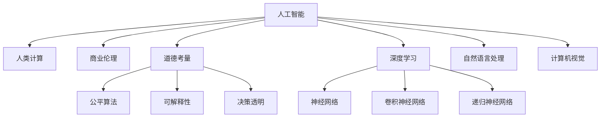

                 

# AI驱动的创新：人类计算在商业中的道德考虑因素与挑战

> 关键词：人工智能,商业伦理,道德考量,计算创新,公平算法,可解释性,决策透明

## 1. 背景介绍

随着人工智能（AI）技术的快速发展，人类计算在商业领域的渗透变得越来越广泛。AI驱动的技术创新不仅提高了生产效率，还为商业模式的变革提供了新动力。然而，与此同时，AI在商业应用中的道德考量也日益凸显，成为了学术界和产业界关注的重要问题。本文将探讨AI在商业中的道德考量因素与面临的挑战，并提出相应的解决方案和未来研究方向。

## 2. 核心概念与联系

### 2.1 核心概念概述

- **人工智能（AI）**：一种通过算法和模型进行数据处理和决策的技术。包括机器学习、深度学习、自然语言处理、计算机视觉等众多分支。
- **人类计算（Human Computing）**：利用人类的智慧和经验辅助AI系统进行决策和创新。例如，AI辅助的众包、知识图谱的构建等。
- **商业伦理（Business Ethics）**：企业在商业活动中遵循的道德规范和行为准则，包括但不限于隐私保护、数据安全、公平算法、透明决策等方面。
- **道德考量（Ethical Considerations）**：在AI应用过程中需考虑的伦理问题，如偏见、歧视、隐私侵犯、公平性等。
- **公平算法（Fairness Algorithms）**：旨在保证AI系统决策公正、不偏不倚的算法，如去偏算法、平衡算法等。
- **可解释性（Explainability）**：AI系统的决策过程可以被理解和解释的程度，尤其在涉及高风险决策时，可解释性至关重要。
- **决策透明（Transparency）**：AI系统决策过程的开放性，包括算法原理、数据来源、模型训练方式等。

这些核心概念之间的关系可通过以下Mermaid流程图展示：



这个流程图展示了几大核心概念之间的联系和作用：

1. AI技术本身涵盖了深度学习、自然语言处理和计算机视觉等多个子领域。
2. 人类计算通过提供知识和智慧来辅助AI决策，增强其泛化能力和准确性。
3. 商业伦理和道德考量直接影响AI系统的设计和使用。
4. 公平算法和可解释性是实现商业伦理和道德考量的重要手段。
5. 决策透明是确保AI系统可解释性和道德考量的基础。

### 2.2 核心概念原理和架构

AI技术的核心在于通过算法和模型处理和分析数据，从中提取出有用信息和模式。这一过程通常包括数据预处理、特征工程、模型训练和评估等步骤。

#### 数据预处理
数据预处理是AI项目的基础，包括数据清洗、标准化、归一化等操作，以确保输入数据的准确性和一致性。

#### 特征工程
特征工程是AI项目的关键步骤，通过选择和构造特征，提高模型对数据的理解和表达能力。常用的特征工程技术包括主成分分析（PCA）、独立成分分析（ICA）、深度特征提取等。

#### 模型训练
模型训练是AI项目的核心，通过选择合适的算法和模型，在训练集上优化参数，使得模型能够较好地拟合训练数据。

#### 模型评估
模型评估用于验证模型在测试集上的泛化能力和性能。常用的评估指标包括准确率、精确率、召回率、F1分数等。

## 3. 核心算法原理 & 具体操作步骤

### 3.1 算法原理概述

AI驱动的商业应用通常依赖于以下算法和模型：

- **深度学习**：通过构建多层神经网络，深度学习可以处理大规模数据，提取复杂的特征，从而进行分类、预测和生成等任务。
- **自然语言处理（NLP）**：利用深度学习模型处理文本数据，包括文本分类、情感分析、机器翻译等任务。
- **计算机视觉（CV）**：通过深度学习模型处理图像和视频数据，包括图像识别、对象检测、图像生成等任务。

### 3.2 算法步骤详解

AI在商业中的应用步骤通常包括以下几个关键环节：

**Step 1: 需求分析**
- 明确商业需求，确定AI应用的目标和范围。

**Step 2: 数据准备**
- 收集和清洗数据，进行特征工程，准备训练数据集。

**Step 3: 模型选择**
- 根据任务选择合适的深度学习模型或NLP/CV模型。

**Step 4: 模型训练**
- 在训练集上训练模型，优化参数，直到模型达到满意的性能。

**Step 5: 模型评估**
- 在测试集上评估模型性能，确保模型泛化能力强。

**Step 6: 部署和监控**
- 将模型部署到生产环境中，持续监控模型性能，并根据实际情况进行微调。

### 3.3 算法优缺点

AI驱动的商业应用具有以下优点：

1. **效率提升**：AI技术可以自动化处理大量数据，提高生产效率，降低人力成本。
2. **决策支持**：AI系统可以提供基于数据的决策支持，减少人为误差。
3. **创新加速**：AI可以发现数据中的新模式和趋势，推动业务创新和模式变革。

但同时也存在以下缺点：

1. **数据质量依赖**：AI系统的性能高度依赖于数据的质量和量，数据偏差可能导致模型偏见。
2. **模型黑盒问题**：AI模型的决策过程往往是黑盒的，难以解释和调试。
3. **隐私风险**：AI系统处理大量个人数据，存在隐私泄露的风险。
4. **公平性问题**：AI系统可能在不同群体之间产生偏见，如性别、种族、年龄等。
5. **可解释性不足**：AI系统在复杂决策过程中难以提供透明的解释和理由。

### 3.4 算法应用领域

AI在商业中的应用领域非常广泛，包括但不限于以下几个方面：

- **零售业**：利用AI进行客户画像分析、销售预测、库存管理等。
- **金融业**：利用AI进行信用评分、欺诈检测、投资策略优化等。
- **医疗健康**：利用AI进行疾病诊断、药物研发、患者管理等。
- **制造业**：利用AI进行质量控制、供应链优化、设备维护等。
- **交通运输**：利用AI进行路线规划、智能调度、安全监控等。
- **教育行业**：利用AI进行个性化学习、智能辅导、知识图谱构建等。

## 4. 数学模型和公式 & 详细讲解 & 举例说明

### 4.1 数学模型构建

AI系统通常基于以下数学模型进行构建：

- **线性回归模型**：用于回归分析，预测连续型数值变量。
- **逻辑回归模型**：用于分类分析，预测离散型分类变量。
- **支持向量机（SVM）**：用于分类和回归分析，通过寻找最优超平面进行预测。
- **卷积神经网络（CNN）**：用于图像处理，通过卷积和池化操作提取特征。
- **递归神经网络（RNN）**：用于序列数据处理，通过时间步进行递归计算。
- **注意力机制（Attention）**：用于处理序列数据，通过注意力权重对信息进行加权处理。

### 4.2 公式推导过程

以线性回归模型为例，其推导过程如下：

设训练数据集为 $\{(x_i,y_i)\}_{i=1}^N$，其中 $x_i \in \mathbb{R}^d$ 为特征向量，$y_i \in \mathbb{R}$ 为输出变量。线性回归模型的目标是寻找一个线性函数 $f(x) = \theta^T x + b$，使其最小化预测误差 $\epsilon_i = y_i - \hat{y}_i = y_i - \theta^T x_i - b$。

最小化均方误差（MSE）：

$$
\min_{\theta,b} \sum_{i=1}^N \epsilon_i^2 = \min_{\theta,b} \sum_{i=1}^N (y_i - \theta^T x_i - b)^2
$$

通过求解上述最小化问题，可得最优参数 $\theta$ 和 $b$：

$$
\theta = \left(\frac{1}{N} \sum_{i=1}^N x_ix_i^T \right)^{-1} \sum_{i=1}^N x_iy_i
$$
$$
b = \bar{y} - \theta^T \bar{x}
$$

其中 $\bar{x} = \frac{1}{N} \sum_{i=1}^N x_i$，$\bar{y} = \frac{1}{N} \sum_{i=1}^N y_i$。

### 4.3 案例分析与讲解

以信用评分系统为例，其数学模型构建和推导过程如下：

假设信用评分系统的训练数据集为 $\{(x_i,y_i)\}_{i=1}^N$，其中 $x_i = [age, income, debt]$ 为特征向量，$y_i \in \{0,1\}$ 为二分类变量，表示客户是否违约。

利用逻辑回归模型，得到预测函数：

$$
\hat{y}_i = \frac{1}{1+e^{-\theta^T x_i - b}}
$$

其中 $e$ 为自然常数，$\theta$ 为模型参数，$b$ 为偏置项。通过最大化对数似然函数，得到模型参数：

$$
\theta = \left(\frac{1}{N} \sum_{i=1}^N x_i x_i^T \right)^{-1} \sum_{i=1}^N y_i x_i
$$
$$
b = \bar{y} - \theta^T \bar{x}
$$

通过模型训练和评估，得到一个准确度和召回率均较高的信用评分系统。

## 5. 项目实践：代码实例和详细解释说明

### 5.1 开发环境搭建

在进行AI项目开发前，需要准备开发环境。以下是使用Python进行TensorFlow开发的环境配置流程：

1. 安装Anaconda：从官网下载并安装Anaconda，用于创建独立的Python环境。

2. 创建并激活虚拟环境：
```bash
conda create -n tf-env python=3.8 
conda activate tf-env
```

3. 安装TensorFlow：根据CUDA版本，从官网获取对应的安装命令。例如：
```bash
pip install tensorflow==2.6
```

4. 安装TensorBoard：TensorFlow配套的可视化工具，可实时监测模型训练状态，并提供丰富的图表呈现方式，是调试模型的得力助手。
```bash
pip install tensorboard
```

5. 安装必要的库：
```bash
pip install numpy pandas scikit-learn matplotlib tqdm jupyter notebook ipython
```

完成上述步骤后，即可在`tf-env`环境中开始AI项目开发。

### 5.2 源代码详细实现

下面我们以信用评分系统为例，给出使用TensorFlow进行模型训练和评估的PyTorch代码实现。

首先，定义数据处理函数：

```python
import pandas as pd
from sklearn.model_selection import train_test_split

def load_data():
    data = pd.read_csv('credit_data.csv')
    X = data.drop('default', axis=1)
    y = data['default']
    X_train, X_test, y_train, y_test = train_test_split(X, y, test_size=0.2, random_state=42)
    return X_train, X_test, y_train, y_test
```

然后，定义模型和优化器：

```python
from tensorflow.keras import Sequential
from tensorflow.keras.layers import Dense, Dropout
from tensorflow.keras.optimizers import Adam

model = Sequential([
    Dense(64, activation='relu', input_shape=(3,)),
    Dropout(0.2),
    Dense(1, activation='sigmoid')
])

optimizer = Adam(learning_rate=0.001)
```

接着，定义训练和评估函数：

```python
from tensorflow.keras.callbacks import EarlyStopping
from sklearn.metrics import accuracy_score, precision_score, recall_score, f1_score

def train_model(model, X_train, X_test, y_train, y_test, epochs=10, batch_size=32):
    early_stopping = EarlyStopping(patience=5, restore_best_weights=True)
    model.compile(optimizer=optimizer, loss='binary_crossentropy', metrics=['accuracy'])
    history = model.fit(X_train, y_train, epochs=epochs, batch_size=batch_size, validation_data=(X_test, y_test), callbacks=[early_stopping])
    y_pred = model.predict(X_test)
    y_pred = (y_pred > 0.5).astype(int)
    accuracy = accuracy_score(y_test, y_pred)
    precision = precision_score(y_test, y_pred)
    recall = recall_score(y_test, y_pred)
    f1 = f1_score(y_test, y_pred)
    print(f'Accuracy: {accuracy:.3f} | Precision: {precision:.3f} | Recall: {recall:.3f} | F1 Score: {f1:.3f}')
    return history
```

最后，启动训练流程并在测试集上评估：

```python
X_train, X_test, y_train, y_test = load_data()
history = train_model(model, X_train, X_test, y_train, y_test)
```

以上就是使用TensorFlow对信用评分系统进行模型训练和评估的完整代码实现。可以看到，TensorFlow提供了强大的深度学习框架，使得模型构建和训练过程变得简洁高效。

### 5.3 代码解读与分析

让我们再详细解读一下关键代码的实现细节：

**load_data函数**：
- 从CSV文件中加载数据集，并对其进行特征和标签的划分。

**模型定义**：
- 定义一个包含两个Dense层和一个Dropout层的序列模型，第一层为全连接层，激活函数为ReLU，第二层为输出层，激活函数为Sigmoid。

**训练和评估函数**：
- 使用EarlyStopping回调机制避免过拟合。
- 在训练过程中记录损失函数和准确率，并计算在测试集上的各项指标。
- 输出模型在测试集上的性能指标。

**训练流程**：
- 加载数据集并定义模型。
- 在训练集上训练模型，并使用EarlyStopping回调机制避免过拟合。
- 在测试集上评估模型性能。

## 6. 实际应用场景

### 6.1 智能客服系统

基于AI驱动的智能客服系统，可以通过自然语言处理技术，实现对用户咨询的快速响应和解答。利用预训练语言模型，如BERT或GPT，可以构建一个高效、智能的客服系统。

**系统架构**：
- 用户输入问题，系统通过NLP模型进行预处理，提取关键词和语义信息。
- 根据问题类型，调用相应的知识库或服务接口，生成回答。
- 回答结果经过优化和筛选，返回给用户。

**技术实现**：
- 构建知识库，存储常见问题和答案模板。
- 利用预训练语言模型，训练自定义的对话生成模型。
- 在生产环境中，部署模型，并通过API接口对外提供服务。

### 6.2 金融风控系统

金融风控系统可以通过AI技术，对用户行为和交易数据进行实时分析，预测潜在风险，及时采取措施。利用信用评分模型，可以构建一个准确、高效的金融风控系统。

**系统架构**：
- 用户提交交易信息，系统通过AI模型进行风险评估。
- 根据评估结果，系统自动采取相应的风险控制措施，如冻结账户、限制交易等。
- 定期更新模型，确保其与最新的市场情况和用户行为相符。

**技术实现**：
- 收集和处理用户交易数据，生成特征向量。
- 训练信用评分模型，并部署到生产环境中。
- 实时监控交易数据，自动触发风险控制措施。

### 6.3 医疗诊断系统

基于AI的智能医疗诊断系统，可以通过图像处理和自然语言处理技术，辅助医生进行疾病诊断和治疗。利用卷积神经网络和RNN等深度学习模型，可以构建一个高精度的医疗诊断系统。

**系统架构**：
- 用户上传医疗影像或文本，系统通过AI模型进行分析和诊断。
- 根据诊断结果，系统提供相应的治疗建议。
- 定期更新模型，确保其与最新的医学知识和技术相符。

**技术实现**：
- 收集和处理医疗影像和文本数据，生成特征向量。
- 训练医疗诊断模型，并部署到生产环境中。
- 实时分析用户上传的数据，提供诊断和治疗建议。

## 7. 工具和资源推荐

### 7.1 学习资源推荐

为了帮助开发者系统掌握AI在商业中的道德考量因素与挑战，这里推荐一些优质的学习资源：

1. **《人工智能伦理》系列书籍**：包括多本关于AI伦理的书籍，涵盖数据隐私、算法偏见、决策透明等多个方面。
2. **CS446《人工智能伦理》课程**：斯坦福大学开设的AI伦理课程，由多位知名专家授课，提供深入的理论和实践指导。
3. **《人工智能与商业伦理》期刊**：收录了多篇关于AI伦理和商业应用的学术论文，提供了最新的研究成果和实践经验。

### 7.2 开发工具推荐

高效的开发离不开优秀的工具支持。以下是几款用于AI项目开发的常用工具：

1. **TensorFlow**：由Google主导开发的深度学习框架，功能强大，支持多种硬件和平台。
2. **PyTorch**：由Facebook主导开发的深度学习框架，灵活性高，适合科研和工程应用。
3. **Keras**：基于TensorFlow和Theano的高级神经网络API，易于上手，支持快速原型开发。
4. **Jupyter Notebook**：一个强大的交互式编程环境，支持Python和多种数据处理库，适合数据探索和模型调试。
5. **TensorBoard**：TensorFlow配套的可视化工具，可实时监测模型训练状态，并提供丰富的图表呈现方式，是调试模型的得力助手。

### 7.3 相关论文推荐

AI在商业中的道德考量因素与挑战是一个前沿的研究领域，以下是几篇奠基性的相关论文，推荐阅读：

1. **《人工智能伦理问题与对策》**：探讨了AI在商业中的伦理问题，提出了相应的对策和建议。
2. **《公平性算法在金融风控中的应用》**：介绍了公平性算法在金融风控中的应用，确保模型决策的公正性和透明性。
3. **《人工智能伦理与法律框架》**：讨论了AI伦理与法律框架的关系，提出了相应的政策和建议。
4. **《人工智能的可解释性与透明度》**：探讨了AI可解释性的重要性，提出了相应的技术手段和应用场景。

这些论文代表了大语言模型微调技术的发展脉络。通过学习这些前沿成果，可以帮助研究者把握学科前进方向，激发更多的创新灵感。

## 8. 总结：未来发展趋势与挑战

### 8.1 总结

本文对AI在商业中的道德考量因素与挑战进行了全面系统的介绍。首先阐述了AI技术在商业领域的广泛应用，以及其在提高效率、支持决策等方面的优势。接着，探讨了AI在商业应用中面临的道德考量，如数据隐私、算法偏见、决策透明等。最后，提出了相应的解决方案和未来研究方向。

通过本文的系统梳理，可以看到，AI技术在商业应用中既带来了巨大的商业价值，也带来了诸多道德挑战。只有在技术创新的同时，加强伦理考量和透明决策，才能充分发挥AI的潜力，为商业和社会带来积极影响。

### 8.2 未来发展趋势

展望未来，AI在商业中的应用将呈现以下几个发展趋势：

1. **自动化水平提升**：随着AI技术的发展，越来越多的商业流程将实现自动化，提升生产效率和服务质量。
2. **个性化定制增强**：利用AI技术，企业可以提供更加个性化的产品和服务，满足不同客户的需求。
3. **跨领域应用拓展**：AI技术将在更多领域得到应用，如智慧城市、智能制造等，推动产业升级和经济转型。
4. **伦理考量和透明决策**：随着AI技术的普及，伦理考量和透明决策将成为AI应用的重要保障。
5. **多模态融合**：AI系统将融合多模态数据，如文本、图像、视频等，提升对复杂场景的理解和处理能力。
6. **可持续性和社会责任**：AI技术将在可持续发展和社会责任方面发挥更大作用，如环境保护、医疗健康等。

### 8.3 面临的挑战

尽管AI在商业中的应用前景广阔，但在其发展过程中仍面临诸多挑战：

1. **数据隐私保护**：AI系统处理大量个人数据，数据隐私保护成为重要问题。
2. **算法偏见和公平性**：AI系统可能在不同群体之间产生偏见，如性别、种族、年龄等。
3. **模型透明和可解释性**：AI系统的决策过程往往是黑盒的，难以解释和调试。
4. **伦理和法律框架**：AI伦理和法律框架尚未健全，如何确保AI应用的合法性和合规性仍需探讨。
5. **技术依赖和可靠性**：AI系统高度依赖技术实现，技术缺陷可能导致系统故障。
6. **社会适应性**：AI技术的发展可能带来就业、教育等方面的社会问题，需要多方协调解决。

### 8.4 研究展望

面对AI在商业应用中的诸多挑战，未来的研究需要在以下几个方面寻求新的突破：

1. **数据隐私保护技术**：开发更加高效的数据隐私保护技术，确保个人数据的安全和隐私。
2. **公平算法和透明决策**：研究和开发公平算法和透明决策框架，确保AI系统的公正性和透明性。
3. **AI伦理和法律框架**：构建完善的AI伦理和法律框架，规范AI应用行为，确保其合法合规。
4. **多模态融合技术**：开发多模态融合技术，提升AI系统对复杂场景的理解和处理能力。
5. **AI社会适应性**：研究AI技术的社会适应性，制定相应的政策和措施，解决就业、教育等方面的社会问题。
6. **可解释性和透明性**：研究和开发AI系统的可解释性技术，确保其决策过程的透明性和可解释性。

这些研究方向将有助于构建更加安全、可靠、可解释、可控的AI系统，推动AI技术在商业和社会中的应用。相信在各方的共同努力下，AI在商业中的道德考量因素与挑战将逐步得到解决，AI技术将在未来扮演更加重要的角色。

## 9. 附录：常见问题与解答

**Q1：AI在商业应用中如何确保数据隐私保护？**

A: AI系统处理大量个人数据，数据隐私保护成为重要问题。为了确保数据隐私，可以采取以下措施：
1. **数据脱敏**：对数据进行匿名化、加密等处理，确保个人隐私不被泄露。
2. **访问控制**：对数据进行严格的访问控制，确保只有授权人员可以访问敏感数据。
3. **数据隔离**：将不同类型的数据进行隔离存储，防止数据泄露。
4. **数据生命周期管理**：对数据的采集、存储、处理和销毁进行严格管理，确保数据的安全。

**Q2：AI系统如何避免算法偏见和公平性问题？**

A: 算法偏见和公平性问题在AI系统中普遍存在，需要采取以下措施进行解决：
1. **数据多样性**：确保数据集的多样性，避免数据偏差。
2. **公平算法**：研究和开发公平算法，如去偏算法、平衡算法等，确保模型决策的公正性。
3. **定期评估**：定期评估AI系统的性能，确保其在不同群体之间公平性。
4. **透明度**：确保AI系统的决策过程透明，便于进行监督和调整。

**Q3：AI系统如何实现透明和可解释性？**

A: 可解释性和透明性是AI系统的重要特性，尤其在高风险领域（如医疗、金融等），可解释性尤为重要。可以采取以下措施实现透明和可解释性：
1. **可解释性模型**：研究和开发可解释性模型，如决策树、规则模型等。
2. **特征解释**：对模型的特征进行解释，确保用户能够理解模型的决策过程。
3. **决策路径**：记录和展示AI系统的决策路径，便于进行监督和调试。
4. **用户教育**：对用户进行教育，提升其对AI系统的理解和使用能力。

这些措施将有助于提升AI系统的可解释性和透明度，增强其可靠性和可信度。

---

作者：禅与计算机程序设计艺术 / Zen and the Art of Computer Programming

