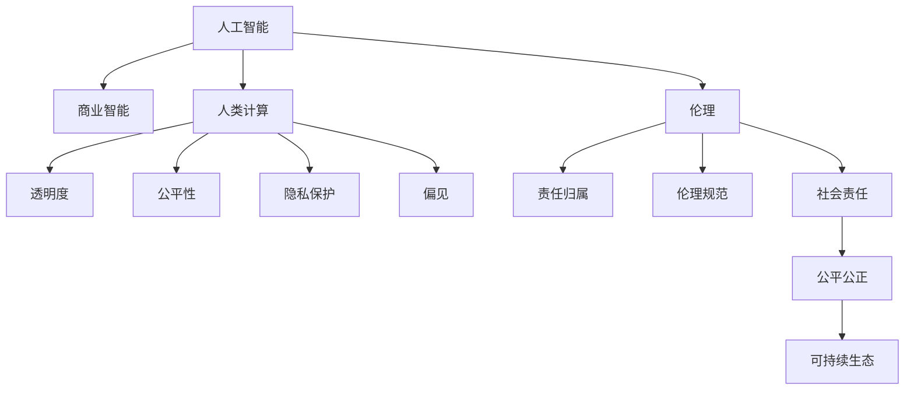

                 

# AI驱动的创新：人类计算在商业中的道德考虑因素与未来趋势

> 关键词：AI伦理,人工智能,人类计算,商业创新,道德考虑因素,未来趋势

## 1. 背景介绍

### 1.1 问题由来
近年来，人工智能(AI)技术的发展迅速，已经在各个领域展现出巨大的潜力。从医疗、教育、金融到制造业、服务业，AI的创新应用正在逐步改变我们的生产和生活方式。然而，随着AI技术的广泛应用，也引发了一系列道德和社会问题。例如，AI算法的透明度、公平性、隐私保护、就业影响等，成为人们关注的热点话题。

特别是在商业领域，AI驱动的创新正在推动企业向智能化、高效化、定制化转型。然而，商业应用中的AI伦理问题也日益突出。如何平衡AI创新与道德考量，成为业界和学术界共同关注的重要议题。本文将深入探讨AI驱动商业创新中的道德考虑因素，并对未来趋势进行展望。

### 1.2 问题核心关键点
本文聚焦于AI驱动的商业创新及其道德考量，核心关键点包括：

- AI在商业应用中的伦理挑战：如透明性、公平性、隐私保护、偏见和歧视等。
- AI商业应用中的社会影响：如就业冲击、信息垄断、市场操控等。
- AI在商业创新中的道德框架：如责任归属、伦理规范、社会责任等。
- AI驱动商业创新的未来趋势：如自动化、个性化、定制化等。

通过理清这些关键点，本文将系统性地探讨AI在商业应用中的伦理问题，并提出相应的解决方案，为企业的AI应用提供道德参考。

### 1.3 问题研究意义
探讨AI驱动的商业创新及其道德考量，具有重要的研究意义：

1. 指导企业合规使用AI技术，避免潜在的法律风险和伦理冲突。
2. 促进AI技术健康发展，确保其在商业应用中的社会价值。
3. 增强AI技术的透明度和可解释性，提升公众信任度。
4. 推动AI与人类计算的融合，实现人工智能和人类智慧的互补。
5. 引导AI技术的伦理规范，构建公平、公正、可持续的AI商业应用生态。

## 2. 核心概念与联系

### 2.1 核心概念概述

为了深入理解AI驱动的商业创新及其道德考量，本节将介绍几个关键概念：

- 人工智能(AI)：利用计算机算法和数据，模拟人类智能过程，如感知、学习、推理等。
- 商业智能(BI)：通过数据分析和AI技术，为企业提供决策支持和管理优化。
- 人类计算(Human Computing)：将人类智能与AI技术结合，实现更高效、智能的计算过程。
- 伦理(Associative Ethics)：涉及价值、责任、权利等方面的道德问题。
- 透明度(Transparency)：指AI系统的决策过程和结果的可解释性。
- 公平性(Fairness)：AI系统在处理数据和提供服务时，确保不同个体或群体受到平等对待。
- 隐私保护(Privacy Protection)：保护个人或企业数据，防止未经授权的访问和使用。
- 偏见(Bias)：指AI系统在处理数据或提供服务时，偏向某一特定群体或观点的倾向。

这些概念之间的逻辑关系可以通过以下Mermaid流程图来展示：



这个流程图展示了一系列关键概念及其之间的关系：

1. 人工智能通过商业智能应用于企业运营中。
2. 人类计算结合了AI和人类智慧，实现更高效智能的计算。
3. AI系统的透明度、公平性、隐私保护和偏见问题，是AI伦理的核心考量。
4. 伦理涉及责任归属、伦理规范和社会责任，是AI应用的道德基础。
5. 构建公平公正的AI商业应用生态，实现可持续发展。

## 3. 核心算法原理 & 具体操作步骤
### 3.1 算法原理概述

AI驱动的商业创新，主要是通过AI技术在数据处理、决策支持、管理优化等方面的应用，实现效率提升和价值创造。其核心算法包括：

- 数据预处理与特征工程：清洗、归一化、特征选择等。
- 机器学习与深度学习算法：分类、回归、聚类、神经网络等。
- 自然语言处理(NLP)：文本分类、情感分析、对话系统等。
- 计算机视觉(CV)：图像识别、目标检测、图像生成等。
- 强化学习与优化算法：自动推荐、机器人控制等。

这些算法通过数据驱动的方法，帮助企业实现智能化、高效化、定制化的商业创新。

### 3.2 算法步骤详解

基于AI驱动的商业创新，其具体操作步骤包括：

1. **数据收集与预处理**：
   - 收集商业运营相关的数据，包括客户交易数据、市场调研数据、员工绩效数据等。
   - 对数据进行清洗、归一化、特征工程等预处理步骤。

2. **模型设计与训练**：
   - 根据业务需求选择合适的算法模型，如分类、回归、聚类等。
   - 在预处理后的数据上，进行模型训练和调优，确保模型的泛化能力和准确性。

3. **模型评估与部署**：
   - 在测试数据集上评估模型性能，确保模型符合业务需求。
   - 将训练好的模型部署到实际应用场景中，进行商业决策支持和运营优化。

4. **持续监控与优化**：
   - 实时监控模型运行情况，收集反馈数据。
   - 根据反馈数据，对模型进行持续优化和迭代，确保模型长期稳定运行。

### 3.3 算法优缺点

AI驱动的商业创新具有以下优点：

1. 提升决策效率：AI模型可以快速处理大量数据，提供高效的决策支持。
2. 优化运营管理：通过数据分析和模型优化，实现业务流程的自动化和智能化。
3. 增强个性化服务：AI技术可以实现客户行为的精准预测和个性化推荐。
4. 降低运营成本：自动化和智能化的应用，减少人力成本和运营成本。

但同时也存在一些缺点：

1. 数据依赖性高：AI模型的性能依赖于数据质量和数据量，数据偏差可能导致模型偏见。
2. 算法复杂度高：AI算法模型通常复杂，需要较高的计算资源和时间成本。
3. 透明度不足：许多AI算法模型是"黑盒"系统，难以解释其决策过程。
4. 隐私保护问题：AI模型处理大量敏感数据，存在隐私泄露的风险。
5. 偏见和歧视：AI模型可能学习并放大数据中的偏见，导致不公平决策。

### 3.4 算法应用领域

AI驱动的商业创新已经广泛应用于以下领域：

1. **客户关系管理**：通过客户行为分析，实现精准营销和客户细分。
2. **供应链管理**：通过预测分析，优化库存管理、物流配送等。
3. **财务分析**：通过预测和风险管理，提升财务决策的准确性。
4. **人力资源管理**：通过员工绩效分析，优化招聘、培训和薪酬分配。
5. **智能客服**：通过自然语言处理技术，实现自动问答和客户服务。
6. **产品推荐系统**：通过个性化推荐算法，提升用户购物体验。

## 4. 数学模型和公式 & 详细讲解  
### 4.1 数学模型构建

以推荐系统为例，我们可以构建一个简单的协同过滤模型：

设用户集合为 $U$，商品集合为 $I$，用户对商品的评分矩阵为 $R_{ui}$，用户对商品的评分向量为 $r_u$，商品对用户的评分向量为 $i_i$，协同过滤模型的目标是最小化预测评分与实际评分之间的差异：

$$
\min_{r_i} ||R-\hat{R}||_F^2
$$

其中，$\hat{R}_{ui}=r_u \times i_i$ 表示用户 $u$ 对商品 $i$ 的预测评分。

### 4.2 公式推导过程

协同过滤模型的具体推导如下：

1. 计算用户与商品之间的相似度 $S_{ui}$：
   $$
   S_{ui}=r_u \times i_i
   $$

2. 预测用户对商品的评分 $\hat{R}_{ui}$：
   $$
   \hat{R}_{ui}=\sum_{j\in N_u}S_{uj}\frac{r_j}{\sum_{k\in N_u}S_{uk}}
   $$

   其中，$N_u$ 表示用户 $u$ 的所有邻居商品集合。

3. 损失函数和优化目标：
   $$
   \min_{r_i} ||R-\hat{R}||_F^2
   $$

### 4.3 案例分析与讲解

假设我们有一个在线零售平台，收集了用户对商品的评分数据。我们可以使用协同过滤模型，根据用户的历史评分行为，预测其对其他商品的评分，从而实现个性化推荐。

具体步骤如下：

1. 收集用户对商品的评分数据，建立评分矩阵 $R_{ui}$。
2. 使用协同过滤模型，计算用户和商品之间的相似度 $S_{ui}$。
3. 根据相似度计算用户对商品的预测评分 $\hat{R}_{ui}$。
4. 在预测评分上应用阈值，生成推荐列表。

通过这个案例，我们可以看到，AI驱动的商业创新在推荐系统中的应用，能够显著提升用户购物体验，提高平台的用户粘性和转化率。

## 5. 项目实践：代码实例和详细解释说明
### 5.1 开发环境搭建

在进行AI驱动的商业创新开发前，我们需要准备好开发环境。以下是使用Python进行Pandas、Scikit-learn、TensorFlow等工具开发的环境配置流程：

1. 安装Anaconda：从官网下载并安装Anaconda，用于创建独立的Python环境。

2. 创建并激活虚拟环境：
```bash
conda create -n ai-env python=3.8 
conda activate ai-env
```

3. 安装Pandas、Scikit-learn等工具包：
```bash
pip install pandas scikit-learn
```

4. 安装TensorFlow：
```bash
pip install tensorflow==2.6
```

5. 安装TensorFlow Addons等扩展库：
```bash
pip install tensorflow-addons==0.16
```

完成上述步骤后，即可在`ai-env`环境中开始AI驱动的商业创新开发。

### 5.2 源代码详细实现

以下是使用TensorFlow和Keras构建协同过滤推荐系统的代码实现：

```python
import tensorflow as tf
from tensorflow.keras.layers import Input, Embedding, Dot, Dense, Add
from tensorflow.keras.models import Model

# 定义输入层
user_input = Input(shape=(1,))
item_input = Input(shape=(1,))

# 定义嵌入层
user_embedding = Embedding(input_dim=num_users, output_dim=embedding_size)(user_input)
item_embedding = Embedding(input_dim=num_items, output_dim=embedding_size)(item_input)

# 定义相似度层
dot_product = Dot(axes=[2, 1])([user_embedding, item_embedding])

# 定义输出层
output = Dense(1, activation='sigmoid')(dot_product)

# 定义模型
model = Model(inputs=[user_input, item_input], outputs=output)

# 编译模型
model.compile(loss='binary_crossentropy', optimizer='adam', metrics=['accuracy'])

# 训练模型
model.fit([user_ids, item_ids], ratings, epochs=10, batch_size=64)
```

### 5.3 代码解读与分析

让我们再详细解读一下关键代码的实现细节：

**协同过滤推荐模型**：
- 定义用户和商品输入层，使用Embedding层将用户ID和商品ID转换为向量表示。
- 计算用户和商品向量之间的点积，得到相似度。
- 使用输出层，将相似度转换为预测评分，采用sigmoid激活函数，使输出在[0, 1]之间。
- 通过编译和训练模型，实现个性化推荐。

通过这个简单的代码实例，可以看到，AI驱动的商业创新在推荐系统中的应用，能够有效提升推荐效果，增强用户满意度。

## 6. 实际应用场景
### 6.1 智能客服系统

智能客服系统是AI驱动的商业创新的典型应用之一。传统客服往往需要大量人力，高峰期响应速度慢，且难以保证服务质量。通过AI驱动的智能客服系统，可以大幅提升客户满意度，降低运营成本。

在技术实现上，智能客服系统通常通过自然语言处理(NLP)技术，实现自动问答和客户服务。具体步骤如下：

1. 收集历史客服对话数据，进行预处理和标注。
2. 使用预训练的NLP模型，如BERT、GPT，进行文本分类和情感分析。
3. 训练对话生成模型，实现自动回复。
4. 集成知识库和FAQ，提升服务质量。

通过智能客服系统，客户可以24小时在线咨询，系统能够快速理解客户问题，并提供准确的答案。这对于提升客户体验和满意度，具有重要意义。

### 6.2 供应链管理

供应链管理是AI驱动的商业创新的重要应用领域。通过AI技术，可以实现供应链的自动化和智能化，提高效率和稳定性。

在技术实现上，供应链管理系统通常通过预测分析，优化库存管理和物流配送。具体步骤如下：

1. 收集供应链数据，包括库存量、订单量、运输数据等。
2. 使用机器学习模型，如线性回归、时间序列预测等，进行需求预测和库存优化。
3. 使用强化学习模型，如Q-learning，进行物流路径优化和配送调度。
4. 集成供应链管理系统，实现实时监控和预警。

通过供应链管理系统，企业可以实时监控供应链状态，优化库存和物流，提升供应链效率。这对于提升企业竞争力，具有重要意义。

### 6.3 智能广告投放

智能广告投放是AI驱动的商业创新的重要应用之一。通过AI技术，可以实现精准广告投放，提升广告效果和ROI。

在技术实现上，智能广告投放系统通常通过用户行为分析，实现精准广告投放。具体步骤如下：

1. 收集用户行为数据，包括浏览记录、购买记录、互动行为等。
2. 使用机器学习模型，如协同过滤、逻辑回归等，进行用户行为分析。
3. 使用深度学习模型，如CNN、RNN等，进行广告创意生成和推荐。
4. 集成广告投放系统，实现精准投放。

通过智能广告投放系统，企业可以实现精准广告投放，提升广告效果和ROI。这对于提升广告营销效果，具有重要意义。

### 6.4 未来应用展望

随着AI技术的不断发展，AI驱动的商业创新将呈现以下几个发展趋势：

1. 更加智能化：未来AI系统将更加智能化，能够处理更复杂的数据和任务，实现更高水平的自动化和智能化。
2. 更加个性化：通过AI技术，可以实现更精准的用户画像和个性化推荐，提升用户体验和满意度。
3. 更加灵活：AI系统将更加灵活，能够适应多变的市场和业务需求，实现更高效的业务运营。
4. 更加可解释：未来AI系统将更加透明和可解释，能够提供更清晰的决策依据和逻辑解释，提升用户信任度。
5. 更加合规：随着AI伦理的日益重视，未来AI系统将更加合规，遵循相关的法律法规和伦理规范。

这些趋势展示了AI驱动的商业创新的广阔前景，将进一步推动企业向智能化、高效化和个性化方向发展。

## 7. 工具和资源推荐
### 7.1 学习资源推荐

为了帮助开发者系统掌握AI驱动的商业创新的理论和实践，这里推荐一些优质的学习资源：

1. 《深度学习与人工智能》课程：由斯坦福大学等知名学府开设，涵盖深度学习基础和应用，适合初学者入门。
2. 《机器学习实战》书籍：经典机器学习实战教程，适合实战开发。
3. TensorFlow官方文档：TensorFlow官方文档，提供详细的API和示例代码。
4. Keras官方文档：Keras官方文档，提供易用的高级API和示例代码。
5. HuggingFace官方文档：HuggingFace官方文档，提供丰富的预训练模型和自然语言处理工具。
6. Coursera AI专业课程：由Coursera等平台提供的深度学习和AI专业课程，涵盖前沿技术和应用实践。

通过对这些资源的学习实践，相信你一定能够系统掌握AI驱动的商业创新的理论和实践，并用于解决实际的商业问题。

### 7.2 开发工具推荐

高效的开发离不开优秀的工具支持。以下是几款用于AI驱动的商业创新开发的常用工具：

1. Python：功能强大的编程语言，适合AI开发和数据处理。
2. Pandas：数据处理和分析库，适合数据清洗和特征工程。
3. Scikit-learn：机器学习库，适合算法模型训练和调优。
4. TensorFlow：深度学习框架，适合大规模模型训练和部署。
5. TensorFlow Addons：TensorFlow扩展库，提供更丰富的模型和算法。
6. Jupyter Notebook：数据科学和AI开发常用的交互式编程环境。
7. PyCharm：Python开发环境，提供丰富的IDE功能和自动补全。

合理利用这些工具，可以显著提升AI驱动的商业创新开发的效率，加快创新迭代的步伐。

### 7.3 相关论文推荐

AI驱动的商业创新的发展源于学界的持续研究。以下是几篇奠基性的相关论文，推荐阅读：

1. 《深度学习在商业智能中的应用》（Deep Learning in Business Intelligence）：探讨深度学习在商业智能中的应用，提出基于深度学习的商业智能系统。
2. 《机器学习在供应链管理中的应用》（Machine Learning in Supply Chain Management）：研究机器学习在供应链管理中的应用，提出基于机器学习的供应链管理系统。
3. 《智能广告投放中的深度学习技术》（Deep Learning in Smart Advertising）：探讨深度学习在智能广告投放中的应用，提出基于深度学习的广告推荐系统。
4. 《可解释AI的研究进展》（Explainable AI: Progress and Challenges）：研究可解释AI的技术进展，提出提升AI模型透明度的多种方法。
5. 《AI伦理框架》（AI Ethics Framework）：探讨AI伦理的框架和规范，提出AI伦理研究的方向和方法。

这些论文代表了大规模人工智能在商业应用中的最新研究进展，对理解AI驱动的商业创新具有重要参考价值。

## 8. 总结：未来发展趋势与挑战
### 8.1 总结

本文对AI驱动的商业创新及其道德考量进行了全面系统的介绍。首先阐述了AI在商业应用中的伦理挑战、社会影响和道德框架，明确了AI应用的道德底线。其次，从算法原理和操作步骤，详细讲解了AI商业创新的技术和实现过程。同时，本文还广泛探讨了AI在商业创新中的实际应用场景，展示了AI技术在各个领域的广阔应用前景。

通过本文的系统梳理，可以看到，AI驱动的商业创新在提升企业效率、优化运营管理、个性化服务等方面具有重要价值，但也面临着数据依赖、算法复杂、透明度不足、隐私保护和偏见等问题。未来需要更多技术创新和伦理规范，才能实现AI技术的健康发展和广泛应用。

### 8.2 未来发展趋势

展望未来，AI驱动的商业创新将呈现以下几个发展趋势：

1. 更加智能化：未来AI系统将更加智能化，能够处理更复杂的数据和任务，实现更高水平的自动化和智能化。
2. 更加个性化：通过AI技术，可以实现更精准的用户画像和个性化推荐，提升用户体验和满意度。
3. 更加灵活：AI系统将更加灵活，能够适应多变的市场和业务需求，实现更高效的业务运营。
4. 更加可解释：未来AI系统将更加透明和可解释，能够提供更清晰的决策依据和逻辑解释，提升用户信任度。
5. 更加合规：随着AI伦理的日益重视，未来AI系统将更加合规，遵循相关的法律法规和伦理规范。

这些趋势展示了AI驱动的商业创新的广阔前景，将进一步推动企业向智能化、高效化和个性化方向发展。

### 8.3 面临的挑战

尽管AI驱动的商业创新已经取得了瞩目成就，但在迈向更加智能化、高效化和个性化应用的过程中，仍面临诸多挑战：

1. 数据依赖性高：AI模型的性能依赖于数据质量和数据量，数据偏差可能导致模型偏见。
2. 算法复杂度高：AI算法模型通常复杂，需要较高的计算资源和时间成本。
3. 透明度不足：许多AI算法模型是"黑盒"系统，难以解释其决策过程。
4. 隐私保护问题：AI模型处理大量敏感数据，存在隐私泄露的风险。
5. 偏见和歧视：AI模型可能学习并放大数据中的偏见，导致不公平决策。

### 8.4 研究展望

面对AI驱动的商业创新所面临的挑战，未来的研究需要在以下几个方面寻求新的突破：

1. 探索无监督和半监督学习：摆脱对大规模标注数据的依赖，利用自监督学习、主动学习等无监督和半监督范式，最大限度利用非结构化数据，实现更加灵活高效的AI应用。
2. 研究参数高效和计算高效的AI模型：开发更加参数高效的AI模型，在固定大部分预训练参数的同时，只更新极少量的任务相关参数。同时优化AI模型的计算图，减少前向传播和反向传播的资源消耗，实现更加轻量级、实时性的部署。
3. 引入更多先验知识：将符号化的先验知识，如知识图谱、逻辑规则等，与神经网络模型进行巧妙融合，引导AI模型学习更准确、合理的语言模型。同时加强不同模态数据的整合，实现视觉、语音等多模态信息与文本信息的协同建模。
4. 引入因果分析和博弈论工具：将因果分析方法引入AI模型，识别出模型决策的关键特征，增强输出解释的因果性和逻辑性。借助博弈论工具刻画人机交互过程，主动探索并规避模型的脆弱点，提高系统稳定性。
5. 纳入伦理道德约束：在AI模型训练目标中引入伦理导向的评估指标，过滤和惩罚有偏见、有害的输出倾向。同时加强人工干预和审核，建立模型行为的监管机制，确保输出符合人类价值观和伦理道德。

这些研究方向将引领AI驱动的商业创新走向更高的台阶，为构建安全、可靠、可解释、可控的智能系统铺平道路。面向未来，AI驱动的商业创新需要更多技术创新和伦理规范，才能实现AI技术的健康发展和广泛应用。

## 9. 附录：常见问题与解答

**Q1：AI驱动的商业创新是否会带来就业冲击？**

A: AI驱动的商业创新在提升效率和自动化程度的同时，确实可能带来部分岗位的缩减。然而，AI也会创造更多新的岗位，如数据分析、算法开发、AI运营等。同时，AI技术的应用，可以减少重复性工作，提升工作效率，降低人工成本，带来更多自由时间和创造空间。

**Q2：AI驱动的商业创新如何平衡数据隐私和业务需求？**

A: 在AI驱动的商业创新中，数据隐私保护是一个重要问题。可以通过以下方法平衡数据隐私和业务需求：
1. 数据匿名化：将敏感信息进行匿名处理，确保数据隐私。
2. 数据脱敏：对数据进行部分加密处理，防止数据泄露。
3. 数据最小化：只收集必要的数据，减少数据泄露风险。
4. 数据共享协议：明确数据共享的权限和范围，确保数据安全。

**Q3：AI驱动的商业创新如何确保算法公平性？**

A: 确保AI驱动的商业创新中的算法公平性，需要从多个方面入手：
1. 数据多样化：确保训练数据多样化，减少数据偏差。
2. 模型评估：使用公平性指标评估模型，确保不同群体受到公平对待。
3. 模型优化：通过调整模型参数和算法，减少模型偏见。
4. 人工干预：引入人工审核和干预，确保模型决策公平公正。

**Q4：AI驱动的商业创新如何提升模型可解释性？**

A: 提升AI驱动的商业创新中的模型可解释性，可以从以下方面入手：
1. 使用可解释模型：如决策树、线性模型等，易于理解和解释。
2. 引入规则和符号知识：将规则和符号知识与神经网络模型结合，增强模型可解释性。
3. 模型可视化：使用可视化工具展示模型决策过程和输出结果，提升透明度。
4. 自动解释工具：开发自动解释工具，解析模型输出，提供清晰的解释和建议。

这些方法能够有效提升AI驱动的商业创新中的模型可解释性，增强用户信任度，促进AI技术的广泛应用。

---

作者：禅与计算机程序设计艺术 / Zen and the Art of Computer Programming

