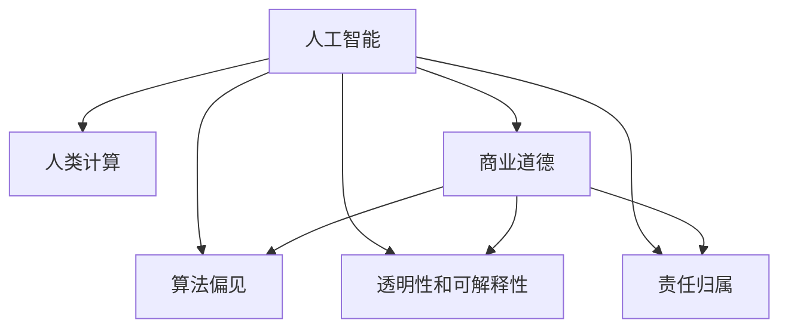

                 

# AI驱动的创新：人类计算在商业中的道德考虑因素展望分析预测

> 关键词：AI驱动, 人类计算, 商业道德, 伦理考量, 创新预测, 未来展望

## 1. 背景介绍

### 1.1 问题由来
随着人工智能(AI)技术的快速进步和普及，越来越多的企业开始利用AI驱动创新，以提高效率、降低成本、开拓新的商业机会。AI驱动的创新不仅改变了传统的商业模式，也引发了一系列伦理和道德问题。这些问题的解决不仅关系到AI技术的发展，也关乎社会的公正与可持续发展。

### 1.2 问题核心关键点
在AI驱动创新的过程中，涉及的伦理道德问题主要包括以下几个方面：

- **数据隐私**：收集和处理用户数据时，如何确保个人隐私不受侵犯。
- **算法偏见**：AI模型是否会因训练数据的偏差而产生偏见，进而影响决策的公平性。
- **透明性和可解释性**：AI系统的决策过程是否透明、可解释，用户能否理解其行为和输出。
- **责任归属**：AI系统在出错时，责任应该归咎于开发者、使用者还是系统本身。
- **就业影响**：AI自动化可能导致某些岗位的消失，如何平衡自动化与人类工作之间的关系。

这些核心问题直接关系到AI驱动创新能否在商业中广泛应用并持续发展。本文将探讨这些问题，并从商业道德的角度提出应对策略和未来展望。

## 2. 核心概念与联系

### 2.1 核心概念概述

为更好地理解AI驱动创新中的伦理道德问题，本节将介绍几个密切相关的核心概念：

- **人工智能(AI)**：通过计算机算法模拟人类智能的技术，包括机器学习、深度学习等。
- **人类计算**：利用AI技术来辅助人类计算，提升工作效率，但需确保AI技术的合理应用。
- **商业道德**：企业在使用AI技术时，应当遵循的社会伦理规范和商业行为准则。
- **算法偏见**：由于训练数据或模型设计缺陷，导致AI模型对特定群体或特征存在歧视或不公平的行为。
- **透明性和可解释性**：AI系统的决策过程和行为能够被用户理解，避免"黑箱"现象。
- **责任归属**：在AI系统出现错误或不当行为时，应明确责任主体。

这些核心概念之间的逻辑关系可以通过以下Mermaid流程图来展示：



这个流程图展示了几大核心概念及其之间的关系：

1. AI作为基础技术，通过人类计算实现商业创新。
2. 商业道德、算法偏见、透明性和可解释性、责任归属等是使用AI时需要考虑的伦理问题。
3. 解决这些伦理问题，有助于AI技术在商业中的健康发展。

## 3. 核心算法原理 & 具体操作步骤
### 3.1 算法原理概述

AI驱动的商业创新，特别是利用AI进行决策支持和自动化流程，本质上是对大规模数据进行计算和分析的过程。这一过程需要遵循一定的伦理道德原则，确保技术应用的安全、公平和透明。

### 3.2 算法步骤详解

AI驱动的商业创新涉及以下关键步骤：

1. **数据收集与预处理**：
   - 收集与业务目标相关的数据，确保数据质量和安全。
   - 对数据进行清洗、去重、标准化等预处理，以提高数据可用性。

2. **模型训练与优化**：
   - 选择合适的算法和模型结构，利用历史数据进行训练。
   - 使用交叉验证、正则化等技术优化模型，避免过拟合。

3. **模型评估与验证**：
   - 在独立数据集上评估模型性能，确保其泛化能力。
   - 定期更新模型，避免模型过时。

4. **部署与应用**：
   - 将训练好的模型集成到业务流程中，实现自动化。
   - 监控模型表现，及时调整和优化。

### 3.3 算法优缺点

AI驱动的商业创新具有以下优点：

- **效率提升**：自动化处理大量重复性工作，提高工作效率。
- **决策支持**：基于数据的智能决策，提升决策质量。
- **个性化服务**：利用AI分析用户行为，提供个性化产品和服务。

然而，也存在以下缺点：

- **数据隐私问题**：收集和使用用户数据时，需严格保护个人隐私。
- **算法偏见**：模型可能继承训练数据的偏见，导致不公平决策。
- **透明性和可解释性**：复杂的AI模型难以解释其决策过程，用户难以理解。
- **责任归属问题**：AI系统出错时，责任归属不明确。

### 3.4 算法应用领域

AI驱动的商业创新在多个领域得到应用，包括但不限于：

- **金融**：利用AI进行风险评估、欺诈检测、投资策略等。
- **零售**：通过AI进行库存管理、需求预测、个性化推荐等。
- **制造业**：利用AI优化生产流程、提高产品质量、预测设备故障等。
- **医疗**：使用AI进行疾病诊断、患者管理、药物研发等。
- **物流**：AI驱动的运输路线优化、仓储管理等。

## 4. 数学模型和公式 & 详细讲解 & 举例说明

### 4.1 数学模型构建

为了确保AI驱动创新的公平性和透明性，可以通过数学模型来量化和分析伦理道德问题。以下是一个简化的例子，说明如何构建一个公平性评估模型：

假设有一个贷款审批系统，系统通过AI模型对申请人进行信用评估。模型的输出为一个0-1之间的分数，分数越高表示信用越好。我们需要评估模型是否存在性别偏见，即女性申请人的分数是否低于男性申请人。

设 $x$ 为申请人的特征向量，包括性别、年龄、收入等。设 $y$ 为真实标签，0表示不通过，1表示通过。模型的输出为 $\hat{y}$。

模型评估的公平性指标为：

$$ E[(y - \hat{y})] = E[(y - \sigma(\theta^T x))] $$

其中 $\sigma$ 为sigmoid函数，$\theta$ 为模型参数。

### 4.2 公式推导过程

将公平性指标扩展到所有特征：

$$ E[(y - \hat{y})] = E[(y - \sigma(\theta^T x))] $$

将特征 $x_i$ 视为随机变量，可以进一步推导公平性指标的期望值：

$$ E[(y - \hat{y})] = E[E[(y - \sigma(\theta^T x)) \mid x_i]] = E[E[(y - \sigma(\theta^T x)) \mid \text{性别} = 0]] = E[E[(y - \sigma(\theta^T x)) \mid \text{性别} = 1]] $$

设 $\mu_i$ 为特征 $x_i$ 的均值，$\Sigma_i$ 为协方差矩阵，则公平性指标可以表示为：

$$ E[(y - \hat{y})] = \frac{1}{2} [\mu_1^T (\Sigma_0 - \Sigma_1) \mu_0 + \mu_0^T (\Sigma_1 - \Sigma_0) \mu_1] $$

其中 $\mu_0$ 和 $\mu_1$ 分别表示性别为0和1的样本的特征均值。

### 4.3 案例分析与讲解

假设模型训练数据中男性和女性申请人的数量不平衡，男性占70%，女性占30%。模型在训练过程中，可能倾向于利用男性数据进行训练，导致女性申请人的分数偏低。

为了解决这个问题，可以采用以下方法：

- **数据重采样**：通过重采样技术，平衡男性和女性的数据比例。
- **加权损失函数**：在损失函数中引入性别权重，提高女性样本的权重。
- **公平性约束**：在训练过程中加入公平性约束，避免模型对特定群体的偏见。

## 5. 项目实践：代码实例和详细解释说明
### 5.1 开发环境搭建

在进行商业AI项目实践前，我们需要准备好开发环境。以下是使用Python进行TensorFlow开发的环境配置流程：

1. 安装Anaconda：从官网下载并安装Anaconda，用于创建独立的Python环境。

2. 创建并激活虚拟环境：
```bash
conda create -n tf-env python=3.8 
conda activate tf-env
```

3. 安装TensorFlow：根据CUDA版本，从官网获取对应的安装命令。例如：
```bash
conda install tensorflow -c tf -c conda-forge
```

4. 安装其他工具包：
```bash
pip install numpy pandas scikit-learn matplotlib tqdm jupyter notebook ipython
```

完成上述步骤后，即可在`tf-env`环境中开始项目实践。

### 5.2 源代码详细实现

以下是一个简单的贷款审批系统公平性评估模型的Python代码实现。

```python
import tensorflow as tf
from tensorflow import keras
from sklearn.metrics import roc_auc_score

# 构建模型
model = keras.Sequential([
    keras.layers.Dense(64, activation='relu'),
    keras.layers.Dense(1, activation='sigmoid')
])

# 加载数据
x_train = ...
y_train = ...

# 训练模型
model.compile(optimizer='adam', loss='binary_crossentropy', metrics=['accuracy'])
model.fit(x_train, y_train, epochs=10, batch_size=32)

# 评估公平性
x_test = ...
y_test = ...
y_pred = model.predict(x_test)
roc_auc = roc_auc_score(y_test, y_pred)
print(f"ROC AUC: {roc_auc}")
```

在这个代码中，我们使用Keras构建了一个简单的二分类模型，使用ROC AUC指标评估模型性能。通过比较不同性别申请人的模型预测结果，可以判断模型是否存在性别偏见。

### 5.3 代码解读与分析

让我们再详细解读一下关键代码的实现细节：

**Keras模型构建**：
- `Sequential`模型：从输入层到输出层逐层添加神经网络层，构建一个简单的二分类模型。
- `Dense`层：全连接层，用于计算模型输出。
- `relu`和`sigmoid`激活函数：分别用于增强模型的非线性表达能力和输出结果的归一化。

**数据加载**：
- 数据`x_train`和`y_train`需根据实际数据进行替换，确保数据质量和安全。

**模型训练与评估**：
- 使用`compile`方法设置模型的优化器、损失函数和评估指标。
- 使用`fit`方法训练模型，并在测试集上评估性能。

**公平性评估**：
- 计算ROC AUC指标，判断模型是否公平。

**运行结果展示**：
- 输出ROC AUC值，判断模型的公平性。

可以看到，Keras提供了一个简单易用的框架，可以快速搭建和评估商业AI模型。

## 6. 实际应用场景
### 6.1 金融风控系统

在金融风控系统中，AI驱动的信用评估和欺诈检测技术已经得到了广泛应用。AI系统通过分析用户的历史交易数据、信用记录等，评估用户的信用风险和欺诈行为。

例如，某银行使用AI系统进行贷款审批，系统通过分析用户的收入、负债、信用历史等特征，预测其还款能力和还款意愿。通过公平性评估模型，银行可以确保贷款审批流程对所有客户公平，避免因性别、种族等因素产生的歧视。

### 6.2 零售个性化推荐

在零售行业中，AI驱动的个性化推荐系统已经成为提升用户体验和增加销售的重要手段。AI系统通过分析用户的购买历史、浏览行为、评价等信息，为用户推荐个性化的商品和优惠。

例如，某电商平台使用AI系统进行个性化推荐，系统通过分析用户的行为数据，生成推荐列表。通过公平性评估模型，平台可以确保推荐算法对所有用户公平，避免因性别、年龄等因素产生歧视。

### 6.3 医疗影像分析

在医疗领域，AI驱动的影像分析技术已经展示了巨大的潜力。AI系统通过分析医学影像，辅助医生进行诊断和治疗决策。

例如，某医院使用AI系统进行影像分析，系统通过分析X光、CT等医学影像，辅助医生诊断疾病。通过公平性评估模型，医院可以确保AI系统对所有患者公平，避免因种族、性别等因素产生的歧视。

### 6.4 未来应用展望

随着AI技术的不断发展，AI驱动的商业创新将拓展到更多领域，为社会带来更广泛的影响。

- **医疗健康**：AI驱动的个性化医疗、药物研发等技术，将提升医疗服务的质量和效率。
- **智能制造**：AI驱动的自动化生产、质量控制等技术，将提升制造业的智能化水平。
- **智慧城市**：AI驱动的城市管理、交通控制等技术，将提升城市的运行效率和管理水平。
- **教育培训**：AI驱动的教育评估、个性化教学等技术，将提升教育的质量和公平性。

## 7. 工具和资源推荐
### 7.1 学习资源推荐

为了帮助开发者系统掌握AI驱动的商业创新理论基础和实践技巧，这里推荐一些优质的学习资源：

1. 《深度学习》系列书籍：Yoshua Bengio等人所著，全面介绍了深度学习的基本原理和应用。
2. 《机器学习实战》书籍：Peter Harrington所著，提供了丰富的机器学习算法和案例。
3. CS229《机器学习》课程：斯坦福大学开设的机器学习课程，涵盖机器学习理论和算法。
4. CS231n《卷积神经网络》课程：斯坦福大学开设的计算机视觉课程，涵盖CNN理论及应用。
5. CS224d《序列建模》课程：斯坦福大学开设的自然语言处理课程，涵盖序列建模理论及应用。
6. HuggingFace官方文档：提供的预训练语言模型和相关工具，是学习和实践的重要资源。

通过对这些资源的学习实践，相信你一定能够快速掌握AI驱动的商业创新精髓，并用于解决实际的商业问题。

### 7.2 开发工具推荐

高效的开发离不开优秀的工具支持。以下是几款用于AI驱动商业创新开发的常用工具：

1. TensorFlow：开源深度学习框架，灵活动态的计算图，适合快速迭代研究。
2. PyTorch：开源深度学习框架，灵活且易于使用，适合科研和工程应用。
3. Keras：高级神经网络API，封装了TensorFlow等底层框架，适合快速开发原型。
4. Jupyter Notebook：交互式Python编程环境，便于代码调试和协作。
5. Scikit-learn：机器学习工具库，提供丰富的机器学习算法和数据预处理工具。
6. Google Colab：谷歌提供的免费在线Jupyter Notebook环境，适合初学者和开发者快速上手。

合理利用这些工具，可以显著提升AI驱动商业创新的开发效率，加快创新迭代的步伐。

### 7.3 相关论文推荐

AI驱动的商业创新涉及多个领域的前沿研究，以下是几篇奠基性的相关论文，推荐阅读：

1. "On the importance of initialization and momentum in deep learning" (He et al., 2015)：介绍了深度学习中权重初始化和动量的重要性。
2. "Fast R-CNN" (Ren et al., 2015)：提出了基于区域的卷积神经网络，提高了物体检测的精度和效率。
3. "Attention is All You Need" (Vaswani et al., 2017)：提出了Transformer模型，开启了NLP领域的预训练大模型时代。
4. "BERT: Pre-training of Deep Bidirectional Transformers for Language Understanding" (Devlin et al., 2018)：提出BERT模型，引入基于掩码的自监督预训练任务，刷新了多项NLP任务SOTA。
5. "AlphaGo Zero" (Silver et al., 2017)：展示了AlphaGo Zero的自我对弈和学习过程，证明了AI在复杂游戏中的强大能力。
6. "Deep Learning for Medical Image Analysis: An Review" (Wang et al., 2019)：综述了AI在医疗影像分析中的应用，展示了AI在医疗诊断中的潜力。

这些论文代表了大模型微调技术的发展脉络。通过学习这些前沿成果，可以帮助研究者把握学科前进方向，激发更多的创新灵感。

## 8. 总结：未来发展趋势与挑战
### 8.1 总结

本文对AI驱动的商业创新中的伦理道德问题进行了全面系统的介绍。首先阐述了AI驱动创新的背景和意义，明确了商业道德、算法偏见、透明性和可解释性、责任归属等伦理问题。其次，从原理到实践，详细讲解了AI驱动创新的数学模型和操作步骤，给出了项目实践的代码实例。同时，本文还广泛探讨了AI驱动创新的实际应用场景，展示了其广泛的应用前景。

通过本文的系统梳理，可以看到，AI驱动的商业创新不仅带来了高效、公平的技术手段，也引发了一系列伦理道德问题。解决这些伦理问题，不仅需要技术创新，还需要法律、社会等多方面的协同努力。

### 8.2 未来发展趋势

展望未来，AI驱动的商业创新将呈现以下几个发展趋势：

1. **自动化程度提升**：随着AI技术的进步，自动化水平将进一步提高，实现更高效的业务流程。
2. **数据驱动决策**：更多业务决策将基于AI分析的全面数据，提升决策的科学性和准确性。
3. **个性化服务普及**：AI驱动的个性化服务将深入各行各业，提升用户体验。
4. **伦理道德规范完善**：随着AI应用普及，伦理道德规范将进一步完善，确保AI技术的健康发展。
5. **跨领域融合创新**：AI驱动的创新将与其他技术如区块链、物联网等融合，拓展新的应用场景。

### 8.3 面临的挑战

尽管AI驱动的商业创新取得了显著成就，但在迈向更加智能化、普适化应用的过程中，仍面临诸多挑战：

1. **数据隐私问题**：如何保护用户数据隐私，避免数据泄露和滥用。
2. **算法偏见问题**：如何确保AI系统不产生偏见，避免歧视和不公平。
3. **透明性和可解释性问题**：如何提高AI系统的透明性和可解释性，增强用户信任。
4. **责任归属问题**：如何明确AI系统的责任归属，避免法律纠纷。
5. **伦理道德规范问题**：如何制定和完善AI伦理道德规范，确保技术应用的合理性。

### 8.4 研究展望

为应对这些挑战，未来的研究需要在以下几个方面寻求新的突破：

1. **数据隐私保护技术**：研究数据加密、差分隐私等技术，保护用户数据隐私。
2. **公平性算法研究**：开发公平性算法，避免算法偏见，确保决策公平。
3. **可解释性增强技术**：研究可解释性增强技术，提高AI系统的透明性和可解释性。
4. **责任归属机制设计**：研究责任归属机制，明确AI系统的责任归属，避免法律纠纷。
5. **伦理道德规范制定**：制定和完善AI伦理道德规范，确保技术应用的合理性。

这些研究方向和探索，将有助于解决AI驱动商业创新中的伦理道德问题，推动AI技术的健康发展和广泛应用。面向未来，AI驱动的商业创新需要技术与伦理、法律、社会等多方面的协同，共同构建一个公平、透明、可信赖的AI驱动创新生态系统。

## 9. 附录：常见问题与解答

**Q1：AI驱动的商业创新是否会替代人类工作？**

A: AI驱动的商业创新主要是辅助人类工作，提高效率和准确性。尽管AI可以自动化处理一些重复性工作，但在需要创造力、情感理解等高级认知能力的领域，人类仍然不可替代。

**Q2：AI系统是否会继承数据偏见？**

A: 是的，AI系统在训练过程中，可能会继承训练数据的偏见。为了避免这种情况，需要使用公平性算法，确保数据集的多样性和代表性。

**Q3：AI系统是否具有可解释性？**

A: 当前的AI系统，特别是深度学习模型，往往缺乏可解释性。为增强AI系统的透明性和可解释性，研究人员正在开发可解释性增强技术，如LIME、SHAP等。

**Q4：AI系统的责任归属问题如何解决？**

A: AI系统的责任归属问题需要明确法律框架和协议。通常情况下，开发者和使用者需要共同承担责任。未来可能需要制定专门的AI法律和伦理规范，明确责任归属。

**Q5：AI系统对社会的影响是什么？**

A: AI系统对社会的影响是多方面的。一方面，AI驱动的商业创新带来了高效、公平的解决方案，提升了社会的运行效率和质量。另一方面，AI技术的发展也带来了数据隐私、就业等伦理问题，需要社会各界共同关注和解决。

---

作者：禅与计算机程序设计艺术 / Zen and the Art of Computer Programming

