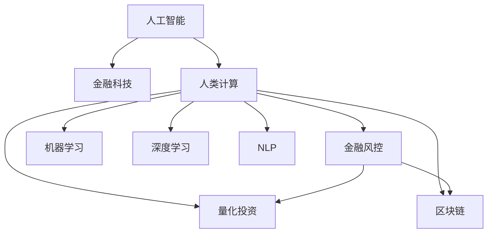

                 

# AI驱动的创新：人类计算在金融行业的应用

> 关键词：人工智能,金融科技,人类计算,金融风控,量化投资,机器学习,深度学习,自然语言处理,区块链

## 1. 背景介绍

金融行业是全球经济的重要支柱，对技术的需求持续高涨。近年来，随着人工智能技术的蓬勃发展，AI已成为推动金融行业创新的重要力量。从智能投顾到风险评估，从高频交易到信用评分，AI技术正广泛应用于金融领域的各个环节。

AI在金融行业的应用，本质上是通过大规模数据训练出各类模型，以辅助决策、风险控制和自动化操作，提升金融服务的效率和质量。其中，"人类计算"（Human Computation）是一个新兴的范式，将人类的智慧与AI计算相结合，通过优化计算流程，加速决策过程，降低运营成本，提升金融服务的智能化水平。

## 2. 核心概念与联系

### 2.1 核心概念概述

为更好地理解AI在金融行业的应用，本节将介绍几个核心概念：

- **人工智能（AI）**：通过计算机技术模拟人类智能，实现信息处理、决策分析、预测预警等功能，覆盖机器学习、深度学习、自然语言处理等诸多子领域。
- **金融科技（FinTech）**：融合金融与科技，以科技创新推动金融服务革新，涵盖区块链、大数据、云计算、人工智能等技术。
- **人类计算（Human Computation）**：将人的思维与计算结合，借助算法和模型，加速处理任务，提升决策质量，减少计算负担。
- **金融风控**：对金融活动中的风险进行识别、评估和管理，包括信用风险、市场风险、操作风险等。
- **量化投资**：利用数学模型和算法策略，自动化地进行交易操作，以追求高收益和低风险。
- **机器学习**：一种通过数据训练模型，使其具备预测、分类、聚类等功能的算法，包括监督学习、无监督学习和强化学习。
- **深度学习**：一种使用多层神经网络进行复杂任务处理的机器学习技术，能够自动提取数据特征，处理非线性问题。
- **自然语言处理（NLP）**：使计算机能够理解、处理和生成人类语言的技术，涵盖文本分类、情感分析、机器翻译等。
- **区块链**：一种分布式账本技术，用于去中心化、安全可靠地记录和传输交易信息。

这些核心概念之间的逻辑关系可以通过以下Mermaid流程图来展示：



这个流程图展示了大语言模型微调的核心概念及其之间的关系：

1. 人工智能通过各类技术手段，为金融服务提供智能化支持。
2. 金融科技为人工智能的落地应用提供了技术保障和商业环境。
3. 人类计算借助人工智能，提升金融决策和运营效率。
4. 金融风控和量化投资是人工智能在金融领域的典型应用。
5. 机器学习和深度学习是实现人工智能任务的核心算法。
6. 自然语言处理和区块链等技术，进一步扩展了人工智能的应用边界。

这些概念共同构成了AI在金融行业的应用框架，使其能够在各个场景下发挥作用。

## 3. 核心算法原理 & 具体操作步骤
### 3.1 算法原理概述

人类计算在金融行业的应用，主要基于两种算法原理：监督学习和无监督学习。

- **监督学习**：通过已标注的数据训练模型，使其能够在新的数据上进行预测。金融风控、信用评分等领域常用该方法。
- **无监督学习**：使用未标注的数据训练模型，发现数据中的隐藏模式和结构。在市场监测、用户行为分析等场景中常用。

在金融场景中，AI常常通过以下步骤进行计算：

1. **数据准备**：收集并清洗数据，包括交易记录、客户信息、市场数据等。
2. **特征工程**：选择并处理对决策有帮助的特征，如价格波动、成交量、历史交易记录等。
3. **模型训练**：根据数据训练模型，常用的算法包括线性回归、逻辑回归、支持向量机、随机森林等。
4. **模型评估**：使用验证集或测试集评估模型效果，如准确率、召回率、F1分数等。
5. **模型部署**：将训练好的模型应用到生产环境，实时处理交易、风险评估等任务。

### 3.2 算法步骤详解

以下以金融风控为例，详细讲解基于监督学习的计算步骤：

**Step 1: 数据准备**

1. 收集历史交易记录、客户信息、市场数据等。
2. 清洗数据，处理缺失值、异常值等。
3. 将数据划分为训练集、验证集和测试集。

**Step 2: 特征工程**

1. 选择对决策有帮助的特征，如交易金额、时间间隔、交易频率等。
2. 对特征进行标准化和归一化处理。
3. 对特征进行编码，如将类别型特征转换为数值型特征。

**Step 3: 模型训练**

1. 选择监督学习算法，如逻辑回归、支持向量机、随机森林等。
2. 设置超参数，如学习率、批大小、迭代轮数等。
3. 使用训练集进行模型训练，优化超参数。

**Step 4: 模型评估**

1. 使用验证集评估模型性能，调整超参数。
2. 使用测试集对模型进行最终评估，对比不同模型的效果。

**Step 5: 模型部署**

1. 将训练好的模型应用到生产环境。
2. 对实时交易数据进行风险评估和预警。
3. 不断收集新数据，更新模型。

### 3.3 算法优缺点

人类计算在金融行业的应用，具有以下优点：

1. **效率提升**：通过算法优化，可以大幅提升数据处理和决策速度。
2. **精度提高**：算法可以处理海量数据，发现人类难以发现的模式和关系。
3. **自动化决策**：自动化模型可以实时处理交易，减少人为干预，降低错误风险。

同时，该方法也存在以下缺点：

1. **数据依赖**：模型依赖数据质量，数据缺失或不准确可能导致误判。
2. **模型复杂**：模型越复杂，计算资源消耗越大，维护成本也越高。
3. **解释性不足**：机器学习模型的决策过程往往难以解释，难以进行调试和优化。

### 3.4 算法应用领域

人类计算在金融行业的应用领域广泛，主要包括以下几个方面：

1. **信用评分**：根据客户的历史信用记录和行为，评估其信用风险。
2. **风险控制**：对交易进行实时监控，识别异常交易和潜在风险。
3. **量化投资**：使用算法策略进行高频交易，追求收益最大化。
4. **市场分析**：通过大数据和机器学习分析市场趋势，发现投资机会。
5. **客户分析**：利用客户行为数据，进行精准营销和个性化服务。
6. **合规监控**：自动监控合规性要求，防止违规操作。
7. **运营优化**：通过数据分析，优化业务流程，提升运营效率。

## 4. 数学模型和公式 & 详细讲解 & 举例说明

### 4.1 数学模型构建

金融风险控制模型通常包括回归模型、分类模型、聚类模型等。以下以回归模型为例，展示其数学构建过程。

假设我们有N个历史交易样本，每个样本包含C个特征和一个标签Y。通过监督学习，构建线性回归模型：

$$
Y = \beta_0 + \beta_1 X_1 + \beta_2 X_2 + \ldots + \beta_C X_C + \epsilon
$$

其中，$Y$为预测标签，$X_i$为第i个特征，$\beta_i$为特征系数，$\epsilon$为误差项。

### 4.2 公式推导过程

线性回归模型的参数估计使用最小二乘法，即最小化误差平方和：

$$
\min \sum_{i=1}^N (Y_i - \hat{Y}_i)^2
$$

其中，$\hat{Y}_i = \beta_0 + \beta_1 X_{1i} + \beta_2 X_{2i} + \ldots + \beta_C X_{Ci}$ 为模型预测值。

使用矩阵表示法，可以将上述问题转化为求解矩阵的逆问题：

$$
\hat{\beta} = (X^TX)^{-1}X^TY
$$

其中，$X$为特征矩阵，$Y$为标签向量。

### 4.3 案例分析与讲解

以信用评分为例，分析模型的构建和应用过程：

1. **数据准备**：收集客户的历史交易数据，包括信用卡消费、还款记录、年龄、职业等。
2. **特征工程**：选择对信用评分有帮助的特征，如消费金额、还款历史、收入水平等。
3. **模型训练**：使用线性回归模型，训练参数$\beta$，最小化误差平方和。
4. **模型评估**：使用验证集评估模型效果，调整参数。
5. **模型部署**：将训练好的模型应用到新客户，进行信用评分。

## 5. 项目实践：代码实例和详细解释说明
### 5.1 开发环境搭建

在进行金融风控项目开发前，我们需要准备好开发环境。以下是使用Python进行Scikit-learn开发的配置流程：

1. 安装Anaconda：从官网下载并安装Anaconda，用于创建独立的Python环境。

2. 创建并激活虚拟环境：
```bash
conda create -n fin-env python=3.8 
conda activate fin-env
```

3. 安装Scikit-learn：
```bash
pip install scikit-learn
```

4. 安装各类工具包：
```bash
pip install numpy pandas scikit-learn matplotlib tqdm jupyter notebook ipython
```

完成上述步骤后，即可在`fin-env`环境中开始项目开发。

### 5.2 源代码详细实现

以下是一个基于线性回归模型的信用评分项目的代码实现：

```python
import pandas as pd
from sklearn.linear_model import LinearRegression
from sklearn.model_selection import train_test_split
from sklearn.metrics import mean_squared_error

# 读取数据
data = pd.read_csv('credit_data.csv')

# 特征选择
features = ['amount', 'duration', 'campaign', 'poutcome', 'default', 'contact', 'day', 'month', 'quarter', 'age', 'gender', 'education', 'marital', 'occupation', 'relationship', 'depends', 'previous', 'phone', 'dayofweek', 'month', 'quarter']
X = data[features]
y = data['y']  # 假设目标变量为'y'

# 划分训练集和测试集
X_train, X_test, y_train, y_test = train_test_split(X, y, test_size=0.2, random_state=42)

# 构建模型
model = LinearRegression()

# 训练模型
model.fit(X_train, y_train)

# 评估模型
train_score = model.score(X_train, y_train)
test_score = model.score(X_test, y_test)
train_mse = mean_squared_error(y_train, model.predict(X_train))
test_mse = mean_squared_error(y_test, model.predict(X_test))

print(f'训练集R^2得分: {train_score:.2f}, 测试集R^2得分: {test_score:.2f}')
print(f'训练集均方误差: {train_mse:.4f}, 测试集均方误差: {test_mse:.4f}')
```

### 5.3 代码解读与分析

让我们再详细解读一下关键代码的实现细节：

**信用评分项目代码**：
- `data`：读取训练数据，并从CSV文件中提取特征和标签。
- `features`：选择对信用评分有帮助的特征。
- `X_train`和`X_test`：将数据划分为训练集和测试集，使用`train_test_split`函数。
- `model`：创建线性回归模型。
- `fit`：在训练集上训练模型。
- `score`：计算模型在训练集和测试集上的R^2得分和均方误差。

**模型评估**：
- 使用`score`方法计算模型在训练集和测试集上的R^2得分，反映模型的拟合程度。
- 使用`mean_squared_error`方法计算模型在训练集和测试集上的均方误差，反映模型的预测精度。

通过以上代码，可以完成一个基于线性回归的信用评分模型的构建和评估，进一步的优化和扩展也在后续任务中展开。

## 6. 实际应用场景
### 6.1 智能投顾

智能投顾（Robo-Advisor）通过AI技术，根据用户风险偏好和投资目标，自动进行投资组合优化和资产配置，提供个性化投资建议。通过AI技术，智能投顾能够实时处理海量交易数据，自动调整投资策略，降低投资风险，提高收益水平。

在技术实现上，可以收集用户的历史交易记录、风险偏好和市场数据，构建监督学习模型，如随机森林、梯度提升树等，训练预测模型，预测用户的投资风险和收益。基于预测结果，智能投顾可以自动调整资产配置，优化投资策略。同时，为了提升投资决策的稳定性和可靠性，可以引入多模型融合、风险控制等机制，进一步增强系统的鲁棒性和抗风险能力。

### 6.2 金融欺诈检测

金融欺诈检测是金融风控的重要任务，传统的规则引擎难以应对复杂的欺诈模式。通过AI技术，可以构建深度学习模型，对交易数据进行异常检测，实时识别欺诈行为。

在技术实现上，可以收集交易记录、账户信息、行为数据等，构建基于深度学习的异常检测模型，如CNN、LSTM等，训练异常检测模型。模型通过学习正常交易和欺诈交易的特征，识别异常交易行为。同时，可以引入对抗样本生成技术，增强模型的鲁棒性，提高识别准确率。

### 6.3 智能合同

智能合同通过区块链技术，实现自动执行和不可篡改的交易合约。AI技术可以辅助智能合同的制定和执行，提高合同的智能化水平。

在技术实现上，可以结合自然语言处理和智能合约语言，构建自然语言处理模型，自动生成智能合约条款。同时，可以引入机器学习模型，对合同执行过程进行监控和评估，确保合同的可靠执行。通过AI技术，智能合同可以自动识别合同条款的变化，自动调整执行策略，提高合同的灵活性和自动化水平。

## 7. 工具和资源推荐
### 7.1 学习资源推荐

为了帮助开发者系统掌握AI在金融行业的应用，这里推荐一些优质的学习资源：

1. Coursera《机器学习》课程：由斯坦福大学教授Andrew Ng主讲，涵盖机器学习的基本概念和经典算法。
2. Kaggle金融数据集：包含各种金融领域的数据集，适合进行金融风控、量化投资等任务的实践和比赛。
3. AlphaGo论文《深度学习在围棋中的应用》：谷歌DeepMind的AlphaGo利用深度学习技术，在围棋比赛中取得了突破，展示了AI在复杂决策中的应用潜力。
4. TensorFlow官方文档：提供了丰富的深度学习模型和应用示例，适合学习深度学习的基础和进阶知识。
5. Gans in Finance书籍：介绍了GAN技术在金融风控、量化投资等场景中的应用，适合深入理解AI在金融领域的具体应用。

通过对这些资源的学习实践，相信你一定能够快速掌握AI在金融行业的应用方法，并用于解决实际的金融问题。
###  7.2 开发工具推荐

高效的开发离不开优秀的工具支持。以下是几款用于AI在金融行业应用的常用工具：

1. Jupyter Notebook：交互式的数据分析和模型训练平台，方便快速迭代实验和共享代码。
2. PyTorch：基于Python的深度学习框架，支持动态计算图，适合快速原型开发。
3. TensorFlow：由Google主导开发的深度学习框架，生产部署方便，适合大规模工程应用。
4. Scikit-learn：Python中的机器学习库，提供丰富的算法和工具，适合快速原型开发和模型评估。
5. Matplotlib：Python中的绘图库，支持多种绘图类型，适合数据可视化和模型评估。
6. Pandas：Python中的数据分析库，支持大规模数据处理和分析，适合金融数据处理。

合理利用这些工具，可以显著提升AI在金融行业的应用开发效率，加快创新迭代的步伐。

### 7.3 相关论文推荐

AI在金融行业的应用源于学界的持续研究。以下是几篇奠基性的相关论文，推荐阅读：

1. Yann LeCun, Yoshua Bengio, Geoffrey Hinton.《深度学习》：深度学习领域的经典教材，介绍了深度学习的基本概念和算法。
2. Ian Goodfellow, Yoshua Bengio, Aaron Courville.《生成对抗网络》：介绍了生成对抗网络（GAN）的基本概念和算法，展示了其在图像生成、数据增强等方面的应用。
3. Yann LeCun, Yu-An Tenenbaum, Victor O. Drissi.《金融风控的深度学习》：介绍了深度学习在金融风控中的应用，展示了其在信用评分、欺诈检测等方面的应用。
4. Ian Goodfellow, Jean Pouget-Abadie, Mehdi Mirza, Bing Xu, David Warde-Farley, Sherjil Ozair, Aaron Courville, Yoshua Bengio.《生成对抗网络在图像生成中的应用》：展示了GAN技术在图像生成、数据增强等方面的应用，展示了其在金融行业的应用潜力。
5. Harutyun Grigorian, Muge Zhang, Philipp Strack.《深度学习在量化投资中的应用》：介绍了深度学习在量化投资中的应用，展示了其在高频交易、投资组合优化等方面的应用。

这些论文代表了大语言模型微调技术的发展脉络。通过学习这些前沿成果，可以帮助研究者把握学科前进方向，激发更多的创新灵感。

## 8. 总结：未来发展趋势与挑战
### 8.1 总结

本文对AI在金融行业的应用进行了全面系统的介绍。首先阐述了AI在金融行业的应用背景和意义，明确了AI技术在提升金融服务智能化水平中的重要作用。其次，从原理到实践，详细讲解了金融风控、信用评分、量化投资等金融任务中AI模型的构建和应用，给出了项目开发的完整代码实例。同时，本文还广泛探讨了AI在智能投顾、金融欺诈检测、智能合同等多个场景中的应用前景，展示了AI技术在金融行业的广阔应用场景。此外，本文精选了AI在金融行业应用的各类学习资源，力求为读者提供全方位的技术指引。

通过本文的系统梳理，可以看到，AI在金融行业的应用已经覆盖了各个环节，通过算法优化、模型训练、实时处理等手段，显著提升了金融服务的效率和质量。未来，伴随AI技术的不断演进，金融行业将迎来更多的智能化变革，推动行业向更高层次发展。

### 8.2 未来发展趋势

展望未来，AI在金融行业的应用将呈现以下几个发展趋势：

1. **AI在金融应用场景的扩展**：AI将进一步渗透到金融行业各个领域，从金融风控到量化投资，从智能投顾到智能合同，AI的覆盖面将持续扩大。
2. **AI与区块链的融合**：AI与区块链的结合，将带来金融服务的全新变革。智能合约、分布式账本等技术将与AI深度融合，提升金融服务的可信度和透明度。
3. **AI与大数据的融合**：AI与大数据的结合，将带来金融数据的深度挖掘和应用。通过数据驱动的决策，AI将提升金融服务的个性化和精准度。
4. **AI与边缘计算的融合**：AI与边缘计算的结合，将带来金融服务的实时性和高效性。通过在边缘设备上运行AI模型，可以实现低延迟、高可靠性的金融服务。
5. **AI与量子计算的融合**：AI与量子计算的结合，将带来金融计算能力的指数级提升。量子计算的高效性，将极大地加速AI模型的训练和推理。
6. **AI与增强学习的融合**：AI与增强学习的结合，将带来金融智能决策的提升。通过在多智能体环境中进行学习，AI将提升决策的智能性和适应性。

以上趋势凸显了AI在金融行业应用的广阔前景。这些方向的探索发展，必将进一步提升AI在金融服务中的应用水平，为金融行业带来更高效的智能决策和更优质的服务体验。

### 8.3 面临的挑战

尽管AI在金融行业的应用已经取得了瞩目成就，但在迈向更加智能化、普适化应用的过程中，它仍面临着诸多挑战：

1. **数据安全和隐私保护**：金融数据高度敏感，数据安全和隐私保护成为重要问题。AI模型可能泄露敏感信息，引发数据泄露风险。
2. **模型的可解释性**：金融决策往往需要高度透明的决策过程，AI模型的黑盒特性可能导致决策缺乏可解释性，引发监管风险。
3. **模型的鲁棒性**：AI模型可能受到攻击或数据异常影响，导致模型失效。金融系统的稳定性要求AI模型具备高鲁棒性。
4. **模型的公平性**：AI模型可能继承训练数据的偏见，导致不公平的决策结果。金融系统的公平性要求AI模型具备高公平性。
5. **模型的泛化能力**：AI模型可能在不同数据分布上表现不一致，导致泛化能力不足。金融系统的普适性要求AI模型具备高泛化能力。
6. **模型的效率**：AI模型的训练和推理可能消耗大量计算资源，导致效率低下。金融系统的实时性要求AI模型具备高效性。
7. **模型的稳定性**：AI模型可能受到输入噪声或对抗样本的影响，导致决策不稳定。金融系统的可靠性要求AI模型具备高稳定性。

这些挑战将持续推动AI技术在金融行业的改进和优化，推动金融行业向更高层次发展。

### 8.4 研究展望

面对AI在金融行业应用所面临的挑战，未来的研究需要在以下几个方面寻求新的突破：

1. **数据隐私保护技术**：研究如何在保护数据隐私的前提下，高效利用数据进行AI训练和推理。
2. **模型解释性技术**：研究如何提升AI模型的可解释性，使得决策过程透明可追踪。
3. **鲁棒性增强技术**：研究如何提升AI模型的鲁棒性，确保模型在面对攻击和异常数据时能够保持稳定。
4. **公平性保障技术**：研究如何提升AI模型的公平性，确保模型在所有用户群体中表现一致。
5. **泛化能力提升技术**：研究如何提升AI模型的泛化能力，确保模型在不同数据分布上表现一致。
6. **高效计算技术**：研究如何提升AI模型的计算效率，确保模型在低延迟、高实时性环境下能够高效运行。
7. **稳定性增强技术**：研究如何提升AI模型的稳定性，确保模型在面对噪声和对抗样本时能够保持稳定。

这些研究方向的探索，将推动AI在金融行业的不断优化和升级，为金融行业的智能化和普适化提供有力保障。面向未来，AI技术将在金融行业得到更广泛的应用，推动金融服务向更加智能化、普适化和安全化方向发展。

## 9. 附录：常见问题与解答

**Q1：AI在金融行业的应用是否会取代人工操作？**

A: AI在金融行业的应用旨在辅助人工操作，提升决策效率和准确性，而非取代人工。AI可以处理大规模数据，发现人类难以发现的模式，但不能完全取代人类的判断和决策。

**Q2：AI在金融行业的应用是否安全可靠？**

A: AI在金融行业的应用需要通过严格的测试和验证，确保其安全性、可靠性和合规性。数据隐私保护、模型鲁棒性、公平性等都是需要重点考虑的问题。

**Q3：AI在金融行业的应用是否需要大规模的标注数据？**

A: AI在金融行业的应用可以通过数据增强、迁移学习等方法，减少对大规模标注数据的依赖。但针对特定的任务，如信用评分、欺诈检测等，仍需要一定量的标注数据进行训练和验证。

**Q4：AI在金融行业的应用是否容易被攻击？**

A: AI在金融行业的应用需要通过多层次的安全防护措施，确保其安全性。对抗样本生成、鲁棒性增强等技术可以提升AI模型的安全性。

**Q5：AI在金融行业的应用是否需要高成本的硬件资源？**

A: AI在金融行业的应用可以通过优化算法、压缩模型、分布式计算等方法，降低硬件资源消耗，提高计算效率。

**Q6：AI在金融行业的应用是否适用于所有金融场景？**

A: AI在金融行业的应用适用于大多数金融场景，但特定场景可能需要根据具体情况进行定制化开发。

通过本文的系统梳理，可以看到，AI在金融行业的应用已经取得了一定的进展，但仍有诸多挑战需要解决。面向未来，AI技术将在金融行业的各个领域得到广泛应用，推动金融服务的智能化和普适化，为金融行业带来更高效、更可靠、更安全的智能决策。

