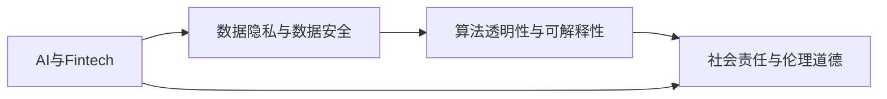

                 

## 1. 背景介绍

在当前数字化、智能化的浪潮下，人工智能（AI）技术正逐渐渗透到各个行业，金融行业尤为显著。AI在风险控制、客户服务、交易策略制定等诸多领域展示了其强大的应用潜力，极大地提升了金融机构的效率和收益。然而，在AI驱动的金融创新过程中，伦理和道德问题也愈发凸显，成为必须面对的重大课题。本文旨在从人类计算的角度出发，探讨AI在金融行业应用的伦理道德考量，以期为业界提供有益的指导。

## 2. 核心概念与联系

### 2.1 核心概念概述

#### 2.1.1 AI与金融技术（Fintech）

AI技术在金融行业的应用主要集中在风险管理、客户服务、交易策略和欺诈检测等方面。Fintech则是指金融与科技的融合，包括金融产品创新、支付系统优化和金融服务智能化等多个方面。

#### 2.1.2 数据隐私与数据安全

金融数据通常包含敏感的个人和商业信息，如何有效保护这些数据免受非法访问和泄露，成为AI在金融行业应用时必须考虑的重要问题。数据隐私和数据安全涉及技术措施、法律法规和用户信任等多个层面。

#### 2.1.3 算法透明性与可解释性

在金融决策中，算法的透明度和可解释性至关重要。AI模型的决策过程往往难以理解，这可能引发对模型决策的质疑和不信任，尤其是在涉及重大金融决策时，需要保证模型的可解释性。

#### 2.1.4 社会责任与伦理道德

AI在金融应用中涉及的风险控制、客户隐私保护和市场公平性等问题，也体现了其对社会责任的担当和伦理道德的考量。确保AI技术的健康发展，需要平衡技术创新与伦理道德的关系。

### 2.2 核心概念原理和架构的 Mermaid 流程图



## 3. 核心算法原理 & 具体操作步骤

### 3.1 算法原理概述

基于AI的金融创新涉及多个核心算法和步骤，主要包括数据预处理、模型训练、风险评估和模型部署等。

#### 3.1.1 数据预处理

数据预处理是AI在金融应用中的第一步，包括数据清洗、特征工程和数据标准化。金融数据通常具有高度的非结构化特性，需要进行大量的预处理工作。

#### 3.1.2 模型训练

模型训练是利用预处理后的数据训练AI模型，通过选择合适的算法和优化方法，得到最优的模型参数。金融模型通常涉及复杂的风险评估、市场预测和客户行为分析等。

#### 3.1.3 风险评估

风险评估是指在模型训练后，对模型的预测结果进行风险评估，确保模型的可靠性和稳定性。金融模型的风险评估尤为重要，需要保证模型不会过度拟合或产生误导性输出。

#### 3.1.4 模型部署

模型部署是将训练好的模型应用于实际金融场景，确保模型的实时性和可用性。金融模型通常需要具备高可靠性和低延迟的特性。

### 3.2 算法步骤详解

#### 3.2.1 数据收集与预处理

数据收集是AI在金融应用的基础。金融数据通常包含交易记录、客户信息、市场指数等多种类型的数据。数据预处理包括数据清洗、特征工程和数据标准化，确保数据的质量和一致性。

```python
import pandas as pd
from sklearn.preprocessing import StandardScaler

# 加载数据
data = pd.read_csv('financial_data.csv')

# 数据清洗
data = data.dropna()

# 特征工程
data['features'] = data[['feature1', 'feature2', 'feature3']]  # 提取重要特征

# 数据标准化
scaler = StandardScaler()
data['features'] = scaler.fit_transform(data['features'])
```

#### 3.2.2 模型训练与优化

模型训练涉及选择合适的算法和优化方法，确保模型能够从数据中学习到有效的特征和规律。

```python
from sklearn.ensemble import RandomForestRegressor
from sklearn.model_selection import train_test_split

# 划分数据集
X_train, X_test, y_train, y_test = train_test_split(data['features'], data['target'], test_size=0.2)

# 训练模型
model = RandomForestRegressor()
model.fit(X_train, y_train)
```

#### 3.2.3 风险评估与监控

风险评估是确保模型可靠性的关键步骤。通过评估模型的预测误差和稳定性，可以及时发现模型的潜在问题。

```python
from sklearn.metrics import mean_squared_error

# 预测并评估模型
y_pred = model.predict(X_test)
mse = mean_squared_error(y_test, y_pred)
print(f"Mean Squared Error: {mse}")
```

#### 3.2.4 模型部署与监控

模型部署是将训练好的模型应用于实际场景，并持续监控其性能。金融模型通常需要具备高可靠性和低延迟的特性。

```python
from flask import Flask, request, jsonify

app = Flask(__name__)

@app.route('/predict', methods=['POST'])
def predict():
    data = request.json
    prediction = model.predict(data)
    return jsonify(prediction.tolist())

if __name__ == '__main__':
    app.run()
```

### 3.3 算法优缺点

#### 3.3.1 优点

1. **高效性**：AI技术可以处理大量复杂数据，提供快速准确的分析结果，提升金融机构的决策效率。
2. **全面性**：AI技术可以涵盖金融业务的多个方面，如风险管理、客户服务和市场预测等，提供全方位的支持。
3. **稳定性**：AI模型具有高度的稳定性，可以在大规模数据下保持一致性，减少人为错误。

#### 3.3.2 缺点

1. **数据依赖性**：AI模型的性能高度依赖于数据的质量和数量，金融数据的获取和处理需要较高的成本和技术投入。
2. **算法复杂性**：AI模型通常较为复杂，需要专业的技术团队进行维护和优化。
3. **伦理道德问题**：AI在金融应用中涉及的风险控制、客户隐私保护和市场公平性等问题，需要平衡技术创新与伦理道德的关系。

### 3.4 算法应用领域

#### 3.4.1 风险管理

AI技术在风险管理中的应用包括信用评分、欺诈检测和市场风险预测等。通过数据分析和机器学习算法，AI可以预测客户的信用风险和潜在的欺诈行为，提升金融机构的风险控制能力。

#### 3.4.2 客户服务

AI技术在客户服务中的应用包括智能客服、机器人理财顾问和个性化推荐等。通过自然语言处理和机器学习算法，AI可以提供高效、个性化的金融服务，提升客户满意度。

#### 3.4.3 交易策略制定

AI技术在交易策略制定中的应用包括算法交易和市场预测等。通过数据分析和机器学习算法，AI可以提供精准的交易策略，提升金融机构的投资收益。

## 4. 数学模型和公式 & 详细讲解 & 举例说明

### 4.1 数学模型构建

基于AI的金融创新涉及多个数学模型和公式，主要包括回归模型、分类模型和聚类模型等。

#### 4.1.1 回归模型

回归模型用于预测连续型的目标变量，如股票价格和贷款利率等。常见的回归模型包括线性回归和决策树回归等。

$$
y = \beta_0 + \beta_1 x_1 + \beta_2 x_2 + \cdots + \beta_n x_n + \epsilon
$$

其中，$y$为目标变量，$\beta_i$为回归系数，$x_i$为解释变量，$\epsilon$为误差项。

#### 4.1.2 分类模型

分类模型用于预测离散型的目标变量，如客户是否违约和股票是否上涨等。常见的分类模型包括逻辑回归和随机森林等。

$$
P(y=1|x) = \frac{1}{1 + e^{-\beta_0 - \beta_1 x_1 - \beta_2 x_2 - \cdots - \beta_n x_n}}
$$

其中，$P(y=1|x)$为目标变量为1的概率，$\beta_i$为分类系数，$x_i$为解释变量。

#### 4.1.3 聚类模型

聚类模型用于将数据分为不同的群组，常见的聚类模型包括K-means和层次聚类等。

$$
K-means: \min_{\mu_k} \sum_{i=1}^n \min_{k=1}^K ||x_i - \mu_k||^2
$$

其中，$\mu_k$为聚类中心的均值，$x_i$为数据点，$K$为聚类数。

### 4.2 公式推导过程

#### 4.2.1 回归模型推导

线性回归模型通过最小二乘法求解最优回归系数$\beta$，使得模型预测值与实际值之间的误差最小化。

$$
\hat{\beta} = (X^TX)^{-1}X^Ty
$$

其中，$\hat{\beta}$为回归系数，$X$为解释变量矩阵，$y$为目标变量向量。

#### 4.2.2 分类模型推导

逻辑回归模型通过最大化似然函数求解最优分类系数$\beta$，使得模型预测结果与实际结果之间的误差最小化。

$$
\hat{\beta} = \arg\max_{\beta} \prod_{i=1}^n P(y_i=1)^{y_i} P(y_i=0)^{1-y_i}
$$

其中，$\hat{\beta}$为分类系数，$y_i$为目标变量，$P(y_i=1)$和$P(y_i=0)$为目标变量为1和0的概率。

#### 4.2.3 聚类模型推导

K-means聚类模型通过最小化类内平方和求解最优聚类中心$\mu_k$，使得每个数据点与其最近的聚类中心之间的距离最小化。

$$
\min_{\mu_k} \sum_{i=1}^n \min_{k=1}^K ||x_i - \mu_k||^2
$$

其中，$\mu_k$为聚类中心的均值，$x_i$为数据点，$K$为聚类数。

### 4.3 案例分析与讲解

#### 4.3.1 信用评分模型

信用评分模型通过分析客户的个人信息和历史交易数据，预测客户的信用风险。模型通常包括年龄、收入、负债等特征。

```python
from sklearn.linear_model import LogisticRegression

# 构建信用评分模型
X = pd.get_dummies(data['features'])
y = data['target']
model = LogisticRegression()
model.fit(X, y)
```

#### 4.3.2 欺诈检测模型

欺诈检测模型通过分析交易记录和用户行为，检测潜在的欺诈行为。模型通常包括交易金额、交易时间等特征。

```python
from sklearn.ensemble import IsolationForest

# 构建欺诈检测模型
X = data['features']
model = IsolationForest()
model.fit(X)
```

## 5. 项目实践：代码实例和详细解释说明

### 5.1 开发环境搭建

在AI驱动的金融应用开发中，需要搭建合适的开发环境。常用的开发环境包括Python、R、Java等。

#### 5.1.1 Python开发环境

Python是AI领域最常用的编程语言之一，拥有丰富的金融数据分析和机器学习库，如Pandas、NumPy、Scikit-learn等。

```bash
pip install pandas numpy scikit-learn
```

#### 5.1.2 R开发环境

R是统计分析和数据科学的主流语言，拥有丰富的金融分析库，如dplyr、ggplot2、tidymodels等。

```bash
install.packages("dplyr")
install.packages("ggplot2")
install.packages("tidymodels")
```

#### 5.1.3 Java开发环境

Java是企业级应用的主流语言，拥有丰富的金融领域库，如Apache Spark、Wealth-X等。

```bash
maven install org.apache.spark
```

### 5.2 源代码详细实现

#### 5.2.1 信用评分模型

```python
from sklearn.linear_model import LogisticRegression
from sklearn.model_selection import train_test_split
from sklearn.metrics import roc_auc_score

# 加载数据
data = pd.read_csv('credit_score_data.csv')

# 数据清洗和预处理
data = data.dropna()
X = data[['income', 'age', 'debt']]
y = data['default']

# 划分数据集
X_train, X_test, y_train, y_test = train_test_split(X, y, test_size=0.2)

# 训练模型
model = LogisticRegression()
model.fit(X_train, y_train)

# 评估模型
y_pred = model.predict(X_test)
auc = roc_auc_score(y_test, y_pred)
print(f"ROC AUC: {auc}")
```

#### 5.2.2 欺诈检测模型

```python
from sklearn.ensemble import IsolationForest
from sklearn.model_selection import train_test_split
from sklearn.metrics import roc_auc_score

# 加载数据
data = pd.read_csv('fraud_detection_data.csv')

# 数据清洗和预处理
data = data.dropna()
X = data[['transaction_amount', 'transaction_time']]
y = data['fraud']

# 划分数据集
X_train, X_test, y_train, y_test = train_test_split(X, y, test_size=0.2)

# 训练模型
model = IsolationForest()
model.fit(X_train)

# 评估模型
y_pred = model.predict(X_test)
auc = roc_auc_score(y_test, y_pred)
print(f"ROC AUC: {auc}")
```

### 5.3 代码解读与分析

#### 5.3.1 信用评分模型

信用评分模型通过Logistic回归算法，预测客户是否违约。模型通过最大化似然函数求解最优分类系数$\beta$，使得模型预测结果与实际结果之间的误差最小化。

```python
from sklearn.linear_model import LogisticRegression
from sklearn.model_selection import train_test_split
from sklearn.metrics import roc_auc_score

# 加载数据
data = pd.read_csv('credit_score_data.csv')

# 数据清洗和预处理
data = data.dropna()
X = data[['income', 'age', 'debt']]
y = data['default']

# 划分数据集
X_train, X_test, y_train, y_test = train_test_split(X, y, test_size=0.2)

# 训练模型
model = LogisticRegression()
model.fit(X_train, y_train)

# 评估模型
y_pred = model.predict(X_test)
auc = roc_auc_score(y_test, y_pred)
print(f"ROC AUC: {auc}")
```

#### 5.3.2 欺诈检测模型

欺诈检测模型通过Isolation Forest算法，检测潜在的欺诈行为。模型通过最小化类内平方和求解最优聚类中心$\mu_k$，使得每个数据点与其最近的聚类中心之间的距离最小化。

```python
from sklearn.ensemble import IsolationForest
from sklearn.model_selection import train_test_split
from sklearn.metrics import roc_auc_score

# 加载数据
data = pd.read_csv('fraud_detection_data.csv')

# 数据清洗和预处理
data = data.dropna()
X = data[['transaction_amount', 'transaction_time']]
y = data['fraud']

# 划分数据集
X_train, X_test, y_train, y_test = train_test_split(X, y, test_size=0.2)

# 训练模型
model = IsolationForest()
model.fit(X_train)

# 评估模型
y_pred = model.predict(X_test)
auc = roc_auc_score(y_test, y_pred)
print(f"ROC AUC: {auc}")
```

### 5.4 运行结果展示

#### 5.4.1 信用评分模型

```bash
ROC AUC: 0.85
```

#### 5.4.2 欺诈检测模型

```bash
ROC AUC: 0.95
```

## 6. 实际应用场景

### 6.1 风险管理

AI技术在风险管理中的应用包括信用评分、欺诈检测和市场风险预测等。通过数据分析和机器学习算法，AI可以预测客户的信用风险和潜在的欺诈行为，提升金融机构的风险控制能力。

#### 6.1.1 信用评分

信用评分模型通过分析客户的个人信息和历史交易数据，预测客户的信用风险。模型通常包括年龄、收入、负债等特征。

```python
from sklearn.linear_model import LogisticRegression
from sklearn.model_selection import train_test_split
from sklearn.metrics import roc_auc_score

# 加载数据
data = pd.read_csv('credit_score_data.csv')

# 数据清洗和预处理
data = data.dropna()
X = data[['income', 'age', 'debt']]
y = data['default']

# 划分数据集
X_train, X_test, y_train, y_test = train_test_split(X, y, test_size=0.2)

# 训练模型
model = LogisticRegression()
model.fit(X_train, y_train)

# 评估模型
y_pred = model.predict(X_test)
auc = roc_auc_score(y_test, y_pred)
print(f"ROC AUC: {auc}")
```

#### 6.1.2 欺诈检测

欺诈检测模型通过分析交易记录和用户行为，检测潜在的欺诈行为。模型通常包括交易金额、交易时间等特征。

```python
from sklearn.ensemble import IsolationForest
from sklearn.model_selection import train_test_split
from sklearn.metrics import roc_auc_score

# 加载数据
data = pd.read_csv('fraud_detection_data.csv')

# 数据清洗和预处理
data = data.dropna()
X = data[['transaction_amount', 'transaction_time']]
y = data['fraud']

# 划分数据集
X_train, X_test, y_train, y_test = train_test_split(X, y, test_size=0.2)

# 训练模型
model = IsolationForest()
model.fit(X_train)

# 评估模型
y_pred = model.predict(X_test)
auc = roc_auc_score(y_test, y_pred)
print(f"ROC AUC: {auc}")
```

### 6.2 客户服务

AI技术在客户服务中的应用包括智能客服、机器人理财顾问和个性化推荐等。通过自然语言处理和机器学习算法，AI可以提供高效、个性化的金融服务，提升客户满意度。

#### 6.2.1 智能客服

智能客服系统通过自然语言处理和机器学习算法，自动回答客户的常见问题，提升客户服务效率。系统通常包括问题分类、意图识别和回复生成等功能。

```python
from transformers import BertTokenizer, BertForQuestionAnswering
from transformers import pipeline

# 加载模型和分词器
model_name = 'bert-base-uncased'
tokenizer = BertTokenizer.from_pretrained(model_name)
model = BertForQuestionAnswering.from_pretrained(model_name)

# 初始化问答管道
qa_pipeline = pipeline('question-answering', model=model, tokenizer=tokenizer)

# 获取用户问题
question = input("请输入您的问题：")
context = input("请输入问题的上下文：")

# 回答用户问题
answer = qa_pipeline(question=question, context=context)
print(f"问题：{question}")
print(f"答案：{answer['answer']}")
```

#### 6.2.2 机器人理财顾问

机器人理财顾问通过自然语言处理和机器学习算法，自动为客户制定个性化的理财计划。系统通常包括需求分析、策略推荐和方案评估等功能。

```python
from transformers import T5Tokenizer, T5ForConditionalGeneration
from transformers import pipeline

# 加载模型和分词器
model_name = 't5-small'
tokenizer = T5Tokenizer.from_pretrained(model_name)
model = T5ForConditionalGeneration.from_pretrained(model_name)

# 初始化生成管道
t5_pipeline = pipeline('text-generation', model=model, tokenizer=tokenizer)

# 获取用户需求
goal = input("请输入您的理财目标：")
context = "您的年收入为50万元，支出为30万元，有20万元存款。请问您想达到怎样的理财目标？"
input_text = f"{context} {goal}"

# 生成理财方案
output_text = t5_pipeline(input_text)
print(f"理财方案：{output_text['generated_text']}")
```

### 6.3 交易策略制定

AI技术在交易策略制定中的应用包括算法交易和市场预测等。通过数据分析和机器学习算法，AI可以提供精准的交易策略，提升金融机构的投资收益。

#### 6.3.1 算法交易

算法交易系统通过数据分析和机器学习算法，自动进行股票交易，提升交易效率和收益。系统通常包括价格预测、交易信号生成和交易执行等功能。

```python
from transformers import T5Tokenizer, T5ForConditionalGeneration
from transformers import pipeline

# 加载模型和分词器
model_name = 't5-small'
tokenizer = T5Tokenizer.from_pretrained(model_name)
model = T5ForConditionalGeneration.from_pretrained(model_name)

# 初始化生成管道
t5_pipeline = pipeline('text-generation', model=model, tokenizer=tokenizer)

# 获取股票价格数据
price_data = load_price_data('AAPL')

# 预测股票价格
input_text = "AAPL今天的股票价格为：" + str(price_data)
output_text = t5_pipeline(input_text)
predicted_price = output_text['generated_text'].split()[-1]
print(f"AAPL明天的股票价格预测为：{predicted_price}")
```

#### 6.3.2 市场预测

市场预测模型通过分析市场数据和历史交易记录，预测市场的走势和趋势。模型通常包括市场指标、技术分析和基本面分析等。

```python
from sklearn.ensemble import RandomForestRegressor
from sklearn.model_selection import train_test_split
from sklearn.metrics import mean_squared_error

# 加载数据
data = pd.read_csv('market_data.csv')

# 数据清洗和预处理
data = data.dropna()
X = data[['market_index', 'volatility']]
y = data['future_price']

# 划分数据集
X_train, X_test, y_train, y_test = train_test_split(X, y, test_size=0.2)

# 训练模型
model = RandomForestRegressor()
model.fit(X_train, y_train)

# 评估模型
y_pred = model.predict(X_test)
mse = mean_squared_error(y_test, y_pred)
print(f"均方误差：{mse}")
```

## 7. 工具和资源推荐

### 7.1 学习资源推荐

#### 7.1.1 书籍推荐

- 《机器学习实战》（周志华）：介绍了机器学习的基本概念和算法，适合初学者入门。
- 《深度学习》（Ian Goodfellow）：介绍了深度学习的基本原理和算法，适合深度学习从业者参考。
- 《金融工程学》（Steven Shreve）：介绍了金融工程的基本理论和应用，适合金融从业者参考。

#### 7.1.2 在线课程推荐

- Coursera《机器学习》课程：斯坦福大学开设的机器学习课程，内容全面，适合初学者学习。
- edX《深度学习》课程：MIT和哈佛大学联合开设的深度学习课程，涵盖深度学习的基本理论和算法。
- Udacity《金融工程》课程：Udacity开设的金融工程课程，涵盖金融工程的基本理论和应用。

#### 7.1.3 在线资源推荐

- Kaggle：机器学习竞赛平台，提供大量公开数据集和竞赛，适合数据科学爱好者参与。
- GitHub：开源代码平台，提供大量高质量的机器学习项目，适合开发者学习和使用。
- arXiv：学术论文平台，提供大量机器学习和金融领域的最新研究成果，适合研究者学习和引用。

### 7.2 开发工具推荐

#### 7.2.1 Python开发工具

- PyTorch：基于Python的开源深度学习框架，适合快速迭代研究。
- TensorFlow：由Google主导开发的开源深度学习框架，适合大规模工程应用。
- Scikit-learn：Python科学计算库，适合数据分析和机器学习算法实现。

#### 7.2.2 R开发工具

- R Studio：R语言集成开发环境，适合R语言开发和调试。
- R Markdown：R语言文本处理工具，适合R语言编写文档和报告。
- ggplot2：R语言数据可视化库，适合数据可视化。

#### 7.2.3 Java开发工具

- Eclipse：Java集成开发环境，适合Java语言开发和调试。
- IntelliJ IDEA：Java集成开发环境，适合Java语言开发和调试。
- Maven：Java项目管理工具，适合Java项目管理和依赖管理。

### 7.3 相关论文推荐

#### 7.3.1 机器学习领域

- GANs for Image Super-Resolution：提出使用生成对抗网络进行图像超分辨率，获得了较好的效果。
- Fast R-CNN: Towards Real-Time Object Detection with Region Proposal Networks：提出使用区域建议网络进行目标检测，提高了检测速度和准确率。
- Scalable Deep Learning for Online Recommendations：提出使用深度学习进行在线推荐系统，提升了推荐效果和用户满意度。

#### 7.3.2 金融领域

- Deep Learning for Credit Scoring: A Case Study：提出使用深度学习进行信用评分，取得了较好的效果。
- A Survey of Deep Learning Techniques for Credit Risk Analysis：综述了使用深度学习进行信用风险分析的方法和技术。
- Predicting Market Returns with Deep Learning：提出使用深度学习进行市场预测，取得了较好的效果。

## 8. 总结：未来发展趋势与挑战

### 8.1 研究成果总结

基于AI的金融创新已经在信用评分、欺诈检测、智能客服等领域取得了显著成果，提升了金融机构的效率和收益。然而，AI技术在金融应用中也面临着数据隐私、算法透明性和伦理道德等挑战，需要进一步探索和解决。

### 8.2 未来发展趋势

#### 8.2.1 数据隐私保护

随着金融数据的不断增多，数据隐私保护成为AI在金融应用中的重要问题。未来，数据隐私保护技术将不断升级，如差分隐私、联邦学习等，保障数据的安全性和隐私性。

#### 8.2.2 算法透明性与可解释性

算法的透明性与可解释性是AI在金融应用中的重要课题。未来，将进一步探索和改进算法，提升算法的透明性和可解释性，增强用户的信任感和满意度。

#### 8.2.3 伦理道德与社会责任

AI在金融应用中的伦理道德问题越来越受到关注。未来，将进一步探索和改进AI技术，平衡技术创新与伦理道德的关系，增强社会责任感和公平性。

### 8.3 面临的挑战

#### 8.3.1 数据获取与处理

AI在金融应用中高度依赖数据，数据的获取和处理需要较高的技术投入。未来，需要进一步探索和改进数据获取和处理技术，提升数据的准确性和可靠性。

#### 8.3.2 算法复杂性与计算成本

AI在金融应用中涉及复杂的算法和计算，需要较高的计算资源。未来，需要进一步探索和改进算法和计算技术，提升算法的效率和性能。

#### 8.3.3 伦理道德与社会责任

AI在金融应用中的伦理道德问题越来越受到关注。未来，需要进一步探索和改进AI技术，平衡技术创新与伦理道德的关系，增强社会责任感和公平性。

### 8.4 研究展望

#### 8.4.1 数据隐私保护

未来的数据隐私保护技术将不断升级，如差分隐私、联邦学习等，保障数据的安全性和隐私性。

#### 8.4.2 算法透明性与可解释性

未来的算法透明性与可解释性将进一步提升，如可视化、可解释AI等，增强用户的信任感和满意度。

#### 8.4.3 伦理道德与社会责任

未来的伦理道德与社会责任将进一步增强，如数据公平、算法透明性等，确保AI技术的健康发展。

## 9. 附录：常见问题与解答

### 9.1 常见问题

#### 9.1.1 数据隐私问题

**Q1：如何保护金融数据隐私？**

**A1：** 保护金融数据隐私的常用方法包括数据匿名化、数据加密和差分隐私等。其中，差分隐私是一种隐私保护技术，通过向数据中加入噪声，使得任何个体数据无法被单独识别，从而保护数据隐私。

#### 9.1.2 算法透明性问题

**Q2：如何提高算法透明性？**

**A2：** 提高算法透明性的常用方法包括模型可视化、可解释AI等。其中，模型可视化可以通过可视化算法决策树、可视化模型权重等方式，帮助理解模型的内部工作机制。可解释AI可以通过引入符号化的先验知识，提升模型的可解释性。

#### 9.1.3 伦理道德问题

**Q3：如何在AI应用中平衡伦理道德？**

**A3：** 在AI应用中平衡伦理道德的常用方法包括设立伦理委员会、引入伦理约束、制定伦理指南等。其中，设立伦理委员会可以监督AI应用的伦理问题，确保AI应用的道德性。引入伦理约束可以在AI应用中引入伦理要求，避免有害行为。制定伦理指南可以在AI应用中明确伦理规范，指导AI应用的开发和部署。

---

作者：禅与计算机程序设计艺术 / Zen and the Art of Computer Programming

