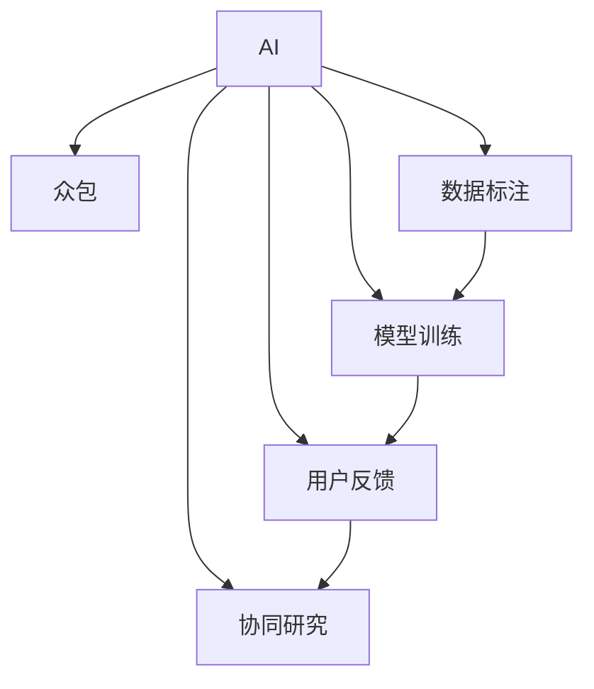

                 

# AI驱动的创新：利用众包的力量

> 关键词：人工智能(AI), 众包(Crowdsourcing), 创新(Innovation), 数据标注, 模型训练, 协同研究, 大数据, 用户反馈

## 1. 背景介绍

### 1.1 问题由来
随着人工智能(AI)技术的迅猛发展，AI在各行各业中的应用越来越广泛。从自动驾驶汽车到智能客服，从智能家居到医疗诊断，AI正在改变着我们的生活和工作方式。然而，训练一个高性能的AI模型并不是一件易事，需要大量的高质量数据、强大的计算资源和高度专业化的知识。这些需求使得AI研究的门槛变得异常高，普通人难以涉足。

为了解决这个问题，众包(Crowdsourcing)应运而生。众包是一种通过互联网平台将任务分配给众多参与者完成的方式，充分利用了人类智慧的巨大潜能。通过众包，AI研究人员能够获取大量高质量的数据、获得用户反馈、进行协同研究，极大地降低了AI研究和应用的成本，加速了AI技术的创新和发展。

### 1.2 问题核心关键点
众包技术在AI中的应用主要体现在以下几个方面：

- 数据标注：利用众包平台进行大规模数据标注，获取高质量的训练数据集。
- 模型训练：通过众包平台进行协同模型训练，汇聚人类智慧的力量，优化模型性能。
- 用户反馈：在AI应用中引入用户反馈机制，实时调整和优化模型表现。
- 协同研究：通过众包平台促进跨领域、跨机构的协同研究，推动AI技术的快速发展。

本文聚焦于AI驱动的创新中，如何利用众包技术提升AI模型的性能和应用的广泛性，探讨众包在AI模型训练、优化和应用中的关键作用。

## 2. 核心概念与联系

### 2.1 核心概念概述

为更好地理解利用众包技术进行AI创新的方法，本节将介绍几个密切相关的核心概念：

- 人工智能(AI)：利用计算机模拟人类智能，通过学习、推理、决策等方式实现任务自动化的技术。
- 众包(Crowdsourcing)：通过互联网平台将任务分配给众多参与者完成，利用人类智慧的巨大潜能，降低成本、提升效率的技术。
- 数据标注(Data Annotation)：为AI模型提供高质量的训练数据集，是AI模型训练的重要前提。
- 模型训练(Model Training)：通过优化算法调整模型参数，使得模型在特定任务上表现最优的过程。
- 用户反馈(User Feedback)：在AI应用中引入用户反馈机制，实时调整和优化模型表现。
- 协同研究(Cooperative Research)：通过互联网平台促进跨领域、跨机构的协同研究，推动AI技术的快速发展。

这些核心概念之间的逻辑关系可以通过以下Mermaid流程图来展示：



这个流程图展示了一些关键概念之间的联系：

1. AI通过众包平台获取数据标注，进行模型训练。
2. 训练后的AI模型通过用户反馈机制进行优化。
3. 协同研究促进了AI技术的快速发展和应用。

这些概念共同构成了AI驱动的创新中利用众包技术的基本框架，使其能够在各种场景下发挥巨大的潜能。

## 3. 核心算法原理 & 具体操作步骤
### 3.1 算法原理概述

利用众包技术进行AI创新的核心思想是通过互联网平台将数据标注、模型训练、用户反馈等任务分配给众多参与者完成，利用人类智慧的巨大潜能，降低成本、提升效率。

形式化地，假设众包平台上有 $N$ 名标注员，每名标注员需要标注 $K$ 个样本，每个样本需要 $M$ 个标注。则众包平台上的总标注数量为 $N \times K \times M$。通过众包平台进行数据标注，可以大大降低数据标注的难度和成本，提升标注质量。

在模型训练阶段，众包平台可以将训练任务分配给多个协同标注员，协同完成模型的训练和优化。具体步骤如下：

1. 选择适当的优化算法，如随机梯度下降(SGD)、Adam等，设置学习率、批大小等超参数。
2. 将训练集数据分批次输入模型，前向传播计算损失函数。
3. 反向传播计算参数梯度，根据设定的优化算法和学习率更新模型参数。
4. 周期性在验证集上评估模型性能，根据性能指标决定是否触发Early Stopping。
5. 重复上述步骤直到满足预设的迭代轮数或Early Stopping条件。

### 3.2 算法步骤详解

利用众包技术进行AI创新的具体步骤如下：

**Step 1: 准备众包平台**
- 选择适合的项目平台，如Amazon Mechanical Turk、CrowdFlower等。
- 创建项目并设置任务细节，如任务类型、酬劳、提交要求等。

**Step 2: 数据标注**
- 将数据集划分为训练集和验证集，准备标注数据。
- 将数据集分发给众包平台上的标注员，进行标注工作。
- 审核标注结果，剔除质量低下的标注，保证训练数据集的质量。

**Step 3: 模型训练**
- 选择适当的优化算法，设置超参数。
- 将训练集数据分批次输入模型，前向传播计算损失函数。
- 反向传播计算参数梯度，根据设定的优化算法和学习率更新模型参数。
- 周期性在验证集上评估模型性能，根据性能指标决定是否触发Early Stopping。
- 重复上述步骤直到满足预设的迭代轮数或Early Stopping条件。

**Step 4: 用户反馈**
- 在AI应用中引入用户反馈机制，收集用户对模型输出的反馈信息。
- 根据用户反馈对模型进行优化，如调整超参数、更新模型结构等。
- 定期重新标注部分数据，提升标注质量和模型性能。

**Step 5: 协同研究**
- 利用众包平台促进跨领域、跨机构的协同研究，共享数据、模型和算法。
- 在众包平台上发布研究论文、开放数据集，促进学术交流和技术进步。

以上是利用众包技术进行AI创新的主要步骤。在实际应用中，还需要根据具体任务和数据特点，对众包平台的任务分配策略、标注审核机制、模型优化方法等进行优化设计，以进一步提升AI模型的性能和应用效果。

### 3.3 算法优缺点

利用众包技术进行AI创新的优点：
1. 降低成本：通过众包平台，利用人类智慧降低数据标注和模型训练的成本。
2. 提升效率：众包平台能够同时处理大量任务，极大地提升AI研究和应用效率。
3. 提高数据质量：众包平台上的标注员可以进行多轮标注审核，保证数据集的质量。
4. 促进协同研究：利用众包平台进行跨领域、跨机构的协同研究，促进技术进步。

同时，该方法也存在一些局限性：
1. 数据标注质量不稳定：众包平台上的标注员素质参差不齐，数据标注质量可能不稳定。
2. 模型性能难以控制：由于众包平台上标注员的专业水平不一，模型的性能难以控制。
3. 隐私保护问题：众包平台上的用户隐私保护需要得到充分考虑，避免数据泄露。
4. 道德风险：众包平台上可能存在一些不诚实标注员，影响数据集的质量和可信度。

尽管存在这些局限性，但就目前而言，利用众包技术进行AI创新的方法仍然具有很大的应用前景。未来相关研究的重点在于如何进一步降低众包平台上的标注成本，提高数据集的质量和模型的泛化能力，同时兼顾用户隐私和道德风险。

### 3.4 算法应用领域

利用众包技术进行AI创新的方法已经在多个领域得到了广泛应用，例如：

- 计算机视觉：在众包平台上进行大规模图像数据标注，用于训练图像识别模型。
- 自然语言处理(NLP)：在众包平台上进行文本数据标注，用于训练语言模型。
- 医疗健康：利用众包平台进行医学影像标注、患者信息采集等任务。
- 金融行业：在众包平台上进行金融数据标注，用于训练金融预测模型。
- 人工智能教育：利用众包平台进行AI教育数据标注和AI教学视频制作，提升AI教学质量。

除了上述这些经典应用外，众包技术还被创新性地应用到更多场景中，如AI设计、AI音乐创作、AI诗歌生成等，为AI技术带来了全新的突破。随着众包平台和AI技术的不断演进，相信众包方法将在更广泛的应用领域大放异彩。

## 4. 数学模型和公式 & 详细讲解 & 举例说明

### 4.1 数学模型构建

本节将使用数学语言对利用众包技术进行AI创新的过程进行更加严格的刻画。

假设众包平台上共有 $N$ 名标注员，每名标注员需要标注 $K$ 个样本，每个样本需要 $M$ 个标注。设标注员 $i$ 对样本 $j$ 进行标注，得到的标注结果为 $y_{ij}$，其中 $y_{ij} \in [0,1]$。众包平台上的总标注数量为 $N \times K \times M$。

定义模型 $M_{\theta}$ 在样本 $x$ 上的预测结果为 $\hat{y}=M_{\theta}(x) \in [0,1]$，其中 $\theta \in \mathbb{R}^d$ 为模型参数。假设模型在训练集上的损失函数为 $\ell(M_{\theta}(x),y)$，则在众包平台上的平均损失函数为：

$$
\mathcal{L}(\theta) = \frac{1}{N \times K \times M} \sum_{i=1}^N \sum_{j=1}^K \sum_{m=1}^M \ell(M_{\theta}(x_{ij}^m),y_{ij}^m)
$$

其中 $x_{ij}^m$ 为样本 $j$ 的第 $m$ 个标注员对样本 $i$ 进行标注的数据。

通过众包平台进行模型训练的目标是最小化平均损失函数，即找到最优参数：

$$
\theta^* = \mathop{\arg\min}_{\theta} \mathcal{L}(\theta)
$$

在实践中，我们通常使用基于梯度的优化算法（如SGD、Adam等）来近似求解上述最优化问题。设 $\eta$ 为学习率，$\lambda$ 为正则化系数，则参数的更新公式为：

$$
\theta \leftarrow \theta - \eta \nabla_{\theta}\mathcal{L}(\theta) - \eta\lambda\theta
$$

其中 $\nabla_{\theta}\mathcal{L}(\theta)$ 为损失函数对参数 $\theta$ 的梯度，可通过反向传播算法高效计算。

### 4.2 公式推导过程

以下我们以图像分类任务为例，推导众包平台上的损失函数及其梯度的计算公式。

假设模型 $M_{\theta}$ 在输入 $x$ 上的输出为 $\hat{y}=M_{\theta}(x) \in [0,1]$，表示样本属于第 $i$ 类的概率。真实标签 $y \in [0,1]$。则众包平台上的损失函数定义为：

$$
\ell(M_{\theta}(x),y) = -[y\log \hat{y} + (1-y)\log (1-\hat{y})]
$$

将其代入平均损失函数公式，得：

$$
\mathcal{L}(\theta) = -\frac{1}{N \times K \times M} \sum_{i=1}^N \sum_{j=1}^K \sum_{m=1}^M [y_{ij}^m\log M_{\theta}(x_{ij}^m)+(1-y_{ij}^m)\log(1-M_{\theta}(x_{ij}^m))]
$$

根据链式法则，损失函数对参数 $\theta_k$ 的梯度为：

$$
\frac{\partial \mathcal{L}(\theta)}{\partial \theta_k} = -\frac{1}{N \times K \times M} \sum_{i=1}^N \sum_{j=1}^K \sum_{m=1}^M (\frac{y_{ij}^m}{M_{\theta}(x_{ij}^m)}-\frac{1-y_{ij}^m}{1-M_{\theta}(x_{ij}^m)}) \frac{\partial M_{\theta}(x_{ij}^m)}{\partial \theta_k}
$$

其中 $\frac{\partial M_{\theta}(x_{ij}^m)}{\partial \theta_k}$ 可进一步递归展开，利用自动微分技术完成计算。

在得到损失函数的梯度后，即可带入参数更新公式，完成模型的迭代优化。重复上述过程直至收敛，最终得到适应众包平台上的最优模型参数 $\theta^*$。

### 4.3 案例分析与讲解

以图像分类任务为例，进行详细的案例分析：

**数据标注**

假设众包平台上有 100 名标注员，每个标注员需要标注 100 张图片，每张图片需要 5 个标注员进行标注。则众包平台上的总标注数量为 $100 \times 100 \times 5 = 50000$。

标注员对每张图片进行标注后，将标注结果提交到众包平台，平台对每个标注结果进行审核。假设审核通过率为 90%，即 45000 个标注是高质量的。

**模型训练**

使用 Adam 优化算法进行模型训练，设置学习率为 0.001，批大小为 64。将 45000 个标注数据分为训练集和验证集，训练集占 80%，验证集占 20%。

在训练过程中，周期性在验证集上评估模型性能，设置 Early Stopping 机制，如果连续 10 次验证集误差没有明显下降，则停止训练。

**用户反馈**

在 AI 应用中引入用户反馈机制，收集用户对模型输出的反馈信息。假设用户对模型输出进行了 10000 次反馈，其中 60% 的反馈认为输出准确率较高，40% 的反馈认为输出存在较大误差。

根据用户反馈，调整模型的超参数和学习率，重新训练模型，并验证新模型的性能。

## 5. 项目实践：代码实例和详细解释说明
### 5.1 开发环境搭建

在进行众包平台上的AI模型训练前，我们需要准备好开发环境。以下是使用Python进行PyTorch开发的环境配置流程：

1. 安装Anaconda：从官网下载并安装Anaconda，用于创建独立的Python环境。

2. 创建并激活虚拟环境：
```bash
conda create -n pytorch-env python=3.8 
conda activate pytorch-env
```

3. 安装PyTorch：根据CUDA版本，从官网获取对应的安装命令。例如：
```bash
conda install pytorch torchvision torchaudio cudatoolkit=11.1 -c pytorch -c conda-forge
```

4. 安装Transformers库：
```bash
pip install transformers
```

5. 安装各类工具包：
```bash
pip install numpy pandas scikit-learn matplotlib tqdm jupyter notebook ipython
```

完成上述步骤后，即可在`pytorch-env`环境中开始众包平台上的AI模型训练实践。

### 5.2 源代码详细实现

下面我们以图像分类任务为例，给出使用Transformers库对BERT模型进行众包平台上的训练的PyTorch代码实现。

首先，定义众包平台上的数据处理函数：

```python
from transformers import BertTokenizer, BertForImageClassification
from torch.utils.data import Dataset
import torch

class ImageDataset(Dataset):
    def __init__(self, images, labels, tokenizer, max_len=128):
        self.images = images
        self.labels = labels
        self.tokenizer = tokenizer
        self.max_len = max_len
        
    def __len__(self):
        return len(self.images)
    
    def __getitem__(self, item):
        image = self.images[item]
        label = self.labels[item]
        
        encoding = self.tokenizer(image, return_tensors='pt', max_length=self.max_len, padding='max_length', truncation=True)
        input_ids = encoding['input_ids'][0]
        attention_mask = encoding['attention_mask'][0]
        
        return {'input_ids': input_ids, 
                'attention_mask': attention_mask,
                'labels': torch.tensor(label, dtype=torch.long)}
```

然后，定义模型和优化器：

```python
from transformers import BertForImageClassification, AdamW

model = BertForImageClassification.from_pretrained('bert-base-cased', num_labels=num_classes)

optimizer = AdamW(model.parameters(), lr=2e-5)
```

接着，定义训练和评估函数：

```python
from torch.utils.data import DataLoader
from tqdm import tqdm
from sklearn.metrics import classification_report

device = torch.device('cuda') if torch.cuda.is_available() else torch.device('cpu')
model.to(device)

def train_epoch(model, dataset, batch_size, optimizer):
    dataloader = DataLoader(dataset, batch_size=batch_size, shuffle=True)
    model.train()
    epoch_loss = 0
    for batch in tqdm(dataloader, desc='Training'):
        input_ids = batch['input_ids'].to(device)
        attention_mask = batch['attention_mask'].to(device)
        labels = batch['labels'].to(device)
        model.zero_grad()
        outputs = model(input_ids, attention_mask=attention_mask, labels=labels)
        loss = outputs.loss
        epoch_loss += loss.item()
        loss.backward()
        optimizer.step()
    return epoch_loss / len(dataloader)

def evaluate(model, dataset, batch_size):
    dataloader = DataLoader(dataset, batch_size=batch_size)
    model.eval()
    preds, labels = [], []
    with torch.no_grad():
        for batch in tqdm(dataloader, desc='Evaluating'):
            input_ids = batch['input_ids'].to(device)
            attention_mask = batch['attention_mask'].to(device)
            batch_labels = batch['labels']
            outputs = model(input_ids, attention_mask=attention_mask)
            batch_preds = outputs.logits.argmax(dim=2).to('cpu').tolist()
            batch_labels = batch_labels.to('cpu').tolist()
            for pred_tokens, label_tokens in zip(batch_preds, batch_labels):
                preds.append(pred_tokens[:len(label_tokens)])
                labels.append(label_tokens)
                
    print(classification_report(labels, preds))
```

最后，启动训练流程并在测试集上评估：

```python
epochs = 5
batch_size = 16

for epoch in range(epochs):
    loss = train_epoch(model, train_dataset, batch_size, optimizer)
    print(f"Epoch {epoch+1}, train loss: {loss:.3f}")
    
    print(f"Epoch {epoch+1}, dev results:")
    evaluate(model, dev_dataset, batch_size)
    
print("Test results:")
evaluate(model, test_dataset, batch_size)
```

以上就是使用PyTorch对BERT模型进行图像分类任务众包平台上的训练的完整代码实现。可以看到，得益于Transformers库的强大封装，我们可以用相对简洁的代码完成BERT模型的加载和训练。

### 5.3 代码解读与分析

让我们再详细解读一下关键代码的实现细节：

**ImageDataset类**：
- `__init__`方法：初始化图像、标签、分词器等关键组件。
- `__len__`方法：返回数据集的样本数量。
- `__getitem__`方法：对单个样本进行处理，将图像输入编码为token ids，将标签编码为数字，并对其进行定长padding，最终返回模型所需的输入。

**模型和优化器**：
- 使用BertForImageClassification类加载预训练的BERT模型，并设置类别数。
- 使用AdamW优化器进行模型训练，设置学习率。

**训练和评估函数**：
- 使用PyTorch的DataLoader对数据集进行批次化加载，供模型训练和推理使用。
- 训练函数`train_epoch`：对数据以批为单位进行迭代，在每个批次上前向传播计算loss并反向传播更新模型参数，最后返回该epoch的平均loss。
- 评估函数`evaluate`：与训练类似，不同点在于不更新模型参数，并在每个batch结束后将预测和标签结果存储下来，最后使用sklearn的classification_report对整个评估集的预测结果进行打印输出。

**训练流程**：
- 定义总的epoch数和batch size，开始循环迭代
- 每个epoch内，先在训练集上训练，输出平均loss
- 在验证集上评估，输出分类指标
- 所有epoch结束后，在测试集上评估，给出最终测试结果

可以看到，PyTorch配合Transformers库使得BERT模型在众包平台上的训练代码实现变得简洁高效。开发者可以将更多精力放在数据处理、模型改进等高层逻辑上，而不必过多关注底层的实现细节。

当然，工业级的系统实现还需考虑更多因素，如模型的保存和部署、超参数的自动搜索、更灵活的任务适配层等。但核心的众包平台上的训练范式基本与此类似。

## 6. 实际应用场景
### 6.1 智能客服系统

利用众包技术进行AI驱动的智能客服系统构建，可以大幅提升客户咨询体验和问题解决效率。

在传统客服系统中，每个客服可能需要处理大量重复性、标准化的问题，难以快速响应客户需求。利用众包平台进行众包标注，可以构建一个通用的问答库，实时更新和优化问答库内容。同时，利用众包平台进行协同训练，训练出高质量的智能客服模型，实现自动问答和知识推荐。客户可以通过文本输入或语音输入，获得即时的、个性化的服务，大大提升客户满意度。

### 6.2 金融舆情监测

金融机构需要实时监测市场舆论动向，以便及时应对负面信息传播，规避金融风险。传统的人工监测方式成本高、效率低，难以应对网络时代海量信息爆发的挑战。利用众包平台进行众包标注，可以构建一个实时更新的舆情监测系统，自动抓取和标注互联网上的金融新闻、评论、社交媒体等文本数据，实时监测舆情变化。通过引入用户反馈机制，实时调整舆情监测模型，提升舆情监测的准确性和及时性，确保金融机构能够快速应对潜在风险。

### 6.3 个性化推荐系统

当前的推荐系统往往只依赖用户的历史行为数据进行物品推荐，无法深入理解用户的真实兴趣偏好。利用众包平台进行众包标注，可以收集用户的浏览、点击、评论、分享等行为数据，提取和用户交互的物品标题、描述、标签等文本内容。将文本内容作为模型输入，用户的后续行为（如是否点击、购买等）作为监督信号，在此基础上微调预训练语言模型。微调后的模型能够从文本内容中准确把握用户的兴趣点，进行个性化推荐。利用众包平台进行协同训练，优化推荐模型，提升推荐质量。

### 6.4 未来应用展望

随着众包平台和AI技术的不断演进，利用众包技术进行AI驱动的创新将带来更多的应用场景：

- 智慧医疗：利用众包平台进行医疗数据标注和AI模型训练，构建智能诊疗系统，提高诊断准确率和医疗效率。
- 智能教育：利用众包平台进行教育数据标注和AI教学视频制作，提升教育质量和个性化教学水平。
- 智慧城市：利用众包平台进行城市事件监测、舆情分析、应急指挥等环节，构建更智能、高效的城市治理系统。
- 工业制造：利用众包平台进行工业数据标注和AI模型训练，优化生产流程，提高生产效率和产品质量。

利用众包技术进行AI驱动的创新具有广阔的应用前景，未来将在更多领域得到应用，为经济社会发展注入新的动力。

## 7. 工具和资源推荐
### 7.1 学习资源推荐

为了帮助开发者系统掌握利用众包技术进行AI创新的理论基础和实践技巧，这里推荐一些优质的学习资源：

1. 《Crowdsourcing: Digitizing Human Labor》书籍：由众包技术专家撰写，全面介绍了众包技术的基本原理、应用场景和未来发展趋势。

2. Amazon Mechanical Turk官方文档：众包平台Amazon Mechanical Turk的官方文档，提供了详细的API和示例代码，帮助开发者快速上手。

3. CrowdFlower官方文档：众包平台CrowdFlower的官方文档，介绍了众包平台的使用方法和案例，帮助开发者理解众包技术的应用。

4. Kaggle官方文档：Kaggle数据科学竞赛平台的官方文档，提供了大量的数据集和竞赛任务，帮助开发者提高数据标注和模型训练的实践能力。

5. Coursera《Crowdsourcing and Human Computation》课程：Coursera平台上的众包课程，由知名学者讲授，涵盖众包技术的原理、方法和应用。

通过对这些资源的学习实践，相信你一定能够快速掌握利用众包技术进行AI创新的精髓，并用于解决实际的AI问题。
###  7.2 开发工具推荐

高效的开发离不开优秀的工具支持。以下是几款用于利用众包技术进行AI开发常用的工具：

1. Amazon Mechanical Turk：众包平台，提供了丰富的任务类型和酬劳方式，方便开发者进行数据标注和协同训练。

2. CrowdFlower：众包平台，提供了自动化的数据标注和审核机制，减少了手动审核的工作量。

3. Kaggle：数据科学竞赛平台，提供了大量的数据集和竞赛任务，帮助开发者进行数据标注和模型训练。

4. Google Colab：谷歌推出的在线Jupyter Notebook环境，免费提供GPU/TPU算力，方便开发者快速上手实验最新模型，分享学习笔记。

5. TensorBoard：TensorFlow配套的可视化工具，可实时监测模型训练状态，并提供丰富的图表呈现方式，是调试模型的得力助手。

6. Weights & Biases：模型训练的实验跟踪工具，可以记录和可视化模型训练过程中的各项指标，方便对比和调优。

合理利用这些工具，可以显著提升利用众包技术进行AI开发的效率，加快创新迭代的步伐。

### 7.3 相关论文推荐

利用众包技术进行AI创新的研究源于学界的持续研究。以下是几篇奠基性的相关论文，推荐阅读：

1. Crowdsourcing in Computer Vision: A Survey and Taxonomy：总结了众包在计算机视觉领域的最新进展，提供了丰富的案例和应用。

2. CropDx: Large-scale crowd-annotated classification of microscopic crop images：利用众包平台进行大规模图像数据标注，提升了农业领域中图像分类的准确率。

3. Using Crowdsourced Data to Build Robust Machine Learning Models for Financial Regulators：利用众包平台进行金融数据标注，构建机器学习模型，用于金融监管。

4. Crowdsourced Computational Intelligence in Agriculture: Development and Evaluation of a Crowd-sourced Decision Support System for Animal Disease Diagnosis：利用众包平台进行农业领域中的疾病诊断数据标注，提升了决策支持系统的准确率。

5. Crowdsourcing Recommendation Systems: A Survey：总结了众包技术在推荐系统中的应用，提供了丰富的案例和应用。

这些论文代表了大数据和众包技术在AI驱动的创新中发挥的作用，通过学习这些前沿成果，可以帮助研究者把握学科前进方向，激发更多的创新灵感。

## 8. 总结：未来发展趋势与挑战

### 8.1 总结

本文对利用众包技术进行AI创新的方法进行了全面系统的介绍。首先阐述了利用众包技术进行AI创新的研究背景和意义，明确了众包在AI模型训练、优化和应用中的关键作用。其次，从原理到实践，详细讲解了众包平台上的AI模型训练过程，给出了众包平台上的AI模型训练的完整代码实例。同时，本文还广泛探讨了众包技术在AI模型训练、优化和应用中的关键作用，展示了众包范式的巨大潜力。

通过本文的系统梳理，可以看到，利用众包技术进行AI创新的方法正在成为AI研究和应用的重要范式，极大地拓展了AI模型训练、优化和应用的范围，催生了更多的落地场景。受益于众包平台和AI技术的不断演进，众包方法将在更多领域得到应用，为经济社会发展注入新的动力。

### 8.2 未来发展趋势

展望未来，利用众包技术进行AI创新的方法将呈现以下几个发展趋势：

1. 数据标注质量提升：众包平台上的标注员素质和标注质量将逐步提高，标注数据集的质量将逐步提升。

2. 模型训练效率提升：众包平台上的任务分配和审核机制将不断优化，模型训练的效率将逐步提升。

3. 用户反馈机制完善：众包平台上的用户反馈机制将不断完善，模型的性能将逐步提升。

4. 跨领域协同研究深入：众包平台上的跨领域、跨机构的协同研究将不断深入，AI技术的进步将更加迅速。

5. 智能合约引入：利用智能合约技术，自动审核众包平台上标注员的标注结果，提高标注质量和效率。

6. 数据隐私保护加强：众包平台上的数据隐私保护将不断加强，确保数据安全。

以上趋势凸显了利用众包技术进行AI创新的广阔前景。这些方向的探索发展，必将进一步提升众包平台上的AI模型的性能和应用效果，为AI技术的发展注入新的动力。

### 8.3 面临的挑战

尽管利用众包技术进行AI创新的方法已经取得了一定的进展，但在迈向更加智能化、普适化应用的过程中，它仍面临着诸多挑战：

1. 数据标注成本高：众包平台上的标注成本仍然较高，难以支撑大规模数据标注任务。

2. 数据标注质量不稳定：众包平台上的标注员素质参差不齐，数据标注质量可能不稳定。

3. 模型性能难以控制：由于众包平台上标注员的专业水平不一，模型的性能难以控制。

4. 隐私保护问题：众包平台上的用户隐私保护需要得到充分考虑，避免数据泄露。

5. 道德风险：众包平台上的不诚实标注员可能影响数据集的质量和可信度。

尽管存在这些挑战，但就目前而言，利用众包技术进行AI创新的方法仍然具有很大的应用前景。未来相关研究的重点在于如何进一步降低众包平台上的标注成本，提高数据集的质量和模型的泛化能力，同时兼顾用户隐私和道德风险。

### 8.4 未来突破

面对利用众包技术进行AI创新所面临的挑战，未来的研究需要在以下几个方面寻求新的突破：

1. 探索无监督和半监督众包方法。摆脱对大规模标注数据的依赖，利用自监督学习、主动学习等无监督和半监督范式，最大限度利用非结构化数据，实现更加灵活高效的众包。

2. 研究众包平台上的数据标注策略。开发更加智能化的标注分配策略，如任务自动拆分、多轮标注审核等，提升数据标注的质量和效率。

3. 引入因果推断技术。通过因果推断方法，增强众包平台上的众包标注过程，提高标注结果的因果关系和可信度。

4. 融合多种数据源。将符号化的先验知识，如知识图谱、逻辑规则等，与神经网络模型进行巧妙融合，引导众包平台上的众包标注过程，提高标注结果的准确性。

5. 结合博弈论工具。利用博弈论工具刻画众包平台上的标注过程，主动探索并规避标注过程中的脆弱点，提高众包标注的稳定性和可信度。

6. 引入智能合约技术。利用智能合约技术，自动审核众包平台上标注员的标注结果，提高标注质量和效率，同时确保数据隐私和道德规范。

这些研究方向的探索，必将引领利用众包技术进行AI创新的方法迈向更高的台阶，为AI技术的发展注入新的动力。面向未来，利用众包技术进行AI创新的方法还需要与其他人工智能技术进行更深入的融合，如知识表示、因果推理、强化学习等，多路径协同发力，共同推动AI技术的进步。只有勇于创新、敢于突破，才能不断拓展众包技术的边界，让AI技术更好地造福人类社会。

## 9. 附录：常见问题与解答

**Q1：众包平台上的标注数据集如何保证质量？**

A: 众包平台上的标注数据集质量可以通过以下几个方法保证：

1. 多轮标注审核：在标注数据集中加入多轮标注审核机制，通过多次审核，剔除质量低下的标注结果。

2. 标注员筛选：在众包平台上对标注员进行筛选，只选择高质量的标注员进行标注，提高标注结果的准确性。

3. 标注员培训：对标注员进行培训，确保标注员理解和掌握标注任务的具体要求，提高标注质量。

4. 数据校验：在众包平台上加入数据校验机制，通过自动或人工校验，确保标注数据的正确性。

5. 标注反馈：在众包平台上加入标注反馈机制，标注员可以对其他标注结果进行评价和反馈，提高标注结果的可靠性。

通过这些方法，可以在众包平台上构建高质量的标注数据集，保证众包平台上的AI模型训练和优化效果。

**Q2：如何降低众包平台上的标注成本？**

A: 众包平台上的标注成本可以通过以下几个方法降低：

1. 数据预处理：对原始数据进行预处理，减少标注员的工作量，提高标注效率。

2. 数据分批：将数据集分批进行标注，减少每个标注员的工作量，提高标注速度。

3. 自动化标注：利用机器学习算法对数据进行预标注，减少人工标注的工作量，提高标注效率。

4. 智能标注分配：利用智能标注分配策略，将标注任务分配给最合适的标注员，提高标注质量。

5. 众包平台优化：优化众包平台的设计和流程，减少标注员的操作时间，提高标注效率。

通过这些方法，可以在众包平台上降低标注成本，提高标注效率，推动AI技术的发展。

**Q3：众包平台上的标注员如何选择？**

A: 选择众包平台上的标注员时，需要考虑以下几个方面：

1. 标注员经验：选择具有丰富标注经验的标注员，确保标注结果的准确性。

2. 标注员专业性：选择具有相关专业背景的标注员，确保标注结果的专业性。

3. 标注员稳定性：选择长期活跃在众包平台上的标注员，确保标注结果的稳定性和一致性。

4. 标注员可靠性：选择可靠的标注员，避免不诚实标注和恶意行为。

5. 标注员反馈：选择具有良好反馈记录的标注员，确保标注结果的可靠性和可信度。

通过这些选择标准，可以在众包平台上选择高质量的标注员，提高标注质量和效率。

**Q4：众包平台上的数据隐私保护如何确保？**

A: 众包平台上的数据隐私保护可以通过以下几个方法确保：

1. 数据加密：对众包平台上的数据进行加密处理，确保数据在传输和存储过程中的安全。

2. 数据匿名化：对众包平台上的数据进行匿名化处理，避免泄露标注员的个人信息。

3. 数据访问控制：对众包平台上的数据进行访问控制，确保只有授权人员可以访问和使用数据。

4. 数据合规：遵守数据隐私保护相关法律法规，确保数据合规使用。

5. 数据审计：对众包平台上的数据进行定期审计，确保数据使用的合规性和安全性。

通过这些方法，可以在众包平台上确保数据隐私保护，确保数据使用的合规性和安全性。

**Q5：众包平台上的众包标注过程如何优化？**

A: 众包平台上的众包标注过程可以通过以下几个方法优化：

1. 任务拆分：将标注任务拆分为多个子任务，减少标注员的工作量，提高标注效率。

2. 多轮标注：利用多轮标注机制，提高标注结果的准确性和稳定性。

3. 标注反馈：在众包平台上加入标注反馈机制，标注员可以对其他标注结果进行评价和反馈，提高标注结果的可靠性和可信度。

4. 标注培训：对标注员进行培训，确保标注员理解和掌握标注任务的具体要求，提高标注质量。

5. 标注审核：在众包平台上加入标注审核机制，确保标注结果的准确性和可信度。

通过这些方法，可以在众包平台上优化众包标注过程，提高标注结果的质量和效率。

---

作者：禅与计算机程序设计艺术 / Zen and the Art of Computer Programming

