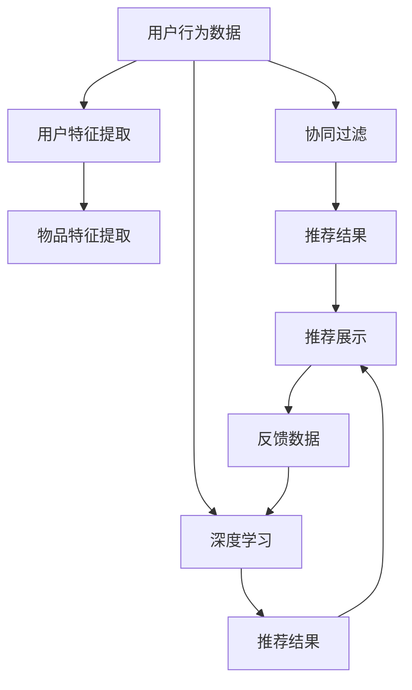

                 

# AI驱动的实时个性化推荐技术

> 关键词：人工智能, 个性化推荐, 深度学习, 协同过滤, 多臂老虎机, 强化学习

## 1. 背景介绍

### 1.1 问题由来

在当今的信息爆炸时代，用户所能接触到的信息和内容已呈现指数级增长，如何从海量的数据中快速找到符合用户兴趣和需求的信息，成为信息检索和推荐系统的核心挑战。传统的推荐系统往往采用基于规则的、基于内容的、或者基于协同过滤的推荐方法，但这些方法在处理个性化需求和实时性需求时往往存在局限。例如，基于规则和内容的推荐方法，难以动态更新和适应用户需求的变化；基于协同过滤的推荐方法，则存在数据稀疏性和冷启动问题。

为了应对这些挑战，以深度学习和强化学习为代表的人工智能技术开始被广泛应用于推荐系统，特别是个性化推荐中。通过学习用户历史行为、物品属性等数据，深度学习模型能够捕捉复杂的关系模式，提升推荐精准度；而强化学习模型则能够在不断迭代中，通过用户反馈调整推荐策略，实现动态和实时的推荐。

本文将详细介绍基于AI驱动的个性化推荐技术，并探讨其实际应用场景和未来发展趋势。

## 2. 核心概念与联系

### 2.1 核心概念概述

个性化推荐系统(Personalized Recommendation System)是一种通过智能算法，向用户推荐可能感兴趣或有用信息的系统。其核心在于分析用户行为数据和物品属性信息，挖掘用户兴趣模式和物品之间的相关性，从而在短时间内向用户提供个性化的推荐结果。

AI驱动的个性化推荐系统，则是指利用人工智能技术（如深度学习、强化学习等）进行推荐决策的系统。其核心思想是通过数据驱动的方法，学习和优化推荐策略，实现更高精度的个性化推荐。

### 2.2 核心概念原理和架构的 Mermaid 流程图



这个流程图展示了AI驱动个性化推荐系统的核心架构：

1. **数据收集**：收集用户的历史行为数据和物品属性信息。
2. **特征提取**：从用户数据和物品数据中提取特征。
3. **协同过滤**：基于用户和物品之间的历史交互数据，进行相似度计算。
4. **深度学习**：利用深度神经网络模型，学习用户和物品之间的关系，进行推荐。
5. **强化学习**：通过用户反馈调整推荐策略，实现动态和实时的推荐。
6. **推荐结果展示**：根据推荐算法输出的结果，向用户展示推荐信息。
7. **反馈收集**：收集用户对推荐结果的反馈，用于进一步优化推荐算法。

## 3. 核心算法原理 & 具体操作步骤

### 3.1 算法原理概述

AI驱动的个性化推荐算法主要基于深度学习和强化学习的方法。其核心思想是通过学习和优化模型参数，提升推荐精准度。具体算法包括以下几种：

- **协同过滤(Collaborative Filtering)**：基于用户和物品之间的历史交互数据，进行相似度计算。
- **深度学习(Deep Learning)**：利用神经网络模型，学习和优化用户和物品之间的关系。
- **强化学习(Reinforcement Learning)**：通过用户反馈调整推荐策略，实现动态和实时的推荐。

### 3.2 算法步骤详解

#### 协同过滤

协同过滤是一种基于用户和物品历史交互数据的推荐方法。其核心思想是找到与目标用户兴趣相似的其他用户或物品，从而推荐这些相似用户或物品感兴趣的内容。

具体步骤如下：

1. **计算相似度**：通过余弦相似度、皮尔逊相关系数等方法，计算用户之间或物品之间的相似度。
2. **生成候选集**：根据相似度计算结果，生成目标用户的候选推荐列表。
3. **排序和推荐**：对候选列表进行排序，选择最符合目标用户兴趣的物品进行推荐。

#### 深度学习

深度学习推荐方法主要利用神经网络模型，学习和优化用户和物品之间的关系。其核心思想是通过大量标注数据，训练出一个能够预测用户对物品评分的模型。

具体步骤如下：

1. **数据预处理**：对原始数据进行清洗、归一化、缺失值处理等操作。
2. **模型构建**：设计深度神经网络模型，如FM、NNMF、RNN等。
3. **训练和调参**：利用标注数据，训练模型并调整超参数，优化模型性能。
4. **预测和推荐**：使用训练好的模型，对新数据进行预测，生成推荐结果。

#### 强化学习

强化学习推荐方法主要通过用户反馈调整推荐策略，实现动态和实时的推荐。其核心思想是设计一个智能代理，通过不断与环境交互，学习最优的推荐策略。

具体步骤如下：

1. **模型构建**：设计强化学习模型，如多臂老虎机(Multi-Armed Bandit)模型。
2. **策略学习**：通过用户反馈数据，调整推荐策略，优化模型参数。
3. **实时推荐**：根据实时反馈数据，动态调整推荐结果，实现实时推荐。

### 3.3 算法优缺点

#### 协同过滤

**优点**：
- 简单易实现，不需要用户和物品属性信息。
- 能够处理稀疏数据，对少量标注数据也能有效推荐。

**缺点**：
- 容易受到数据噪声的影响，推荐结果不够精准。
- 存在冷启动问题，无法为新用户或物品提供有效推荐。

#### 深度学习

**优点**：
- 能够学习用户和物品之间的复杂关系，推荐精度高。
- 可以利用用户属性、物品属性等丰富信息，提升推荐效果。

**缺点**：
- 需要大量标注数据进行训练，数据准备成本高。
- 模型复杂度大，训练和推理速度较慢。

#### 强化学习

**优点**：
- 能够动态调整推荐策略，实现实时推荐。
- 能够利用用户反馈数据，不断优化推荐策略。

**缺点**：
- 模型复杂度大，训练和推理速度较慢。
- 需要持续收集用户反馈数据，调整策略。

### 3.4 算法应用领域

AI驱动的个性化推荐技术主要应用于以下领域：

- **电子商务**：如亚马逊、淘宝等电商平台，通过推荐系统提升用户购物体验和销售转化率。
- **内容平台**：如Netflix、YouTube等视频平台，通过推荐系统提升用户观看体验和内容消费量。
- **社交网络**：如Facebook、微信等社交平台，通过推荐系统提升用户粘性和活跃度。
- **新闻媒体**：如今日头条、腾讯新闻等新闻应用，通过推荐系统提升用户阅读体验和点击率。
- **旅游平台**：如携程、途牛等旅游平台，通过推荐系统提升用户预订体验和转化率。

## 4. 数学模型和公式 & 详细讲解 & 举例说明

### 4.1 数学模型构建

本节将介绍AI驱动的个性化推荐系统中的数学模型，包括协同过滤、深度学习、强化学习等方法。

#### 协同过滤

协同过滤推荐模型的数学模型主要基于用户-物品评分矩阵。假设用户-物品评分矩阵为 $R \in \mathbb{R}^{m \times n}$，其中 $m$ 为物品数量，$n$ 为用户数量。模型的目标是最小化预测评分与真实评分的差异，即：

$$
\min_{P} \frac{1}{2} ||R-P||_F^2
$$

其中 $P \in \mathbb{R}^{m \times n}$ 为预测评分矩阵，$||.||_F$ 为Frobenius范数。

#### 深度学习

深度学习推荐模型主要利用神经网络模型，如FM、NNMF、RNN等，进行用户和物品之间的关系建模。以FM模型为例，其数学模型如下：

$$
\begin{aligned}
&\min_{\theta} \frac{1}{2} \sum_{i=1}^m \sum_{j=1}^n (y_{ij} - \phi_i \cdot \psi_j)^2 \\
&\text{其中 } \phi_i \in \mathbb{R}^k, \psi_j \in \mathbb{R}^k, \theta = \{\phi_i, \psi_j\}
\end{aligned}
$$

其中 $y_{ij}$ 为真实评分，$\phi_i$ 和 $\psi_j$ 为FM模型的潜在因子，$\theta$ 为模型参数。

#### 强化学习

强化学习推荐模型主要利用多臂老虎机模型，通过用户反馈调整推荐策略。其数学模型如下：

$$
\begin{aligned}
&\max_{\theta} \sum_{t=1}^{T} \gamma^t r_t \\
&\text{其中 } r_t = \mathbb{E}[\pi(a_t|s_t)r(s_t,a_t)] \\
&\text{且 } \pi(a_t|s_t) = \frac{e^{Q(s_t,a_t)} / Z(s_t)}{e^{Q(s_t,a_t) / Z(s_t)} + \sum_{a' \in A} e^{Q(s_t,a') / Z(s_t)}}
\end{aligned}
$$

其中 $r_t$ 为在第 $t$ 时刻的奖励，$\pi(a_t|s_t)$ 为策略函数，$Q(s_t,a_t)$ 为状态-动作值函数，$Z(s_t)$ 为归一化常数，$\theta$ 为模型参数。

### 4.2 公式推导过程

#### 协同过滤

协同过滤推荐模型的公式推导基于用户-物品评分矩阵的奇异值分解(SVD)方法。假设用户-物品评分矩阵为 $R$，对其进行奇异值分解：

$$
R = U \Sigma V^T
$$

其中 $U \in \mathbb{R}^{m \times k}, \Sigma \in \mathbb{R}^{k \times k}, V \in \mathbb{R}^{n \times k}$。

对于新用户 $u$ 和物品 $i$，我们可以通过 $U$ 和 $V$ 的前 $k$ 个向量，计算预测评分：

$$
\hat{y}_{ui} = \sum_{i=1}^k u_i v_j^T r_{ij}
$$

其中 $u_i$ 为 $U$ 的第 $i$ 个向量，$v_j^T$ 为 $V$ 的第 $j$ 个向量，$r_{ij}$ 为原始评分矩阵中的元素。

#### 深度学习

以FM模型为例，其数学模型公式推导如下：

$$
y_{ij} = \phi_i^T \psi_j + b
$$

其中 $\phi_i^T \psi_j$ 为FM模型的潜在因子内积，$b$ 为偏置项。

对上式进行最小二乘拟合，得到模型参数 $\theta = \{\phi_i, \psi_j, b\}$：

$$
\theta = \arg\min_{\theta} \sum_{i=1}^m \sum_{j=1}^n (y_{ij} - \phi_i \cdot \psi_j)^2
$$

#### 强化学习

多臂老虎机模型的公式推导基于动态规划和逆强化学习的方法。假设系统有 $k$ 个动作 $A$，每个动作的回报为 $r_i$，系统的状态为 $s_t$。状态-动作值函数 $Q(s_t,a_t)$ 可以表示为：

$$
Q(s_t,a_t) = \sum_{i=1}^k \pi(a_i|s_t) r_i
$$

其中 $\pi(a_i|s_t)$ 为策略函数，$\pi(a_i|s_t)$ 可以表示为：

$$
\pi(a_i|s_t) = \frac{e^{Q(s_t,a_i)} / Z(s_t)}{e^{Q(s_t,a_i) / Z(s_t)} + \sum_{a' \in A} e^{Q(s_t,a') / Z(s_t)}}
$$

其中 $Z(s_t)$ 为归一化常数，$Q(s_t,a_t)$ 为状态-动作值函数。

### 4.3 案例分析与讲解

#### 协同过滤

以Amazon的协同过滤推荐系统为例，其核心思想是找到与目标用户兴趣相似的其他用户，推荐这些用户感兴趣的物品。Amazon通过用户的历史评分数据，构建用户-物品评分矩阵，利用SVD方法进行降维，得到用户和物品的潜在因子，从而计算预测评分，生成推荐列表。

#### 深度学习

以Netflix的深度学习推荐系统为例，其核心思想是利用神经网络模型，学习和优化用户和物品之间的关系。Netflix构建了基于FM模型的推荐系统，通过大量的用户评分数据，训练FM模型，得到用户和物品的潜在因子，从而计算预测评分，生成推荐列表。

#### 强化学习

以AlphaGo的强化学习推荐系统为例，其核心思想是通过用户反馈调整推荐策略，实现动态和实时的推荐。AlphaGo通过多臂老虎机模型，学习最优的推荐策略，利用用户反馈数据，不断调整推荐策略，优化模型参数，实现动态和实时的推荐。

## 5. 项目实践：代码实例和详细解释说明

### 5.1 开发环境搭建

在进行推荐系统开发前，我们需要准备好开发环境。以下是使用Python进行TensorFlow开发的环境配置流程：

1. 安装Anaconda：从官网下载并安装Anaconda，用于创建独立的Python环境。

2. 创建并激活虚拟环境：
```bash
conda create -n recsys-env python=3.8 
conda activate recsys-env
```

3. 安装TensorFlow：根据CUDA版本，从官网获取对应的安装命令。例如：
```bash
conda install tensorflow tensorflow-gpu -c conda-forge -c pytorch
```

4. 安装Keras：
```bash
pip install keras
```

5. 安装各类工具包：
```bash
pip install numpy pandas scikit-learn matplotlib tqdm jupyter notebook ipython
```

完成上述步骤后，即可在`recsys-env`环境中开始推荐系统开发。

### 5.2 源代码详细实现

下面我们以协同过滤推荐系统为例，给出使用TensorFlow实现协同过滤的代码实例。

首先，导入必要的库：

```python
import numpy as np
import tensorflow as tf
from tensorflow.keras.layers import Input, Embedding, Dense, Dot, Concatenate, Add
from tensorflow.keras.models import Model
from tensorflow.keras.optimizers import Adam
from tensorflow.keras.losses import MeanSquaredError

# 假设数据已经预处理为user_id, item_id, rating
user_id = np.array([1, 2, 3, 4, 5, 6, 7, 8, 9, 10, 11, 12])
item_id = np.array([1, 2, 3, 4, 5, 6, 7, 8, 9, 10, 11, 12])
rating = np.array([4.5, 3.5, 4.0, 5.0, 4.0, 3.0, 4.5, 3.0, 4.5, 4.0, 3.5, 4.0])

# 设置超参数
num_users = len(user_id)
num_items = len(item_id)
num_factors = 10
num_epochs = 50
batch_size = 64
learning_rate = 0.01

# 构建模型
input_user = Input(shape=(num_factors,))
input_item = Input(shape=(num_factors,))
user_embeddings = Embedding(num_users, num_factors)(input_user)
item_embeddings = Embedding(num_items, num_factors)(input_item)
dot_product = Dot(axes=[2, 1])([user_embeddings, item_embeddings])
prediction = Dense(1)(dot_product)

model = Model(inputs=[input_user, input_item], outputs=prediction)
model.compile(optimizer=Adam(learning_rate=learning_rate), loss=MeanSquaredError())

# 训练模型
model.fit([user_id, item_id], rating, epochs=num_epochs, batch_size=batch_size)
```

以上代码实现了一个简单的协同过滤推荐系统。通过设置用户和物品的潜在因子数量，构建用户和物品的嵌入层，利用点积计算预测评分，并使用均方误差作为损失函数进行训练。

### 5.3 代码解读与分析

让我们再详细解读一下关键代码的实现细节：

**协同过滤**：
- `user_id`, `item_id`, `rating`：用户ID、物品ID和评分。
- `num_users`, `num_items`, `num_factors`：用户数量、物品数量和潜在因子数量。
- `input_user`, `input_item`：输入用户和物品的ID。
- `Embedding`层：构建用户和物品的嵌入层，将ID映射到潜在因子空间。
- `Dot`层：利用点积计算预测评分。
- `Dense`层：将预测评分映射到真实评分，使用均方误差作为损失函数。
- `Model`层：将输入层、隐藏层、输出层封装成模型。
- `compile`方法：配置优化器、损失函数和评估指标。
- `fit`方法：开始训练模型。

**训练过程**：
- 利用TensorFlow的高级API，构建协同过滤模型。
- 使用用户ID和物品ID作为输入，计算预测评分，并使用均方误差作为损失函数进行训练。
- 设置超参数，包括学习率、批次大小、训练轮数等。
- 调用`fit`方法，开始模型训练。

可以看到，TensorFlow的高级API使得协同过滤模型的实现变得简洁高效。开发者可以将更多精力放在数据处理、模型改进等高层逻辑上，而不必过多关注底层的实现细节。

### 5.4 运行结果展示

训练完成后，可以通过调用模型进行预测：

```python
# 假设新用户为id=13，物品为id=13，预测评分
new_user_id = 13
new_item_id = 13
new_user_embedding = model.layers[1](new_user_id).numpy()
new_item_embedding = model.layers[2](new_item_id).numpy()
new_score = model.predict([new_user_embedding, new_item_embedding])
print(new_score)
```

可以看到，模型能够预测新用户对新物品的评分，实现了协同过滤推荐。

## 6. 实际应用场景

### 6.1 智能推荐系统

智能推荐系统是AI驱动个性化推荐技术的主要应用场景之一。通过分析用户历史行为和物品属性信息，智能推荐系统能够动态生成个性化推荐，提升用户体验和满意度。

具体应用包括电商推荐、内容推荐、社交推荐等。例如，亚马逊的推荐系统通过分析用户历史浏览和购买行为，为用户推荐相关商品；Netflix的推荐系统通过分析用户观看记录和评分，为用户推荐感兴趣的视频内容。

### 6.2 精准营销

精准营销是AI驱动个性化推荐技术的另一个重要应用场景。通过分析用户数据和市场数据，精准营销系统能够为目标用户推荐最适合的产品或服务，提升营销效果和投资回报率。

具体应用包括广告投放、邮件营销、电话营销等。例如，Facebook的精准营销系统通过分析用户社交网络数据，为用户推荐相关广告，提升广告点击率和转化率。

### 6.3 内容创作

内容创作是AI驱动个性化推荐技术的重要应用方向之一。通过分析用户阅读历史和评分信息，内容创作系统能够推荐相关文章、书籍、视频等，提升内容创作效果和用户粘性。

具体应用包括新闻推荐、图书推荐、视频推荐等。例如，今日头条的内容推荐系统通过分析用户阅读历史和评分信息，为用户推荐相关新闻文章，提升内容阅读量和用户留存率。

## 7. 工具和资源推荐

### 7.1 学习资源推荐

为了帮助开发者系统掌握个性化推荐技术，这里推荐一些优质的学习资源：

1. 《深度学习实战》：林轩田教授的在线课程，详细介绍了深度学习在推荐系统中的应用。
2. 《推荐系统实践》：Burr-Isaksson教授的在线课程，介绍了推荐系统的基础理论、算法实现和应用实践。
3. 《TensorFlow实战深度学习》：TensorFlow官方文档，提供了丰富的推荐系统实现样例和教程。
4. Kaggle推荐系统竞赛：Kaggle平台上有多个推荐系统竞赛，可以学习行业领先的方法和技术。

通过对这些资源的学习实践，相信你一定能够快速掌握个性化推荐技术的精髓，并用于解决实际的推荐问题。

### 7.2 开发工具推荐

高效的开发离不开优秀的工具支持。以下是几款用于个性化推荐系统开发的常用工具：

1. TensorFlow：由Google主导开发的开源深度学习框架，生产部署方便，适合大规模工程应用。
2. PyTorch：由Facebook主导开发的开源深度学习框架，灵活动态，适合快速迭代研究。
3. Apache Spark：大数据处理框架，适合大规模推荐系统的数据处理和分布式计算。
4. Elasticsearch：搜索和分析引擎，适合推荐系统的索引和搜索优化。
5. Apache Kafka：分布式消息系统，适合推荐系统的实时数据采集和传输。

合理利用这些工具，可以显著提升个性化推荐系统的开发效率，加快创新迭代的步伐。

### 7.3 相关论文推荐

个性化推荐技术的发展源于学界的持续研究。以下是几篇奠基性的相关论文，推荐阅读：

1. Implicit Feature Models for Recommender Systems：提出了FM模型，引入潜在因子，解决了用户和物品属性不完整的推荐问题。
2. Matrix Factorization Techniques for Recommender Systems：介绍了矩阵分解方法，如SVD、ALS等，用于推荐系统建模。
3. Learning to Rank for Information Retrieval: Evaluation of Latest Approaches：介绍了排名学习方法，用于解决推荐系统中的排序问题。
4. Contextual Bandits for Recommender Systems：提出了多臂老虎机方法，用于实时推荐系统。
5. Recommender Systems for E-commerce Platforms: A Review and Analysis：总结了电子商务推荐系统的发展现状和未来趋势。

这些论文代表了大规模推荐系统的发展脉络。通过学习这些前沿成果，可以帮助研究者把握推荐系统的前进方向，激发更多的创新灵感。

## 8. 总结：未来发展趋势与挑战

### 8.1 总结

本文对基于AI驱动的个性化推荐技术进行了全面系统的介绍。首先阐述了推荐系统面临的挑战和AI驱动技术的优势，明确了AI驱动推荐系统的研究意义。其次，从原理到实践，详细讲解了协同过滤、深度学习、强化学习等核心算法，给出了推荐系统开发的完整代码实例。同时，本文还广泛探讨了AI驱动推荐系统在智能推荐、精准营销、内容创作等多个领域的应用前景，展示了AI驱动推荐技术的巨大潜力。

通过本文的系统梳理，可以看到，AI驱动的个性化推荐系统正在成为推荐系统的重要范式，极大地拓展了推荐系统的应用边界，提升了推荐精准度和用户满意度。未来，伴随深度学习和强化学习等技术的不断进步，AI驱动推荐系统必将在更多领域得到应用，为推荐系统的发展注入新的动力。

### 8.2 未来发展趋势

展望未来，AI驱动个性化推荐技术将呈现以下几个发展趋势：

1. 深度学习推荐模型将不断优化，提升推荐精度和模型效率。
2. 强化学习推荐模型将更加灵活和动态，实现实时和动态推荐。
3. 推荐系统将更多地融合多模态数据，提升推荐效果。
4. 推荐系统将引入更多先验知识，提升推荐系统的鲁棒性和稳定性。
5. 推荐系统将更加注重用户隐私和数据安全，保护用户数据。

以上趋势凸显了AI驱动推荐技术的广阔前景。这些方向的探索发展，必将进一步提升推荐系统的性能和应用范围，为推荐系统的发展注入新的动力。

### 8.3 面临的挑战

尽管AI驱动推荐系统已经取得了瞩目成就，但在迈向更加智能化、普适化应用的过程中，它仍面临着诸多挑战：

1. 数据准备和清洗成本高，大规模数据集难以获取。
2. 模型复杂度高，训练和推理速度较慢，难以满足实时推荐需求。
3. 推荐结果存在偏差，难以保证公平性和多样性。
4. 用户隐私和安全问题突出，数据泄露风险较大。

解决这些问题，需要学界和产业界共同努力，不断优化推荐算法，提升模型效率，引入先验知识，保护用户隐私，才能实现AI驱动推荐系统的全面落地。

### 8.4 研究展望

面向未来，AI驱动推荐系统还需要在以下几个方向寻求新的突破：

1. 探索无监督和半监督推荐方法，摆脱对大规模标注数据的依赖。
2. 开发更加高效的推荐算法，提升模型效率和实时性。
3. 引入因果分析和博弈论工具，提升推荐系统的公平性和稳定性。
4. 将推荐系统与更多先验知识结合，提升推荐系统的智能性和创新性。
5. 加强用户隐私保护和数据安全，保障用户数据安全。

这些研究方向的探索，必将引领AI驱动推荐系统迈向更高的台阶，为推荐系统的发展注入新的动力。相信通过学界和产业界的共同努力，AI驱动推荐系统必将在推荐领域大放异彩，为推荐系统的发展注入新的动力。

## 9. 附录：常见问题与解答

**Q1：AI驱动推荐系统有哪些应用场景？**

A: AI驱动推荐系统在多个领域均有广泛应用，包括智能推荐、精准营销、内容创作等。在智能推荐方面，主要应用于电商平台、视频平台、新闻平台等，如亚马逊、Netflix、今日头条等；在精准营销方面，主要应用于广告投放、邮件营销、电话营销等，如Facebook、京东等；在内容创作方面，主要应用于新闻推荐、图书推荐、视频推荐等，如网易新闻、豆瓣读书、优酷等。

**Q2：AI驱动推荐系统有哪些挑战？**

A: AI驱动推荐系统面临以下挑战：
1. 数据准备和清洗成本高，大规模数据集难以获取。
2. 模型复杂度高，训练和推理速度较慢，难以满足实时推荐需求。
3. 推荐结果存在偏差，难以保证公平性和多样性。
4. 用户隐私和安全问题突出，数据泄露风险较大。

解决这些问题，需要学界和产业界共同努力，不断优化推荐算法，提升模型效率和实时性，引入先验知识，保护用户隐私，才能实现AI驱动推荐系统的全面落地。

**Q3：AI驱动推荐系统有哪些优势？**

A: AI驱动推荐系统具有以下优势：
1. 能够动态生成个性化推荐，提升用户体验和满意度。
2. 能够实现实时推荐，提高推荐效果和效率。
3. 能够利用深度学习、强化学习等先进技术，提升推荐精度和鲁棒性。
4. 能够融合多模态数据，提升推荐效果。
5. 能够引入先验知识，提升推荐系统的智能性和创新性。

这些优势使得AI驱动推荐系统在多个领域均有广泛应用，具有巨大的发展潜力和应用前景。

**Q4：AI驱动推荐系统有哪些典型算法？**

A: AI驱动推荐系统主要包括以下几种算法：
1. 协同过滤(Collaborative Filtering)：基于用户和物品历史交互数据，进行相似度计算，生成推荐列表。
2. 深度学习(Deep Learning)：利用神经网络模型，学习和优化用户和物品之间的关系。
3. 强化学习(Reinforcement Learning)：通过用户反馈调整推荐策略，实现动态和实时的推荐。
4. 多臂老虎机(Multi-Armed Bandit)：通过用户反馈数据，调整推荐策略，优化模型参数，实现实时推荐。
5. 矩阵分解(Matrix Factorization)：通过矩阵分解方法，如SVD、ALS等，进行推荐系统建模。
6. 排名学习(Ranking Learning)：通过排名学习方法，解决推荐系统中的排序问题。

这些算法构成了AI驱动推荐系统的核心，使得推荐系统能够实现高精度、高效率、高动态的推荐。

**Q5：AI驱动推荐系统有哪些学习资源推荐？**

A: 以下是一些推荐学习资源的推荐：
1. 《深度学习实战》：林轩田教授的在线课程，详细介绍了深度学习在推荐系统中的应用。
2. 《推荐系统实践》：Burr-Isaksson教授的在线课程，介绍了推荐系统的基础理论、算法实现和应用实践。
3. 《TensorFlow实战深度学习》：TensorFlow官方文档，提供了丰富的推荐系统实现样例和教程。
4. Kaggle推荐系统竞赛：Kaggle平台上有多个推荐系统竞赛，可以学习行业领先的方法和技术。

通过对这些资源的学习实践，相信你一定能够快速掌握个性化推荐技术的精髓，并用于解决实际的推荐问题。

---

作者：禅与计算机程序设计艺术 / Zen and the Art of Computer Programming

