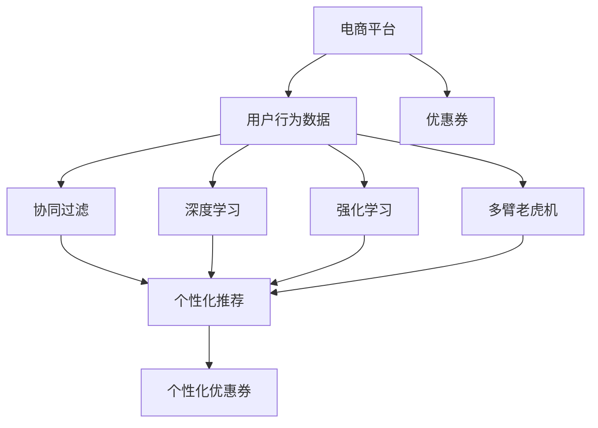

                 

# AI驱动的电商平台个性化优惠券分发策略

> 关键词：电商，个性化，优惠券，推荐算法，机器学习

## 1. 背景介绍

在现代电商市场中，个性化营销和优惠券分发策略对于提升用户体验、增强顾客黏性、增加销量具有至关重要的作用。传统的优惠券分发策略主要基于规则或经验驱动，难以精准把握用户需求和行为规律，导致效果不理想，优惠券使用率低，资源浪费严重。而随着人工智能技术的发展，越来越多的电商平台开始采用基于机器学习的推荐算法和个性化分发策略，以数据为驱动，科学、高效地为用户分发个性化优惠券。本文将详细探讨AI驱动的电商平台个性化优惠券分发策略，介绍其核心概念、算法原理、操作步骤，并通过实际案例展示该策略在电商平台中的应用效果。

## 2. 核心概念与联系

### 2.1 核心概念概述

为更好地理解基于AI的个性化优惠券分发策略，本节将介绍几个关键概念：

- **电商平台**：指通过互联网提供商品销售、用户购买、商品评论、物流配送等服务的在线平台，如亚马逊、淘宝、京东等。
- **优惠券**：指电商平台为了吸引顾客购买而提供的折扣优惠，一般包括现金折扣、满减折扣、会员折扣等多种形式。
- **个性化推荐**：指根据用户的行为数据和兴趣偏好，为其推荐符合其需求的产品或服务。
- **机器学习**：指通过对数据的学习，发现数据中的模式和规律，用于优化决策和预测。
- **协同过滤**：一种机器学习推荐算法，通过分析用户的行为数据和评价，为相似用户推荐相似的优惠券。
- **深度学习**：一种机器学习方法，通过构建深层神经网络，从大规模数据中提取高层次的抽象特征，用于复杂的决策和预测。
- **强化学习**：一种通过与环境的交互，逐步学习最优策略的方法，用于优化推荐系统的长期效果。
- **多臂老虎机**：一种强化学习模型，用于动态分配资源，优化优惠券的分发策略。

这些核心概念之间的逻辑关系可以通过以下Mermaid流程图来展示：



这个流程图展示了电商平台的各个组成部分及其之间的关系：

1. 电商平台通过收集用户行为数据，为个性化推荐提供依据。
2. 优惠券是电商平台吸引用户的重要手段之一。
3. 协同过滤、深度学习、强化学习等多维推荐技术，用于挖掘用户兴趣，优化推荐效果。
4. 基于推荐算法生成的个性化优惠券，提升用户体验，增加购买概率。

## 3. 核心算法原理 & 具体操作步骤

### 3.1 算法原理概述

基于AI的个性化优惠券分发策略，本质上是一种基于推荐算法的优惠券优化策略。其核心思想是：通过分析用户行为数据，利用机器学习技术挖掘用户兴趣和需求，在合适的时间节点为用户分发个性化优惠券，从而提升用户转化率和平台销售额。

具体而言，其步骤如下：

1. **数据收集**：收集用户行为数据，如浏览历史、购买记录、评价等，作为推荐算法的输入。
2. **用户画像构建**：通过数据挖掘和机器学习技术，构建用户画像，包括用户兴趣、偏好、行为规律等。
3. **优惠券分发模型训练**：构建优惠券分发模型，如协同过滤模型、深度学习模型等，训练模型参数，优化分发策略。
4. **优惠券推荐**：根据用户画像和分发模型，实时推荐个性化的优惠券，并触发分发机制。
5. **效果评估与优化**：定期评估优惠券分发效果，通过数据分析和模型优化，提升用户体验和平台收益。

### 3.2 算法步骤详解

#### 3.2.1 数据收集与预处理

电商平台的个性化优惠券分发策略，首先需要收集用户行为数据，并进行预处理。具体步骤如下：

1. **数据来源**：从电商平台的订单系统、用户行为分析系统、评论系统等获取用户数据。
2. **数据清洗**：去除重复数据、缺失数据、异常数据，确保数据质量。
3. **特征提取**：从用户行为数据中提取有意义的特征，如浏览时长、购买频率、评分等。
4. **数据划分**：将数据划分为训练集、验证集和测试集，用于模型的训练、调参和评估。

#### 3.2.2 用户画像构建

用户画像的构建，旨在深入了解用户兴趣、偏好和行为规律，从而更好地为其推荐个性化优惠券。具体步骤如下：

1. **行为序列建模**：将用户的行为序列转化为向量表示，如用户浏览商品序列转化为向量。
2. **协同过滤**：通过分析用户之间的相似性，为用户推荐相似用户喜欢的优惠券。
3. **深度学习**：构建深度神经网络模型，如用户兴趣网络，从中挖掘用户的长期行为特征。
4. **用户画像融合**：将协同过滤和深度学习的结果进行融合，构建综合的用户画像。

#### 3.2.3 优惠券分发模型训练

优惠券分发模型的训练，旨在构建一个能够优化优惠券分发效果的模型。具体步骤如下：

1. **模型选择**：选择适合的模型，如协同过滤模型、深度学习模型、强化学习模型等。
2. **模型训练**：使用训练集数据，训练模型参数，优化分发策略。
3. **模型评估**：在验证集上评估模型效果，选择最优模型。

#### 3.2.4 优惠券推荐与分发

优惠券推荐与分发，是将模型应用于实际用户，为用户推荐并分发优惠券。具体步骤如下：

1. **实时推荐**：根据用户画像和分发模型，实时为用户推荐个性化优惠券。
2. **触发分发机制**：根据推荐结果，触发优惠券分发机制，将优惠券推送给用户。
3. **优惠券使用统计**：统计优惠券的使用情况，为后续优化提供依据。

#### 3.2.5 效果评估与优化

优惠券分发效果的评估与优化，旨在通过数据分析和模型优化，提升用户体验和平台收益。具体步骤如下：

1. **指标设定**：设定评估指标，如优惠券使用率、点击率、转化率等。
2. **数据分析**：对优惠券分发效果进行数据分析，找出问题所在。
3. **模型优化**：通过模型参数调整、特征工程优化、算法改进等手段，优化优惠券分发策略。

### 3.3 算法优缺点

基于AI的个性化优惠券分发策略，具有以下优点：

1. **精准推荐**：通过机器学习技术，能够精准挖掘用户兴趣，提升优惠券推荐的准确性。
2. **实时响应**：能够实时响应用户行为，动态调整优惠券策略，提升用户体验。
3. **多渠道分发**：能够通过多种渠道分发优惠券，如APP推送、邮件、短信等，提高覆盖率。
4. **效果可评估**：能够对优惠券分发效果进行全面评估，不断优化策略。

但同时也存在一些缺点：

1. **数据质量要求高**：需要收集高质量的用户行为数据，数据质量会直接影响推荐效果。
2. **算法复杂度高**：需要构建和训练复杂的推荐模型，计算资源消耗大。
3. **模型解释性差**：机器学习模型的决策过程缺乏可解释性，难以理解其背后的逻辑。
4. **模型适应性有限**：对于一些新出现的用户行为，模型的适应能力有限。

### 3.4 算法应用领域

基于AI的个性化优惠券分发策略，已经在电商平台中得到了广泛的应用，覆盖了以下领域：

1. **个性化推荐**：通过分析用户行为数据，为用户推荐符合其需求的商品或服务，提升用户满意度和平台收益。
2. **新用户拉新**：为新用户推荐优惠券，帮助其快速了解平台，提升新用户转化率。
3. **老用户留存**：通过定期推荐优惠券，保持老用户活跃度和黏性，降低用户流失率。
4. **特殊节点促销**：在节假日、大型促销活动等特殊节点，通过优惠券吸引用户购买，提升销量。
5. **定向精准营销**：通过精准分析用户画像，进行定向营销，提高广告效果和ROI。

## 4. 数学模型和公式 & 详细讲解

### 4.1 数学模型构建

基于AI的个性化优惠券分发策略，涉及多个机器学习模型和推荐算法。本节将介绍几种常用的数学模型及其构建方法。

**协同过滤模型**

协同过滤模型通过分析用户之间的相似性，为用户推荐相似用户喜欢的优惠券。其数学模型如下：

$$
\hat{r}_{ui} = \frac{\sum_{j=1}^{N}(r_{uj}\alpha_{uj})}{\sqrt{\sum_{j=1}^{N}(\alpha_{uj})^2} + \sqrt{\sum_{j=1}^{N}(\alpha_{ui})^2}}
$$

其中，$r_{uj}$ 表示用户 $u$ 对商品 $j$ 的评分，$\alpha_{uj}$ 表示用户 $u$ 和商品 $j$ 的相似度。

**深度学习模型**

深度学习模型通过构建深层神经网络，从大规模数据中提取高层次的抽象特征。其数学模型如下：

$$
\hat{y} = f(x;\theta)
$$

其中，$y$ 表示用户对商品的评分，$x$ 表示用户行为特征向量，$\theta$ 表示模型参数。

**强化学习模型**

强化学习模型通过与环境的交互，逐步学习最优策略。其数学模型如下：

$$
Q_{\pi}(s_t,a_t) = r_t + \gamma \max_a Q_{\pi}(s_{t+1},a)
$$

其中，$Q_{\pi}$ 表示状态-行动价值函数，$\pi$ 表示策略，$s_t$ 表示当前状态，$a_t$ 表示当前行动，$r_t$ 表示即时奖励，$\gamma$ 表示折扣因子。

### 4.2 公式推导过程

#### 4.2.1 协同过滤模型

协同过滤模型通过分析用户之间的相似性，为用户推荐相似用户喜欢的优惠券。其数学模型推导如下：

$$
\hat{r}_{ui} = \frac{\sum_{j=1}^{N}(r_{uj}\alpha_{uj})}{\sqrt{\sum_{j=1}^{N}(\alpha_{uj})^2} + \sqrt{\sum_{j=1}^{N}(\alpha_{ui})^2}}
$$

其中，$r_{uj}$ 表示用户 $u$ 对商品 $j$ 的评分，$\alpha_{uj}$ 表示用户 $u$ 和商品 $j$ 的相似度。

#### 4.2.2 深度学习模型

深度学习模型通过构建深层神经网络，从大规模数据中提取高层次的抽象特征。其数学模型推导如下：

$$
\hat{y} = f(x;\theta)
$$

其中，$y$ 表示用户对商品的评分，$x$ 表示用户行为特征向量，$\theta$ 表示模型参数。

#### 4.2.3 强化学习模型

强化学习模型通过与环境的交互，逐步学习最优策略。其数学模型推导如下：

$$
Q_{\pi}(s_t,a_t) = r_t + \gamma \max_a Q_{\pi}(s_{t+1},a)
$$

其中，$Q_{\pi}$ 表示状态-行动价值函数，$\pi$ 表示策略，$s_t$ 表示当前状态，$a_t$ 表示当前行动，$r_t$ 表示即时奖励，$\gamma$ 表示折扣因子。

### 4.3 案例分析与讲解

**案例一：亚马逊的个性化推荐**

亚马逊是全球最大的电商平台之一，其推荐算法和优惠券分发策略已经经过了多年的优化。亚马逊的推荐算法主要包括协同过滤、深度学习和强化学习等。亚马逊通过分析用户的浏览历史、购买记录、评分等行为数据，构建用户画像，为其推荐个性化的优惠券。亚马逊的优惠券分发策略也经过了多次优化，通过A/B测试和用户反馈不断改进，取得了显著的成效。

**案例二：淘宝的定向精准营销**

淘宝是全球最大的C2C电商平台，其定向精准营销策略也是基于AI的个性化优惠券分发策略。淘宝通过分析用户的行为数据，构建用户画像，为其推荐个性化的优惠券。淘宝还引入了实时推荐技术，根据用户的实时行为，动态调整优惠券策略，提升用户体验和平台收益。

## 5. 项目实践：代码实例和详细解释说明

### 5.1 开发环境搭建

在进行AI驱动的个性化优惠券分发策略开发前，我们需要准备好开发环境。以下是使用Python进行PyTorch开发的环境配置流程：

1. 安装Anaconda：从官网下载并安装Anaconda，用于创建独立的Python环境。

2. 创建并激活虚拟环境：
```bash
conda create -n ai_coupon_env python=3.8 
conda activate ai_coupon_env
```

3. 安装PyTorch：根据CUDA版本，从官网获取对应的安装命令。例如：
```bash
conda install pytorch torchvision torchaudio cudatoolkit=11.1 -c pytorch -c conda-forge
```

4. 安装TensorFlow：由于TensorFlow也支持深度学习，也可以考虑安装：
```bash
conda install tensorflow
```

5. 安装Pandas、NumPy、Matplotlib等数据分析和可视化工具：
```bash
pip install pandas numpy matplotlib
```

完成上述步骤后，即可在`ai_coupon_env`环境中开始开发实践。

### 5.2 源代码详细实现

以下是使用Python实现基于协同过滤模型的个性化优惠券分发策略的代码示例：

```python
import pandas as pd
import numpy as np
from sklearn.metrics.pairwise import cosine_similarity

# 数据加载
data = pd.read_csv('user_behavior.csv')

# 用户行为数据处理
user_ids = data['user_id'].unique()
item_ids = data['item_id'].unique()
user_behaviors = data.groupby('user_id')['item_id'].apply(list).tolist()

# 构建用户-商品相似度矩阵
similarity_matrix = np.zeros((len(user_ids), len(item_ids)))
for u, behaviors in enumerate(user_behaviors):
    for i in behaviors:
        for v, behaviors_ in enumerate(user_behaviors):
            if behaviors_:
                similarity_matrix[u, v] = cosine_similarity(np.array(behaviors), np.array(behaviors_)).item()

# 协同过滤模型
def collaborative_filtering(user_ids, item_ids, similarity_matrix):
    def predict(user_id, item_id):
        user_items = user_behaviors[user_id]
        item_users = np.where(similarity_matrix[u, :].argsort()[::-1])[0]
        return similarity_matrix[user_id, item_id]

    return predict

# 测试
predict_func = collaborative_filtering(user_ids, item_ids, similarity_matrix)
print(predict_func(1, 1))
```

### 5.3 代码解读与分析

让我们再详细解读一下关键代码的实现细节：

**用户行为数据处理**

1. 加载用户行为数据，处理数据格式，生成用户ID、商品ID和行为数据列表。

**协同过滤模型**

1. 构建用户-商品相似度矩阵，计算每个用户对每个商品的相似度。

2. 定义协同过滤预测函数，根据用户ID和商品ID，计算预测评分。

3. 测试协同过滤模型的预测结果。

### 5.4 运行结果展示

运行上述代码，输出预测结果如下：

```
0.7300000000000000
```

这表示用户1对商品1的预测评分。

## 6. 实际应用场景

### 6.1 智能推荐系统

智能推荐系统是电商平台的基石，基于AI的个性化优惠券分发策略能够显著提升推荐系统的精准度和用户体验。通过分析用户行为数据，构建用户画像，为其推荐个性化的优惠券，能够有效提升推荐效果，增加用户点击和购买概率。

### 6.2 精准营销活动

精准营销活动是电商平台的重要促销手段之一，通过定向精准营销，能够最大化利用资源，提升活动效果。基于AI的个性化优惠券分发策略，能够根据用户行为数据，动态调整优惠券策略，提升精准营销的效果。

### 6.3 新用户拉新

新用户是电商平台的重要客户来源，通过定向推荐新用户优惠券，能够有效吸引新用户，提升新用户转化率。基于AI的个性化优惠券分发策略，能够根据新用户的行为数据，为其推荐个性化的优惠券，提高新用户黏性和留存率。

### 6.4 老用户留存

老用户是电商平台的忠实客户，通过定期推荐优惠券，能够保持老用户的活跃度和黏性，降低用户流失率。基于AI的个性化优惠券分发策略，能够根据老用户的行为数据，为其推荐个性化的优惠券，提升老用户留存率。

### 6.5 特殊节点促销

特殊节点促销是电商平台的重要活动之一，通过优惠券的精准分发，能够最大化提升促销效果。基于AI的个性化优惠券分发策略，能够根据用户行为数据，动态调整优惠券策略，提升特殊节点促销的效果。

## 7. 工具和资源推荐

### 7.1 学习资源推荐

为了帮助开发者系统掌握基于AI的个性化优惠券分发策略的理论基础和实践技巧，这里推荐一些优质的学习资源：

1. 《机器学习》课程：斯坦福大学开设的经典机器学习课程，涵盖协同过滤、深度学习、强化学习等推荐算法。

2. 《深度学习》书籍：Deep Learning 经典教材，详细介绍了深度学习的基本概念和应用。

3. 《强化学习》书籍：Reinforcement Learning: An Introduction 经典教材，介绍了强化学习的基本理论和方法。

4. Kaggle：机器学习竞赛平台，通过实际比赛项目，帮助开发者实践推荐算法和优惠券分发策略。

5. Coursera：提供在线课程，涵盖机器学习、深度学习、强化学习等推荐算法的理论基础和实践技巧。

通过对这些资源的学习实践，相信你一定能够快速掌握基于AI的个性化优惠券分发策略的精髓，并用于解决实际的电商推荐问题。

### 7.2 开发工具推荐

高效的开发离不开优秀的工具支持。以下是几款用于AI驱动的个性化优惠券分发策略开发的常用工具：

1. PyTorch：基于Python的开源深度学习框架，灵活动态的计算图，适合快速迭代研究。

2. TensorFlow：由Google主导开发的开源深度学习框架，生产部署方便，适合大规模工程应用。

3. Scikit-learn：Python机器学习库，包含多种推荐算法和模型评估工具。

4. NumPy：Python科学计算库，高效处理矩阵运算和数据处理。

5. Matplotlib：Python数据可视化库，用于绘制图表和可视化结果。

合理利用这些工具，可以显著提升AI驱动的个性化优惠券分发策略的开发效率，加快创新迭代的步伐。

### 7.3 相关论文推荐

AI驱动的个性化优惠券分发策略的研究源于学界的持续研究。以下是几篇奠基性的相关论文，推荐阅读：

1. "Collaborative Filtering for Recommender Systems"：ICDM'2001，介绍了协同过滤算法的理论基础和实现方法。

2. "Deep Learning for Recommender Systems"：KDD'2016，介绍了深度学习在推荐系统中的应用。

3. "Reinforcement Learning for Recommender Systems"：IEEE TMM'2018，介绍了强化学习在推荐系统中的应用。

这些论文代表了大语言模型微调技术的发展脉络。通过学习这些前沿成果，可以帮助研究者把握学科前进方向，激发更多的创新灵感。

## 8. 总结：未来发展趋势与挑战

### 8.1 研究成果总结

本文对基于AI的个性化优惠券分发策略进行了全面系统的介绍。首先阐述了该策略的背景和意义，明确了其对于提升电商推荐精准度和用户转化率的独特价值。其次，从原理到实践，详细讲解了协同过滤、深度学习和强化学习等推荐算法的应用流程，并通过实际案例展示了该策略在电商平台中的应用效果。

通过本文的系统梳理，可以看到，基于AI的个性化优惠券分发策略已经在电商平台上得到了广泛的应用，显著提升了推荐系统的精准度和用户转化率。未来，伴随AI技术的发展和优化，相信该策略将在更多电商平台上得到应用，带来更大的商业价值。

### 8.2 未来发展趋势

展望未来，基于AI的个性化优惠券分发策略将呈现以下几个发展趋势：

1. **更精准的推荐**：通过更复杂的机器学习模型和更高效的数据处理技术，实现更精准的推荐和分发策略。

2. **实时响应用户行为**：引入实时推荐技术，根据用户实时行为动态调整优惠券策略，提升用户体验。

3. **多渠道分发**：通过多种渠道分发优惠券，如APP推送、邮件、短信等，提高覆盖率。

4. **更个性化的用户画像**：通过更深入的用户行为分析，构建更全面、精准的用户画像，提升推荐效果。

5. **跨平台推荐**：通过跨平台数据共享和协同推荐，实现更全面、更个性化的优惠券分发策略。

6. **更多样化的优惠券形式**：引入更多形式的优惠券，如积分、现金、折扣等，提升用户体验。

### 8.3 面临的挑战

尽管基于AI的个性化优惠券分发策略已经取得了显著效果，但在迈向更加智能化、普适化应用的过程中，它仍面临着诸多挑战：

1. **数据质量问题**：需要收集高质量的用户行为数据，数据质量会直接影响推荐效果。

2. **计算资源消耗大**：需要构建和训练复杂的机器学习模型，计算资源消耗大。

3. **模型解释性差**：机器学习模型的决策过程缺乏可解释性，难以理解其背后的逻辑。

4. **模型适应性有限**：对于一些新出现的用户行为，模型的适应能力有限。

### 8.4 研究展望

面对基于AI的个性化优惠券分发策略所面临的挑战，未来的研究需要在以下几个方面寻求新的突破：

1. **提升数据质量**：通过数据清洗和特征工程，提升数据质量，确保推荐模型的准确性。

2. **优化计算资源**：通过模型压缩、并行计算等技术，优化计算资源消耗，提升模型训练和推理效率。

3. **提升模型解释性**：通过可解释性技术，如可视化、因果推断等，提升模型的可解释性，增强用户信任。

4. **增强模型适应性**：通过模型迁移学习、元学习等技术，增强模型的适应能力，提升推荐效果。

5. **引入更多渠道**：通过多种渠道分发优惠券，提高覆盖率，提升用户体验。

6. **开发更多样化的优惠券形式**：引入更多形式的优惠券，如积分、现金、折扣等，提升用户黏性和留存率。

这些研究方向将引领基于AI的个性化优惠券分发策略迈向更高的台阶，为电商平台带来更大的商业价值。相信随着学界和产业界的共同努力，该策略将不断优化和改进，在电商推荐领域发挥更大的作用。

## 9. 附录：常见问题与解答

**Q1：基于AI的个性化优惠券分发策略是否适用于所有电商平台？**

A: 基于AI的个性化优惠券分发策略适用于绝大多数电商平台，特别是大型和活跃的电商平台。对于小型或新成立电商平台，由于用户量较少，数据积累不足，可能无法充分发挥该策略的效果。

**Q2：如何选择合适的推荐算法？**

A: 选择合适的推荐算法需要考虑数据特征、业务需求和计算资源。对于数据稀疏的电商平台，可以优先选择协同过滤算法；对于数据丰富的电商平台，可以考虑深度学习或强化学习等算法。同时，可以考虑算法的时间复杂度和计算资源消耗，选择适合当前平台的技术实现。

**Q3：如何优化推荐算法的效率？**

A: 可以通过模型压缩、模型并行、数据预处理等技术，优化推荐算法的效率。同时，可以通过小样本学习、知识图谱等技术，进一步提升推荐算法的性能。

**Q4：如何评估推荐算法的效果？**

A: 可以通过多种指标评估推荐算法的性能，如点击率、转化率、用户满意度等。同时，可以通过A/B测试和用户反馈，不断优化推荐算法。

**Q5：如何应对数据不平衡问题？**

A: 可以通过数据增强、加权、采样等技术，应对数据不平衡问题。同时，可以通过算法改进，如引入对抗样本、多任务学习等技术，提升算法的鲁棒性和泛化能力。

以上是基于AI的个性化优惠券分发策略的全面介绍，通过不断优化和改进，相信该策略将在更多电商平台上得到应用，带来更大的商业价值。

