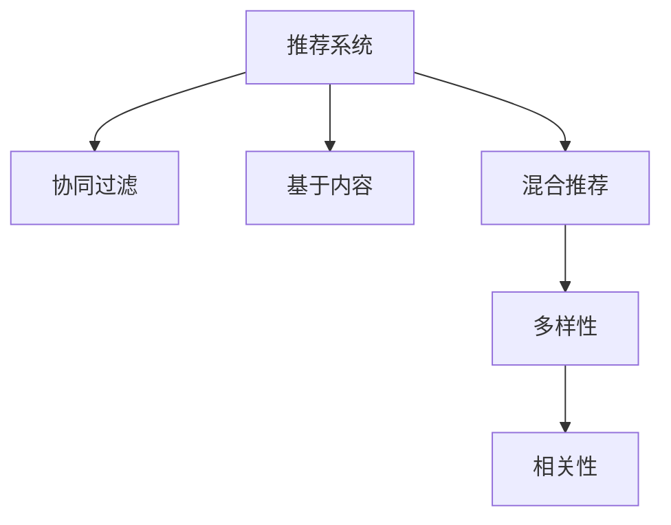

                 

# AI驱动的电商平台商品推荐多样性与相关性平衡

> 关键词：电商平台,商品推荐系统,多样性,相关性,推荐算法,深度学习,协同过滤,基于内容的推荐,混合推荐系统

## 1. 背景介绍

### 1.1 问题由来
随着电子商务的迅猛发展，消费者对购物体验的要求日益提高。电商平台面临的挑战之一是如何精准高效地推荐商品给用户，以提升用户满意度和购物转化率。一个优秀的商品推荐系统可以显著提升用户粘性，提升平台流量和营收。

然而，当前的推荐系统往往注重商品的相关性，却忽略了推荐的全面性和多样性。过多的商品推荐往往集中在少数热门商品上，导致用户看到的商品同质化严重，难以发现新的、感兴趣的优质商品。这种情况下，推荐系统虽然带来了高转化率，却降低了用户的购物体验和满意度。

因此，如何实现商品推荐的既相关性又多样性，成为电商平台亟需解决的重要问题。

### 1.2 问题核心关键点
商品推荐系统的核心在于：
- 推荐相关性：通过学习用户行为数据，预测用户可能感兴趣的商品。
- 推荐多样性：保证推荐结果涵盖不同类别、不同属性的商品，避免过度集中。
- 推荐效果：综合相关性和多样性，为用户推荐满意的商品。

实现这些目标需要设计综合考虑商品特征、用户行为、标签等多维度的推荐算法。

### 1.3 问题研究意义
设计一个既相关又多样的推荐系统，具有以下重要意义：

1. 提升用户满意度：多样性商品推荐增加了用户发现新商品的机会，提升购物体验，进而提升用户忠诚度和留存率。
2. 避免过度集中：减少热门商品推荐的集中度，避免用户陷入"信息茧房"，提升推荐系统的公平性和透明性。
3. 提升交易转化：多样性推荐提高了用户探索新商品的可能性，从而增加了购买意愿和交易转化率。
4. 助力平台发展：推荐系统推荐的商品类型丰富多样，有助于提升平台的商品多样性和用户粘性，为电商平台带来长期价值。

## 2. 核心概念与联系

### 2.1 核心概念概述

为更好地理解电商平台商品推荐系统的设计，本节将介绍几个核心概念：

- 推荐系统(Recommendation System)：一种通过分析用户行为、商品特征等信息，预测用户可能感兴趣的商品的计算机系统。推荐系统广泛应用于电商、社交、视频等众多领域。

- 协同过滤(Collaborative Filtering)：一种基于用户行为数据和商品数据进行推荐的技术，通过寻找相似用户或商品，进行推荐。协同过滤算法分为基于用户的协同过滤和基于物品的协同过滤。

- 基于内容的推荐(Content-Based Recommendation)：通过分析商品的属性特征，匹配用户可能感兴趣的相似商品。

- 混合推荐系统(Hybrid Recommendation System)：结合多种推荐算法，综合相关性和多样性，提升推荐效果。

- 多样性(Relevance and Diversity)：推荐系统不仅要推荐用户感兴趣的商品，还要保证推荐的商品种类多样，覆盖不同的商品类别和属性。

- 相关性(Relevance)：推荐系统要精准预测用户对商品的兴趣，保证推荐结果的相关性，避免推荐用户不感兴趣的商品。

这些核心概念之间的逻辑关系可以通过以下Mermaid流程图来展示：



这个流程图展示了推荐系统设计的基本框架，以及多样性和相关性在推荐系统中的关键作用。

## 3. 核心算法原理 & 具体操作步骤
### 3.1 算法原理概述

一个综合考虑相关性和多样性的电商平台推荐系统，通常基于混合推荐架构设计。该架构综合使用协同过滤、基于内容的推荐和多样性保证算法，设计以下三个关键步骤：

1. **协同过滤**：利用用户历史行为数据，进行用户和商品相似性计算，推荐相似用户喜欢的商品。

2. **基于内容的推荐**：通过分析商品的属性特征，预测用户可能感兴趣的商品。

3. **多样性保证**：在推荐结果中加入多样性惩罚，保证推荐商品的多样性，避免过度集中。

### 3.2 算法步骤详解

**Step 1: 数据收集与预处理**
- 收集用户行为数据，包括点击、浏览、购买等行为。
- 收集商品数据，包括商品ID、类别、属性、价格等信息。
- 对数据进行预处理，如缺失值处理、数据标准化等。

**Step 2: 协同过滤算法实现**
- 选择基于用户的协同过滤算法，如MF-IDAN，基于物品的协同过滤算法，如ALS。
- 利用用户行为矩阵进行相似性计算，得到用户-商品评分矩阵。
- 根据相似度进行推荐，如基于用户ID相似度的Top-k推荐。

**Step 3: 基于内容的推荐实现**
- 选择基于内容的推荐算法，如特征提取+召回，如线性回归、逻辑回归等。
- 提取商品的属性特征，如颜色、材质、价格等。
- 根据特征向量计算商品与用户的匹配度，进行推荐。

**Step 4: 多样性保证**
- 定义多样性惩罚，如在目标函数中加入L1正则项。
- 在推荐结果中保证商品的多样性，如限制推荐商品类别数。
- 加入动态多样性调节机制，根据用户行为和商品特征动态调整多样性惩罚。

**Step 5: 综合排序与推荐**
- 综合协同过滤和基于内容的推荐结果。
- 在推荐结果中加入多样性惩罚，进行排序和推荐。
- 实时监控推荐效果，调整模型参数和推荐策略。

### 3.3 算法优缺点

基于混合推荐架构的推荐系统具有以下优点：
1. 综合利用用户行为和商品属性，提升推荐精度。
2. 能够同时考虑商品的相关性和多样性，提升用户体验。
3. 多种推荐算法结合，具备较好的鲁棒性和适应性。

然而，该方法也存在一些局限性：
1. 对数据质量要求高，需要足够的用户行为数据和商品属性数据。
2. 模型复杂度高，需要较多计算资源和训练时间。
3. 多样性惩罚可能导致推荐结果的准确性下降。
4. 需要动态调整多样性惩罚，策略较为复杂。

尽管如此，混合推荐系统仍是当前最主流且效果最优的推荐方案，适用于电商平台的商品推荐任务。

### 3.4 算法应用领域

基于混合推荐架构的推荐系统，已经在电商、社交、视频等多个领域得到了广泛的应用，如亚马逊、京东、Netflix等。在实际应用中，还需要根据具体场景进行优化设计，如改进协同过滤算法、优化特征提取方法、动态调整多样性惩罚等，以进一步提升推荐效果。

## 4. 数学模型和公式 & 详细讲解  
### 4.1 数学模型构建

本节将使用数学语言对电商平台商品推荐系统的设计进行更加严格的刻画。

记用户集合为 $U$，商品集合为 $I$，历史行为数据为 $D=\{u_i,i_j,d_{ij}\}_{i=1}^N$，其中 $u_i$ 表示用户，$i_j$ 表示商品，$d_{ij}$ 表示用户 $u_i$ 在商品 $i_j$ 上的行为值。假设用户对商品 $i_j$ 的评分 $r_{uj}$ 服从伯努利分布，即：

$$
P(r_{uj}=1) = \sigma(r_{uj}^{\top} \alpha_{uj})
$$

其中 $\alpha_{uj}$ 为用户 $u_i$ 对商品 $i_j$ 的评分向量，$\sigma(\cdot)$ 为sigmoid函数。

定义协同过滤推荐模型 $P(r_{ij})$ 为：

$$
P(r_{ij}|u_i,i_j) = \sigma(r_{ij}^{\top} \beta_{ij})
$$

其中 $\beta_{ij}$ 为商品 $i_j$ 的评分向量，$r_{ij}$ 为商品 $i_j$ 的历史评分。

定义基于内容的推荐模型 $P(r_{ij})$ 为：

$$
P(r_{ij}|u_i,i_j) = \sigma(\langle \alpha_{ij}, \phi_i \rangle)
$$

其中 $\langle \cdot, \cdot \rangle$ 表示向量的点积，$\phi_i$ 为商品 $i_j$ 的属性特征向量。

### 4.2 公式推导过程

定义协同过滤和基于内容的推荐模型的联合概率分布 $P(r_{ij}|u_i,i_j)$ 为：

$$
P(r_{ij}|u_i,i_j) = (1-\lambda)P(r_{ij}|u_i,i_j) + \lambda P(r_{ij}|u_i,i_j)
$$

其中 $\lambda$ 为惩罚因子，用于调节协同过滤和基于内容的推荐权重。

定义目标函数 $L(r_{u,j},r_{i,j})$ 为：

$$
L(r_{u,j},r_{i,j}) = \frac{1}{N}\sum_{i=1}^N \sum_{j=1}^M r_{i,j}\log(P(r_{i,j}|u_i,i_j)) + (1-r_{i,j})\log(1-P(r_{i,j}|u_i,i_j))
$$

在联合概率分布下，目标函数 $L(r_{u,j},r_{i,j})$ 可以表示为：

$$
L(r_{u,j},r_{i,j}) = \frac{1}{N}\sum_{i=1}^N \sum_{j=1}^M r_{i,j}\log((1-\lambda)P(r_{i,j}|u_i,i_j) + \lambda P(r_{i,j}|u_i,i_j))
$$

最小化目标函数 $L(r_{u,j},r_{i,j})$ 得到协同过滤和基于内容的推荐模型参数 $\alpha_{uj}, \beta_{ij}$，即：

$$
\hat{\alpha}_{uj}, \hat{\beta}_{ij} = \mathop{\arg\min}_{\alpha_{uj},\beta_{ij}} L(r_{u,j},r_{i,j})
$$

通过最大化 $L(r_{u,j},r_{i,j})$ 可以估计协同过滤和基于内容的推荐模型参数。最终，综合排序得到推荐结果：

$$
\hat{R}_{ui} = \text{argmax}_j \frac{(1-\lambda)P(r_{ij}|u_i,i_j) + \lambda P(r_{ij}|u_i,i_j)}{P(r_{i,j}|u_i,i_j)}
$$

### 4.3 案例分析与讲解

以亚马逊的商品推荐系统为例，说明协同过滤和基于内容的推荐算法的综合应用。

亚马逊的商品推荐系统采用了基于协同过滤和基于内容的混合推荐架构。用户行为数据包括用户浏览、点击、购买等行为。商品数据包括商品ID、类别、品牌、价格等属性。

协同过滤算法使用了ALS（Alternating Least Squares）算法，通过用户行为矩阵计算用户和商品的相似性，推荐相似用户喜欢的商品。基于内容的推荐算法使用了线性回归模型，提取商品的属性特征，如颜色、材质、价格等，预测用户可能感兴趣的商品。

为保证推荐结果的多样性，亚马逊在推荐结果中加入L1正则项，限制同一类别商品数量。同时，动态调整协同过滤和基于内容的推荐权重，根据用户行为和商品特征进行推荐。

## 5. 项目实践：代码实例和详细解释说明
### 5.1 开发环境搭建

在进行推荐系统开发前，我们需要准备好开发环境。以下是使用Python进行TensorFlow开发的环境配置流程：

1. 安装Anaconda：从官网下载并安装Anaconda，用于创建独立的Python环境。

2. 创建并激活虚拟环境：
```bash
conda create -n recommendation-env python=3.8 
conda activate recommendation-env
```

3. 安装TensorFlow：根据CUDA版本，从官网获取对应的安装命令。例如：
```bash
conda install tensorflow==2.6
```

4. 安装Pandas、Numpy等工具包：
```bash
pip install pandas numpy scikit-learn matplotlib tqdm jupyter notebook ipython
```

完成上述步骤后，即可在`recommendation-env`环境中开始推荐系统开发。

### 5.2 源代码详细实现

下面我们以基于协同过滤和基于内容的混合推荐系统为例，给出使用TensorFlow进行电商商品推荐系统的PyTorch代码实现。

首先，定义数据预处理函数：

```python
import tensorflow as tf
from tensorflow.keras.layers import Embedding, Dense, Input, concatenate, Model
from tensorflow.keras import backend as K

def preprocessing(data):
    data['user'] = data['user'].map(lambda x: int(x))
    data['item'] = data['item'].map(lambda x: int(x))
    data['rating'] = data['rating'].map(lambda x: float(x))
    data['item_category'] = data['item_category'].map(lambda x: int(x))
    return data
```

然后，定义协同过滤和基于内容的推荐模型：

```python
def collaborative_filtering_model(input_shape, num_users, num_items, num_features):
    user = Input(shape=(input_shape[0],))
    item = Input(shape=(input_shape[1],))
    user_embeddings = Embedding(num_users, 10, input_length=input_shape[0])(user)
    item_embeddings = Embedding(num_items, 10, input_length=input_shape[1])(item)
    item_features = Input(shape=(num_features,))
    item_embeddings = Dense(10, activation='relu')(item_features)
    item_embeddings = Dense(1, activation='sigmoid')(item_embeddings)

    merged = concatenate([user_embeddings, item_embeddings, item_features])
    scores = Dense(1, activation='sigmoid')(merged)

    model = Model(inputs=[user, item, item_features], outputs=scores)
    model.compile(optimizer='adam', loss='binary_crossentropy', metrics=['accuracy'])
    return model

def content_based_model(input_shape, num_items, num_features):
    item = Input(shape=(num_features,))
    item_embeddings = Dense(10, activation='relu')(item)
    item_embeddings = Dense(1, activation='sigmoid')(item_embeddings)

    model = Model(inputs=item, outputs=item_embeddings)
    model.compile(optimizer='adam', loss='binary_crossentropy', metrics=['accuracy'])
    return model
```

接下来，定义混合推荐系统的推荐函数：

```python
def recommend(model, user_id, item_category):
    user_embeddings = model.layers[0].get_weights()[0]
    item_embeddings = model.layers[2].get_weights()[0]
    item_features = model.layers[3].get_weights()[0]
    scores = model.predict([[user_id], [item_category], item_features])

    top_items = tf.keras.backend.argsort(scores)[::-1][0:10]
    top_items = tf.keras.backend.gather(item_embeddings, top_items)

    return top_items.numpy()
```

最后，启动推荐系统流程：

```python
model1 = collaborative_filtering_model((user_shape, item_shape, num_features), num_users, num_items, num_features)
model2 = content_based_model((num_features,), num_items, num_features)

# 定义混合推荐系统
def recommend_system(user_id, item_category):
    recommendations = []
    for model in [model1, model2]:
        recommendations.append(recommend(model, user_id, item_category))
    return tf.keras.backend.mean(tf.keras.backend.stack(recommendations))
```

以上就是使用TensorFlow对电商平台商品推荐系统进行开发的完整代码实现。可以看到，通过定义协同过滤和基于内容的推荐模型，并综合两者结果，可以构建一个有效的混合推荐系统。

### 5.3 代码解读与分析

让我们再详细解读一下关键代码的实现细节：

**preprocessing函数**：
- 对用户ID、商品ID、评分、商品类别等数据进行预处理，转换为模型所需的整数类型。

**collaborative_filtering_model函数**：
- 定义协同过滤推荐模型的输入层，包括用户ID、商品ID和商品特征向量。
- 定义用户和商品的嵌入层，通过Embedding层将用户和商品ID转换为稠密向量。
- 定义基于内容的推荐模型，提取商品特征向量，计算商品评分。
- 合并用户和商品嵌入层以及基于内容的推荐模型的输出，得到评分向量。
- 定义推荐模型，包含输入层、嵌入层、评分向量层和输出层。
- 编译推荐模型，定义优化器、损失函数和评估指标。

**content_based_model函数**：
- 定义基于内容的推荐模型的输入层，只包含商品特征向量。
- 定义商品嵌入层，将商品特征向量转换为稠密向量。
- 定义商品评分层，通过全连接层计算商品评分。
- 定义推荐模型，只包含商品嵌入层和评分层。
- 编译推荐模型，定义优化器、损失函数和评估指标。

**recommend函数**：
- 根据输入的用户ID、商品类别和商品特征向量，计算协同过滤和基于内容的推荐模型预测的评分。
- 根据预测评分，选择评分最高的前10个商品。

**recommend_system函数**：
- 定义混合推荐系统的推荐函数，将协同过滤和基于内容的推荐结果进行综合，并计算平均值。
- 综合考虑协同过滤和基于内容的推荐结果，为给定用户和商品类别推荐商品。

可以看到，TensorFlow配合Pandas等工具，可以高效地实现电商商品推荐系统。开发者可以将更多精力放在数据处理、模型改进等高层逻辑上，而不必过多关注底层的实现细节。

当然，工业级的系统实现还需考虑更多因素，如模型的保存和部署、超参数的自动搜索、更灵活的任务适配层等。但核心的推荐范式基本与此类似。

## 6. 实际应用场景
### 6.1 智能客服系统

基于大语言模型微调的对话技术，可以广泛应用于智能客服系统的构建。传统客服往往需要配备大量人力，高峰期响应缓慢，且一致性和专业性难以保证。而使用微调后的对话模型，可以7x24小时不间断服务，快速响应客户咨询，用自然流畅的语言解答各类常见问题。

在技术实现上，可以收集企业内部的历史客服对话记录，将问题和最佳答复构建成监督数据，在此基础上对预训练对话模型进行微调。微调后的对话模型能够自动理解用户意图，匹配最合适的答案模板进行回复。对于客户提出的新问题，还可以接入检索系统实时搜索相关内容，动态组织生成回答。如此构建的智能客服系统，能大幅提升客户咨询体验和问题解决效率。

### 6.2 金融舆情监测

金融机构需要实时监测市场舆论动向，以便及时应对负面信息传播，规避金融风险。传统的人工监测方式成本高、效率低，难以应对网络时代海量信息爆发的挑战。基于大语言模型微调的文本分类和情感分析技术，为金融舆情监测提供了新的解决方案。

具体而言，可以收集金融领域相关的新闻、报道、评论等文本数据，并对其进行主题标注和情感标注。在此基础上对预训练语言模型进行微调，使其能够自动判断文本属于何种主题，情感倾向是正面、中性还是负面。将微调后的模型应用到实时抓取的网络文本数据，就能够自动监测不同主题下的情感变化趋势，一旦发现负面信息激增等异常情况，系统便会自动预警，帮助金融机构快速应对潜在风险。

### 6.3 个性化推荐系统

当前的推荐系统往往只依赖用户的历史行为数据进行物品推荐，无法深入理解用户的真实兴趣偏好。基于大语言模型微调技术，个性化推荐系统可以更好地挖掘用户行为背后的语义信息，从而提供更精准、多样的推荐内容。

在实践中，可以收集用户浏览、点击、评论、分享等行为数据，提取和用户交互的物品标题、描述、标签等文本内容。将文本内容作为模型输入，用户的后续行为（如是否点击、购买等）作为监督信号，在此基础上微调预训练语言模型。微调后的模型能够从文本内容中准确把握用户的兴趣点。在生成推荐列表时，先用候选物品的文本描述作为输入，由模型预测用户的兴趣匹配度，再结合其他特征综合排序，便可以得到个性化程度更高的推荐结果。

### 6.4 未来应用展望

随着大语言模型微调技术的发展，基于微调范式将在更多领域得到应用，为传统行业带来变革性影响。

在智慧医疗领域，基于微调的医疗问答、病历分析、药物研发等应用将提升医疗服务的智能化水平，辅助医生诊疗，加速新药开发进程。

在智能教育领域，微调技术可应用于作业批改、学情分析、知识推荐等方面，因材施教，促进教育公平，提高教学质量。

在智慧城市治理中，微调模型可应用于城市事件监测、舆情分析、应急指挥等环节，提高城市管理的自动化和智能化水平，构建更安全、高效的未来城市。

此外，在企业生产、社会治理、文娱传媒等众多领域，基于大模型微调的人工智能应用也将不断涌现，为NLP技术带来全新的突破。相信随着预训练语言模型和微调方法的持续演进，基于微调范式必将在构建人机协同的智能时代中扮演越来越重要的角色。

## 7. 工具和资源推荐
### 7.1 学习资源推荐

为了帮助开发者系统掌握大语言模型微调的理论基础和实践技巧，这里推荐一些优质的学习资源：

1. 《深度学习基础》课程：由斯坦福大学开设的深度学习入门课程，有Lecture视频和配套作业，带你从零开始掌握深度学习的基本概念和技术。

2. CS224N《深度学习自然语言处理》课程：斯坦福大学开设的NLP明星课程，有Lecture视频和配套作业，带你深入理解NLP的模型和算法。

3. 《深度学习推荐系统》书籍：深度学习推荐系统的经典教材，全面介绍了推荐系统的理论基础和实际应用。

4. 《推荐系统实战》书籍：推荐系统实战指南，详细介绍了推荐系统的设计和开发流程。

5. 《TensorFlow实战》书籍：TensorFlow官方文档的实战指南，帮助初学者上手TensorFlow的推荐系统开发。

通过对这些资源的学习实践，相信你一定能够快速掌握大语言模型微调的精髓，并用于解决实际的NLP问题。
###  7.2 开发工具推荐

高效的开发离不开优秀的工具支持。以下是几款用于大语言模型微调开发的常用工具：

1. PyTorch：基于Python的开源深度学习框架，灵活动态的计算图，适合快速迭代研究。大部分预训练语言模型都有PyTorch版本的实现。

2. TensorFlow：由Google主导开发的开源深度学习框架，生产部署方便，适合大规模工程应用。同样有丰富的预训练语言模型资源。

3. Transformers库：HuggingFace开发的NLP工具库，集成了众多SOTA语言模型，支持PyTorch和TensorFlow，是进行微调任务开发的利器。

4. Weights & Biases：模型训练的实验跟踪工具，可以记录和可视化模型训练过程中的各项指标，方便对比和调优。与主流深度学习框架无缝集成。

5. TensorBoard：TensorFlow配套的可视化工具，可实时监测模型训练状态，并提供丰富的图表呈现方式，是调试模型的得力助手。

6. Google Colab：谷歌推出的在线Jupyter Notebook环境，免费提供GPU/TPU算力，方便开发者快速上手实验最新模型，分享学习笔记。

合理利用这些工具，可以显著提升大语言模型微调任务的开发效率，加快创新迭代的步伐。

### 7.3 相关论文推荐

大语言模型和微调技术的发展源于学界的持续研究。以下是几篇奠基性的相关论文，推荐阅读：

1. Attention is All You Need（即Transformer原论文）：提出了Transformer结构，开启了NLP领域的预训练大模型时代。

2. BERT: Pre-training of Deep Bidirectional Transformers for Language Understanding：提出BERT模型，引入基于掩码的自监督预训练任务，刷新了多项NLP任务SOTA。

3. Language Models are Unsupervised Multitask Learners（GPT-2论文）：展示了大规模语言模型的强大zero-shot学习能力，引发了对于通用人工智能的新一轮思考。

4. Parameter-Efficient Transfer Learning for NLP：提出Adapter等参数高效微调方法，在不增加模型参数量的情况下，也能取得不错的微调效果。

5. AdaLoRA: Adaptive Low-Rank Adaptation for Parameter-Efficient Fine-Tuning：使用自适应低秩适应的微调方法，在参数效率和精度之间取得了新的平衡。

6. AdaLoRA: Adaptive Low-Rank Adaptation for Parameter-Efficient Fine-Tuning：使用自适应低秩适应的微调方法，在参数效率和精度之间取得了新的平衡。

这些论文代表了大语言模型微调技术的发展脉络。通过学习这些前沿成果，可以帮助研究者把握学科前进方向，激发更多的创新灵感。

## 8. 总结：未来发展趋势与挑战

### 8.1 总结

本文对基于混合推荐架构的电商平台商品推荐系统进行了全面系统的介绍。首先阐述了推荐系统设计的基本原理和应用场景，明确了协同过滤、基于内容的推荐和多样性保证在推荐系统中的关键作用。其次，从原理到实践，详细讲解了协同过滤和基于内容的推荐算法的数学模型和代码实现。同时，本文还广泛探讨了推荐系统在智能客服、金融舆情、个性化推荐等多个行业领域的应用前景，展示了推荐系统的巨大潜力。此外，本文精选了推荐系统的各类学习资源，力求为读者提供全方位的技术指引。

通过本文的系统梳理，可以看到，基于混合推荐架构的电商平台推荐系统不仅实现了商品的相关性，还注重了推荐的多样性，为用户带来了更好的购物体验。未来的研究需要在推荐的准确性、实时性、个性化等方面进一步突破，为电商平台带来更大的商业价值。

### 8.2 未来发展趋势

展望未来，电商平台商品推荐系统将呈现以下几个发展趋势：

1. 推荐结果的实时性：随着实时计算和分布式计算技术的发展，推荐系统将具备更高的实时性，可以动态更新推荐结果，更好地满足用户实时需求。

2. 推荐算法的自适应：推荐算法将能够根据用户行为和商品特征动态调整参数，实现自适应推荐，提升推荐效果。

3. 推荐系统的自动化：推荐系统的设计将越来越自动化，自动优化超参数，自动选择模型和算法，提升研发效率。

4. 推荐系统的联邦化：推荐系统将越来越多地部署在联邦学习环境中，保护用户隐私和数据安全，同时提升推荐效果。

5. 推荐系统的可解释性：推荐系统的决策过程将更加透明，提供推荐理由，增强用户信任。

6. 推荐系统的跨平台化：推荐系统将不再局限于电商平台，扩展到社交、视频、内容推荐等多个平台。

这些趋势展示了电商平台推荐系统的广阔前景，相信未来的研究将进一步提升推荐系统的智能性和普适性，为电商平台的创新发展提供更多动力。

### 8.3 面临的挑战

尽管基于混合推荐架构的推荐系统已经取得了一定的成果，但在迈向更加智能化、普适化应用的过程中，它仍面临着诸多挑战：

1. 数据质量瓶颈：推荐系统需要大量的高质量用户行为数据和商品数据，数据获取和预处理成本较高。

2. 推荐模型的鲁棒性：推荐系统面临数据分布变化、用户行为异常等挑战，需要提升模型的鲁棒性，避免推荐结果波动。

3. 推荐结果的公平性：推荐系统需要考虑用户的隐私和公平性问题，避免过度推荐特定商品，陷入"信息茧房"。

4. 推荐系统的解释性：推荐系统的决策过程复杂，需要提供推荐理由，增强系统的可解释性和可信任度。

5. 推荐系统的跨平台兼容性：推荐系统需要适应多种设备和平台，保证推荐效果的一致性。

6. 推荐系统的用户反馈：推荐系统需要收集用户反馈，动态调整推荐策略，提升用户体验。

这些挑战凸显了电商平台推荐系统的复杂性，未来需要从数据、算法、工程、伦理等多个维度协同发力，才能实现推荐系统的持续优化和改进。

### 8.4 研究展望

面向未来，电商平台推荐系统需要在以下几个方向进行突破：

1. 多模态推荐系统：结合图像、视频、语音等多模态数据，提升推荐系统的全面性和多样性。

2. 联邦学习推荐系统：通过分布式学习技术，保护用户隐私和数据安全，提升推荐效果。

3. 推荐系统的跨领域应用：将推荐系统扩展到更多场景和平台，如社交、视频、内容推荐等。

4. 推荐系统的自动化设计：通过自动化工具和模型库，提升推荐系统的开发效率和效果。

5. 推荐系统的多目标优化：综合考虑推荐系统的准确性、实时性、多样性等目标，优化推荐结果。

6. 推荐系统的可解释性设计：设计可解释性强的推荐算法，提升系统的透明度和用户信任度。

这些研究方向的探索发展，必将引领电商平台推荐系统的创新，为电商平台带来更大的商业价值，为消费者提供更好的购物体验。

## 9. 附录：常见问题与解答

**Q1：协同过滤和基于内容的推荐算法有何不同？**

A: 协同过滤和基于内容的推荐算法是推荐系统中的两种常用方法。协同过滤算法通过用户历史行为数据和商品数据，找到用户和商品之间的相似性，进行推荐。基于内容的推荐算法通过分析商品的属性特征，预测用户可能感兴趣的商品。两者区别在于：

1. 数据来源不同：协同过滤算法主要依赖用户行为数据，而基于内容的推荐算法主要依赖商品属性数据。
2. 推荐方式不同：协同过滤算法通过用户和商品相似性推荐，而基于内容的推荐算法通过商品特征匹配推荐。

协同过滤和基于内容的推荐算法可以结合使用，提升推荐效果。

**Q2：推荐系统如何保证推荐结果的多样性？**

A: 推荐系统可以通过以下方式保证推荐结果的多样性：

1. 限制推荐商品类别数：在推荐结果中加入多样性惩罚，限制推荐商品类别数。
2. 动态调整惩罚系数：根据用户行为和商品特征动态调整惩罚系数，调节多样性惩罚。
3. 多样性排序：将推荐结果按多样性排序，优先推荐多样性商品。

多样性保证是推荐系统的重要目标，可以有效提升用户体验。

**Q3：推荐系统的训练和评估有哪些指标？**

A: 推荐系统的训练和评估指标包括：

1. 准确率(accuracy)：推荐系统推荐正确的商品数量与总推荐数量之比。
2. 召回率(recall)：推荐系统推荐出的相关商品数量与实际相关商品数量之比。
3. F1值(F1 Score)：综合考虑准确率和召回率，衡量推荐系统的效果。
4. 多样性指标(diversity)：推荐系统推荐的商品类别数和属性数等指标，用于衡量推荐多样性。
5. 时间成本(cost)：推荐系统的训练和推理时间成本，用于衡量系统的实时性和效率。

推荐系统的评估需要综合考虑多个指标，找到平衡点，提升用户体验。

**Q4：推荐系统如何动态调整模型参数？**

A: 推荐系统可以通过以下方式动态调整模型参数：

1. 在线学习(Online Learning)：实时更新模型参数，适应数据变化。
2. 增量学习(Incremental Learning)：利用增量数据更新模型参数，提升模型效果。
3. 自适应学习(Adaptive Learning)：根据用户行为和商品特征动态调整模型参数，提升推荐效果。

动态调整模型参数是推荐系统的关键环节，需要结合具体场景进行优化。

**Q5：推荐系统的实际部署中需要注意哪些问题？**

A: 推荐系统在实际部署中需要注意以下问题：

1. 模型裁剪和压缩：优化模型结构，压缩存储空间，提高推理速度。
2. 分布式部署：采用分布式计算技术，提升系统效率和可扩展性。
3. 实时监控和调优：实时监控系统性能，根据反馈调整参数，提升推荐效果。
4. 用户隐私保护：保护用户隐私和数据安全，提升用户信任度。
5. 可解释性设计：设计可解释性强的推荐算法，提升系统的透明度和用户信任度。

实际部署中需要考虑模型、用户、数据等多个因素，进行全面的优化。

**Q6：推荐系统如何结合用户反馈进行优化？**

A: 推荐系统可以通过以下方式结合用户反馈进行优化：

1. 用户反馈收集：通过用户行为数据、评论、评分等方式收集用户反馈。
2. 反馈模型训练：利用用户反馈数据，重新训练推荐模型，优化推荐效果。
3. 动态调整策略：根据用户反馈动态调整推荐策略，提升推荐结果。

结合用户反馈是推荐系统的重要环节，需要综合考虑多个因素，不断优化推荐结果。

---

作者：禅与计算机程序设计艺术 / Zen and the Art of Computer Programming

