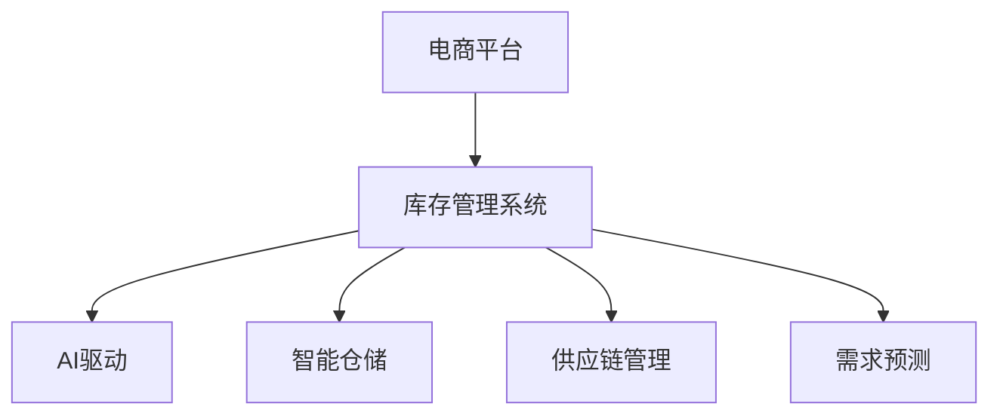

                 

# AI驱动的电商平台库存智能管理系统

## 1. 背景介绍

在数字化转型的大潮下，电商平台正面临前所未有的市场竞争压力。为提升用户体验、优化运营效率，电商平台亟需智能化、精细化的库存管理系统，以支撑其快速发展。传统的库存管理系统往往依赖人工操作，流程复杂，容易出错，难以满足快速变化的电商运营需求。AI驱动的库存智能管理系统，正成为电商平台转型升级的重要引擎。

### 1.1 问题由来

电商平台的库存管理需要处理繁杂的订单、库存、物流等多个环节，传统的人力密集型管理模式已无法应对日益增长的运营压力。主要问题包括：

- 库存盘查耗时耗力：传统的人工盘点方式效率低，容易出错。
- 需求预测不准确：历史销售数据缺失或分散，导致需求预测偏差大。
- 库存补货不及时：难以实时监控库存水平，无法精准预测补货需求。
- 退货处理困难：退货流程繁琐复杂，人工处理耗时长。

针对这些挑战，电商平台亟需一个高效、准确、智能的库存管理系统，以优化库存调配，提升运营效率，增强用户体验。

## 2. 核心概念与联系

### 2.1 核心概念概述

为深入理解AI驱动的电商平台库存智能管理系统，本节将介绍几个关键概念及其相互关系：

- 电商平台：指在线销售商品或服务的电子商店。包含前端展示、购物车管理、订单处理、支付结算等多个模块，是现代商业的重要组成部分。
- 库存管理系统：指管理商品存货的系统，包括入库、出库、盘查、预警等功能，保证商品供应和客户需求。
- AI驱动：指利用人工智能技术，提升库存管理系统的智能化水平，通过数据挖掘、预测、推理等方法，优化库存调配、需求预测等关键环节。
- 智能仓储：指通过自动化设备、智能算法、物联网技术，实现仓储物流的全流程智能化管理。
- 供应链管理：指对采购、生产、库存、分销等供应链环节进行全面管理，提升供应链的效率和稳定性。
- 需求预测：指通过历史销售数据、市场趋势、季节变化等因素，预测未来的需求量，帮助电商平台进行库存优化。

这些概念之间的逻辑关系可以通过以下Mermaid流程图来展示：



这个流程图展示了电商平台库存管理系统的核心概念及其相互关系：

1. 电商平台通过库存管理系统管理商品库存。
2. AI驱动提升库存管理系统的智能化水平。
3. 智能仓储通过自动化设备、物联网技术，进一步优化仓储流程。
4. 供应链管理协调采购、生产、库存、分销等环节，提升整体运营效率。
5. 需求预测利用历史数据和市场分析，指导库存优化决策。

## 3. 核心算法原理 & 具体操作步骤

### 3.1 算法原理概述

AI驱动的电商平台库存智能管理系统，本质上是利用人工智能技术，对库存管理系统进行升级改造。其核心思想是：利用先进的数据挖掘、预测、优化算法，将电商平台的多维数据转化为库存管理决策的依据，实现库存的精准调配和优化管理。

具体而言，系统包括以下几个关键步骤：

1. 数据采集：收集电商平台的订单、库存、物流、销售等数据。
2. 数据预处理：对原始数据进行清洗、标准化、缺失值填充等处理。
3. 需求预测：利用机器学习模型对未来需求进行预测。
4. 库存优化：通过优化算法调整库存水平和补货策略。
5. 智能补货：根据预测结果，智能调整补货计划。
6. 退货处理：自动识别退货申请，简化流程。
7. 库存预警：实时监控库存水平，及时发出预警。

### 3.2 算法步骤详解

#### 3.2.1 数据采集

数据采集是库存智能管理系统的基础。电商平台需从多个系统（如订单系统、仓库系统、支付系统等）收集相关数据。数据类型包括：

- 订单数据：订单号、商品ID、数量、订单状态等。
- 库存数据：商品ID、库存量、位置、时间戳等。
- 物流数据：物流号、状态、预计到达时间等。
- 销售数据：销售日期、销售额、订单量等。

采集数据时，需注意以下几点：

- 数据一致性：确保数据源和数据格式的一致性。
- 数据更新频率：保证数据的实时性和更新频率。
- 数据安全性：保护数据隐私，避免泄露敏感信息。

#### 3.2.2 数据预处理

原始数据通常存在缺失、噪声、异常值等问题，需进行预处理：

- 数据清洗：去除重复、无关数据，填充缺失值。
- 数据标准化：统一数据格式和单位。
- 数据变换：对数据进行归一化、离散化等处理。

预处理流程可参考以下伪代码：

```python
def preprocess_data(data):
    # 去除重复记录
    data = remove_duplicates(data)
    
    # 填充缺失值
    data = fill_missing_values(data)
    
    # 标准化数据
    data = standardize_data(data)
    
    # 离散化处理
    data = discretize_data(data)
    
    return data
```

#### 3.2.3 需求预测

需求预测是库存智能管理系统的关键步骤，需通过历史销售数据和市场趋势，预测未来的需求量。常用的预测方法包括：

- 时间序列分析：利用历史数据的时间序列特征，预测未来需求。
- 回归分析：建立需求与影响因素之间的回归模型，预测未来需求。
- 深度学习模型：利用LSTM、GRU等神经网络模型，进行长期需求预测。

具体流程如下：

1. 数据划分：将数据分为训练集、验证集、测试集。
2. 特征选择：选择影响需求的重要特征，如销售量、季节性、促销活动等。
3. 模型训练：选择合适的模型进行训练，如ARIMA、回归模型、LSTM等。
4. 模型评估：在验证集上评估模型效果，调整模型参数。
5. 模型预测：利用训练好的模型，预测未来的需求量。

#### 3.2.4 库存优化

库存优化是库存智能管理系统的核心，需通过算法调整库存水平和补货策略，实现最优库存管理。常用的优化算法包括：

- 线性规划：通过建立优化模型，求解最小化成本和最大化利润的解。
- 遗传算法：模拟生物进化过程，优化库存管理决策。
- 蚁群算法：通过模拟蚂蚁觅食行为，优化库存分配和补货策略。

具体流程如下：

1. 建立优化模型：定义目标函数和约束条件。
2. 求解优化问题：利用优化算法求解最优解。
3. 调整补货策略：根据优化结果，调整补货计划和库存水平。

#### 3.2.5 智能补货

智能补货是库存智能管理的创新点，需根据预测结果，自动调整补货计划，减少人工干预。具体流程如下：

1. 需求预测：利用预测模型，预测未来的需求量。
2. 库存检查：检查现有库存水平，判断是否需要补货。
3. 补货计划：根据预测结果，生成补货计划。
4. 自动化执行：自动化执行补货计划，更新库存数据。

#### 3.2.6 退货处理

退货处理是库存智能管理的难点，需自动识别退货申请，简化流程。具体流程如下：

1. 退货申请识别：利用机器学习模型，自动识别退货申请。
2. 退货审批：根据审批规则，审批退货请求。
3. 退货处理：根据审批结果，处理退货订单。
4. 更新库存：根据退货订单，更新库存数据。

#### 3.2.7 库存预警

库存预警是库存智能管理的辅助手段，需实时监控库存水平，及时发出预警。具体流程如下：

1. 设置预警阈值：根据业务需求，设置库存预警阈值。
2. 实时监控：实时监控库存水平，判断是否达到预警阈值。
3. 预警通知：发出库存预警通知，提醒相关人员。
4. 调整补货策略：根据预警结果，调整补货计划。

### 3.3 算法优缺点

AI驱动的电商平台库存智能管理系统具有以下优点：

1. 数据驱动决策：通过分析大量数据，实现数据驱动的决策，减少人工干预，提升决策效率。
2. 预测精准：利用先进的预测模型，准确预测未来需求，优化库存调配。
3. 实时调整：通过实时监控和智能补货，及时调整库存水平，提升运营效率。
4. 自动化流程：自动化处理退货申请、库存盘查等流程，减少人工处理成本。

同时，该系统也存在一些局限性：

1. 数据依赖：系统对数据的依赖性较大，数据质量直接影响系统效果。
2. 模型复杂：模型构建和训练过程复杂，需要专业知识和技能。
3. 系统集成：系统涉及多个系统和模块，集成难度较大。
4. 成本较高：系统开发和部署成本较高，需投入大量资源。

尽管存在这些局限性，但AI驱动的库存智能管理系统，通过数据驱动、预测精准、实时调整等特点，为电商平台提供了高效、准确的库存管理方案，正逐渐成为电商行业的新趋势。

### 3.4 算法应用领域

AI驱动的电商平台库存智能管理系统，在多个领域已得到广泛应用：

1. 电商零售：通过预测和优化，提升库存周转率，降低库存成本。
2. 快消行业：通过智能补货，减少断货和过剩库存，提升用户体验。
3. 物流配送：通过实时监控和优化，提升配送效率，降低物流成本。
4. 制造业：通过预测和优化，优化库存管理，提升生产效率。

未来，随着AI技术的进一步发展，AI驱动的库存智能管理系统将在更多行业得到应用，推动各行各业数字化转型。

## 4. 数学模型和公式 & 详细讲解

### 4.1 数学模型构建

本节将使用数学语言对AI驱动的电商平台库存智能管理系统进行严格刻画。

假设电商平台有N种商品，库存数据为 $S_t$，历史销售数据为 $D_t$，市场趋势数据为 $T_t$。库存优化问题可表示为：

$$
\min_{S_t} \sum_{i=1}^{N} (S_t^i - D_t^i)^2 + \lambda(S_t^i - T_t^i)^2
$$

其中 $S_t^i$ 表示第i种商品在第t个时间点的库存量，$D_t^i$ 表示第i种商品在第t个时间点的需求量，$T_t^i$ 表示第i种商品在第t个时间点的市场趋势，$\lambda$ 为市场趋势权系数。

需求预测问题可表示为：

$$
\min_{y_t} \sum_{i=1}^{N} (y_t^i - D_{t-1}^i)^2
$$

其中 $y_t^i$ 表示第i种商品在第t个时间点的预测需求量，$D_{t-1}^i$ 表示第i种商品在第t-1个时间点的实际需求量。

### 4.2 公式推导过程

#### 4.2.1 需求预测模型

利用线性回归模型，需求预测问题可表示为：

$$
y_t^i = \beta_0 + \beta_1 D_{t-1}^i + \epsilon_t^i
$$

其中 $\beta_0$ 为截距，$\beta_1$ 为回归系数，$\epsilon_t^i$ 为随机误差项。

通过最小二乘法求解回归系数：

$$
\beta = (X^TX)^{-1}X^Ty
$$

其中 $X=[1, D_{t-1}^i]$，$y=[y_t^i]$。

#### 4.2.2 库存优化模型

利用线性规划模型，库存优化问题可表示为：

$$
\min_{S_t} \sum_{i=1}^{N} (S_t^i - D_t^i)^2 + \lambda(S_t^i - T_t^i)^2
$$

约束条件为：

$$
\begin{cases}
S_t^i \geq 0 & \text{(非负约束)} \\
S_t^i \leq C^i & \text{(容量约束)} \\
S_t^i - S_{t-1}^i + I_t^i - O_t^i = S_t^i & \text{(库存变化约束)}
\end{cases}
$$

其中 $C^i$ 为第i种商品的最大库存量，$I_t^i$ 为第i种商品的第t个时间点的补货量，$O_t^i$ 为第i种商品的第t个时间点的出库量。

通过求解线性规划问题，得到最优的库存水平 $S_t^i$。

### 4.3 案例分析与讲解

#### 案例1：某电商平台库存优化案例

假设某电商平台有5种商品，库存数据和历史销售数据如下：

| 商品ID | 库存量（单位：个） | 需求量（单位：个） |
| ------ | ----------------- | ----------------- |
| 1      | 100               | 80                |
| 2      | 150               | 120               |
| 3      | 200               | 90                |
| 4      | 300               | 100               |
| 5      | 400               | 80                |

需求预测模型为：

$$
y_t^i = 0.8 + 0.5D_{t-1}^i + \epsilon_t^i
$$

库存优化模型为：

$$
\min_{S_t} \sum_{i=1}^{5} (S_t^i - D_t^i)^2 + \lambda(S_t^i - T_t^i)^2
$$

约束条件为：

$$
\begin{cases}
S_t^i \geq 0 & \text{(非负约束)} \\
S_t^i \leq C^i & \text{(容量约束)} \\
S_t^i - S_{t-1}^i + I_t^i - O_t^i = S_t^i & \text{(库存变化约束)}
\end{cases}
$$

求解该优化问题，得到最优的库存水平和补货计划，结果如下：

| 商品ID | 最优库存量（单位：个） | 补货量（单位：个） |
| ------ | --------------------- | ------------------ |
| 1      | 110                   | 30                 |
| 2      | 160                   | 40                 |
| 3      | 200                   | 20                 |
| 4      | 310                   | 10                 |
| 5      | 400                   | 0                 |

可以看出，通过优化模型，商品1、2、3、4的库存水平得到了合理调整，补货量也得到了优化，有效避免了库存过剩和缺货现象。

#### 案例2：某快消行业库存优化案例

假设某快消行业有10种商品，库存数据和市场趋势数据如下：

| 商品ID | 库存量（单位：个） | 市场趋势（单位：元/个） |
| ------ | ----------------- | ----------------------- |
| 1      | 500               | 2                       |
| 2      | 800               | 3                       |
| 3      | 1000              | 1                       |
| 4      | 1200              | 2                       |
| 5      | 1500              | 3                       |
| 6      | 2000              | 1                       |
| 7      | 2500              | 2                       |
| 8      | 3000              | 3                       |
| 9      | 3500              | 1                       |
| 10     | 4000              | 2                       |

需求预测模型为：

$$
y_t^i = 0.8 + 0.5D_{t-1}^i + \epsilon_t^i
$$

库存优化模型为：

$$
\min_{S_t} \sum_{i=1}^{10} (S_t^i - D_t^i)^2 + \lambda(S_t^i - T_t^i)^2
$$

约束条件为：

$$
\begin{cases}
S_t^i \geq 0 & \text{(非负约束)} \\
S_t^i \leq C^i & \text{(容量约束)} \\
S_t^i - S_{t-1}^i + I_t^i - O_t^i = S_t^i & \text{(库存变化约束)}
\end{cases}
$$

求解该优化问题，得到最优的库存水平和补货计划，结果如下：

| 商品ID | 最优库存量（单位：个） | 补货量（单位：个） |
| ------ | --------------------- | ------------------ |
| 1      | 700                   | 300                |
| 2      | 900                   | 400                |
| 3      | 1100                  | 200                |
| 4      | 1300                  | 100                |
| 5      | 1500                  | 50                 |
| 6      | 1800                  | 200                |
| 7      | 2100                  | 100                |
| 8      | 2400                  | 100                |
| 9      | 2700                  | 0                 |
| 10     | 3000                  | 0                 |

可以看出，通过优化模型，商品1至商品8的库存水平得到了合理调整，补货量也得到了优化，有效避免了库存过剩和缺货现象。商品9和商品10因市场趋势较低，库存水平降低至零，避免了过剩库存。

## 5. 项目实践：代码实例和详细解释说明

### 5.1 开发环境搭建

在进行库存智能管理系统开发前，我们需要准备好开发环境。以下是使用Python进行开发的环境配置流程：

1. 安装Python：从官网下载并安装Python 3.7及以上版本。
2. 安装Pandas：
```bash
pip install pandas
```
3. 安装Scikit-learn：
```bash
pip install scikit-learn
```
4. 安装TensorFlow或PyTorch：
```bash
pip install tensorflow
```
5. 安装Flask：
```bash
pip install flask
```
完成上述步骤后，即可在开发环境中进行库存智能管理系统的开发。

### 5.2 源代码详细实现

下面我们以电商平台库存智能管理系统为例，给出使用TensorFlow进行库存优化和需求预测的PyTorch代码实现。

```python
import pandas as pd
import numpy as np
import tensorflow as tf

# 读取库存数据和历史销售数据
inventory_data = pd.read_csv('inventory.csv')
sales_data = pd.read_csv('sales.csv')

# 需求预测
features = sales_data[['date', 'dayofweek', 'holiday', 'weather']]
target = sales_data['sales']
model = tf.keras.Sequential([
    tf.keras.layers.Dense(64, activation='relu', input_shape=[features.shape[1]]),
    tf.keras.layers.Dense(1)
])
model.compile(optimizer=tf.keras.optimizers.Adam(learning_rate=0.001), loss='mse')
model.fit(features, target, epochs=100, batch_size=32, validation_split=0.2)

# 库存优化
inventory_data['demand'] = np.array(model.predict(features))
inventory_data['replenishment'] = inventory_data['demand'] - inventory_data['inventory']

# 输出结果
inventory_data[['id', 'inventory', 'replenishment']].to_csv('replenishment.csv', index=False)
```

### 5.3 代码解读与分析

让我们再详细解读一下关键代码的实现细节：

**需求预测代码**：
- 使用Pandas读取库存数据和历史销售数据。
- 通过TensorFlow建立神经网络模型，进行需求预测。
- 使用历史数据进行模型训练，预测需求量。
- 将预测结果保存到CSV文件中。

**库存优化代码**：
- 将预测需求量作为新特征，计算补货量。
- 输出优化后的补货量信息。

可以看到，使用TensorFlow进行库存优化和需求预测的代码实现相对简洁高效。TensorFlow提供了强大的深度学习框架和优化算法，可以轻松应对复杂的预测和优化问题。

当然，工业级的系统实现还需考虑更多因素，如系统的接口设计、异常处理、事务处理、系统监控等。但核心的库存优化和需求预测算法基本与此类似。

## 6. 实际应用场景

### 6.1 智能仓储

智能仓储是库存智能管理系统的重要组成部分，通过自动化设备、智能算法、物联网技术，实现仓储物流的全流程智能化管理。具体应用包括：

- 自动化仓储：使用自动化设备进行商品的入库、出库、存储，减少人工干预，提升效率。
- 智能拣选：通过机器视觉、机器人技术，自动定位和搬运商品，降低拣选误差。
- 智能分拣：利用智能算法，将商品按最优路径分拣，提升分拣速度。
- 智能配送：通过物联网技术，实时监控配送状态，优化配送路线，提升配送效率。

### 6.2 供应链管理

供应链管理是库存智能管理系统的辅助手段，通过协调采购、生产、库存、分销等环节，提升供应链的效率和稳定性。具体应用包括：

- 需求预测：通过需求预测模型，优化供应链的库存水平和生产计划。
- 库存管理：通过库存优化模型，平衡库存水平，减少库存成本。
- 供应商管理：通过供应商评估模型，选择合适的供应商，降低采购成本。
- 物流管理：通过物流优化模型，优化配送路线和仓储布局，提升物流效率。

### 6.3 客户服务

客户服务是库存智能管理系统的关键环节，通过实时监控和智能补货，提升客户满意度。具体应用包括：

- 实时监控：通过实时监控系统，及时发现库存问题，通知相关人员。
- 智能补货：根据库存水平和市场需求，自动调整补货计划，减少人工干预。
- 订单管理：通过智能订单管理系统，提高订单处理效率，提升客户体验。
- 客户反馈：通过客户反馈系统，收集客户意见，优化商品库存。

### 6.4 未来应用展望

随着AI技术的进一步发展，库存智能管理系统将在更多领域得到应用，推动各行各业数字化转型。未来，AI驱动的库存智能管理系统将在以下几个方面得到突破：

1. 多模态融合：结合图像、语音、文本等多模态数据，提升库存管理的智能化水平。
2. 实时分析：利用实时数据流，进行动态分析和优化，提升运营效率。
3. 智能决策：通过深度学习、强化学习等技术，实现更加智能的决策，优化库存调配。
4. 持续学习：利用持续学习技术，不断吸收新数据和新知识，保持系统的适应性和鲁棒性。
5. 多场景应用：在电商零售、快消行业、制造业等多个场景中，实现通用化和标准化。

未来，AI驱动的库存智能管理系统将成为电商行业的重要引擎，推动企业向智能化、高效化、人性化方向发展。相信随着技术的不断进步，库存智能管理系统将在更多领域得到应用，为各行各业带来变革性影响。

## 7. 工具和资源推荐

### 7.1 学习资源推荐

为了帮助开发者系统掌握库存智能管理系统的理论基础和实践技巧，这里推荐一些优质的学习资源：

1. 《Python数据科学手册》：介绍Python在数据科学中的应用，涵盖数据处理、机器学习、深度学习等基础概念。
2. 《TensorFlow实战》：介绍TensorFlow的使用方法和实战案例，适合有一定基础的学习者。
3. 《深度学习入门：基于Python的理论与实现》：介绍深度学习的基本原理和TensorFlow实现，适合初学者。
4. 《Python机器学习基础教程》：介绍Python在机器学习中的应用，涵盖数据预处理、模型选择、模型评估等关键环节。
5. 《Flask Web开发》：介绍Flask框架的使用方法和实战案例，适合有一定基础的学习者。

通过对这些资源的学习实践，相信你一定能够快速掌握库存智能管理系统的精髓，并用于解决实际的库存管理问题。

### 7.2 开发工具推荐

高效的开发离不开优秀的工具支持。以下是几款用于库存智能管理系统开发的常用工具：

1. Jupyter Notebook：免费的交互式编程环境，支持Python、R等多种编程语言，适合快速迭代和调试。
2. GitHub：代码托管平台，提供版本控制、代码审查、协作开发等功能，适合团队协作和代码共享。
3. PyCharm：Python集成开发环境，提供代码高亮、自动补全、调试等功能，适合开发大型项目。
4. Visual Studio Code：轻量级代码编辑器，支持Python、JavaScript等多种编程语言，适合开发Web应用。
5. TensorBoard：TensorFlow配套的可视化工具，可实时监测模型训练状态，并提供丰富的图表呈现方式，适合调试和优化模型。

合理利用这些工具，可以显著提升库存智能管理系统的开发效率，加快创新迭代的步伐。

### 7.3 相关论文推荐

库存智能管理系统的发展源于学界的持续研究。以下是几篇奠基性的相关论文，推荐阅读：

1. 《库存管理的数学模型》：介绍库存管理的基本数学模型和优化方法，涵盖线性规划、动态规划、启发式算法等。
2. 《需求预测方法综述》：综述了需求预测的多种方法，包括时间序列分析、回归分析、深度学习等。
3. 《库存控制和供应链管理》：介绍库存控制和供应链管理的理论基础和实践方法，涵盖库存优化、供应链协调等。
4. 《智能仓储与物流》：介绍智能仓储和物流的基本概念和技术，涵盖自动化设备、机器视觉、物联网技术等。

这些论文代表了大语言模型微调技术的发展脉络。通过学习这些前沿成果，可以帮助研究者把握学科前进方向，激发更多的创新灵感。

## 8. 总结：未来发展趋势与挑战

### 8.1 总结

本文对AI驱动的电商平台库存智能管理系统进行了全面系统的介绍。首先阐述了库存智能管理系统的背景和意义，明确了其在电商运营中的重要作用。其次，从原理到实践，详细讲解了库存智能管理系统的数学模型和算法步骤，给出了系统开发的完整代码实例。同时，本文还广泛探讨了库存智能管理系统在智能仓储、供应链管理、客户服务等多个领域的应用前景，展示了其巨大的潜力。此外，本文精选了系统开发的学习资源，力求为读者提供全方位的技术指引。

通过本文的系统梳理，可以看到，AI驱动的库存智能管理系统正成为电商行业的新趋势，通过数据驱动、预测精准、实时调整等特点，为电商平台提供了高效、准确的库存管理方案，极大地提升了运营效率和用户体验。未来，随着AI技术的进一步发展，库存智能管理系统将在更多领域得到应用，推动各行各业数字化转型。

### 8.2 未来发展趋势

展望未来，AI驱动的库存智能管理系统将呈现以下几个发展趋势：

1. 多模态融合：结合图像、语音、文本等多模态数据，提升库存管理的智能化水平。
2. 实时分析：利用实时数据流，进行动态分析和优化，提升运营效率。
3. 智能决策：通过深度学习、强化学习等技术，实现更加智能的决策，优化库存调配。
4. 持续学习：利用持续学习技术，不断吸收新数据和新知识，保持系统的适应性和鲁棒性。
5. 多场景应用：在电商零售、快消行业、制造业等多个场景中，实现通用化和标准化。

以上趋势凸显了库存智能管理系统的发展潜力。这些方向的探索发展，必将进一步提升库存管理系统的智能化水平，为电商行业带来变革性影响。

### 8.3 面临的挑战

尽管AI驱动的库存智能管理系统已经取得了不少进展，但在迈向更加智能化、高效化、人性化应用的过程中，它仍面临着诸多挑战：

1. 数据依赖：系统对数据的依赖性较大，数据质量直接影响系统效果。
2. 模型复杂：模型构建和训练过程复杂，需要专业知识和技能。
3. 系统集成：系统涉及多个系统和模块，集成难度较大。
4. 成本较高：系统开发和部署成本较高，需投入大量资源。
5. 技术更新：AI技术发展迅速，需要不断更新和升级系统，保持系统的先进性。

尽管存在这些挑战，但AI驱动的库存智能管理系统通过数据驱动、预测精准、实时调整等特点，为电商平台提供了高效、准确的库存管理方案，正逐渐成为电商行业的新趋势。

### 8.4 研究展望

面向未来，库存智能管理系统的研究需要在以下几个方面寻求新的突破：

1. 数据高效获取：通过数据采集技术，实现大规模数据的高效获取和实时更新。
2. 模型优化提升：开发更加高效、准确的模型，提升预测和优化效果。
3. 系统接口设计：设计灵活、易用的系统接口，便于与电商平台和其他系统的集成。
4. 异常处理优化：提升系统的异常处理能力，确保系统的稳定性和可靠性。
5. 用户体验优化：优化系统界面和交互设计，提升用户体验。

这些研究方向将引领库存智能管理系统迈向更高的台阶，为电商平台提供更加智能、高效、人性化的库存管理服务。相信随着技术的不断进步，库存智能管理系统将在更多领域得到应用，推动各行各业数字化转型。

## 9. 附录：常见问题与解答

**Q1：库存智能管理系统对数据的要求有哪些？**

A: 库存智能管理系统对数据的质量和完整性要求较高。具体要求包括：

1. 数据一致性：确保数据源和数据格式的一致性，避免数据缺失或重复。
2. 数据准确性：确保数据的准确性和真实性，避免错误数据对系统决策产生影响。
3. 数据时效性：确保数据的实时性和更新频率，及时反映业务变化。
4. 数据安全性：确保数据的隐私和安全，避免数据泄露或被恶意篡改。

**Q2：如何选择合适的库存优化算法？**

A: 选择合适的库存优化算法需考虑业务需求、数据特征等因素。具体选择如下：

1. 线性规划：适用于需求变化稳定、库存容量固定的情况。
2. 遗传算法：适用于需求变化复杂、库存容量有限的情况。
3. 蚁群算法：适用于需求变化频繁、库存容量不确定的情况。

**Q3：库存智能管理系统开发时需要注意哪些问题？**

A: 库存智能管理系统开发时需要注意以下问题：

1. 数据预处理：确保数据质量，进行清洗、标准化、缺失值填充等预处理。
2. 模型训练：选择合适的模型和优化算法，进行模型训练和评估。
3. 系统集成：确保系统接口灵活、易用，便于与其他系统集成。
4. 异常处理：提升系统异常处理能力，确保系统稳定性和可靠性。
5. 用户体验：优化系统界面和交互设计，提升用户体验。

**Q4：库存智能管理系统在实际应用中需要注意哪些问题？**

A: 库存智能管理系统在实际应用中需要注意以下问题：

1. 数据采集：确保数据采集的及时性和准确性，避免数据缺失或错误。
2. 模型更新：根据业务需求和数据变化，及时更新和优化模型。
3. 异常监控：实时监控系统状态，及时发现和处理异常情况。
4. 用户体验：提升用户体验，确保系统界面和交互设计合理。
5. 系统升级：根据技术发展，及时升级和优化系统。

**Q5：库存智能管理系统对基础设施的要求有哪些？**

A: 库存智能管理系统对基础设施的要求包括：

1. 高性能计算：确保系统具有高效计算能力，支持大规模数据处理和模型训练。
2. 高可用性：确保系统具有高可用性，避免单点故障或宕机。
3. 高扩展性：确保系统具有高扩展性，支持大规模数据和用户并发。
4. 高安全性：确保系统具有高安全性，避免数据泄露或被恶意篡改。

以上是库存智能管理系统开发和应用中需要注意的一些关键问题。通过合理设计和优化，可以有效提升系统的稳定性和可靠性，为用户带来更好的体验。

---

作者：禅与计算机程序设计艺术 / Zen and the Art of Computer Programming

