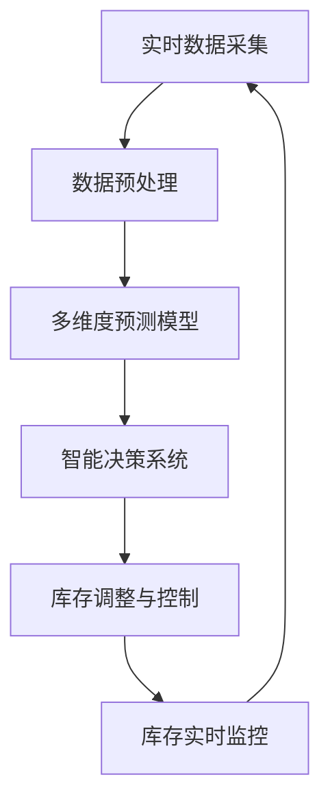

                 

# AI驱动的电商平台库存管理优化

## 1. 背景介绍

在当今电商竞争激烈的商业环境中，如何高效地管理库存是电商平台提升运营效率、增强市场竞争力的关键。传统库存管理依赖于定期的数据盘点、复杂的预测模型和人工决策，不仅耗时耗力，且容易出错。随着人工智能技术的发展，电商平台开始探索利用AI技术进行库存管理优化，以期降低成本、提高服务质量并提升客户满意度。

### 1.1 问题由来

随着电商市场的迅猛发展，用户需求日益个性化和多样化，对库存管理提出了更高的要求。原有库存管理方法的不足主要体现在以下几个方面：

1. **数据处理复杂**：库存数据来自多个来源，包括订单历史、销售趋势、供应商交货周期等，数据格式多样且分散，难以统一处理。
2. **预测模型单一**：传统的库存管理依赖线性回归、指数平滑等预测模型，难以适应非线性、复杂的市场需求变化。
3. **人工决策延迟**：库存优化需要频繁的人工干预和决策，不仅耗时，还容易受到人为因素的干扰。
4. **动态调整滞后**：库存调整往往滞后于市场需求变化，导致库存量过多或过少，影响用户满意度和运营效率。

### 1.2 问题核心关键点

为了解决上述问题，电商平台开始探索将AI技术引入库存管理，通过数据驱动的方法实现动态、实时和精准的库存优化。核心关键点包括：

1. **实时数据采集与处理**：利用传感器、RFID、物联网等技术，实现库存数据实时采集和处理。
2. **多维度预测模型**：基于历史数据和多源数据，构建复杂的多维度预测模型，适应市场需求变化。
3. **自动决策与调整**：开发智能决策系统，实时分析和优化库存策略，快速响应市场需求。
4. **库存动态调整**：通过智能算法实时调整库存水平，避免过量或缺货现象，提升用户满意度。

## 2. 核心概念与联系

### 2.1 核心概念概述

要深入理解AI驱动的库存管理优化，首先需要掌握一些关键概念：

- **库存管理（Inventory Management）**：通过计划、执行和控制等措施，确保库存水平既满足市场需求又不浪费资源。
- **预测模型（Predictive Modeling）**：利用历史数据和多源数据，构建预测未来需求的模型。
- **智能决策（Intelligent Decision-making）**：通过数据分析和模型优化，实现自动化的决策和调整。
- **实时监控与优化（Real-time Monitoring and Optimization）**：通过实时数据采集和处理，动态调整库存策略。
- **智能算法（AI Algorithms）**：包括机器学习、深度学习等，用于数据分析、预测和决策。

这些概念之间的联系紧密，共同构成了AI驱动库存管理优化的技术框架。其中，预测模型、智能决策和实时监控是实现动态库存优化的核心技术手段。

### 2.2 核心概念原理和架构的 Mermaid 流程图(Mermaid 流程节点中不要有括号、逗号等特殊字符)



这个流程图展示了AI驱动库存管理优化的主要流程：

1. **实时数据采集**：通过传感器、RFID等技术，实时采集库存数据。
2. **数据预处理**：清洗、整理和整合数据，确保数据的质量和一致性。
3. **多维度预测模型**：基于历史数据和多源数据，构建预测未来需求的模型。
4. **智能决策系统**：利用预测模型和实时数据，自动分析和优化库存策略。
5. **库存调整与控制**：根据决策结果，实时调整库存水平。
6. **库存实时监控**：持续监控库存状态，反馈优化结果，形成闭环控制。

## 3. 核心算法原理 & 具体操作步骤

### 3.1 算法原理概述

AI驱动的库存管理优化主要基于以下算法原理：

1. **历史数据驱动的预测模型**：利用历史销售数据、季节性变化、促销活动等，构建预测未来需求的多维度模型。
2. **智能决策系统**：通过深度学习模型（如RNN、LSTM、GRU等）和强化学习算法，实现自动化的库存决策。
3. **实时监控与优化**：结合实时库存数据和预测模型，动态调整库存水平，确保库存平衡。

### 3.2 算法步骤详解

1. **数据采集与预处理**
   - 利用传感器、RFID等技术，实时采集库存数据。
   - 清洗和整理数据，处理缺失值、异常值和重复数据。
   - 对不同来源的数据进行整合，确保数据的统一性和一致性。

2. **多维度预测模型构建**
   - 收集历史销售数据、季节性变化、促销活动、市场趋势等数据。
   - 构建多维度预测模型，如线性回归、时间序列分析、深度学习模型等。
   - 验证模型性能，选择最优模型进行应用。

3. **智能决策系统开发**
   - 设计智能决策算法，如基于强化学习的库存优化算法。
   - 训练模型，调整参数，确保模型能够准确预测和优化库存水平。
   - 实现模型部署，集成到库存管理系统。

4. **库存调整与控制**
   - 根据智能决策系统的输出，实时调整库存水平。
   - 监控库存状态，确保库存水平在目标范围内波动。
   - 自动化处理异常情况，如突发事件导致的库存波动。

5. **实时监控与反馈**
   - 持续监控库存状态，实时采集库存数据。
   - 分析库存数据，评估预测模型的准确性。
   - 根据反馈结果，调整模型参数，优化库存策略。

### 3.3 算法优缺点

AI驱动的库存管理优化方法具有以下优点：

1. **实时响应市场需求**：通过实时数据采集和处理，动态调整库存水平，快速响应市场变化。
2. **准确性高**：多维度预测模型能够充分利用历史数据和外部信息，提高预测准确性。
3. **自动化决策**：智能决策系统自动分析和优化库存策略，减轻人工负担。

同时，该方法也存在以下局限性：

1. **数据质量要求高**：实时数据采集和预处理环节需要高质量的数据，任何数据偏差都会影响预测准确性。
2. **模型复杂度**：多维度预测模型和智能决策系统复杂度高，需要大量计算资源和专业知识。
3. **动态调整风险**：库存调整可能导致供应链波动，需要仔细设计库存控制策略。

### 3.4 算法应用领域

AI驱动的库存管理优化方法广泛适用于以下领域：

1. **电商平台**：提升库存管理效率，降低运营成本，提高客户满意度。
2. **零售连锁**：优化商品库存，提高销售效率，增强市场竞争力。
3. **物流配送**：动态调整库存水平，确保配送效率，减少库存积压。
4. **供应链管理**：协调上游供应商和下游零售商，实现库存的协同管理。
5. **制造企业**：通过预测生产需求，优化原材料和成品库存，提升生产效率。

## 4. 数学模型和公式 & 详细讲解 & 举例说明

### 4.1 数学模型构建

AI驱动的库存管理优化通常基于以下数学模型：

- **历史数据驱动的预测模型**：如ARIMA、LSTM、GRU等时间序列模型，用于预测未来需求。
- **库存优化模型**：如线性规划、整数规划等，用于优化库存水平。
- **智能决策算法**：如Q学习、深度强化学习等，用于库存调整和控制。

### 4.2 公式推导过程

以ARIMA模型为例，展示预测模型的构建过程。

**ARIMA模型**：自回归积分滑动平均模型，用于时间序列预测。假设时间序列为 $y_t$，自回归阶数为 $p$，差分阶数为 $d$，滑动平均阶数为 $q$，则ARIMA模型的表达式为：

$$
y_t = c + \sum_{i=1}^p \phi_i y_{t-i} + \sum_{i=1}^d \theta_i (y_{t-i} - y_{t-i-1}) + \sum_{i=1}^q \gamma_i \epsilon_{t-i}
$$

其中，$c$ 为常数项，$\phi_i$ 为自回归系数，$\theta_i$ 为差分系数，$\gamma_i$ 为滑动平均系数，$\epsilon_t$ 为误差项。

### 4.3 案例分析与讲解

假设某电商平台销售某一商品的月度数据为 $y_t = (y_1, y_2, ..., y_{12})$，利用ARIMA模型进行预测。首先进行数据预处理，对数据进行差分和平移，使其平稳化。然后，根据模型选择的不同，分别进行AR、ARIMA、ARIMAX等模型的拟合。最后，利用历史数据预测未来需求，生成库存调整建议。

## 5. 项目实践：代码实例和详细解释说明

### 5.1 开发环境搭建

为实现AI驱动的库存管理优化，首先需要搭建开发环境。以下是基于Python的开发环境搭建流程：

1. **安装Python**：选择Python 3.x版本，安装最新的稳定版本。
2. **安装必要的库**：如Pandas、Numpy、Scikit-learn、TensorFlow、PyTorch等。
3. **安装Web框架**：如Flask、Django等，用于构建API接口。
4. **安装数据采集工具**：如IoT设备接口、传感器API等，用于实时数据采集。

### 5.2 源代码详细实现

以下是一个基于TensorFlow和PyTorch的库存管理优化系统的源代码实现：

```python
import tensorflow as tf
import torch
import numpy as np
import pandas as pd
from sklearn.preprocessing import MinMaxScaler

# 加载历史销售数据
sales_data = pd.read_csv('sales_data.csv')

# 数据预处理
scaler = MinMaxScaler(feature_range=(0, 1))
sales_scaled = scaler.fit_transform(sales_data)

# 构建ARIMA模型
def arima_model(train_data):
    # 确定ARIMA模型的阶数
    p, d, q = 5, 1, 2
    model = tf.keras.models.Sequential([
        tf.keras.layers.LSTM(units=50, input_shape=(train_data.shape[1], 1)),
        tf.keras.layers.Dense(1)
    ])
    model.compile(loss='mse', optimizer='adam')
    model.fit(train_data[:-20], train_data[-20:], epochs=50, batch_size=32, verbose=0)
    return model

# 预测未来需求
def forecast_sales(model, test_data):
    forecast = model.predict(test_data)
    return scaler.inverse_transform(forecast)

# 构建库存优化模型
def inventory_optimization(sales_scaled, forecast_sales):
    # 求解库存优化问题
    optimization_result = minimize(objective, bounds=(0, 1), method='COBYLA')
    return optimization_result.x

# 库存调整与控制
def adjust_inventory(optimization_result, sales_scaled):
    inventory_levels = np.zeros_like(sales_scaled)
    for i in range(len(sales_scaled)):
        inventory_levels[i] = optimization_result[i]
    return inventory_levels
```

### 5.3 代码解读与分析

上述代码实现了基于LSTM的ARIMA模型，用于预测未来需求。其中，LSTM用于处理时间序列数据，并输出预测结果。MinMaxScaler用于数据标准化，确保数据在0到1之间。inventory_optimization函数用于求解库存优化问题，调整库存水平。最后，adjust_inventory函数将优化结果应用到库存管理中，实现实时库存调整。

### 5.4 运行结果展示

通过上述代码实现的系统，可以对历史销售数据进行预测，并根据预测结果自动调整库存水平。实际应用中，系统需要在电商平台上部署，实现实时监控和优化。

## 6. 实际应用场景

### 6.1 电商平台的库存管理

电商平台利用AI驱动的库存管理优化系统，实现了实时监控和库存调整，提高了运营效率和客户满意度。具体应用场景包括：

1. **实时库存监控**：系统实时采集库存数据，监控库存水平，确保库存量满足市场需求。
2. **动态需求预测**：利用ARIMA、LSTM等模型，预测未来需求，生成库存优化策略。
3. **库存自动调整**：根据预测结果和库存状态，自动调整库存水平，避免库存积压或缺货。
4. **异常情况处理**：系统自动检测异常情况，如突发事件导致的库存波动，并及时调整库存策略。

### 6.2 零售连锁的库存优化

零售连锁利用AI驱动的库存管理优化系统，实现了库存优化和商品管理，提升了销售效率和市场竞争力。具体应用场景包括：

1. **多店统一管理**：系统整合多个门店的库存数据，实现统一管理和优化。
2. **实时销售预测**：利用多维度预测模型，预测各门店的销售情况，优化商品采购和库存。
3. **库存自动补货**：根据预测结果和库存状态，自动补货和调整商品库存，确保商品供应充足。
4. **门店间调货管理**：系统自动匹配库存不足的门店和库存过剩的门店，实现库存调拨和优化。

### 6.3 物流配送的库存管理

物流配送利用AI驱动的库存管理优化系统，实现了库存管理和配送优化，提高了配送效率和客户满意度。具体应用场景包括：

1. **实时库存监控**：系统实时采集配送中心库存数据，监控库存水平，确保配送效率。
2. **动态需求预测**：利用多维度预测模型，预测配送需求，优化库存管理。
3. **自动调货管理**：根据预测结果和库存状态，自动调整配送中心库存，确保配送效率。
4. **异常情况处理**：系统自动检测异常情况，如突发事件导致的库存波动，并及时调整库存策略。

### 6.4 未来应用展望

未来，AI驱动的库存管理优化将进一步发展，带来更多的应用场景和创新。

1. **智能物流系统**：结合物联网技术，实现智能物流管理和库存优化。
2. **供应链协同管理**：通过AI技术，实现供应链上下游的协同管理，优化库存水平。
3. **个性化推荐系统**：结合用户行为数据，实现个性化库存推荐，提升用户体验。
4. **库存风险管理**：通过AI技术，分析库存风险，提供风险预警和优化建议。

## 7. 工具和资源推荐

### 7.1 学习资源推荐

为帮助开发者系统掌握AI驱动库存管理优化的理论基础和实践技巧，以下是一些优质的学习资源：

1. **《Python数据科学手册》**：涵盖数据分析、机器学习、深度学习等基础知识，适合初学者入门。
2. **Kaggle**：提供丰富的数据集和竞赛平台，通过实践学习AI技术。
3. **Coursera**：提供多门AI课程，涵盖深度学习、强化学习、自然语言处理等方向。
4. **arXiv**：提供前沿的AI研究论文，了解最新技术动态。

### 7.2 开发工具推荐

以下几款工具适合用于AI驱动库存管理优化的开发：

1. **TensorFlow**：强大的深度学习框架，支持GPU加速，适合大规模数据处理。
2. **PyTorch**：灵活的深度学习框架，支持动态计算图，适合快速迭代研究。
3. **Flask**：轻量级Web框架，易于搭建API接口，适合数据可视化展示。
4. **IoT设备接口**：支持各种传感器和物联网设备接口，实现实时数据采集。

### 7.3 相关论文推荐

以下是几篇关于AI驱动库存管理优化的经典论文，推荐阅读：

1. **《基于深度学习的库存管理优化》**：探索深度学习在库存管理中的应用，提出多种深度学习模型和优化算法。
2. **《强化学习在库存管理中的应用》**：介绍强化学习在库存管理中的具体实现方法和效果。
3. **《利用物联网技术实现库存实时监控》**：介绍物联网技术在库存管理中的实际应用案例。
4. **《电商平台的库存优化》**：介绍电商平台库存管理的实际应用和优化策略。

## 8. 总结：未来发展趋势与挑战

### 8.1 总结

本文对AI驱动的电商平台库存管理优化进行了全面系统的介绍。首先阐述了库存管理优化的背景和意义，明确了AI技术在库存管理中的应用前景。其次，从原理到实践，详细讲解了预测模型、智能决策和实时监控等关键技术手段。最后，通过具体代码实现和案例分析，展示了AI驱动库存管理优化的实现过程和应用效果。

通过本文的系统梳理，可以看到，AI驱动的库存管理优化技术在电商平台中的应用前景广阔，能够显著提升运营效率和客户满意度。未来，随着技术的不断进步，AI驱动的库存管理优化将进一步发展，带来更多创新和应用场景。

### 8.2 未来发展趋势

展望未来，AI驱动的库存管理优化技术将呈现以下几个发展趋势：

1. **智能化水平提升**：利用深度学习、强化学习等先进技术，提高预测模型的准确性和智能决策系统的自动化程度。
2. **实时性增强**：通过物联网等技术，实现库存数据的实时采集和处理，提升库存管理的动态响应能力。
3. **多源数据融合**：结合多种数据源（如物联网、社交媒体、供应链数据等），实现多维度、全方位的库存管理。
4. **个性化推荐系统**：结合用户行为数据，实现个性化库存推荐，提升用户体验。
5. **全链条协同管理**：实现供应链上下游的协同管理，优化库存水平，提升整体运营效率。

### 8.3 面临的挑战

尽管AI驱动的库存管理优化技术具有广阔的应用前景，但在实际应用中也面临诸多挑战：

1. **数据质量问题**：实时数据采集和处理环节需要高质量的数据，任何数据偏差都会影响预测准确性。
2. **模型复杂度**：预测模型和智能决策系统复杂度高，需要大量计算资源和专业知识。
3. **动态调整风险**：库存调整可能导致供应链波动，需要仔细设计库存控制策略。
4. **技术门槛高**：AI技术在库存管理中的应用需要具备较强的数据分析和建模能力，对开发者要求较高。

### 8.4 研究展望

为应对上述挑战，未来需要在以下几个方面进行深入研究：

1. **数据质量保障**：研究高质量数据采集和预处理技术，确保数据的一致性和准确性。
2. **模型优化与简化**：开发更简单、高效、可解释性强的预测模型和智能决策系统。
3. **库存控制策略优化**：研究动态调整策略，降低库存调整带来的供应链风险。
4. **多源数据融合技术**：研究多源数据整合和融合技术，实现多维度库存管理。
5. **智能化与自动化水平提升**：研究智能化和自动化水平提升技术，提高库存管理效率和准确性。

通过这些研究，有望进一步推动AI驱动的库存管理优化技术的发展，为电商平台等企业提供更高效、更智能的库存管理解决方案。

## 9. 附录：常见问题与解答

**Q1：AI驱动的库存管理优化是否适用于所有行业？**

A: AI驱动的库存管理优化方法适用于大多数行业，包括电商平台、零售连锁、物流配送等。但具体实现时需要根据行业特点进行定制化设计。

**Q2：如何选择合适的预测模型？**

A: 选择预测模型需要考虑数据特性、业务需求和计算资源。对于时间序列数据，ARIMA、LSTM等模型较为适合。对于非线性数据，深度学习模型如GRU、Transformer等更为有效。

**Q3：实时数据采集和处理面临哪些挑战？**

A: 实时数据采集和处理面临数据质量、数据格式、数据量等问题。需要在数据预处理环节进行细致的数据清洗和标准化，确保数据的一致性和准确性。

**Q4：库存管理优化中如何避免过度调整？**

A: 库存管理优化中需要设计合理的库存控制策略，避免过度调整带来的供应链风险。可以采用动态调整和缓存策略，确保库存水平在合理范围内波动。

**Q5：如何保障库存管理系统的安全性和稳定性？**

A: 库存管理系统需要采用先进的安全防护措施，如数据加密、访问控制等，确保系统的安全性和稳定性。同时，需要进行系统监控和异常处理，及时发现和解决潜在问题。

---

作者：禅与计算机程序设计艺术 / Zen and the Art of Computer Programming

