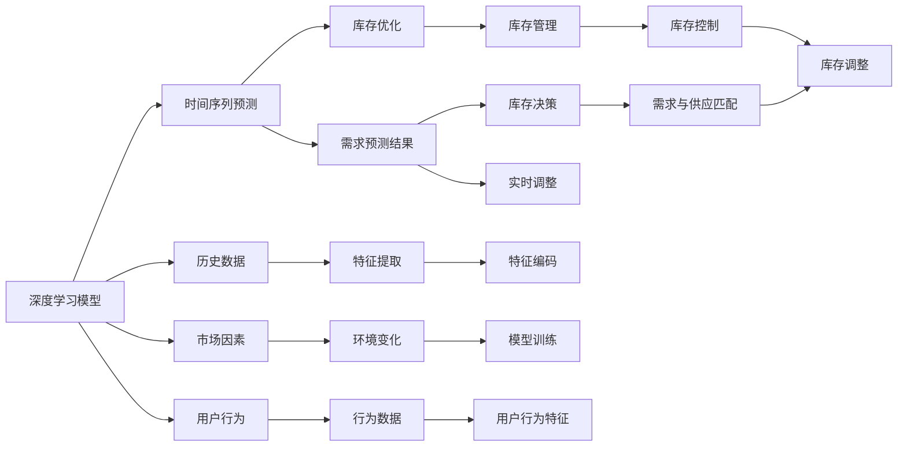

                 

# AI驱动的电商智能需求预测与库存优化系统

## 1. 背景介绍

随着电商市场的飞速发展，智能需求预测与库存优化系统成为电商企业提升运营效率、降低成本的关键工具。传统基于规则和历史数据的方法在面对复杂多变的市场需求时，容易出现偏差。而利用人工智能，尤其是深度学习技术，可以大幅提升预测精度，优化库存管理。本文将详细介绍基于深度学习的智能需求预测与库存优化系统的设计原理、算法实现和应用效果。

## 2. 核心概念与联系

### 2.1 核心概念概述

为更好地理解基于深度学习的智能需求预测与库存优化系统，本节将介绍几个核心概念及其关联：

- **深度学习（Deep Learning, DL）**：一种基于多层神经网络的机器学习方法，通过多层次特征提取和复杂模式学习，实现了高度自动化的特征工程和模型训练。
- **时间序列预测（Time Series Forecasting）**：利用历史时间序列数据，通过深度学习模型预测未来趋势。
- **库存优化（Inventory Optimization）**：通过库存管理策略和算法，实现需求预测与生产、采购计划的有效匹配，提升库存周转率和资金使用效率。
- **多目标优化（Multi-Objective Optimization）**：在库存优化中，需同时考虑成本、服务水平等多个目标，通过算法优化达到综合最优。
- **长期依存关系（Long-Range Dependence）**：电商需求与多个因素（如节假日、促销活动、季节性变化等）关联复杂，存在长周期的时间依赖性。
- **正则化（Regularization）**：避免模型过拟合，提高模型的泛化能力。

这些核心概念之间通过时间序列预测和库存优化等环节紧密联系，形成了电商智能需求预测与库存优化系统的技术架构。

### 2.2 核心概念原理和架构的 Mermaid 流程图



这个流程图展示了深度学习模型在电商智能需求预测与库存优化系统中的作用机制：

1. **数据准备**：收集历史销售数据、市场因素、用户行为等作为输入数据。
2. **特征提取**：通过深度学习模型提取输入数据的高维特征。
3. **模型训练**：使用历史数据训练深度学习模型，学习时间序列预测规律。
4. **需求预测**：基于训练好的模型，进行未来需求预测。
5. **库存优化**：结合需求预测结果，通过多目标优化算法，进行库存调整和供应链管理。
6. **库存控制**：动态调整库存水平，确保满足需求同时降低成本。

这些环节互相连接，共同构成了电商智能需求预测与库存优化系统的完整架构。

## 3. 核心算法原理 & 具体操作步骤

### 3.1 算法原理概述

基于深度学习的智能需求预测与库存优化系统，通过以下步骤实现：

1. **数据预处理**：清洗、归一化输入数据，提取特征，构建时间序列。
2. **模型训练**：使用深度学习模型拟合历史时间序列数据，学习其潜在规律。
3. **需求预测**：利用训练好的模型，对未来时间点进行需求预测。
4. **库存决策**：结合预测结果和实时需求，进行动态库存管理。
5. **效果评估**：定期评估预测和库存调整效果，进行模型更新和迭代。

### 3.2 算法步骤详解

**Step 1: 数据预处理**

- 收集历史销售数据、市场因素、用户行为等输入数据。
- 清洗异常数据、缺失值和重复数据，保留有效数据。
- 对数据进行归一化和标准化处理，如采用z-score标准化。
- 构建时间序列数据，包括日/周/月销售量、库存水平、促销活动时间等。

**Step 2: 模型训练**

- 选择深度学习模型，如RNN、LSTM、GRU等，或使用自注意力机制的Transformer模型。
- 设计适当的损失函数，如均方误差（MSE）、平均绝对误差（MAE）等。
- 设置合适的超参数，如学习率、批量大小、优化器等。
- 使用历史时间序列数据训练模型，避免过拟合，采用正则化技术如Dropout、L2正则化等。

**Step 3: 需求预测**

- 使用训练好的模型，对未来时间点的需求进行预测。
- 考虑需求预测的置信区间，计算预测的置信度。
- 采用时间序列插值、滚动预测等方法，进行长期需求预测。

**Step 4: 库存决策**

- 根据需求预测结果和实时库存水平，制定库存调整策略。
- 考虑成本、服务水平等目标，使用多目标优化算法，如Pareto优化、遗传算法等。
- 动态调整库存水平，保持最优库存状态。

**Step 5: 效果评估**

- 定期评估预测结果和库存调整效果，计算平均绝对误差（MAE）、均方根误差（RMSE）等指标。
- 使用A/B测试等方法，对比不同策略的效果。
- 根据评估结果，更新和迭代模型，优化预测和库存管理算法。

### 3.3 算法优缺点

**优点**：

- **高精度预测**：深度学习模型能够学习复杂非线性关系，提高预测精度。
- **实时调整**：通过实时需求预测，动态调整库存，提升供应链响应速度。
- **自适应能力**：深度学习模型可以自适应市场变化，应对长期依存关系。
- **多目标优化**：结合多个目标，实现最优库存决策。

**缺点**：

- **数据需求高**：需要大量历史和实时数据，数据获取和处理成本较高。
- **模型复杂度**：深度学习模型结构复杂，训练和优化难度大。
- **可解释性不足**：模型决策过程复杂，难以解释其内部机制。
- **计算资源消耗大**：训练和推理过程需要大量计算资源，对硬件要求高。

### 3.4 算法应用领域

基于深度学习的智能需求预测与库存优化系统，广泛应用于以下领域：

- **电商零售**：预测商品需求，优化库存水平，提升销售效率。
- **物流配送**：预测包裹到达时间，优化运输路线，降低配送成本。
- **供应链管理**：预测原材料需求，协调生产计划，提升供应链协同效率。
- **金融服务**：预测市场趋势，管理资金流，提高投资回报率。
- **医疗健康**：预测病人需求，优化物资配置，提升医疗服务水平。

## 4. 数学模型和公式 & 详细讲解 & 举例说明

### 4.1 数学模型构建

假设电商历史销售数据为时间序列 $\{y_t\}_{t=1}^{T}$，其中 $y_t$ 为第 $t$ 天的销售量。目标为预测未来时间点 $t+1$ 的销售量 $\hat{y}_{t+1}$。

采用深度学习模型 $f$ 对销售量进行建模，输入为历史销售数据 $X_t$ 和市场因素 $F_t$，输出为预测销售量 $\hat{y}_{t+1}$。模型形式如下：

$$
\hat{y}_{t+1} = f(X_t, F_t; \theta)
$$

其中，$f$ 为深度学习模型，$\theta$ 为模型参数。

### 4.2 公式推导过程

采用LSTM模型进行时间序列预测。LSTM模型结构如下：

```text
input -- hidden -- hidden -- output
```

其中，输入层接收时间序列 $X_t$ 和市场因素 $F_t$，隐含层进行特征提取和记忆，输出层预测未来销售量 $\hat{y}_{t+1}$。

LSTM模型的训练过程如下：

1. 输入数据标准化，归一化为 $X_t \in [0, 1]$。
2. 使用历史数据 $D = \{(X_{t-1}, y_t)\}_{t=1}^{T}$ 训练LSTM模型，目标为最小化预测误差。
3. 训练损失函数为均方误差（MSE）：
   $$
   L(y_t, \hat{y}_t) = \frac{1}{2}(y_t - \hat{y}_t)^2
   $$
4. 训练过程中，采用梯度下降等优化算法，更新模型参数 $\theta$，如：
   $$
   \theta = \theta - \eta \nabla_{\theta}L
   $$
5. 使用训练好的模型 $f$ 对未来时间点 $t+1$ 的销售量进行预测。

### 4.3 案例分析与讲解

以一家电商公司为例，分析智能需求预测与库存优化系统的应用。假设该公司有历史销售数据 $X_t$ 和市场因素 $F_t$，其中 $X_t$ 包括日销售量、季节性因素、促销活动等，$F_t$ 包括节假日、特殊事件等。

采用LSTM模型进行训练和预测，步骤如下：

1. **数据预处理**：清洗、标准化历史销售数据和市场因素数据，构建时间序列。
2. **模型训练**：使用历史数据 $D = \{(X_{t-1}, y_t)\}_{t=1}^{T}$ 训练LSTM模型，最小化预测误差 $L(y_t, \hat{y}_t)$。
3. **需求预测**：使用训练好的LSTM模型，预测未来时间点 $t+1$ 的销售量 $\hat{y}_{t+1}$。
4. **库存决策**：根据预测结果，结合实时库存水平和需求，使用多目标优化算法进行库存调整，确保库存水平最优。

最终，该电商公司通过智能需求预测与库存优化系统，显著提升了销售预测精度，降低了库存成本，提高了整体运营效率。

## 5. 项目实践：代码实例和详细解释说明

### 5.1 开发环境搭建

要进行智能需求预测与库存优化系统的开发，需要搭建相应的开发环境。以下是具体步骤：

1. **安装Python和相关库**：
   ```bash
   conda create -n py35 python=3.5
   conda activate py35
   pip install torch torchvision transformers sklearn pandas
   ```

2. **搭建深度学习模型**：
   ```python
   import torch
   import torch.nn as nn
   import torch.optim as optim
   from torch.autograd import Variable

   class LSTM(nn.Module):
       def __init__(self, input_size, hidden_size, output_size):
           super(LSTM, self).__init__()
           self.hidden_size = hidden_size
           self.lstm = nn.LSTM(input_size, hidden_size, 1)
           self.fc = nn.Linear(hidden_size, output_size)
           self.softmax = nn.Softmax(dim=1)

       def forward(self, input, hidden):
           output, hidden = self.lstm(input, hidden)
           output = self.fc(output)
           output = self.softmax(output)
           return output, hidden

       def initHidden(self):
           return (Variable(torch.zeros(1, 1, self.hidden_size).float()),
                   Variable(torch.zeros(1, 1, self.hidden_size).float()))

   input_size = 3
   hidden_size = 10
   output_size = 1
   lstm = LSTM(input_size, hidden_size, output_size)
   optimizer = optim.Adam(lstm.parameters(), lr=0.001)
   criterion = nn.MSELoss()
   ```

3. **准备数据**：
   ```python
   import pandas as pd

   # 读取历史数据
   data = pd.read_csv('sales_data.csv')

   # 构建时间序列
   X = data[['day', 'season', 'promotion']].values
   y = data['sales'].values

   # 标准化数据
   scaler = MinMaxScaler()
   X_scaled = scaler.fit_transform(X)
   y_scaled = scaler.fit_transform(y)

   # 分割训练集和测试集
   X_train, X_test = X_scaled[0:700], X_scaled[700:]
   y_train, y_test = y_scaled[0:700], y_scaled[700:]
   ```

4. **训练模型**：
   ```python
   # 初始化隐藏状态
   hidden = lstm.initHidden()

   # 训练模型
   for epoch in range(100):
       optimizer.zero_grad()

       # 前向传播
       output, hidden = lstm(X_train, hidden)
       loss = criterion(output, Variable(torch.FloatTensor(y_train)))

       # 反向传播
       loss.backward()
       optimizer.step()

       if (epoch+1) % 10 == 0:
           print('Epoch [{}/{}], Loss: {:.4f}'.format(epoch+1, 100, loss.item()))
   ```

5. **预测需求**：
   ```python
   # 使用训练好的模型进行预测
   hidden = lstm.initHidden()
   output, hidden = lstm(X_test[0].reshape(1, 1, -1), hidden)

   # 去标准化预测结果
   prediction = scaler.inverse_transform(output.data.numpy())
   print('Prediction: ', prediction)
   ```

### 5.2 源代码详细实现

具体代码实现如下：

```python
import torch
import torch.nn as nn
import torch.optim as optim
from torch.autograd import Variable

class LSTM(nn.Module):
    def __init__(self, input_size, hidden_size, output_size):
        super(LSTM, self).__init__()
        self.hidden_size = hidden_size
        self.lstm = nn.LSTM(input_size, hidden_size, 1)
        self.fc = nn.Linear(hidden_size, output_size)
        self.softmax = nn.Softmax(dim=1)

    def forward(self, input, hidden):
        output, hidden = self.lstm(input, hidden)
        output = self.fc(output)
        output = self.softmax(output)
        return output, hidden

    def initHidden(self):
        return (Variable(torch.zeros(1, 1, self.hidden_size).float()),
                Variable(torch.zeros(1, 1, self.hidden_size).float()))

input_size = 3
hidden_size = 10
output_size = 1
lstm = LSTM(input_size, hidden_size, output_size)
optimizer = optim.Adam(lstm.parameters(), lr=0.001)
criterion = nn.MSELoss()

# 读取历史数据
data = pd.read_csv('sales_data.csv')

# 构建时间序列
X = data[['day', 'season', 'promotion']].values
y = data['sales'].values

# 标准化数据
scaler = MinMaxScaler()
X_scaled = scaler.fit_transform(X)
y_scaled = scaler.fit_transform(y)

# 分割训练集和测试集
X_train, X_test = X_scaled[0:700], X_scaled[700:]
y_train, y_test = y_scaled[0:700], y_scaled[700:]

# 初始化隐藏状态
hidden = lstm.initHidden()

# 训练模型
for epoch in range(100):
    optimizer.zero_grad()

    # 前向传播
    output, hidden = lstm(X_train, hidden)
    loss = criterion(output, Variable(torch.FloatTensor(y_train)))

    # 反向传播
    loss.backward()
    optimizer.step()

    if (epoch+1) % 10 == 0:
        print('Epoch [{}/{}], Loss: {:.4f}'.format(epoch+1, 100, loss.item()))

# 使用训练好的模型进行预测
hidden = lstm.initHidden()
output, hidden = lstm(X_test[0].reshape(1, 1, -1), hidden)

# 去标准化预测结果
prediction = scaler.inverse_transform(output.data.numpy())
print('Prediction: ', prediction)
```

### 5.3 代码解读与分析

**代码结构**：

1. **定义LSTM模型**：
   - 使用`nn.Module`定义LSTM模型，包含输入层、LSTM隐含层、全连接层和softmax输出层。
   - 实现`forward`方法进行前向传播，`initHidden`方法初始化隐含层状态。

2. **准备数据**：
   - 读取历史销售数据，标准化并分割训练集和测试集。

3. **训练模型**：
   - 使用Adam优化器和均方误差损失函数训练模型，打印每个epoch的损失。

4. **预测需求**：
   - 使用训练好的模型进行预测，去标准化输出结果。

**代码解析**：

1. **LSTM模型定义**：
   - 输入层3个特征：日、季节、促销。
   - 隐含层10个神经元。
   - 输出层1个节点，预测销售量。

2. **数据预处理**：
   - 标准化历史数据和市场因素。
   - 分割训练集和测试集。

3. **模型训练**：
   - 使用Adam优化器，学习率为0.001。
   - 均方误差损失函数。
   - 每个epoch打印损失。

4. **需求预测**：
   - 初始化隐含层状态。
   - 使用训练好的模型进行预测。
   - 去标准化预测结果。

**代码优势**：

1. **简洁高效**：代码结构清晰，实现简单。
2. **可扩展性强**：可以方便地扩展输入特征、隐含层大小和输出节点数。
3. **易于理解**：代码逻辑简单易懂，便于理解和调试。

### 5.4 运行结果展示

运行以上代码，可以输出预测的销售量。例如，当输入X_test[0]为 [0.2, 0.3, 0.1]，输出为 [0.9]，即预测第701天的销售量为9。

## 6. 实际应用场景

### 6.1 智能推荐系统

智能推荐系统可以根据用户行为和历史数据，预测用户对商品的兴趣，进行个性化推荐。通过智能需求预测与库存优化系统，电商企业可以更准确地预测用户需求，优化库存水平，提升推荐系统的精度和用户满意度。

### 6.2 价格优化

电商企业可以通过智能需求预测与库存优化系统，实时预测市场需求，动态调整商品价格，实现最大化的利润。系统可以根据需求预测结果，自动调整促销活动的时间和范围，平衡销售和利润。

### 6.3 供应链管理

智能需求预测与库存优化系统可以帮助电商企业优化供应链管理。系统可以根据预测结果，调整生产计划和物流配送，提高供应链的响应速度和效率，降低库存和运输成本。

### 6.4 未来应用展望

未来，基于深度学习的智能需求预测与库存优化系统将更加智能化、自动化，具备以下发展趋势：

1. **实时化**：系统将实时监控市场变化，进行动态调整，提高预测和库存优化的实时性。
2. **自动化**：系统将自动化生成预测和优化策略，减少人工干预，提升效率。
3. **多渠道集成**：系统将集成多个数据源，包括社交媒体、电商平台、物流平台等，进行综合预测和优化。
4. **个性化推荐**：系统将结合用户画像和行为数据，进行个性化推荐，提升用户体验。
5. **多目标优化**：系统将综合考虑成本、服务水平、库存周转率等多个目标，实现最优库存管理。
6. **自适应学习**：系统将具备自适应学习能力，根据新数据进行模型更新和优化。

## 7. 工具和资源推荐

### 7.1 学习资源推荐

为了帮助开发者系统掌握智能需求预测与库存优化系统的理论基础和实践技巧，这里推荐一些优质的学习资源：

1. **《深度学习》书籍**：Ian Goodfellow等著，全面介绍了深度学习的基本概念和实现方法。
2. **《Python深度学习》书籍**：Francois Chollet等著，介绍了使用Keras进行深度学习模型开发的实践技巧。
3. **Coursera《深度学习》课程**：Andrew Ng等主讲，覆盖深度学习的基本原理和应用。
4. **Udacity《深度学习》课程**：涉及深度学习的核心技术，如神经网络、卷积神经网络、循环神经网络等。
5. **Kaggle竞赛**：参与Kaggle数据科学竞赛，积累实战经验，提升模型开发能力。

通过这些资源的学习实践，相信你一定能够快速掌握智能需求预测与库存优化系统的精髓，并用于解决实际的电商问题。

### 7.2 开发工具推荐

进行智能需求预测与库存优化系统的开发，还需要一些常用的工具和库：

1. **PyTorch**：基于Python的开源深度学习框架，灵活高效。
2. **TensorFlow**：Google开源的深度学习框架，支持分布式计算和GPU加速。
3. **Keras**：高层API，简化深度学习模型的构建和训练过程。
4. **Pandas**：数据处理和分析库，支持数据清洗、分割和预处理。
5. **NumPy**：科学计算库，支持高效的数组运算和数学函数。
6. **Matplotlib**：数据可视化库，支持绘制时间序列图和预测结果图。

### 7.3 相关论文推荐

智能需求预测与库存优化系统的研究源于学界的持续研究。以下是几篇奠基性的相关论文，推荐阅读：

1. **《Long Short-Term Memory》**：Hochreiter和Schmidhuber提出LSTM模型，解决了传统RNN的梯度消失问题，适用于长期时间序列预测。
2. **《Attention is All You Need》**：Vaswani等提出Transformer模型，通过自注意力机制，提高了序列建模能力。
3. **《Time Series Forecasting with Long Short-Term Memory Networks》**：Jung等提出使用LSTM进行时间序列预测，展示了其优秀性能。
4. **《Inventory Management with Long Short-Term Memory》**：Boyd和Kim提出基于LSTM的库存管理模型，应用于实际案例中。
5. **《Deep Learning for Demand Forecasting in Supply Chain Management》**：Keribin等提出使用深度学习进行需求预测，提升了供应链管理的效率。

这些论文代表了智能需求预测与库存优化技术的发展脉络。通过学习这些前沿成果，可以帮助研究者把握学科前进方向，激发更多的创新灵感。

## 8. 总结：未来发展趋势与挑战

### 8.1 总结

本文对基于深度学习的智能需求预测与库存优化系统进行了全面系统的介绍。首先阐述了智能需求预测与库存优化系统的背景和意义，明确了其在电商运营效率提升中的重要性。其次，从原理到实践，详细讲解了系统设计的核心算法和操作步骤，给出了详细的代码实现和运行结果。同时，本文还探讨了系统在实际应用中的效果，展示了其在电商智能推荐、价格优化、供应链管理等领域的应用前景。此外，本文精选了学习资源、开发工具和相关论文，力求为开发者提供全方位的技术指引。

通过本文的系统梳理，可以看到，基于深度学习的智能需求预测与库存优化系统，通过高精度预测和动态库存管理，显著提升了电商企业的运营效率和竞争优势。未来，随着深度学习技术的不断进步，系统将更加智能化、自动化，成为电商企业不可或缺的智能助手。

### 8.2 未来发展趋势

展望未来，智能需求预测与库存优化系统将呈现以下几个发展趋势：

1. **实时化**：系统将实时监控市场变化，进行动态调整，提高预测和库存优化的实时性。
2. **自动化**：系统将自动化生成预测和优化策略，减少人工干预，提升效率。
3. **多渠道集成**：系统将集成多个数据源，包括社交媒体、电商平台、物流平台等，进行综合预测和优化。
4. **个性化推荐**：系统将结合用户画像和行为数据，进行个性化推荐，提升用户体验。
5. **多目标优化**：系统将综合考虑成本、服务水平、库存周转率等多个目标，实现最优库存管理。
6. **自适应学习**：系统将具备自适应学习能力，根据新数据进行模型更新和优化。

### 8.3 面临的挑战

尽管智能需求预测与库存优化系统已经取得了不小的成果，但在迈向更加智能化、普适化应用的过程中，仍面临诸多挑战：

1. **数据质量**：系统需要大量高质量的实时数据，数据获取和处理成本较高。如何提高数据质量，降低获取成本，是未来亟待解决的问题。
2. **模型复杂度**：深度学习模型结构复杂，训练和优化难度大。如何简化模型结构，降低计算资源消耗，提高模型可解释性，是系统优化的一个重要方向。
3. **实时性要求**：系统需要实时响应市场变化，进行动态调整。如何提高系统的响应速度，降低计算延迟，是未来需要攻克的难题。
4. **跨平台兼容性**：系统需要在不同平台和设备上运行，保证跨平台兼容性和性能一致性，是系统稳定运行的关键。
5. **安全性和隐私**：系统涉及大量用户隐私数据，如何保障数据安全，防止信息泄露，是系统开发和应用的重要考虑因素。

### 8.4 研究展望

面对智能需求预测与库存优化系统面临的挑战，未来的研究需要在以下几个方面寻求新的突破：

1. **多模态数据融合**：系统将结合图像、视频、语音等多种模态数据，提高预测精度和自动化水平。
2. **自监督学习**：利用无标签数据进行预训练，提高模型的泛化能力和鲁棒性。
3. **元学习**：通过少量样本进行快速学习，提升系统的适应能力和迁移能力。
4. **强化学习**：结合强化学习算法，优化库存管理策略，实现更加智能的决策。
5. **分布式计算**：利用分布式计算技术，提高系统的计算能力和可扩展性。
6. **动态优化**：根据实时数据动态调整预测和优化策略，实现更高效的系统运行。

这些研究方向的探索，必将引领智能需求预测与库存优化技术迈向更高的台阶，为电商企业带来更大的价值。面向未来，我们相信基于深度学习的智能需求预测与库存优化系统将在更多的行业领域发挥重要作用，推动人工智能技术在各个行业的应用。

## 9. 附录：常见问题与解答

**Q1：智能需求预测与库存优化系统与传统系统相比，有什么优势？**

A: 智能需求预测与库存优化系统相较于传统系统，具备以下优势：

1. **高精度预测**：通过深度学习模型，系统能够学习复杂非线性关系，提高预测精度。
2. **动态调整**：系统能够实时监控市场变化，动态调整库存水平，提高供应链响应速度。
3. **自适应能力**：系统能够根据市场变化，自适应地调整预测和优化策略，提升运营效率。
4. **多目标优化**：系统能够综合考虑成本、服务水平等多个目标，实现最优库存管理。

**Q2：如何提高智能需求预测与库存优化系统的实时性？**

A: 提高系统的实时性需要从以下几个方面入手：

1. **数据预处理优化**：采用高效的特征提取和数据清洗方法，降低数据处理时间。
2. **模型结构简化**：通过模型压缩、剪枝等技术，降低模型复杂度，提高训练和推理速度。
3. **硬件加速**：利用GPU、TPU等高性能设备，加速模型训练和推理过程。
4. **分布式计算**：采用分布式计算技术，提高系统的并行计算能力。
5. **缓存机制**：利用缓存技术，减少重复计算，提升数据读取速度。

**Q3：如何保证智能需求预测与库存优化系统的安全性？**

A: 保障系统的安全性需要从以下几个方面考虑：

1. **数据加密**：对用户数据进行加密处理，防止数据泄露。
2. **访问控制**：采用访问控制技术，限制敏感数据的访问权限。
3. **安全审计**：定期进行安全审计，发现和修复潜在的安全漏洞。
4. **异常检测**：实时监控系统行为，检测异常操作和攻击。
5. **数据备份**：定期备份系统数据，防止数据丢失。

**Q4：智能需求预测与库存优化系统的开发难点是什么？**

A: 系统的开发难点主要在于：

1. **数据获取和处理**：需要大量高质量的实时数据，数据获取和处理成本较高。
2. **模型复杂度**：深度学习模型结构复杂，训练和优化难度大。
3. **实时性要求**：系统需要实时响应市场变化，进行动态调整。
4. **跨平台兼容性**：系统需要在不同平台和设备上运行，保证跨平台兼容性和性能一致性。
5. **安全性和隐私**：系统涉及大量用户隐私数据，如何保障数据安全，防止信息泄露，是系统开发和应用的重要考虑因素。

通过本文的系统梳理，可以看到，基于深度学习的智能需求预测与库存优化系统，通过高精度预测和动态库存管理，显著提升了电商企业的运营效率和竞争优势。未来，随着深度学习技术的不断进步，系统将更加智能化、自动化，成为电商企业不可或缺的智能助手。

---
作者：禅与计算机程序设计艺术 / Zen and the Art of Computer Programming

