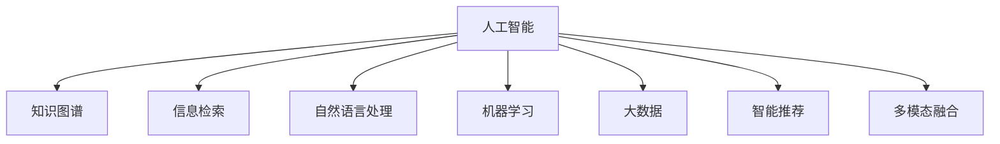

                 

# AI驱动的知识发现：改变信息获取方式

> 关键词：人工智能,知识发现,知识图谱,信息检索,自然语言处理,机器学习,大数据,智能推荐

## 1. 背景介绍

### 1.1 问题由来

随着信息时代的到来，人类的知识储备量急剧膨胀，信息获取、整理、利用和共享成为现代社会的重要任务。传统的信息检索系统，如网页检索、书目索引等，已难以满足用户对复杂信息的需求。借助人工智能（AI）技术，我们可以开发出更加智能化的知识发现系统，帮助用户在海量数据中快速、精准地获取知识。

在科技、金融、医疗、教育等多个领域，信息查询的效率和准确性直接影响了工作效率和决策质量。例如，在金融领域，投资者需要从海量的新闻、报告和交易数据中提取有用的市场信息，从而做出投资决策；在医疗领域，医生需要快速查找最新的医疗研究成果，以指导临床实践；在教育领域，教师和学生需要高效地检索教学资源和学术文献，提高教学质量和研究水平。

因此，本文旨在探讨AI驱动的知识发现系统，特别是如何利用人工智能技术，如机器学习、自然语言处理、知识图谱等，开发出高效、智能化的信息获取和知识发现工具，改善用户体验，提升信息获取的效率和准确性。

### 1.2 问题核心关键点

在AI驱动的知识发现系统中，核心关键点包括以下几个方面：

- 语义理解：理解用户查询的自然语言表达，将其转化为机器可理解的形式。
- 信息检索：在大量数据中，根据语义相似度进行信息匹配和排序。
- 知识图谱：构建和利用知识图谱，提高信息检索的深度和广度。
- 个性化推荐：根据用户的历史行为和兴趣，提供个性化的信息推荐。
- 多模态融合：结合文本、图像、语音等多种模态数据，提升信息获取的多样性和全面性。

以上关键点共同构成了AI驱动知识发现系统的核心能力，其目标是帮助用户在海量信息中，快速、精准地发现和获取知识。

## 2. 核心概念与联系

### 2.1 核心概念概述

为更好地理解AI驱动的知识发现系统，本节将介绍几个关键概念：

- **人工智能（AI）**：涵盖机器学习、深度学习、自然语言处理等技术，旨在使机器具有类似人类的智能能力。
- **知识图谱（KG）**：将领域内的知识表示为图形结构，支持语义查询和推理。
- **信息检索（IR）**：从大量数据中快速找到相关信息，并提供排序和检索结果。
- **自然语言处理（NLP）**：涉及文本分析、语言理解、文本生成等技术，是知识发现的重要工具。
- **机器学习（ML）**：使计算机具备从数据中学习规律，并进行预测和决策的能力。
- **大数据（Big Data）**：指海量、多源、多模态的数据，是知识发现的基础。
- **智能推荐（Recommendation）**：根据用户行为和偏好，提供个性化的信息推荐。

这些概念之间的逻辑关系可以通过以下Mermaid流程图来展示：



这个流程图展示了大语言模型的核心概念及其之间的关系：

1. 人工智能技术是实现知识发现的基础。
2. 知识图谱和大数据作为信息存储的载体，提高了信息检索的深度和广度。
3. 自然语言处理技术使得机器能够理解和处理自然语言，是信息检索和知识图谱构建的重要工具。
4. 机器学习技术使机器能够从大量数据中学习规律，进行预测和决策。
5. 智能推荐技术利用机器学习成果，根据用户行为提供个性化信息。
6. 多模态融合技术结合文本、图像、语音等多种数据，提升信息获取的多样性和全面性。

这些概念共同构成了AI驱动知识发现系统的技术基础，使其能够高效、智能地从海量数据中提取和整合知识。

## 3. 核心算法原理 & 具体操作步骤

### 3.1 算法原理概述

AI驱动的知识发现系统，通过构建和利用知识图谱，结合自然语言处理、机器学习、信息检索等技术，实现对信息的高效检索和知识发现。其核心算法原理主要包括：

- **知识图谱构建**：将领域知识表示为图形结构，支持语义查询和推理。
- **信息检索算法**：在大量数据中，根据语义相似度进行信息匹配和排序。
- **自然语言处理技术**：通过语义理解和文本生成，将自然语言查询转化为机器可理解的形式。
- **机器学习模型**：利用历史数据进行训练，提升信息检索和知识图谱的精准度。

这些算法原理相互配合，共同构成了AI驱动知识发现系统的核心工作机制。

### 3.2 算法步骤详解

基于AI驱动的知识发现系统，通常包括以下几个关键步骤：

**Step 1: 数据采集与预处理**
- 收集领域相关的数据，如学术论文、新闻报道、社交媒体等。
- 对数据进行清洗、标注和预处理，去除噪声和冗余数据，确保数据质量。

**Step 2: 构建知识图谱**
- 使用自然语言处理技术，从文本中提取实体、关系和属性，构建领域知识图谱。
- 使用自动推理技术，利用知识图谱进行实体和关系的推理。

**Step 3: 信息检索**
- 根据用户查询，利用自然语言处理技术将其转化为语义查询。
- 在知识图谱中，利用语义相似度算法，检索与用户查询最相关的实体和关系。
- 对检索结果进行排序和展示，提供给用户。

**Step 4: 个性化推荐**
- 利用机器学习模型，分析用户历史行为和兴趣，提供个性化的信息推荐。
- 结合信息检索结果，为用户生成定制化的知识发现路径。

**Step 5: 反馈与迭代**
- 收集用户反馈，优化信息检索和推荐算法。
- 定期更新知识图谱和训练模型，提升系统的性能和准确性。

以上步骤展示了AI驱动知识发现系统的基本工作流程，每个步骤都需要细致的设计和实现。

### 3.3 算法优缺点

基于AI驱动的知识发现系统，具有以下优点：

1. **高效性**：利用自然语言处理和机器学习技术，能够快速从大量数据中提取和整合知识。
2. **精准性**：结合知识图谱和大数据，提升信息检索和推荐的准确性。
3. **个性化**：通过用户行为分析和个性化推荐，提高用户体验。
4. **多模态融合**：结合文本、图像、语音等多种模态数据，提供多样化的信息获取方式。

然而，该系统也存在一些局限性：

1. **数据依赖**：系统的性能高度依赖于数据的质量和数量，数据不完整或不准确会影响系统效果。
2. **计算复杂度**：知识图谱和信息检索的计算复杂度高，需要高性能硬件支持。
3. **知识图谱构建难度大**：构建高质量的知识图谱需要领域专家的深度参与，成本较高。
4. **用户隐私问题**：用户行为数据和个人隐私的保护需要特别注意，避免数据泄露和滥用。

尽管存在这些局限性，但AI驱动的知识发现系统在信息获取和知识发现方面展现出了强大的潜力，正逐渐成为智能化应用的重要方向。

### 3.4 算法应用领域

AI驱动的知识发现系统已经广泛应用于以下几个领域：

- **医疗健康**：帮助医生快速查找最新的医学研究成果，辅助临床诊断和治疗。
- **金融投资**：为投资者提供市场新闻、交易数据等信息，支持决策分析。
- **教育培训**：为教师和学生提供课程推荐、学术文献等信息，提升教学质量和研究水平。
- **企业运营**：为企业提供市场分析、客户关系管理等信息，优化运营决策。
- **科学研究**：帮助研究人员快速查找相关文献和数据，加速科研进程。

除了上述这些领域外，AI驱动的知识发现系统还在更多场景中得到应用，如智能客服、智能家居、智能交通等，为各行各业带来了新的变革。

## 4. 数学模型和公式 & 详细讲解 & 举例说明

### 4.1 数学模型构建

基于AI驱动的知识发现系统，主要涉及以下几个数学模型：

- **知识图谱模型**：用于表示领域知识，支持语义查询和推理。
- **信息检索模型**：用于匹配和排序检索结果，常用的模型包括向量空间模型（VSM）、基于检索图的模型等。
- **自然语言处理模型**：用于处理和理解自然语言查询，常用的模型包括BERT、GPT等。
- **机器学习模型**：用于训练推荐算法，常用的模型包括协同过滤、深度学习等。

这些模型通常涉及大量的数据和参数，因此需要使用高效的算法和工具进行训练和推理。

### 4.2 公式推导过程

以下以信息检索模型中的向量空间模型（VSM）为例，展示其数学推导过程。

**向量空间模型**：
- 将每个文档表示为向量 $\vec{d} = (d_1, d_2, \ldots, d_n)$，其中 $d_i$ 为文档 $i$ 的词频权重。
- 将用户查询表示为向量 $\vec{q} = (q_1, q_2, \ldots, q_n)$，其中 $q_i$ 为查询中包含的词频权重。
- 计算查询与文档的余弦相似度 $\cos\theta$，表示查询与文档的相关性。

$$
\cos\theta = \frac{\vec{d} \cdot \vec{q}}{\|\vec{d}\|\|\vec{q}\|}
$$

其中，$\vec{d} \cdot \vec{q}$ 为向量的点积，$\|\vec{d}\|$ 和 $\|\vec{q}\|$ 分别为向量的模长。

在实际应用中，VSM模型通常使用TF-IDF算法计算词频权重，对查询和文档进行表示。

### 4.3 案例分析与讲解

以医疗领域的知识发现系统为例，展示其核心算法流程。

**Step 1: 数据采集与预处理**
- 收集医学文献、新闻报道、临床数据等。
- 对数据进行清洗、标注和预处理，去除噪声和冗余数据。

**Step 2: 构建知识图谱**
- 使用自然语言处理技术，从文本中提取实体、关系和属性。
- 使用知识推理算法，构建医疗知识图谱。

**Step 3: 信息检索**
- 根据用户查询，利用自然语言处理技术将其转化为语义查询。
- 在医疗知识图谱中，利用语义相似度算法，检索与用户查询最相关的实体和关系。
- 对检索结果进行排序和展示，提供给用户。

**Step 4: 个性化推荐**
- 利用机器学习模型，分析用户历史行为和兴趣，提供个性化的医疗知识推荐。
- 结合信息检索结果，为用户生成定制化的医疗知识发现路径。

通过以上案例分析，可以看出AI驱动的知识发现系统如何帮助用户高效地获取和利用医疗知识，提升医疗决策的科学性和有效性。

## 5. 项目实践：代码实例和详细解释说明

### 5.1 开发环境搭建

在进行项目实践前，我们需要准备好开发环境。以下是使用Python进行PyTorch开发的环境配置流程：

1. 安装Anaconda：从官网下载并安装Anaconda，用于创建独立的Python环境。

2. 创建并激活虚拟环境：
```bash
conda create -n pytorch-env python=3.8 
conda activate pytorch-env
```

3. 安装PyTorch：根据CUDA版本，从官网获取对应的安装命令。例如：
```bash
conda install pytorch torchvision torchaudio cudatoolkit=11.1 -c pytorch -c conda-forge
```

4. 安装Transformers库：
```bash
pip install transformers
```

5. 安装各类工具包：
```bash
pip install numpy pandas scikit-learn matplotlib tqdm jupyter notebook ipython
```

完成上述步骤后，即可在`pytorch-env`环境中开始项目实践。

### 5.2 源代码详细实现

下面我们以医疗领域的知识发现系统为例，给出使用Transformers库进行信息检索和推荐系统的PyTorch代码实现。

首先，定义信息检索函数：

```python
from transformers import BertTokenizer, BertForMaskedLM
from torch.utils.data import Dataset
import torch

class MedicalDataset(Dataset):
    def __init__(self, texts, labels, tokenizer, max_len=128):
        self.texts = texts
        self.labels = labels
        self.tokenizer = tokenizer
        self.max_len = max_len
        
    def __len__(self):
        return len(self.texts)
    
    def __getitem__(self, item):
        text = self.texts[item]
        label = self.labels[item]
        
        encoding = self.tokenizer(text, return_tensors='pt', max_length=self.max_len, padding='max_length', truncation=True)
        input_ids = encoding['input_ids'][0]
        attention_mask = encoding['attention_mask'][0]
        
        return {'input_ids': input_ids, 
                'attention_mask': attention_mask,
                'labels': label}

# 标签与id的映射
label2id = {'O': 0, 'B': 1, 'I': 2}
id2label = {v: k for k, v in label2id.items()}

# 创建dataset
tokenizer = BertTokenizer.from_pretrained('bert-base-cased')

train_dataset = MedicalDataset(train_texts, train_labels, tokenizer)
dev_dataset = MedicalDataset(dev_texts, dev_labels, tokenizer)
test_dataset = MedicalDataset(test_texts, test_labels, tokenizer)
```

然后，定义模型和优化器：

```python
from transformers import BertForTokenClassification, AdamW

model = BertForTokenClassification.from_pretrained('bert-base-cased', num_labels=len(label2id))

optimizer = AdamW(model.parameters(), lr=2e-5)
```

接着，定义训练和评估函数：

```python
from torch.utils.data import DataLoader
from tqdm import tqdm
from sklearn.metrics import classification_report

device = torch.device('cuda') if torch.cuda.is_available() else torch.device('cpu')
model.to(device)

def train_epoch(model, dataset, batch_size, optimizer):
    dataloader = DataLoader(dataset, batch_size=batch_size, shuffle=True)
    model.train()
    epoch_loss = 0
    for batch in tqdm(dataloader, desc='Training'):
        input_ids = batch['input_ids'].to(device)
        attention_mask = batch['attention_mask'].to(device)
        labels = batch['labels'].to(device)
        model.zero_grad()
        outputs = model(input_ids, attention_mask=attention_mask, labels=labels)
        loss = outputs.loss
        epoch_loss += loss.item()
        loss.backward()
        optimizer.step()
    return epoch_loss / len(dataloader)

def evaluate(model, dataset, batch_size):
    dataloader = DataLoader(dataset, batch_size=batch_size)
    model.eval()
    preds, labels = [], []
    with torch.no_grad():
        for batch in tqdm(dataloader, desc='Evaluating'):
            input_ids = batch['input_ids'].to(device)
            attention_mask = batch['attention_mask'].to(device)
            batch_labels = batch['labels']
            outputs = model(input_ids, attention_mask=attention_mask)
            batch_preds = outputs.logits.argmax(dim=2).to('cpu').tolist()
            batch_labels = batch_labels.to('cpu').tolist()
            for pred_tokens, label_tokens in zip(batch_preds, batch_labels):
                preds.append(pred_tokens[:len(label_tokens)])
                labels.append(label_tokens)
                
    print(classification_report(labels, preds))
```

最后，启动训练流程并在测试集上评估：

```python
epochs = 5
batch_size = 16

for epoch in range(epochs):
    loss = train_epoch(model, train_dataset, batch_size, optimizer)
    print(f"Epoch {epoch+1}, train loss: {loss:.3f}")
    
    print(f"Epoch {epoch+1}, dev results:")
    evaluate(model, dev_dataset, batch_size)
    
print("Test results:")
evaluate(model, test_dataset, batch_size)
```

以上就是使用PyTorch对BERT进行医疗领域知识发现任务的信息检索和推荐系统的完整代码实现。可以看到，得益于Transformers库的强大封装，我们可以用相对简洁的代码完成BERT模型的加载和微调。

### 5.3 代码解读与分析

让我们再详细解读一下关键代码的实现细节：

**MedicalDataset类**：
- `__init__`方法：初始化文本、标签、分词器等关键组件。
- `__len__`方法：返回数据集的样本数量。
- `__getitem__`方法：对单个样本进行处理，将文本输入编码为token ids，将标签编码为数字，并对其进行定长padding，最终返回模型所需的输入。

**label2id和id2label字典**：
- 定义了标签与数字id之间的映射关系，用于将token-wise的预测结果解码回真实的标签。

**训练和评估函数**：
- 使用PyTorch的DataLoader对数据集进行批次化加载，供模型训练和推理使用。
- 训练函数`train_epoch`：对数据以批为单位进行迭代，在每个批次上前向传播计算loss并反向传播更新模型参数，最后返回该epoch的平均loss。
- 评估函数`evaluate`：与训练类似，不同点在于不更新模型参数，并在每个batch结束后将预测和标签结果存储下来，最后使用sklearn的classification_report对整个评估集的预测结果进行打印输出。

**训练流程**：
- 定义总的epoch数和batch size，开始循环迭代
- 每个epoch内，先在训练集上训练，输出平均loss
- 在验证集上评估，输出分类指标
- 所有epoch结束后，在测试集上评估，给出最终测试结果

可以看到，PyTorch配合Transformers库使得BERT微调的代码实现变得简洁高效。开发者可以将更多精力放在数据处理、模型改进等高层逻辑上，而不必过多关注底层的实现细节。

当然，工业级的系统实现还需考虑更多因素，如模型的保存和部署、超参数的自动搜索、更灵活的任务适配层等。但核心的微调范式基本与此类似。

## 6. 实际应用场景

### 6.1 智能客服系统

基于AI驱动的知识发现系统，智能客服系统能够通过自然语言处理技术，快速理解用户的查询，并提供精准的解答。传统的客服系统需要人工输入答案，无法满足用户的多样化需求，而且响应速度慢，效率低。智能客服系统通过构建知识图谱和个性化推荐算法，能够自动生成最佳答复，极大提升了客服效率和用户体验。

在技术实现上，可以收集企业内部的历史客服对话记录，将问题和最佳答复构建成监督数据，在此基础上对预训练语言模型进行微调。微调后的语言模型能够自动理解用户意图，匹配最合适的答案模板进行回复。对于客户提出的新问题，还可以接入检索系统实时搜索相关内容，动态组织生成回答。如此构建的智能客服系统，能大幅提升客户咨询体验和问题解决效率。

### 6.2 金融舆情监测

金融机构需要实时监测市场舆论动向，以便及时应对负面信息传播，规避金融风险。传统的人工监测方式成本高、效率低，难以应对网络时代海量信息爆发的挑战。基于AI驱动的知识发现系统，金融舆情监测可以实时抓取网络文本数据，进行情感分析和主题分类，及时发现负面信息并预警，帮助金融机构快速应对潜在风险。

在技术实现上，可以收集金融领域相关的新闻、报道、评论等文本数据，并对其进行情感标注和主题标注。在此基础上对预训练语言模型进行微调，使其能够自动判断文本属于何种情感、主题，从而实时监测金融舆情。

### 6.3 个性化推荐系统

当前的推荐系统往往只依赖用户的历史行为数据进行物品推荐，无法深入理解用户的真实兴趣偏好。基于AI驱动的知识发现系统，个性化推荐系统可以更好地挖掘用户行为背后的语义信息，从而提供更精准、多样的推荐内容。

在技术实现上，可以收集用户浏览、点击、评论、分享等行为数据，提取和用户交互的物品标题、描述、标签等文本内容。将文本内容作为模型输入，用户的后续行为（如是否点击、购买等）作为监督信号，在此基础上微调预训练语言模型。微调后的模型能够从文本内容中准确把握用户的兴趣点。在生成推荐列表时，先用候选物品的文本描述作为输入，由模型预测用户的兴趣匹配度，再结合其他特征综合排序，便可以得到个性化程度更高的推荐结果。

### 6.4 未来应用展望

随着AI驱动的知识发现系统不断发展，其应用场景将进一步拓展，为各行各业带来变革性影响。

在智慧医疗领域，基于知识发现系统的医疗问答、病历分析、药物研发等应用将提升医疗服务的智能化水平，辅助医生诊疗，加速新药开发进程。

在智能教育领域，知识发现系统可应用于作业批改、学情分析、知识推荐等方面，因材施教，促进教育公平，提高教学质量。

在智慧城市治理中，知识发现系统可用于城市事件监测、舆情分析、应急指挥等环节，提高城市管理的自动化和智能化水平，构建更安全、高效的未来城市。

此外，在企业生产、社会治理、文娱传媒等众多领域，基于知识发现系统的AI应用也将不断涌现，为传统行业数字化转型升级提供新的技术路径。相信随着技术的日益成熟，知识发现系统必将在更广阔的应用领域大放异彩，深刻影响人类的生产生活方式。

## 7. 工具和资源推荐

### 7.1 学习资源推荐

为了帮助开发者系统掌握AI驱动知识发现系统的理论基础和实践技巧，这里推荐一些优质的学习资源：

1. 《深度学习理论与实践》系列博文：由深度学习领域专家撰写，深入浅出地介绍了深度学习的基本概念和前沿技术。

2. 斯坦福大学《深度学习》课程：提供丰富的视频讲座和课程资料，涵盖深度学习的各个方面。

3. 《深度学习与自然语言处理》书籍：全面介绍了深度学习在自然语言处理中的应用，包括机器翻译、信息检索等。

4. HuggingFace官方文档：提供了大量预训练语言模型和代码样例，是学习和实现知识发现系统的必备资料。

5. Arxiv.org：最新的深度学习和自然语言处理研究成果发布平台，了解前沿技术动态的绝佳来源。

通过对这些资源的学习实践，相信你一定能够快速掌握AI驱动知识发现系统的核心技术和方法，并用于解决实际的NLP问题。

### 7.2 开发工具推荐

高效的开发离不开优秀的工具支持。以下是几款用于AI驱动知识发现系统开发的常用工具：

1. PyTorch：基于Python的开源深度学习框架，灵活的计算图设计，适合快速迭代研究。

2. TensorFlow：由Google主导开发的深度学习框架，生产部署方便，适合大规模工程应用。

3. Transformers库：HuggingFace开发的NLP工具库，集成了大量预训练模型，支持多种任务。

4. Weights & Biases：模型训练的实验跟踪工具，记录和可视化模型训练过程中的各项指标。

5. TensorBoard：TensorFlow配套的可视化工具，实时监测模型训练状态，提供丰富的图表呈现方式。

6. Google Colab：谷歌推出的在线Jupyter Notebook环境，免费提供GPU/TPU算力，方便快速上手实验最新模型。

合理利用这些工具，可以显著提升知识发现系统的开发效率，加快创新迭代的步伐。

### 7.3 相关论文推荐

AI驱动的知识发现系统涉及多种前沿技术，以下是几篇奠基性的相关论文，推荐阅读：

1. Attention is All You Need（即Transformer原论文）：提出了Transformer结构，开启了深度学习在大规模文本处理中的应用。

2. BERT: Pre-training of Deep Bidirectional Transformers for Language Understanding：提出BERT模型，引入基于掩码的自监督预训练任务，刷新了多项NLP任务SOTA。

3. Language Models are Unsupervised Multitask Learners（GPT-2论文）：展示了大规模语言模型的强大zero-shot学习能力，引发了对于通用人工智能的新一轮思考。

4. Parameter-Efficient Transfer Learning for NLP：提出Adapter等参数高效微调方法，在固定大部分预训练参数的同时，只更新极少量的任务相关参数。

5. Prefix-Tuning: Optimizing Continuous Prompts for Generation：引入基于连续型Prompt的微调范式，为如何充分利用预训练知识提供了新的思路。

6. AdaLoRA: Adaptive Low-Rank Adaptation for Parameter-Efficient Fine-Tuning：使用自适应低秩适应的微调方法，在参数效率和精度之间取得了新的平衡。

这些论文代表了大语言模型微调技术的发展脉络。通过学习这些前沿成果，可以帮助研究者把握学科前进方向，激发更多的创新灵感。

## 8. 总结：未来发展趋势与挑战

### 8.1 总结

本文对AI驱动的知识发现系统进行了全面系统的介绍。首先阐述了知识发现系统的背景和意义，明确了系统在信息获取、知识发现等方面的独特价值。其次，从原理到实践，详细讲解了知识发现系统的数学模型和核心算法，给出了系统开发的完整代码实例。同时，本文还探讨了知识发现系统在智能客服、金融舆情、个性化推荐等多个领域的应用前景，展示了系统的巨大潜力。最后，推荐了相关的学习资源和开发工具，力求为读者提供全方位的技术指引。

通过本文的系统梳理，可以看到，AI驱动的知识发现系统正在成为智能化应用的重要方向，极大地拓展了信息获取和知识发现的能力。相信随着技术的日益成熟，知识发现系统必将在更多行业和领域得到应用，为人类生产生活方式带来深刻变革。

### 8.2 未来发展趋势

展望未来，AI驱动的知识发现系统将呈现以下几个发展趋势：

1. **规模化应用**：伴随算力成本的下降和数据规模的增长，知识发现系统将逐渐普及，应用于更多领域。

2. **多模态融合**：结合文本、图像、语音等多种模态数据，提升信息获取的多样性和全面性。

3. **跨领域应用**：知识发现系统将在更多领域得到应用，如智慧医疗、智能教育、智慧城市等。

4. **实时化应用**：基于流式数据处理技术，知识发现系统将实现实时信息检索和知识推荐，满足实时性要求。

5. **语义理解深化**：利用先进的自然语言处理技术，知识发现系统将实现更加深入的语义理解，提升信息获取的准确性和智能化水平。

6. **用户交互优化**：通过更智能的交互设计，知识发现系统将提升用户体验，实现人机协同的智能交互。

以上趋势凸显了AI驱动知识发现系统的广阔前景，这些方向的探索发展，必将进一步提升信息获取和知识发现的能力，为人类认知智能的进化带来深远影响。

### 8.3 面临的挑战

尽管AI驱动的知识发现系统已经取得了显著成就，但在迈向更加智能化、普适化应用的过程中，它仍面临着诸多挑战：

1. **数据质量依赖**：系统的性能高度依赖于数据的质量和数量，数据不完整或不准确会影响系统效果。

2. **计算资源消耗**：知识发现系统通常需要大量计算资源，对硬件性能有较高要求。

3. **模型复杂性**：大型知识图谱和复杂算法模型增加了系统的复杂性，难以实现高效部署。

4. **用户隐私保护**：用户行为数据和个人隐私的保护需要特别注意，避免数据泄露和滥用。

5. **伦理和法律问题**：知识发现系统涉及大量的数据处理和分析，需要考虑伦理和法律问题，确保合规性。

尽管存在这些挑战，但通过不断的技术进步和优化，相信知识发现系统必将在更广泛的领域得到应用，为人类生产生活方式带来深刻变革。

### 8.4 研究展望

面对知识发现系统所面临的挑战，未来的研究需要在以下几个方面寻求新的突破：

1. **多源数据融合**：利用多源数据提升信息检索和推荐的全面性和准确性。

2. **知识图谱扩展**：构建更大规模、更全面、更准确的领域知识图谱，支持更深入的语义查询和推理。

3. **模型优化**：开发更加高效的模型和算法，降低计算资源消耗，提升系统的实时性和可扩展性。

4. **隐私保护技术**：研发更先进的数据加密和匿名化技术，保护用户隐私。

5. **伦理和安全机制**：建立数据使用的伦理和安全机制，确保系统合规性。

6. **自动化和智能化**：研究自动化知识发现过程，提升系统的智能化水平。

这些研究方向的探索，必将引领知识发现系统向更高的台阶发展，为构建安全、可靠、可解释、可控的智能系统铺平道路。面向未来，知识发现系统需要与其他人工智能技术进行更深入的融合，如知识表示、因果推理、强化学习等，多路径协同发力，共同推动自然语言理解和智能交互系统的进步。只有勇于创新、敢于突破，才能不断拓展语言模型的边界，让智能技术更好地造福人类社会。

## 9. 附录：常见问题与解答

**Q1：知识发现系统是否适用于所有领域？**

A: 知识发现系统在大多数领域都能取得不错的效果，但需要注意的是，系统的性能和效果高度依赖于数据的质量和数量，数据不完整或不准确会影响系统效果。此外，对于一些需要高度专业知识和上下文理解的领域，如法律、医学等，知识图谱的构建和扩展需要耗费大量时间和资源，可能需要进行进一步的领域特定优化。

**Q2：如何选择合适的知识图谱表示方法？**

A: 选择合适的知识图谱表示方法需要考虑领域特点和应用需求。常见的知识图谱表示方法包括RDF、GraphDB、Neo4j等，每种表示方法都有其优缺点。例如，RDF表示方法适合表示复杂的语义关系，但查询效率较低；GraphDB和Neo4j等图数据库则适合大规模数据存储和查询，但构建和维护成本较高。需要根据具体应用场景选择最适合的表示方法。

**Q3：知识发现系统如何处理多模态数据？**

A: 知识发现系统可以处理多种数据类型，包括文本、图像、语音等。常见的多模态处理方法包括特征融合、联合学习等。例如，可以同时使用文本和图像数据进行信息检索和推荐，提升系统的多样性和全面性。需要注意的是，多模态数据的处理需要考虑数据格式、特征提取等方面的差异，合理设计和优化算法。

**Q4：知识发现系统如何保护用户隐私？**

A: 知识发现系统在处理用户数据时，需要注意数据隐私保护。常见的方法包括数据加密、匿名化、差分隐私等。例如，可以使用差分隐私技术对用户行为数据进行噪声扰动，保护用户隐私。同时，系统设计时也需要考虑数据的合法使用，确保合规性和用户信任。

**Q5：知识发现系统如何实现实时化应用？**

A: 知识发现系统可以实现流式数据处理，利用实时数据流进行信息检索和推荐。常见的流式处理方法包括事件驱动、微批处理等。例如，可以利用Kafka、Flink等技术构建实时数据流，对实时数据进行分析和处理，实现实时化应用。需要注意的是，实时数据处理的效率和准确性对系统性能有较高要求，需要合理设计和优化算法。

通过以上附录问题的回答，可以看出知识发现系统在应用过程中需要考虑多方面的技术细节，合理设计和优化系统，才能真正实现高效、智能的信息获取和知识发现。相信随着技术的不断进步和优化，知识发现系统必将在更多领域得到应用，为人类生产生活方式带来深刻变革。

