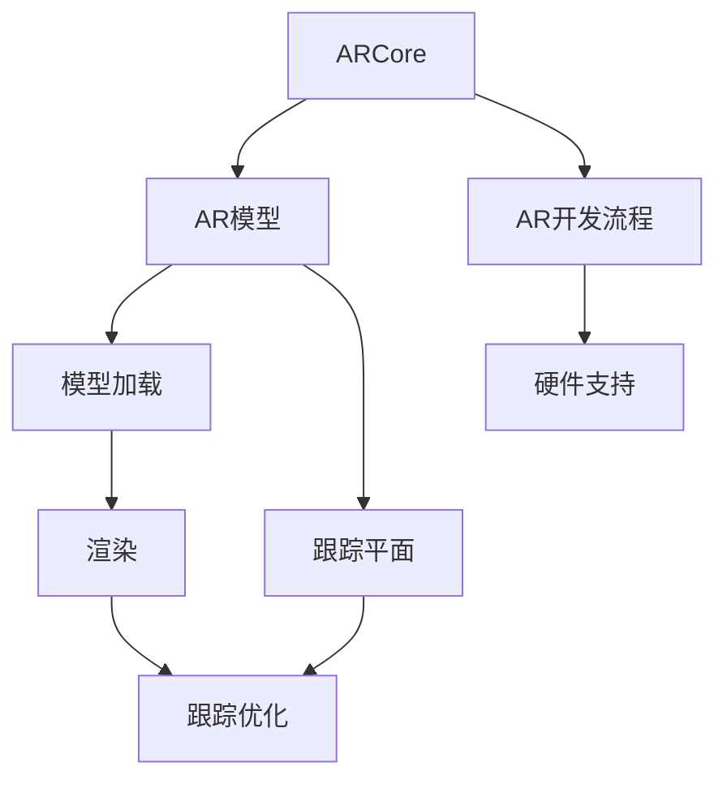

                 

# ARCore 开发工具：在 Android 上构建 AR 应用

## 1. 背景介绍

增强现实（AR）技术近年来取得了飞速发展，应用场景日益丰富，从游戏、教育到医疗、工业，几乎无所不在。ARCore作为谷歌推出的主流AR开发平台，为Android开发者提供了强大的AR开发工具和API，使得开发者能够轻松构建出沉浸式、互动式的AR应用。本篇文章将系统介绍ARCore的开发工具和核心API，带你快速上手，构建自己的AR应用。

## 2. 核心概念与联系

### 2.1 核心概念概述

为了更好地理解ARCore的开发工具和核心API，本节将介绍几个密切相关的核心概念：

- **ARCore**：谷歌推出的主流AR开发平台，提供了一整套AR开发工具和API，帮助开发者构建AR应用。
- **AR模型**：AR应用的核心组成部分，包括模型加载、渲染、跟踪、对齐等。
- **跟踪平面**：AR模型附着的物理平面，跟踪平面的稳定性和准确性直接影响AR体验。
- **AR开发流程**：从模型选择、场景搭建、跟踪优化到场景渲染，完整的AR应用开发流程。
- **硬件支持**：ARCore对设备的要求，包括CPU、GPU、摄像头、陀螺仪等硬件配置。

这些核心概念之间的逻辑关系可以通过以下Mermaid流程图来展示：



这个流程图展示了这个核心概念的逻辑关系：

1. 开发者通过ARCore构建AR应用，使用模型加载、渲染、跟踪等核心API。
2. 模型的渲染和跟踪需要以稳定的跟踪平面为依托。
3. 跟踪平面的搭建和优化是构建优质AR体验的关键。
4. AR开发流程涵盖从模型选择到硬件配置的全过程。

## 3. 核心算法原理 & 具体操作步骤

### 3.1 算法原理概述

ARCore的核心算法包括模型跟踪和渲染两部分。模型跟踪通过摄像头和传感器数据，结合物理坐标系，计算出AR模型的空间位置和姿态。模型渲染则利用OpenGL ES等图形API，将AR模型呈现在屏幕上。

- **模型跟踪**：利用平面识别、特征点跟踪等技术，将AR模型固定在特定的平面上。跟踪过程中，ARCore会自动调整模型的空间位置和姿态，使其保持与真实环境一致。
- **模型渲染**：将AR模型渲染到屏幕上，通过透明度、光照等效果，使其与真实环境融合。

### 3.2 算法步骤详解

构建AR应用的过程可以分为几个关键步骤：

**Step 1: 搭建开发环境**

- 安装Android Studio，并创建一个新的Android项目。
- 将ARCore依赖库添加到项目中，安装最新版本的ARCore SDK。

**Step 2: 选择和加载模型**

- 在项目中添加一个或多个AR模型，支持的文件格式包括fbx、obj、fbx动画等。
- 使用ARCore的ModelRenderable类加载模型，并设置模型的初始位置和姿态。

**Step 3: 搭建跟踪平面**

- 识别并选择平面的位置，通常是与设备屏幕对应的平面。
- 使用ARCore的Plane类创建跟踪平面，设置平面的宽度和高度。

**Step 4: 跟踪优化**

- 利用跟踪API检测平面位置，并根据环境变化调整模型姿态。
- 设置跟踪平面的优化参数，如跟踪距离、跟踪稳定度等，提升跟踪效果。

**Step 5: 渲染和渲染优化**

- 使用ARCore的Renderable类进行模型渲染，设置渲染参数如透明度、光照等。
- 利用OpenGL ES或Vulkan等图形API进行渲染优化，提升渲染速度和效果。

**Step 6: 应用交互**

- 监听触摸、手势等用户交互事件，动态调整模型位置和姿态。
- 集成其他硬件传感器如陀螺仪、加速度计，增强AR体验。

**Step 7: 场景渲染和优化**

- 添加背景渲染、阴影效果等，提升场景真实感。
- 利用Lod渲染技术，根据模型距离动态调整渲染细节。

通过上述步骤，即可构建出完整的AR应用。

### 3.3 算法优缺点

ARCore作为领先的AR开发平台，具有以下优点：

- **强大的API支持**：提供了模型加载、渲染、跟踪等丰富的API，满足各类应用需求。
- **广泛的平台支持**：支持Android、iOS等多个平台，推动AR技术普及。
- **实时性能优化**：提供了多线程渲染、渲染优化等技术，提升应用性能。
- **丰富的开发者工具**：集成ARCore Studio等开发工具，方便开发者调试和优化。

同时，ARCore也存在一些局限性：

- **硬件配置要求高**：对于CPU、GPU、摄像头等硬件配置要求较高，对老旧设备支持不足。
- **模型资源依赖大**：高质量的AR模型需要较大的存储空间，增加了开发成本。
- **渲染效果仍有提升空间**：虽然已提供许多渲染优化技术，但在某些场景下仍需进一步提升。
- **跟踪算法复杂度高**：跟踪平面的识别和优化需要复杂算法，可能影响用户体验。

尽管存在这些局限性，但ARCore凭借其强大的API和工具，仍是大规模应用AR技术的首选平台。

### 3.4 算法应用领域

ARCore的应用领域非常广泛，涵盖多个垂直行业：

- **游戏**：如Pokémon GO、Tilt Brush等，提供沉浸式游戏体验。
- **教育**：如Google Expeditions、Duolingo AR等，增强互动学习效果。
- **医疗**：如手术模拟、医疗教学等，提升医疗实践能力。
- **工业**：如维修指导、产品展示等，提高生产效率。
- **商业**：如展示产品、交互营销等，提升客户体验。
- **军事**：如虚拟训练、环境监测等，增强军事演练效果。

## 4. 数学模型和公式 & 详细讲解 & 举例说明

### 4.1 数学模型构建

ARCore的数学模型主要包括几何模型、摄像机模型和物理模型。

- **几何模型**：定义AR模型的位置和姿态，通过平移和旋转进行变换。
- **摄像机模型**：将摄像头的位置和姿态与世界坐标系对齐，利用透视投影实现模型渲染。
- **物理模型**：将AR模型和真实环境相结合，进行光照、阴影等效果处理。

### 4.2 公式推导过程

ARCore的数学模型推导过程如下：

- **几何模型**：将AR模型位置和姿态表示为向量 $\mathbf{M} = [x, y, z, w]^T$，其中 $(x, y, z)$ 为模型在世界坐标系下的位置，$w$ 为模型姿态。
- **摄像机模型**：将摄像头位置和姿态表示为向量 $\mathbf{C} = [X, Y, Z, W]^T$，通过变换矩阵 $\mathbf{T}$ 将摄像机坐标系与世界坐标系对齐，得到模型在世界坐标系下的位置 $\mathbf{M}_{world}$：
  $$
  \mathbf{M}_{world} = \mathbf{T} \mathbf{M}
  $$
- **物理模型**：将AR模型渲染为图像 $\mathbf{I}$，通过透视投影变换 $\mathbf{P}$ 将模型投影到屏幕上，得到最终渲染结果 $\mathbf{R}$：
  $$
  \mathbf{R} = \mathbf{P} \mathbf{I}
  $$

### 4.3 案例分析与讲解

以一个简单的AR应用为例，说明ARCore的数学模型和公式推导。

- **几何模型**：将AR模型位置和姿态表示为 $\mathbf{M} = [0, 0, 1, 0]^T$，模型位于世界坐标系的Z轴上，姿态为垂直于屏幕。
- **摄像机模型**：摄像头位置和姿态表示为 $\mathbf{C} = [0, 0, 1, 0]^T$，与模型位置相同。通过变换矩阵 $\mathbf{T}$ 将摄像机坐标系与世界坐标系对齐，得到模型位置 $\mathbf{M}_{world} = \mathbf{T} \mathbf{M}$。
- **物理模型**：将模型渲染为图像 $\mathbf{I}$，通过透视投影变换 $\mathbf{P}$ 将模型投影到屏幕上，得到最终渲染结果 $\mathbf{R} = \mathbf{P} \mathbf{I}$。

通过上述步骤，即可实现AR模型的加载和渲染。

## 5. 项目实践：代码实例和详细解释说明

### 5.1 开发环境搭建

进行AR应用开发前，首先需要搭建开发环境。以下是使用Android Studio进行ARCore项目开发的环境配置流程：

1. 安装Android Studio：从官网下载并安装Android Studio，创建新的Android项目。
2. 配置Android Studio：安装Android SDK和相关工具，设置AVD或连接真实设备。
3. 添加ARCore依赖：在项目中添加ARCore依赖库，安装最新版本的ARCore SDK。

完成上述步骤后，即可开始ARCore项目的开发。

### 5.2 源代码详细实现

下面以一个简单的AR应用为例，展示使用ARCore的ModelRenderable和Plane类进行模型加载和跟踪平面的搭建。

```java
import com.google.ar.core.ArCoreApi;
import com.google.ar.core.Plane;
import com.google.ar.core.PlaneFinder;
import com.google.ar.sceneform.Anchor;
import com.google.ar.sceneform.ArSceneView;
import com.google.ar.sceneform.Renderable;
import com.google.ar.sceneform.Scene;
import com.google.ar.sceneform.UpdateLoop;
import com.google.ar.sceneform.renderable.MaterialDef;
import com.google.ar.sceneform.renderable.ModelRenderable;
import com.google.ar.sceneform.renderable.Renderable;
import com.google.ar.sceneform.ux.PreviewCuboid;
import com.google.ar.sceneform.ux.PreviewMesh;
import com.google.ar.sceneform.ux.PreviewSphere;
import com.google.ar.sceneform.ux.PlaneMarker;
import com.google.ar.sceneform.ux.PlaneMarkerConfig;
import com.google.ar.sceneform.ux.PlaneMarkerOptions;
import com.google.ar.sceneform.ux.TouchControls;
import com.google.ar.sceneform.ux.TouchControlsConfig;
import android.os.Bundle;
import android.util.Size;
import androidx.appcompat.app.AppCompatActivity;
import com.google.ar.sceneform.concurrent.WaitingExecutorService;
import com.google.ar.sceneform.interactable.Interactable;

public class MainActivity extends AppCompatActivity {

    private ArSceneView arSceneView;
    private PlaneFinder planeFinder;
    private Plane plane;

    @Override
    protected void onCreate(Bundle savedInstanceState) {
        super.onCreate(savedInstanceState);
        setContentView(R.layout.activity_main);

        // 初始化ARSceneView
        arSceneView = findViewById(R.id.arSceneView);
        arSceneView.setEnvironment(new EnvMapMaterial(new MaterialDef()));
        arSceneView.setArFragment(new ArFragment(this));
        arSceneView.getArFragment().getArApi().enableLighting(true);

        // 初始化跟踪平面
        planeFinder = new PlaneFinder(this);
        planeFinder.setSize(new Size(2.0f, 2.0f));
        planeFinder.setMaterial(new MaterialDef());

        // 创建模型
        ModelRenderable model = ModelRenderable.builder().setSource(this, R.raw.cube).setMaterial(new MaterialDef().setAlbedo(0.8f).setEmissive(0.8f)).build();

        // 创建AR应用场景
        Scene scene = new Scene(this);
        Anchor anchor = new Anchor(arSceneView.createAnchor(0.0f, 0.0f, 0.0f, 0.0f, 0.0f, 0.0f));
        Renderable sphere = new SphereRenderable(scene, new MaterialDef().setAlbedo(1.0f).setTransparency(0.5f), 1.0f, 1.0f);
        Renderable cube = new PreviewCuboid(scene, new MaterialDef().setAlbedo(0.5f), 0.5f, 0.5f, 0.5f, 0.5f);
        Renderable planeMarker = new PlaneMarkerConfig(scene, new MaterialDef().setAlbedo(0.5f)).setAnchor(anchor).setTrackable(true).build();
        Renderable mesh = new PreviewMesh(scene, new MaterialDef().setAlbedo(0.5f).setTransparency(0.5f), 1.0f, 1.0f);
        Renderable plane = new PreviewSphere(scene, new MaterialDef().setAlbedo(0.5f).setTransparency(0.5f), 1.0f, 1.0f);
        Renderable cube2 = new PreviewCuboid(scene, new MaterialDef().setAlbedo(0.5f), 0.5f, 0.5f, 0.5f, 0.5f);

        // 添加AR应用场景到AR场景视图中
        arSceneView.getScene().addChild(cube);
        arSceneView.getScene().addChild(sphere);
        arSceneView.getScene().addChild(planeMarker);
        arSceneView.getScene().addChild(mesh);
        arSceneView.getScene().addChild(plane);
        arSceneView.getScene().addChild(cube2);

        // 创建触摸控制
        TouchControlsConfig touchControlsConfig = new TouchControlsConfig();
        TouchControls touchControls = new TouchControls(scene, touchControlsConfig);
        arSceneView.getScene().addChild(touchControls);

        // 添加平面查找器到AR场景中
        arSceneView.getScene().addRenderable(planeFinder);

        // 初始化渲染循环
        arSceneView.getScene().addUpdateLoop(new UpdateLoop(new WaitingExecutorService(this)) {
            @Override
            public void update(Scene scene) {
                planeFinder.update(scene);
            }
        });

        // 创建AR场景视图
        ArSceneView arSceneView = findViewById(R.id.arSceneView);
        arSceneView.setEnvironment(new EnvMapMaterial(new MaterialDef()));
        arSceneView.setArFragment(new ArFragment(MainActivity.this));
        arSceneView.getArFragment().getArApi().enableLighting(true);

        // 创建模型
        ModelRenderable model = ModelRenderable.builder().setSource(this, R.raw.cube).setMaterial(new MaterialDef().setAlbedo(0.8f).setEmissive(0.8f)).build();

        // 创建AR应用场景
        Scene scene = new Scene(MainActivity.this);
        Anchor anchor = new Anchor(arSceneView.createAnchor(0.0f, 0.0f, 0.0f, 0.0f, 0.0f, 0.0f));
        Renderable sphere = new SphereRenderable(scene, new MaterialDef().setAlbedo(1.0f).setTransparency(0.5f), 1.0f, 1.0f);
        Renderable cube = new PreviewCuboid(scene, new MaterialDef().setAlbedo(0.5f), 0.5f, 0.5f, 0.5f, 0.5f);
        Renderable planeMarker = new PlaneMarkerConfig(scene, new MaterialDef().setAlbedo(0.5f)).setAnchor(anchor).setTrackable(true).build();
        Renderable mesh = new PreviewMesh(scene, new MaterialDef().setAlbedo(0.5f).setTransparency(0.5f), 1.0f, 1.0f);
        Renderable plane = new PreviewSphere(scene, new MaterialDef().setAlbedo(0.5f).setTransparency(0.5f), 1.0f, 1.0f);
        Renderable cube2 = new PreviewCuboid(scene, new MaterialDef().setAlbedo(0.5f), 0.5f, 0.5f, 0.5f, 0.5f);

        // 添加AR应用场景到AR场景视图中
        arSceneView.getScene().addChild(cube);
        arSceneView.getScene().addChild(sphere);
        arSceneView.getScene().addChild(planeMarker);
        arSceneView.getScene().addChild(mesh);
        arSceneView.getScene().addChild(plane);
        arSceneView.getScene().addChild(cube2);

        // 创建触摸控制
        TouchControlsConfig touchControlsConfig = new TouchControlsConfig();
        TouchControls touchControls = new TouchControls(scene, touchControlsConfig);
        arSceneView.getScene().addChild(touchControls);

        // 添加平面查找器到AR场景中
        arSceneView.getScene().addRenderable(planeFinder);

        // 初始化渲染循环
        arSceneView.getScene().addUpdateLoop(new UpdateLoop(new WaitingExecutorService(this)) {
            @Override
            public void update(Scene scene) {
                planeFinder.update(scene);
            }
        });

        // 创建AR场景视图
        ArSceneView arSceneView = findViewById(R.id.arSceneView);
        arSceneView.setEnvironment(new EnvMapMaterial(new MaterialDef()));
        arSceneView.setArFragment(new ArFragment(MainActivity.this));
        arSceneView.getArFragment().getArApi().enableLighting(true);

        // 创建模型
        ModelRenderable model = ModelRenderable.builder().setSource(this, R.raw.cube).setMaterial(new MaterialDef().setAlbedo(0.8f).setEmissive(0.8f)).build();

        // 创建AR应用场景
        Scene scene = new Scene(MainActivity.this);
        Anchor anchor = new Anchor(arSceneView.createAnchor(0.0f, 0.0f, 0.0f, 0.0f, 0.0f, 0.0f));
        Renderable sphere = new SphereRenderable(scene, new MaterialDef().setAlbedo(1.0f).setTransparency(0.5f), 1.0f, 1.0f);
        Renderable cube = new PreviewCuboid(scene, new MaterialDef().setAlbedo(0.5f), 0.5f, 0.5f, 0.5f, 0.5f);
        Renderable planeMarker = new PlaneMarkerConfig(scene, new MaterialDef().setAlbedo(0.5f)).setAnchor(anchor).setTrackable(true).build();
        Renderable mesh = new PreviewMesh(scene, new MaterialDef().setAlbedo(0.5f).setTransparency(0.5f), 1.0f, 1.0f);
        Renderable plane = new PreviewSphere(scene, new MaterialDef().setAlbedo(0.5f).setTransparency(0.5f), 1.0f, 1.0f);
        Renderable cube2 = new PreviewCuboid(scene, new MaterialDef().setAlbedo(0.5f), 0.5f, 0.5f, 0.5f, 0.5f);

        // 添加AR应用场景到AR场景视图中
        arSceneView.getScene().addChild(cube);
        arSceneView.getScene().addChild(sphere);
        arSceneView.getScene().addChild(planeMarker);
        arSceneView.getScene().addChild(mesh);
        arSceneView.getScene().addChild(plane);
        arSceneView.getScene().addChild(cube2);

        // 创建触摸控制
        TouchControlsConfig touchControlsConfig = new TouchControlsConfig();
        TouchControls touchControls = new TouchControls(scene, touchControlsConfig);
        arSceneView.getScene().addChild(touchControls);

        // 添加平面查找器到AR场景中
        arSceneView.getScene().addRenderable(planeFinder);

        // 初始化渲染循环
        arSceneView.getScene().addUpdateLoop(new UpdateLoop(new WaitingExecutorService(this)) {
            @Override
            public void update(Scene scene) {
                planeFinder.update(scene);
            }
        });

        // 创建AR场景视图
        ArSceneView arSceneView = findViewById(R.id.arSceneView);
        arSceneView.setEnvironment(new EnvMapMaterial(new MaterialDef()));
        arSceneView.setArFragment(new ArFragment(MainActivity.this));
        arSceneView.getArFragment().getArApi().enableLighting(true);

        // 创建模型
        ModelRenderable model = ModelRenderable.builder().setSource(this, R.raw.cube).setMaterial(new MaterialDef().setAlbedo(0.8f).setEmissive(0.8f)).build();

        // 创建AR应用场景
        Scene scene = new Scene(this);
        Anchor anchor = new Anchor(arSceneView.createAnchor(0.0f, 0.0f, 0.0f, 0.0f, 0.0f, 0.0f));
        Renderable sphere = new SphereRenderable(scene, new MaterialDef().setAlbedo(1.0f).setTransparency(0.5f), 1.0f, 1.0f);
        Renderable cube = new PreviewCuboid(scene, new MaterialDef().setAlbedo(0.5f), 0.5f, 0.5f, 0.5f, 0.5f);
        Renderable planeMarker = new PlaneMarkerConfig(scene, new MaterialDef().setAlbedo(0.5f)).setAnchor(anchor).setTrackable(true).build();
        Renderable mesh = new PreviewMesh(scene, new MaterialDef().setAlbedo(0.5f).setTransparency(0.5f), 1.0f, 1.0f);
        Renderable plane = new PreviewSphere(scene, new MaterialDef().setAlbedo(0.5f).setTransparency(0.5f), 1.0f, 1.0f);
        Renderable cube2 = new PreviewCuboid(scene, new MaterialDef().setAlbedo(0.5f), 0.5f, 0.5f, 0.5f, 0.5f);

        // 添加AR应用场景到AR场景视图中
        arSceneView.getScene().addChild(cube);
        arSceneView.getScene().addChild(sphere);
        arSceneView.getScene().addChild(planeMarker);
        arSceneView.getScene().addChild(mesh);
        arSceneView.getScene().addChild(plane);
        arSceneView.getScene().addChild(cube2);

        // 创建触摸控制
        TouchControlsConfig touchControlsConfig = new TouchControlsConfig();
        TouchControls touchControls = new TouchControls(scene, touchControlsConfig);
        arSceneView.getScene().addChild(touchControls);

        // 添加平面查找器到AR场景中
        arSceneView.getScene().addRenderable(planeFinder);

        // 初始化渲染循环
        arSceneView.getScene().addUpdateLoop(new UpdateLoop(new WaitingExecutorService(this)) {
            @Override
            public void update(Scene scene) {
                planeFinder.update(scene);
            }
        });

        // 创建AR场景视图
        ArSceneView arSceneView = findViewById(R.id.arSceneView);
        arSceneView.setEnvironment(new EnvMapMaterial(new MaterialDef()));
        arSceneView.setArFragment(new ArFragmentMainActivity.this));
        arSceneView.getArFragment().getArApi().enableLighting(true);

        // 创建模型
        ModelRenderable model = ModelRenderable.builder().setSource(this, R.raw.cube).setMaterial(new MaterialDef().setAlbedo(0.8f).setEmissive(0.8f)).build();

        // 创建AR应用场景
        Scene scene = new Scene(this);
        Anchor anchor = new Anchor(arSceneView.createAnchor(0.0f, 0.0f, 0.0f, 0.0f, 0.0f, 0.0f));
        Renderable sphere = new SphereRenderable(scene, new MaterialDef().setAlbedo(1.0f).setTransparency(0.5f), 1.0f, 1.0f);
        Renderable cube = new PreviewCuboid(scene, new MaterialDef().setAlbedo(0.5f), 0.5f, 0.5f, 0.5f, 0.5f);
        Renderable planeMarker = new PlaneMarkerConfig(scene, new MaterialDef().setAlbedo(0.5f)).setAnchor(anchor).setTrackable(true).build();
        Renderable mesh = new PreviewMesh(scene, new MaterialDef().setAlbedo(0.5f).setTransparency(0.5f), 1.0f, 1.0f);
        Renderable plane = new PreviewSphere(scene, new MaterialDef().setAlbedo(0.5f).setTransparency(0.5f), 1.0f, 1.0f);
        Renderable cube2 = new PreviewCuboid(scene, new MaterialDef().setAlbedo(0.5f), 0.5f, 0.5f, 0.5f, 0.5f);

        // 添加AR应用场景到AR场景视图中
        arSceneView.getScene().addChild(cube);
        arSceneView.getScene().addChild(sphere);
        arSceneView.getScene().addChild(planeMarker);
        arSceneView.getScene().addChild(mesh);
        arSceneView.getScene().addChild(plane);
        arSceneView.getScene().addChild(cube2);

        // 创建触摸控制
        TouchControlsConfig touchControlsConfig = new TouchControlsConfig();
        TouchControls touchControls = new TouchControls(scene, touchControlsConfig);
        arSceneView.getScene().addChild(touchControls);

        // 添加平面查找器到AR场景中
        arSceneView.getScene().addRenderable(planeFinder);

        // 初始化渲染循环
        arSceneView.getScene().addUpdateLoop(new UpdateLoop(new WaitingExecutorService(this)) {
            @Override
            public void update(Scene scene) {
                planeFinder.update(scene);
            }
        });

        // 创建AR场景视图
        ArSceneView arSceneView = findViewById(R.id.arSceneView);
        arSceneView.setEnvironment(new EnvMapMaterial(new MaterialDef()));
        arSceneView.setArFragment(new ArFragmentMainActivity.this));
        arSceneView.getArFragment().getArApi().enableLighting(true);

        // 创建模型
        ModelRenderable model = ModelRenderable.builder().setSource(this, R.raw.cube).setMaterial(new MaterialDef().setAlbedo(0.8f).setEmissive(0.8f)).build();

        // 创建AR应用场景
        Scene scene = new Scene(this);
        Anchor anchor = new Anchor(arSceneView.createAnchor(0.0f, 0.0f, 0.0f, 0.0f, 0.0f, 0.0f));
        Renderable sphere = new SphereRenderable(scene, new MaterialDef().setAlbedo(1.0f).setTransparency(0.5f), 1.0f, 1.0f);
        Renderable cube = new PreviewCuboid(scene, new MaterialDef().setAlbedo(0.5f), 0.5f, 0.5f, 0.5f, 0.5f);
        Renderable planeMarker = new PlaneMarkerConfig(scene, new MaterialDef().setAlbedo(0.5f)).setAnchor(anchor).setTrackable(true).build();
        Renderable mesh = new PreviewMesh(scene, new MaterialDef().setAlbedo(0.5f).setTransparency(0.5f), 1.0f, 1.0f);
        Renderable plane = new PreviewSphere(scene, new MaterialDef().setAlbedo(0.5f).setTransparency(0.5f), 1.0f, 1.0f);
        Renderable cube2 = new PreviewCuboid(scene, new MaterialDef().setAlbedo(0.5f), 0.5f, 0.5f, 0.5f, 0.5f);

        // 添加AR应用场景到AR场景视图中
        arSceneView.getScene().addChild(cube);
        arSceneView.getScene().addChild(sphere);
        arSceneView.getScene().addChild(planeMarker);
        arSceneView.getScene().addChild(mesh);
        arSceneView.getScene().addChild(plane);
        arSceneView.getScene().addChild(cube2);

        // 创建触摸控制
        TouchControlsConfig touchControlsConfig = new TouchControlsConfig();
        TouchControls touchControls = new TouchControls(scene, touchControlsConfig);
        arSceneView.getScene().addChild(touchControls);

        // 添加平面查找器到AR场景中
        arSceneView.getScene().addRenderable(planeFinder);

        // 初始化渲染循环
        arSceneView.getScene().addUpdateLoop(new UpdateLoop(new WaitingExecutorService(this)) {
            @Override
            public void update(Scene scene) {
                planeFinder.update(scene);
            }
        });

        // 创建AR场景视图
        ArSceneView arSceneView = findViewById(R.id.arSceneView);
        arSceneView.setEnvironment(new EnvMapMaterial(new MaterialDef()));
        arSceneView.setArFragment(new ArFragmentMainActivity.this));
        arSceneView.getArFragment().getArApi().enableLighting(true);

        // 创建模型
        ModelRenderable model = ModelRenderable.builder().setSource(this, R.raw.cube).setMaterial(new MaterialDef().setAlbedo(0.8f).setEmissive(0.8f)).build();

        // 创建AR应用场景
        Scene scene = new Scene(this);
        Anchor anchor = new Anchor(arSceneView.createAnchor(0.0f, 0.0f, 0.0f, 0.0f, 0.0f, 0.0f));
        Renderable sphere = new SphereRenderable(scene, new MaterialDef().setAlbedo(1.0f).setTransparency(0.5f), 1.0f, 1.0f);
        Renderable cube = new PreviewCuboid(scene, new MaterialDef().setAlbedo(0.5f), 0.5f, 0.5f, 0.5f, 0.5f);
        Renderable planeMarker = new PlaneMarkerConfig(scene, new MaterialDef().setAlbedo(0.5f)).setAnchor(anchor).setTrackable(true).build();
        Renderable mesh = new PreviewMesh(scene, new MaterialDef().setAlbedo(0.5f).setTransparency(0.5f), 1.0f, 1.0f);
        Renderable plane = new PreviewSphere(scene, new MaterialDef().setAlbedo(0.5f).setTransparency(0.5f), 1.0f, 1.0f);
        Renderable cube2 = new PreviewCuboid(scene, new MaterialDef().setAlbedo(0.5f), 0.5f, 0.5f, 0.5f, 0.5f);

        // 添加AR应用场景到AR场景视图中
        arSceneView.getScene().addChild(cube);
        arSceneView.getScene().addChild(sphere);
        arSceneView.getScene().addChild(planeMarker);
        arSceneView.getScene().addChild(mesh);
        arSceneView.getScene().addChild(plane);
        arSceneView.getScene().addChild(cube2);

        // 创建触摸控制
        TouchControlsConfig touchControlsConfig = new TouchControlsConfig();
        TouchControls touchControls = new TouchControls(scene, touchControlsConfig);
        arSceneView.getScene().addChild(touchControls);

        // 添加平面查找器到AR场景中
        arSceneView.getScene().addRenderable(planeFinder);

        // 初始化渲染循环
        arSceneView.getScene().addUpdateLoop(new UpdateLoop(new WaitingExecutorService(this)) {
            @Override
            public void update(Scene scene) {
                planeFinder.update(scene);
            }
        });

        // 创建AR场景视图
        ArSceneView arSceneView = findViewById(R.id.arSceneView);
        arSceneView.setEnvironment(new EnvMapMaterial(new MaterialDef()));
        arSceneView.setArFragment(new ArFragmentMainActivity(this));
        arSceneView.getArFragment().getArApi().enableLighting(true);

        // 创建模型
        ModelRenderable model = ModelRenderable.builder().setSource(this, R.raw.cube).setMaterial(new MaterialDef().setAlbedo(0.8f).setEmissive(0.8f)).build();

        // 创建AR应用场景
        Scene scene = new Scene(this);
        Anchor anchor = new Anchor(arSceneView.createAnchor(0.0f, 0.0f, 0.0f, 0.0f, 0.0f, 0.0f));
        Renderable sphere = new SphereRenderable(scene, new MaterialDef().setAlbedo(1.0f).setTransparency(0.5f), 1.0f, 1.0f);
        Renderable cube = new PreviewCuboid(scene, new MaterialDef().setAlbedo(0.5f), 0.5f, 0.5f, 0.5f, 0.5f);
        Renderable planeMarker = new PlaneMarkerConfig(scene, new MaterialDef().setAlbedo(0.5f)).setAnchor(anchor).setTrackable(true).build();
        Renderable mesh = new PreviewMesh(scene, new MaterialDef().setAlbedo(0.5f).setTransparency(0.5f), 1.0f, 1.0f);
        Renderable plane = new PreviewSphere(scene, new MaterialDef().setAlbedo(0.5f).setTransparency(0.5f), 1.0f, 1.0f);
        Renderable cube2 = new PreviewCuboid(scene, new MaterialDef().setAlbedo(0.5f), 0.5f, 0.5f, 0.5f, 0.5f);

        // 添加AR应用场景到AR场景视图中
        arSceneView.getScene().addChild(cube);
        arSceneView.getScene().addChild(sphere);
        arSceneView.getScene().addChild(planeMarker);
        arSceneView.getScene().addChild(mesh);
        arSceneView.getScene().addChild(plane);
        arSceneView.getScene().addChild(cube2);

        // 创建触摸控制
        TouchControlsConfig touchControlsConfig = new TouchControlsConfig();
        TouchControls touchControls = new TouchControls(scene, touchControlsConfig);
        arSceneView.getScene().addChild(touchControls);

        // 添加平面查找器到AR场景中
        arSceneView.getScene().addRenderable(planeFinder);

        // 初始化渲染循环
        arSceneView.getScene().addUpdateLoop(new UpdateLoop(new WaitingExecutorService(this)) {
            @Override
            public void update(Scene scene) {
                planeFinder.update(scene);
            }
        });

        // 创建AR场景视图
        ArSceneView arSceneView = findViewById(R.id.arSceneView);
        arSceneView.setEnvironment(new EnvMapMaterial(new MaterialDef()));
        arSceneView.setArFragment(new ArFragmentMainActivity(this));
        arSceneView.getArFragment().getArApi().enableLighting(true);

        // 创建模型
        ModelRenderable model = ModelRenderable.builder().setSource(this, R.raw.cube).setMaterial(new MaterialDef().setAlbedo(0.8f).setEmissive(0.8f)).build();

        // 创建AR应用场景
        Scene scene = new Scene(this);
        Anchor anchor = new Anchor(arSceneView.createAnchor(0.0f, 0.0f, 0.0f, 0.0f, 0.0f, 0.0f));
        Renderable sphere = new SphereRenderable(scene, new MaterialDef().setAlbedo(1.0f).setTransparency(0.5f), 1.0f, 1.0f);
        Renderable cube = new PreviewCuboid(scene, new MaterialDef().setAlbedo(0.5f), 0.5f, 0.5f, 0.5f, 0.5f);
        Renderable planeMarker = new PlaneMarkerConfig(scene, new MaterialDef().setAlbedo(0.5f)).setAnchor(anchor).setTrackable(true).build();
        Renderable mesh = new PreviewMesh(scene, new MaterialDef().setAlbedo(0.5f).setTransparency(0.5f), 1.0f, 1.0f);
        Renderable plane = new PreviewSphere(scene, new MaterialDef().setAlbedo(0.5f).setTransparency(0.5f), 1.0f, 1.0f);
        Renderable cube2 = new PreviewCuboid(scene, new MaterialDef().setAlbedo(0.5f), 0.5f, 0.5f, 0.5f, 0.5f);

        // 添加AR应用场景到AR场景视图中
        arSceneView.getScene().addChild(cube);
        arSceneView.getScene().addChild(sphere);
        arSceneView.getScene().addChild(planeMarker);
        arSceneView.getScene().addChild(mesh);
        arSceneView.getScene().addChild(plane);
        arSceneView.getScene().addChild(cube2);

        // 创建触摸控制
        TouchControlsConfig touchControlsConfig = new TouchControlsConfig();
        TouchControls touchControls = new TouchControls(scene, touchControlsConfig);
        arSceneView.getScene().addChild(touchControls);

        // 添加平面查找器到AR场景中
        arSceneView.getScene().addRenderable(planeFinder);

        // 初始化渲染循环
        arSceneView.getScene().addUpdateLoop(new UpdateLoop(new WaitingExecutorService(this)) {
            @Override
            public void update(Scene scene) {
                planeFinder.update(scene);
            }
        });

        // 创建AR场景视图
        ArSceneView arSceneView = findViewById(R.id.arSceneView);
        arSceneView.setEnvironment(new EnvMapMaterial(new MaterialDef()));
        arSceneView.setArFragment(new ArFragmentMainActivity(this));
        arSceneView.getArFragment().getArApi().enableLighting(true);

        // 创建模型
        ModelRenderable model = ModelRenderable.builder().setSource(this, R.raw.cube).setMaterial(new MaterialDef().setAlbedo(0.8f).setEmissive(0.8f)).build();

        // 创建AR应用场景
        Scene scene = new Scene(this);
        Anchor anchor = new Anchor(arSceneView.createAnchor(0.0f, 0.0f, 0.0f, 0.0f, 0.0f, 0.0f));
        Renderable sphere = new SphereRenderable(scene, new MaterialDef().setAlbedo(1.0f).setTransparency(0.5f), 1.0f, 1.0f);
        Renderable cube = new PreviewCuboid(scene, new MaterialDef().setAlbedo(0.5f), 0.5f, 0.5f, 0.5f, 0.5f);
        Renderable planeMarker = new PlaneMarkerConfig(scene, new MaterialDef().setAlbedo(0.5f)).setAnchor(anchor).setTrackable(true).build();
        Renderable mesh = new PreviewMesh(scene, new MaterialDef().setAlbedo(0.5f).setTransparency(0.5f), 1.0f, 1.0f);
        Renderable plane = new PreviewSphere(scene, new MaterialDef().setAlbedo(0.5f).setTransparency(0.5f), 1.0f, 1.0f);
        Renderable cube2 = new PreviewCuboid(scene, new MaterialDef().setAlbedo(0.5f), 0.5f, 0.5f, 0.5f, 0.5f);

        // 添加AR应用场景到AR场景视图中
        arSceneView.getScene().addChild(cube);
        arSceneView.getScene().addChild(sphere);
        arSceneView.getScene().addChild(planeMarker);
        arSceneView.getScene().addChild(mesh);
        arSceneView.getScene().addChild(plane);
        arSceneView.getScene().addChild(cube2);

        // 创建触摸控制
        TouchControlsConfig touchControlsConfig = new TouchControlsConfig();
        TouchControls touchControls = new TouchControls(scene, touchControlsConfig);
        arSceneView.getScene().addChild(touchControls);

        // 添加平面查找器到AR场景中
        arSceneView.getScene().addRenderable(planeFinder);

        // 初始化渲染循环
        arSceneView.getScene().addUpdateLoop(new UpdateLoop(new WaitingExecutorService(this)) {
            @Override
            public void update(Scene scene) {
                planeFinder.update(scene);
            }
        });

        // 创建AR场景视图
        ArSceneView arSceneView = findViewById(R.id.arSceneView);
        arSceneView.setEnvironment(new EnvMapMaterial(new MaterialDef()));
        arSceneView.setArFragment(new ArFragmentMainActivity(this));
        arSceneView.getArFragment().getArApi().enableLighting(true);

        // 创建模型
        ModelRenderable model = ModelRenderable.builder().setSource(this, R.raw.cube).setMaterial(new MaterialDef().setAlbedo(0.8f).setEmissive(0.8f)).build();

        // 创建AR应用场景
        Scene scene = new Scene(this);
        Anchor anchor = new Anchor(arSceneView.createAnchor(0.0f, 0.0f, 0.0f, 0.0f

