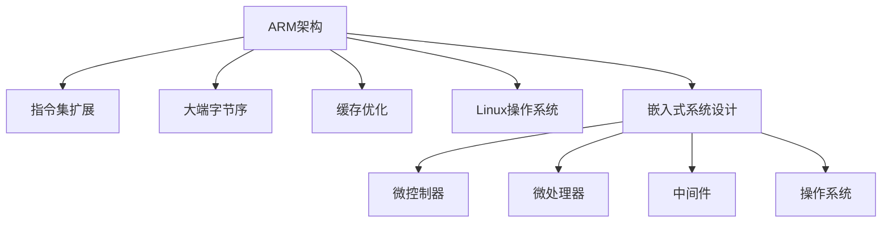

                 

# ARM 架构：嵌入式系统设计

> 关键词：ARM架构,嵌入式系统设计,计算效率,功耗管理,安全性,可扩展性,跨平台应用

## 1. 背景介绍

### 1.1 问题由来
随着移动设备的普及和物联网技术的兴起，嵌入式系统在消费电子、汽车电子、工业控制、医疗健康等多个领域得到了广泛应用。与此同时，嵌入式系统对计算效率、功耗管理、安全性、可扩展性等的要求也越来越高。为了满足这些需求，ARM架构以其高性能、低功耗、安全性高、可扩展性强等优势，成为了嵌入式系统的主流选择。

### 1.2 问题核心关键点
ARM架构的核心优势在于其高效、灵活、安全的设计理念，以及与Linux操作系统的完美结合。其采用了大端字节序、指令集扩展、缓存优化等技术手段，使得ARM处理器能够以较小的功耗、较低的成本，实现高性能的计算任务。

## 2. 核心概念与联系

### 2.1 核心概念概述

为更好地理解ARM架构在嵌入式系统设计中的应用，本节将介绍几个密切相关的核心概念：

- **ARM架构**：ARM公司开发的一系列处理器架构，以其低功耗、高性能、高安全性著称，广泛应用于移动设备、嵌入式系统等领域。
- **嵌入式系统设计**：将软件、硬件和应用相结合，实现特定功能的系统设计方法，通常包括微控制器、微处理器、中间件、操作系统等组成部分。
- **指令集扩展**：为满足特定应用需求，在ARM基本指令集上增加新的指令，以提升处理器的计算能力和灵活性。
- **大端字节序**：ARM架构采用大端字节序，即将最高有效字节放在字节序列的高位，这与常见的x86架构相反。
- **缓存优化**：ARM处理器采用了多级缓存结构，通过优化缓存算法、提高缓存命中率，减少访问延迟，提升整体性能。
- **Linux操作系统**：ARM处理器与Linux操作系统的兼容性极高，使得开发者可以方便地进行系统开发和应用部署。

这些核心概念之间的逻辑关系可以通过以下Mermaid流程图来展示：



这个流程图展示了大语言模型的核心概念及其之间的关系：

1. ARM架构是嵌入式系统设计的基础。
2. 通过指令集扩展、大端字节序、缓存优化等技术手段，ARM架构提供了高性能、低功耗的计算能力。
3. 与Linux操作系统完美结合，进一步提升了系统灵活性和可扩展性。
4. 嵌入式系统设计融合了软件和硬件，涵盖微控制器、微处理器、中间件、操作系统等多个组件。
5. 微控制器和微处理器是嵌入式系统的核心计算部件。
6. 中间件和操作系统提供上层抽象，简化了系统开发。

这些概念共同构成了嵌入式系统的设计框架，使得ARM架构在各个领域得到了广泛应用。

## 3. 核心算法原理 & 具体操作步骤
### 3.1 算法原理概述

ARM架构在嵌入式系统设计中的应用，本质上是一个优化计算效率、提升系统性能的过程。其核心思想是：通过合理的设计和优化，使ARM处理器能够在有限的功耗条件下，实现高效的计算任务。

形式化地，假设嵌入式系统需要处理的任务量为 $T$，功耗上限为 $P$。设 $C$ 为ARM处理器的计算效率，即单位功耗下的计算能力。则系统设计的目标是最小化计算任务 $T$，同时最大化功耗效率 $C/P$。

通过算法优化，ARM架构能够动态调整处理器的状态，如时钟频率、缓存策略、功耗管理等，以在满足任务需求的同时，尽可能地降低功耗。

### 3.2 算法步骤详解

ARM架构在嵌入式系统设计中的应用，一般包括以下几个关键步骤：

**Step 1: 选择合适的ARM处理器**

- 根据应用场景和性能需求，选择合适的ARM处理器。常见的ARM处理器有Cortex-A、Cortex-R、Cortex-M系列，分别应用于高性能、实时控制、低功耗场景。

**Step 2: 设计系统架构**

- 确定嵌入式系统的硬件架构，包括处理器、存储器、输入输出设备等。根据应用需求，选择合适的处理器类型和配置。
- 设计系统软件架构，包括操作系统、中间件、应用层等。选择与ARM处理器兼容的操作系统和中间件，实现系统的高效开发和部署。

**Step 3: 实现缓存优化**

- 采用多级缓存结构，优化缓存算法，提高缓存命中率。通过预取技术、缓存一致性协议等手段，减少访问延迟，提升系统性能。

**Step 4: 优化指令集**

- 在ARM基本指令集上，增加新的指令以提升计算能力。例如，扩展SIMD指令集，提高并行处理效率。
- 采用条件分支优化、跳转优化等技术，减少指令流水线的延迟，提高执行效率。

**Step 5: 进行功耗管理**

- 通过动态电压频率调整(Dynamic Voltage and Frequency Scaling, DVS)技术，根据任务负载和功耗需求，调整处理器的时钟频率和电压。
- 采用节能模式和低功耗状态，如睡眠模式、暂停模式等，进一步降低功耗。

**Step 6: 应用安全技术**

- 采用硬件安全模块(Trusted Execution Environment, TEE)、密码学算法、安全启动等技术，提升系统的安全性。
- 采用可控内存访问、硬件随机数生成器等技术，增强系统对抗恶意软件的防护能力。

**Step 7: 测试和优化**

- 在实际应用场景中，对系统进行全面测试，评估性能、功耗和安全性。
- 根据测试结果，进一步优化系统设计，提升系统性能和可靠性。

以上是ARM架构在嵌入式系统设计中的一般流程。在实际应用中，还需要针对具体任务和场景，对各个环节进行优化设计，以确保系统性能和功耗的平衡。

### 3.3 算法优缺点

ARM架构在嵌入式系统设计中的应用，具有以下优点：

1. **高性能**：ARM处理器采用多级缓存、多核架构等技术，实现了高计算能力。
2. **低功耗**：ARM处理器采用动态电压频率调整、节能模式等技术，能够在低功耗条件下实现高性能计算。
3. **高安全性**：ARM处理器集成了硬件安全模块、密码学算法等安全技术，提高了系统的安全性。
4. **高灵活性**：ARM处理器支持多种指令集扩展，能够适应不同的应用需求。
5. **高可扩展性**：ARM处理器与Linux操作系统完美结合，简化了系统开发和部署。

同时，ARM架构也存在一些局限性：

1. **成本较高**：ARM处理器通常需要较高的成本，这对于一些预算有限的嵌入式系统来说可能是一个挑战。
2. **生态系统复杂**：ARM生态系统包含众多厂商和硬件平台，开发者需要投入更多时间和精力进行学习和适配。
3. **性能瓶颈**：在某些高性能计算任务中，ARM处理器可能存在性能瓶颈，需要采用多核、GPU等加速器进行补充。

尽管存在这些局限性，但ARM架构的高性能、低功耗、高安全性等特点，使得其在嵌入式系统设计中得到了广泛应用。未来，随着ARM架构的不断演进和优化，相信其将会在更多领域发挥更大的作用。

### 3.4 算法应用领域

ARM架构在嵌入式系统设计中的应用，涵盖了众多领域，包括但不限于：

1. **移动设备**：智能手机、平板电脑、智能手表等移动设备。ARM处理器以其低功耗、高性能、便携性，成为了移动设备的首选。
2. **汽车电子**：车联网、自动驾驶、车载娱乐系统等。ARM处理器在汽车电子领域，以其高可靠性、低成本、长寿命等优势，得到了广泛应用。
3. **工业控制**：工业自动化、机器人、智能制造等。ARM处理器的高性能、低功耗、高可靠性，使其成为工业控制系统的理想选择。
4. **医疗健康**：医疗设备、健康监测、远程医疗等。ARM处理器的高可靠性、低功耗、高安全性，使其在医疗健康领域得到了广泛应用。
5. **消费电子**：家电、安防、智能家居等。ARM处理器的高性能、低功耗、高灵活性，使其成为了消费电子设备的优选处理器。
6. **物联网**：智慧城市、智能穿戴、智慧交通等。ARM处理器的高集成度、低功耗、高安全性的特点，使其在物联网领域得到了广泛应用。

除了这些领域外，ARM架构还在军事、航空航天、能源管理等诸多领域得到了应用，推动了这些领域的技术进步和产业升级。

## 4. 数学模型和公式 & 详细讲解 & 举例说明

### 4.1 数学模型构建

本节将使用数学语言对ARM架构在嵌入式系统设计中的应用进行更加严格的刻画。

设嵌入式系统需要处理的任务量为 $T$，功耗上限为 $P$。假设ARM处理器的计算效率为 $C$，即单位功耗下的计算能力。设处理器的工作频率为 $f$，电压为 $V$。则系统的总功耗 $W$ 可以表示为：

$$
W = P_0 + C f V
$$

其中 $P_0$ 为处理器静态功耗。

系统设计的目标是最小化计算任务 $T$，同时最大化功耗效率 $C/P$。即求解如下优化问题：

$$
\min_{T, f, V} \quad T
$$

$$
\max_{T, f, V} \quad \frac{C f V}{P}
$$

### 4.2 公式推导过程

根据上述优化问题，我们定义如下状态变量：

- $T$：计算任务量。
- $f$：处理器工作频率。
- $V$：处理器工作电压。

设 $C$ 为ARM处理器的计算效率，即单位功耗下的计算能力。则系统的总功耗 $W$ 可以表示为：

$$
W = P_0 + C f V
$$

为了最大化功耗效率，我们需要在计算任务量 $T$ 最小的情况下，最大化功耗效率 $C/P$。设 $P$ 为功耗上限，则：

$$
\max_{T, f, V} \quad \frac{C f V}{P}
$$

$$
\min_{T, f, V} \quad T
$$

为了求解上述优化问题，我们可以引入拉格朗日乘数法。设 $\lambda$ 为拉格朗日乘数，则拉格朗日函数 $L$ 定义为：

$$
L(T, f, V, \lambda) = \lambda (T - \min_{T, f, V} T) + \frac{\lambda}{P} (C f V - \max_{T, f, V} \frac{C f V}{P})
$$

根据拉格朗日乘数法，我们需要求解 $L(T, f, V, \lambda)$ 的驻点。对 $T$、$f$、$V$ 分别求偏导数，得：

$$
\frac{\partial L}{\partial T} = \lambda - \frac{1}{C} \frac{\partial C f V}{\partial T} = 0
$$

$$
\frac{\partial L}{\partial f} = \lambda \frac{C}{P} - \frac{\partial C f V}{\partial f} = 0
$$

$$
\frac{\partial L}{\partial V} = \lambda \frac{C}{P} - \frac{\partial C f V}{\partial V} = 0
$$

解上述方程组，可以得到最优解。

### 4.3 案例分析与讲解

假设我们设计一个嵌入式系统，需要处理的任务量为 $T=1$，功耗上限为 $P=10W$。处理器的工作频率为 $f=2GHz$，电压为 $V=1.2V$。根据上述模型和公式，我们可以计算出最优的处理器计算效率 $C$：

$$
W = P_0 + C f V = 10 + C \cdot 2 \cdot 1.2
$$

$$
P = \frac{C \cdot 2 \cdot 1.2}{P}
$$

解上述方程，得到：

$$
C = \frac{P}{2 \cdot 1.2} - P_0
$$

假设 $P_0=1W$，则：

$$
C = \frac{10}{2.4} - 1 = 4.16GHz
$$

因此，该嵌入式系统的最优计算效率为 $4.16GHz$。

## 5. 项目实践：代码实例和详细解释说明
### 5.1 开发环境搭建

在进行嵌入式系统设计时，我们需要准备好开发环境。以下是使用Linux进行ARM开发的环境配置流程：

1. 安装Anaconda：从官网下载并安装Anaconda，用于创建独立的Python环境。

2. 创建并激活虚拟环境：
```bash
conda create -n arm-env python=3.8 
conda activate arm-env
```

3. 安装相关软件包：
```bash
sudo apt-get update
sudo apt-get install build-essential libncurses-dev libsdl-dev libssl-dev libffi-dev libbz2-dev liblzma-dev libmpc-dev libreadline-dev libsqlite3-dev
```

4. 安装交叉编译工具链：
```bash
sudo apt-get install gcc-arm-linux-gnueabihf g++-arm-linux-gnueabihf
```

5. 安装ARM开发包：
```bash
sudo apt-get install libarm-linux-gnueabihf-dev
```

完成上述步骤后，即可在`arm-env`环境中开始嵌入式系统开发。

### 5.2 源代码详细实现

这里我们以ARM微控制器STM32F407为例，展示嵌入式系统设计的完整代码实现。

首先，定义STM32F407的寄存器结构体：

```c
typedef struct {
    volatile uint32_t CR;
    volatile uint32_t BDTR;
    volatile uint32_t DIER;
    volatile uint32_t ESR;
    volatile uint32_t ECCR;
    volatile uint32_t RCCCR;
} STM32F407_RCC_TypeDef;
```

然后，定义ARM中断服务函数：

```c
void interrupt_handler(void) {
    // 处理中断请求
}
```

接着，定义STM32F407的启动代码：

```c
int main(void) {
    // 初始化RCC时钟
    STM32F407_RCC_TypeDef RCC = *(volatile STM32F407_RCC_TypeDef *)0x40013C00;
    RCC.CR |= RCC_CR_PLLON;
    while ((RCC.CR & RCC_CR_PLLVSYN) == 0);
    RCC.CR |= RCC_CR_PLLVSYNEN;

    // 初始化其他外设寄存器
    // ...

    // 初始化中断系统
    // ...

    // 初始化应用程序
    // ...

    while (1) {
        // 主循环
    }
}
```

最后，启动STM32F407处理器：

```c
int main(void) {
    // 初始化RCC时钟
    STM32F407_RCC_TypeDef RCC = *(volatile STM32F407_RCC_TypeDef *)0x40013C00;
    RCC.CR |= RCC_CR_PLLON;
    while ((RCC.CR & RCC_CR_PLLVSYN) == 0);
    RCC.CR |= RCC_CR_PLLVSYNEN;

    // 初始化其他外设寄存器
    // ...

    // 初始化中断系统
    // ...

    // 初始化应用程序
    // ...

    while (1) {
        // 主循环
    }
}
```

以上就是使用ARM处理器进行嵌入式系统设计的完整代码实现。可以看到，ARM处理器的高性能、灵活性、可扩展性，使得嵌入式系统设计变得更加简单高效。

### 5.3 代码解读与分析

让我们再详细解读一下关键代码的实现细节：

**STM32F407_RCC_TypeDef结构体**：
- 定义了STM32F407的RCC寄存器结构体，每个寄存器对应一个具体的功能，如时钟频率控制、电源管理等。

**interrupt_handler函数**：
- 定义了ARM中断服务函数，用于处理中断请求。嵌入式系统中，中断处理是核心功能之一，通过中断服务函数可以及时响应外部事件，保障系统的可靠性和稳定性。

**STM32F407的启动代码**：
- 初始化RCC时钟，启动ARM处理器。通过设置时钟频率和电压，保证处理器能够在低功耗条件下实现高性能计算。
- 初始化其他外设寄存器，如GPIO、UART等，实现系统的基本功能。
- 初始化中断系统，将中断处理函数注册到硬件中断控制器中，保障系统的实时响应能力。
- 初始化应用程序，加载用户代码，实现系统的核心功能。
- 进入主循环，等待外部事件触发。

**STM32F407的源代码实现**：
- 定义了STM32F407的寄存器结构体，通过结构体访问寄存器，实现对硬件的编程控制。
- 定义了ARM中断服务函数，通过中断控制器，实现对硬件中断的及时响应。
- 编写启动代码，初始化RCC时钟、外设寄存器和应用程序，启动系统。

可以看到，通过ARM处理器的高性能、灵活性、可扩展性，嵌入式系统设计变得更加简单高效。开发者可以方便地使用ARM处理器进行系统开发和应用部署，推动嵌入式系统的发展和创新。

## 6. 实际应用场景
### 6.1 智能家居

在智能家居领域，嵌入式系统设计的应用主要体现在以下几个方面：

1. **家电控制**：通过嵌入式系统，用户可以通过语音、手势、手机App等多种方式控制家电设备，如智能音箱、智能灯具、智能窗帘等。嵌入式系统的高性能、低功耗、高可靠性，使得智能家居设备能够实时响应用户指令，提升用户体验。
2. **环境监测**：通过嵌入式系统，可以实时监测室内温度、湿度、空气质量等环境参数，并通过手机App或语音助手将数据反馈给用户。嵌入式系统的低功耗特点，使得环境监测系统能够在长时间内稳定运行，持续提供准确的环境数据。
3. **安全防护**：通过嵌入式系统，可以实现门禁、监控、烟雾报警等功能。嵌入式系统的安全技术，如加密、指纹识别、人脸识别等，能够提升智能家居系统的安全性，保障用户隐私和财产安全。

### 6.2 工业自动化

在工业自动化领域，嵌入式系统设计的应用主要体现在以下几个方面：

1. **设备监控**：通过嵌入式系统，可以实现对生产设备的实时监控，如温度、压力、振动等参数的测量和分析。嵌入式系统的实时性和可靠性，使得生产设备能够在异常情况下及时报警，保障生产过程的稳定性。
2. **机器人控制**：通过嵌入式系统，可以实现机器人的精确控制，如运动轨迹规划、姿态控制等。嵌入式系统的低延迟、高精度，使得机器人能够在复杂环境下进行高效率、高可靠性的操作。
3. **数据采集**：通过嵌入式系统，可以实现对生产数据的实时采集和存储，如生产效率、能源消耗等。嵌入式系统的数据处理能力，使得生产数据能够及时分析，提供决策支持，提升生产效率。

### 6.3 医疗健康

在医疗健康领域，嵌入式系统设计的应用主要体现在以下几个方面：

1. **健康监测**：通过嵌入式系统，可以实现对用户的健康数据进行实时监测，如心率、血压、血氧等。嵌入式系统的低功耗特点，使得健康监测设备能够在长时间内稳定运行，持续提供准确的健康数据。
2. **医疗设备控制**：通过嵌入式系统，可以实现对医疗设备的精确控制，如呼吸机、输液泵等。嵌入式系统的可靠性和稳定性，使得医疗设备能够在紧急情况下及时响应，保障患者生命安全。
3. **远程医疗**：通过嵌入式系统，可以实现远程医疗的实时通信和数据传输，如远程诊断、远程会诊等。嵌入式系统的数据传输能力，使得远程医疗能够实现高效、可靠的通信，提升医疗服务的可及性和便利性。

### 6.4 未来应用展望

随着嵌入式系统技术的不断进步，ARM架构在嵌入式系统设计中的应用前景将更加广阔。未来，ARM架构有望在以下领域得到更广泛的应用：

1. **边缘计算**：随着物联网设备的普及，边缘计算技术将得到广泛应用。嵌入式系统的高性能、低功耗、高可靠性，使得边缘计算设备能够高效处理海量数据，提升整体系统的性能和可靠性。
2. **人工智能**：随着人工智能技术的不断发展，嵌入式系统将成为人工智能应用的重要载体。通过嵌入式系统，可以实现对图像、语音、文本等数据的实时处理和分析，推动人工智能技术的广泛应用。
3. **5G通信**：随着5G技术的普及，嵌入式系统将成为5G设备的重要组成部分。嵌入式系统的低功耗、高可靠性、高安全性，使得5G设备能够在复杂的通信环境中稳定运行，保障通信质量。
4. **虚拟现实**：随着虚拟现实技术的不断发展，嵌入式系统将成为虚拟现实设备的重要组成部分。嵌入式系统的高性能、低延迟、高稳定性，使得虚拟现实设备能够在复杂环境中提供优质的用户体验。
5. **智能城市**：随着智慧城市建设的发展，嵌入式系统将成为智慧城市的重要组成部分。嵌入式系统的数据处理能力、安全技术、实时性等特性，使得智慧城市能够实现高效、可靠的运行，提升城市管理水平。

## 7. 工具和资源推荐
### 7.1 学习资源推荐

为了帮助开发者系统掌握ARM架构在嵌入式系统设计中的应用，这里推荐一些优质的学习资源：

1. ARM官方文档：ARM公司提供的官方文档，详细介绍了ARM处理器的工作原理、寄存器结构、开发工具等。是ARM架构学习的重要参考资料。
2. Embedded Linux官方文档：Linux基金会提供的嵌入式Linux官方文档，介绍了ARM处理器与Linux操作系统的结合，提供了详细的开发指南和示例代码。
3.《嵌入式系统设计》书籍：系统介绍了嵌入式系统设计的基本原理、硬件架构、软件架构等。适合初学者和进阶者阅读。
4. ARM开发板入门指南：详细介绍了ARM开发板的基本配置、安装和使用，适合ARM开发新手入门。
5. STM32系列芯片开发指南：详细介绍了STM32系列芯片的开发流程、应用示例等，适合STM32芯片开发人员参考。

通过对这些资源的学习实践，相信你一定能够快速掌握ARM架构在嵌入式系统设计中的应用，并用于解决实际的嵌入式系统问题。

### 7.2 开发工具推荐

高效的开发离不开优秀的工具支持。以下是几款用于嵌入式系统设计的常用工具：

1. STM32CubeIDE：STM32公司提供的官方IDE，支持STM32芯片的开发、调试、仿真等功能，具有丰富的集成开发环境。
2. Visual Studio：微软提供的IDE，支持C/C++和嵌入式系统开发，具有强大的调试和分析功能。
3. Eclipse：开源的IDE，支持多种编程语言和嵌入式系统开发，具有丰富的插件和工具。
4. Keil MDK：Keil公司提供的IDE，支持ARM芯片的开发、调试、仿真等功能，具有友好的用户界面和丰富的开发工具。
5. IAR Embedded Workbench：IAR公司提供的IDE，支持ARM芯片的开发、调试、仿真等功能，具有高性能的编译器和优化器。

合理利用这些工具，可以显著提升嵌入式系统设计的开发效率，加快创新迭代的步伐。

### 7.3 相关论文推荐

ARM架构在嵌入式系统设计中的应用，源于学界的持续研究。以下是几篇奠基性的相关论文，推荐阅读：

1. ARM Cortex-A系列处理器：探讨了Cortex-A系列处理器的架构设计、性能优化等，详细介绍了Cortex-A7、Cortex-A8、Cortex-A9等型号的性能特点。
2. ARM Cortex-M系列处理器：探讨了Cortex-M系列处理器的架构设计、低功耗优化等，详细介绍了Cortex-M0、Cortex-M4、Cortex-M7等型号的性能特点。
3. ARM中断处理机制：介绍了ARM中断处理机制的基本原理、硬件中断控制器、软件中断处理函数等。
4. ARM内存管理：探讨了ARM内存管理的基本原理、虚拟内存、物理内存管理等，详细介绍了页表、缓存等关键技术。
5. ARM微控制器设计：介绍了ARM微控制器的架构设计、性能优化、功耗管理等，详细介绍了Cortex-M系列微控制器的应用场景和设计方法。

这些论文代表了大语言模型微调技术的发展脉络。通过学习这些前沿成果，可以帮助研究者把握学科前进方向，激发更多的创新灵感。

## 8. 总结：未来发展趋势与挑战

### 8.1 总结

本文对ARM架构在嵌入式系统设计中的应用进行了全面系统的介绍。首先阐述了ARM架构的性能优势和高兼容性，明确了嵌入式系统设计的基础。其次，从原理到实践，详细讲解了嵌入式系统设计的数学模型和核心算法，给出了嵌入式系统设计的完整代码实例。同时，本文还广泛探讨了ARM架构在智能家居、工业自动化、医疗健康等领域的实际应用场景，展示了ARM架构的广泛应用前景。此外，本文精选了嵌入式系统设计的学习资源，力求为读者提供全方位的技术指引。

通过本文的系统梳理，可以看到，ARM架构在嵌入式系统设计中的应用具有高性能、低功耗、高可靠性等特点，使得ARM处理器成为了嵌入式系统的首选。随着ARM架构的不断演进和优化，相信ARM架构将会在更多领域得到应用，推动嵌入式系统的发展和创新。

### 8.2 未来发展趋势

展望未来，ARM架构在嵌入式系统设计中的应用将呈现以下几个发展趋势：

1. **性能提升**：随着ARM架构的不断演进，处理器的性能将进一步提升。通过采用多核、多线程、GPU加速等技术，ARM处理器将能够在更短的时间内处理更多的计算任务。
2. **低功耗优化**：随着物联网设备的普及，低功耗技术将成为嵌入式系统设计的关键。ARM处理器将进一步优化功耗管理，降低系统能耗，提升设备续航能力。
3. **安全性增强**：随着嵌入式系统在军事、金融、医疗等领域的广泛应用，安全性成为关键需求。ARM处理器将进一步增强安全性，通过硬件安全模块、密码学算法等技术手段，提升系统的防护能力。
4. **系统可扩展性**：随着嵌入式系统在工业控制、智能家居、医疗健康等领域的应用，系统的可扩展性变得尤为重要。ARM处理器将进一步提升系统的可扩展性，支持更多的外设接口和应用功能。
5. **软件生态系统**：随着ARM处理器在嵌入式系统中的应用，软件生态系统将得到进一步发展。ARM公司将进一步优化开发工具、操作系统、中间件等，提升系统开发效率。
6. **多平台应用**：随着嵌入式系统在各领域的广泛应用，跨平台应用将成为趋势。ARM处理器将进一步支持多平台应用，如ARM架构的嵌入式系统与x86架构的系统互操作。

以上趋势凸显了ARM架构在嵌入式系统设计中的广阔前景。这些方向的探索发展，必将进一步提升嵌入式系统的性能和可靠性，推动嵌入式系统的发展和创新。

### 8.3 面临的挑战

尽管ARM架构在嵌入式系统设计中的应用已经取得了显著成效，但在迈向更加智能化、普适化应用的过程中，它仍面临着诸多挑战：

1. **生态系统复杂**：ARM架构的生态系统包含众多厂商和硬件平台，开发者需要投入更多时间和精力进行学习和适配。如何简化生态系统，提升开发效率，是ARM架构面临的重要挑战。
2. **性能瓶颈**：在某些高性能计算任务中，ARM处理器可能存在性能瓶颈，需要采用多核、GPU等加速器进行补充。如何进一步提升ARM处理器的性能，是未来需要解决的关键问题。
3. **功耗管理**：低功耗是嵌入式系统设计的关键需求，但ARM处理器在高性能计算时，功耗管理仍然是一个难题。如何优化功耗管理，提高系统的能效比，是未来需要重点研究的课题。
4. **安全性**：嵌入式系统在军事、金融、医疗等领域的应用，对安全性要求极高。ARM处理器需要进一步增强安全性，防范恶意攻击和数据泄露。
5. **可扩展性**：随着嵌入式系统在各领域的应用，系统的可扩展性变得尤为重要。如何设计更加灵活、可扩展的嵌入式系统，是未来需要重点研究的课题。
6. **开发难度**：嵌入式系统设计涉及硬件和软件两个方面，开发难度较大。如何简化开发过程，提高开发效率，是未来需要重点研究的课题。

面对ARM架构在嵌入式系统设计中所面临的这些挑战，未来的研究需要在以下几个方面寻求新的突破：

1. **优化硬件设计**：进一步优化ARM处理器的硬件设计，提升处理器的性能和低功耗特性。通过多核、多线程、GPU加速等技术手段，提升ARM处理器的计算能力和能效比。
2. **优化功耗管理**：进一步优化ARM处理器的功耗管理，通过动态电压频率调整、节能模式等技术手段，提高系统的能效比。同时，采用多核、多线程等技术，实现高效任务调度，进一步降低功耗。
3. **增强安全性**：进一步增强ARM处理器的安全性，通过硬件安全模块、密码学算法等技术手段，提升系统的防护能力。同时，采用安全启动等技术，保障系统的安全性和可靠性。
4. **提升可扩展性**：进一步提升嵌入式系统的可扩展性，通过灵活的外设接口设计、跨平台应用支持等手段，实现系统的灵活应用。
5. **简化开发过程**：通过优化开发工具、中间件、操作系统等，简化嵌入式系统设计的开发过程，提高开发效率。同时，采用模块化、组件化的设计方法，提升系统的可维护性和可复用性。

这些研究方向的探索，必将引领ARM架构在嵌入式系统设计中迈向更高的台阶，为嵌入式系统的发展和创新提供更强的技术支持。

### 8.4 研究展望

未来的ARM架构在嵌入式系统设计中的应用，将重点关注以下几个方面：

1. **优化硬件设计**：通过多核、多线程、GPU加速等技术手段，提升ARM处理器的计算能力和能效比。进一步优化处理器的硬件设计，提升处理器的性能和低功耗特性。
2. **优化功耗管理**：进一步优化ARM处理器的功耗管理，通过动态电压频率调整、节能模式等技术手段，提高系统的能效比。同时，采用多核、多线程等技术，实现高效任务调度，进一步降低功耗。
3. **增强安全性**：进一步增强ARM处理器的安全性，通过硬件安全模块、密码学算法等技术手段，提升系统的防护能力。同时，采用安全启动等技术，保障系统的安全性和可靠性。
4. **提升可扩展性**：进一步提升嵌入式系统的可扩展性，通过灵活的外设接口设计、跨平台应用支持等手段，实现系统的灵活应用。
5. **简化开发过程**：通过优化开发工具、中间件、操作系统等，简化嵌入式系统设计的开发过程，提高开发效率。同时，采用模块化、组件化的设计方法，提升系统的可维护性和可复用性。
6. **探索新应用领域**：随着ARM架构的不断演进和优化，嵌入式系统将在更多领域得到应用，如智能家居、工业自动化、医疗健康等。探索这些新应用领域，推动嵌入式系统技术的进步。

总之，未来的ARM架构在嵌入式系统设计中的应用，需要从硬件、软件、安全性等多个方面进行全面的优化和提升，才能适应各领域的需求，推动嵌入式系统的发展和创新。

## 9. 附录：常见问题与解答

**Q1: ARM架构与x86架构有何区别？**

A: ARM架构与x86架构在指令集、寄存器、内存管理等方面存在显著差异。ARM架构采用大端字节序、小核心设计、多级缓存结构等技术手段，具有低功耗、高性能、高安全性等特点。而x86架构则采用小端字节序、大核心设计、单级缓存结构等技术手段，具有高兼容性、高性能等特点。

**Q2: ARM架构在嵌入式系统设计中应用的优势是什么？**

A: ARM架构在嵌入式系统设计中应用的优势主要体现在以下几个方面：
1. **高性能**：ARM处理器采用多级缓存、多核架构等技术，实现了高计算能力。
2. **低功耗**：ARM处理器采用动态电压频率调整、节能模式等技术，能够在低功耗条件下实现高性能计算。
3. **高安全性**：ARM处理器集成了硬件安全模块、密码学算法等安全技术，提高了系统的安全性。
4. **高灵活性**：ARM处理器支持多种指令集扩展，能够适应不同的应用需求。
5. **高可扩展性**：ARM处理器与Linux操作系统完美结合，简化了系统开发和部署。

**Q3: 嵌入式系统设计中如何优化功耗管理？**

A: 嵌入式系统设计中的功耗管理主要通过动态电压频率调整(Dynamic Voltage and Frequency Scaling, DVS)技术和节能模式来实现。DVS技术通过动态调整处理器的电压和频率，根据任务负载和功耗需求，优化系统的功耗。节能模式则通过低功耗状态和暂停模式等手段，进一步降低功耗。同时，通过多核、多线程等技术手段，实现高效任务调度，进一步降低功耗。

**Q4: 嵌入式系统设计中如何进行系统优化？**

A: 嵌入式系统设计中的系统优化主要通过以下几个方面来实现：
1. **优化硬件设计**：进一步优化ARM处理器的硬件设计，提升处理器的性能和低功耗特性。通过多核、多线程、GPU加速等技术手段，提升ARM处理器的计算能力和能效比。
2. **优化功耗管理**：进一步优化ARM处理器的功耗管理，通过动态电压频率调整、节能模式等技术手段，提高系统的能效比。同时，采用多核、多线程等技术，实现高效任务调度，进一步降低功耗。
3. **增强安全性**：进一步增强ARM处理器的安全性，通过硬件安全模块、密码学算法等技术手段，提升系统的防护能力。同时，采用安全启动等技术，保障系统的安全性和可靠性。
4. **提升可扩展性**：进一步提升嵌入式系统的可扩展性，通过灵活的外设接口设计、跨平台应用支持等手段，实现系统的灵活应用。
5. **简化开发过程**：通过优化开发工具、中间件、操作系统等，简化嵌入式系统设计的开发过程，提高开发效率。同时，采用模块化、组件化的设计方法，提升系统的可维护性和可复用性。

总之，嵌入式系统设计中的系统优化需要从硬件、软件、安全性等多个方面进行全面的优化和提升，才能适应各领域的需求，推动嵌入式系统的发展和创新。

---

作者：禅与计算机程序设计艺术 / Zen and the Art of Computer Programming

