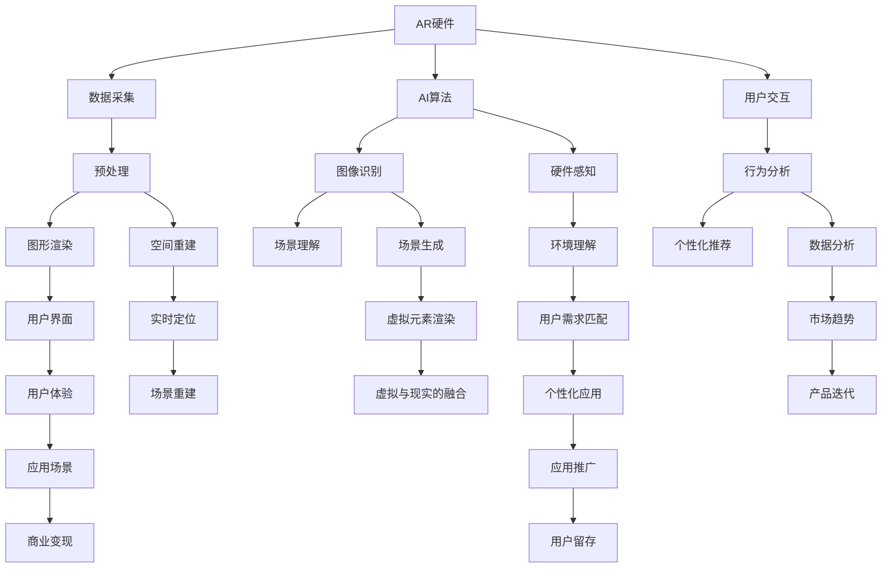

                 

# AR创业：增强现实技术的商业化

## 1. 背景介绍

### 1.1 问题由来
随着智能手机、平板电脑等便携式设备的普及，增强现实（AR）技术正逐渐进入人们的视野。根据市场调研机构IDC的数据，全球增强现实市场的规模预计将在未来几年内以年均45%的复合增速增长，到2025年市场规模将达到232亿美元。AR技术不仅在娱乐、游戏等领域展现出广阔的应用前景，也在工业制造、医疗健康、教育培训等垂直行业找到了新的应用场景。

面对这一蓬勃发展的市场，越来越多的创业者和企业投身其中。然而，AR技术的商业化进程并非一帆风顺。从AR硬件的研发、软件算法的优化，到应用场景的拓展、商业模式的设计，每一步都充满着挑战。如何高效地将AR技术商业化，成为摆在创业者面前的重要课题。

### 1.2 问题核心关键点
AR技术的商业化需要从多个维度进行综合考虑，主要包括：
- **硬件与软件协同**：如何将硬件的物理特性和软件的数据处理能力有效结合，提升用户体验。
- **用户需求适配**：如何精准识别用户需求，开发适配不同用户群体的AR应用。
- **商业模式创新**：如何在保持技术领先的同时，探索多样化的商业模式，实现商业价值的最大化。
- **市场教育与普及**：如何通过有效的市场教育，提升消费者对AR技术的接受度和使用率。
- **数据安全与隐私保护**：如何在保障用户数据安全的同时，挖掘AR技术的更多应用价值。

## 2. 核心概念与联系

### 2.1 核心概念概述
- **增强现实（AR）**：通过计算机视觉、机器学习等技术，将虚拟信息与现实世界进行融合，创造出虚拟与现实的互动体验。
- **AR硬件**：包括头戴式设备、智能眼镜、手势识别传感器等，是AR技术的物理载体。
- **AR软件**：包括操作系统、图形渲染引擎、AI算法等，是AR技术的数据处理核心。
- **AR应用**：根据用户需求开发的具体应用场景，如游戏、教育、医疗、工业等。
- **AR商业模式**：包括SaaS、B2B、B2C、订阅制等多种模式，旨在实现商业价值的最大化。

这些核心概念之间通过技术、应用、商业的相互联系和依赖，形成了一个复杂的生态系统。

### 2.2 核心概念原理和架构的 Mermaid 流程图



这个流程图展示了AR技术从硬件采集到软件渲染、从AI算法到用户体验的全过程，以及如何通过商业变现实现AR技术的可持续发展。

## 3. 核心算法原理 & 具体操作步骤

### 3.1 算法原理概述

增强现实技术的核心算法包括计算机视觉、机器学习、图形渲染等。这些算法通过捕捉用户的现实环境，将其与虚拟信息进行融合，创造出沉浸式的用户体验。

- **计算机视觉**：通过摄像头捕捉用户的实时图像，识别场景中的物体、人脸等信息。
- **机器学习**：通过深度学习等算法，对场景信息进行理解和处理，提升识别的准确性和效率。
- **图形渲染**：通过图形处理单元（GPU），对虚拟信息进行渲染，实现虚拟与现实的融合。

这些算法相互协作，共同构成了AR技术的核心。

### 3.2 算法步骤详解

增强现实技术的开发通常包括以下几个关键步骤：

**Step 1: 硬件适配与环境搭建**
- 选择合适的AR硬件设备，如智能眼镜、头戴式设备等。
- 配置计算资源，如高性能的GPU、CPU等。

**Step 2: 数据采集与预处理**
- 通过摄像头、传感器等设备，捕捉用户的实时图像和环境信息。
- 对采集的数据进行去噪、增强等预处理操作，提升后续算法的准确性。

**Step 3: 场景理解与对象识别**
- 利用计算机视觉和机器学习算法，对场景进行理解和分析。
- 通过物体检测、人脸识别等技术，识别场景中的关键对象和特征。

**Step 4: 图形渲染与实时展示**
- 通过图形渲染引擎，对虚拟信息进行渲染。
- 将虚拟信息与现实场景进行融合，实时展示给用户。

**Step 5: 用户交互与反馈优化**
- 设计用户交互界面，提供自然的交互方式，如手势、语音、触摸等。
- 根据用户反馈，优化算法的准确性和用户体验。

### 3.3 算法优缺点

增强现实技术的算法具有以下优点：
- **沉浸感强**：通过虚拟与现实的融合，创造出沉浸式的用户体验。
- **交互自然**：通过自然的手势、语音等交互方式，提升用户的使用便捷性。
- **应用广泛**：在教育、医疗、工业等多个领域具有广泛的应用前景。

同时，也存在一些缺点：
- **硬件要求高**：高性能的硬件设备是实现高质量AR体验的前提。
- **算法复杂**：计算机视觉、机器学习等算法的复杂度较高，对算力要求高。
- **内容缺乏**：目前AR应用的场景和内容较为有限，缺乏丰富的内容生态。

### 3.4 算法应用领域

增强现实技术已经在多个领域找到了应用，包括但不限于：

- **教育培训**：通过虚拟互动场景，提升教学效果和互动性。
- **医疗健康**：通过虚拟手术、虚拟护理等方式，提高医疗服务的精准性和安全性。
- **工业制造**：通过虚拟仿真和辅助设计，提升生产效率和质量。
- **游戏娱乐**：提供沉浸式的游戏体验，丰富用户的游戏内容。
- **虚拟试穿**：通过虚拟试穿，提升用户的购物体验。

## 4. 数学模型和公式 & 详细讲解 & 举例说明

### 4.1 数学模型构建

增强现实技术的核心算法可以通过数学模型进行形式化的表示。以下是一个简单的AR系统数学模型：

**输入**：
- 用户输入：图像 $I$，深度信息 $D$，传感器数据 $S$。
- 环境数据：地图 $M$，环境参数 $P$。

**输出**：
- 虚拟信息：虚拟对象 $V$，虚拟场景 $E$。

**目标**：
- 最大化虚拟信息与现实世界的融合效果。

### 4.2 公式推导过程

以AR系统的图像识别算法为例，其核心公式如下：

$$
\mathcal{L}(I, D, S, M, P) = \sum_{i=1}^{N} \mathcal{L}_{i}(I_i, D_i, S_i, M_i, P_i)
$$

其中，$\mathcal{L}_{i}$ 表示第 $i$ 个输入的损失函数，包括图像识别损失、深度估计损失、传感器数据融合损失等。

**图像识别损失**：

$$
\mathcal{L}_{I_i} = \sum_{j=1}^{M} w_j \mathcal{L}_{I_j}^{A}(I_{ij}, D_{ij}, S_{ij}, M_{ij}, P_{ij})
$$

其中，$w_j$ 表示权重，$\mathcal{L}_{I_j}^{A}$ 表示图像识别的对抗损失。

**深度估计损失**：

$$
\mathcal{L}_{D_i} = \sum_{j=1}^{M} w_j \mathcal{L}_{D_j}^{B}(D_{ij}, M_{ij}, P_{ij})
$$

其中，$w_j$ 表示权重，$\mathcal{L}_{D_j}^{B}$ 表示深度估计的对抗损失。

**传感器数据融合损失**：

$$
\mathcal{L}_{S_i} = \sum_{j=1}^{M} w_j \mathcal{L}_{S_j}^{C}(S_{ij}, M_{ij}, P_{ij})
$$

其中，$w_j$ 表示权重，$\mathcal{L}_{S_j}^{C}$ 表示传感器数据的融合损失。

### 4.3 案例分析与讲解

以一个简单的AR游戏为例，分析其核心算法和公式：

**输入**：
- 用户输入：图像 $I$，深度信息 $D$，传感器数据 $S$。
- 环境数据：地图 $M$，环境参数 $P$。

**输出**：
- 虚拟信息：虚拟对象 $V$，虚拟场景 $E$。

**目标**：
- 最大化虚拟信息与现实世界的融合效果。

**图像识别算法**：

$$
\mathcal{L}_{I_i} = \sum_{j=1}^{M} w_j \mathcal{L}_{I_j}^{A}(I_{ij}, D_{ij}, S_{ij}, M_{ij}, P_{ij})
$$

其中，$w_j$ 表示权重，$\mathcal{L}_{I_j}^{A}$ 表示图像识别的对抗损失。

**深度估计算法**：

$$
\mathcal{L}_{D_i} = \sum_{j=1}^{M} w_j \mathcal{L}_{D_j}^{B}(D_{ij}, M_{ij}, P_{ij})
$$

其中，$w_j$ 表示权重，$\mathcal{L}_{D_j}^{B}$ 表示深度估计的对抗损失。

**传感器数据融合算法**：

$$
\mathcal{L}_{S_i} = \sum_{j=1}^{M} w_j \mathcal{L}_{S_j}^{C}(S_{ij}, M_{ij}, P_{ij})
$$

其中，$w_j$ 表示权重，$\mathcal{L}_{S_j}^{C}$ 表示传感器数据的融合损失。

**虚拟场景渲染算法**：

$$
\mathcal{L}_{V_i} = \sum_{j=1}^{M} w_j \mathcal{L}_{V_j}^{D}(V_{ij}, E_{ij}, M_{ij}, P_{ij})
$$

其中，$w_j$ 表示权重，$\mathcal{L}_{V_j}^{D}$ 表示虚拟场景的渲染损失。

通过这些公式和算法，一个简单的AR游戏可以实现用户输入、图像识别、深度估计、传感器数据融合、虚拟场景渲染等功能，为用户提供沉浸式的游戏体验。

## 5. 项目实践：代码实例和详细解释说明

### 5.1 开发环境搭建

增强现实技术的开发需要依赖于多种硬件和软件资源。以下是使用Python进行AR开发的开发环境配置流程：

1. 安装Anaconda：从官网下载并安装Anaconda，用于创建独立的Python环境。

2. 创建并激活虚拟环境：
```bash
conda create -n ar-env python=3.8 
conda activate ar-env
```

3. 安装必要的库：
```bash
pip install opencv-python numpy matplotlib pyglet pyopengl pyglet-vorbis pyglet-wave pyglet-x11 pyglet-yabc
```

4. 安装AR开发框架：
```bash
pip install artk
```

5. 安装图形渲染引擎：
```bash
pip install OpenGL
```

完成上述步骤后，即可在`ar-env`环境中开始AR开发的实践。

### 5.2 源代码详细实现

下面我们以一个简单的AR游戏为例，展示如何使用Python进行AR应用的开发。

```python
import pyglet
import numpy as np
from pyglet import gl
from pyglet import shaders
from artk import ARSession
from artk import ARFrame
from artk import ARImage

def main():
    # 初始化ARSession
    session = ARSession()
    frame = session.begin_frame()

    # 加载模型
    model = load_model('path/to/model.obj')

    # 加载纹理
    texture = load_texture('path/to/texture.png')

    # 创建渲染器
    renderer = ARImage(frame)
    renderer.add(model)

    # 渲染
    renderer.draw(gl.GL_TRIANGLES)

    # 结束帧
    session.end_frame()

if __name__ == '__main__':
    main()
```

在这个例子中，我们使用ARSession类进行AR环境的初始化，通过ARFrame类获取每一帧的图像信息，加载模型和纹理，并使用ARImage类进行渲染。通过简单的代码，就可以实现一个基础的AR应用。

### 5.3 代码解读与分析

**ARSession类**：
- 初始化AR环境。

**ARFrame类**：
- 获取每一帧的图像信息。

**load_model函数**：
- 加载模型文件。

**load_texture函数**：
- 加载纹理文件。

**ARImage类**：
- 加载模型和纹理，并进行渲染。

这个例子展示了基本的AR开发流程，通过简单的代码，就可以实现一个基础的AR应用。在实际开发中，还需要进行更复杂的图像处理、传感器数据融合、用户交互等操作。

## 6. 实际应用场景

### 6.1 智能制造

增强现实技术在智能制造领域有着广泛的应用。通过AR眼镜等设备，工人可以实时获取生产现场的信息，进行虚拟装配、虚拟仿真、实时指导等操作，显著提高生产效率和质量。

**场景**：
- 工厂车间内，工人通过AR眼镜实时查看生产现场的信息。
- 通过AR眼镜，工人可以看到虚拟的装配图纸、设备参数等信息，进行精确的装配操作。
- 在出现异常情况时，工人可以通过AR眼镜获取故障诊断和修复方案。

**效益**：
- 提高生产效率：实时获取生产信息，减少查找时间。
- 提高产品质量：通过虚拟装配指导，减少人为错误。
- 提高故障修复效率：实时获取故障信息，快速进行故障诊断和修复。

### 6.2 医疗健康

增强现实技术在医疗健康领域也有着广阔的应用前景。通过AR眼镜等设备，医生可以实时查看患者的病历、影像等信息，进行虚拟手术、虚拟教学等操作，提升医疗服务的精准性和安全性。

**场景**：
- 手术室内，医生通过AR眼镜实时查看患者的病历、影像等信息。
- 通过AR眼镜，医生可以看到虚拟的手术流程、手术工具等信息，进行精确的手术操作。
- 在手术过程中，医生可以通过AR眼镜获取手术中的实时反馈信息，调整手术方案。

**效益**：
- 提高手术精度：实时获取患者信息和手术工具，减少人为错误。
- 提高手术安全性：通过虚拟手术指导，减少手术风险。
- 提高教学效果：通过虚拟手术教学，提升医生的手术技能。

### 6.3 教育培训

增强现实技术在教育培训领域也具有广泛的应用前景。通过AR眼镜等设备，学生可以实时获取教学内容、互动场景等信息，进行虚拟实验、虚拟互动等操作，提升学习效果和互动性。

**场景**：
- 教室中，学生通过AR眼镜实时获取教学内容、互动场景等信息。
- 通过AR眼镜，学生可以看到虚拟的实验装置、实验数据等信息，进行精确的实验操作。
- 在课堂互动中，学生可以通过AR眼镜进行虚拟互动，提升学习效果。

**效益**：
- 提高学习效果：实时获取教学内容，提升学习效果。
- 提高实验精度：通过虚拟实验指导，减少人为错误。
- 提高课堂互动性：通过虚拟互动，提升课堂互动效果。

## 7. 工具和资源推荐

### 7.1 学习资源推荐

为了帮助开发者系统掌握增强现实技术的开发，这里推荐一些优质的学习资源：

1. **ARKit官方文档**：苹果官方提供的ARKit文档，包含详细的API接口和开发指南，是AR开发的重要参考资料。
2. **ARCore官方文档**：谷歌提供的ARCore文档，包含详细的开发指南和示例代码，适合安卓开发者使用。
3. **AR.js官方文档**：Web AR开发工具，提供简单易用的开发框架和API接口，适合Web开发者使用。
4. **ARToolKit官方文档**：流行的AR开发工具，提供多种平台支持，包含详细的开发指南和示例代码。
5. **《增强现实编程》书籍**：深入浅出地介绍了AR开发的技术原理和实践方法，适合初学者和进阶开发者阅读。

### 7.2 开发工具推荐

高效的开发离不开优秀的工具支持。以下是几款用于增强现实技术开发的常用工具：

1. **Unity3D**：广泛使用的游戏引擎，支持AR开发，拥有丰富的插件和资源库，适合游戏开发者使用。
2. **Unreal Engine**：流行的游戏引擎，支持AR开发，提供强大的图形渲染能力和实时渲染功能。
3. **VRChat**：流行的虚拟现实社交平台，支持AR开发，提供丰富的社区资源和开发工具。
4. **ARToolKit**：流行的AR开发工具，提供多种平台支持，包含详细的开发指南和示例代码。
5. **ARKit**：苹果提供的AR开发工具，适合iOS设备开发，提供丰富的API接口和开发指南。

### 7.3 相关论文推荐

增强现实技术的发展源于学界的持续研究。以下是几篇奠基性的相关论文，推荐阅读：

1. **《Spatial Augmented Reality》**：《Spatial Augmented Reality》论文，提出了一种基于计算机视觉和空间感知技术的增强现实系统。
2. **《Real-Time 3D Object Tracking and Recognition Using Multi-View Fusion》**：《Real-Time 3D Object Tracking and Recognition Using Multi-View Fusion》论文，提出了一种基于多视角融合的增强现实系统。
3. **《Real-Time Human Pose Estimation Using Convolutional Neural Networks》**：《Real-Time Human Pose Estimation Using Convolutional Neural Networks》论文，提出了一种基于卷积神经网络的实时人体姿态估计方法。

这些论文代表了大语言模型微调技术的发展脉络。通过学习这些前沿成果，可以帮助研究者把握学科前进方向，激发更多的创新灵感。

## 8. 总结：未来发展趋势与挑战

### 8.1 总结

本文对增强现实技术的商业化进行了全面系统的介绍。首先阐述了AR技术的研究背景和意义，明确了AR技术在多个领域的应用潜力。其次，从原理到实践，详细讲解了增强现实技术的开发流程和算法原理，给出了具体的代码实现。同时，本文还广泛探讨了AR技术在智能制造、医疗健康、教育培训等多个行业领域的应用前景，展示了AR技术的巨大潜力。此外，本文精选了AR技术的各类学习资源，力求为读者提供全方位的技术指引。

通过本文的系统梳理，可以看到，增强现实技术在商业化进程中虽然面临诸多挑战，但在技术创新和应用拓展的驱动下，其商业化前景仍然广阔。未来，伴随技术的不断进步和应用的深入探索，AR技术必将在更多领域大放异彩。

### 8.2 未来发展趋势

展望未来，增强现实技术的商业化将呈现以下几个发展趋势：

1. **硬件普及**：随着AR硬件设备的不断优化和成本降低，AR设备的普及率将逐步提升。智能眼镜、头戴式设备等硬件设备的市场规模将进一步扩大。
2. **算法优化**：计算机视觉、机器学习等算法的不断优化，将提升AR系统的准确性和稳定性。新的算法模型和优化方法将推动AR技术的持续进步。
3. **应用拓展**：AR技术在工业制造、医疗健康、教育培训等多个领域的应用将不断深化。新兴的应用场景将不断涌现，推动AR技术的广泛应用。
4. **融合创新**：AR技术与物联网、区块链、AI等技术的融合创新，将拓展AR技术的更多应用场景，提升其商业价值。
5. **用户教育**：通过市场教育和用户培训，提升用户对AR技术的接受度和使用率。优质的内容创作和应用推广，将推动AR技术的商业化进程。

### 8.3 面临的挑战

尽管增强现实技术在商业化过程中取得了一定进展，但在迈向更加智能化、普适化应用的过程中，仍面临诸多挑战：

1. **硬件瓶颈**：高性能的硬件设备是实现高质量AR体验的前提。硬件设备的普及和优化，仍需大量的技术投入和市场教育。
2. **算法复杂**：计算机视觉、机器学习等算法的复杂度较高，对算力要求高。算法优化和模型压缩，仍需更多的研究和探索。
3. **内容生态**：目前AR应用的场景和内容较为有限，缺乏丰富的内容生态。优质的内容创作和应用推广，仍需大量的投入和引导。
4. **市场教育**：通过市场教育和用户培训，提升用户对AR技术的接受度和使用率。优质的内容创作和应用推广，将推动AR技术的商业化进程。
5. **商业模式**：如何探索多样化的商业模式，实现商业价值的最大化，仍需更多的研究和实践。

### 8.4 研究展望

面对增强现实技术商业化所面临的挑战，未来的研究需要在以下几个方面寻求新的突破：

1. **硬件创新**：继续推进AR硬件设备的创新和优化，提升设备的性能和用户体验。
2. **算法优化**：开发更高效、更鲁棒的计算机视觉和机器学习算法，提升AR系统的准确性和稳定性。
3. **内容生态**：加强AR内容的创作和推广，丰富应用场景和内容生态。
4. **市场教育**：通过市场教育和用户培训，提升用户对AR技术的接受度和使用率。
5. **商业模式**：探索多样化的商业模式，实现商业价值的最大化。

这些研究方向的探索，将引领增强现实技术的商业化进程，为构建更加智能化、普适化的AR系统铺平道路。面向未来，增强现实技术还需要与其他人工智能技术进行更深入的融合，如知识表示、因果推理、强化学习等，多路径协同发力，共同推动增强现实技术的进步。

## 9. 附录：常见问题与解答

**Q1：增强现实技术如何与虚拟现实（VR）技术进行区分？**

A: 增强现实技术通过将虚拟信息叠加在现实世界中，增强用户的现实体验。而虚拟现实技术则完全替换用户的现实环境，为用户提供全新的虚拟体验。

**Q2：增强现实技术的开发难度如何？**

A: 增强现实技术的开发难度较大，需要涉及计算机视觉、图形渲染、用户交互等多个领域的技术。但随着技术的不断发展和开源工具的普及，开发难度正在逐步降低。

**Q3：增强现实技术在移动设备上的应用前景如何？**

A: 增强现实技术在移动设备上具有广泛的应用前景。随着智能手机、平板电脑等设备的普及，增强现实技术可以通过这些设备实现便携式、实时化的应用场景。

**Q4：增强现实技术在教育领域的应用有哪些？**

A: 增强现实技术在教育领域的应用包括虚拟实验、虚拟互动、虚拟教室等。通过增强现实技术，学生可以实时获取教学内容、互动场景等信息，提升学习效果和互动性。

**Q5：增强现实技术在医疗健康领域的应用有哪些？**

A: 增强现实技术在医疗健康领域的应用包括虚拟手术、虚拟诊断、虚拟教学等。通过增强现实技术，医生可以实时获取患者信息和手术工具，提升手术精度和安全性。

---

作者：禅与计算机程序设计艺术 / Zen and the Art of Computer Programming

