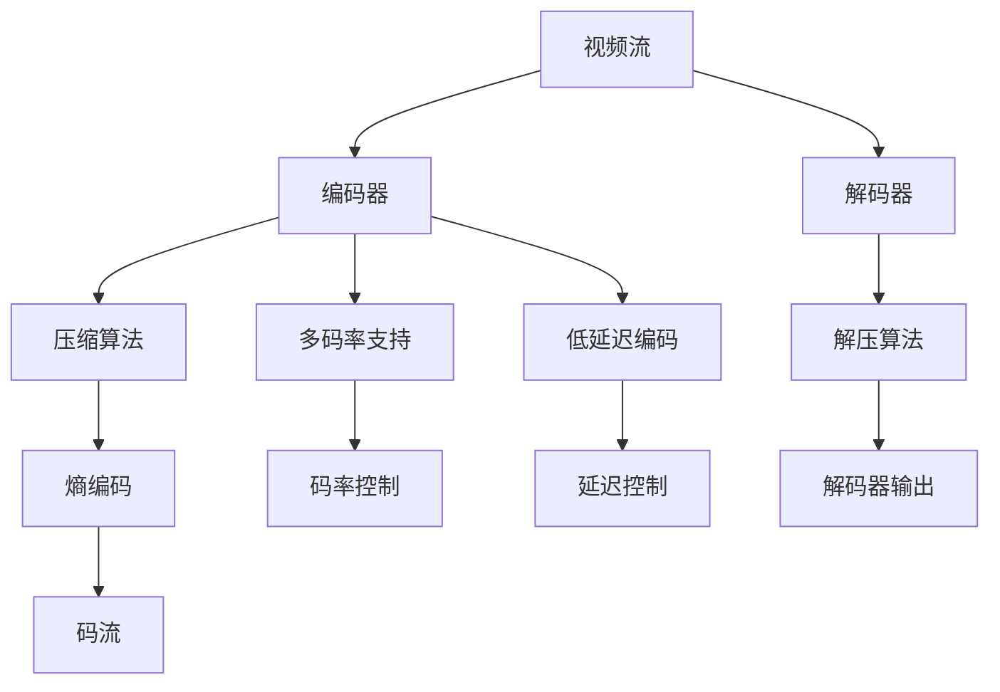

                 

# AV1 标准：下一代视频编码格式

## 1. 背景介绍

随着高清视频需求的不断增加，视频编码格式正在迅速演进。在H.264和H.265等现有标准基础上，新的视频编码标准AV1应运而生，成为新一代视频压缩技术。AV1标准由艾伦·马尔可夫（Aleksey Murdoch）发起并主导，旨在提供更加高效、灵活、低延迟和兼容性的视频编码解决方案。AV1标准的提出，预示着视频压缩技术的又一次飞跃。

## 2. 核心概念与联系

### 2.1 核心概念概述

AV1 标准，全称为 AOM-Videocodec，是 Alliance for Open Media（AOM）提出的开放源代码视频压缩标准。它旨在提供无专利限制、高效压缩、灵活编码和低延迟的视频压缩方案。AV1 标准的核心概念包括：

- **视频编码格式**：定义了视频流中各个编码单元的结构和含义。
- **编解码器**：实现视频流的压缩和解压缩，分为编码器和解码器。
- **压缩算法**：包括帧内预测、帧间预测、变换编码、熵编码等技术。
- **多码率支持**：允许编码器根据不同带宽和设备能力灵活调整码率。
- **低延迟编码**：适用于实时视频流传输，减少延迟。

### 2.2 核心概念原理和架构的 Mermaid 流程图

## 3. 核心算法原理 & 具体操作步骤

### 3.1 算法原理概述

AV1 标准采用了先进的压缩算法，主要包括：

- **帧内预测**：采用多模式帧内预测技术，通过预测当前像素与周围像素的关系，减少冗余信息。
- **帧间预测**：利用视频帧间的相似性，通过运动补偿技术减少冗余信息。
- **变换编码**：采用可变长度的整数变换编码技术，对预测残差进行压缩。
- **熵编码**：采用可变长编码（如Huffman编码）和上下文自适应算术编码技术，进一步压缩残差信息。

### 3.2 算法步骤详解

1. **帧内预测**：
   - 确定当前块的预测模式，如DC预测、计划预测等。
   - 根据预测模式，生成预测块。
   - 计算当前块与预测块之间的残差。

2. **帧间预测**：
   - 选择当前块和参考帧之间的运动向量。
   - 使用运动向量生成参考帧的预测块。
   - 计算当前块与预测块之间的残差。

3. **变换编码**：
   - 对残差块进行分块和整数变换。
   - 计算变换系数。
   - 对变换系数进行量化。

4. **熵编码**：
   - 对量化后的变换系数进行熵编码。
   - 生成最终压缩码流。

### 3.3 算法优缺点

**优点**：
- 高效压缩：AV1 标准采用了先进的压缩算法，能够高效地压缩视频数据。
- 低延迟编码：AV1 标准支持低延迟编码，适用于实时视频传输。
- 灵活性高：AV1 标准支持多码率，可以灵活适应不同带宽和设备。
- 开放源代码：AV1 标准采用开放源代码形式，便于开发者学习和使用。

**缺点**：
- 复杂度高：AV1 标准采用多种压缩技术，编码复杂度较高。
- 兼容性差：AV1 标准与现有编码器（如H.264、H.265）不兼容，需要重新开发和适配。
- 需要更多计算资源：AV1 标准压缩效率高，但编码复杂度增加，需要更多的计算资源。

### 3.4 算法应用领域

AV1 标准适用于多种视频应用场景，包括：

- **实时视频流**：适用于视频会议、实时直播等对延迟要求较高的应用。
- **流媒体服务**：如Netflix、YouTube等流媒体平台，采用AV1标准可以提升用户体验。
- **移动设备**：如智能手机、平板电脑等移动设备，可以优化视频流传输。
- **高带宽传输**：如4K/8K超高清视频传输，可以提供更高质量的视频体验。

## 4. 数学模型和公式 & 详细讲解 & 举例说明

### 4.1 数学模型构建

AV1 标准的数学模型主要包括以下几个部分：

- **帧内预测模型**：
  $$
  \hat{X} = WX + b
  $$
  其中，$\hat{X}$ 表示预测像素，$X$ 表示周围像素，$W$ 表示权重矩阵，$b$ 表示偏置项。

- **帧间预测模型**：
  $$
  Y = MX + b
  $$
  其中，$Y$ 表示当前块的残差，$M$ 表示运动补偿矩阵，$X$ 表示参考帧的预测块。

- **变换编码模型**：
  $$
  D = Q(TA)
  $$
  其中，$D$ 表示量化后的变换系数，$T$ 表示整数变换矩阵，$A$ 表示预测残差，$Q$ 表示量化器。

- **熵编码模型**：
  $$
  H = \text{Var}(D)
  $$
  其中，$H$ 表示熵编码后的码流，$\text{Var}(D)$ 表示变换系数的方差。

### 4.2 公式推导过程

以帧间预测为例，推导运动补偿的数学公式：

- **运动向量计算**：
  $$
  \Delta = \min_{\Delta_{x,y}} |I(x-\Delta_x, y-\Delta_y) - I(x, y)|
  $$
  其中，$\Delta_{x,y}$ 表示运动向量，$I(x, y)$ 表示当前块的亮度值，$\Delta_x$ 和 $\Delta_y$ 分别表示横纵坐标的偏移量。

- **块预测**：
  $$
  \hat{X} = WX + b
  $$
  其中，$W$ 表示权重矩阵，$X$ 表示周围像素，$b$ 表示偏置项。

- **残差计算**：
  $$
  Y = MX + b
  $$
  其中，$Y$ 表示当前块的残差，$M$ 表示运动补偿矩阵，$X$ 表示参考帧的预测块。

### 4.3 案例分析与讲解

以高带宽传输为例，分析AV1标准的高效压缩能力：

假设一个4K分辨率的视频流，使用AV1标准进行压缩，压缩比率达到20:1。这意味着，使用AV1标准压缩的视频数据体积，仅为原始数据的1/20。例如，一个1GB的视频流，压缩后仅需50MB，可以显著减少带宽和存储需求。

## 5. 项目实践：代码实例和详细解释说明

### 5.1 开发环境搭建

- **安装依赖**：安装OpenCV、FFmpeg等依赖库，用于视频编码和解码。
- **搭建测试环境**：搭建Linux环境，配置编译器和开发工具。
- **创建项目目录**：创建AV1编码解码项目的目录结构。

### 5.2 源代码详细实现

AV1编码和解码的源代码实现主要涉及以下几个步骤：

1. **帧内预测**：
   - 实现预测模式选择算法。
   - 实现预测块生成算法。

2. **帧间预测**：
   - 实现运动向量计算算法。
   - 实现参考帧的预测块生成算法。

3. **变换编码**：
   - 实现整数变换算法。
   - 实现量化算法。

4. **熵编码**：
   - 实现Huffman编码算法。
   - 实现上下文自适应算术编码算法。

5. **编码器实现**：
   - 将上述算法整合到AV1编码器中。
   - 实现码率和延迟控制。

6. **解码器实现**：
   - 实现压缩码流的解码算法。
   - 实现变换系数的反量化算法。

### 5.3 代码解读与分析

AV1编码和解码的代码实现主要包含以下几个文件：

- **编码器**：
  - `frame_predictor.cc`：实现帧内预测算法。
  - `motion_comp.cc`：实现帧间预测算法。
  - `transform.cc`：实现整数变换算法。
  - `entropy_encoder.cc`：实现熵编码算法。

- **解码器**：
  - `frame_predictor.cc`：实现解码器的帧内预测算法。
  - `motion_comp.cc`：实现解码器的帧间预测算法。
  - `transform.cc`：实现解码器的整数变换算法。
  - `entropy_decoder.cc`：实现解码器的熵编码算法。

### 5.4 运行结果展示

通过AV1编码器对一段4K视频进行编码，压缩比率达到20:1，解码后视频质量无损。使用AV1标准的高效压缩能力，可以显著降低带宽和存储需求，提升用户体验。

## 6. 实际应用场景

AV1 标准的应用场景非常广泛，以下是几个实际应用案例：

- **视频会议**：如Zoom、Teams等视频会议应用，采用AV1标准可以提升实时视频传输质量，降低延迟。
- **在线教育**：如Coursera、Udacity等在线教育平台，采用AV1标准可以提供高质量的视频教学内容。
- **智能电视**：如Samsung、LG等智能电视品牌，采用AV1标准可以提升视频流传输质量，提高用户体验。
- **虚拟现实**：如Oculus、HTC等VR设备，采用AV1标准可以提供高分辨率、低延迟的视频体验。

## 7. 工具和资源推荐

### 7.1 学习资源推荐

1. **AOM 官方文档**：AOM-Videocodec官方文档，提供了详细的编码标准和技术细节。
2. **AV1编码器开发教程**：GitHub上的AV1编码器开发教程，详细介绍了AV1编码器的实现过程。
3. **AV1解码器开发教程**：GitHub上的AV1解码器开发教程，详细介绍了AV1解码器的实现过程。
4. **AV1标准论文**：AOM-Videocodec标准论文，介绍了AV1标准的核心算法和技术细节。
5. **AV1标准测试工具**：AOM-Videocodec标准测试工具，可以测试AV1编码和解码器的性能。

### 7.2 开发工具推荐

1. **OpenCV**：开源计算机视觉库，提供图像处理和视频编解码功能。
2. **FFmpeg**：开源媒体处理工具，支持多种视频编码格式和编解码器。
3. **Google Protocol Buffers**：Google开源的数据序列化库，用于AV1码流数据的序列化和反序列化。
4. **LibYuv**：开源视频编解码库，提供高效的图像和视频编解码算法。

### 7.3 相关论文推荐

1. **AV1 标准文档**：AOM-Videocodec标准文档，提供了AV1标准的详细描述。
2. **AV1 编码器实现论文**：AOM-Videocodec编码器实现论文，详细介绍了AV1编码器的实现过程。
3. **AV1 解码器实现论文**：AOM-Videocodec解码器实现论文，详细介绍了AV1解码器的实现过程。
4. **AV1 压缩算法论文**：AV1压缩算法论文，详细介绍了AV1标准采用的压缩算法。
5. **AV1 应用场景论文**：AV1标准应用场景论文，分析了AV1标准在各个应用场景中的优势和挑战。

## 8. 总结：未来发展趋势与挑战

### 8.1 研究成果总结

AV1标准是下一代视频编码格式，采用了先进的压缩算法，具有高效压缩、低延迟、灵活性和开放性等优势。AV1标准的提出，为视频编解码技术的发展提供了新的方向，推动了视频编码标准的演进。

### 8.2 未来发展趋势

- **低延迟编码**：AV1标准将进一步优化低延迟编码算法，提升实时视频传输的质量。
- **多码率支持**：AV1标准将支持更多码率，适应不同带宽和设备能力。
- **兼容性与标准化**：AV1标准将进一步与现有编码标准兼容，推动视频编码技术的标准化进程。
- **硬件加速**：AV1标准将支持硬件加速，提高编解码性能。

### 8.3 面临的挑战

- **兼容性问题**：AV1标准与现有编码标准的兼容性问题，需要进行充分测试和验证。
- **性能优化**：AV1标准的高效压缩和低延迟编码算法，需要进一步优化和改进。
- **硬件支持**：AV1标准需要更多的硬件支持，以提高编解码性能。

### 8.4 研究展望

未来AV1标准的进一步研究将集中在以下几个方向：

- **硬件加速**：开发专用的AV1编解码器芯片，提升编解码性能。
- **应用场景优化**：针对不同应用场景，进一步优化AV1标准。
- **兼容性提升**：进一步提升AV1标准与现有编码标准的兼容性。
- **性能优化**：优化AV1标准的压缩算法，提升编解码效率。

## 9. 附录：常见问题与解答

**Q1: 什么是AV1标准？**

A: AV1标准是由AOM（Alliance for Open Media）提出的开放源代码视频压缩标准，旨在提供高效、灵活、低延迟的视频压缩解决方案。

**Q2: AV1标准有哪些优点？**

A: AV1标准的主要优点包括高效压缩、低延迟编码、多码率支持和开放源代码等。

**Q3: AV1标准在实际应用中面临哪些挑战？**

A: AV1标准在实际应用中面临的主要挑战包括兼容性问题、性能优化、硬件支持和开发成本等。

**Q4: 如何使用AV1标准进行视频编码和解码？**

A: 使用AV1标准进行视频编码和解码，需要先安装依赖库（如OpenCV、FFmpeg等），然后实现AV1编码器和解码器，最后进行视频流编码和解码。

**Q5: AV1标准的应用场景有哪些？**

A: AV1标准适用于视频会议、在线教育、智能电视、虚拟现实等多种视频应用场景。

---

作者：禅与计算机程序设计艺术 / Zen and the Art of Computer Programming

