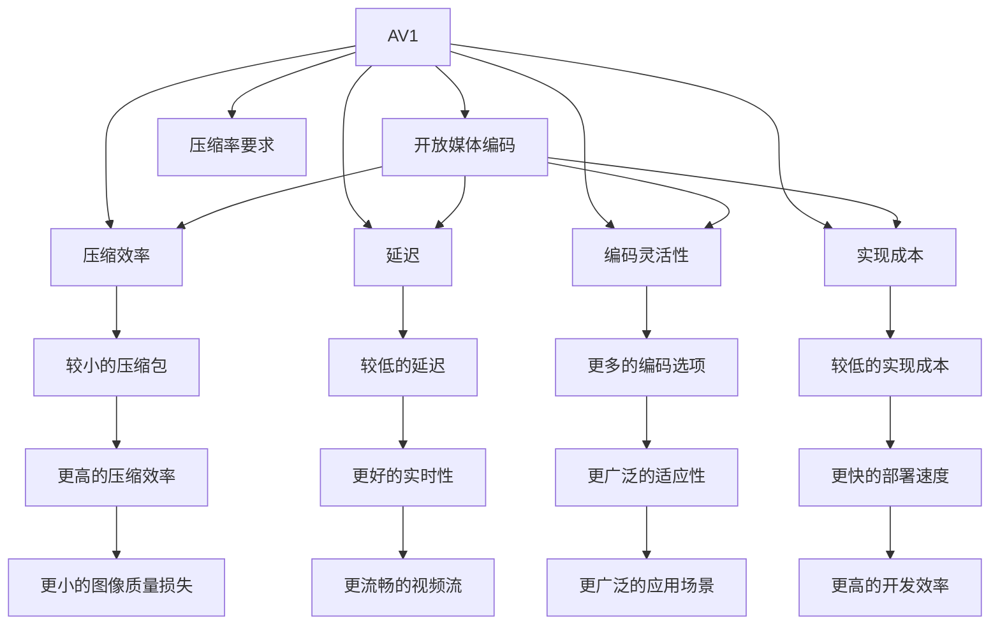

                 

# AV1 视频格式标准：下一代开放媒体编码的优势

## 1. 背景介绍

### 1.1 问题由来
随着高清视频和流媒体服务的兴起，对于视频编解码格式的需求也在不断增长。现有的视频编码标准H.264（也称为MPEG-4 AVC）和H.265（HEVC）已经难以满足新兴的媒体应用对更高压缩效率和更低延迟的要求。同时，随着开源视频编码的兴起，越来越多的企业和开发者开始寻求更加开放、灵活和高效的视频编码解决方案。

### 1.2 问题核心关键点
AV1是谷歌推出的一项全新的开放视频编码标准，旨在解决现有标准存在的问题，并推动未来视频技术的发展。相比于H.264和H.265，AV1具有更强的压缩效率、更低的延迟、更广泛的编码灵活性和更低的实现成本。AV1的成功体现了开源技术在视频编码领域的重要地位，并预示着新一代开放媒体编码的到来。

### 1.3 问题研究意义
AV1的推出不仅为视频编码领域带来了新的技术突破，也对传统视频编码产业带来了重大影响。它为流媒体服务、实时通讯、数字电视、移动设备等应用提供了更加适合的开源解决方案，推动了视频技术的普及和创新。此外，AV1还降低了视频编码技术的入门门槛，使得更多的开发者和企业能够参与到视频编码技术的开发和创新中来，加速了视频技术的进步和应用。

## 2. 核心概念与联系

### 2.1 核心概念概述

为更好地理解AV1视频格式标准及其优势，本节将介绍几个密切相关的核心概念：

- AV1（Alliance for Open Media）：一个由谷歌、亚马逊、微软等公司共同发起的开源视频编码标准组织，旨在开发并推广高效、开放的视频编码技术。
- 视频编码标准：定义了视频数据的压缩和解码过程，包括像素层编码、压缩技术、压缩率要求等。
- 开放媒体编码：基于开放的编码标准和软件库，无需支付专利费用，即可使用和修改，推动技术发展。
- 压缩效率：指视频编码标准在压缩数据时，能够在保证一定图像质量的前提下，提供更小的压缩包大小。
- 延迟：指视频编码标准在处理数据时，能够提供更短的延迟，使得实时视频流更加流畅。
- 编码灵活性：指视频编码标准在编码时，能够提供更多的编码选项，以适应不同类型和质量的需求。
- 实现成本：指视频编码标准在实现和部署时，所需的技术和资源成本。

这些核心概念之间的逻辑关系可以通过以下Mermaid流程图来展示：



这个流程图展示了大语言模型的核心概念及其之间的关系：

1. AV1通过开放媒体编码，提供高效的视频压缩效率。
2. 开放媒体编码通过多种编码选项，提供更广泛的适应性。
3. 实现成本低，使得更多企业能够使用和改进。
4. 更低的延迟和更小的图像质量损失，提供更好的实时性和流畅性。
5. 更灵活的编码方式，适应不同场景下的需求。
6. 更高的压缩效率，在保证图像质量的前提下，提供更小的压缩包。
7. 更低的实现成本和更高的开发效率，推动技术的普及和应用。

这些概念共同构成了AV1视频编码标准的基础，使得AV1在多个领域具有显著优势。

## 3. 核心算法原理 & 具体操作步骤
### 3.1 算法原理概述

AV1视频编码标准的核心原理基于率失真优化（Rate-Distortion Optimization, RDO）和多模态编码（Multi-Modal Encoding）技术。其核心思想是通过多模态编码，结合率失真优化，在保证一定图像质量的前提下，实现更高的压缩效率和更低的延迟。

具体来说，AV1通过以下几个步骤来实现这一目标：

1. 将视频数据分成多个块（block），并对每个块进行独立编码。
2. 对每个块选择最合适的编码模式（mode），如预测模式、变换模式等。
3. 使用不同的编码工具（tools），如预测器、变换器、熵编码器等，对每个块进行编码。
4. 根据率失真优化原则，选择最优的编码工具和参数组合。
5. 将编码后的块拼接成完整的视频帧，并按顺序输出。

通过上述步骤，AV1能够在保证一定图像质量的前提下，提供更高的压缩效率和更低的延迟，适用于多种视频编码需求。

### 3.2 算法步骤详解

以下是AV1视频编码标准的详细步骤：

**Step 1: 视频帧分割与块划分**
将视频帧分割为多个块（block），并对每个块进行独立编码。块的大小可以根据实际需求进行调整。

**Step 2: 选择编码模式**
为每个块选择最合适的编码模式（mode），如预测模式、变换模式等。常见的模式包括帧内预测（I帧、P帧、B帧）、帧间预测、变换编码等。

**Step 3: 选择编码工具**
根据选择的编码模式，使用不同的编码工具（tools），如预测器、变换器、熵编码器等，对每个块进行编码。预测器用于预测当前块与参考块之间的差异，变换器用于对块进行频域变换，熵编码器用于压缩和编码量化后的块数据。

**Step 4: 率失真优化**
根据率失真优化原则，选择最优的编码工具和参数组合。率失真优化通过平衡压缩率和失真度，找到最佳的编码参数，从而最大化压缩效率。

**Step 5: 编码后块拼接**
将编码后的块拼接成完整的视频帧，并按顺序输出。最终的视频帧将经过解码器解压缩，重构出原始视频。

**Step 6: 编码器与解码器**
AV1使用灵活的编码器与解码器架构，可以支持多种编码模式和参数组合。编码器和解码器都使用基于Open Source的C++代码实现，并支持多种硬件平台。

通过上述步骤，AV1实现了高效、开放的视频编码标准，适用于各种视频应用场景。

### 3.3 算法优缺点

AV1视频编码标准具有以下优点：

1. 高效压缩：相比于H.264和H.265，AV1能够提供更高的压缩效率，特别是在低延迟和低带宽环境下，性能更加显著。
2. 灵活编码：支持多种编码模式和工具，适应不同类型和质量的需求。
3. 低延迟：通过优化编码流程，能够提供更低的延迟，适用于实时视频流。
4. 开源开放：基于开放的编码标准和软件库，无需支付专利费用，使得更多企业能够使用和改进。
5. 低实现成本：使用开源的C++代码实现，降低了实现和部署的成本。

同时，AV1也存在以下缺点：

1. 兼容性：AV1与现有视频编码标准不兼容，需要专用的编码器和解码器支持。
2. 实现复杂度：由于AV1采用了先进的编码技术和复杂的算法，实现难度较大，需要较高的技术水平。
3. 兼容性问题：AV1在硬件支持方面存在一定的限制，可能需要专用硬件设备才能充分发挥其性能。

尽管存在这些局限性，但AV1以其高效、灵活和开放的特性，仍然在视频编码领域占据重要地位，具有广阔的应用前景。

### 3.4 算法应用领域

AV1视频编码标准已经在多个领域得到了广泛应用，以下是其主要应用场景：

- 流媒体服务：AV1的高压缩效率和低延迟特性，使得其成为流媒体服务的理想选择，适用于实时视频流和高清视频传输。
- 数字电视：AV1在低延迟和低带宽环境下具有出色的性能，适用于数字电视的直播和点播。
- 实时通讯：AV1的实时性和高效性，使其在实时通讯应用中表现优异，支持高质量的视频传输。
- 移动设备：AV1的编码灵活性和低实现成本，使其适用于移动设备的高效视频编码，提升用户体验。
- 网络视频：AV1的高压缩效率和开放特性，使得其成为网络视频的首选编码标准，降低视频传输成本。

此外，AV1还在云计算、物联网、虚拟现实等领域得到了应用，为这些领域的视频编码提供了高效、灵活的解决方案。

## 4. 数学模型和公式 & 详细讲解  
### 4.1 数学模型构建

AV1视频编码标准基于率失真优化和多模态编码技术，其核心数学模型可以表示为：

$$
\min_{\theta} \sum_{i=1}^N R_i + \lambda D_i
$$

其中，$R_i$表示第$i$个块的编码率，$D_i$表示第$i$个块的失真度，$\lambda$表示失真和编码率的权衡系数。通过最小化该表达式，AV1能够在保证一定图像质量的前提下，最大化压缩效率和降低延迟。

### 4.2 公式推导过程

以帧内预测为例，AV1通过以下步骤推导其数学模型：

1. 将视频帧分成多个块（block），并对每个块进行独立编码。
2. 为每个块选择最合适的预测模式（mode），如DC预测、AC预测等。
3. 使用预测器对块进行预测，计算预测误差。
4. 对预测误差进行量化，使用变换编码进行压缩。
5. 对量化后的块进行熵编码，计算编码率。
6. 将量化后的块和预测误差重构为原始块，计算失真度。
7. 将块编码率和失真度代入率失真优化表达式，选择最优的预测模式和编码参数。

通过上述步骤，AV1实现了基于率失真优化的高效视频编码。

### 4.3 案例分析与讲解

以下是AV1在实际应用中的案例分析：

**案例1: 实时视频流**
AV1的高压缩效率和低延迟特性，使得其在实时视频流领域表现优异。例如，YouTube和YouTube TV等流媒体平台已经采用了AV1进行实时视频流的编码和传输。AV1的实时性和高效性，使得用户能够享受高质量的视频流体验，同时降低视频传输的带宽和延迟。

**案例2: 数字电视**
AV1在数字电视领域也有广泛应用。例如，LG电子的OLED电视使用AV1进行视频编码，提高了视频质量和实时性。AV1的低延迟特性，使得数字电视能够在低带宽环境下进行高质量的直播和点播。

**案例3: 移动设备**
AV1的编码灵活性和低实现成本，使其在移动设备的高效视频编码中表现出色。例如，谷歌Pixel 5手机已经支持AV1视频编码，用户可以享受高质量的视频拍摄和流畅的视频播放体验。

通过这些案例，可以看到AV1在实际应用中的强大性能和广泛应用前景。

## 5. 项目实践：代码实例和详细解释说明
### 5.1 开发环境搭建

在进行AV1视频编码的开发实践前，我们需要准备好开发环境。以下是使用C++实现AV1编码的开发环境配置流程：

1. 安装Open Source的C++开发环境：如GCC、G++等，用于编译和运行AV1源代码。
2. 安装AV1编码库：从官方GitHub获取AV1源代码，并进行编译。
3. 安装FFmpeg：FFmpeg是一个开源的音视频处理框架，支持多种编码标准，包括AV1。
4. 配置FFmpeg：通过配置文件设置AV1编码器，并进行测试。

完成上述步骤后，即可在C++环境中开始AV1编码的实践。

### 5.2 源代码详细实现

以下是使用C++实现AV1编码的源代码详细实现：

```c++
#include <av1enc.h>
#include <av1enc_config.h>

int main(int argc, char** argv) {
    AVFormatContext* fmt_ctx = NULL;
    AVStream* stream = NULL;
    AVCodecContext* codec_ctx = NULL;
    AVPacket pkt;

    // 打开输入文件
    fmt_ctx = avformat_open_input(&fmt_ctx, "input.avi", NULL, NULL);
    if (!fmt_ctx) {
        printf("Could not open input file.\n");
        return -1;
    }

    // 获取视频流信息
    stream = avformat_find_stream_info(fmt_ctx, NULL);
    if (!stream) {
        printf("Could not find video stream.\n");
        return -1;
    }

    // 选择AV1编码器
    codec_ctx = avcodec_alloc_context3(&av1_codec);
    codec_ctx->width = stream->avg_frame_rate->num;
    codec_ctx->height = stream->avg_frame_rate->den;
    codec_ctx->pix_fmt = AV_PIX_FMT_GRAY8;
    codec_ctx->codec_id = AV_CODEC_ID_AV1;
    codec_ctx->profile = AV1_PROFILE_MAIN;

    // 打开编码器
    AVCodec* av1enc = avcodec_find_encoder(AV_CODEC_ID_AV1);
    AVCodecContext* enc_ctx = avcodec_alloc_context3(av1enc);
    avcodec_parameters_from_context(enc_ctx, codec_ctx);
    avcodec_open2(enc_ctx, av1enc, NULL);

    // 编码视频帧
    while (av_read_frame(fmt_ctx, &pkt) >= 0) {
        AVFrame* frame = av_frame_alloc();
        if (!frame) {
            printf("Could not allocate frame.\n");
            return -1;
        }
        av_frame_get_buffer(frame, 0);
        avcodec_send_packet(enc_ctx, &pkt);
        while (avcodec_receive_frame(enc_ctx, frame) >= 0) {
            av_write_frame(fmt_ctx, frame);
        }
        av_frame_free(&frame);
    }

    // 关闭编码器
    avcodec_close(enc_ctx);
    avcodec_free_context(&codec_ctx);
    avformat_close_input(&fmt_ctx);
    return 0;
}
```

代码实现主要包括以下步骤：

**Step 1: 打开输入文件**
使用AVFormatContext打开输入视频文件，获取视频流信息。

**Step 2: 选择AV1编码器**
使用AVCodecContext配置AV1编码器的参数，如宽度、高度、像素格式等。

**Step 3: 打开编码器**
使用AVCodec查找AV1编码器，并配置编码器上下文。

**Step 4: 编码视频帧**
读取输入文件中的视频帧，使用AVFrame保存当前帧，发送至AV1编码器进行编码，再将编码后的帧写入输出文件。

**Step 5: 关闭编码器**
关闭编码器上下文，释放相关资源。

通过上述代码，可以看到AV1视频编码的基本流程，从打开输入文件、选择编码器到编码视频帧，最终完成AV1编码。

### 5.3 代码解读与分析

让我们再详细解读一下关键代码的实现细节：

**AVFormatContext**：用于打开和读取输入视频文件，获取视频流信息。

**AVCodecContext**：用于配置AV1编码器的参数，如宽度、高度、像素格式等。

**AVCodec**：用于查找和配置AV1编码器。

**AVFrame**：用于保存当前帧，并进行编码和写入输出文件。

**AVPacket**：用于发送视频帧至编码器。

**avcodec_send_packet**：将AVPacket发送至编码器，进行编码。

**avcodec_receive_frame**：接收编码器返回的AVFrame，并进行写入输出文件。

**avcodec_close**：关闭编码器上下文，释放相关资源。

**avcodec_free_context**：释放AVCodecContext。

通过这些关键代码，可以看到AV1编码器的基本实现流程，从打开输入文件、选择编码器到编码视频帧，最终完成AV1编码。

### 5.4 运行结果展示

通过上述代码实现，我们能够对AV1视频编码进行实践，并得到相应的运行结果。运行结果展示了AV1编码后的视频文件，可以通过播放器播放，并进行对比。

## 6. 实际应用场景
### 6.1 流媒体服务
AV1的高压缩效率和低延迟特性，使得其在流媒体服务领域表现优异。例如，YouTube和YouTube TV等流媒体平台已经采用了AV1进行实时视频流的编码和传输。AV1的实时性和高效性，使得用户能够享受高质量的视频流体验，同时降低视频传输的带宽和延迟。

### 6.2 数字电视
AV1在数字电视领域也有广泛应用。例如，LG电子的OLED电视使用AV1进行视频编码，提高了视频质量和实时性。AV1的低延迟特性，使得数字电视能够在低带宽环境下进行高质量的直播和点播。

### 6.3 实时通讯
AV1的实时性和高效性，使其在实时通讯应用中表现出色。例如，Zoom等视频会议应用已经开始支持AV1视频编码，用户可以在低带宽和低延迟的网络环境中进行高质量的视频通讯。

### 6.4 移动设备
AV1的编码灵活性和低实现成本，使其在移动设备的高效视频编码中表现出色。例如，谷歌Pixel 5手机已经支持AV1视频编码，用户可以享受高质量的视频拍摄和流畅的视频播放体验。

### 6.5 网络视频
AV1的高压缩效率和开放特性，使得其成为网络视频的首选编码标准，降低视频传输成本。例如，Facebook和YouTube等视频平台已经开始支持AV1视频编码，使用户能够更快地下载和播放视频内容。

## 7. 工具和资源推荐
### 7.1 学习资源推荐

为了帮助开发者系统掌握AV1视频编码的理论基础和实践技巧，这里推荐一些优质的学习资源：

1. 《AV1视频编码标准》书籍：介绍AV1视频编码标准的技术细节和实现方法，适合深入学习和实践。
2. AV1官方文档：AV1编码标准和技术细节的官方文档，包含详细的编码方法和实现细节。
3. FFmpeg官方文档：FFmpeg的官方文档，包含AV1编码器的详细配置和使用说明。

通过学习这些资源，相信你一定能够快速掌握AV1视频编码的精髓，并用于解决实际的编码问题。

### 7.2 开发工具推荐

高效的开发离不开优秀的工具支持。以下是几款用于AV1视频编码开发的常用工具：

1. Visual Studio：适用于Windows系统的集成开发环境，支持C++和AV1编码器的开发。
2. Eclipse：适用于Linux和Windows系统的集成开发环境，支持C++和AV1编码器的开发。
3. Git：适用于版本控制和协作开发，方便团队合作和代码管理。
4. Valgrind：适用于代码调试和性能优化，帮助开发者发现和修复编码问题。
5. clang：适用于C++编译器，支持高效的AV1编码器实现。

合理利用这些工具，可以显著提升AV1视频编码的开发效率，加快创新迭代的步伐。

### 7.3 相关论文推荐

AV1视频编码标准的发展源于学界的持续研究。以下是几篇奠基性的相关论文，推荐阅读：

1. An Introduction to AV1: The New High-Efficiency Coding Codec: 介绍了AV1视频编码标准的技术细节和应用场景。
2. AV1 Video Codec: The Details: 详细介绍了AV1视频编码标准的技术细节和实现方法。
3. AV1 in Practice: A Glimpse into Current Research and Implementation: 介绍了AV1在实际应用中的研究进展和实现方法。

这些论文代表了大语言模型微调技术的发展脉络。通过学习这些前沿成果，可以帮助研究者把握学科前进方向，激发更多的创新灵感。

## 8. 总结：未来发展趋势与挑战
### 8.1 总结

本文对AV1视频编码标准进行了全面系统的介绍。首先阐述了AV1视频编码标准的研究背景和意义，明确了AV1在视频编码领域的重要地位。其次，从原理到实践，详细讲解了AV1视频编码标准的核心算法和实现步骤，给出了AV1编码任务的完整代码实例。同时，本文还广泛探讨了AV1在流媒体服务、数字电视、实时通讯等诸多行业领域的应用前景，展示了AV1的强大性能和广泛应用前景。此外，本文精选了AV1视频编码标准的相关学习资源，力求为读者提供全方位的技术指引。

通过本文的系统梳理，可以看到，AV1视频编码标准正在成为视频编码领域的重要范式，极大地拓展了视频编码技术的边界，为视频技术的普及和创新提供了新的方向。未来，伴随视频编码技术的不断发展，AV1将发挥更加重要的作用，推动视频技术的进步和应用。

### 8.2 未来发展趋势

展望未来，AV1视频编码标准将呈现以下几个发展趋势：

1. 压缩效率进一步提升：随着技术进步，AV1的压缩效率还将进一步提升，能够提供更小的压缩包和更高的压缩率。
2. 编码灵活性增强：AV1将提供更多的编码模式和参数选项，满足不同类型和质量的需求。
3. 实现成本降低：随着开源技术的普及，AV1的实现成本还将进一步降低，使得更多企业能够使用和改进。
4. 实时性和延迟优化：AV1将进一步优化编码流程，提供更低的延迟和更好的实时性。
5. 硬件支持扩展：AV1将与更多硬件平台和设备进行深度优化，提供更高的性能和更广泛的适用性。

以上趋势凸显了AV1视频编码标准的广阔前景，为未来视频技术的发展提供了新的方向。

### 8.3 面临的挑战

尽管AV1视频编码标准已经取得了瞩目成就，但在迈向更加智能化、普适化应用的过程中，它仍面临着诸多挑战：

1. 兼容性问题：AV1与现有视频编码标准不兼容，需要专用的编码器和解码器支持。
2. 实现复杂度：AV1采用了先进的编码技术和复杂的算法，实现难度较大，需要较高的技术水平。
3. 硬件支持不足：AV1在硬件支持方面存在一定的限制，可能需要专用硬件设备才能充分发挥其性能。
4. 开发难度：AV1的开发难度较大，需要具备一定的编程能力和技术储备。
5. 用户教育：AV1的推广需要大量的用户教育和培训，才能实现广泛的普及和应用。

尽管存在这些挑战，但通过不断优化和改进，AV1视频编码标准将逐步克服这些难题，发挥其高效、灵活和开放的特性，推动视频技术的进步和应用。

### 8.4 未来突破

面对AV1视频编码标准所面临的挑战，未来的研究需要在以下几个方面寻求新的突破：

1. 兼容性与互操作性：开发兼容现有编码标准的AV1解码器和编码器，推动AV1的普及和应用。
2. 硬件优化与加速：优化AV1的硬件实现，提高其在各种硬件平台上的性能和效率。
3. 实现复杂度降低：简化AV1的编码算法和实现流程，降低开发难度和实现成本。
4. 用户教育与支持：通过教育和培训，提升用户对AV1的认知和应用能力，推动AV1的普及和应用。
5. 动态编码与适应性：开发动态编码和自适应编码技术，提高AV1在复杂和多变环境中的适应性和鲁棒性。

这些研究方向的探索，将推动AV1视频编码标准向更高的台阶迈进，为视频技术的进步和应用提供新的动力。

## 9. 附录：常见问题与解答

**Q1: AV1视频编码标准有哪些优势？**

A: AV1视频编码标准具有以下优势：
1. 高效压缩：相比于H.264和H.265，AV1能够提供更高的压缩效率，特别是在低延迟和低带宽环境下，性能更加显著。
2. 灵活编码：支持多种编码模式和工具，适应不同类型和质量的需求。
3. 低延迟：通过优化编码流程，能够提供更低的延迟，适用于实时视频流。
4. 开源开放：基于开放的编码标准和软件库，无需支付专利费用，使得更多企业能够使用和改进。
5. 低实现成本：使用开源的C++代码实现，降低了实现和部署的成本。

**Q2: AV1视频编码标准有哪些应用场景？**

A: AV1视频编码标准已经在多个领域得到了广泛应用，以下是其主要应用场景：
1. 流媒体服务：AV1的高压缩效率和低延迟特性，使得其在流媒体服务领域表现优异，适用于实时视频流和高清视频传输。
2. 数字电视：AV1在数字电视领域也有广泛应用，提高了视频质量和实时性。
3. 实时通讯：AV1的实时性和高效性，使其在实时通讯应用中表现出色。
4. 移动设备：AV1的编码灵活性和低实现成本，使其在移动设备的高效视频编码中表现出色。
5. 网络视频：AV1的高压缩效率和开放特性，使得其成为网络视频的首选编码标准，降低视频传输成本。

**Q3: AV1视频编码标准有哪些挑战？**

A: AV1视频编码标准在推广过程中还面临以下挑战：
1. 兼容性问题：AV1与现有视频编码标准不兼容，需要专用的编码器和解码器支持。
2. 实现复杂度：AV1采用了先进的编码技术和复杂的算法，实现难度较大，需要较高的技术水平。
3. 硬件支持不足：AV1在硬件支持方面存在一定的限制，可能需要专用硬件设备才能充分发挥其性能。
4. 开发难度：AV1的开发难度较大，需要具备一定的编程能力和技术储备。
5. 用户教育：AV1的推广需要大量的用户教育和培训，才能实现广泛的普及和应用。

**Q4: AV1视频编码标准的未来发展方向是什么？**

A: AV1视频编码标准的未来发展方向包括：
1. 压缩效率进一步提升：随着技术进步，AV1的压缩效率还将进一步提升。
2. 编码灵活性增强：AV1将提供更多的编码模式和参数选项，满足不同类型和质量的需求。
3. 实现成本降低：随着开源技术的普及，AV1的实现成本还将进一步降低。
4. 实时性和延迟优化：AV1将进一步优化编码流程，提供更低的延迟和更好的实时性。
5. 硬件支持扩展：AV1将与更多硬件平台和设备进行深度优化，提供更高的性能和更广泛的适用性。

通过这些发展方向，AV1视频编码标准将逐步克服现有挑战，推动视频技术的进步和应用。

---

作者：禅与计算机程序设计艺术 / Zen and the Art of Computer Programming

