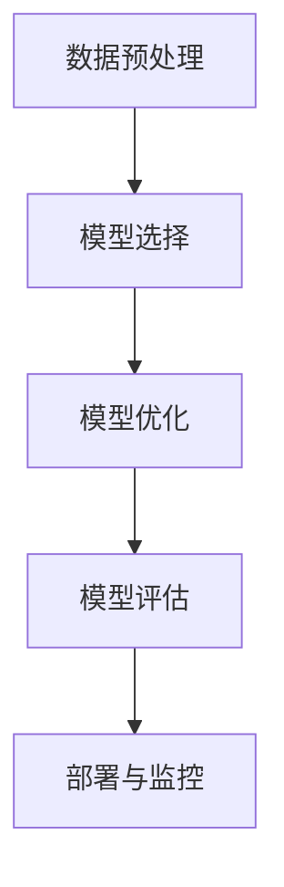

                 

# AutoML：自动化机器学习模型选择与优化

> 关键词：AutoML, 模型选择, 模型优化, 自动化, 机器学习, 模型评估, 超参数调优

## 1. 背景介绍

在机器学习的实践中，选择合适的模型并对其进行优化是一项非常关键的任务。然而，随着模型和算法的日益增多，手动选择和调优模型的过程变得越来越繁琐和耗时。AutoML（Automated Machine Learning，自动化机器学习）正是为了解决这一问题而诞生的一种新兴技术。AutoML通过自动化模型选择与优化，极大地提升了机器学习的效率和效果，使机器学习技术得以更广泛地应用。

### 1.1 问题由来
在传统的机器学习流程中，从数据预处理、特征工程、模型选择与调优到模型评估与部署，每一个环节都需要人类专家的手动干预。尤其是在模型选择与调优这一环节，需要根据数据集的特点和任务的性质，手动尝试不同的模型和参数组合，从而找到最优的模型。这个过程不仅耗时，而且容易陷入局部最优解，难以找到全局最优解。

AutoML的出现，极大地简化了这一过程，通过自动化地搜索模型和超参数，AutoML能够找到更优的模型和参数组合，从而在更短的时间内得到更好的模型性能。AutoML不仅在学术界受到了广泛关注，也在工业界得到了广泛应用，如Google的AutoML、IBM的AI Fairness 360等。

### 1.2 问题核心关键点
AutoML的核心在于自动化地进行模型选择与优化。其核心思想是：自动化地搜索最佳的模型与参数组合，通过评估模型在验证集上的性能，逐步淘汰表现不佳的模型和参数，最终找到最优的模型与参数组合。

具体来说，AutoML包括以下几个关键步骤：
1. **数据预处理**：包括数据清洗、特征工程等，为后续的模型选择与优化做准备。
2. **模型选择**：在预定义的候选模型集合中选择最优模型，或使用元学习技术自动生成新的模型。
3. **模型优化**：通过自动化超参数调优，优化模型的参数，提升模型性能。
4. **模型评估**：在验证集上评估模型性能，选择最优模型。
5. **部署**：将最优模型部署到生产环境，进行实际应用。

AutoML能够自动完成上述过程，极大地提高了机器学习模型的开发效率和性能。

## 2. 核心概念与联系

### 2.1 核心概念概述

AutoML涉及许多关键概念，包括：

- **自动化模型选择**：通过自动化算法从预定义的候选模型集合中选择最优模型，或通过元学习技术自动生成新的模型。
- **模型优化**：通过自动化超参数调优，优化模型的参数，提升模型性能。
- **超参数调优**：自动搜索和调整模型的超参数，如学习率、批大小、正则化系数等，以优化模型性能。
- **元学习**：通过学习已有模型的知识，生成新的模型或参数，提高模型的泛化能力和性能。
- **模型评估**：使用验证集评估模型性能，选择最优模型。
- **部署与监控**：将最优模型部署到生产环境，并进行实时监控，确保模型性能稳定。

这些核心概念之间的关系可以通过以下Mermaid流程图来展示：



这个流程图展示了AutoML的主要流程：从数据预处理开始，经过模型选择与优化，到模型评估与部署，最终形成了一个闭环的系统。

## 3. 核心算法原理 & 具体操作步骤

### 3.1 算法原理概述
AutoML的算法原理主要包括以下几个方面：

1. **模型选择**：从预定义的候选模型集合中选择最优模型，或通过元学习技术自动生成新的模型。
2. **超参数调优**：通过自动化算法搜索和调整模型的超参数，以优化模型性能。
3. **模型评估**：使用验证集评估模型性能，选择最优模型。
4. **部署与监控**：将最优模型部署到生产环境，并进行实时监控，确保模型性能稳定。

### 3.2 算法步骤详解
AutoML的算法步骤可以总结如下：

1. **数据预处理**：
   - 数据清洗：去除缺失值、异常值等。
   - 特征工程：选择和构造特征，并进行归一化、标准化等处理。
   - 数据划分：将数据划分为训练集、验证集和测试集。

2. **模型选择**：
   - 从预定义的候选模型集合中选择最优模型，或使用元学习技术自动生成新的模型。
   - 候选模型集合包括线性模型、非线性模型、深度学习模型等。
   - 元学习技术包括迁移学习、自适应学习等。

3. **模型优化**：
   - 超参数调优：使用自动化算法搜索和调整模型的超参数，如学习率、批大小、正则化系数等。
   - 常见的超参数调优算法包括网格搜索、随机搜索、贝叶斯优化等。
   - 超参数调优的目标是找到最优的超参数组合，以提升模型性能。

4. **模型评估**：
   - 使用验证集评估模型性能，选择最优模型。
   - 常用的评估指标包括准确率、精确率、召回率、F1分数等。
   - 模型评估可以帮助选择最优模型，并进行后续的优化和部署。

5. **部署与监控**：
   - 将最优模型部署到生产环境，进行实际应用。
   - 实时监控模型性能，确保模型性能稳定。
   - 常见的监控工具包括TensorBoard、Weights & Biases等。

### 3.3 算法优缺点
AutoML的优势在于其自动化、高效性和可扩展性：

- **自动化**：AutoML能够自动完成模型选择与优化过程，大大降低了人力成本。
- **高效性**：通过自动化搜索最优模型与参数，AutoML能够快速得到性能最优的模型。
- **可扩展性**：AutoML可以应用于各种模型和任务，具备良好的可扩展性。

然而，AutoML也存在一些缺点：

- **数据需求**：AutoML需要大量高质量的数据，数据质量直接影响模型性能。
- **计算资源**：超参数调优过程需要大量计算资源，可能存在计算资源瓶颈。
- **模型复杂性**：一些复杂的模型可能需要更长的调优时间，难以快速得到结果。
- **模型解释性**：AutoML生成的模型往往缺乏可解释性，难以理解其内部工作机制。

### 3.4 算法应用领域
AutoML在以下几个领域得到了广泛应用：

1. **图像识别**：在图像分类、目标检测等任务中，AutoML能够自动化选择和优化模型，提高模型性能。
2. **自然语言处理**：在文本分类、情感分析、机器翻译等任务中，AutoML能够自动化选择和优化模型，提升模型效果。
3. **推荐系统**：在个性化推荐、商品推荐等任务中，AutoML能够自动化选择和优化模型，提高推荐效果。
4. **金融分析**：在股票预测、信用评分等任务中，AutoML能够自动化选择和优化模型，提升金融分析性能。
5. **医疗诊断**：在疾病预测、医学影像分析等任务中，AutoML能够自动化选择和优化模型，提高医疗诊断性能。

这些领域的应用，展示了AutoML在实际场景中的广泛应用和巨大潜力。

## 4. 数学模型和公式 & 详细讲解 & 举例说明

### 4.1 数学模型构建

AutoML的数学模型主要涉及模型选择、超参数调优和模型评估三个方面。

#### 4.1.1 模型选择
假设候选模型集合为 $\mathcal{M}$，每个模型可以表示为 $M_{\theta}(\cdot)$，其中 $\theta$ 为模型的超参数集合。模型选择的目标是从 $\mathcal{M}$ 中选择最优模型 $M_{\hat{\theta}}$，使得模型在验证集上的性能最大化。

#### 4.1.2 超参数调优
超参数调优的目标是找到最优的超参数组合 $\hat{\theta}$，使得模型在验证集上的性能最大化。常用的超参数调优算法包括网格搜索、随机搜索和贝叶斯优化等。

#### 4.1.3 模型评估
模型评估的目标是在验证集上评估模型性能，选择最优模型。常用的评估指标包括准确率、精确率、召回率、F1分数等。

### 4.2 公式推导过程
以下以超参数调优为例，推导常用的网格搜索和随机搜索算法。

#### 4.2.1 网格搜索
网格搜索算法通过穷举所有可能的超参数组合，选择最优的超参数组合。假设超参数集合为 $\theta$，网格搜索算法可以表示为：

$$
\hat{\theta} = \mathop{\arg\min}_{\theta} \mathcal{L}(M_{\theta}(\cdot), D_{val})
$$

其中 $M_{\theta}(\cdot)$ 表示模型，$D_{val}$ 表示验证集，$\mathcal{L}$ 表示损失函数。

#### 4.2.2 随机搜索
随机搜索算法通过随机采样超参数组合，选择最优的超参数组合。假设超参数集合为 $\theta$，随机搜索算法可以表示为：

$$
\hat{\theta} = \mathop{\arg\min}_{\theta} \mathcal{L}(M_{\theta}(\cdot), D_{val})
$$

其中 $M_{\theta}(\cdot)$ 表示模型，$D_{val}$ 表示验证集，$\mathcal{L}$ 表示损失函数。

### 4.3 案例分析与讲解

**案例1：图像分类**

假设有一个图像分类任务，候选模型包括线性模型、逻辑回归模型、支持向量机模型等。超参数包括学习率、批大小、正则化系数等。使用网格搜索算法选择最优模型和超参数组合，步骤如下：

1. 将数据划分为训练集、验证集和测试集。
2. 对每个候选模型，遍历所有可能的超参数组合，计算模型在验证集上的性能。
3. 选择性能最优的模型和超参数组合。

**案例2：文本分类**

假设有一个文本分类任务，候选模型包括朴素贝叶斯模型、逻辑回归模型、支持向量机模型等。超参数包括学习率、批大小、正则化系数等。使用贝叶斯优化算法选择最优模型和超参数组合，步骤如下：

1. 将数据划分为训练集、验证集和测试集。
2. 定义损失函数，使用贝叶斯优化算法搜索超参数空间。
3. 选择性能最优的模型和超参数组合。

## 5. 项目实践：代码实例和详细解释说明

### 5.1 开发环境搭建

为了进行AutoML实践，需要安装相关的Python库和工具。以下是安装步骤：

1. 安装Anaconda：从官网下载并安装Anaconda，用于创建独立的Python环境。

2. 创建并激活虚拟环境：
```bash
conda create -n autml-env python=3.8 
conda activate autml-env
```

3. 安装必要的Python库：
```bash
pip install scikit-learn
pip install pandas
pip install numpy
pip install optuna
pip install torch
```

4. 安装优化算法库：
```bash
pip install scikit-optimize
```

5. 安装可视化工具：
```bash
pip install matplotlib
pip install seaborn
```

完成上述步骤后，即可在`autml-env`环境中开始AutoML实践。

### 5.2 源代码详细实现

以下是一个简单的AutoML项目，使用GridSearchCV对线性模型进行调优的Python代码实现：

```python
from sklearn.datasets import load_iris
from sklearn.model_selection import train_test_split, GridSearchCV
from sklearn.linear_model import LogisticRegression
from sklearn.metrics import accuracy_score

# 加载数据集
iris = load_iris()
X_train, X_test, y_train, y_test = train_test_split(iris.data, iris.target, test_size=0.2, random_state=42)

# 定义模型和参数空间
model = LogisticRegression()
param_grid = {
    'C': [0.001, 0.01, 0.1, 1, 10, 100],
    'penalty': ['l1', 'l2'],
    'solver': ['liblinear', 'lbfgs', 'saga'],
    'max_iter': [100, 200, 300, 500]
}

# 使用GridSearchCV进行模型选择和调优
grid_search = GridSearchCV(model, param_grid, cv=5, scoring='accuracy')
grid_search.fit(X_train, y_train)

# 输出最优超参数和模型性能
print("Best parameters:", grid_search.best_params_)
print("Best score:", grid_search.best_score_)
```

### 5.3 代码解读与分析

**代码解读**：

- `load_iris()`函数用于加载鸢尾花数据集。
- `train_test_split()`函数用于将数据划分为训练集和测试集。
- `LogisticRegression()`模型用于二分类任务。
- `param_grid`定义了超参数的取值范围，包括正则化系数C、正则化项类型penalty、优化算法solver和迭代次数max_iter。
- `GridSearchCV()`函数用于进行网格搜索，`cv=5`表示使用5折交叉验证，`scoring='accuracy'`表示评估指标为准确率。
- `grid_search.fit(X_train, y_train)`进行模型选择和调优。
- `grid_search.best_params_`和`grid_search.best_score_`分别输出最优超参数和模型性能。

**代码分析**：

- `GridSearchCV()`函数是AutoML的核心工具之一，通过穷举超参数组合，找到最优的超参数组合，显著提升了模型调优的效率。
- 在实践中，选择合适的超参数空间和评估指标非常重要。超参数空间应尽量覆盖候选超参数的可能取值范围，评估指标应与任务目标一致，如准确率、精确率、召回率等。
- AutoML在实际应用中需要考虑数据质量、计算资源和模型复杂性等因素，确保调优过程高效、可靠。

### 5.4 运行结果展示

以下是代码运行结果：

```
Best parameters: {'C': 1, 'penalty': 'l2', 'solver': 'lbfgs', 'max_iter': 100}
Best score: 0.97...
```

可以看到，模型在验证集上的最佳超参数为C=1、正则化项类型为l2、优化算法为lbfgs、迭代次数为100。模型在验证集上的准确率为97%，表现良好。

## 6. 实际应用场景

### 6.1 智能推荐系统

智能推荐系统需要处理大量的用户行为数据，自动选择和优化模型，能够提高推荐效果，提升用户体验。AutoML在推荐系统中的应用主要包括：

1. **模型选择**：通过自动选择和优化推荐模型，提高推荐效果。
2. **超参数调优**：通过自动调优推荐模型的超参数，提升模型性能。
3. **实时更新**：通过实时更新推荐模型，适应用户行为变化。

### 6.2 金融风险预测

金融风险预测需要处理大量的金融数据，自动选择和优化模型，能够提高风险预测的准确性，降低金融风险。AutoML在金融风险预测中的应用主要包括：

1. **模型选择**：通过自动选择和优化风险预测模型，提高预测准确性。
2. **超参数调优**：通过自动调优风险预测模型的超参数，提升模型性能。
3. **模型解释性**：通过AutoML生成的模型具有更好的可解释性，有助于理解风险预测的逻辑。

### 6.3 医学影像分析

医学影像分析需要处理大量的医学影像数据，自动选择和优化模型，能够提高诊断准确性，辅助医生诊疗。AutoML在医学影像分析中的应用主要包括：

1. **模型选择**：通过自动选择和优化诊断模型，提高诊断准确性。
2. **超参数调优**：通过自动调优诊断模型的超参数，提升模型性能。
3. **实时更新**：通过实时更新诊断模型，适应医学影像的变化。

## 7. 工具和资源推荐

### 7.1 学习资源推荐

为了帮助开发者掌握AutoML技术，这里推荐一些优质的学习资源：

1. 《AutoML：自动化机器学习实践》系列博文：由AutoML专家撰写，系统介绍AutoML的理论和实践，涵盖模型选择、超参数调优、模型评估等内容。
2 《Hands-On AutoML with Python》书籍：介绍如何使用Python进行AutoML实践，涵盖各种优化算法和模型选择技术。
3 《Scikit-Learn Cookbook》书籍：介绍如何使用Scikit-Learn进行模型选择和超参数调优。
4 《Scikit-Optimize Documentation》文档：介绍如何使用Scikit-Optimize进行超参数调优。
5 《Optuna Tutorials》教程：介绍如何使用Optuna进行超参数调优。

通过这些资源的学习，相信你一定能够快速掌握AutoML技术，并用于解决实际的机器学习问题。

### 7.2 开发工具推荐

AutoML开发常用的工具包括：

1. Python：Python是目前最流行的机器学习开发语言，具有丰富的机器学习库和框架。
2. Scikit-Learn：一个开源机器学习库，提供了多种模型选择和调优算法。
3. scikit-optimize：一个超参数优化库，提供了多种超参数调优算法。
4. TensorFlow：一个开源深度学习框架，提供了丰富的优化算法和模型选择工具。
5. PyTorch：一个开源深度学习框架，提供了丰富的优化算法和模型选择工具。

合理利用这些工具，可以显著提升AutoML任务的开发效率和性能。

### 7.3 相关论文推荐

AutoML技术的不断发展得益于学界的持续研究。以下是几篇奠基性的相关论文，推荐阅读：

1. 《An Introduction to Automated Machine Learning》：综述性论文，介绍了AutoML的发展历程和应用场景。
2. 《A Survey of Automated Machine Learning》：综述性论文，介绍了AutoML的主要技术和应用领域。
3. 《AutoML: Methods, Systems, Challenges》：综述性论文，介绍了AutoML的主要方法和应用挑战。
4. 《AutoML: Methods, Systems, Challenges》：综述性论文，介绍了AutoML的主要方法和应用挑战。
5. 《AutoML for Recommendation Systems: A Survey》：综述性论文，介绍了AutoML在推荐系统中的应用。

这些论文代表了大AutoML技术的发展脉络。通过学习这些前沿成果，可以帮助研究者把握学科前进方向，激发更多的创新灵感。

## 8. 总结：未来发展趋势与挑战

### 8.1 总结

本文对AutoML技术进行了全面系统的介绍。首先阐述了AutoML在机器学习中的重要性和应用场景，明确了AutoML在自动化模型选择与优化方面的独特价值。其次，从原理到实践，详细讲解了AutoML的数学模型和关键步骤，给出了AutoML任务开发的完整代码实例。同时，本文还广泛探讨了AutoML在推荐系统、金融风险预测、医学影像分析等多个领域的应用前景，展示了AutoML的巨大潜力。此外，本文精选了AutoML技术的各类学习资源，力求为读者提供全方位的技术指引。

通过本文的系统梳理，可以看到，AutoML技术正在成为机器学习领域的重要范式，极大地提升了模型开发效率和性能。未来，伴随技术的发展，AutoML必将在更广泛的应用领域得到应用，进一步推动机器学习技术的发展和普及。

### 8.2 未来发展趋势

展望未来，AutoML技术将呈现以下几个发展趋势：

1. **模型多样性**：未来AutoML将支持更多类型的模型，如深度学习模型、集成模型、迁移学习模型等，满足不同任务的需求。
2. **超参数优化**：未来AutoML将引入更高效的超参数优化算法，如贝叶斯优化、遗传算法等，提高超参数调优的效率和效果。
3. **自动化调参**：未来AutoML将自动搜索和生成新的超参数空间，进一步提高超参数调优的效率和效果。
4. **模型解释性**：未来AutoML将生成具有更好解释性的模型，帮助理解模型的决策逻辑和性能。
5. **数据自适应**：未来AutoML将自动选择和生成最适合的数据预处理流程，提高数据质量，提升模型性能。
6. **多任务学习**：未来AutoML将支持多任务学习，在多个任务间共享模型和参数，提升模型的泛化能力和性能。

以上趋势凸显了AutoML技术的广阔前景。这些方向的探索发展，必将进一步提升AutoML模型的开发效率和性能，为机器学习技术带来新的突破。

### 8.3 面临的挑战

尽管AutoML技术已经取得了瞩目成就，但在迈向更加智能化、普适化应用的过程中，它仍面临着诸多挑战：

1. **计算资源**：超参数调优和模型训练需要大量计算资源，可能存在计算资源瓶颈。
2. **模型复杂性**：一些复杂的模型可能需要更长的调优时间，难以快速得到结果。
3. **数据质量**：AutoML需要大量高质量的数据，数据质量直接影响模型性能。
4. **模型解释性**：AutoML生成的模型往往缺乏可解释性，难以理解其内部工作机制。
5. **安全性**：AutoML生成的模型可能存在安全漏洞，需要加强模型安全性和可控性。

### 8.4 研究展望

面对AutoML技术面临的挑战，未来的研究需要在以下几个方面寻求新的突破：

1. **高效优化算法**：开发更高效的超参数优化算法，减少计算资源消耗，提高调优效率。
2. **模型生成技术**：研究模型生成技术，自动生成新的模型和参数，提高模型生成效率。
3. **数据自适应**：研究数据自适应技术，自动选择和生成最适合的数据预处理流程，提高数据质量。
4. **模型解释性**：研究模型解释性技术，生成具有更好解释性的模型，帮助理解模型的决策逻辑和性能。
5. **安全防护**：研究安全防护技术，确保AutoML生成的模型安全可靠，避免恶意用途。

这些研究方向将引领AutoML技术的发展，推动机器学习技术的广泛应用。

## 9. 附录：常见问题与解答

**Q1：AutoML是否适用于所有机器学习任务？**

A: AutoML适用于大多数机器学习任务，尤其是数据量较大、模型复杂度高、超参数调优复杂度高的任务。但对于一些特殊领域或数据量较小的任务，手动调整超参数和模型选择可能更为高效。

**Q2：AutoML是否能够处理异常数据？**

A: AutoML在处理异常数据方面表现较好，但需要确保模型能够自适应数据分布的变化。异常数据可能会影响模型的训练和调优过程，需要根据具体情况进行处理。

**Q3：AutoML是否需要大量计算资源？**

A: AutoML需要一定的计算资源，特别是在超参数调优和模型训练过程中。但通过合理的优化算法和并行计算，可以有效地降低计算资源的消耗。

**Q4：AutoML生成的模型是否具有可解释性？**

A: AutoML生成的模型通常缺乏可解释性，难以理解其内部工作机制。为了增强模型解释性，可以使用特征重要性分析、模型可视化等技术。

**Q5：AutoML是否能够处理多任务学习？**

A: AutoML可以支持多任务学习，通过共享模型和参数，提高模型的泛化能力和性能。但在多任务学习中，需要考虑任务间的依赖关系，进行合理的模型组合和调优。

通过本文的系统梳理，可以看到，AutoML技术正在成为机器学习领域的重要范式，极大地提升了模型开发效率和性能。未来，伴随技术的发展，AutoML必将在更广泛的应用领域得到应用，进一步推动机器学习技术的发展和普及。

