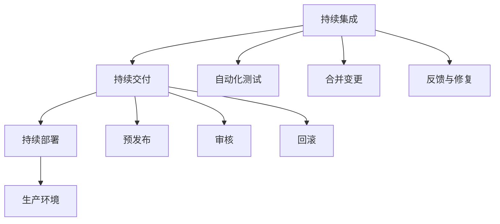

                 

# CI/CD管道：自动化软件交付流程

> 关键词：CI/CD, DevOps, 自动化部署, 持续集成, 持续交付, 软件开发流程

## 1. 背景介绍

### 1.1 问题由来
在现代软件开发中，软件交付的周期不断缩短，需求变化快速，传统的手工测试、部署方式已经难以适应新的发展需求。同时，手动操作带来的重复性错误、人为疏漏等问题也频繁出现，严重影响了软件交付的效率和质量。针对这一问题，自动化测试、持续集成、持续交付等 DevOps 理念应运而生。

### 1.2 问题核心关键点
DevOps 的核心理念是将开发和运维两个环节紧密结合，通过自动化技术提高软件交付的效率和质量。其中，CI/CD 管道是 DevOps 流程中最核心的一环，其目标是实现软件的快速构建、测试和部署，减少手动操作，提高交付的稳定性和安全性。

### 1.3 问题研究意义
CI/CD 管道对于提升软件开发效率、缩短交付周期、降低错误率、提高软件质量具有重要意义。通过自动化流程，可以大大减少人为操作带来的风险，降低软件交付的成本，加速企业的数字化转型。

## 2. 核心概念与联系

### 2.1 核心概念概述

CI/CD 管道主要由三个核心概念构成：持续集成 (Continuous Integration, CI)、持续交付 (Continuous Delivery, CD) 和持续部署 (Continuous Deployment)。

- **持续集成 (CI)**：在软件开发过程中，定期集成代码变更，通过自动化测试验证代码的正确性，确保代码质量和稳定性。
- **持续交付 (CD)**：在通过自动化测试后，将软件打包为可部署的版本，并在生产环境中进行部署前的验证和审计，确保生产环境的安全性和可靠性。
- **持续部署 (CD)**：在通过持续交付验证后，自动将软件版本部署到生产环境，完成软件的交付过程。

CI/CD 管道通过自动化流程将软件开发和运维两个环节紧密衔接，形成了一个高效、可控的软件交付系统。

### 2.2 核心概念原理和架构的 Mermaid 流程图



这个流程图展示了 CI/CD 管道的基本流程：

1. **CI** 中的代码变更定期集成并触发自动化测试。
2. **CD** 在通过测试后，进行预发布和审核。
3. **Deploy** 将经过审核的代码部署到生产环境。

通过自动化工具链和流水线，CI/CD 管道能够确保代码变更的及时性、可控性和可靠性，实现软件的快速交付。

## 3. 核心算法原理 & 具体操作步骤

### 3.1 算法原理概述

CI/CD 管道的核心算法原理是自动化和持续性。它通过定义一系列的自动化脚本和任务，将软件开发和运维的每个环节都自动化，并持续执行这些自动化任务，以确保软件交付的效率和质量。

### 3.2 算法步骤详解

#### 3.2.1 持续集成 (CI) 流程

1. **代码变更提交**：开发人员通过 Git 或其他版本控制系统提交代码变更。
2. **集成与构建**：代码变更提交后，CI 管道立即触发自动化构建，将代码从版本控制系统合并到主干分支中。
3. **自动化测试**：构建完成后，CI 管道自动执行测试任务，包括单元测试、集成测试、功能测试等，确保代码变更没有引入新问题。
4. **代码合并与反馈**：通过自动化测试后，如果代码变更未通过测试，则自动回滚至之前的版本，并进行修复。如果通过测试，则合并代码变更到主干分支，并通知相关开发人员。

#### 3.2.2 持续交付 (CD) 流程

1. **预发布**：在 CI 流程中通过测试后，CD 管道将代码打包为可部署版本，并进行预发布。
2. **审核与部署前验证**：CD 管道自动执行预发布后的验证任务，包括环境验证、代码审计、性能测试等，确保新版本能够稳定运行。
3. **回滚与部署**：如果预发布验证通过，CD 管道自动部署新版本到生产环境。否则，自动回滚到之前的版本，并通知相关人员进行处理。

#### 3.2.3 持续部署 (CD) 流程

1. **部署与监控**：在 CD 流程中验证通过后，CI/CD 管道自动将新版本部署到生产环境。
2. **监控与反馈**：部署完成后，CI/CD 管道自动监控新版本的运行状态，收集性能指标和日志信息，确保新版本运行稳定。
3. **回滚与优化**：如果新版本出现异常，CI/CD 管道自动回滚到之前的版本，并进行问题排查和优化。

### 3.3 算法优缺点

#### 3.3.1 优点

- **提升效率**：自动化流程减少了手动操作，缩短了软件交付周期。
- **提高质量**：自动化测试和持续集成确保了代码变更的正确性和稳定性。
- **增强安全性**：自动化部署和回滚机制保证了生产环境的安全性和可靠性。

#### 3.3.2 缺点

- **复杂度增加**：自动化流程的引入和维护需要一定的技术积累和管理成本。
- **依赖工具**：CI/CD 管道的实施依赖于多种工具和插件，工具链的维护和管理较为复杂。
- **初始投入大**：构建和维护一个高效的 CI/CD 管道需要一定的前期投入和资源配置。

### 3.4 算法应用领域

CI/CD 管道被广泛应用于软件开发、测试、运维等多个环节，特别在企业级软件开发、云计算平台、大数据处理、智能应用等领域具有重要应用价值。

## 4. 数学模型和公式 & 详细讲解 & 举例说明

### 4.1 数学模型构建

CI/CD 管道的数学模型主要基于以下假设：

- 代码变更遵循某种分布（如 Poisson 分布），在固定时间内提交一定数量的变更。
- 自动化测试和部署的任务执行时间是固定的，且任务之间是独立的。
- 任务执行过程中可能出现延误或失败，概率为 $\alpha$。

### 4.2 公式推导过程

假设每个代码变更的提交时间为 $T$，测试时间为 $T_t$，部署时间为 $T_d$，每个任务失败的概率为 $\alpha$。则单个代码变更的平均执行时间为 $T_{avg} = T + T_t + T_d$。

令 $n$ 为一天内提交的代码变更数量，$R$ 为失败的任务数量，$S$ 为通过的任务数量。则在一天内，成功交付的代码变更数量为 $S - R$。

设 $N$ 为一天的业务处理量，$L$ 为每天需要部署的代码变更数量。则 CI/CD 管道的平均交付时间为 $D_{avg} = T_{avg} * (n / L)$。

### 4.3 案例分析与讲解

以一个电商网站为例，假设每日处理请求数为 10000 次，需要部署的代码变更数量为 5 个，每个变更的平均提交时间为 1 小时，测试时间为 2 小时，部署时间为 1 小时，任务失败的概率为 0.05。

根据公式推导，一天内成功交付的代码变更数量为 $S - R = 5 - 0.05 \times 5 = 4.75$ 个，平均交付时间为 $D_{avg} = 1 + 2 + 1 \times (10000 / 5) = 603$ 小时。

如果采用优化的 CI/CD 流程，如引入自动化测试、减少手动操作、优化任务调度等，可以进一步提升交付效率，减少故障率，提升系统稳定性。

## 5. 项目实践：代码实例和详细解释说明

### 5.1 开发环境搭建

为了搭建一个高效的 CI/CD 管道，需要以下开发环境：

1. **Git 版本控制系统**：用于代码变更的管理。
2. **CI/CD 工具**：如 Jenkins、Travis CI、GitLab CI 等。
3. **自动化测试工具**：如 Selenium、JUnit、TestNG 等。
4. **容器化平台**：如 Docker、Kubernetes 等。
5. **监控工具**：如 ELK Stack、Prometheus、Grafana 等。

### 5.2 源代码详细实现

以下是一个基于 Jenkins 和 Docker 的 CI/CD 管道示例代码：

```bash
# Jenkinsfile
pipeline {
    agent any
    stages {
        stage('构建') {
            steps {
                sh 'docker build -t myapp:latest .'
            }
        }
        stage('测试') {
            steps {
                sh 'docker run -it --rm -e BUILD_NUMBER=${BUILD_NUMBER} myapp:latest bash -c "pytest"'
            }
        }
        stage('部署') {
            steps {
                sh 'docker run -d --name myapp -p 8080:80 myapp:latest'
            }
        }
    }
}
```

### 5.3 代码解读与分析

以上代码是一个简单的 Jenkinsfile，用于实现一个网站的 CI/CD 流程。具体流程如下：

1. **构建**：通过 `docker build` 命令构建 Docker 镜像。
2. **测试**：在容器内运行测试脚本，通过 pytest 执行单元测试。
3. **部署**：在容器内启动网站服务，并通过 `docker run` 命令将服务部署到生产环境。

### 5.4 运行结果展示

通过上述代码，可以构建一个完整的 CI/CD 管道，实现网站的自动化构建、测试和部署。在 Jenkins 仪表板上，可以实时监控每个任务的执行状态，包括构建、测试、部署等环节。通过历史记录，可以查看每个任务的执行结果，确保整个流程的稳定性和可靠性。

## 6. 实际应用场景

### 6.1 智能应用部署

在智能应用开发中，CI/CD 管道可以大大提升应用部署的效率和质量。例如，智能推荐系统、智能客服、智能分析等应用，需要频繁地进行代码变更和模型训练，通过 CI/CD 管道可以确保每次变更的稳定性和准确性，减少手动操作带来的风险。

### 6.2 企业级系统集成

在企业级系统集成中，CI/CD 管道是确保系统稳定性和可靠性的关键。例如，ERP 系统、CRM 系统等企业级应用，需要频繁进行代码变更和业务集成，通过 CI/CD 管道可以确保每次变更的代码和数据一致性，减少系统故障和数据丢失。

### 6.3 大数据处理

在大数据处理中，CI/CD 管道可以确保数据处理流程的稳定性和高效性。例如，数据清洗、数据转换、数据加载等流程，通过 CI/CD 管道可以自动化执行，减少手动操作带来的错误率，提高数据处理的效率和准确性。

### 6.4 未来应用展望

未来，随着技术的发展和应用的深入，CI/CD 管道将呈现出以下趋势：

- **全链路自动化**：从代码变更到部署上线的全链路自动化，实现端到端的系统集成。
- **云原生集成**：通过 Kubernetes、Docker 等云原生技术，实现弹性部署和资源管理。
- **多环境支持**：支持多种环境和测试策略，如本地开发、单元测试、集成测试、系统测试等。
- **持续反馈与优化**：通过自动化测试和监控，及时发现和修复问题，不断优化流程。

## 7. 工具和资源推荐

### 7.1 学习资源推荐

为了深入理解 CI/CD 管道的原理和实践，以下推荐一些优质的学习资源：

1. **《持续集成实践》**：开源书籍，详细介绍了持续集成的原理和实践，涵盖从构建到部署的全流程。
2. **《Jenkins 权威指南》**：由 Jenkins 官方社区编写，提供了 Jenkins 的详细配置和实践指导。
3. **《DevOps 实践指南》**：由 Google 开源社区编写，详细介绍了 DevOps 理念和实践，涵盖持续集成、持续交付、持续部署等多个环节。
4. **《Kubernetes 权威指南》**：由 Kubernetes 官方社区编写，提供了 Kubernetes 的详细配置和实践指导。
5. **《CI/CD 自动化实践》**：系列博客，介绍了多种 CI/CD 工具和实践，包括 Jenkins、GitLab CI、GitHub Actions 等。

通过这些学习资源，可以系统掌握 CI/CD 管道的原理和实践，提高软件交付的效率和质量。

### 7.2 开发工具推荐

以下是一些常用的 CI/CD 工具，用于实现 CI/CD 管道：

1. **Jenkins**：开源的自动化工具，支持多种插件和脚本，适用于各种规模的项目。
2. **GitLab CI/CD**：集成在 GitLab 平台上的 CI/CD 工具，支持自动化构建、测试和部署。
3. **GitHub Actions**：集成在 GitHub 平台上的 CI/CD 工具，支持多种编程语言的自动化构建和测试。
4. **Travis CI**：集成在 GitHub 平台上的 CI/CD 工具，适用于开源项目的自动化构建和测试。
5. **Jenkins Pipeline**：基于 Jenkins 的插件，用于定义自动化流程，支持多种编程语言的脚本。

这些工具可以帮助开发者构建和维护高效的 CI/CD 管道，提高软件交付的效率和质量。

### 7.3 相关论文推荐

以下是几篇关于 CI/CD 管道的经典论文，推荐阅读：

1. **《Continuous Integration: Managing Software Delivery Using Multiple Platforms》**：介绍持续集成和持续交付的原理和实践，涵盖多个平台和工具。
2. **《Kubernetes: An Introduction to CICD》**：介绍 Kubernetes 的持续集成和持续交付实践，涵盖多个工具和插件。
3. **《CI/CD: The New Way to Deliver Software》**：介绍 CI/CD 管道的原理和实践，涵盖多个开发工具和平台。
4. **《Continuous Deployment: A Tutorial》**：介绍持续部署的原理和实践，涵盖多个工具和平台。
5. **《The Art of Building a CI/CD Pipeline》**：介绍构建和维护高效 CI/CD 管道的技巧和实践，涵盖多个开发工具和平台。

这些论文代表了 CI/CD 管道的研究前沿，可以深入理解其原理和实践，提高软件交付的效率和质量。

## 8. 总结：未来发展趋势与挑战

### 8.1 研究成果总结

本文对 CI/CD 管道的原理和实践进行了全面系统的介绍，详细讲解了持续集成、持续交付和持续部署的基本流程和步骤，并通过案例分析和代码示例，展示了 CI/CD 管道的实际应用。

通过本文的系统梳理，可以看到，CI/CD 管道已经成为软件开发和运维中不可或缺的一部分，其自动化流程显著提升了软件交付的效率和质量，极大地推动了软件开发和运维的现代化进程。

### 8.2 未来发展趋势

未来，CI/CD 管道将呈现以下发展趋势：

1. **全链路自动化**：从代码变更到部署上线的全链路自动化，实现端到端的系统集成。
2. **云原生集成**：通过 Kubernetes、Docker 等云原生技术，实现弹性部署和资源管理。
3. **多环境支持**：支持多种环境和测试策略，如本地开发、单元测试、集成测试、系统测试等。
4. **持续反馈与优化**：通过自动化测试和监控，及时发现和修复问题，不断优化流程。

这些趋势凸显了 CI/CD 管道的广阔前景，推动了软件开发和运维的现代化进程。

### 8.3 面临的挑战

尽管 CI/CD 管道已经取得了显著成效，但在迈向更加智能化、普适化应用的过程中，仍面临诸多挑战：

1. **复杂度增加**：自动化流程的引入和维护需要一定的技术积累和管理成本。
2. **依赖工具**：CI/CD 管道的实施依赖于多种工具和插件，工具链的维护和管理较为复杂。
3. **初始投入大**：构建和维护一个高效的 CI/CD 管道需要一定的前期投入和资源配置。
4. **安全性问题**：自动化流程的引入可能会带来新的安全风险，如自动化测试和部署的权限控制、敏感数据的保护等。

### 8.4 研究展望

面对 CI/CD 管道面临的挑战，未来的研究需要在以下几个方面寻求新的突破：

1. **优化工具链**：开发更加高效、易用的 CI/CD 工具和插件，简化流程管理。
2. **提升自动化水平**：开发更加智能化的自动化测试和部署工具，减少人为操作带来的风险。
3. **增强安全性**：加强自动化流程的安全性，通过权限控制、加密保护等措施，保障数据和系统的安全。
4. **支持更多平台**：支持更多操作系统、编程语言和环境，实现跨平台、跨环境的自动化交付。
5. **引入人工智能**：通过机器学习和人工智能技术，优化自动化流程，提升交付效率和质量。

这些研究方向将进一步推动 CI/CD 管道的成熟和发展，为软件开发和运维的现代化进程提供有力支撑。

## 9. 附录：常见问题与解答

### 9.1 问题：为什么选择 CI/CD 管道？

**解答**：CI/CD 管道可以实现软件的快速构建、测试和部署，提高交付效率和质量，减少手动操作带来的风险，确保软件稳定性和可靠性。

### 9.2 问题：CI/CD 管道的关键组件有哪些？

**解答**：CI/CD 管道的关键组件包括代码变更管理系统、自动化构建工具、自动化测试工具、自动化部署工具、监控和反馈工具等。

### 9.3 问题：如何构建高效的 CI/CD 管道？

**解答**：构建高效的 CI/CD 管道需要选择合适的工具和插件，进行合理的流程设计和管理，引入自动化测试和持续反馈机制，不断优化流程和工具。

### 9.4 问题：CI/CD 管道在实际应用中需要注意哪些问题？

**解答**：在实际应用中，需要注意工具链的维护和管理、自动化流程的安全性、初始投入的成本、跨平台和跨环境的支持等问题。

### 9.5 问题：如何提升 CI/CD 管道的自动化水平？

**解答**：可以通过引入机器学习和人工智能技术，开发更加智能化的自动化测试和部署工具，提升自动化流程的效率和质量。

---

作者：禅与计算机程序设计艺术 / Zen and the Art of Computer Programming

