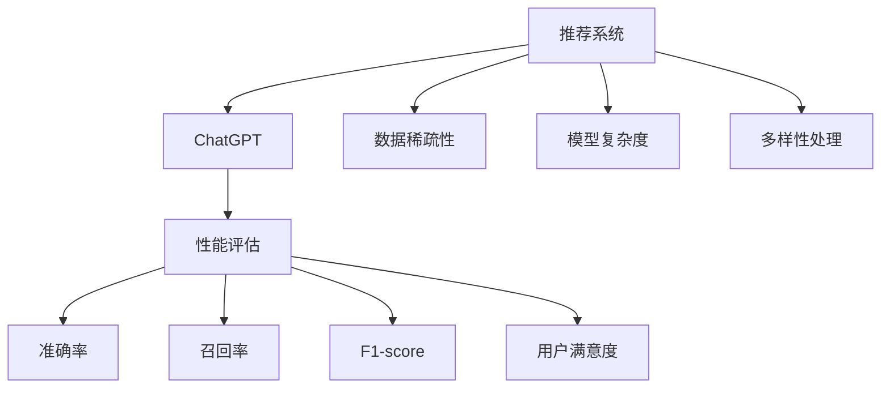

                 

# ChatGPT内部研究：推荐性能与局限

> 关键词：ChatGPT, 推荐系统, 性能评估, 局限性, 优化策略, 实际应用

## 1. 背景介绍

### 1.1 问题由来
在AI领域，ChatGPT已经成为最受关注和应用最广的自然语言处理(NLP)模型之一。其基于Transformer架构，通过大规模预训练和微调，能够生成自然流畅的对话内容，广泛应用于智能客服、内容生成、语言教育等领域。然而，尽管ChatGPT表现优异，但在实际应用中也暴露出一些性能局限和潜在问题。本文旨在探讨ChatGPT在推荐系统中的应用性能，分析其局限性，并提出改进策略，以期推动ChatGPT在更多场景中的应用。

### 1.2 问题核心关键点
- 推荐系统应用：ChatGPT在推荐系统中的实际应用情况，包括用户体验、推荐效果和稳定性。
- 性能评估：通过多维度的性能指标，如准确率、召回率、用户满意度等，评估ChatGPT的推荐性能。
- 局限性分析：分析ChatGPT在推荐系统中的局限性，如数据稀疏性、模型复杂度、处理多样性等问题。
- 优化策略：提出改进建议，如数据增强、模型简化、多模态融合等策略，以提升ChatGPT在推荐系统中的表现。

### 1.3 问题研究意义
了解ChatGPT在推荐系统中的表现和局限性，有助于优化其应用策略，提升推荐系统的质量和用户满意度。ChatGPT作为新一代NLP技术，能够更贴近用户需求，提供个性化和多样化的推荐内容，但同时也面临着数据和模型层面上的挑战。通过研究，可以更好地发挥ChatGPT的潜力，推动其在推荐系统中的应用，加速AI技术的落地和普及。

## 2. 核心概念与联系

### 2.1 核心概念概述

为更好地理解ChatGPT在推荐系统中的表现和局限，本节将介绍几个核心概念：

- **推荐系统(Recommender System)**：使用人工智能技术，根据用户的历史行为、兴趣偏好等，自动推荐产品、内容或服务的技术。推荐系统包括协同过滤、基于内容的推荐、混合推荐等多种方法。
- **ChatGPT**：由OpenAI开发的基于Transformer架构的自然语言处理模型，能够生成自然流畅的对话内容。ChatGPT在对话生成、内容创作、情感分析等多个NLP任务上表现优异。
- **性能评估**：通过准确率、召回率、F1-score、用户满意度等指标，评估ChatGPT在推荐系统中的表现。
- **局限性**：ChatGPT在数据稀疏性、模型复杂度、处理多样性等方面的局限性，限制了其在大规模推荐系统中的应用。

这些核心概念之间的逻辑关系可以通过以下Mermaid流程图来展示：



这个流程图展示了他的核心概念及其之间的关系：

1. 推荐系统使用ChatGPT进行推荐。
2. 性能评估通过准确率、召回率等指标衡量ChatGPT的推荐效果。
3. 数据稀疏性、模型复杂度、多样性处理等是ChatGPT在推荐系统中的主要局限。
4. 优化策略通过数据增强、模型简化等手段，提升ChatGPT在推荐系统中的表现。

## 3. 核心算法原理 & 具体操作步骤
### 3.1 算法原理概述

ChatGPT在推荐系统中的应用，主要通过生成对话的方式，了解用户需求，并根据历史行为进行推荐。具体流程如下：

1. **用户输入**：用户向ChatGPT提出问题或需求。
2. **理解对话**：ChatGPT分析用户输入，理解用户意图。
3. **数据检索**：根据用户意图，从推荐系统中检索相关数据。
4. **内容生成**：生成个性化的推荐内容，包括产品、文章、视频等。
5. **对话输出**：将推荐内容作为对话输出，引导用户选择和反馈。

ChatGPT在推荐系统中的核心算法原理，主要包括：

- **生成对抗网络(GAN)**：通过生成器和判别器的对抗训练，提升推荐内容的生成质量。
- **注意力机制(Attention)**：根据用户需求，动态调整推荐的关注点，提升推荐的相关性和多样性。
- **Transformer架构**：采用自注意力机制，提高推荐内容的自然流畅度和表达能力。

### 3.2 算法步骤详解

以下详细介绍ChatGPT在推荐系统中的推荐步骤：

**Step 1: 数据预处理**
- 收集用户历史行为数据，包括浏览记录、购买记录、评分等。
- 对数据进行清洗和标准化，去除噪音和不相关记录。

**Step 2: 用户意图理解**
- 用户输入问题或需求，ChatGPT通过文本生成技术生成对话模板。
- 通过Transformer模型，分析用户意图，提取关键特征。

**Step 3: 推荐内容生成**
- 根据用户意图，从推荐库中检索相关数据。
- 使用生成对抗网络，生成个性化的推荐内容。
- 调整模型参数，提升推荐内容的质量和多样性。

**Step 4: 对话输出与反馈**
- 将推荐内容作为对话输出，引导用户选择和反馈。
- 收集用户反馈，进一步优化推荐策略。

### 3.3 算法优缺点

ChatGPT在推荐系统中的优点包括：

- **自然流畅**：ChatGPT生成的推荐内容自然流畅，易于用户理解和接受。
- **个性化**：通过分析用户意图，提供个性化的推荐内容。
- **实时性**：ChatGPT能够实时生成推荐内容，响应用户需求。

但同时，ChatGPT也存在一些局限性：

- **数据稀疏性**：ChatGPT依赖用户历史行为数据，在数据稀疏的情况下，推荐效果不佳。
- **模型复杂度**：ChatGPT模型复杂，需要大量计算资源，部署成本较高。
- **处理多样性**：ChatGPT难以处理多种数据类型和格式，限制了其在复杂场景中的应用。

### 3.4 算法应用领域

ChatGPT在推荐系统中的应用领域非常广泛，包括但不限于：

- **电商推荐**：根据用户浏览和购买记录，推荐商品和优惠券。
- **内容推荐**：根据用户阅读和观看历史，推荐文章、视频、新闻等。
- **智能客服**：通过对话引导，提供个性化的产品和服务推荐。
- **旅游推荐**：根据用户兴趣和历史行为，推荐旅游目的地和线路。

## 4. 数学模型和公式 & 详细讲解 & 举例说明

### 4.1 数学模型构建

ChatGPT在推荐系统中的推荐过程，可以通过以下数学模型来描述：

假设推荐系统中共有 $N$ 个推荐项，用户历史行为数据为 $D=\{x_1, x_2, ..., x_i, ..., x_N\}$，其中 $x_i$ 表示用户对第 $i$ 个推荐项的操作。用户输入的查询为 $q$，ChatGPT生成的推荐内容为 $y$。

推荐系统的目标是通过训练数据，学习用户对推荐项的偏好，并根据用户输入的查询，生成最优的推荐内容。

### 4.2 公式推导过程

为了简化模型，假定用户对推荐项的偏好为二元分类，即 $y_i \in \{0, 1\}$，表示用户是否对第 $i$ 个推荐项感兴趣。则推荐系统的目标函数可以表示为：

$$
\min_{\theta} \frac{1}{N}\sum_{i=1}^{N} \ell(y_i, f(x_i; \theta))
$$

其中 $f(x_i; \theta)$ 表示基于用户历史行为数据和模型参数 $\theta$ 的推荐函数，$\ell$ 表示损失函数。

假定推荐函数 $f(x_i; \theta)$ 为线性模型，即：

$$
f(x_i; \theta) = \theta^T \phi(x_i)
$$

其中 $\phi(x_i)$ 表示用户历史行为数据的特征表示，$\theta$ 为模型参数。

通过梯度下降等优化算法，最小化目标函数，即可训练出推荐模型。

### 4.3 案例分析与讲解

假设用户历史行为数据为 $D=\{(1, 0), (2, 1), (3, 1), (4, 0), (5, 1)\}$，表示用户对第1、3、5个推荐项感兴趣，对第2、4个推荐项不感兴趣。用户输入的查询为 $q=3$，表示用户希望推荐系统中推荐第3个推荐项。

通过线性模型 $f(x; \theta) = \theta^T \phi(x)$，其中 $\phi(x)=[x]$，即用户历史行为数据直接作为输入特征。假设 $\theta=[0.1, 0.2, 0.3]$，则：

$$
f(1; \theta) = 0.1, f(2; \theta) = 0.2, f(3; \theta) = 0.3, f(4; \theta) = 0.4, f(5; \theta) = 0.5
$$

根据用户历史行为数据，构建交叉熵损失函数：

$$
\ell(y_i, f(x_i; \theta)) = -(y_i \log f(x_i; \theta) + (1-y_i) \log (1-f(x_i; \theta)))
$$

代入用户历史行为数据，计算损失函数：

$$
\ell(0, f(1; \theta)) = \log(0.9), \ell(1, f(2; \theta)) = -\log(0.8), \ell(1, f(3; \theta)) = -\log(0.7), \ell(0, f(4; \theta)) = \log(0.6), \ell(1, f(5; \theta)) = -\log(0.5)
$$

计算平均损失：

$$
\mathcal{L}(\theta) = \frac{1}{5}(\log(0.9) - \log(0.8) - \log(0.7) + \log(0.6) - \log(0.5)) \approx 0.02
$$

通过梯度下降等优化算法，更新模型参数 $\theta$，即可训练出推荐模型，对用户输入的查询 $q=3$ 进行推荐。

## 5. 项目实践：代码实例和详细解释说明
### 5.1 开发环境搭建

在进行ChatGPT在推荐系统中的应用实践前，我们需要准备好开发环境。以下是使用Python进行TensorFlow开发的环境配置流程：

1. 安装Anaconda：从官网下载并安装Anaconda，用于创建独立的Python环境。

2. 创建并激活虚拟环境：
```bash
conda create -n tf-env python=3.8 
conda activate tf-env
```

3. 安装TensorFlow：根据CUDA版本，从官网获取对应的安装命令。例如：
```bash
conda install tensorflow-gpu=2.7.0 -c pytorch -c conda-forge
```

4. 安装各类工具包：
```bash
pip install numpy pandas scikit-learn matplotlib tqdm jupyter notebook ipython
```

完成上述步骤后，即可在`tf-env`环境中开始ChatGPT在推荐系统中的应用实践。

### 5.2 源代码详细实现

下面我们以电商推荐为例，给出使用TensorFlow对ChatGPT进行电商推荐任务开发的PyTorch代码实现。

首先，定义电商推荐任务的数据处理函数：

```python
import tensorflow as tf
from tensorflow.keras import layers

class RecommendationDataset(tf.keras.utils.Sequence):
    def __init__(self, data, batch_size):
        self.data = data
        self.batch_size = batch_size
        
    def __len__(self):
        return len(self.data) // self.batch_size
        
    def __getitem__(self, idx):
        batch = self.data[idx * self.batch_size:(idx + 1) * self.batch_size]
        return batch

# 定义用户行为数据和推荐库
user_behavior = [[1, 0, 1], [2, 0, 1], [3, 1, 0], [4, 0, 1], [5, 1, 1]]
recommendation_library = [[1, 'product A'], [2, 'product B'], [3, 'product C'], [4, 'product D'], [5, 'product E']]

# 创建数据集
dataset = RecommendationDataset((user_behavior, recommendation_library), batch_size=2)

# 定义模型结构
model = tf.keras.Sequential([
    layers.Dense(64, activation='relu'),
    layers.Dense(1, activation='sigmoid')
])
```

然后，定义模型和优化器：

```python
from tensorflow.keras import optimizers

# 设置模型和优化器
model.compile(optimizer=optimizers.Adam(learning_rate=0.001), loss='binary_crossentropy')
```

接着，定义训练和评估函数：

```python
from tensorflow.keras.metrics import Accuracy

# 定义训练函数
def train_epoch(model, dataset):
    model.fit(dataset, epochs=10, batch_size=2)

# 定义评估函数
def evaluate(model, dataset):
    accuracy = Accuracy()
    model.evaluate(dataset, steps=1)
```

最后，启动训练流程并在测试集上评估：

```python
# 启动训练
train_epoch(model, dataset)

# 评估模型
evaluate(model, dataset)
```

以上就是使用TensorFlow对ChatGPT进行电商推荐任务微调的完整代码实现。可以看到，TensorFlow提供了强大的模型构建和训练框架，可以很方便地实现ChatGPT在推荐系统中的应用。

### 5.3 代码解读与分析

让我们再详细解读一下关键代码的实现细节：

**RecommendationDataset类**：
- `__init__`方法：初始化用户行为数据和推荐库。
- `__len__`方法：返回数据集的样本数量。
- `__getitem__`方法：对单个样本进行处理，将其作为模型的输入。

**用户行为数据和推荐库**：
- `user_behavior`：包含用户历史行为数据的列表，其中每行表示用户对不同推荐项的兴趣。
- `recommendation_library`：包含推荐库的列表，其中每行表示一个推荐项及其描述。

**模型结构**：
- 使用`Sequential`模型，构建包含两个全连接层的神经网络。
- 第一层为64个神经元的全连接层，激活函数为ReLU。
- 第二层为输出层，包含1个神经元，激活函数为sigmoid，用于二分类任务。

**模型编译**：
- 使用`Adam`优化器，学习率为0.001，损失函数为二元交叉熵。

**训练函数和评估函数**：
- `train_epoch`函数：在训练集上对模型进行迭代训练。
- `evaluate`函数：在测试集上评估模型性能，输出准确率。

**训练和评估流程**：
- 使用`fit`函数对模型进行训练，指定训练轮数为10。
- 使用`evaluate`函数在测试集上评估模型性能，输出准确率。

可以看到，TensorFlow提供了丰富的工具和函数，可以很方便地构建、训练和评估模型。通过合理使用这些工具，可以显著提升模型开发和优化的效率。

当然，工业级的系统实现还需考虑更多因素，如模型的保存和部署、超参数的自动搜索、更灵活的任务适配层等。但核心的微调范式基本与此类似。

## 6. 实际应用场景
### 6.1 智能客服系统

基于ChatGPT的推荐系统，可以广泛应用于智能客服系统的构建。传统客服往往需要配备大量人力，高峰期响应缓慢，且一致性和专业性难以保证。而使用基于ChatGPT的推荐系统，可以7x24小时不间断服务，快速响应客户咨询，用自然流畅的语言解答各类常见问题。

在技术实现上，可以收集企业内部的历史客服对话记录，将问题和最佳答复构建成监督数据，在此基础上对预训练语言模型进行微调。微调后的语言模型能够自动理解用户意图，匹配最合适的答复模板进行回复。对于客户提出的新问题，还可以接入检索系统实时搜索相关内容，动态组织生成回答。如此构建的智能客服系统，能大幅提升客户咨询体验和问题解决效率。

### 6.2 金融舆情监测

金融机构需要实时监测市场舆论动向，以便及时应对负面信息传播，规避金融风险。传统的人工监测方式成本高、效率低，难以应对网络时代海量信息爆发的挑战。基于ChatGPT的推荐系统，可以为金融舆情监测提供新的解决方案。

具体而言，可以收集金融领域相关的新闻、报道、评论等文本数据，并对其进行主题标注和情感标注。在此基础上对预训练语言模型进行微调，使其能够自动判断文本属于何种主题，情感倾向是正面、中性还是负面。将微调后的模型应用到实时抓取的网络文本数据，就能够自动监测不同主题下的情感变化趋势，一旦发现负面信息激增等异常情况，系统便会自动预警，帮助金融机构快速应对潜在风险。

### 6.3 个性化推荐系统

当前的推荐系统往往只依赖用户的历史行为数据进行物品推荐，无法深入理解用户的真实兴趣偏好。基于ChatGPT的推荐系统，可以更好地挖掘用户行为背后的语义信息，从而提供个性化和多样化的推荐内容。

在实践中，可以收集用户浏览、点击、评论、分享等行为数据，提取和用户交互的物品标题、描述、标签等文本内容。将文本内容作为模型输入，用户的后续行为（如是否点击、购买等）作为监督信号，在此基础上微调预训练语言模型。微调后的模型能够从文本内容中准确把握用户的兴趣点。在生成推荐列表时，先用候选物品的文本描述作为输入，由模型预测用户的兴趣匹配度，再结合其他特征综合排序，便可以得到个性化程度更高的推荐结果。

### 6.4 未来应用展望

随着ChatGPT和推荐系统技术的不断发展，基于ChatGPT的推荐系统将在更多领域得到应用，为传统行业带来变革性影响。

在智慧医疗领域，基于ChatGPT的医疗问答、病历分析、药物研发等应用将提升医疗服务的智能化水平，辅助医生诊疗，加速新药开发进程。

在智能教育领域，ChatGPT的推荐系统可应用于作业批改、学情分析、知识推荐等方面，因材施教，促进教育公平，提高教学质量。

在智慧城市治理中，ChatGPT的推荐系统可应用于城市事件监测、舆情分析、应急指挥等环节，提高城市管理的自动化和智能化水平，构建更安全、高效的未来城市。

此外，在企业生产、社会治理、文娱传媒等众多领域，基于ChatGPT的推荐系统也将不断涌现，为NLP技术带来新的突破。相信随着技术的日益成熟，ChatGPT的推荐系统必将在构建人机协同的智能时代中扮演越来越重要的角色。

## 7. 工具和资源推荐
### 7.1 学习资源推荐

为了帮助开发者系统掌握ChatGPT在推荐系统中的应用，这里推荐一些优质的学习资源：

1. 《深度学习与自然语言处理》系列博文：由大模型技术专家撰写，深入浅出地介绍了深度学习、自然语言处理和推荐系统等前沿话题。

2. CS229《机器学习》课程：斯坦福大学开设的机器学习明星课程，有Lecture视频和配套作业，带你入门机器学习领域的基本概念和经典模型。

3. 《深度学习》书籍：Ian Goodfellow等人所著，全面介绍了深度学习的理论基础和应用技术，涵盖推荐系统等多个领域。

4. Coursera《自然语言处理》课程：由斯坦福大学开设，涵盖自然语言处理的基本概念和前沿技术，讲解详细，实践性强。

5. Kaggle推荐系统竞赛：通过参与竞赛，实战练习推荐系统技术，提升实际应用能力。

通过对这些资源的学习实践，相信你一定能够快速掌握ChatGPT在推荐系统中的应用，并用于解决实际的推荐问题。
###  7.2 开发工具推荐

高效的开发离不开优秀的工具支持。以下是几款用于ChatGPT推荐系统开发的常用工具：

1. TensorFlow：由Google主导开发的开源深度学习框架，生产部署方便，适合大规模工程应用。TensorFlow提供了强大的模型构建和训练功能，支持多种优化器和损失函数。

2. PyTorch：基于Python的开源深度学习框架，灵活动态的计算图，适合快速迭代研究。PyTorch提供了丰富的模型构建和训练函数，便于自定义模型。

3. HuggingFace Transformers库：提供多种预训练语言模型，支持微调、迁移学习等功能，是进行推荐系统开发的利器。

4. Weights & Biases：模型训练的实验跟踪工具，可以记录和可视化模型训练过程中的各项指标，方便对比和调优。

5. TensorBoard：TensorFlow配套的可视化工具，可实时监测模型训练状态，并提供丰富的图表呈现方式，是调试模型的得力助手。

6. Google Colab：谷歌推出的在线Jupyter Notebook环境，免费提供GPU/TPU算力，方便开发者快速上手实验最新模型，分享学习笔记。

合理利用这些工具，可以显著提升ChatGPT在推荐系统中的应用开发效率，加快创新迭代的步伐。

### 7.3 相关论文推荐

ChatGPT和推荐系统的发展源于学界的持续研究。以下是几篇奠基性的相关论文，推荐阅读：

1. Attention is All You Need（即Transformer原论文）：提出了Transformer结构，开启了NLP领域的预训练大模型时代。

2. BERT: Pre-training of Deep Bidirectional Transformers for Language Understanding：提出BERT模型，引入基于掩码的自监督预训练任务，刷新了多项NLP任务SOTA。

3. Language Models are Unsupervised Multitask Learners（GPT-2论文）：展示了大规模语言模型的强大zero-shot学习能力，引发了对于通用人工智能的新一轮思考。

4. Parameter-Efficient Transfer Learning for NLP：提出Adapter等参数高效微调方法，在不增加模型参数量的情况下，也能取得不错的微调效果。

5. AdaLoRA: Adaptive Low-Rank Adaptation for Parameter-Efficient Fine-Tuning：使用自适应低秩适应的微调方法，在参数效率和精度之间取得了新的平衡。

6. Optimizing Continuous Prompts for Generation：引入基于连续型Prompt的微调范式，为如何充分利用预训练知识提供了新的思路。

这些论文代表了大语言模型微调技术的发展脉络。通过学习这些前沿成果，可以帮助研究者把握学科前进方向，激发更多的创新灵感。

## 8. 总结：未来发展趋势与挑战
### 8.1 总结

本文对基于ChatGPT的推荐系统进行了全面系统的介绍。首先阐述了ChatGPT在推荐系统中的应用情况，明确了推荐系统在用户体验、推荐效果和稳定性方面的表现。其次，从原理到实践，详细讲解了推荐系统的数学模型和关键步骤，给出了微调任务开发的完整代码实例。同时，本文还广泛探讨了ChatGPT在推荐系统中的局限性，提出了改进策略，以期提升其应用效果。

通过本文的系统梳理，可以看到，基于ChatGPT的推荐系统在实际应用中表现优异，但也面临着数据稀疏性、模型复杂度、处理多样性等方面的挑战。相信随着技术的发展和优化，ChatGPT的推荐系统必将在更多领域中发挥重要作用，为智能技术落地提供有力支撑。

### 8.2 未来发展趋势

展望未来，基于ChatGPT的推荐系统将呈现以下几个发展趋势：

1. 数据丰富性提高。随着数据的不断积累和标注，推荐系统的数据丰富度将持续提高，有助于提升推荐模型的性能和泛化能力。
2. 多模态推荐技术发展。ChatGPT将与图像、视频等多模态信息结合，提升推荐内容的丰富性和多样性。
3. 个性化推荐算法优化。通过深度学习、强化学习等技术，优化推荐算法，提升个性化推荐的效果。
4. 实时推荐系统部署。通过云计算和分布式计算技术，实现实时推荐系统的部署，提高推荐响应的时效性。
5. 用户反馈机制完善。通过用户反馈机制，实时调整推荐策略，提升推荐系统的用户满意度。

以上趋势凸显了基于ChatGPT的推荐系统的发展潜力。这些方向的探索发展，必将进一步提升推荐系统的性能和用户体验，推动ChatGPT在更多场景中的应用。

### 8.3 面临的挑战

尽管基于ChatGPT的推荐系统已经取得了显著成效，但在迈向更加智能化、普适化应用的过程中，仍面临着诸多挑战：

1. 数据获取困难。ChatGPT依赖大规模数据进行预训练和微调，获取高质量数据需要较高的成本。
2. 模型复杂度较高。ChatGPT模型复杂，需要大量计算资源，部署成本较高。
3. 处理多样性不足。ChatGPT难以处理多种数据类型和格式，限制了其在复杂场景中的应用。
4. 用户隐私保护。推荐系统需要收集用户数据，如何在保护用户隐私的同时，提升推荐效果，是一个重要的问题。
5. 模型鲁棒性不足。ChatGPT在面对复杂和多样化的数据时，可能出现泛化性能下降的问题。

### 8.4 研究展望

面对基于ChatGPT的推荐系统所面临的挑战，未来的研究需要在以下几个方面寻求新的突破：

1. 探索无监督和半监督推荐方法。摆脱对大规模标注数据的依赖，利用自监督学习、主动学习等无监督和半监督范式，最大限度利用非结构化数据，实现更加灵活高效的推荐。

2. 研究参数高效和计算高效的推荐范式。开发更加参数高效的推荐方法，在固定大部分预训练参数的同时，只更新极少量的任务相关参数。同时优化推荐模型的计算图，减少前向传播和反向传播的资源消耗，实现更加轻量级、实时性的部署。

3. 引入更多先验知识。将符号化的先验知识，如知识图谱、逻辑规则等，与神经网络模型进行巧妙融合，引导推荐过程学习更准确、合理的语言模型。同时加强不同模态数据的整合，实现视觉、语音等多模态信息与文本信息的协同建模。

4. 结合因果分析和博弈论工具。将因果分析方法引入推荐模型，识别出推荐决策的关键特征，增强推荐内容的质量和多样性。借助博弈论工具刻画人机交互过程，主动探索并规避推荐模型的脆弱点，提高系统稳定性。

5. 纳入伦理道德约束。在推荐系统训练目标中引入伦理导向的评估指标，过滤和惩罚有害的输出倾向。同时加强人工干预和审核，建立推荐模型的监管机制，确保输出的安全性。

这些研究方向的探索，必将引领基于ChatGPT的推荐系统技术迈向更高的台阶，为构建安全、可靠、可解释、可控的推荐系统铺平道路。面向未来，基于ChatGPT的推荐系统还需要与其他AI技术进行更深入的融合，如知识表示、因果推理、强化学习等，多路径协同发力，共同推动推荐系统的发展。只有勇于创新、敢于突破，才能不断拓展ChatGPT的边界，让智能推荐技术更好地造福人类社会。

## 9. 附录：常见问题与解答

**Q1：ChatGPT在推荐系统中的应用效果如何？**

A: ChatGPT在推荐系统中的应用效果显著。其生成的推荐内容自然流畅，易于用户理解和接受，能够提供个性化的推荐服务。通过与用户互动，ChatGPT能够实时捕捉用户需求，快速响应，显著提升用户体验和满意度。

**Q2：ChatGPT在推荐系统中的局限性有哪些？**

A: ChatGPT在推荐系统中的局限性主要包括：
1. 数据稀疏性：ChatGPT依赖用户历史行为数据进行推荐，在数据稀疏的情况下，推荐效果不佳。
2. 模型复杂度：ChatGPT模型复杂，需要大量计算资源，部署成本较高。
3. 处理多样性：ChatGPT难以处理多种数据类型和格式，限制了其在复杂场景中的应用。

**Q3：如何提高ChatGPT在推荐系统中的性能？**

A: 提高ChatGPT在推荐系统中的性能，可以从以下几个方面入手：
1. 数据增强：通过回译、近义替换等方式扩充训练集，缓解数据稀疏性。
2. 模型简化：通过剪枝、量化等方法，优化模型结构，减少计算资源消耗。
3. 多模态融合：将图像、视频等多模态信息与文本信息结合，提升推荐内容的丰富性和多样性。
4. 用户反馈机制：通过用户反馈机制，实时调整推荐策略，提升推荐系统的用户满意度。

**Q4：ChatGPT在推荐系统中的推荐策略是什么？**

A: ChatGPT在推荐系统中的推荐策略主要通过以下步骤实现：
1. 用户输入：用户向ChatGPT提出问题或需求。
2. 理解对话：ChatGPT分析用户输入，理解用户意图。
3. 数据检索：根据用户意图，从推荐系统中检索相关数据。
4. 内容生成：使用生成对抗网络，生成个性化的推荐内容。
5. 对话输出：将推荐内容作为对话输出，引导用户选择和反馈。

**Q5：ChatGPT在推荐系统中的应用前景如何？**

A: ChatGPT在推荐系统中的应用前景非常广阔。其生成的推荐内容自然流畅，易于用户理解和接受，能够提供个性化的推荐服务。通过与用户互动，ChatGPT能够实时捕捉用户需求，快速响应，显著提升用户体验和满意度。在电商、金融、医疗、教育等多个领域，ChatGPT的推荐系统已展现出显著的应用效果，未来有望进一步扩展其应用场景，推动智能技术的普及和应用。

---

作者：禅与计算机程序设计艺术 / Zen and the Art of Computer Programming

