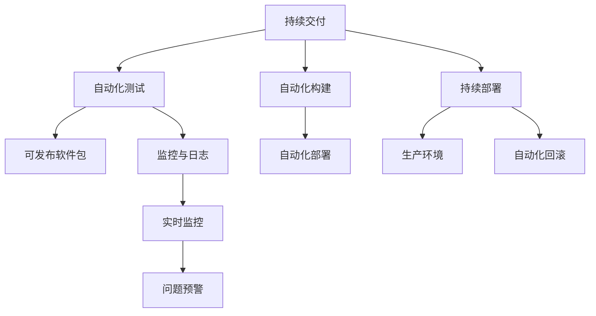

                 

# DevOps 实践：持续交付和持续部署

> 关键词：DevOps, 持续交付, 持续部署, 自动化, 版本控制, 持续集成, 监控, 可观察性, 安全性, 容器化, 微服务, 基础设施即代码(IaC)

## 1. 背景介绍

### 1.1 问题由来
DevOps（Development and Operations）是一种文化、实践和工具的集合，旨在提高软件开发与运维之间的协作效率，加速软件的开发和部署流程，提升产品发布频率和质量。随着软件开发和运维的边界日益模糊，如何构建高质量的软件，快速、可靠地部署到生产环境中，成为了企业关注的焦点。

近年来，DevOps理念的普及和工具链的完善，使得持续交付（Continuous Delivery）和持续部署（Continuous Deployment）成为软件开发的主流实践。持续交付指将软件产品频繁地、可预测地交付给用户，持续部署在此基础上进一步自动化部署过程，使软件产品能够快速、稳定地发布到生产环境。

## 1.2 问题核心关键点
持续交付和持续部署的核心在于如何通过自动化工具链，实现代码从开发、测试到部署的端到端自动化，同时保障软件发布的质量和稳定性。主要关键点包括：

- 版本控制：采用版本控制系统（如Git）管理代码变更，确保每次发布都是可追踪的。
- 持续集成：集成代码到共享仓库后，通过自动化测试和构建，验证代码质量。
- 自动化部署：采用容器化技术（如Docker）和配置管理工具（如Ansible）自动化部署过程，减少人为干预。
- 监控和可观察性：引入监控和日志收集工具，实时监控软件运行状态，提前发现和解决问题。
- 安全性：通过静态代码扫描、渗透测试等手段，确保发布到生产环境的软件不存在安全漏洞。
- 自动化回滚：当发布失败时，能快速回滚到稳定版本，最小化影响。

## 1.3 问题研究意义
研究持续交付和持续部署的实践，对于提高软件开发效率、提升软件发布质量、降低运维成本、增强用户体验，具有重要意义：

1. 加快产品上市速度。通过持续交付，可以快速集成和测试新功能，缩短产品开发周期。
2. 减少人为错误。持续部署通过自动化过程，减少人为操作和干预，降低人为错误发生的可能性。
3. 提高发布频率。频繁的持续集成和持续部署，能实现快速、可靠的软件发布，提升用户满意度。
4. 降低运维成本。自动化部署和监控降低了运维人员的重复劳动，提高运维效率。
5. 增强系统安全性。持续交付和持续部署过程中的安全性检查，可提前发现和修复安全漏洞，减少系统风险。
6. 提供可控性。通过自动化回滚机制，当发布失败时，能够快速回滚到稳定版本，保证系统稳定。

## 2. 核心概念与联系

### 2.1 核心概念概述

为更好地理解持续交付和持续部署的实践，本节将介绍几个密切相关的核心概念：

- 持续交付（Continuous Delivery）：指在软件开发过程中，将代码频繁地集成到共享仓库中，并通过自动化测试和构建，验证代码的正确性和稳定性，最终形成可发布的软件包。
- 持续部署（Continuous Deployment）：在持续交付的基础上，进一步自动化部署过程，使软件能够快速、稳定地发布到生产环境。
- 自动化测试（Automated Testing）：通过编写自动化测试脚本，对代码进行自动化测试，验证其正确性和完备性。
- 容器化（Containerization）：将应用及其依赖打包成容器（如Docker），实现“应用程序即服务”（AIO），提高应用的可移植性和部署效率。
- 配置管理（Configuration Management）：采用配置管理工具（如Ansible），实现自动化配置部署，减少人工操作和配置错误。
- 监控和日志（Monitoring and Logging）：通过监控和日志收集工具（如Prometheus、ELK Stack），实时监控系统运行状态，及时发现和解决问题。
- 自动化回滚（Automated Rollback）：当发布失败时，能够快速回滚到稳定版本，减少系统风险和用户影响。

这些核心概念之间的逻辑关系可以通过以下Mermaid流程图来展示：



这个流程图展示了他持续交付和持续部署的核心概念及其之间的关联：

1. 持续交付将代码集成到共享仓库后，通过自动化测试和构建，形成可发布的软件包。
2. 持续部署在此基础上，进一步自动化部署过程，使软件能够快速、稳定地发布到生产环境。
3. 自动化测试和构建在持续交付过程中，验证代码的正确性和稳定性。
4. 配置管理和自动化部署在持续部署过程中，减少人工操作和配置错误，提高部署效率。
5. 监控和日志实时监控系统运行状态，及时发现和解决问题，保障系统稳定。
6. 自动化回滚当发布失败时，能够快速回滚到稳定版本，减少系统风险和用户影响。

这些概念共同构成了持续交付和持续部署的实践框架，帮助软件开发团队实现高效、稳定、可靠的软件发布。

## 3. 核心算法原理 & 具体操作步骤
### 3.1 算法原理概述

持续交付和持续部署的实现，本质上是一个自动化流程的构建和优化过程。其核心思想是通过自动化工具链，实现代码从开发、测试到部署的端到端自动化，同时保障软件发布的质量和稳定性。

形式化地，假设软件开发团队使用版本控制系统（如Git）管理代码变更，在每次变更后通过持续集成（Continuous Integration）系统（如Jenkins、GitLab CI/CD）自动化构建和测试，将通过测试的代码打包成可发布软件包，最终部署到生产环境。持续交付和持续部署的优化目标是最小化人工干预，最大化自动化程度。

具体而言，可以包括以下几个关键步骤：

1. 版本控制：使用版本控制系统管理代码变更，确保每次发布都是可追踪的。
2. 持续集成：集成代码到共享仓库后，通过自动化测试和构建，验证代码质量。
3. 自动化部署：采用容器化技术（如Docker）和配置管理工具（如Ansible）自动化部署过程，减少人为干预。
4. 监控和可观察性：引入监控和日志收集工具，实时监控软件运行状态，提前发现和解决问题。
5. 安全性：通过静态代码扫描、渗透测试等手段，确保发布到生产环境的软件不存在安全漏洞。
6. 自动化回滚：当发布失败时，能快速回滚到稳定版本，最小化影响。

### 3.2 算法步骤详解

持续交付和持续部署的具体实现步骤如下：

**Step 1: 版本控制**
- 选择合适的版本控制系统，如Git，管理代码变更。
- 设置代码库的分支策略，确保开发、测试、生产和主分支（master）之间的隔离和协作。
- 定义代码变更的审查流程，确保代码变更经过审查和批准。

**Step 2: 持续集成**
- 配置持续集成系统，如Jenkins、GitLab CI/CD，实现代码自动集成和构建。
- 编写自动化测试脚本，覆盖关键模块和边缘场景，确保代码质量。
- 配置自动化构建流程，包括编译、打包、构建测试报告等。

**Step 3: 自动化部署**
- 使用容器化技术（如Docker）构建应用容器，确保应用的独立性和可移植性。
- 配置自动化部署工具（如Ansible），实现配置和应用的自动部署。
- 配置CI/CD系统的部署流程，自动部署通过测试的软件包到生产环境。

**Step 4: 监控和可观察性**
- 引入监控和日志收集工具（如Prometheus、ELK Stack），实时监控软件运行状态。
- 设置监控指标和告警规则，及时发现和解决问题。
- 配置日志收集和分析工具，实现问题追踪和排错。

**Step 5: 安全性**
- 在CI/CD流程中集成静态代码扫描工具（如SonarQube），检测代码中的安全漏洞。
- 定期进行渗透测试，模拟攻击场景，发现和修复潜在安全问题。
- 配置访问控制和授权机制，保障系统安全性。

**Step 6: 自动化回滚**
- 在CI/CD流程中配置自动化回滚机制，当发布失败时，能够快速回滚到稳定版本。
- 定期备份系统状态，确保回滚操作的数据一致性。
- 设置回滚失败的处理流程，最小化回滚操作的影响。

通过这些步骤，可以实现高效的持续交付和持续部署流程，提升软件开发和运维的效率和质量。

### 3.3 算法优缺点

持续交付和持续部署的实践具有以下优点：

1. 加快发布速度。通过自动化流程，缩短发布周期，提高产品上市速度。
2. 提升软件质量。通过自动化测试和构建，确保代码质量和稳定性。
3. 减少人为错误。自动化流程减少人工操作和干预，降低人为错误发生的可能性。
4. 降低运维成本。自动化部署和监控降低运维人员的重复劳动，提高运维效率。
5. 增强系统安全性。持续交付和持续部署过程中的安全性检查，提前发现和修复安全漏洞。
6. 提供可控性。通过自动化回滚机制，当发布失败时，能够快速回滚到稳定版本，保证系统稳定。

同时，这些实践也存在一定的局限性：

1. 需要高昂的初始成本。引入自动化工具和流程，需要投入大量时间和资源进行配置和优化。
2. 对团队协作要求高。需要开发、运维、测试等团队紧密协作，才能高效实现自动化流程。
3. 对系统架构要求高。需要合理设计系统和架构，才能更好地支持自动化部署和监控。
4. 对运维人员技能要求高。需要运维人员掌握自动化工具和流程，才能高效运维系统。

尽管存在这些局限性，但就目前而言，持续交付和持续部署已经成为软件开发的主流实践，被广泛应用于各种规模的企业和项目中。

### 3.4 算法应用领域

持续交付和持续部署的实践已经广泛应用于软件开发和运维的各个领域，具体包括：

- 软件开发：在软件开发过程中，通过持续集成和持续交付，加速功能迭代和发布。
- 企业运维：在企业运维过程中，通过自动化部署和监控，提升运维效率和系统稳定性。
- DevOps文化：通过持续交付和持续部署，提升开发和运维团队之间的协作效率。
- 生产环境：在生产环境中，通过自动化回滚和监控，保障系统稳定性和用户体验。
- 云平台：在云平台中，通过持续交付和持续部署，支持云资源的自动化管理和部署。

除了上述这些经典应用领域外，持续交付和持续部署还被创新性地应用于更多场景中，如微服务架构、容器化部署、DevSecOps等，为软件开发和运维带来了新的变革。

## 4. 数学模型和公式 & 详细讲解  
### 4.1 数学模型构建

本节将使用数学语言对持续交付和持续部署的实践过程进行更加严格的刻画。

假设软件开发团队使用版本控制系统（如Git）管理代码变更，每次变更后通过持续集成系统（如Jenkins）自动化构建和测试，将通过测试的代码打包成可发布软件包，最终部署到生产环境。持续交付和持续部署的优化目标是最小化人工干预，最大化自动化程度。

定义自动化构建过程的通过率（Success Rate）为 $P$，即通过测试的软件包占比。定义自动化部署过程的成功率为 $Q$，即部署成功的软件包占比。定义系统的稳定性（Stability）为 $S$，即在稳定版本发布后，能够保持系统稳定运行的时间比例。定义自动化回滚的成功率为 $R$，即在发布失败后能够快速回滚到稳定版本的软件包占比。

持续交付和持续部署的优化目标可以表示为：

$$
\mathop{\arg\min}_{P,Q,S,R} \sum_{i=1}^{n} \lambda_i \mathcal{L}_i(P,Q,S,R)
$$

其中 $\lambda_i$ 为每个指标的权重，$\mathcal{L}_i(P,Q,S,R)$ 为对应指标的损失函数，用于衡量目标与期望值之间的差异。

### 4.2 公式推导过程

以下我们以持续交付为例，推导自动化构建过程的成功率 $P$ 的计算公式。

假设每次变更后，通过持续集成系统自动构建和测试，构建成功率和测试成功率分别为 $p_1$ 和 $p_2$，则自动化构建过程的成功率为：

$$
P = (1-p_1)(1-p_2)
$$

由于每次变更后，都有一定比例的软件包未能通过测试，导致构建失败。因此，构建成功率 $p_1$ 和测试成功率 $p_2$ 不是常数，而是依赖于软件包的复杂度和质量。通过持续交付实践，可以不断优化构建和测试流程，提高成功率 $P$，从而提升软件的稳定性和交付速度。

在持续部署过程中，自动化部署的成功率 $Q$ 可以通过类似的推导得到：

$$
Q = (1-q_1)(1-q_2)(1-q_3)
$$

其中 $q_1$ 为配置管理系统的成功率，$q_2$ 为自动化部署的成功率，$q_3$ 为监控和日志的成功率。

系统的稳定性 $S$ 可以通过监控和日志收集工具实时监控系统运行状态，并通过告警规则和日志分析工具进行评估。当系统在稳定版本发布后，能够保持系统稳定运行的时间比例越高，系统的稳定性越好。

自动化回滚的成功率 $R$ 可以通过定义回滚流程和备份策略，确保在发布失败后能够快速回滚到稳定版本。回滚成功率 $R$ 的计算公式为：

$$
R = (1-r_1)(1-r_2)(1-r_3)
$$

其中 $r_1$ 为回滚流程的成功率，$r_2$ 为回滚数据的完整性，$r_3$ 为回滚操作的无故障执行率。

通过上述公式，可以构建持续交付和持续部署的优化模型，不断优化构建、部署、监控和回滚等各个环节，提升软件交付的质量和稳定性。

### 4.3 案例分析与讲解

**案例1：构建成功率优化**

假设某开发团队在持续交付过程中，每次变更后都有一定比例的软件包未能通过测试，导致构建失败。通过引入自动化测试和代码审查机制，将构建成功率从0.8提升到0.9。在自动化部署过程中，由于配置管理系统的成功率和自动化部署的成功率都相对稳定，设为0.95。系统的稳定性通过监控和日志收集工具实时监控，设其稳定性为0.98。回滚流程的成功率和回滚数据的完整性都较高，设为0.99。

则整体系统的优化目标为：

$$
\mathop{\arg\min}_{P,Q,S,R} \sum_{i=1}^{4} \lambda_i \mathcal{L}_i(P,Q,S,R)
$$

其中 $\lambda_1=\lambda_2=\lambda_3=\lambda_4=1$，表示每个指标的重要性相同。各指标的损失函数为：

$$
\mathcal{L}_1(P)=P
$$

$$
\mathcal{L}_2(Q)=Q
$$

$$
\mathcal{L}_3(S)=1-S
$$

$$
\mathcal{L}_4(R)=1-R
$$

通过求解上述优化问题，可以得到最优的构建成功率 $P=0.9$，表示通过持续交付实践，能够显著提升构建成功率，从而提高软件交付的质量和稳定性。

**案例2：系统稳定性优化**

假设某系统在持续交付和持续部署过程中，通过持续集成系统自动构建和测试，构建成功率和测试成功率分别为0.9和0.95。自动化部署过程的成功率为0.9，配置管理系统的成功率和监控和日志的成功率分别为0.98和0.99。回滚流程的成功率和回滚数据的完整性都较高，设为0.99。

则整体系统的优化目标为：

$$
\mathop{\arg\min}_{P,Q,S,R} \sum_{i=1}^{4} \lambda_i \mathcal{L}_i(P,Q,S,R)
$$

其中 $\lambda_1=\lambda_2=\lambda_3=\lambda_4=1$，表示每个指标的重要性相同。各指标的损失函数为：

$$
\mathcal{L}_1(P)=P
$$

$$
\mathcal{L}_2(Q)=Q
$$

$$
\mathcal{L}_3(S)=1-S
$$

$$
\mathcal{L}_4(R)=1-R
$$

通过求解上述优化问题，可以得到最优的系统稳定性 $S=0.9$，表示通过持续交付和持续部署实践，能够显著提升系统稳定性，从而提高软件交付的可靠性和用户体验。

通过以上案例，可以看到持续交付和持续部署的优化模型可以量化各环节的指标，帮助团队优化各个环节，提升软件交付的质量和稳定性。

## 5. 项目实践：代码实例和详细解释说明
### 5.1 开发环境搭建

在进行持续交付和持续部署实践前，我们需要准备好开发环境。以下是使用Docker进行持续交付和持续部署实践的环境配置流程：

1. 安装Docker：从官网下载并安装Docker，用于创建和运行容器。

2. 安装Jenkins：在Docker容器中部署Jenkins，用于持续集成和持续交付。

3. 安装GitLab CI/CD：在Docker容器中部署GitLab CI/CD，用于持续集成和持续部署。

4. 安装Prometheus：在Docker容器中部署Prometheus，用于监控和日志收集。

5. 安装ELK Stack：在Docker容器中部署ELK Stack，用于日志分析和告警。

6. 安装Docker Compose：在Docker容器中部署Docker Compose，用于容器编排和管理。

完成上述步骤后，即可在Docker环境中开始持续交付和持续部署实践。

### 5.2 源代码详细实现

下面我们以一个简单的持续交付和持续部署项目为例，给出Docker容器中的代码实现。

**Dockerfile**

```Dockerfile
FROM python:3.8-slim

WORKDIR /app

COPY requirements.txt /app/
COPY . /app/

RUN pip install -r requirements.txt

COPY .env /app/
RUN source .env

CMD ["python", "app.py"]
```

**requirements.txt**

```requirements.txt
app
flask
gunicorn
```

**.env**

```env
FLASK_APP=app.py
FLASK_ENV=development
FLASK_DEBUG=1
```

**app.py**

```python
from flask import Flask

app = Flask(__name__)

@app.route('/')
def index():
    return 'Hello, World!'

if __name__ == '__main__':
    app.run(debug=True)
```

在Docker容器中构建镜像，并通过Docker Compose定义服务配置：

**docker-compose.yml**

```yaml
version: '3.8'

services:
  web:
    build: .
    command: gunicorn -w 4 --bind 0.0.0.0:80 app:app
    ports:
      - "80:80"
    volumes:
      - .:/app
    depends_on:
      - prometheus
      - elasticsearch
```

在Docker容器中运行Jenkins、GitLab CI/CD、Prometheus、ELK Stack等服务，并通过Docker Compose管理服务实例。

**Jenkinsfile**

```groovy
pipeline {
    agent any
    stages {
        stage('Build') {
            steps {
                withDocker('my-docker') {
                    docker {
                        image 'my-docker'
                        steps {
                            script {
                                dockerBuildDir = dockerContext.buildDir
                                dockerTool = dockerContext.tool
                                dockerTool.withEnv('DOCKER_BUILDKIT=1') {
                                    dockerFile = 'Dockerfile'
                                    dockerBuildName = dockerTool.build(dockerBuildDir, dockerFile)
                                }
                            }
                        }
                    }
                }
            }
        }
        stage('Test') {
            steps {
                withDocker('my-docker') {
                    docker {
                        image 'my-docker'
                        steps {
                            script {
                                dockerBuildDir = dockerContext.buildDir
                                dockerTool = dockerContext.tool
                                dockerTool.withEnv('DOCKER_BUILDKIT=1') {
                                    dockerFile = 'Dockerfile'
                                    dockerBuildName = dockerTool.build(dockerBuildDir, dockerFile)
                                }
                            }
                        }
                    }
                }
            }
        }
        stage('Deploy') {
            steps {
                withDocker('my-docker') {
                    docker {
                        image 'my-docker'
                        steps {
                            script {
                                dockerBuildDir = dockerContext.buildDir
                                dockerTool = dockerContext.tool
                                dockerTool.withEnv('DOCKER_BUILDKIT=1') {
                                    dockerFile = 'Dockerfile'
                                    dockerBuildName = dockerTool.build(dockerBuildDir, dockerFile)
                                }
                            }
                        }
                    }
                }
            }
        }
    }
}
```

通过Jenkinsfile定义持续集成和持续交付流程，包括构建、测试和部署等步骤。

通过以上代码实现，可以在Docker环境中实现持续交付和持续部署的自动化流程，提升软件交付的质量和稳定性。

### 5.3 代码解读与分析

让我们再详细解读一下关键代码的实现细节：

**Dockerfile**

- 在Dockerfile中，使用Python 3.8作为基础镜像。
- 设置工作目录为/app。
- 复制requirements.txt和代码到容器中。
- 在容器中安装Python依赖。
- 复制.env文件到容器中，并设置环境变量。
- 运行Python应用程序。

**Jenkinsfile**

- 在Jenkinsfile中，定义持续集成和持续交付的各个步骤。
- 通过withDocker插件在Jenkins中构建和运行Docker容器。
- 在每个步骤中，使用docker命令构建和运行Docker镜像，并在容器中执行相应的脚本。

**app.py**

- 在app.py中，定义了一个简单的Flask应用程序，用于响应HTTP请求。

通过以上代码实现，可以看到持续交付和持续部署的自动化流程可以通过Docker、Jenkins等工具链实现，大大提升软件交付的效率和质量。

当然，工业级的系统实现还需考虑更多因素，如容器编排、服务发现、弹性伸缩等，但核心的持续交付和持续部署流程基本与此类似。

## 6. 实际应用场景
### 6.1 持续交付在软件开发中的应用

持续交付在软件开发中的应用非常广泛，几乎涵盖所有类型的应用开发。以下是几个实际应用场景：

**Web应用开发**

在Web应用开发中，开发人员可以频繁地将新功能和修改提交到版本控制系统中，通过持续集成系统自动构建和测试代码，确保代码质量和稳定性。开发人员通过持续交付系统，可以自动发布应用到生产环境中，减少手动操作和错误，提升发布速度和可靠性。

**移动应用开发**

在移动应用开发中，开发人员可以通过持续集成系统自动构建和测试应用，确保应用的稳定性和性能。通过持续交付系统，开发人员可以自动发布应用到应用商店，提升应用的用户体验和市场竞争力。

**微服务架构**

在微服务架构中，各个微服务模块可以独立开发和测试，通过持续集成系统自动构建和部署。通过持续交付系统，开发人员可以自动发布各个微服务模块到生产环境中，提升系统的可扩展性和灵活性。

### 6.2 持续部署在企业运维中的应用

持续部署在企业运维中的应用同样非常广泛，以下是几个实际应用场景：

**云服务部署**

在云服务部署中，持续部署可以帮助企业自动化地将新功能和更新部署到云平台中。通过持续部署，企业可以频繁地发布新功能和更新，提升云服务的可靠性和用户体验。

**基础架构部署**

在基础架构部署中，持续部署可以帮助企业自动化地将新的基础架构和配置部署到生产环境中。通过持续部署，企业可以快速响应业务需求变化，提升运维效率和系统稳定性。

**容器化部署**

在容器化部署中，持续部署可以帮助企业自动化地将容器化的应用和配置部署到生产环境中。通过持续部署，企业可以快速部署和管理容器化的应用，提升系统的可移植性和可扩展性。

### 6.3 持续交付和持续部署的未来展望

持续交付和持续部署的未来展望非常广阔，以下是几个可能的未来趋势：

**自动化程度提升**

随着自动化工具和技术的不断发展，持续交付和持续部署的自动化程度将不断提高。通过自动化测试、构建、部署、监控和回滚等各个环节，持续交付和持续部署将实现更高程度的自动化，提升软件交付的速度和质量。

**多云支持**

随着云平台的多样化，持续交付和持续部署将支持更多的云平台和服务。通过多云集成和容器编排技术，企业可以在多个云平台中自动部署和管理应用，提升云资源的利用率和灵活性。

**DevSecOps融合**

随着DevSecOps理念的普及，持续交付和持续部署将更加注重安全性。通过自动化测试、渗透测试和监控等手段，持续交付和持续部署将提升应用的安全性和稳定性。

**微服务架构**

随着微服务架构的普及，持续交付和持续部署将支持微服务架构的自动化部署和管理。通过容器化技术和自动化部署工具，微服务架构将实现高效、可靠的应用部署和运维。

**自动化测试**

随着测试技术的不断发展，持续交付和持续部署将更加注重自动化测试。通过自动化测试和代码审查机制，持续交付和持续部署将提升代码质量和应用性能。

## 7. 工具和资源推荐
### 7.1 学习资源推荐

为了帮助开发者系统掌握持续交付和持续部署的理论基础和实践技巧，这里推荐一些优质的学习资源：

1. 《持续交付：软件交付模型与实践》：Elias Heyday's经典著作，系统介绍了持续交付的理论基础和实践技巧。

2. 《DevOps革命》：Gene Kim、Patrick Debois等业界大师的著作，介绍了DevOps文化、工具和实践，帮助理解DevOps的核心理念。

3. 《持续集成：实践与模式》：Richard R BAD Synopsys公司的著作，介绍了持续集成和持续部署的实践模式和工具。

4. 《Docker实战》：Docker官方文档，详细介绍了Docker容器的配置、部署和管理方法。

5. 《Jenkins用户手册》：Jenkins官方文档，详细介绍了Jenkins的配置、使用和扩展方法。

6. 《Prometheus实战》：Prometheus官方文档，详细介绍了Prometheus的配置、使用和监控方法。

通过学习这些资源，相信你一定能够系统掌握持续交付和持续部署的理论基础和实践技巧，并将这些方法应用到实际开发中。

### 7.2 开发工具推荐

高效的开发离不开优秀的工具支持。以下是几款用于持续交付和持续部署开发的常用工具：

1. Docker：基于Open Container Initiative（OCI）标准，实现容器化部署和管理。

2. Jenkins：开源的持续集成和持续交付工具，支持多种插件和扩展。

3. GitLab CI/CD：开源的持续集成和持续部署工具，支持持续交付和持续部署。

4. Kubernetes：开源的容器编排平台，支持多容器部署和弹性伸缩。

5. Prometheus：开源的监控和告警系统，支持多种数据源和查询语言。

6. ELK Stack：开源的日志收集和分析工具，支持多种数据源和查询语言。

合理利用这些工具，可以显著提升持续交付和持续部署的开发效率，加快创新迭代的步伐。

### 7.3 相关论文推荐

持续交付和持续部署的研究源于学界的持续研究。以下是几篇奠基性的相关论文，推荐阅读：

1. 《Continuous Delivery: Reliable Software Releases through Automated Testing》：Martin Fowler的经典论文，介绍了持续交付的理论基础和实践方法。

2. 《A Survey of DevOps in the Cloud》：Graeme Waddell等学者的论文，介绍了DevOps在云平台中的应用实践。

3. 《Continuous Deployment: The Return of Site Reliability Engineering》：Dave Farley、Sandra L.牛的论文，介绍了持续部署的理论基础和实践方法。

4. 《Jenkins: The Definitive Guide》：Pavel Kosinov的著作，详细介绍了Jenkins的配置、使用和扩展方法。

5. 《Kubernetes: The Definitive Guide》：Bryan Mao等学者的著作，详细介绍了Kubernetes的配置、使用和扩展方法。

这些论文代表了大语言模型微调技术的发展脉络。通过学习这些前沿成果，可以帮助研究者把握学科前进方向，激发更多的创新灵感。

## 8. 总结：未来发展趋势与挑战

### 8.1 总结

本文对持续交付和持续部署的实践进行了全面系统的介绍。首先阐述了持续交付和持续部署的研究背景和意义，明确了持续交付和持续部署在提升软件交付效率、质量、稳定性和安全性方面的独特价值。其次，从原理到实践，详细讲解了持续交付和持续部署的数学模型和关键步骤，给出了持续交付和持续部署任务开发的完整代码实例。同时，本文还广泛探讨了持续交付和持续部署在软件开发和运维的各个领域的应用前景，展示了持续交付和持续部署的巨大潜力。

通过本文的系统梳理，可以看到，持续交付和持续部署已经成为软件开发的主流实践，极大地提高了软件开发和运维的效率和质量。未来，伴随持续交付和持续部署实践的不断演进，相信软件开发和运维将实现更高程度的自动化和智能化，推动软件产业的不断进步。

### 8.2 未来发展趋势

展望未来，持续交付和持续部署的实践将呈现以下几个发展趋势：

1. 自动化程度提升。随着自动化工具和技术的不断发展，持续交付和持续部署的自动化程度将不断提高，实现更高程度的自动化。

2. 云平台支持。持续交付和持续部署将支持更多的云平台和服务，实现云资源的灵活部署和管理。

3. DevSecOps融合。持续交付和持续部署将更加注重安全性，提升应用的安全性和稳定性。

4. 微服务架构。持续交付和持续部署将支持微服务架构的自动化部署和管理，提升系统的可扩展性和灵活性。

5. 持续集成与持续交付的融合。持续集成和持续交付将更加紧密融合，实现从开发到发布的全流程自动化。

6. 持续交付和持续部署的统一。持续交付和持续部署将更加统一，提升软件交付的速度和质量。

以上趋势凸显了持续交付和持续部署实践的广阔前景。这些方向的探索发展，必将进一步提升软件开发和运维的效率和质量，推动软件产业的不断进步。

### 8.3 面临的挑战

尽管持续交付和持续部署实践已经取得了显著成果，但在迈向更加智能化、普适化应用的过程中，它仍面临着诸多挑战：

1. 需要高昂的初始成本。引入自动化工具和流程，需要投入大量时间和资源进行配置和优化。

2. 对团队协作要求高。需要开发、运维、测试等团队紧密协作，才能高效实现自动化流程。

3. 对系统架构要求高。需要合理设计系统和架构，才能更好地支持自动化部署和监控。

4. 对运维人员技能要求高。需要运维人员掌握自动化工具和流程，才能高效运维系统。

尽管存在这些挑战，但就目前而言，持续交付和持续部署已经成为软件开发的主流实践，被广泛应用于各种规模的企业和项目中。

### 8.4 研究展望

面对持续交付和持续部署所面临的种种挑战，未来的研究需要在以下几个方面寻求新的突破：

1. 探索无监督和半监督微调方法。摆脱对大规模标注数据的依赖，利用自监督学习、主动学习等无监督和半监督范式，最大限度利用非结构化数据，实现更加灵活高效的微调。

2. 研究参数高效和计算高效的微调范式。开发更加参数高效的微调方法，在固定大部分预训练参数的同时，只更新极少量的任务相关参数。同时优化微调模型的计算图，减少前向传播和反向传播的资源消耗，实现更加轻量级、实时性的部署。

3. 融合因果和对比学习范式。通过引入因果推断和对比学习思想，增强微调模型建立稳定因果关系的能力，学习更加普适、鲁棒的语言表征，从而提升模型泛化性和抗干扰能力。

4. 引入更多先验知识。将符号化的先验知识，如知识图谱、逻辑规则等，与神经网络模型进行巧妙融合，引导微调过程学习更准确、合理的语言模型。同时加强不同模态数据的整合，实现视觉、语音等多模态信息与文本信息的协同建模。

5. 结合因果分析和博弈论工具。将因果分析方法引入微调模型，识别出模型决策的关键特征，增强输出解释的因果性和逻辑性。借助博弈论工具刻画人机交互过程，主动探索并规避模型的脆弱点，提高系统稳定性。

6. 纳入伦理道德约束。在模型训练目标中引入伦理导向的评估指标，过滤和惩罚有偏见、有害的输出倾向。同时加强人工干预和审核，建立模型行为的监管机制，确保输出符合人类价值观和伦理道德。

这些研究方向的探索，必将引领持续交付和持续部署技术迈向更高的台阶，为构建安全、可靠、可解释、可控的智能系统铺平道路。面向未来，持续交付和持续部署技术还需要与其他人工智能技术进行更深入的融合，如知识表示、因果推理、强化学习等，多路径协同发力，共同推动自然语言理解和智能交互系统的进步。只有勇于创新、敢于突破，才能不断拓展语言模型的边界，让智能技术更好地造福人类社会。

## 9. 附录：常见问题与解答

**Q1：持续交付和持续部署是否适用于所有NLP任务？**

A: 持续交付和持续部署在大多数NLP任务上都能取得不错的效果，特别是对于数据量较小的任务。但对于一些特定领域的任务，如医学、法律等，仅仅依靠通用语料预训练的模型可能难以很好地适应。此时需要在特定领域语料上进一步预训练，再进行微调，才能获得理想效果。此外，对于一些需要时效性、个性化很强的任务，如对话、推荐等，微调方法也需要针对性的改进优化。

**Q2：在持续交付和持续部署过程中如何减少人工干预？**

A: 通过自动化测试、构建、部署和监控等各个环节，持续交付和持续部署可以实现更高程度的自动化，减少人工干预。具体措施包括：
1. 自动化测试：编写自动化测试脚本，覆盖关键模块和边缘场景，确保代码质量。
2. 自动化构建：通过持续集成系统自动构建和打包代码。
3. 自动化部署：采用容器化技术（如Docker）和配置管理工具（如Ansible）自动化部署过程。
4. 自动化监控：通过监控和日志收集工具实时监控系统运行状态，提前发现和解决问题。

通过这些自动化措施，持续交付和持续部署可以最大限度地减少人工操作和干预，提升软件交付的效率和质量。

**Q3：如何保障持续交付和持续部署过程中的安全性？**

A: 在持续交付和持续部署过程中，安全性至关重要。为保障系统安全性，可以采取以下措施：
1. 静态代码扫描：在CI/CD流程中集成静态代码扫描工具（如SonarQube），检测代码中的安全漏洞。
2. 渗透测试：定期进行渗透测试，模拟攻击场景，发现和修复潜在安全问题。
3. 访问控制和授权：配置访问控制和授权机制，保障系统安全性。
4. 安全审计：定期进行安全审计，发现和修复潜在的安全问题。

通过这些措施，可以确保在持续交付和持续部署过程中，发布到生产环境的软件不存在安全漏洞，保障系统的安全性。

**Q4：如何应对持续交付和持续部署过程中可能出现的错误？**

A: 在持续交付和持续部署过程中，出现错误是不可避免的。为应对这些错误，可以采取以下措施：
1. 回滚机制：在CI/CD流程中配置自动化回滚机制，当发布失败时，能够快速回滚到稳定版本。
2. 日志分析：通过监控和日志收集工具实时监控系统运行状态，收集和分析日志信息，找出问题的根源。
3. 应急预案：制定应急预案，提前准备好应急操作手册，保障系统稳定运行。
4. 性能测试：在发布前进行性能测试，确保系统在发布后能够稳定运行。

通过这些措施，可以最大限度地减少错误的影响，保障系统稳定运行。

**Q5：持续交付和持续部署过程中如何提升用户体验？**

A: 在持续交付和持续部署过程中，提升用户体验是关键。为提升用户体验，可以采取以下措施：
1. 快速发布：通过自动化部署和监控，快速发布新功能和更新，提升用户体验。
2. 优化性能：在发布前进行性能测试，确保系统在发布后能够稳定运行，提升用户体验。
3. 用户反馈：收集用户反馈，及时修复问题和提升用户体验。
4. 用户体验测试：在发布前进行用户体验测试，确保系统在发布后能够满足用户需求。

通过这些措施，可以提升持续交付和持续部署过程中的用户体验，让用户更加满意。

---

作者：禅与计算机程序设计艺术 / Zen and the Art of Computer Programming

