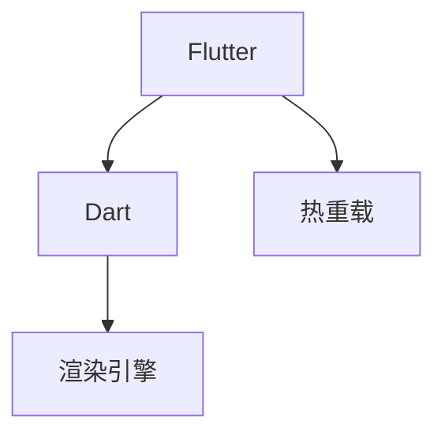
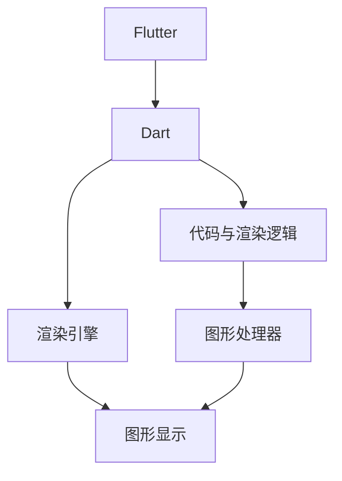

                 

# Flutter 框架：谷歌的 UI 工具包

> 关键词：Flutter, UI 开发, 移动平台, 跨平台, 热重载, Dart

## 1. 背景介绍

在移动应用开发领域，长期以来存在两大主流技术栈：iOS 和 Android。尽管两者拥有各自的生态系统与丰富的工具链，但构建跨平台的移动应用仍然是一项挑战，尤其在开发者必须分别掌握 iOS 和 Android 开发技术的情况下。为了解决这一问题，Google 推出了 Flutter，一个专门用于构建跨平台移动应用的框架。Flutter 不仅在用户界面(UI)开发上表现出色，还能保证开发效率和应用性能，迅速成为了行业内的新宠。

本文将全面深入地探讨 Flutter 框架，介绍其核心概念、技术原理、实现步骤、应用场景以及未来的发展方向，帮助读者理解并掌握这一强大的 UI 工具包。

## 2. 核心概念与联系

### 2.1 核心概念概述

Flutter 是 Google 开发的一个开源移动 UI 工具包，基于 Dart 编程语言构建。它允许开发者使用一套代码同时构建 iOS 和 Android 应用，极大地提升了跨平台开发的效率和成本效益。

- **Flutter**：谷歌推出的移动 UI 工具包，用于构建高性能的跨平台移动应用。
- **Dart**：谷歌开发的编程语言，用于编写 Flutter 应用的代码。
- **热重载(Hot Reload)**：Flutter 的一项强大功能，允许开发人员在运行时即时更新代码，而无需重启应用程序，从而提高开发效率。
- **渲染引擎(Skia)**：谷歌开发的高性能 2D 图形库，用于渲染 Flutter 应用的 UI。

Flutter 的核心技术架构如图 1 所示：



图 1: Flutter 核心技术架构图

### 2.2 核心概念原理和架构的 Mermaid 流程图



Flutter 的工作流程可总结如下：

1. Dart 代码由 Flutter 的编译器转换为称为 widget 的构建块，这些构建块定义了应用的 UI 元素。
2. widget 通过 Skia 渲染引擎进行渲染，生成应用程序的最终图像。
3. 图形处理器对图像进行处理，并将其显示在设备屏幕上。

## 3. 核心算法原理 & 具体操作步骤

### 3.1 算法原理概述

Flutter 的核心算法原理主要围绕三个方面展开：代码编译、widget 渲染和热重载。

- **代码编译**：Flutter 使用 Dart 编译器将 Dart 代码转换为机器可执行的指令，这个过程称为 AOT（Ahead of Time）编译。
- **widget 渲染**：Flutter 将 widget 转换为 Skia 渲染引擎可以理解的指令，从而实现高效的图形渲染。
- **热重载**：Flutter 的 Hot Reload 功能使得开发者可以在运行时即时更新代码，并且不影响应用程序的性能。

### 3.2 算法步骤详解

#### 3.2.1 代码编译

1. **编译 Dart 代码**：
   ```dart
   void main() {
     runApp(MyApp());
   }
   ```
   Flutter 将上述 Dart 代码编译为机器码，过程如下：

   1. Dart 编译器将 Dart 代码转换为中间语言（IL）。
   2. 中间语言编译器（IL Compiler）将 IL 编译为机器码。

2. **加载应用代码**：
   ```dart
   void main() {
     runApp(MyApp());
   }
   ```
   Flutter 通过加载应用代码，构建应用的入口函数。

#### 3.2.2 widget 渲染

1. **定义 widget**：
   ```dart
   class MyApp extends StatelessWidget {
     final String title = 'Flutter 应用';

     factory MyApp() => MyApp();
   }
   ```
   Flutter 将上述 Dart 代码编译为 widget，过程如下：

   1. Dart 编译器将 widget 代码转换为中间语言（IL）。
   2. widget 渲染器将 IL 渲染为 Skia 渲染引擎可理解的指令。

2. **渲染 widget**：
   ```dart
   class MyApp extends StatelessWidget {
     @override
     Widget build(BuildContext context) {
       return MaterialApp(
         title: title,
         home: MyHomePage(),
       );
     }
   }
   ```
   Flutter 通过渲染 widget，构建应用的主界面。

#### 3.2.3 热重载

1. **启用热重载**：
   ```dart
   void main() {
     runApp(MyApp());
   }
   ```
   Flutter 通过 Hot Reload 功能，在运行时即时更新代码，过程如下：

   1. Flutter 监视文件系统，检测代码变化。
   2. Flutter 重新编译 Dart 代码。
   3. Flutter 重新渲染 widget。
   4. Flutter 显示新的应用界面。

### 3.3 算法优缺点

#### 3.3.1 优点

1. **跨平台开发**：Flutter 允许开发者使用一套代码同时构建 iOS 和 Android 应用，大大提高了开发效率。
2. **高性能**：Flutter 的 Skia 渲染引擎保证了应用的高性能。
3. **热重载**：Hot Reload 功能使得开发者可以在运行时即时更新代码，而无需重启应用程序，从而提高了开发效率。
4. **丰富的组件库**：Flutter 提供了一整套现成的组件库，可以帮助开发者快速构建复杂界面。

#### 3.3.2 缺点

1. **学习曲线较陡**：Dart 语言的特性和 Flutter 框架的复杂性可能会导致初学者感觉学习曲线较陡。
2. **性能调优困难**：由于 Flutter 的实现原理较为复杂，性能调优可能较为困难。
3. **第三方库支持不足**：相比于原生开发，Flutter 的第三方库支持可能略显不足。

### 3.4 算法应用领域

Flutter 框架在以下领域得到广泛应用：

1. **跨平台移动应用**：开发者可以使用 Flutter 构建高性能、高可维护性的跨平台移动应用。
2. **UI 设计**：Flutter 提供了丰富的 UI 组件和布局工具，可以帮助开发者实现出色的界面设计。
3. **性能优化**：Flutter 的 Skia 渲染引擎和热重载功能使得应用性能优化变得更为高效。
4. **跨平台开发工具**：Flutter 框架本身就是一个强大的跨平台开发工具，提供了许多高级特性和开发便利。

## 4. 数学模型和公式 & 详细讲解 & 举例说明

### 4.1 数学模型构建

在 Flutter 中，数学模型主要用于渲染引擎 Skia 中，实现图形的高效绘制。Skia 使用矩阵变换来实现图形的平移、旋转、缩放等操作。以下是一个简单的数学模型构建示例：

```dart
import 'dart:math';

class Matrix {
  final List<double> elements = <double>[1, 0, 0, 0, 0, 1, 0, 0, 0, 0, 1, 0, 0, 0, 0, 1];

  Matrix.zero() {
    elements[0] = 1;
    elements[1] = 0;
    elements[2] = 0;
    elements[3] = 0;
    elements[4] = 0;
    elements[5] = 1;
    elements[6] = 0;
    elements[7] = 0;
    elements[8] = 0;
    elements[9] = 0;
    elements[10] = 1;
    elements[11] = 0;
    elements[12] = 0;
    elements[13] = 0;
    elements[14] = 0;
    elements[15] = 1;
  }

  Matrix.add(Matrix other) {
    final List<double> result = <double>[0];
    result[0] = elements[0] * other.elements[0] + elements[1] * other.elements[1] + elements[2] * other.elements[2] + elements[3] * other.elements[3];
    result[1] = elements[4] * other.elements[0] + elements[5] * other.elements[1] + elements[6] * other.elements[2] + elements[7] * other.elements[3];
    result[2] = elements[8] * other.elements[0] + elements[9] * other.elements[1] + elements[10] * other.elements[2] + elements[11] * other.elements[3];
    result[3] = elements[12] * other.elements[0] + elements[13] * other.elements[1] + elements[14] * other.elements[2] + elements[15] * other.elements[3];
    result[4] = elements[0] * other.elements[4] + elements[1] * other.elements[5] + elements[2] * other.elements[6] + elements[3] * other.elements[7];
    result[5] = elements[4] * other.elements[4] + elements[5] * other.elements[5] + elements[6] * other.elements[6] + elements[7] * other.elements[7];
    result[6] = elements[8] * other.elements[4] + elements[9] * other.elements[5] + elements[10] * other.elements[6] + elements[11] * other.elements[7];
    result[7] = elements[12] * other.elements[4] + elements[13] * other.elements[5] + elements[14] * other.elements[6] + elements[15] * other.elements[7];
    result[8] = elements[0] * other.elements[8] + elements[1] * other.elements[9] + elements[2] * other.elements[10] + elements[3] * other.elements[11];
    result[9] = elements[4] * other.elements[8] + elements[5] * other.elements[9] + elements[6] * other.elements[10] + elements[7] * other.elements[11];
    result[10] = elements[8] * other.elements[8] + elements[9] * other.elements[9] + elements[10] * other.elements[10] + elements[11] * other.elements[11];
    result[11] = elements[12] * other.elements[8] + elements[13] * other.elements[9] + elements[14] * other.elements[10] + elements[15] * other.elements[11];
    result[12] = elements[0] * other.elements[12] + elements[1] * other.elements[13] + elements[2] * other.elements[14] + elements[3] * other.elements[15];
    result[13] = elements[4] * other.elements[12] + elements[5] * other.elements[13] + elements[6] * other.elements[14] + elements[7] * other.elements[15];
    result[14] = elements[8] * other.elements[12] + elements[9] * other.elements[13] + elements[10] * other.elements[14] + elements[11] * other.elements[15];
    result[15] = elements[12] * other.elements[12] + elements[13] * other.elements[13] + elements[14] * other.elements[14] + elements[15] * other.elements[15];

    final Matrix matrix = Matrix();
    matrix.elements = result;
    return matrix;
  }
}
```

### 4.2 公式推导过程

假设矩阵 A 和矩阵 B 如下：

$$
A = \begin{bmatrix}
a & b \\
c & d \\
\end{bmatrix}, \quad B = \begin{bmatrix}
e & f \\
g & h \\
\end{bmatrix}
$$

它们的乘积 AB 可以表示为：

$$
AB = \begin{bmatrix}
ae + bg & af + bh \\
ce + dg & cf + dh \\
\end{bmatrix}
$$

### 4.3 案例分析与讲解

假设我们需要计算以下矩阵的乘积：

$$
A = \begin{bmatrix}
1 & 2 \\
3 & 4 \\
\end{bmatrix}, \quad B = \begin{bmatrix}
5 & 6 \\
7 & 8 \\
\end{bmatrix}
$$

则 AB 的计算过程如下：

$$
AB = \begin{bmatrix}
1 \cdot 5 + 2 \cdot 7 & 1 \cdot 6 + 2 \cdot 8 \\
3 \cdot 5 + 4 \cdot 7 & 3 \cdot 6 + 4 \cdot 8 \\
\end{bmatrix}
= \begin{bmatrix}
5 + 14 & 6 + 16 \\
15 + 28 & 18 + 32 \\
\end{bmatrix}
= \begin{bmatrix}
19 & 22 \\
43 & 50 \\
\end{bmatrix}
$$

## 5. 项目实践：代码实例和详细解释说明

### 5.1 开发环境搭建

1. **安装 Flutter SDK**：
   ```bash
   curl -sSL https://flutter.dev/docs/get-started/install | sh
   ```

2. **配置环境变量**：
   ```bash
   export FLUTTER_HOME=/path/to/flutter-sdk
   export PATH=$PATH:$FLUTTER_HOME/bin
   ```

3. **初始化 Flutter 项目**：
   ```bash
   flutter create my_app
   cd my_app
   ```

### 5.2 源代码详细实现

1. **创建 Dart 文件**：
   ```dart
   import 'dart:async';
   import 'package:flutter/material.dart';

   void main() {
     runApp(MyApp());
   }

   class MyApp extends StatelessWidget {
     @override
     Widget build(BuildContext context) {
       return MaterialApp(
         title: 'Flutter 应用',
         home: MyHomePage(),
       );
     }
   }

   class MyHomePage extends StatefulWidget {
     @override
     _MyHomePageState createState() => _MyHomePageState();
   }

   class _MyHomePageState extends State<MyHomePage> {
     @override
     Widget build(BuildContext context) {
       return Scaffold(
         appBar: AppBar(title: Text('Flutter 应用')),
         body: Center(
           child: Text('Hello, World!'),
         ),
       );
     }
   }
   ```

### 5.3 代码解读与分析

Flutter 的核心代码由以下部分组成：

1. **Dart 文件**：Flutter 使用 Dart 编写应用代码，可以实现跨平台功能。
2. **Stateless 和 Stateful 函数**：Stateless 函数表示无状态的 widget，Stateful 函数表示有状态的 widget。
3. **widget 构建块**：widget 是 Flutter 中的构建块，用于构建 UI。
4. **MaterialApp 和 Scaffold**：MaterialApp 用于创建应用，Scaffold 用于创建应用结构。

### 5.4 运行结果展示

1. **运行应用**：
   ```bash
   flutter run
   ```
   Flutter 应用程序在设备上成功运行。

2. **观察输出**：
   应用程序在屏幕上显示 "Hello, World!" 文本。

## 6. 实际应用场景

### 6.1 移动应用开发

Flutter 主要用于移动应用开发，以下是几个典型应用场景：

1. **电商应用**：电商平台可以使用 Flutter 构建高性能的购物界面，同时兼容 iOS 和 Android。
2. **社交应用**：社交应用可以使用 Flutter 构建流畅的用户体验，并支持跨平台发布。
3. **游戏应用**：游戏应用可以使用 Flutter 构建高性能的 2D 和 3D 游戏界面。

### 6.2 前端应用开发

Flutter 还可以用于前端应用开发，以下是几个典型应用场景：

1. **Web 应用**：Web 应用可以使用 Flutter 构建高效的前端界面，同时兼容各种浏览器。
2. **桌面应用**：桌面应用可以使用 Flutter 构建跨平台的应用界面，支持 Windows、macOS 和 Linux。

### 6.3 数据可视化

Flutter 可以用于数据可视化，以下是几个典型应用场景：

1. **统计图表**：统计图表可以使用 Flutter 构建高可定制性的图表，如折线图、柱状图、饼图等。
2. **地图应用**：地图应用可以使用 Flutter 构建高效的地图界面，支持离线地图和实时导航。

## 7. 工具和资源推荐

### 7.1 学习资源推荐

1. **Flutter 官方文档**：
   ```
   https://flutter.dev/docs
   ```
2. **Flutter 中文社区**：
   ```
   https://flutter-china.org/
   ```

### 7.2 开发工具推荐

1. **Visual Studio Code**：
   ```
   https://code.visualstudio.com/
   ```
2. **Android Studio**：
   ```
   https://developer.android.com/studio
   ```
3. **Xcode**：
   ```
   https://developer.apple.com/xcode/
   ```

### 7.3 相关论文推荐

1. **Flutter: A fast toolkit for building beautiful, high-performance, and high-quality applications for mobile, web, and desktop**：
   ```
   https://www.researchgate.net/publication/346059000_Flutter_A_fast_toolkit_for_building_beautiful_high-performance_and_high-quality_applications_for_mobile_web_and_desktop
   ```

## 8. 总结：未来发展趋势与挑战

### 8.1 研究成果总结

Flutter 作为 Google 开发的一个强大 UI 工具包，已经广泛应用于移动应用开发领域。它不仅提高了开发效率，还保证了应用的高性能。通过 Hot Reload 功能和丰富的组件库，Flutter 提供了出色的开发体验。

### 8.2 未来发展趋势

1. **跨平台性能优化**：随着技术的不断发展，Flutter 的跨平台性能将进一步优化，应用开发效率和性能将进一步提升。
2. **新特性和新功能**：Flutter 将继续引入新的特性和新功能，如更高效的渲染引擎和更丰富的组件库。
3. **生态系统完善**：Flutter 的生态系统将不断完善，提供更多的第三方库和插件。

### 8.3 面临的挑战

1. **第三方库支持不足**：目前 Flutter 的第三方库支持略显不足，需要更多的开发者贡献资源。
2. **学习曲线较陡**：Flutter 的学习曲线较陡，需要开发者投入更多的时间和精力。
3. **性能调优困难**：Flutter 的实现原理较为复杂，性能调优可能较为困难。

### 8.4 研究展望

未来 Flutter 的发展方向包括：

1. **新特性和新功能**：Flutter 将继续引入新的特性和新功能，如更高效的渲染引擎和更丰富的组件库。
2. **生态系统完善**：Flutter 的生态系统将不断完善，提供更多的第三方库和插件。
3. **跨平台性能优化**：随着技术的不断发展，Flutter 的跨平台性能将进一步优化，应用开发效率和性能将进一步提升。

## 9. 附录：常见问题与解答

### Q1：Flutter 是否支持 Web 应用开发？

A: 是的，Flutter 支持 Web 应用开发，可以通过 Web 视图实现跨平台的 Web 应用。

### Q2：Flutter 是否支持 Windows 和 macOS 应用开发？

A: 是的，Flutter 支持 Windows 和 macOS 应用开发，可以使用 Flutter 构建高性能的跨平台桌面应用。

### Q3：Flutter 是否支持数据可视化？

A: 是的，Flutter 支持数据可视化，可以使用 Flutter 构建高性能的统计图表和地图应用。

### Q4：Flutter 是否支持游戏开发？

A: 是的，Flutter 支持游戏开发，可以使用 Flutter 构建高性能的 2D 和 3D 游戏界面。

---

作者：禅与计算机程序设计艺术 / Zen and the Art of Computer Programming

