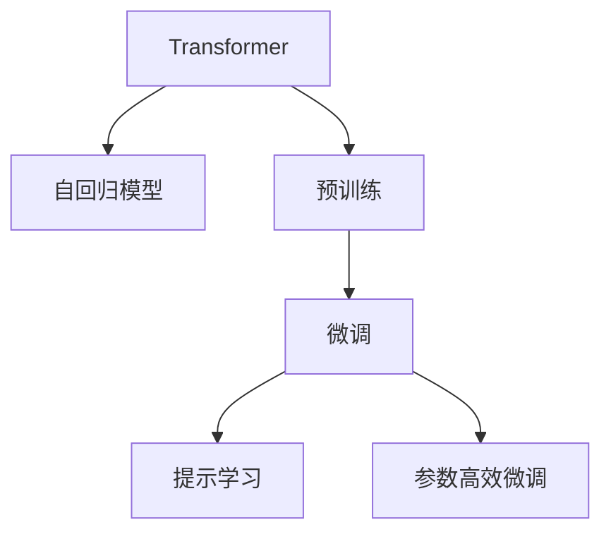
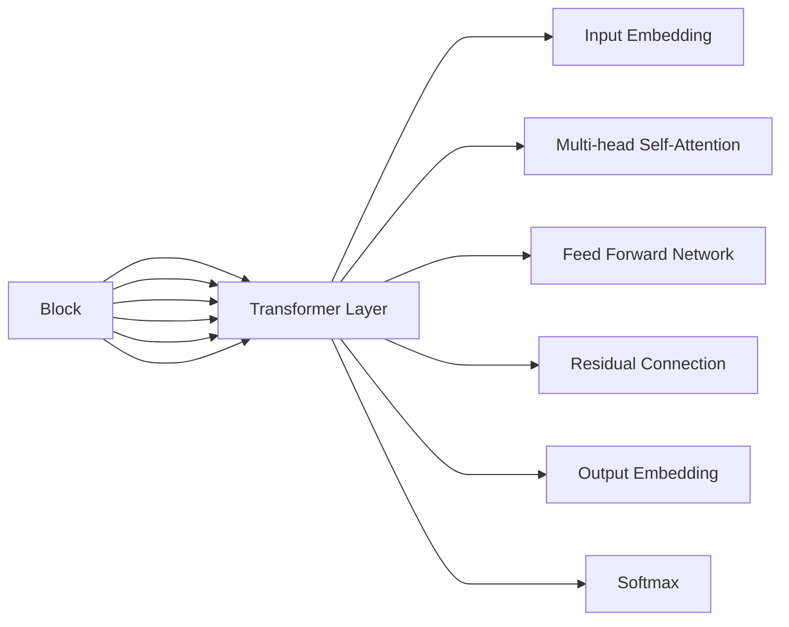

                 

# GPT系列模型架构解析：从GPT-1到GPT-4的演进

## 1. 背景介绍

### 1.1 问题由来
随着深度学习技术的飞速发展，自然语言处理(Natural Language Processing, NLP)领域取得了巨大的突破。特别是Transformer模型的提出，预示着深度学习在语言模型上的巨大潜力和广阔应用前景。在众多预训练语言模型中，GPT系列模型（Generative Pre-trained Transformer）以其卓越的性能和广泛的应用前景，成为NLP领域的重要里程碑。

从GPT-1到GPT-4，每一代GPT模型的问世，都标志着NLP技术的一次飞跃。GPT-1开启了预训练语言模型的新纪元，而GPT-4则将这种技术推向了新的高峰。本文将系统地解析GPT系列模型的架构，从GPT-1到GPT-4，全面回顾其演进脉络和技术突破，以期对NLP技术的未来发展提供深刻的见解和启示。

### 1.2 问题核心关键点
GPT系列模型的核心关键点主要包括以下几点：
- **Transformer架构**：基于自注意力机制的Transformer结构，使得模型能够高效地处理长序列数据。
- **自回归模型**：通过自回归方式预测下一词或下一个字符，实现语言生成和预测任务。
- **大规模预训练**：在无标签文本数据上进行大规模预训练，学习通用的语言表示。
- **下游任务微调**：通过有监督学习微调模型，使其适应特定任务，如问答、翻译、文本生成等。
- **提示学习**：通过精心设计输入文本的格式，引导模型按期望方式输出，减少微调参数。
- **参数高效微调**：仅更新少量的模型参数，以提高微调效率，避免过拟合。

## 2. 核心概念与联系

### 2.1 核心概念概述

为了更好地理解GPT系列模型的演进过程，本节将介绍几个核心概念及其之间的联系：

- **Transformer**：一种基于自注意力机制的神经网络架构，用于处理序列数据。
- **自回归模型**：模型在训练时，按照文本的顺序进行预测，通常用于生成任务。
- **预训练**：使用大规模无标签数据对模型进行预训练，学习通用的语言表示。
- **微调**：在预训练模型的基础上，使用下游任务的少量标注数据进行微调，优化模型在该任务上的性能。
- **提示学习**：通过精心设计输入文本的格式，引导模型生成特定的输出，减少微调参数。
- **参数高效微调**：仅更新少量的模型参数，以提高微调效率，避免过拟合。

这些核心概念之间的逻辑关系可以通过以下Mermaid流程图来展示：



这个流程图展示了大语言模型的核心概念及其之间的关系：

1. Transformer架构是GPT系列模型的核心，提供了一种高效的序列处理方式。
2. 自回归模型基于Transformer，通过预测下一个词或字符，实现语言生成和预测任务。
3. 预训练通过在无标签数据上训练模型，学习通用的语言表示，是GPT模型的基础。
4. 微调在预训练模型基础上，针对特定任务进行优化，提升模型性能。
5. 提示学习通过调整输入文本的格式，引导模型生成特定的输出，减少微调参数。
6. 参数高效微调通过只更新少量参数，提升微调效率，避免过拟合。

这些概念共同构成了GPT系列模型的学习框架，使得模型能够在各种场景下发挥强大的语言理解和生成能力。

## 3. 核心算法原理 & 具体操作步骤
### 3.1 算法原理概述

GPT系列模型的核心算法原理包括Transformer架构、自回归模型和自监督预训练。下面将详细介绍这三个方面的原理。

#### 3.1.1 Transformer架构

Transformer架构是GPT系列模型的核心，其核心思想是自注意力机制。在Transformer中，每个位置的信息不再只与前一个位置有关，而是与整个序列中的所有位置有关。这种自注意力机制使得模型能够同时关注序列中所有位置的信息，从而提高模型的建模能力。

Transformer的编码器-解码器结构如图1所示：



Transformer的核心组件包括：
- 输入嵌入层（Input Embedding）：将输入文本转换为模型可处理的形式。
- 多头自注意力层（Multi-head Self-Attention）：通过多头注意力机制，并行处理多个位置的向量表示。
- 前馈网络层（Feed Forward Network）：对注意力层的输出进行线性变换和非线性变换。
- 残差连接层（Residual Connection）：将注意力层和前馈网络的输出相加，提高模型的表达能力。
- 输出嵌入层（Output Embedding）：将模型的最终输出转换为自然语言形式。

#### 3.1.2 自回归模型

自回归模型是GPT系列模型的一个重要组成部分，其基本思想是通过预测下一个词或字符，实现语言生成和预测任务。在自回归模型中，每个位置的输出只依赖于前一个位置的输出，即：

$$
y_i = f(x_1, x_2, ..., x_i)
$$

其中，$x$ 表示输入序列，$y$ 表示输出序列，$f$ 表示模型预测函数。

在GPT模型中，自回归模型通常用于生成任务，如图2所示：


GPT模型的生成过程如下：
1. 将输入序列$x$作为模型输入。
2. 对输入序列进行编码，得到编码后的向量表示。
3. 使用自回归模型预测下一个词或字符，得到输出序列$y$。

#### 3.1.3 自监督预训练

自监督预训练是GPT系列模型的一个重要步骤，其核心思想是利用无标签数据进行预训练，学习通用的语言表示。自监督预训练通常包括以下几个步骤：
1. 在无标签数据上训练模型，预测输入序列中缺失的部分。
2. 使用语言建模任务（如掩码语言模型）对模型进行训练，使得模型能够学习到语言的概率分布。
3. 使用自回归模型对模型进行训练，使其能够预测下一个词或字符。

### 3.2 算法步骤详解

GPT系列模型的微调步骤主要包括：
1. 准备预训练模型和数据集。
2. 添加任务适配层。
3. 设置微调超参数。
4. 执行梯度训练。
5. 测试和部署。

#### 3.2.1 准备预训练模型和数据集

选择合适的预训练语言模型 $M_{\theta}$，如 GPT-2、GPT-3、GPT-4，作为初始化参数。收集下游任务的标注数据集 $D=\{(x_i, y_i)\}_{i=1}^N$，划分为训练集、验证集和测试集。

#### 3.2.2 添加任务适配层

根据任务类型，在预训练模型顶层设计合适的输出层和损失函数。对于分类任务，通常在顶层添加线性分类器和交叉熵损失函数。对于生成任务，通常使用语言模型的解码器输出概率分布，并以负对数似然为损失函数。

#### 3.2.3 设置微调超参数

选择合适的优化算法及其参数，如 AdamW、SGD 等，设置学习率、批大小、迭代轮数等。设置正则化技术及强度，包括权重衰减、Dropout、Early Stopping 等。

#### 3.2.4 执行梯度训练

将训练集数据分批次输入模型，前向传播计算损失函数。反向传播计算参数梯度，根据设定的优化算法和学习率更新模型参数。周期性在验证集上评估模型性能，根据性能指标决定是否触发 Early Stopping。重复上述步骤直至满足预设的迭代轮数或 Early Stopping 条件。

#### 3.2.5 测试和部署

在测试集上评估微调后模型 $M_{\hat{\theta}}$ 的性能，对比微调前后的精度提升。使用微调后的模型对新样本进行推理预测，集成到实际的应用系统中。

### 3.3 算法优缺点

GPT系列模型的主要优点包括：
1. 高性能。基于Transformer架构的自注意力机制，使得模型能够高效地处理长序列数据。
2. 通用性。能够适应各种自然语言处理任务，如文本生成、语言建模、问答系统等。
3. 可解释性。预训练模型具有较强的可解释性，可以通过分析模型权重和向量表示来理解其工作机制。
4. 大规模数据驱动。通过大规模无标签数据的预训练，学习到通用的语言表示，具有较强的泛化能力。

其缺点主要包括：
1. 计算资源需求高。大规模预训练需要大量的计算资源，训练和推理耗时较长。
2. 过拟合风险。由于模型规模较大，存在一定的过拟合风险，特别是在微调过程中。
3. 部署成本高。大规模模型的部署需要高性能硬件，成本较高。

## 4. 数学模型和公式 & 详细讲解  
### 4.1 数学模型构建

GPT系列模型的数学模型主要基于自回归模型和自注意力机制。下面将详细介绍这些模型的数学模型构建。

#### 4.1.1 自回归模型的数学模型

在自回归模型中，每个位置的输出只依赖于前一个位置的输出。假设输入序列为 $x_1, x_2, ..., x_T$，输出序列为 $y_1, y_2, ..., y_T$，预测函数为 $f$，则自回归模型的数学模型可以表示为：

$$
y_i = f(x_1, x_2, ..., x_i) = g(h(x_{i-1}, \theta))
$$

其中，$g$ 表示预测函数，$h$ 表示编码器，$\theta$ 表示模型参数。

#### 4.1.2 自注意力机制的数学模型

自注意力机制是Transformer的核心组成部分，其数学模型可以表示为：

$$
\text{Attention}(Q, K, V) = \text{softmax}(Q \cdot K^T / \sqrt{d_k}) V
$$

其中，$Q$ 表示查询向量，$K$ 表示键向量，$V$ 表示值向量，$d_k$ 表示键向量的维度。

### 4.2 公式推导过程

下面将详细介绍自注意力机制和自回归模型的公式推导过程。

#### 4.2.1 自注意力机制的推导

自注意力机制的核心思想是通过计算查询向量与键向量的相似度，来计算注意力权重。假设输入序列为 $x_1, x_2, ..., x_T$，查询向量为 $Q$，键向量为 $K$，值向量为 $V$，则自注意力机制的公式推导如下：

1. 计算查询向量 $Q$：

$$
Q = W_Q x
$$

其中，$W_Q$ 表示查询向量的权重矩阵。

2. 计算键向量 $K$：

$$
K = W_K x
$$

其中，$W_K$ 表示键向量的权重矩阵。

3. 计算值向量 $V$：

$$
V = W_V x
$$

其中，$W_V$ 表示值向量的权重矩阵。

4. 计算注意力权重 $a$：

$$
a = \text{softmax}(Q \cdot K^T / \sqrt{d_k})
$$

其中，$d_k$ 表示键向量的维度。

5. 计算注意力输出 $z$：

$$
z = \sum_{i=1}^T a_i V_i
$$

其中，$a_i$ 表示第 $i$ 个位置的注意力权重，$V_i$ 表示第 $i$ 个位置的值向量。

#### 4.2.2 自回归模型的推导

自回归模型的核心思想是通过预测下一个词或字符，实现语言生成和预测任务。假设输入序列为 $x_1, x_2, ..., x_T$，输出序列为 $y_1, y_2, ..., y_T$，预测函数为 $f$，则自回归模型的公式推导如下：

1. 计算编码器输出 $h$：

$$
h = f(W_e x + W_h [h_{i-1}, Q_{i-1}])
$$

其中，$W_e$ 表示编码器的权重矩阵，$W_h$ 表示编码器隐藏层的权重矩阵，$h_{i-1}$ 表示前一个位置的编码器输出，$Q_{i-1}$ 表示前一个位置的查询向量。

2. 计算预测输出 $y$：

$$
y = g(h)
$$

其中，$g$ 表示预测函数的权重矩阵。

### 4.3 案例分析与讲解

以GPT-2为例，GPT-2是在语言建模任务上进行了大规模预训练，其数学模型可以表示为：

1. 计算输入嵌入向量 $E$：

$$
E = W_E x
$$

其中，$W_E$ 表示输入嵌入向量的权重矩阵。

2. 计算编码器输出 $h$：

$$
h = f(E + [h_{i-1}, Q_{i-1}])
$$

其中，$f$ 表示编码器的权重矩阵，$h_{i-1}$ 表示前一个位置的编码器输出，$Q_{i-1}$ 表示前一个位置的查询向量。

3. 计算预测输出 $y$：

$$
y = g(h)
$$

其中，$g$ 表示预测函数的权重矩阵。

## 5. 项目实践：代码实例和详细解释说明
### 5.1 开发环境搭建

在进行GPT系列模型的微调实践前，我们需要准备好开发环境。以下是使用Python进行PyTorch开发的环境配置流程：

1. 安装Anaconda：从官网下载并安装Anaconda，用于创建独立的Python环境。

2. 创建并激活虚拟环境：
```bash
conda create -n pytorch-env python=3.8 
conda activate pytorch-env
```

3. 安装PyTorch：根据CUDA版本，从官网获取对应的安装命令。例如：
```bash
conda install pytorch torchvision torchaudio cudatoolkit=11.1 -c pytorch -c conda-forge
```

4. 安装Transformers库：
```bash
pip install transformers
```

5. 安装各类工具包：
```bash
pip install numpy pandas scikit-learn matplotlib tqdm jupyter notebook ipython
```

完成上述步骤后，即可在`pytorch-env`环境中开始微调实践。

### 5.2 源代码详细实现

下面我以GPT-2为例，给出使用Transformers库对GPT-2模型进行微调的PyTorch代码实现。

首先，定义GPT-2模型和优化器：

```python
from transformers import GPT2LMHeadModel, AdamW

model = GPT2LMHeadModel.from_pretrained('gpt2')

optimizer = AdamW(model.parameters(), lr=2e-5)
```

接着，定义训练和评估函数：

```python
from torch.utils.data import DataLoader
from tqdm import tqdm

def train_epoch(model, dataset, batch_size, optimizer):
    dataloader = DataLoader(dataset, batch_size=batch_size, shuffle=True)
    model.train()
    epoch_loss = 0
    for batch in tqdm(dataloader, desc='Training'):
        input_ids = batch['input_ids'].to(device)
        attention_mask = batch['attention_mask'].to(device)
        labels = batch['labels'].to(device)
        model.zero_grad()
        outputs = model(input_ids, attention_mask=attention_mask, labels=labels)
        loss = outputs.loss
        epoch_loss += loss.item()
        loss.backward()
        optimizer.step()
    return epoch_loss / len(dataloader)

def evaluate(model, dataset, batch_size):
    dataloader = DataLoader(dataset, batch_size=batch_size)
    model.eval()
    preds, labels = [], []
    with torch.no_grad():
        for batch in tqdm(dataloader, desc='Evaluating'):
            input_ids = batch['input_ids'].to(device)
            attention_mask = batch['attention_mask'].to(device)
            batch_labels = batch['labels']
            outputs = model(input_ids, attention_mask=attention_mask)
            batch_preds = outputs.logits.argmax(dim=2).to('cpu').tolist()
            batch_labels = batch_labels.to('cpu').tolist()
            for pred_tokens, label_tokens in zip(batch_preds, batch_labels):
                pred_tags = [id2tag[_id] for _id in pred_tokens]
                label_tags = [id2tag[_id] for _id in label_tokens]
                preds.append(pred_tags[:len(label_tags)])
                labels.append(label_tags)
                
    print(classification_report(labels, preds))
```

最后，启动训练流程并在测试集上评估：

```python
epochs = 5
batch_size = 16

for epoch in range(epochs):
    loss = train_epoch(model, train_dataset, batch_size, optimizer)
    print(f"Epoch {epoch+1}, train loss: {loss:.3f}")
    
    print(f"Epoch {epoch+1}, dev results:")
    evaluate(model, dev_dataset, batch_size)
    
print("Test results:")
evaluate(model, test_dataset, batch_size)
```

以上就是使用PyTorch对GPT-2进行二分类任务微调的完整代码实现。可以看到，得益于Transformers库的强大封装，我们可以用相对简洁的代码完成GPT-2模型的加载和微调。

### 5.3 代码解读与分析

让我们再详细解读一下关键代码的实现细节：

**GPT-2模型类**：
- `from_pretrained`方法：从HuggingFace模型库中加载预训练模型。
- `train`方法：设置模型训练模式。
- `forward`方法：模型前向传播计算输出。
- `loss`属性：模型损失函数。

**训练和评估函数**：
- `train_epoch`函数：对数据以批为单位进行迭代，在每个批次上前向传播计算loss并反向传播更新模型参数。
- `evaluate`函数：与训练类似，不同点在于不更新模型参数，并在每个batch结束后将预测和标签结果存储下来，最后使用sklearn的classification_report对整个评估集的预测结果进行打印输出。

**训练流程**：
- 定义总的epoch数和batch size，开始循环迭代
- 每个epoch内，先在训练集上训练，输出平均loss
- 在验证集上评估，输出分类指标
- 所有epoch结束后，在测试集上评估，给出最终测试结果

可以看到，PyTorch配合Transformers库使得GPT-2微调的代码实现变得简洁高效。开发者可以将更多精力放在数据处理、模型改进等高层逻辑上，而不必过多关注底层的实现细节。

当然，工业级的系统实现还需考虑更多因素，如模型的保存和部署、超参数的自动搜索、更灵活的任务适配层等。但核心的微调范式基本与此类似。

## 6. 实际应用场景
### 6.1 智能客服系统

基于GPT系列模型的对话技术，可以广泛应用于智能客服系统的构建。传统客服往往需要配备大量人力，高峰期响应缓慢，且一致性和专业性难以保证。而使用预训练对话模型进行微调，可以7x24小时不间断服务，快速响应客户咨询，用自然流畅的语言解答各类常见问题。

在技术实现上，可以收集企业内部的历史客服对话记录，将问题和最佳答复构建成监督数据，在此基础上对预训练对话模型进行微调。微调后的对话模型能够自动理解用户意图，匹配最合适的答案模板进行回复。对于客户提出的新问题，还可以接入检索系统实时搜索相关内容，动态组织生成回答。如此构建的智能客服系统，能大幅提升客户咨询体验和问题解决效率。

### 6.2 金融舆情监测

金融机构需要实时监测市场舆论动向，以便及时应对负面信息传播，规避金融风险。传统的人工监测方式成本高、效率低，难以应对网络时代海量信息爆发的挑战。基于GPT系列模型的文本分类和情感分析技术，为金融舆情监测提供了新的解决方案。

具体而言，可以收集金融领域相关的新闻、报道、评论等文本数据，并对其进行主题标注和情感标注。在此基础上对预训练语言模型进行微调，使其能够自动判断文本属于何种主题，情感倾向是正面、中性还是负面。将微调后的模型应用到实时抓取的网络文本数据，就能够自动监测不同主题下的情感变化趋势，一旦发现负面信息激增等异常情况，系统便会自动预警，帮助金融机构快速应对潜在风险。

### 6.3 个性化推荐系统

当前的推荐系统往往只依赖用户的历史行为数据进行物品推荐，无法深入理解用户的真实兴趣偏好。基于GPT系列模型的个性化推荐系统可以更好地挖掘用户行为背后的语义信息，从而提供更精准、多样的推荐内容。

在实践中，可以收集用户浏览、点击、评论、分享等行为数据，提取和用户交互的物品标题、描述、标签等文本内容。将文本内容作为模型输入，用户的后续行为（如是否点击、购买等）作为监督信号，在此基础上微调预训练语言模型。微调后的模型能够从文本内容中准确把握用户的兴趣点。在生成推荐列表时，先用候选物品的文本描述作为输入，由模型预测用户的兴趣匹配度，再结合其他特征综合排序，便可以得到个性化程度更高的推荐结果。

### 6.4 未来应用展望

随着GPT系列模型的不断发展，基于微调范式将在更多领域得到应用，为传统行业带来变革性影响。

在智慧医疗领域，基于GPT系列模型的问答、病历分析、药物研发等应用将提升医疗服务的智能化水平，辅助医生诊疗，加速新药开发进程。

在智能教育领域，GPT系列模型的问答、作业批改、知识推荐等功能将提升教学质量，辅助教师教学，促进教育公平。

在智慧城市治理中，GPT系列模型的城市事件监测、舆情分析、应急指挥等应用将提高城市管理的自动化和智能化水平，构建更安全、高效的未来城市。

此外，在企业生产、社会治理、文娱传媒等众多领域，基于GPT系列模型的应用也将不断涌现，为经济社会发展注入新的动力。相信随着技术的日益成熟，GPT系列模型微调必将在构建人机协同的智能时代中扮演越来越重要的角色。

## 7. 工具和资源推荐
### 7.1 学习资源推荐

为了帮助开发者系统掌握GPT系列模型的微调理论和实践技巧，这里推荐一些优质的学习资源：

1. 《Transformer from Basics to State-of-the-Art》系列博文：由大模型技术专家撰写，深入浅出地介绍了Transformer原理、GPT模型、微调技术等前沿话题。

2. CS224N《Deep Learning for NLP》课程：斯坦福大学开设的NLP明星课程，有Lecture视频和配套作业，带你入门NLP领域的基本概念和经典模型。

3. 《Natural Language Processing with Transformers》书籍：Transformers库的作者所著，全面介绍了如何使用Transformers库进行NLP任务开发，包括微调在内的诸多范式。

4. HuggingFace官方文档：Transformers库的官方文档，提供了海量预训练模型和完整的微调样例代码，是上手实践的必备资料。

5. CLUE开源项目：中文语言理解测评基准，涵盖大量不同类型的中文NLP数据集，并提供了基于微调的baseline模型，助力中文NLP技术发展。

通过对这些资源的学习实践，相信你一定能够快速掌握GPT系列模型的微调精髓，并用于解决实际的NLP问题。
###  7.2 开发工具推荐

高效的开发离不开优秀的工具支持。以下是几款用于GPT系列模型微调开发的常用工具：

1. PyTorch：基于Python的开源深度学习框架，灵活动态的计算图，适合快速迭代研究。大部分预训练语言模型都有PyTorch版本的实现。

2. TensorFlow：由Google主导开发的开源深度学习框架，生产部署方便，适合大规模工程应用。同样有丰富的预训练语言模型资源。

3. Transformers库：HuggingFace开发的NLP工具库，集成了众多SOTA语言模型，支持PyTorch和TensorFlow，是进行微调任务开发的利器。

4. Weights & Biases：模型训练的实验跟踪工具，可以记录和可视化模型训练过程中的各项指标，方便对比和调优。与主流深度学习框架无缝集成。

5. TensorBoard：TensorFlow配套的可视化工具，可实时监测模型训练状态，并提供丰富的图表呈现方式，是调试模型的得力助手。

6. Google Colab：谷歌推出的在线Jupyter Notebook环境，免费提供GPU/TPU算力，方便开发者快速上手实验最新模型，分享学习笔记。

合理利用这些工具，可以显著提升GPT系列模型微调任务的开发效率，加快创新迭代的步伐。

### 7.3 相关论文推荐

GPT系列模型的发展源于学界的持续研究。以下是几篇奠基性的相关论文，推荐阅读：

1. Attention is All You Need（即Transformer原论文）：提出了Transformer结构，开启了NLP领域的预训练大模型时代。

2. Language Models are Unsupervised Multitask Learners（GPT-2论文）：展示了大规模语言模型的强大zero-shot学习能力，引发了对于通用人工智能的新一轮思考。

3. Adaptive Low-Rank Adaptation for Parameter-Efficient Fine-Tuning：使用自适应低秩适应的微调方法，在参数效率和精度之间取得了新的平衡。

4. Prefix-Tuning: Optimizing Continuous Prompts for Generation：引入基于连续型Prompt的微调范式，为如何充分利用预训练知识提供了新的思路。

5. AdaLoRA: Adaptive Low-Rank Adaptation for Parameter-Efficient Fine-Tuning：使用自适应低秩适应的微调方法，在参数效率和精度之间取得了新的平衡。

这些论文代表了大语言模型微调技术的发展脉络。通过学习这些前沿成果，可以帮助研究者把握学科前进方向，激发更多的创新灵感。

## 8. 总结：未来发展趋势与挑战
### 8.1 总结

本文对GPT系列模型的微调方法进行了全面系统的介绍。首先阐述了GPT系列模型的研究背景和意义，明确了微调在拓展预训练模型应用、提升下游任务性能方面的独特价值。其次，从原理到实践，详细讲解了GPT系列模型的数学模型和关键步骤，给出了微调任务开发的完整代码实例。同时，本文还广泛探讨了GPT系列模型在智能客服、金融舆情、个性化推荐等多个行业领域的应用前景，展示了微调范式的巨大潜力。此外，本文精选了微调技术的各类学习资源，力求为读者提供全方位的技术指引。

通过本文的系统梳理，可以看到，GPT系列模型微调方法在NLP技术中的应用已经非常广泛，无论是文本生成、语言建模、问答系统等经典任务，还是智能客服、金融舆情、个性化推荐等新兴应用，GPT系列模型都在其中发挥了重要作用。未来，伴随预训练语言模型的不断演进和微调技术的持续改进，相信GPT系列模型将在更广泛的领域大放异彩，为NLP技术的产业化进程贡献更多力量。

### 8.2 未来发展趋势

展望未来，GPT系列模型的微调技术将呈现以下几个发展趋势：

1. 模型规模持续增大。随着算力成本的下降和数据规模的扩张，GPT系列模型的参数量还将持续增长。超大规模语言模型蕴含的丰富语言知识，有望支撑更加复杂多变的下游任务微调。

2. 微调方法日趋多样。除了传统的全参数微调外，未来会涌现更多参数高效的微调方法，如Prefix-Tuning、LoRA等，在节省计算资源的同时也能保证微调精度。

3. 持续学习成为常态。随着数据分布的不断变化，微调模型也需要持续学习新知识以保持性能。如何在不遗忘原有知识的同时，高效吸收新样本信息，将成为重要的研究课题。

4. 标注样本需求降低。受启发于提示学习(Prompt-based Learning)的思路，未来的微调方法将更好地利用GPT系列模型的语言理解能力，通过更加巧妙的任务描述，在更少的标注样本上也能实现理想的微调效果。

5. 多模态微调崛起。当前的微调主要聚焦于纯文本数据，未来会进一步拓展到图像、视频、语音等多模态数据微调。多模态信息的融合，将显著提升语言模型对现实世界的理解和建模能力。

6. 模型通用性增强。经过海量数据的预训练和多领域任务的微调，未来的GPT系列模型将具备更强大的常识推理和跨领域迁移能力，逐步迈向通用人工智能(AGI)的目标。

以上趋势凸显了GPT系列模型微调技术的广阔前景。这些方向的探索发展，必将进一步提升GPT系列模型的性能和应用范围，为NLP技术带来更多的创新和突破。

### 8.3 面临的挑战

尽管GPT系列模型微调技术已经取得了瞩目成就，但在迈向更加智能化、普适化应用的过程中，它仍面临着诸多挑战：

1. 标注成本瓶颈。虽然微调大大降低了标注数据的需求，但对于长尾应用场景，难以获得充足的高质量标注数据，成为制约微调性能的瓶颈。如何进一步降低微调对标注样本的依赖，将是一大难题。

2. 模型鲁棒性不足。当前微调模型面对域外数据时，泛化性能往往大打折扣。对于测试样本的微小扰动，微调模型的预测也容易发生波动。如何提高微调模型的鲁棒性，避免灾难性遗忘，还需要更多理论和实践的积累。

3. 推理效率有待提高。大规模语言模型虽然精度高，但在实际部署时往往面临推理速度慢、内存占用大等效率问题。如何在保证性能的同时，简化模型结构，提升推理速度，优化资源占用，将是重要的优化方向。

4. 可解释性亟需加强。当前微调模型更像是"黑盒"系统，难以解释其内部工作机制和决策逻辑。对于医疗、金融等高风险应用，算法的可解释性和可审计性尤为重要。如何赋予微调模型更强的可解释性，将是亟待攻克的难题。

5. 安全性有待保障。预训练语言模型难免会学习到有偏见、有害的信息，通过微调传递到下游任务，产生误导性、歧视性的输出，给实际应用带来安全隐患。如何从数据和算法层面消除模型偏见，避免恶意用途，确保输出的安全性，也将是重要的研究课题。

6. 知识整合能力不足。现有的微调模型往往局限于任务内数据，难以灵活吸收和运用更广泛的先验知识。如何让微调过程更好地与外部知识库、规则库等专家知识结合，形成更加全面、准确的信息整合能力，还有很大的想象空间。

正视GPT系列模型微调面临的这些挑战，积极应对并寻求突破，将是大语言模型微调走向成熟的必由之路。相信随着学界和产业界的共同努力，这些挑战终将一一被克服，GPT系列模型微调必将在构建人机协同的智能时代中扮演越来越重要的角色。

### 8.4 研究展望

面对GPT系列模型微调所面临的种种挑战，未来的研究需要在以下几个方面寻求新的突破：

1. 探索无监督和半监督微调方法。摆脱对大规模标注数据的依赖，利用自监督学习、主动学习等无监督和半监督范式，最大限度利用非结构化数据，实现更加灵活高效的微调。

2. 研究参数高效和计算高效的微调范式。开发更加参数高效的微调方法，在固定大部分预训练参数的同时，只更新极少量的任务相关参数。同时优化微调模型的计算图，减少前向传播和反向传播的资源消耗，实现更加轻量级、实时性的部署。

3. 引入因果和对比学习范式。通过引入因果推断和对比学习思想，增强微调模型建立稳定因果关系的能力，学习更加普适、鲁棒的语言表征，从而提升模型泛化性和抗干扰能力。

4. 结合因果分析和博弈论工具。将因果分析方法引入微调模型，识别出模型决策的关键特征，增强输出解释的因果性和逻辑性。借助博弈论工具刻画人机交互过程，主动探索并规避模型的脆弱点，提高系统稳定性。

5. 纳入伦理道德约束。在模型训练目标中引入伦理导向的评估指标，过滤和惩罚有偏见、有害的输出倾向。同时加强人工干预和审核，建立模型行为的监管机制，确保输出符合人类价值观和伦理道德。

这些研究方向的探索，必将引领GPT系列模型微调技术迈向更高的台阶，为构建安全、可靠、可解释、可控的智能系统铺平道路。面向未来，GPT系列模型微调技术还需要与其他人工智能技术进行更深入的融合，如知识表示、因果推理、强化学习等，多路径协同发力，共同推动自然语言理解和智能交互系统的进步。只有勇于创新、敢于突破，才能不断拓展语言模型的边界，让智能技术更好地造福人类社会。

## 9. 附录：常见问题与解答

**Q1：GPT系列模型是否适用于所有NLP任务？**

A: GPT系列模型在大多数NLP任务上都能取得不错的效果，特别是对于数据量较小的任务。但对于一些特定领域的任务，如医学、法律等，仅仅依靠通用语料预训练的模型可能难以很好地适应。此时需要在特定领域语料上进一步预训练，再进行微调，才能获得理想效果。此外，对于一些需要时效性、个性化很强的任务，如对话、推荐等，微调方法也需要针对性的改进优化。

**Q2：微调过程中如何选择合适的学习率？**

A: 微调的学习率一般要比预训练时小1-2个数量级，如果使用过大的学习率，容易破坏预训练权重，导致过拟合。一般建议从1e-5开始调参，逐步减小学习率，直至收敛。也可以使用warmup策略，在开始阶段使用较小的学习率，再逐渐过渡到预设值。需要注意的是，不同的优化器(如AdamW、Adafactor等)以及不同的学习率调度策略，可能需要设置不同的学习率阈值。

**Q3：采用GPT系列模型微调时会面临哪些资源瓶颈？**

A: 目前主流的预训练GPT模型动辄以亿计的参数规模，对算力、内存、存储都提出了很高的要求。GPU/TPU等高性能设备是必不可少的，但即便如此，超大批次的训练和推理也可能遇到显存不足的问题。因此需要采用一些资源优化技术，如梯度积累、混合精度训练、模型并行等，来突破硬件瓶颈。同时，模型的存储和读取也可能占用大量时间和空间，需要采用模型压缩、稀疏化存储等方法进行优化。

**Q4：如何缓解微调过程中的过拟合问题？**

A: 过拟合是微调面临的主要挑战，尤其是在标注数据不足的情况下。常见的缓解策略包括：
1. 数据增强：通过回译、近义替换等方式扩充训练集
2. 正则化：使用L2正则、Dropout、Early Stopping等避免过拟合
3. 对抗训练：引入对抗样本，提高模型鲁棒性
4. 参数高效微调：只调整少量参数(如Adapter、Prefix等)，减小过拟合风险
5. 多模型集成：训练多个微调模型，取平均输出，抑制过拟合

这些策略往往需要根据具体任务和数据特点进行灵活组合。只有在数据、模型、训练、推理等各环节进行全面优化，才能最大限度地发挥GPT系列模型的微调威力。

**Q5：微调模型在落地部署时需要注意哪些问题？**

A: 将微调模型转化为实际应用，还需要考虑以下因素：
1. 模型裁剪：去除不必要的层和参数，减小模型尺寸，加快推理速度
2. 量化加速：将浮点模型转为定点模型，压缩存储空间，提高计算效率
3. 服务化封装：将模型封装为标准化服务接口，便于集成调用
4. 弹性伸缩：根据请求流量动态调整资源配置，平衡服务质量和成本
5. 监控告警：实时采集系统指标，设置异常告警阈值，确保服务稳定性
6. 安全防护：采用访问鉴权、数据脱敏等措施，保障数据和模型安全

GPT系列模型微调为NLP应用开启了广阔的想象空间，但如何将强大的性能转化为稳定、高效、安全的业务价值，还需要工程实践的不断打磨。唯有从数据、算法、工程、业务等多个维度协同发力，才能真正实现人工智能技术在垂直行业的规模化落地。总之，微调需要开发者根据具体任务，不断迭代和优化模型、数据和算法，方能得到理想的效果。

---

作者：禅与计算机程序设计艺术 / Zen and the Art of Computer Programming

