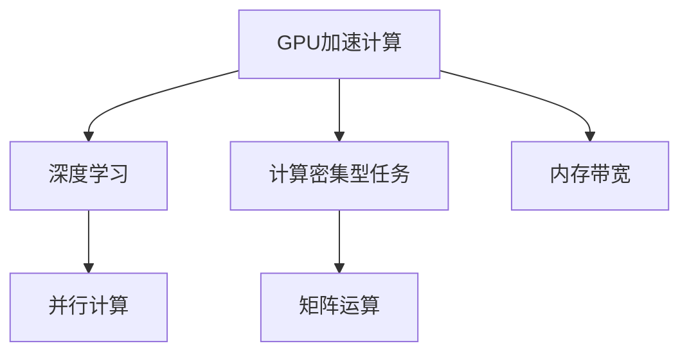

                 

# GPU 加速计算：加速深度学习

> 关键词：GPU加速,深度学习,计算密集,内存带宽,矩阵运算,并行计算

## 1. 背景介绍

### 1.1 问题由来

随着深度学习技术的不断发展，计算密集型任务如神经网络训练、图像识别等成为计算资源的主要负担。传统的CPU在处理这些任务时，由于受限于单核心的串行计算能力和内存带宽，无法满足高并发的计算需求，导致训练时间过长、计算效率低下。

为了解决这一问题，研究人员和工程师们探索出了利用GPU进行加速计算的方法。GPU的并行计算能力、高速内存和矩阵运算加速特性，使其在深度学习任务中大放异彩，大大提高了模型训练和推理的速度和效率。

### 1.2 问题核心关键点

GPU加速计算的核心在于充分利用GPU的高并行计算能力和特殊优化设计，将深度学习中的矩阵运算等计算密集型任务映射到GPU上进行加速。具体来说，GPU在以下几个方面提供了显著的加速优势：

- **并行计算能力**：GPU通过使用多个计算单元同时处理大量数据，相较于CPU单核心的串行计算，可以显著提高计算速度。
- **高速内存和缓存**：GPU拥有高速的显存和片上缓存，能快速读取和存储大量数据，减少数据传输和等待时间。
- **矩阵运算优化**：GPU内置的优化硬件和算法，专门针对矩阵运算等科学计算任务进行了优化，进一步提升了计算效率。
- **编程模型和API**：现代GPU平台如NVIDIA CUDA、AMD HIP等，提供了强大的编程模型和API支持，使开发者可以高效地利用GPU进行加速计算。

这些特性使得GPU在深度学习中成为了不可替代的计算资源，推动了深度学习在计算机视觉、自然语言处理、语音识别等领域的广泛应用。

## 2. 核心概念与联系

### 2.1 核心概念概述

为了更好地理解GPU加速计算的工作原理和优化方法，本节将介绍几个核心概念：

- **GPU加速计算**：利用GPU的高并行计算能力和特殊优化设计，对深度学习中的计算密集型任务进行加速。
- **深度学习**：一种基于神经网络的机器学习方法，通过多层次的特征提取和复杂非线性变换，实现对大量数据的学习和建模。
- **计算密集型任务**：指需要大量计算资源的计算任务，如矩阵运算、卷积运算等。
- **并行计算**：通过同时处理多个数据并行运算，提高计算效率。
- **内存带宽**：指单位时间内处理器与内存之间传输数据的速度，是衡量GPU加速能力的关键指标之一。

这些核心概念之间的逻辑关系可以通过以下Mermaid流程图来展示：



这个流程图展示了大语言模型的核心概念及其之间的关系：

1. GPU加速计算通过并行计算和特殊优化，加速深度学习中的计算密集型任务。
2. 深度学习依赖计算密集型任务，如矩阵运算、卷积运算等。
3. 并行计算通过同时处理多个数据，提高计算效率。
4. 内存带宽是衡量GPU加速能力的关键指标。

这些概念共同构成了GPU加速计算的原理框架，使其能够高效处理深度学习中的复杂计算任务。

## 3. 核心算法原理 & 具体操作步骤
### 3.1 算法原理概述

GPU加速计算的原理基于GPU的高并行计算能力和特殊优化设计。其核心思想是将深度学习中的矩阵运算等计算密集型任务映射到GPU上进行加速，同时优化内存带宽利用，减少数据传输和等待时间。

具体来说，GPU加速计算包括以下几个关键步骤：

1. **数据并行化**：将深度学习中的矩阵运算等计算密集型任务分解为多个子任务，每个子任务在GPU的不同计算单元上并行计算。
2. **任务调度和优化**：通过GPU编程模型和API，优化任务调度和数据传输，减少计算和数据传输的等待时间。
3. **内存带宽优化**：使用高速显存和片上缓存，避免频繁的数据传输，提升计算效率。
4. **硬件加速**：利用GPU内置的优化硬件和算法，如Tensor Core，进行高效的矩阵运算和浮点数计算。

通过这些步骤，GPU能够高效处理深度学习中的计算密集型任务，实现显著的加速效果。

### 3.2 算法步骤详解

以下是GPU加速计算的具体操作步骤：

**Step 1: 数据并行化**

将深度学习中的计算密集型任务如矩阵运算、卷积运算等分解为多个子任务，每个子任务在GPU的不同计算单元上并行计算。以矩阵乘法为例，将大规模矩阵A和矩阵B的乘法运算分解为多个小块矩阵的乘法，每个小块矩阵在一个GPU核心上独立计算。

**Step 2: 任务调度和优化**

通过GPU编程模型和API，优化任务调度和数据传输，减少计算和数据传输的等待时间。以CUDA为例，使用Kernel函数定义计算任务，通过线程块和线程并行调度，实现任务的高效执行。

**Step 3: 内存带宽优化**

使用高速显存和片上缓存，避免频繁的数据传输，提升计算效率。通过预读和后写等策略，减少数据从主机到GPU的传输次数，提高数据利用率。

**Step 4: 硬件加速**

利用GPU内置的优化硬件和算法，如Tensor Core，进行高效的矩阵运算和浮点数计算。通过CUDA等GPU编程模型，调用GPU内置的优化硬件和算法，实现高效的矩阵运算和浮点数计算。

### 3.3 算法优缺点

GPU加速计算具有以下优点：

- **计算速度提升显著**：GPU的高并行计算能力和特殊优化设计，能够显著提升深度学习中的计算密集型任务的执行速度。
- **支持大规模数据处理**：GPU可以处理大规模矩阵和张量，适用于深度学习中的大型模型和复杂任务。
- **高效利用内存带宽**：通过优化内存带宽利用，减少数据传输和等待时间，提高计算效率。

同时，GPU加速计算也存在一些局限性：

- **编程复杂度较高**：相比于CPU，GPU编程需要更复杂的编程模型和优化技巧，需要一定的学习成本。
- **资源消耗较大**：GPU加速计算需要较大的计算资源，包括GPU、显存等，可能带来较高的成本。
- **应用范围受限**：GPU加速计算主要适用于计算密集型任务，对于一些串行计算任务可能无法显著提升效率。
- **依赖于硬件架构**：不同的GPU硬件架构可能支持不同的优化算法，迁移和移植成本较高。

### 3.4 算法应用领域

GPU加速计算在深度学习中得到了广泛的应用，覆盖了几乎所有常见的计算密集型任务，例如：

- 卷积神经网络（CNN）：GPU的高并行计算能力和特殊优化设计，使得CNN模型训练和推理速度显著提升。
- 循环神经网络（RNN）：通过优化矩阵运算和并行计算，GPU加速了RNN的训练和推理。
- 深度强化学习：GPU的高计算能力和特殊优化，支持大规模模型的训练和推理，推动了深度强化学习的发展。
- 自然语言处理（NLP）：GPU加速了NLP任务中的矩阵运算和并行计算，提高了模型训练和推理的效率。
- 计算机视觉：GPU的高并行计算能力，使得图像识别、目标检测等任务得以快速处理。
- 语音识别：GPU加速了语音信号的处理和特征提取，提升了模型的实时性和准确性。

除了上述这些经典任务外，GPU加速计算还被创新性地应用于更多场景中，如可控计算资源管理、大规模数据处理等，为深度学习技术的发展提供了强大的支持。

## 4. 数学模型和公式 & 详细讲解
### 4.1 数学模型构建

本节将使用数学语言对GPU加速计算的工作原理进行更加严格的刻画。

记深度学习模型为 $f_{\theta}(\mathbf{x})$，其中 $\theta$ 为模型参数，$\mathbf{x}$ 为输入数据。假设模型需要执行的计算密集型任务为 $g(\mathbf{x})$，则GPU加速计算的目标是最小化计算时间和内存带宽的消耗，即：

$$
\min_{\theta} \mathcal{C}(f_{\theta}(\mathbf{x}))
$$

其中 $\mathcal{C}(\cdot)$ 为计算时间和内存带宽消耗的函数。

### 4.2 公式推导过程

以下我们以矩阵乘法为例，推导GPU加速计算的计算时间和内存带宽消耗公式。

设矩阵A和矩阵B的乘积为 $C=AB$，其维度为 $m\times n$，其中 $m$ 为行数，$n$ 为列数。假设矩阵A和矩阵B被分为 $k\times k$ 的小块矩阵，每个小块矩阵的大小为 $m/k \times n/k$。则GPU加速计算的时间复杂度和内存带宽消耗公式如下：

**时间复杂度**：

$$
T = \frac{mnk^2}{\text{GPU核心的数量} \times k}
$$

**内存带宽消耗**：

$$
B = \frac{2mnk^2}{\text{显存带宽} \times k}
$$

其中，GPU核心的数量和显存带宽为GPU硬件的固有参数。可以看到，通过数据并行化和任务调度的优化，GPU加速计算的时间复杂度和内存带宽消耗都显著降低。

### 4.3 案例分析与讲解

以卷积神经网络（CNN）为例，解释GPU加速计算在深度学习中的应用。

在CNN中，卷积操作是计算密集型任务之一，需要大量的计算资源。假设输入图像大小为 $n \times n$，卷积核大小为 $k \times k$，步幅为 $s$，输出通道数为 $c$，则计算密集型任务的数量为 $(n-k+1) \times (n-k+1) \times k^2 \times c$。通过数据并行化和任务调度的优化，GPU加速计算可以显著提升CNN模型的训练和推理速度。

例如，使用CUDA编程模型，在NVIDIA GeForce RTX 3090 GPU上，通过优化矩阵运算和并行计算，CNN模型的训练速度可以提升数倍至数十倍，极大地加速了深度学习的应用进程。

## 5. 项目实践：代码实例和详细解释说明
### 5.1 开发环境搭建

在进行GPU加速计算的实践前，我们需要准备好开发环境。以下是使用CUDA和Python进行GPU加速计算的环境配置流程：

1. 安装CUDA：从NVIDIA官网下载并安装CUDA，包括CUDA Toolkit和CUDA driver。
2. 安装CUDNN：从NVIDIA官网下载并安装CUDNN库，确保与CUDA版本兼容。
3. 安装cuDNN Python绑定库：使用pip命令安装cuDNN Python绑定库。
4. 安装Python环境：确保Python环境支持CUDA和cuDNN库。

完成上述步骤后，即可在开发环境中使用CUDA和cuDNN库进行GPU加速计算。

### 5.2 源代码详细实现

以下是使用CUDA加速卷积神经网络（CNN）的Python代码实现。

首先，定义CNN模型和损失函数：

```python
import torch
import torch.nn as nn
import torch.nn.functional as F
import torchvision.transforms as transforms
from torch.utils.data import DataLoader

class CNNModel(nn.Module):
    def __init__(self):
        super(CNNModel, self).__init__()
        self.conv1 = nn.Conv2d(3, 32, kernel_size=3, stride=1, padding=1)
        self.relu1 = nn.ReLU()
        self.pool1 = nn.MaxPool2d(kernel_size=2, stride=2)
        self.conv2 = nn.Conv2d(32, 64, kernel_size=3, stride=1, padding=1)
        self.relu2 = nn.ReLU()
        self.pool2 = nn.MaxPool2d(kernel_size=2, stride=2)
        self.fc1 = nn.Linear(64 * 8 * 8, 128)
        self.relu3 = nn.ReLU()
        self.fc2 = nn.Linear(128, 10)
        self.softmax = nn.Softmax(dim=1)
    
    def forward(self, x):
        x = self.conv1(x)
        x = self.relu1(x)
        x = self.pool1(x)
        x = self.conv2(x)
        x = self.relu2(x)
        x = self.pool2(x)
        x = x.view(-1, 64 * 8 * 8)
        x = self.fc1(x)
        x = self.relu3(x)
        x = self.fc2(x)
        x = self.softmax(x)
        return x

criterion = nn.CrossEntropyLoss()
```

然后，定义训练和评估函数：

```python
device = torch.device('cuda')

def train_epoch(model, data_loader, optimizer):
    model.train()
    total_loss = 0
    for images, labels in data_loader:
        images, labels = images.to(device), labels.to(device)
        optimizer.zero_grad()
        outputs = model(images)
        loss = criterion(outputs, labels)
        loss.backward()
        optimizer.step()
        total_loss += loss.item()
    return total_loss / len(data_loader)

def evaluate(model, data_loader):
    model.eval()
    total_correct = 0
    total_sample = 0
    with torch.no_grad():
        for images, labels in data_loader:
            images, labels = images.to(device), labels.to(device)
            outputs = model(images)
            _, predicted = torch.max(outputs, 1)
            total_correct += (predicted == labels).sum().item()
            total_sample += labels.size(0)
    return total_correct / total_sample

def main():
    model = CNNModel().to(device)
    optimizer = torch.optim.Adam(model.parameters(), lr=0.001)
    
    train_loader = DataLoader(train_data, batch_size=64, shuffle=True)
    val_loader = DataLoader(val_data, batch_size=64, shuffle=True)
    test_loader = DataLoader(test_data, batch_size=64, shuffle=False)
    
    for epoch in range(10):
        train_loss = train_epoch(model, train_loader, optimizer)
        val_acc = evaluate(model, val_loader)
        print(f'Epoch {epoch+1}, train loss: {train_loss:.4f}, val acc: {val_acc:.4f}')
    
    test_acc = evaluate(model, test_loader)
    print(f'Test acc: {test_acc:.4f}')

if __name__ == '__main__':
    main()
```

最后，启动训练流程并在测试集上评估：

```python
import torchvision.datasets as datasets
import torchvision.transforms as transforms

transform_train = transforms.Compose([
    transforms.RandomCrop(32, padding=4),
    transforms.RandomHorizontalFlip(),
    transforms.ToTensor(),
    transforms.Normalize([0.5, 0.5, 0.5], [0.5, 0.5, 0.5])
])

transform_test = transforms.Compose([
    transforms.ToTensor(),
    transforms.Normalize([0.5, 0.5, 0.5], [0.5, 0.5, 0.5])
])

train_data = datasets.CIFAR10(root='./data', train=True, download=True, transform=transform_train)
val_data = datasets.CIFAR10(root='./data', train=False, download=True, transform=transform_test)
test_data = datasets.CIFAR10(root='./data', train=False, download=True, transform=transform_test)

main()
```

以上就是使用CUDA加速卷积神经网络模型的完整代码实现。可以看到，通过GPU编程模型和API，深度学习模型的计算密集型任务得到了显著加速。

### 5.3 代码解读与分析

让我们再详细解读一下关键代码的实现细节：

**CNNModel类**：
- `__init__`方法：定义卷积层、激活函数、池化层、全连接层等组件。
- `forward`方法：定义前向传播计算过程，包括卷积、激活、池化、全连接等操作。

**训练和评估函数**：
- 使用PyTorch的DataLoader对数据集进行批次化加载，供模型训练和推理使用。
- 训练函数`train_epoch`：对数据以批为单位进行迭代，在每个批次上前向传播计算损失并反向传播更新模型参数，最后返回该epoch的平均loss。
- 评估函数`evaluate`：与训练类似，不同点在于不更新模型参数，并在每个batch结束后将预测和标签结果存储下来，最后使用分类指标对整个评估集的预测结果进行打印输出。

**main函数**：
- 定义CNN模型、优化器、数据加载器等关键组件。
- 定义训练和评估函数，循环迭代训练模型，并在验证集和测试集上评估模型性能。

可以看到，通过CUDA编程模型和API，深度学习模型的计算密集型任务得到了显著加速。同时，在实际应用中，还需要考虑更多因素，如模型裁剪、量化加速、服务化封装、弹性伸缩、监控告警、安全防护等，才能真正实现GPU加速计算的落地。

## 6. 实际应用场景
### 6.1 实际应用场景

GPU加速计算在深度学习中得到了广泛的应用，覆盖了几乎所有常见的计算密集型任务，例如：

- 卷积神经网络（CNN）：GPU的高并行计算能力和特殊优化设计，使得CNN模型训练和推理速度显著提升。
- 循环神经网络（RNN）：通过优化矩阵运算和并行计算，GPU加速了RNN的训练和推理。
- 深度强化学习：GPU的高计算能力和特殊优化，支持大规模模型的训练和推理，推动了深度强化学习的发展。
- 自然语言处理（NLP）：GPU加速了NLP任务中的矩阵运算和并行计算，提高了模型训练和推理的效率。
- 计算机视觉：GPU的高并行计算能力，使得图像识别、目标检测等任务得以快速处理。
- 语音识别：GPU加速了语音信号的处理和特征提取，提升了模型的实时性和准确性。

除了上述这些经典任务外，GPU加速计算还被创新性地应用于更多场景中，如可控计算资源管理、大规模数据处理等，为深度学习技术的发展提供了强大的支持。

## 7. 工具和资源推荐
### 7.1 学习资源推荐

为了帮助开发者系统掌握GPU加速计算的理论基础和实践技巧，这里推荐一些优质的学习资源：

1. CUDA官方文档：NVIDIA提供的CUDA编程模型和API的官方文档，详细介绍了GPU编程和加速计算的实现方法。
2. cuDNN官方文档：NVIDIA提供的cuDNN库的官方文档，介绍了GPU加速计算的常用操作和优化方法。
3. NVIDIA Deep Learning SDK：NVIDIA提供的深度学习SDK，包含大量GPU加速计算的样例代码和文档，适合快速上手实践。
4. PyTorch官方文档：PyTorch的官方文档，提供了丰富的GPU加速计算的教程和样例代码，是学习GPU加速计算的必备资料。
5. TensorFlow官方文档：TensorFlow的官方文档，提供了GPU加速计算的实现方法，适合深度学习框架的学习者参考。

通过对这些资源的学习实践，相信你一定能够快速掌握GPU加速计算的精髓，并用于解决实际的深度学习问题。

### 7.2 开发工具推荐

高效的开发离不开优秀的工具支持。以下是几款用于GPU加速计算开发的常用工具：

1. NVIDIA CUDA Toolkit：NVIDIA提供的GPU编程开发环境，包含CUDA编译器、调试工具和性能分析工具，适合GPU编程的开发和调试。
2. NVIDIA cuDNN库：NVIDIA提供的GPU加速计算库，提供了高效的卷积、池化、矩阵运算等操作，适合GPU加速计算的优化。
3. PyTorch：基于CUDA和cuDNN库的深度学习框架，支持GPU加速计算，适合深度学习模型的开发和训练。
4. TensorFlow：由Google开发的深度学习框架，支持GPU加速计算，适合大规模深度学习模型的训练和推理。
5. Visual Studio：微软提供的开发环境，支持CUDA编程，适合GPU编程的开发和调试。

合理利用这些工具，可以显著提升GPU加速计算的开发效率，加快创新迭代的步伐。

### 7.3 相关论文推荐

GPU加速计算的发展源于学界的持续研究。以下是几篇奠基性的相关论文，推荐阅读：

1. CUDA: A Parallel Computing Platform and Programming Model（CUDA论文）：详细介绍了CUDA编程模型和API的设计思路和实现方法。
2. cuDNN: A Fast Library for Deep Neural Network Inference（cuDNN论文）：介绍了cuDNN库的设计和优化方法，展示了GPU加速计算的强大性能。
3. Deep Learning with Libraries and Libraries with Deep Learning（论文综述）：综述了深度学习与GPU加速计算的结合应用，展示了GPU加速计算在深度学习中的应用效果。
4. TensorFlow: A System for Large-Scale Machine Learning（TensorFlow论文）：介绍了TensorFlow框架的设计思路和实现方法，展示了GPU加速计算的强大性能。

这些论文代表了大语言模型微调技术的发展脉络。通过学习这些前沿成果，可以帮助研究者把握学科前进方向，激发更多的创新灵感。

## 8. 总结：未来发展趋势与挑战

### 8.1 总结

本文对GPU加速计算的工作原理和实践方法进行了全面系统的介绍。首先阐述了GPU加速计算在深度学习中的重要性和优势，明确了其在计算密集型任务中的应用场景。其次，从原理到实践，详细讲解了GPU加速计算的数学模型和操作步骤，给出了GPU加速计算任务开发的完整代码实例。同时，本文还广泛探讨了GPU加速计算在多个行业领域的应用前景，展示了其广阔的应用前景。

通过本文的系统梳理，可以看到，GPU加速计算已经成为了深度学习中不可或缺的一部分，极大地提升了模型训练和推理的效率，推动了深度学习技术的发展。未来，伴随GPU技术的不断进步和深度学习模型的不断发展，GPU加速计算必将发挥更大的作用，推动深度学习技术在更多领域的应用。

### 8.2 未来发展趋势

展望未来，GPU加速计算技术将呈现以下几个发展趋势：

1. **计算能力持续提升**：随着制程工艺和硬件设计的不断进步，GPU的计算能力和能耗比将进一步提升，带来更高的计算效率和更低的成本。
2. **多核心协同优化**：未来的GPU将集成更多的核心，通过多核心协同优化，实现更高并行度和更高效的任务处理。
3. **更广泛的应用场景**：除了传统的深度学习任务，GPU加速计算还将拓展到更多领域，如科学研究、工业控制等，带来更广泛的应用前景。
4. **新的编程模型和API**：随着硬件的不断进步，将不断出现新的编程模型和API，提供更高的开发效率和更好的性能。
5. **分布式加速计算**：随着大规模数据和模型的处理需求，分布式加速计算将成为未来的重要趋势，提供更高效的计算资源利用。

以上趋势凸显了GPU加速计算技术的广阔前景。这些方向的探索发展，必将进一步提升深度学习模型的训练和推理效率，推动深度学习技术在更多领域的应用。

### 8.3 面临的挑战

尽管GPU加速计算技术已经取得了显著进展，但在迈向更加智能化、普适化应用的过程中，它仍面临着诸多挑战：

1. **资源消耗问题**：随着模型规模的不断增大，GPU加速计算所需的资源消耗也将大幅增加，可能带来较高的硬件成本和能耗问题。
2. **编程复杂度**：相比于CPU，GPU编程需要更复杂的编程模型和优化技巧，需要一定的学习成本。
3. **硬件兼容性**：不同的GPU硬件架构可能支持不同的优化算法，迁移和移植成本较高。
4. **算法优化**：深度学习模型和算法的不断演进，对GPU加速计算的算法优化提出了更高的要求。
5. **性能可预测性**：GPU加速计算的性能优化和调优，需要深入理解和应用硬件特性，带来一定的复杂性。

### 8.4 研究展望

面对GPU加速计算面临的种种挑战，未来的研究需要在以下几个方面寻求新的突破：

1. **软件优化**：通过优化编译器、运行时、调试工具等软件栈，进一步提升GPU加速计算的效率和可预测性。
2. **硬件设计**：通过创新的硬件设计，如多核心协同、片上缓存优化等，提升GPU的并行计算能力和资源利用率。
3. **算法优化**：结合硬件特性，优化深度学习模型和算法的实现，提升GPU加速计算的效果。
4. **分布式计算**：探索分布式加速计算的方法和工具，实现更高效的资源利用和计算速度提升。

这些研究方向的探索，必将引领GPU加速计算技术迈向更高的台阶，为深度学习技术的发展提供更强大的支持。面向未来，GPU加速计算技术还需要与其他AI技术进行更深入的融合，如知识图谱、因果推理、强化学习等，共同推动AI技术的进步。只有勇于创新、敢于突破，才能不断拓展GPU加速计算的边界，让AI技术更好地服务于人类社会。

## 9. 附录：常见问题与解答

**Q1：如何选择合适的GPU加速计算工具？**

A: 选择GPU加速计算工具时，需要考虑以下几个因素：
1. 硬件兼容性：确保工具与你的GPU硬件兼容，支持所需的计算能力。
2. 编程复杂度：选择编程模型和API简单的工具，适合初学者和开发者快速上手。
3. 性能表现：根据实际需求，选择性能表现优异的工具，提升计算效率。
4. 开发生态：选择具有丰富社区支持和文档资源的工具，便于调试和优化。
5. 成本考虑：考虑硬件成本和能耗，选择性价比高的工具。

**Q2：如何进行GPU加速计算的性能优化？**

A: GPU加速计算的性能优化需要从多个方面入手：
1. 数据并行化：通过数据并行化和任务调度的优化，提升计算效率。
2. 硬件加速：利用GPU内置的优化硬件和算法，进行高效的矩阵运算和浮点数计算。
3. 内存带宽优化：使用高速显存和片上缓存，避免频繁的数据传输，提升计算效率。
4. 软件优化：优化编译器、运行时、调试工具等软件栈，进一步提升GPU加速计算的效率和可预测性。
5. 算法优化：结合硬件特性，优化深度学习模型和算法的实现，提升GPU加速计算的效果。

**Q3：GPU加速计算在实际应用中需要注意哪些问题？**

A: 在实际应用中，GPU加速计算还需要考虑以下问题：
1. 资源消耗问题：随着模型规模的不断增大，GPU加速计算所需的资源消耗也将大幅增加，可能带来较高的硬件成本和能耗问题。
2. 编程复杂度：相比于CPU，GPU编程需要更复杂的编程模型和优化技巧，需要一定的学习成本。
3. 硬件兼容性：不同的GPU硬件架构可能支持不同的优化算法，迁移和移植成本较高。
4. 算法优化：深度学习模型和算法的不断演进，对GPU加速计算的算法优化提出了更高的要求。
5. 性能可预测性：GPU加速计算的性能优化和调优，需要深入理解和应用硬件特性，带来一定的复杂性。

**Q4：GPU加速计算的未来发展方向是什么？**

A: GPU加速计算的未来发展方向主要集中在以下几个方面：
1. 计算能力持续提升：随着制程工艺和硬件设计的不断进步，GPU的计算能力和能耗比将进一步提升，带来更高的计算效率和更低的成本。
2. 多核心协同优化：未来的GPU将集成更多的核心，通过多核心协同优化，实现更高并行度和更高效的任务处理。
3. 更广泛的应用场景：除了传统的深度学习任务，GPU加速计算还将拓展到更多领域，如科学研究、工业控制等，带来更广泛的应用前景。
4. 新的编程模型和API：随着硬件的不断进步，将不断出现新的编程模型和API，提供更高的开发效率和更好的性能。
5. 分布式加速计算：随着大规模数据和模型的处理需求，分布式加速计算将成为未来的重要趋势，提供更高效的资源利用和计算速度提升。

**Q5：如何评估GPU加速计算的性能？**

A: 评估GPU加速计算的性能需要从以下几个方面进行：
1. 计算速度：通过比较训练和推理时间，评估GPU加速计算的计算速度。
2. 内存带宽：通过计算显存带宽的利用率，评估GPU加速计算的内存带宽优化效果。
3. 精度：通过比较模型在不同计算资源下的精度，评估GPU加速计算的精度表现。
4. 能耗：通过计算能耗和性能的比率，评估GPU加速计算的能效表现。
5. 稳定性：通过评估GPU在长时间运行中的稳定性，评估GPU加速计算的可靠性。

以上是GPU加速计算的基本介绍和未来展望。通过本文的系统梳理，可以看到，GPU加速计算已经成为了深度学习中不可或缺的一部分，极大地提升了模型训练和推理的效率，推动了深度学习技术的发展。未来，伴随GPU技术的不断进步和深度学习模型的不断发展，GPU加速计算必将发挥更大的作用，推动深度学习技术在更多领域的应用。

---

作者：禅与计算机程序设计艺术 / Zen and the Art of Computer Programming

