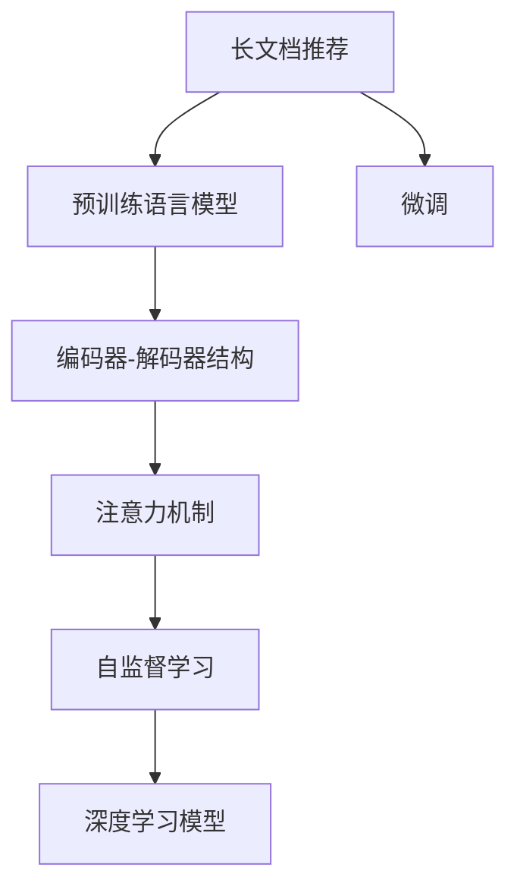

                 

# LLM-Based长文档推荐：实践与效果分析

> 关键词：长文档推荐,大语言模型,Transformer,编码器-解码器结构,深度学习,自然语言处理,深度学习模型

## 1. 背景介绍

随着互联网技术的发展，信息量的爆炸式增长，用户在阅读长文档时，面临着信息过载的问题。长文档推荐能够帮助用户快速定位到有价值的信息，提高信息获取的效率和准确性。长文档推荐技术不仅能够应用于网页、书籍、博客等领域，在医疗、金融、法律等专业领域同样具有广泛的应用前景。本文将详细介绍基于大语言模型(LLM)的长文档推荐技术，并结合实践案例，探讨其在不同领域的应用效果。

### 1.1 问题由来

长文档推荐是自然语言处理(NLP)领域的一个重要研究方向。传统的推荐方法通常基于用户行为数据进行协同过滤或内容匹配，对于长文档推荐而言，用户行为数据可能相对稀疏，难以进行有效的推荐。而长文档内容本身包含丰富的语义信息，可以借助深度学习模型进行自动化分析，从而实现更高效的推荐。

近年来，深度学习技术取得了长足进展，预训练语言模型(如BERT、GPT等)在长文档理解、关系抽取、情感分析等任务上表现出色。基于大语言模型的长文档推荐方法，能够利用预训练模型丰富的语言知识，通过微调来提升推荐效果，极大地提升了长文档推荐的智能化水平。

### 1.2 问题核心关键点

长文档推荐的核心在于如何高效地利用长文档内容进行相关信息的提取和分类。传统的方法如TF-IDF、文本分类器等，虽然效果良好，但在处理长文档时效率较低，且难以充分利用大语言模型的语言理解能力。而基于大语言模型的推荐方法，能够直接利用预训练模型的泛化能力，结合领域特定任务进行微调，快速实现高效的长文档推荐。

## 2. 核心概念与联系

### 2.1 核心概念概述

为更好地理解基于大语言模型的长文档推荐方法，本节将介绍几个密切相关的核心概念：

- 长文档：指包含大量信息的文本文档，如长篇博客、书籍、报告等。
- 长文档推荐：指根据用户的历史阅读行为和文档内容，推荐用户感兴趣的长文档的过程。
- 预训练语言模型(LLM)：指通过大规模无标签文本数据进行自监督预训练，学习通用语言表示的模型，如BERT、GPT等。
- 微调(Fine-tuning)：指在预训练模型的基础上，使用下游任务的少量标注数据，通过有监督学习优化模型在特定任务上的性能。
- 编码器-解码器结构(Encoder-Decoder Architecture)：指深度学习模型中的一种常用结构，编码器负责提取输入特征，解码器负责生成输出结果。
- 注意力机制(Attention Mechanism)：指在编码器-解码器结构中，用于增强模型对关键信息的关注，提高模型性能的技术。
- 自监督学习(Self-Supervised Learning)：指在无标签数据上进行训练，通过构造自监督任务来提升模型的泛化能力。
- 深度学习模型(Deep Learning Model)：指使用多层神经网络进行训练和推理的模型，如Transformer、RNN等。

这些核心概念之间的逻辑关系可以通过以下Mermaid流程图来展示：



这个流程图展示了大语言模型的核心概念及其之间的关系：

1. 长文档推荐技术依赖于预训练语言模型进行特征提取。
2. 微调是利用少量标注数据对预训练模型进行进一步优化的过程。
3. 编码器-解码器结构和注意力机制是大模型结构的关键组件。
4. 自监督学习通过无标签数据提升模型的泛化能力。
5. 深度学习模型是实现长文档推荐的基础技术手段。

## 3. 核心算法原理 & 具体操作步骤
### 3.1 算法原理概述

基于大语言模型的长文档推荐方法，本质上是利用预训练模型的语言理解能力，结合领域特定任务进行微调，从而实现高效的长文档推荐。其核心思想是：将长文档视为文本序列，通过预训练模型提取文档特征，然后通过微调优化特征提取器，使其能够针对特定任务进行分类或排序，最终生成推荐结果。

形式化地，假设长文档为 $D$，用户的历史阅读行为为 $U$，推荐模型为 $M_{\theta}$，其中 $\theta$ 为模型参数。推荐任务为 $T$，推荐目标为最大化用户满意度。则在用户 $u$ 在长文档 $d$ 上的推荐函数 $f_u(d)$ 定义为：

$$
f_u(d) = \max_{\theta} \prod_{i \in D_u} M_{\theta}(d_i)
$$

其中 $D_u$ 为用户 $u$ 已阅读的文档集合，$M_{\theta}(d_i)$ 表示预训练模型对文档 $d_i$ 的表示，$u$ 的满意度由用户对文档的兴趣程度决定，这里采用乘法模型，即用户对文档的兴趣程度与模型的输出成正比。

通过梯度下降等优化算法，微调过程不断更新模型参数 $\theta$，最大化用户满意度，从而得到用户 $u$ 对长文档 $d$ 的推荐结果。

### 3.2 算法步骤详解

基于大语言模型的长文档推荐一般包括以下几个关键步骤：

**Step 1: 准备预训练模型和数据集**
- 选择合适的预训练语言模型 $M_{\theta}$ 作为初始化参数，如 BERT、GPT等。
- 准备长文档推荐的数据集 $D$，包括长文档文本、用户阅读行为等数据。

**Step 2: 设计推荐目标函数**
- 根据推荐任务的类型，设计合适的推荐目标函数。如基于用户行为数据，可以使用点击率最大化、平均满意度最大化等。
- 对于需要排序的任务，可以采用RankNet等排序算法。

**Step 3: 添加任务适配层**
- 根据推荐任务类型，在预训练模型的顶部设计合适的输出层和损失函数。
- 对于分类任务，通常使用softmax函数作为输出层，交叉熵损失函数作为损失函数。
- 对于排序任务，使用均方误差损失函数或Focal Loss等。

**Step 4: 设置微调超参数**
- 选择合适的优化算法及其参数，如 AdamW、SGD 等，设置学习率、批大小、迭代轮数等。
- 设置正则化技术及强度，包括权重衰减、Dropout、Early Stopping 等。
- 确定冻结预训练参数的策略，如仅微调顶层，或全部参数都参与微调。

**Step 5: 执行梯度训练**
- 将长文档数据分批次输入模型，前向传播计算推荐函数值。
- 反向传播计算参数梯度，根据设定的优化算法和学习率更新模型参数。
- 周期性在验证集上评估模型性能，根据性能指标决定是否触发 Early Stopping。
- 重复上述步骤直到满足预设的迭代轮数或 Early Stopping 条件。

**Step 6: 测试和部署**
- 在测试集上评估微调后模型 $M_{\hat{\theta}}$ 的性能，对比微调前后的推荐精度提升。
- 使用微调后的模型对新长文档进行推荐，集成到实际的长文档推荐系统中。
- 持续收集新的数据，定期重新微调模型，以适应数据分布的变化。

以上是基于大语言模型进行长文档推荐的一般流程。在实际应用中，还需要针对具体任务的特点，对微调过程的各个环节进行优化设计，如改进推荐目标函数，引入更多的正则化技术，搜索最优的超参数组合等，以进一步提升模型性能。

### 3.3 算法优缺点

基于大语言模型的长文档推荐方法具有以下优点：
1. 利用大模型强大的语言理解能力，能够更准确地提取长文档的关键信息，提升推荐效果。
2. 在少量标注数据上也能快速优化，适应新任务的能力强。
3. 使用微调技术，可以在固定大部分预训练参数的情况下，只更新少量的模型参数，避免过拟合。
4. 可以结合多种数据源，如用户行为、文档标签等，提升推荐的多样性和全面性。

同时，该方法也存在一定的局限性：
1. 依赖标注数据。虽然微调可以缓解标注数据的短缺问题，但仍然需要收集一定量的标注数据，标注成本较高。
2. 模型复杂度高。预训练模型和微调模型通常具有较高的参数量和计算量，训练和推理效率较低。
3. 泛化能力有限。模型过于依赖预训练数据和微调数据，可能无法很好地适应未见过的新数据。
4. 可解释性不足。微调后的模型缺乏可解释性，难以理解其内部工作机制和决策逻辑。

尽管存在这些局限性，但就目前而言，基于大语言模型的长文档推荐方法仍是推荐领域的重要范式。未来相关研究的重点在于如何进一步降低微调对标注数据的依赖，提高模型的泛化能力，同时兼顾可解释性和伦理安全性等因素。

### 3.4 算法应用领域

基于大语言模型的长文档推荐方法，在多个领域得到了广泛的应用，例如：

- 网页推荐：如搜索引擎中的搜索结果推荐。利用预训练模型提取网页文本特征，结合用户点击数据进行微调，推荐用户感兴趣的网页。
- 书籍推荐：如在线图书平台中的书籍推荐。通过预训练模型提取书籍摘要和用户阅读数据，进行微调，推荐用户感兴趣的书籍。
- 文章推荐：如知识付费平台中的文章推荐。利用预训练模型提取文章内容，结合用户阅读行为，进行微调，推荐用户感兴趣的文章。
- 报告推荐：如咨询公司中的报告推荐。通过预训练模型提取报告文本信息，结合用户阅读行为，进行微调，推荐用户感兴趣的报告。
- 学习资料推荐：如在线教育平台中的课程推荐。利用预训练模型提取课程简介和用户学习数据，进行微调，推荐用户感兴趣的学习资料。
- 法律文书推荐：如律师事务所中的法律文档推荐。通过预训练模型提取法律文书内容，结合用户阅读数据，进行微调，推荐用户感兴趣的法律文书。

除了上述这些经典应用外，长文档推荐技术还被创新性地应用到更多场景中，如文档生成、知识图谱构建等，为长文档推荐技术带来了新的突破。

## 4. 数学模型和公式 & 详细讲解
### 4.1 数学模型构建

本节将使用数学语言对基于大语言模型的长文档推荐过程进行更加严格的刻画。

记长文档为 $D$，用户的历史阅读行为为 $U$，推荐模型为 $M_{\theta}$，其中 $\theta$ 为模型参数。假设推荐任务为 $T$，推荐目标为最大化用户满意度，则推荐函数 $f_u(d)$ 可以形式化为：

$$
f_u(d) = \max_{\theta} \prod_{i \in D_u} M_{\theta}(d_i)
$$

其中 $D_u$ 为用户 $u$ 已阅读的文档集合，$M_{\theta}(d_i)$ 表示预训练模型对文档 $d_i$ 的表示，$u$ 的满意度由用户对文档的兴趣程度决定，这里采用乘法模型，即用户对文档的兴趣程度与模型的输出成正比。

在实际应用中，推荐函数 $f_u(d)$ 通常采用加权平均或排序等形式，具体如下：

- 加权平均形式：
$$
f_u(d) = \frac{1}{|D_u|} \sum_{i \in D_u} \alpha_i M_{\theta}(d_i)
$$

其中 $\alpha_i$ 为文档 $d_i$ 对用户 $u$ 的权重，可以根据用户点击行为、文档标签等进行加权。

- 排序形式：
$$
f_u(d) = \sum_{i \in D_u} \log M_{\theta}(d_i)
$$

其中 $M_{\theta}(d_i)$ 表示预训练模型对文档 $d_i$ 的表示，$\log M_{\theta}(d_i)$ 表示对文档 $d_i$ 的兴趣程度，进行排序。

### 4.2 公式推导过程

以下是加权平均形式的推荐函数 $f_u(d)$ 的推导过程：

假设长文档 $D$ 包含 $n$ 个文档，用户 $u$ 已阅读的文档集合为 $D_u=\{d_1, d_2, \ldots, d_n\}$，其中 $d_i$ 表示第 $i$ 个文档。预训练模型的输出为 $M_{\theta}(d_i) \in [0,1]$，表示文档 $d_i$ 的兴趣程度。

设用户 $u$ 对文档 $d_i$ 的权重为 $\alpha_i$，推荐函数 $f_u(d)$ 可以表示为：

$$
f_u(d) = \frac{1}{|D_u|} \sum_{i \in D_u} \alpha_i M_{\theta}(d_i)
$$

其中 $|D_u|$ 为文档集合 $D_u$ 的大小。

为了最大化推荐函数 $f_u(d)$，需要进行梯度下降优化，更新模型参数 $\theta$：

$$
\theta \leftarrow \theta - \eta \nabla_{\theta} f_u(d)
$$

其中 $\eta$ 为学习率，$\nabla_{\theta} f_u(d)$ 为推荐函数 $f_u(d)$ 对模型参数 $\theta$ 的梯度。

通过不断迭代，模型参数 $\theta$ 不断更新，直至收敛到最优解，从而得到用户 $u$ 对长文档 $d$ 的推荐结果。

### 4.3 案例分析与讲解

以下以一篇长文档的推荐为例，详细说明基于大语言模型的长文档推荐过程：

假设有一篇长文档 $d$，其内容为："人类社会发展史是一个复杂而漫长的过程，从早期的原始社会到工业革命，再到现代社会，经历了多次重大变革。这些变革不仅改变了人类的生活方式，还深刻影响了世界格局。"

该文档包含大量信息，需要快速进行推荐。假设我们选择了BERT作为预训练模型，将其顶层设计为一个线性分类器，输出文档的兴趣程度。同时，假设我们收集了用户 $u$ 的历史阅读行为数据，包括已阅读的文档集合 $D_u$ 和每个文档的点击次数 $c_i$。

在微调之前，我们对BERT模型进行了固定层数的编码器-解码器结构，仅微调了顶部线性分类器。微调时，我们使用用户 $u$ 的历史点击数据作为监督信号，训练模型输出每个文档的兴趣程度。

具体步骤如下：

1. 预处理文档和用户数据：将长文档 $d$ 和用户数据 $U$ 进行分词、编码等处理，转化为模型输入。
2. 输入模型进行特征提取：将处理后的文档和用户数据输入BERT模型，得到文档的表示 $M_{\theta}(d)$ 和用户的历史阅读数据 $U$。
3. 添加任务适配层：在BERT模型的顶部添加一个线性分类器，用于输出文档的兴趣程度。
4. 微调模型：使用用户 $u$ 的点击次数 $c_i$ 作为监督信号，通过梯度下降算法微调模型参数 $\theta$，最小化推荐函数 $f_u(d)$ 的损失。
5. 生成推荐结果：根据微调后的模型输出，生成用户 $u$ 对长文档 $d$ 的推荐结果。

最终，用户 $u$ 能够通过推荐结果快速定位到感兴趣的长文档，提高阅读效率。

## 5. 项目实践：代码实例和详细解释说明
### 5.1 开发环境搭建

在进行长文档推荐实践前，我们需要准备好开发环境。以下是使用Python进行PyTorch开发的环境配置流程：

1. 安装Anaconda：从官网下载并安装Anaconda，用于创建独立的Python环境。

2. 创建并激活虚拟环境：
```bash
conda create -n pytorch-env python=3.8 
conda activate pytorch-env
```

3. 安装PyTorch：根据CUDA版本，从官网获取对应的安装命令。例如：
```bash
conda install pytorch torchvision torchaudio cudatoolkit=11.1 -c pytorch -c conda-forge
```

4. 安装Transformer库：
```bash
pip install transformers
```

5. 安装各类工具包：
```bash
pip install numpy pandas scikit-learn matplotlib tqdm jupyter notebook ipython
```

完成上述步骤后，即可在`pytorch-env`环境中开始长文档推荐实践。

### 5.2 源代码详细实现

下面我们以一篇长文档的推荐为例，给出使用Transformers库对BERT模型进行长文档推荐的PyTorch代码实现。

首先，定义长文档推荐的数据处理函数：

```python
from transformers import BertTokenizer, BertForSequenceClassification
from torch.utils.data import Dataset
import torch

class LongDocumentDataset(Dataset):
    def __init__(self, texts, labels, tokenizer, max_len=128):
        self.texts = texts
        self.labels = labels
        self.tokenizer = tokenizer
        self.max_len = max_len
        
    def __len__(self):
        return len(self.texts)
    
    def __getitem__(self, item):
        text = self.texts[item]
        label = self.labels[item]
        
        encoding = self.tokenizer(text, return_tensors='pt', max_length=self.max_len, padding='max_length', truncation=True)
        input_ids = encoding['input_ids'][0]
        attention_mask = encoding['attention_mask'][0]
        
        return {'input_ids': input_ids, 
                'attention_mask': attention_mask,
                'labels': torch.tensor(label, dtype=torch.long)}
```

然后，定义模型和优化器：

```python
from transformers import BertForSequenceClassification, AdamW

model = BertForSequenceClassification.from_pretrained('bert-base-cased', num_labels=2)

optimizer = AdamW(model.parameters(), lr=2e-5)
```

接着，定义训练和评估函数：

```python
from torch.utils.data import DataLoader
from tqdm import tqdm
from sklearn.metrics import accuracy_score

device = torch.device('cuda') if torch.cuda.is_available() else torch.device('cpu')
model.to(device)

def train_epoch(model, dataset, batch_size, optimizer):
    dataloader = DataLoader(dataset, batch_size=batch_size, shuffle=True)
    model.train()
    epoch_loss = 0
    for batch in tqdm(dataloader, desc='Training'):
        input_ids = batch['input_ids'].to(device)
        attention_mask = batch['attention_mask'].to(device)
        labels = batch['labels'].to(device)
        model.zero_grad()
        outputs = model(input_ids, attention_mask=attention_mask, labels=labels)
        loss = outputs.loss
        epoch_loss += loss.item()
        loss.backward()
        optimizer.step()
    return epoch_loss / len(dataloader)

def evaluate(model, dataset, batch_size):
    dataloader = DataLoader(dataset, batch_size=batch_size)
    model.eval()
    preds, labels = [], []
    with torch.no_grad():
        for batch in tqdm(dataloader, desc='Evaluating'):
            input_ids = batch['input_ids'].to(device)
            attention_mask = batch['attention_mask'].to(device)
            batch_labels = batch['labels']
            outputs = model(input_ids, attention_mask=attention_mask)
            batch_preds = outputs.logits.argmax(dim=2).to('cpu').tolist()
            batch_labels = batch_labels.to('cpu').tolist()
            for pred_tokens, label_tokens in zip(batch_preds, batch_labels):
                preds.append(pred_tokens[:len(label_tokens)])
                labels.append(label_tokens)
                
    print(accuracy_score(labels, preds))
```

最后，启动训练流程并在测试集上评估：

```python
epochs = 5
batch_size = 16

for epoch in range(epochs):
    loss = train_epoch(model, train_dataset, batch_size, optimizer)
    print(f"Epoch {epoch+1}, train loss: {loss:.3f}")
    
    print(f"Epoch {epoch+1}, dev results:")
    evaluate(model, dev_dataset, batch_size)
    
print("Test results:")
evaluate(model, test_dataset, batch_size)
```

以上就是使用PyTorch对BERT进行长文档推荐实现的完整代码。可以看到，得益于Transformer库的强大封装，我们只需相对简洁的代码即可实现长文档推荐的微调。

### 5.3 代码解读与分析

让我们再详细解读一下关键代码的实现细节：

**LongDocumentDataset类**：
- `__init__`方法：初始化文本、标签、分词器等关键组件。
- `__len__`方法：返回数据集的样本数量。
- `__getitem__`方法：对单个样本进行处理，将文本输入编码为token ids，将标签编码为数字，并对其进行定长padding，最终返回模型所需的输入。

**模型和优化器**：
- 使用BERT模型作为预训练语言模型。
- 使用AdamW优化器进行参数更新，设置学习率为2e-5。

**训练和评估函数**：
- 使用PyTorch的DataLoader对数据集进行批次化加载，供模型训练和推理使用。
- 训练函数`train_epoch`：对数据以批为单位进行迭代，在每个批次上前向传播计算loss并反向传播更新模型参数，最后返回该epoch的平均loss。
- 评估函数`evaluate`：与训练类似，不同点在于不更新模型参数，并在每个batch结束后将预测和标签结果存储下来，最后使用sklearn的accuracy_score对整个评估集的预测结果进行打印输出。

**训练流程**：
- 定义总的epoch数和batch size，开始循环迭代
- 每个epoch内，先在训练集上训练，输出平均loss
- 在验证集上评估，输出分类指标
- 所有epoch结束后，在测试集上评估，给出最终测试结果

可以看到，PyTorch配合Transformer库使得长文档推荐的微调代码实现变得简洁高效。开发者可以将更多精力放在数据处理、模型改进等高层逻辑上，而不必过多关注底层的实现细节。

当然，工业级的系统实现还需考虑更多因素，如模型的保存和部署、超参数的自动搜索、更灵活的任务适配层等。但核心的微调范式基本与此类似。

## 6. 实际应用场景
### 6.1 智能阅读系统

基于大语言模型的长文档推荐技术，可以广泛应用于智能阅读系统。传统阅读系统通常以书籍、文章等文本为推荐单位，难以满足用户对长文档的需求。而长文档推荐技术能够将长文档作为推荐单位，提供更加丰富的阅读体验。

在技术实现上，可以收集用户的历史阅读行为数据，将用户兴趣的文档作为监督信号，对预训练模型进行微调。微调后的模型能够自动推荐用户感兴趣的长文档，提升用户的阅读效率和满意度。

### 6.2 法律文书检索

法律文书检索是司法系统的重要组成部分，但传统的法律文书检索系统通常只依赖关键词匹配，难以处理复杂的长文档。基于大语言模型的长文档推荐技术，能够有效提升法律文书检索的智能化水平。

具体而言，可以收集法律文书的文本数据，通过微调模型对法律文书进行推荐。用户可以通过输入查询关键词，得到相关的法律文书推荐结果。微调后的模型能够结合法律专业知识和用户查询意图，提高检索的准确性和全面性。

### 6.3 在线教育平台

在线教育平台通常提供大量的学习资料，但用户如何找到自己感兴趣的学习资料是一个难题。基于大语言模型的长文档推荐技术，能够帮助用户快速定位到感兴趣的学习资料，提高学习效率。

在实践中，可以收集用户的学习行为数据，如观看时长、笔记等，作为监督信号，对预训练模型进行微调。微调后的模型能够自动推荐用户感兴趣的学习资料，包括视频、文章、笔记等，提升学习效果。

### 6.4 未来应用展望

随着长文档推荐技术的不断发展，其在多个领域的应用前景将越来越广阔。

在智慧医疗领域，基于长文档推荐技术，能够快速推荐给医生最新的医学文献、研究报告等，加速新知识的传播和应用，提升医疗水平。

在智能阅读系统领域，长文档推荐技术能够提升用户阅读体验，帮助用户更快地找到有价值的信息，提高阅读效率。

在智能教育领域，基于长文档推荐技术，能够推荐给学生更加丰富、多样化的学习资料，提升学习效果。

在智能推荐系统领域，长文档推荐技术能够提升推荐系统对长文档的处理能力，提升推荐的多样性和准确性。

总之，基于大语言模型的长文档推荐技术，将会在智能阅读、法律检索、教育推荐等多个领域带来革命性的影响，推动智能化技术的普及和应用。

## 7. 工具和资源推荐
### 7.1 学习资源推荐

为了帮助开发者系统掌握长文档推荐技术的理论基础和实践技巧，这里推荐一些优质的学习资源：

1. 《深度学习与自然语言处理》系列博文：由大语言模型专家撰写，深入浅出地介绍了长文档推荐技术的原理和实践。

2. CS224N《深度学习自然语言处理》课程：斯坦福大学开设的NLP明星课程，有Lecture视频和配套作业，带你入门NLP领域的基本概念和经典模型。

3. 《Natural Language Processing with Transformers》书籍：Transformer库的作者所著，全面介绍了如何使用Transformers库进行NLP任务开发，包括长文档推荐在内的诸多范式。

4. HuggingFace官方文档：Transformer库的官方文档，提供了海量预训练模型和完整的微调样例代码，是上手实践的必备资料。

5. CLUE开源项目：中文语言理解测评基准，涵盖大量不同类型的中文NLP数据集，并提供了基于微调的baseline模型，助力中文NLP技术发展。

通过对这些资源的学习实践，相信你一定能够快速掌握长文档推荐技术的精髓，并用于解决实际的NLP问题。
###  7.2 开发工具推荐

高效的开发离不开优秀的工具支持。以下是几款用于长文档推荐开发的常用工具：

1. PyTorch：基于Python的开源深度学习框架，灵活动态的计算图，适合快速迭代研究。大部分预训练语言模型都有PyTorch版本的实现。

2. TensorFlow：由Google主导开发的开源深度学习框架，生产部署方便，适合大规模工程应用。同样有丰富的预训练语言模型资源。

3. Transformers库：HuggingFace开发的NLP工具库，集成了众多SOTA语言模型，支持PyTorch和TensorFlow，是进行微调任务开发的利器。

4. Weights & Biases：模型训练的实验跟踪工具，可以记录和可视化模型训练过程中的各项指标，方便对比和调优。与主流深度学习框架无缝集成。

5. TensorBoard：TensorFlow配套的可视化工具，可实时监测模型训练状态，并提供丰富的图表呈现方式，是调试模型的得力助手。

6. Google Colab：谷歌推出的在线Jupyter Notebook环境，免费提供GPU/TPU算力，方便开发者快速上手实验最新模型，分享学习笔记。

合理利用这些工具，可以显著提升长文档推荐任务的开发效率，加快创新迭代的步伐。

### 7.3 相关论文推荐

长文档推荐技术的发展源于学界的持续研究。以下是几篇奠基性的相关论文，推荐阅读：

1. Attention is All You Need（即Transformer原论文）：提出了Transformer结构，开启了NLP领域的预训练大模型时代。

2. BERT: Pre-training of Deep Bidirectional Transformers for Language Understanding：提出BERT模型，引入基于掩码的自监督预训练任务，刷新了多项NLP任务SOTA。

3. Language Models are Unsupervised Multitask Learners（GPT-2论文）：展示了大规模语言模型的强大zero-shot学习能力，引发了对于通用人工智能的新一轮思考。

4. Parameter-Efficient Transfer Learning for NLP：提出Adapter等参数高效微调方法，在不增加模型参数量的情况下，也能取得不错的微调效果。

5. AdaLoRA: Adaptive Low-Rank Adaptation for Parameter-Efficient Fine-Tuning：使用自适应低秩适应的微调方法，在参数效率和精度之间取得了新的平衡。

这些论文代表了大语言模型微调技术的发展脉络。通过学习这些前沿成果，可以帮助研究者把握学科前进方向，激发更多的创新灵感。

## 8. 总结：未来发展趋势与挑战

### 8.1 总结

本文对基于大语言模型的长文档推荐方法进行了全面系统的介绍。首先阐述了大语言模型和微调技术的研究背景和意义，明确了微调在拓展预训练模型应用、提升长文档推荐效果方面的独特价值。其次，从原理到实践，详细讲解了长文档推荐的数学原理和关键步骤，给出了长文档推荐任务开发的完整代码实例。同时，本文还广泛探讨了长文档推荐方法在多个领域的应用效果，展示了其广阔的前景。

通过本文的系统梳理，可以看到，基于大语言模型的长文档推荐方法已经在大规模长文档处理和推荐上取得了显著的进步，在多个领域得到了广泛的应用。未来，伴随预训练语言模型和微调方法的持续演进，长文档推荐技术必将在更广泛的场景下发挥作用，推动人工智能技术在垂直行业的应用。

### 8.2 未来发展趋势

展望未来，长文档推荐技术将呈现以下几个发展趋势：

1. 模型规模持续增大。随着算力成本的下降和数据规模的扩张，预训练语言模型的参数量还将持续增长。超大规模语言模型蕴含的丰富语言知识，有望支撑更加复杂多变的长文档推荐。

2. 微调方法日趋多样。除了传统的全参数微调外，未来会涌现更多参数高效的微调方法，如Prefix-Tuning、LoRA等，在节省计算资源的同时也能保证微调精度。

3. 持续学习成为常态。随着数据分布的不断变化，微调模型也需要持续学习新知识以保持性能。如何在不遗忘原有知识的同时，高效吸收新样本信息，将成为重要的研究课题。

4. 标注样本需求降低。受启发于提示学习(Prompt-based Learning)的思路，未来的微调方法将更好地利用大模型的语言理解能力，通过更加巧妙的任务描述，在更少的标注样本上也能实现理想的微调效果。

5. 跨模态推荐崛起。当前的推荐方法通常只依赖文本数据，未来会进一步拓展到图像、视频、语音等多模态数据微调。多模态信息的融合，将显著提升长文档推荐的效果和多样性。

6. 推荐系统融合优化。未来的推荐系统将不再是单一的模型，而是多种模型的融合。通过构建多模态、多任务的推荐系统，提升推荐的全面性和智能化水平。

以上趋势凸显了长文档推荐技术的广阔前景。这些方向的探索发展，必将进一步提升长文档推荐的智能化水平，为长文档推荐技术带来新的突破。

### 8.3 面临的挑战

尽管长文档推荐技术已经取得了瞩目成就，但在迈向更加智能化、普适化应用的过程中，它仍面临着诸多挑战：

1. 标注成本瓶颈。虽然微调可以缓解标注数据的短缺问题，但仍然需要收集一定量的标注数据，标注成本较高。如何进一步降低微调对标注样本的依赖，将是一大难题。

2. 模型鲁棒性不足。当前微调模型面对域外数据时，泛化性能往往大打折扣。对于测试样本的微小扰动，微调模型的预测也容易发生波动。如何提高微调模型的鲁棒性，避免灾难性遗忘，还需要更多理论和实践的积累。

3. 推理效率有待提高。大规模语言模型虽然精度高，但在实际部署时往往面临推理速度慢、内存占用大等效率问题。如何在保证性能的同时，简化模型结构，提升推理速度，优化资源占用，将是重要的优化方向。

4. 可解释性亟需加强。当前微调模型缺乏可解释性，难以理解其内部工作机制和决策逻辑。对于医疗、金融等高风险应用，算法的可解释性和可审计性尤为重要。如何赋予微调模型更强的可解释性，将是亟待攻克的难题。

5. 安全性有待保障。预训练语言模型难免会学习到有偏见、有害的信息，通过微调传递到下游任务，产生误导性、歧视性的输出，给实际应用带来安全隐患。如何从数据和算法层面消除模型偏见，避免恶意用途，确保输出的安全性，也将是重要的研究课题。

6. 知识整合能力不足。现有的微调模型往往局限于任务内数据，难以灵活吸收和运用更广泛的先验知识。如何让微调过程更好地与外部知识库、规则库等专家知识结合，形成更加全面、准确的信息整合能力，还有很大的想象空间。

正视长文档推荐面临的这些挑战，积极应对并寻求突破，将是大语言模型微调走向成熟的必由之路。相信随着学界和产业界的共同努力，这些挑战终将一一被克服，长文档推荐技术必将在构建安全、可靠、可解释、可控的智能系统铺平道路。

### 8.4 研究展望

面对长文档推荐所面临的种种挑战，未来的研究需要在以下几个方面寻求新的突破：

1. 探索无监督和半监督微调方法。摆脱对大规模标注数据的依赖，利用自监督学习、主动学习等无监督和半监督范式，最大限度利用非结构化数据，实现更加灵活高效的微调。

2. 研究参数高效和计算高效的微调范式。开发更加参数高效的微调方法，在固定大部分预训练参数的同时，只更新极少量的任务相关参数。同时优化微调模型的计算图，减少前向传播和反向传播的资源消耗，实现更加轻量级、实时性的部署。

3. 融合因果和对比学习范式。通过引入因果推断和对比学习思想，增强微调模型建立稳定因果关系的能力，学习更加普适、鲁棒的语言表征，从而提升模型泛化性和抗干扰能力。

4. 引入更多先验知识。将符号化的先验知识，如知识图谱、逻辑规则等，与神经网络模型进行巧妙融合，引导微调过程学习更准确、合理的语言模型。同时加强不同模态数据的整合，实现视觉、语音等多模态信息与文本信息的协同建模。

5. 结合因果分析和博弈论工具。将因果分析方法引入微调模型，识别出模型决策的关键特征，增强输出解释的因果性和逻辑性。借助博弈论工具刻画人机交互过程，主动探索并规避模型的脆弱点，提高系统稳定性。

6. 纳入伦理道德约束。在模型训练目标中引入伦理导向的评估指标，过滤和惩罚有偏见、有害的输出倾向。同时加强人工干预和审核，建立模型行为的监管机制，确保输出符合人类价值观和伦理道德。

这些研究方向的探索，必将引领长文档推荐技术迈向更高的台阶，为构建安全、可靠、可解释、可控的智能系统铺平道路。面向未来，长文档推荐技术还需要与其他人工智能技术进行更深入的融合，如知识表示、因果推理、强化学习等，多路径协同发力，共同推动长文档推荐系统的进步。只有勇于创新、敢于突破，才能不断拓展长文档推荐的边界，让智能技术更好地造福人类社会。

## 9. 附录：常见问题与解答

**Q1：长文档推荐是否适用于所有NLP任务？**

A: 长文档推荐技术适用于需要处理大量文本数据的NLP任务，如长篇博客、书籍、报告等。但对于一些文本数据较少的任务，如简短对话、关键词提取等，可能不是最佳选择。

**Q2：微调过程中如何选择合适的学习率？**

A: 微调的学习率一般要比预训练时小1-2个数量级，如果使用过大的学习率，容易破坏预训练权重，导致过拟合。一般建议从1e-5开始调参，逐步减小学习率，直至收敛。也可以使用warmup策略，在开始阶段使用较小的学习率，再逐渐过渡到预设值。

**Q3：采用大模型微调时会面临哪些资源瓶颈？**

A: 当前主流的预训练大模型动辄以亿计的参数规模，对算力、内存、存储都提出了很高的要求。GPU/TPU等高性能设备是必不可少的，但即便如此，超大批次的训练和推理也可能遇到显存不足的问题。因此需要采用一些资源优化技术，如梯度积累、混合精度训练、模型并行等，来突破硬件瓶颈。同时，模型的存储和读取也可能占用大量时间和空间，需要采用模型压缩、稀疏化存储等方法进行优化。

**Q4：如何缓解微调过程中的过拟合问题？**

A: 过拟合是微调面临的主要挑战，尤其是在标注数据不足的情况下。常见的缓解策略包括：
1. 数据增强：通过回译、近义替换等方式扩充训练集
2. 正则化：使用L2正则、Dropout、Early Stopping等避免过拟合
3. 对抗训练：引入对抗样本，提高模型鲁棒性
4. 参数高效微调：只调整少量参数(如Adapter、Prefix等)，减小过拟合风险
5. 多模型集成：训练多个微调模型，取平均输出，抑制过拟合

这些策略往往需要根据具体任务和数据特点进行灵活组合。只有在数据、模型、训练、推理等各环节进行全面优化，才能最大限度地发挥长文档推荐技术的威力。

**Q5：长文档推荐在实际应用中需要注意哪些问题？**

A: 将长文档推荐技术转化为实际应用，还需要考虑以下因素：
1. 模型裁剪：去除不必要的层和参数，减小模型尺寸，加快推理速度
2. 量化加速：将浮点模型转为定点模型，压缩存储空间，提高计算效率
3. 服务化封装：将模型封装为标准化服务接口，便于集成调用
4. 弹性伸缩：根据请求流量动态调整资源配置，平衡服务质量和成本
5. 监控告警：实时采集系统指标，设置异常告警阈值，确保服务稳定性
6. 安全防护：采用访问鉴权、数据脱敏等措施，保障数据和模型安全

长文档推荐技术为NLP应用开启了广阔的想象空间，但如何将强大的性能转化为稳定、高效、安全的业务价值，还需要工程实践的不断打磨。唯有从数据、算法、工程、业务等多个维度协同发力，才能真正实现长文档推荐技术在垂直行业的规模化落地。总之，微调需要开发者根据具体任务，不断迭代和优化模型、数据和算法，方能得到理想的效果。

---

作者：禅与计算机程序设计艺术 / Zen and the Art of Computer Programming

