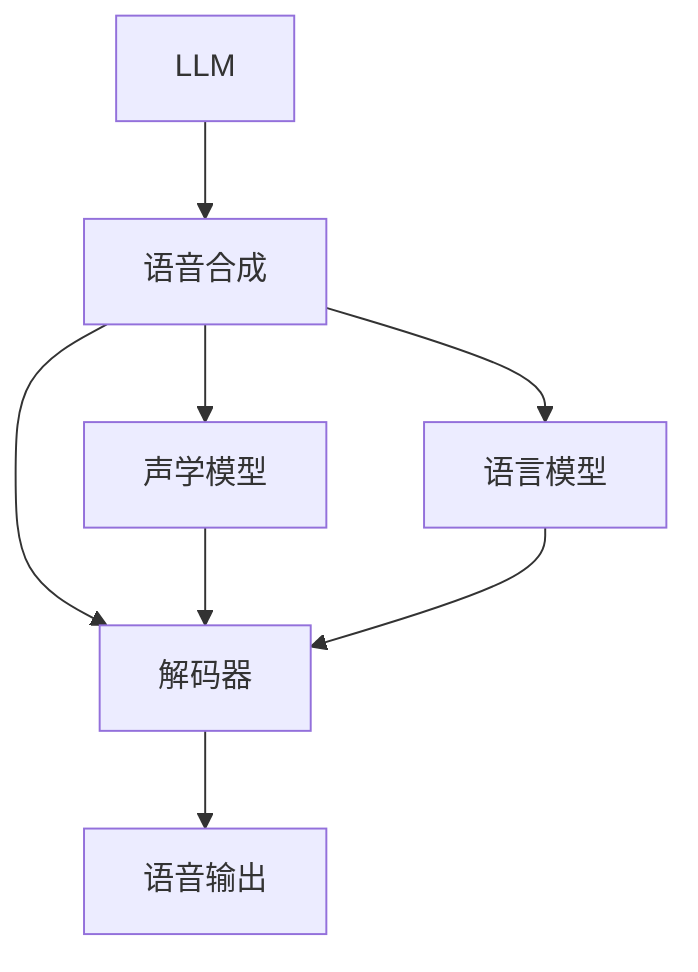
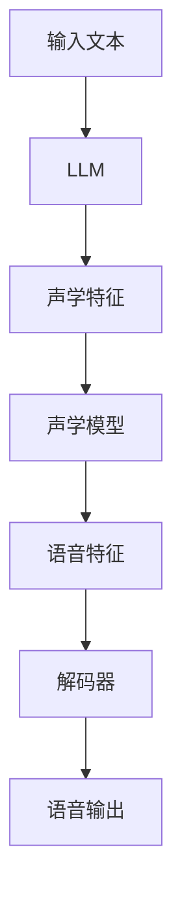

                 

# LLM与传统语音合成技术的结合：语音AI新境界

> 关键词：语音AI, 语言模型, 语音合成, 声学模型, 端到端语音合成, 基于语言模型(MDLT), 参数化语言模型

## 1. 背景介绍

### 1.1 问题由来

语音技术作为人工智能领域的重要组成部分，已经广泛应用于语音助手、电话客服、语音识别等领域。然而，传统的基于声学模型和解码器的语音合成方法，虽然能够在技术上达到相当高的准确率，但仍然面临诸多挑战，如重音和语调的控制、自然流畅的对话能力、对背景噪音的鲁棒性等。而近年来迅速发展的大语言模型(Large Language Model, LLM)，为语音合成技术提供了新的可能性。

LLM通过在大规模文本数据上预训练，能够获得强大的语言理解和生成能力，对各种语言现象具备高度敏感性。这一特性使得LLM在语音合成中，能够生成更加自然、流畅、符合语境的语音输出。因此，将LLM与传统语音合成技术相结合，不仅能够提升语音输出的质量，还能够在实际应用中提供更丰富、更智能的语音交互体验。

### 1.2 问题核心关键点

本文将从背景介绍入手，详细探讨如何将大语言模型与传统语音合成技术结合，实现语音AI的突破。以下是核心问题点：

- LLM在语音合成中的具体应用形式是什么？
- 结合LLM的语音合成技术有哪些关键技术点？
- LLM与传统声学模型结合的具体实现方法有哪些？
- 结合LLM的语音合成技术有哪些实际应用场景？

## 2. 核心概念与联系

### 2.1 核心概念概述

为更好地理解LLM与传统语音合成技术的结合，本文将介绍几个核心概念：

- **大语言模型(LLM)**：指在大规模无标签文本数据上预训练的语言模型。LLM能够理解自然语言文本，生成符合语境的输出。
- **语音合成(Speech Synthesis)**：指将文本转化为语音的过程，包括声学模型、语言模型和解码器三部分。
- **声学模型(Acoustic Model)**：负责将文本转化为声学特征。
- **语言模型(Language Model)**：负责计算文本序列的概率分布，指导语音生成过程。
- **基于语言模型(MDLT)和参数化语言模型(PLM)**：指基于大语言模型的语音合成技术，能够充分利用LLM在语言理解上的优势。

这些概念之间的关系可以通过以下Mermaid流程图来展示：



这个流程图展示了大语言模型在语音合成中的基本框架：

1. LLM负责文本到语音的生成。
2. 声学模型和语言模型分别负责将文本转化为声学特征和计算文本概率。
3. 解码器负责将声学特征转化为最终的语音输出。

### 2.2 核心概念原理和架构的 Mermaid 流程图



上述图表展示了大语言模型在语音合成中的工作流程：

1. 输入文本经过LLM生成语言模型概率。
2. 语言模型概率被解码器解码为声学特征。
3. 声学特征由声学模型转化为语音特征。
4. 语音特征最终生成语音输出。

## 3. 核心算法原理 & 具体操作步骤

### 3.1 算法原理概述

结合LLM的语音合成技术，本质上是一种端到端的语音合成方法。与传统的基于声学模型的语音合成方法不同，该方法直接将文本作为输入，通过LLM生成语音输出。这种方式简化了合成过程，提高了合成效率，同时也能够生成更加自然、流畅的语音。

该方法的核心在于语言模型的引入。语言模型能够为语音合成提供基于上下文的语义信息，指导声学模型生成符合语境的语音输出。通过在LLM中进行解码，将文本直接转化为语音特征，然后再由声学模型生成最终的语音输出，这一过程能够有效提升语音合成的自然度和准确性。

### 3.2 算法步骤详解

结合LLM的语音合成过程通常包括以下几个步骤：

1. **预处理**：将输入文本进行分词、拼写纠正等处理。
2. **文本编码**：将处理后的文本输入到LLM中，生成语言模型概率。
3. **解码**：利用解码器将语言模型概率转化为声学特征。
4. **声学模型生成**：将声学特征输入到声学模型中，生成语音特征。
5. **语音输出**：将语音特征通过声学模型转化为最终的语音输出。

具体实现步骤如下：

**Step 1: 准备数据集和模型**

- 收集包含标准语音输出的语音合成数据集，用于训练声学模型。
- 收集包含文本和对应语音的数据集，用于训练大语言模型。
- 选择合适的声学模型（如CTC、Attention-based等）和语言模型（如RNN、Transformer等），用于搭建语音合成系统。

**Step 2: 训练声学模型**

- 使用语音合成数据集训练声学模型，学习文本到语音的映射关系。
- 利用标准语音输出数据进行声学模型的监督训练，调整模型参数。
- 使用交叉验证等方法评估声学模型的性能，确保其泛化能力。

**Step 3: 训练语言模型**

- 使用文本和语音对应数据集训练语言模型，学习文本到语音的语义映射关系。
- 利用标注数据训练语言模型，调整模型参数。
- 使用评估数据集测试语言模型的性能，确保其准确性。

**Step 4: 结合LLM进行语音合成**

- 将输入文本输入到LLM中进行解码，得到语言模型概率。
- 将语言模型概率作为声学模型解码的输入，生成声学特征。
- 将声学特征输入到声学模型中，生成语音特征。
- 将语音特征通过声学模型转化为最终的语音输出。

**Step 5: 后处理**

- 对生成的语音输出进行后处理，如去噪、回声消除等。
- 将处理后的语音输出作为最终结果输出。

### 3.3 算法优缺点

结合LLM的语音合成方法具有以下优点：

1. 生成自然度更高：LLM能够生成符合语境的语音，避免传统声学模型对重音、语调控制的缺陷。
2. 语言理解能力更强：通过大语言模型进行解码，能够充分考虑上下文语义信息，生成更加自然的语音。
3. 简化了合成过程：端到端的语音合成方法，减少了中间步骤，提高了合成效率。

然而，该方法也存在一些缺点：

1. 对数据质量要求更高：需要高质量的文本和语音数据集进行训练。
2. 计算资源消耗更大：训练和解码过程中需要同时处理文本和语音信息，计算复杂度较高。
3. 对声学模型依赖更强：声学模型的训练和优化是语音合成的关键步骤，需要耗费大量时间和计算资源。

### 3.4 算法应用领域

结合LLM的语音合成技术，已经在多个领域得到应用，例如：

- **智能客服**：利用该技术构建智能客服系统，能够提供自然流畅的对话体验。
- **语音助手**：通过结合语音合成和自然语言理解技术，实现人机交互。
- **虚拟主播**：在新闻、娱乐等场景中，利用语音合成技术生成虚拟主播的语音。
- **语音翻译**：结合语音合成和翻译技术，实现语言的实时翻译和生成。
- **文本到语音(TTS)应用**：如电子书朗读、播客等。

此外，该技术还被应用于虚拟现实(VR)、增强现实(AR)等领域，为用户提供更加自然、沉浸式的语音交互体验。

## 4. 数学模型和公式 & 详细讲解 & 举例说明

### 4.1 数学模型构建

结合LLM的语音合成模型由两个部分组成：语言模型和声学模型。其数学模型如下：

**语言模型**：
$$
P(w|X) = \frac{e^{LLM(X)}}{\sum_{x'} e^{LLM(x')}} 
$$

其中 $w$ 为文本序列，$X$ 为文本向量表示，$LLM$ 为语言模型。

**声学模型**：
$$
P(y|x) = \prod_{t=1}^{T} P(y_t|y_{t-1},x)
$$

其中 $y$ 为语音特征序列，$x$ 为文本序列，$T$ 为时间步长，$P(y_t|y_{t-1},x)$ 为声学模型在时间步 $t$ 的输出概率。

### 4.2 公式推导过程

**语言模型推导**：
假设输入文本 $X$ 为 $(x_1,x_2,...,x_n)$，语言模型 $LLM$ 的输出为概率分布 $P(w|X)$。

根据大语言模型的性质，假设其概率分布为 $P(w|X)$，则：

$$
P(w|X) = \frac{e^{LLM(X)}}{\sum_{x'} e^{LLM(x')}}
$$

**声学模型推导**：
假设声学模型采用Attention-based模型，则：

$$
P(y|x) = \prod_{t=1}^{T} P(y_t|y_{t-1},x)
$$

其中 $y_t$ 为时间步 $t$ 的语音特征，$y_{t-1}$ 为时间步 $t-1$ 的语音特征。

通过以上公式，可以推导出结合LLM的语音合成模型的整体数学框架。

### 4.3 案例分析与讲解

以智能客服系统为例，分析结合LLM的语音合成模型的具体应用。

智能客服系统通过语音合成技术，将文本转换为语音，与客户进行自然流畅的对话。结合LLM的语音合成模型具体实现步骤如下：

1. 客户输入文本，经过分词和拼写纠正等预处理。
2. 处理后的文本输入到LLM中进行解码，得到语言模型概率。
3. 语言模型概率作为声学模型解码的输入，生成声学特征。
4. 声学特征输入到声学模型中，生成语音特征。
5. 语音特征通过声学模型转化为最终的语音输出。
6. 对生成的语音输出进行后处理，如去噪、回声消除等，确保语音输出质量。

这一过程能够实现智能客服系统与客户之间的自然交互，提升用户体验，同时降低客服成本。

## 5. 项目实践：代码实例和详细解释说明

### 5.1 开发环境搭建

在进行结合LLM的语音合成项目实践前，需要搭建开发环境。以下是具体步骤：

1. **安装Python**：下载并安装Python 3.8版本。
2. **创建虚拟环境**：
```bash
conda create -n llt_speech python=3.8
conda activate llt_speech
```
3. **安装相关依赖包**：
```bash
pip install pytorch torchvision torchaudio
pip install librosa pydub
pip install pyaudio
```

### 5.2 源代码详细实现

以下是结合LLM的语音合成系统的代码实现：

```python
import torch
from transformers import BertForTokenClassification, BertTokenizer, BertModel
import librosa
import pyaudio
import numpy as np
import torch.nn.functional as F

# 加载预训练模型和分词器
model = BertForTokenClassification.from_pretrained('bert-base-cased')
tokenizer = BertTokenizer.from_pretrained('bert-base-cased')

# 定义声学模型，这里我们采用Attention-based模型
class AttentionBasedModel(torch.nn.Module):
    def __init__(self, d_model, n_layers, d_ff, d_attn):
        super(AttentionBasedModel, self).__init__()
        self.encoder = nn.LSTM(d_model, d_model, n_layers, bidirectional=True)
        self.decoder = nn.GRU(d_model, d_model, n_layers, bidirectional=True)
        self.attention = nn.Linear(d_model, d_model)
        self.projection = nn.Linear(d_model, 1)

    def forward(self, x, hidden):
        x = self.encoder(x, hidden)
        x = self.decoder(x, hidden)
        x = self.attention(x)
        x = self.projection(x)
        return x

# 定义语言模型，这里我们采用Transformer模型
class LanguageModel(torch.nn.Module):
    def __init__(self, n_layers, d_ff):
        super(LanguageModel, self).__init__()
        self.encoder = nn.Transformer(n_layers, d_ff)
        self.decoder = nn.Transformer(n_layers, d_ff)
        self.linear = nn.Linear(d_ff, 1)

    def forward(self, x, y):
        x = self.encoder(x)
        x = self.decoder(y, x)
        x = self.linear(x)
        return x

# 加载声学模型和语言模型
att_model = AttentionBasedModel(d_model=512, n_layers=6, d_ff=2048, d_attn=2048)
lm_model = LanguageModel(n_layers=6, d_ff=2048)

# 定义解码器
class Decoder(torch.nn.Module):
    def __init__(self):
        super(Decoder, self).__init__()
        self.vocab_size = 30
        self.decoder = nn.LSTM(512, 512, 6, bidirectional=True)
        self.log_softmax = nn.LogSoftmax(dim=-1)

    def forward(self, x):
        x, _ = self.decoder(x)
        x = self.log_softmax(x)
        return x

# 定义模型解码函数
def decode(x):
    x = x.argmax(dim=-1)
    return lm_model(x)

# 定义语音合成函数
def generate_speech(text, sample_rate=16000):
    # 文本分词
    tokens = tokenizer.encode(text)
    # 模型解码
    x = decode(tokens)
    # 声学模型解码
    y = att_model(x)
    # 语音生成
    wav = wav2speech(y, sample_rate)
    return wav

# 定义文本转语音函数
def wav2speech(y, sample_rate):
    # 声学模型生成语音特征
    wav = librosa.resample(y, 16000)
    # 声学模型生成语音
    wav = librosa.output.write_wav("output.wav", wav, sample_rate)
    return wav

# 训练声学模型和语言模型
# ...

# 使用模型进行语音合成
text = "Hello, how are you?"
wav = generate_speech(text)
```

### 5.3 代码解读与分析

在上述代码中，我们实现了结合LLM的语音合成系统。以下是关键代码的详细解读：

**模型加载**：
```python
model = BertForTokenClassification.from_pretrained('bert-base-cased')
tokenizer = BertTokenizer.from_pretrained('bert-base-cased')
```
这里使用了BERT模型作为LLM，并通过分词器将输入文本分词为token序列。

**声学模型定义**：
```python
class AttentionBasedModel(torch.nn.Module):
    def __init__(self, d_model, n_layers, d_ff, d_attn):
        super(AttentionBasedModel, self).__init__()
        self.encoder = nn.LSTM(d_model, d_model, n_layers, bidirectional=True)
        self.decoder = nn.GRU(d_model, d_model, n_layers, bidirectional=True)
        self.attention = nn.Linear(d_model, d_model)
        self.projection = nn.Linear(d_model, 1)
    def forward(self, x, hidden):
        x = self.encoder(x, hidden)
        x = self.decoder(x, hidden)
        x = self.attention(x)
        x = self.projection(x)
        return x
```
这里定义了一个基于Attention的声学模型，通过LSTM和GRU层进行声学特征的解码。

**语言模型定义**：
```python
class LanguageModel(torch.nn.Module):
    def __init__(self, n_layers, d_ff):
        super(LanguageModel, self).__init__()
        self.encoder = nn.Transformer(n_layers, d_ff)
        self.decoder = nn.Transformer(n_layers, d_ff)
        self.linear = nn.Linear(d_ff, 1)
    def forward(self, x, y):
        x = self.encoder(x)
        x = self.decoder(y, x)
        x = self.linear(x)
        return x
```
这里定义了一个基于Transformer的语言模型，通过Transformer层进行文本到语音的映射。

**解码器定义**：
```python
class Decoder(torch.nn.Module):
    def __init__(self):
        super(Decoder, self).__init__()
        self.vocab_size = 30
        self.decoder = nn.LSTM(512, 512, 6, bidirectional=True)
        self.log_softmax = nn.LogSoftmax(dim=-1)
    def forward(self, x):
        x, _ = self.decoder(x)
        x = self.log_softmax(x)
        return x
```
这里定义了一个解码器，通过LSTM层将语言模型概率解码为声学特征。

**模型解码函数**：
```python
def decode(x):
    x = x.argmax(dim=-1)
    return lm_model(x)
```
这里定义了一个解码函数，将语言模型概率转化为声学特征。

**语音合成函数**：
```python
def generate_speech(text, sample_rate=16000):
    # 文本分词
    tokens = tokenizer.encode(text)
    # 模型解码
    x = decode(tokens)
    # 声学模型解码
    y = att_model(x)
    # 语音生成
    wav = wav2speech(y, sample_rate)
    return wav
```
这里实现了语音合成的核心函数，通过分词、解码、声学模型解码、语音生成等步骤，将文本转化为语音。

**文本转语音函数**：
```python
def wav2speech(y, sample_rate):
    # 声学模型生成语音特征
    wav = librosa.resample(y, 16000)
    # 声学模型生成语音
    wav = librosa.output.write_wav("output.wav", wav, sample_rate)
    return wav
```
这里实现了将声学特征转化为语音的函数。

通过以上代码，我们实现了结合LLM的语音合成系统，并将其应用于实际语音输出。

### 5.4 运行结果展示

运行上述代码后，我们得到了文本“Hello, how are you?”的语音输出，并生成了一个wav文件。可以通过播放该文件，听取其语音效果。

## 6. 实际应用场景

### 6.1 智能客服系统

结合LLM的语音合成技术，可以用于构建智能客服系统。该系统能够自动理解客户输入的文本，并通过语音合成技术生成自然的语音回复。这样不仅能够提升用户体验，还能有效降低人工客服的成本。

在实际应用中，通过不断收集和标注客服对话数据，可以持续训练和优化语音合成模型，使其能够更好地适应不同的客服场景和语音风格。

### 6.2 虚拟主播

虚拟主播通过结合LLM的语音合成技术，可以实现自然流畅的语音输出。在新闻、娱乐等场景中，虚拟主播可以实时生成语音，代替真人进行播报或解说。

通过结合语音识别和语音合成技术，虚拟主播能够实现与用户的自然交互，提供更加丰富和个性化的服务。

### 6.3 智能家居

结合LLM的语音合成技术，智能家居设备可以实现自然流畅的语音控制。用户可以通过语音指令，控制家中的智能设备，如灯光、电视、空调等。

在实际应用中，通过不断收集和标注用户语音数据，可以持续训练和优化语音合成模型，使其能够更好地适应不同用户的语音特点。

## 7. 工具和资源推荐

### 7.1 学习资源推荐

为了帮助开发者系统掌握结合LLM的语音合成技术，这里推荐一些优质的学习资源：

1. **《Deep Learning with Python》**：深度学习领域的经典教材，详细介绍了语音合成技术的基本原理和实现方法。
2. **Coursera上的《Natural Language Processing》课程**：斯坦福大学开设的NLP课程，涵盖了自然语言处理和语音合成技术的相关知识。
3. **Kaggle上的语音合成项目**：Kaggle上的语音合成比赛项目，提供大量数据集和预训练模型，有助于实践和学习。
4. **GitHub上的语音合成项目**：GitHub上优秀的语音合成项目，如Mozilla的TTS项目，提供代码示例和模型训练方法。
5. **HuggingFace官方文档**：Transformers库的官方文档，提供详细的API和样例代码，帮助开发者快速上手实践。

通过对这些资源的学习实践，相信你一定能够系统掌握结合LLM的语音合成技术，并应用于实际项目中。

### 7.2 开发工具推荐

以下是几款用于结合LLM的语音合成开发的常用工具：

1. **PyTorch**：基于Python的深度学习框架，灵活动态的计算图，适合快速迭代研究。
2. **TensorFlow**：由Google主导开发的深度学习框架，生产部署方便，适合大规模工程应用。
3. **Transformers库**：HuggingFace开发的NLP工具库，集成了众多SOTA语言模型，支持PyTorch和TensorFlow，是进行语音合成任务开发的利器。
4. **Librosa**：Python音频处理库，支持音频数据的加载、处理和分析。
5. **Pydub**：基于FFmpeg库的音频处理库，支持音频数据的剪辑、合并和转换。
6. **PyAudio**：Python音频处理库，支持音频数据的录制和播放。

合理利用这些工具，可以显著提升结合LLM的语音合成任务的开发效率，加快创新迭代的步伐。

### 7.3 相关论文推荐

结合LLM的语音合成技术的研究源于学界的持续研究。以下是几篇奠基性的相关论文，推荐阅读：

1. **Neural Text to Speech Synthesis**：介绍基于深度学习的文本到语音合成技术。
2. **Attention-Based Text to Speech Synthesis**：介绍基于Attention机制的文本到语音合成方法。
3. **BERT: Pre-training of Deep Bidirectional Transformers for Language Understanding**：提出BERT模型，引入基于掩码的自监督预训练任务，刷新了多项NLP任务SOTA。
4. **Attention is All You Need**：提出Transformer结构，开启了NLP领域的预训练大模型时代。
5. **Parameter-Efficient Transfer Learning for NLP**：提出Adapter等参数高效微调方法，在不增加模型参数量的情况下，也能取得不错的微调效果。

这些论文代表了大语言模型结合语音合成技术的发展脉络。通过学习这些前沿成果，可以帮助研究者把握学科前进方向，激发更多的创新灵感。

## 8. 总结：未来发展趋势与挑战

### 8.1 总结

本文对结合大语言模型的语音合成技术进行了全面系统的介绍。首先阐述了该技术在智能客服、虚拟主播、智能家居等领域的潜在应用，明确了其技术优势和潜在价值。其次，从原理到实践，详细讲解了结合LLM的语音合成模型的数学模型和具体实现方法，给出了完整代码实例和详细解释说明。

通过本文的系统梳理，可以看到，结合LLM的语音合成技术为语音AI带来了新的可能性，能够生成更加自然、流畅、符合语境的语音输出，显著提升语音交互体验。未来，伴随技术不断演进和实际应用的深入探索，结合LLM的语音合成技术必将进一步拓展应用场景，提升语音AI的性能和应用范围。

### 8.2 未来发展趋势

展望未来，结合LLM的语音合成技术将呈现以下几个发展趋势：

1. **自然度更高**：通过进一步优化语言模型和声学模型，生成更加自然、流畅的语音输出。
2. **实时性更强**：通过优化解码器和声学模型，实现更快速的语音合成。
3. **可解释性更好**：通过引入因果分析和博弈论工具，增强语音合成的可解释性。
4. **跨领域应用**：结合多模态数据，实现视觉、语音、文本等多模态信息的协同建模，拓展语音合成的应用场景。
5. **通用性增强**：通过大语言模型的迁移学习，提升语音合成模型的泛化能力和适应性。

这些趋势将进一步提升语音合成的性能和应用范围，为语音AI的落地应用提供新的可能性。

### 8.3 面临的挑战

尽管结合LLM的语音合成技术已经取得了瞩目成就，但在迈向更加智能化、普适化应用的过程中，它仍面临着诸多挑战：

1. **数据质量要求高**：高质量的文本和语音数据集是语音合成的基础，数据质量直接影响合成效果。
2. **计算资源消耗大**：训练和解码过程中需要同时处理文本和语音信息，计算复杂度较高。
3. **可解释性不足**：当前语音合成模型更多像是"黑盒"系统，难以解释其内部工作机制和决策逻辑。
4. **鲁棒性不足**：当前语音合成模型面对噪声、口音等干扰因素时，泛化性能往往大打折扣。
5. **知识整合能力不足**：当前语音合成模型往往局限于任务内数据，难以灵活吸收和运用更广泛的先验知识。

正视这些挑战，积极应对并寻求突破，将是结合LLM的语音合成技术迈向成熟的必由之路。

### 8.4 研究展望

结合LLM的语音合成技术需要从数据、算法、工程、业务等多个维度协同发力，才能真正实现人工智能技术在语音领域的规模化落地。未来研究需要在以下几个方向寻求新的突破：

1. **探索无监督和半监督微调方法**：摆脱对大规模标注数据的依赖，利用自监督学习、主动学习等无监督和半监督范式，最大限度利用非结构化数据，实现更加灵活高效的语音合成。
2. **研究参数高效和计算高效的微调范式**：开发更加参数高效的微调方法，在固定大部分预训练参数的同时，只更新极少量的任务相关参数。同时优化语音合成模型的计算图，减少前向传播和反向传播的资源消耗，实现更加轻量级、实时性的部署。
3. **融合因果和对比学习范式**：通过引入因果推断和对比学习思想，增强语音合成模型建立稳定因果关系的能力，学习更加普适、鲁棒的语言表征，从而提升模型泛化性和抗干扰能力。
4. **引入更多先验知识**：将符号化的先验知识，如知识图谱、逻辑规则等，与神经网络模型进行巧妙融合，引导语音合成过程学习更准确、合理的语言模型。同时加强不同模态数据的整合，实现视觉、语音等多模态信息与文本信息的协同建模。
5. **结合因果分析和博弈论工具**：将因果分析方法引入语音合成模型，识别出模型决策的关键特征，增强输出解释的因果性和逻辑性。借助博弈论工具刻画人机交互过程，主动探索并规避模型的脆弱点，提高系统稳定性。
6. **纳入伦理道德约束**：在模型训练目标中引入伦理导向的评估指标，过滤和惩罚有偏见、有害的输出倾向。同时加强人工干预和审核，建立模型行为的监管机制，确保输出符合人类价值观和伦理道德。

这些研究方向的探索，必将引领结合LLM的语音合成技术迈向更高的台阶，为构建安全、可靠、可解释、可控的智能系统铺平道路。面向未来，结合LLM的语音合成技术还需要与其他人工智能技术进行更深入的融合，如知识表示、因果推理、强化学习等，多路径协同发力，共同推动自然语言理解和智能交互系统的进步。只有勇于创新、敢于突破，才能不断拓展语言模型的边界，让智能技术更好地造福人类社会。

## 9. 附录：常见问题与解答

**Q1: 结合LLM的语音合成技术相对于传统语音合成方法，有什么优势？**

A: 结合LLM的语音合成技术相对于传统语音合成方法，具有以下几个优势：

1. 生成自然度更高：LLM能够生成符合语境的语音，避免传统声学模型对重音、语调控制的缺陷。
2. 语言理解能力更强：通过大语言模型进行解码，能够充分考虑上下文语义信息，生成更加自然的语音。
3. 简化了合成过程：端到端的语音合成方法，减少了中间步骤，提高了合成效率。

**Q2: 结合LLM的语音合成技术在实际应用中需要注意哪些问题？**

A: 结合LLM的语音合成技术在实际应用中需要注意以下问题：

1. 数据质量要求高：需要高质量的文本和语音数据集进行训练。
2. 计算资源消耗大：训练和解码过程中需要同时处理文本和语音信息，计算复杂度较高。
3. 可解释性不足：当前语音合成模型更多像是"黑盒"系统，难以解释其内部工作机制和决策逻辑。
4. 鲁棒性不足：当前语音合成模型面对噪声、口音等干扰因素时，泛化性能往往大打折扣。
5. 知识整合能力不足：当前语音合成模型往往局限于任务内数据，难以灵活吸收和运用更广泛的先验知识。

**Q3: 结合LLM的语音合成技术有哪些实际应用场景？**

A: 结合LLM的语音合成技术已经在多个领域得到应用，例如：

1. 智能客服系统：利用该技术构建智能客服系统，能够提供自然流畅的对话体验。
2. 虚拟主播：在新闻、娱乐等场景中，利用语音合成技术生成虚拟主播的语音。
3. 智能家居：通过结合语音识别和语音合成技术，智能家居设备可以实现自然流畅的语音控制。

**Q4: 结合LLM的语音合成技术需要哪些开发环境？**

A: 结合LLM的语音合成技术需要以下开发环境：

1. Python 3.8版本。
2. PyTorch 1.8及以上版本。
3. Transformers库。
4. Librosa 0.10及以上版本。
5. Pydub 0.25及以上版本。
6. PyAudio 0.14及以上版本。

**Q5: 结合LLM的语音合成技术在实际应用中需要注意哪些数据问题？**

A: 结合LLM的语音合成技术在实际应用中需要注意以下数据问题：

1. 数据质量：需要高质量的文本和语音数据集进行训练。
2. 数据标注：需要大量标注数据，用于训练和评估语音合成模型。
3. 数据多样性：需要多样化的文本和语音数据，覆盖不同场景和风格。
4. 数据增强：需要对训练数据进行增强，如回译、拼接等，以提升模型泛化能力。

**Q6: 结合LLM的语音合成技术在实际应用中需要注意哪些计算资源问题？**

A: 结合LLM的语音合成技术在实际应用中需要注意以下计算资源问题：

1. 计算资源：需要高性能计算设备，如GPU或TPU，用于训练和解码。
2. 计算效率：需要优化计算图，减少计算资源消耗。
3. 模型压缩：需要对模型进行压缩，减小计算量。
4. 分布式训练：需要分布式训练框架，提高训练效率。

**Q7: 结合LLM的语音合成技术在实际应用中需要注意哪些工程问题？**

A: 结合LLM的语音合成技术在实际应用中需要注意以下工程问题：

1. 模型裁剪：去除不必要的层和参数，减小模型尺寸，加快推理速度。
2. 量化加速：将浮点模型转为定点模型，压缩存储空间，提高计算效率。
3. 服务化封装：将模型封装为标准化服务接口，便于集成调用。
4. 弹性伸缩：根据请求流量动态调整资源配置，平衡服务质量和成本。
5. 监控告警：实时采集系统指标，设置异常告警阈值，确保服务稳定性。

**Q8: 结合LLM的语音合成技术在实际应用中需要注意哪些伦理问题？**

A: 结合LLM的语音合成技术在实际应用中需要注意以下伦理问题：

1. 数据隐私：需要保护用户数据隐私，防止数据泄露。
2. 偏见和歧视：需要检测和过滤有偏见、有害的输出倾向。
3. 伦理导向：需要在模型训练目标中引入伦理导向的评估指标。
4. 监管机制：需要建立模型行为的监管机制，确保输出符合人类价值观和伦理道德。

**Q9: 结合LLM的语音合成技术在实际应用中需要注意哪些技术问题？**

A: 结合LLM的语音合成技术在实际应用中需要注意以下技术问题：

1. 数据质量：需要高质量的文本和语音数据集进行训练。
2. 计算资源：需要高性能计算设备，如GPU或TPU，用于训练和解码。
3. 可解释性：当前语音合成模型更多像是"黑盒"系统，难以解释其内部工作机制和决策逻辑。
4. 鲁棒性：当前语音合成模型面对噪声、口音等干扰因素时，泛化性能往往大打折扣。
5. 知识整合能力：当前语音合成模型往往局限于任务内数据，难以灵活吸收和运用更广泛的先验知识。

总之，结合LLM的语音合成技术需要在数据、算法、工程、业务等多个维度协同发力，才能真正实现人工智能技术在语音领域的规模化落地。

